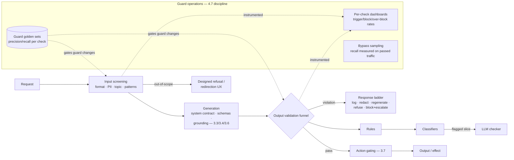

# Chapter 4.8 — Guardrails & Content Safety

| | |
|---|---|
| **Part** | 4 — Enterprise GenAI Systems |
| **Maturity level** | 3 — Engineer |
| **Difficulty** | Advanced |
| **Estimated study time** | 3–4 hours (reading 2 h, exercise 90 min) |
| **Prerequisites** | [3.4](../part-3-core-building-blocks-of-genai/chapter-04-structured-outputs.md); [3.6](../part-3-core-building-blocks-of-genai/chapter-06-rag-fundamentals.md); [4.7](chapter-07-evaluation-systems.md) |

## Learning Objectives

After this chapter you will be able to:

1. Design the layered guardrail architecture: input screening, in-generation constraints, output validation, and action gating — each layer catching what the previous can't.
2. Choose guardrail implementations per check class: rules and patterns, classifier models, LLM-based checkers — matched by latency, cost, and the error-tolerance of the check.
3. Engineer the policy layer: what "unsafe" means for *this* system, encoded as testable policy with owners — and the refusal/redirection UX that keeps guarded systems usable.
4. Operate guardrails: precision/recall tuning per check, bypass monitoring, incident response, and the guardrail estate's own evaluation.

## Introduction

Guardrails are the runtime enforcement layer — where evaluation's *definitions* of acceptable (4.7) become per-request *decisions*. The distinction matters: evals measure quality statistically, offline and sampled; guardrails act on every request, online, in the latency budget, with no human in the moment. They are the deterministic shell's (3.1) policy walls: the components that ensure that even when the model does something the evals would have scored zero, the *system's* output stays inside its contract.

Two calibrations before the mechanics. First, guardrails *manage* the failure modes — they are rate-reducers, not eliminators (3.1's hallucination honesty applies to the guards themselves: a safety classifier is a model with its own precision/recall — 2.7's toolkit governs the guards too). Second, guardrails are *not* the security boundary — they overlap with 4.9's concerns (a jailbreak filter is both), but security's adversarial frame (a motivated attacker probing systematically) demands more than content policy; this chapter builds the policy-enforcement machinery, and 4.9 stress-tests it against adversaries.

## Business Motivation

Guardrails are the difference between a model's failure and a *company's* incident. The model saying something wrong is a quality statistic (4.7's territory); the company's chatbot saying it to a customer is a screenshot, a news cycle, and — increasingly — a legal finding (the airline chatbot whose invented refund policy was held binding is the canonical case; 3.1's incident, adjudicated). The exposure classes map to guardrail layers: **brand and legal exposure** from output content (toxicity, competitor disparagement, unlicensed advice, binding-sounding commitments — output validation's territory), **regulatory exposure** from domain lines (medical/legal/financial advice boundaries, minor-safety rules, the 2.8 tier obligations — policy-layer territory), **data exposure** from leakage in both directions (PII entering prompts, secrets leaving in completions — screening territory), and **action exposure** where outputs trigger effects (3.7's consequence gates as the last guardrail). The economics are asymmetric in the guards' favor: a layered guardrail stack costs milliseconds and fractions of a cent per request (with the expensive checks reserved for the risky slice — the routing logic this chapter builds), against incident costs measured in recalls, filings, and frozen programs (2.8's incident tax). The countervailing cost that keeps the engineering honest: **over-blocking is also a failure** — a guarded system that refuses legitimate work bleeds the trust and adoption (1.2's stock) the system exists to build, and the false-positive rate is a business metric, not a rounding error.

## Theory

### The layered architecture

Four layers, each with a distinct job and failure profile:

1. **Input screening** — before the model: format and size validation (cheap, first), PII/secret detection (redact or block per policy — the both-directions data guard), topic/intent classification (out-of-scope routing — 1.6's refusal boundary enforced pre-model, which is cheaper and safer than asking the model to refuse), and attack-pattern screening (known jailbreak formats — with 4.9's caveat that pattern-matching is the weakest of defenses, present for the noise it filters rather than the adversary it won't stop).
2. **In-generation constraints** — shaping what the model *can* produce: the system prompt's behavioral contract (3.3 — necessary, never sufficient: prompts are requests, not controls — 3.7's lesson), constrained decoding and schemas where structure permits (3.4 — the strongest constraint available, because invalid output becomes *unproducible*), and grounding contracts (3.6 — the anti-hallucination layer for knowledge claims).
3. **Output validation** — after the model, before the user: schema and format checks (3.4's pipeline), policy classifiers (toxicity, unsafe-content categories — usually small fast models), domain-specific checks (the liability-phrase blocklist (Kestrel, 1.6), the medical-advice line, competitor-mention rules — the checks *nobody sells off the shelf* because they encode your policy), claim-level checks where stakes warrant (citation validation (3.6), numeric-consistency checks (3.4's semantic rung)), and PII/secret scanning outbound.
4. **Action gating** — where output becomes effect: 3.7's consequence classes and approval gates, unchanged, as the final layer — the guard that matters most because it guards the irreversible.

The layering logic is defense-in-depth with *differentiated failure tolerance*: input screening can afford false positives on attack patterns (a re-prompt costs little) but not on topic routing (blocking legitimate users is the adoption tax); output validation is the last content gate and tunes toward recall on the catastrophic classes (better to over-block the truly radioactive) while staying precision-honest on the merely awkward.

### Implementation classes per check

| Class | Latency/cost | Strengths | Weaknesses | Use for |
|---|---|---|---|---|
| Rules/patterns/blocklists | ~free | Deterministic, auditable, instant to update | Brittle, no paraphrase coverage | Known phrases (liability blocklist), formats, hard lines |
| Small classifier models | ms, cheap | Paraphrase-robust, tunable thresholds | Training/calibration burden (2.7's full toolkit) | Toxicity, PII, topic routing, jailbreak-pattern classes |
| LLM-based checkers | 100ms+, real cost | Nuanced judgment, policy-describable | Expensive; itself gameable (a model guarding a model — 4.9); variance | Complex policy calls on the routed risky slice; claim-level checks |

The routing pattern that makes the economics work: **cheap checks screen everything; expensive checks screen what the cheap ones flag** (the funnel again — 4.2's shape, applied to safety). A three-tier stack (rules → classifier → LLM checker on the flagged 3%) delivers most of the LLM checker's judgment at a fraction of its cost and latency — and the tiers are individually versioned, evaluated instruments (4.7's fleet discipline: every guard has a golden set, a precision/recall profile, and a calibration owner).

### The policy layer: deciding what "unsafe" means here

The engineering is generic; the policy is yours. The artifacts: a **policy specification** per system — the enumerated categories of unacceptable input and output, *with examples and counter-examples* (the example-sorting method (1.6) applied to safety: legal, compliance, and the business owner sorting borderline cases is how the policy becomes testable rather than vibes), each category mapped to its enforcing layer and check; **severity tiers** driving the response ladder — not every violation blocks: the ladder runs log-only (monitoring classes) → redact/rewrite (PII, formatting) → regenerate with feedback (3.4's re-ask for policy) → refuse with designed UX → block-and-escalate (the radioactive classes, with human notification); and **the refusal UX as a product surface** (3.6's designed refusal, generalized): guarded systems that refuse gracelessly ("I can't help with that") teach users the system is broken; the designed version explains the boundary, offers the adjacent legitimate path, and routes to humans where the need is real — the difference between a guardrail and a wall.

### Operating the estate

Guards are instruments in production: **per-check dashboards** (trigger rates, block rates, severity mix — a trigger-rate *spike* is an incident signal (attack, upstream change, or a policy drift in user behavior); a trigger-rate *collapse* is a broken check); **false-positive management** (user-reported over-blocks sampled into the check's golden set — the 4.7 supply chain, safety edition; over-block rates per check as standing business metrics); **bypass monitoring** (sampled human review of *passed* traffic on the risky classes — the guard's recall measured continuously, not assumed); and **the update cadence** — blocklists update in minutes (their virtue), classifiers retrain on schedules, LLM-checker prompts version like any prompt (3.3) — with the whole estate's changes riding release discipline, because a guard change is a behavior change at maximum blast radius.

## Architecture Perspective

Readings. **Guards are a funnel of versioned instruments** — the same funnel economics as retrieval (4.2), the same instrument governance as judges (4.7): golden sets, calibration, provenance-stamped decisions (every block/pass carries its check versions, which is what makes guard incidents diagnosable and guard evidence auditable — 2.8's oversight logging, generated structurally). **The policy layer is configuration above the machinery** — one guardrail platform (7.9: shared classifiers, funnel plumbing, dashboards) serves many systems, each bringing its policy spec, severity ladder, and domain checks; the platform/content split for the third time in this Part, and the reason guardrail engineering consolidates well. **Latency is the design constraint that shapes everything** — guards live in the request path (4.12's budget): the funnel keeps the p50 cheap, streaming complicates output validation (checking content that's already rendering — the practical answers: validate-then-stream for short outputs, incremental checking with retraction UX for long ones, or hold-the-risky-classes policies), and the latency-vs-coverage trade is a per-system policy decision recorded like any other (1.4).

## Real-world Example

**Bellhaven Insurance** (1.3, 2.8, 3.4) built its guardrail estate for the customer-facing policy assistant (a different risk world than the internal intake platform — the same company making different trades per audience, 4.1's coda). The policy workshop came first: legal, compliance, the contact-center director, and Renata's team sorting 120 borderline transcripts into the severity ladder — producing the policy spec whose hardest calls were *not* the obvious ones (toxicity was easy; the killers were **binding-language risk** — phrasings a court could read as coverage commitments — and the **advice line** — where "explaining your policy" becomes "advising your claim strategy," a regulated boundary). Both became domain checks no vendor sold: a binding-language classifier trained on legal's sorted examples (with the blocklist of absolutely-radioactive phrasings as the deterministic layer under it), and an advice-line LLM checker running on the classifier-flagged slice.

The operating history taught three lessons. **The over-block bleed:** month two's dashboards showed the advice-line check blocking 7% of traffic — sampled review found most were legitimate policy explanations; the check's recall-tuned threshold was taxing adoption (the contact-center director's escalation: "the bot refuses more than my worst agent"). The fix was the funnel working as designed — threshold loosened at the classifier tier, the LLM checker's nuance catching the real line, over-blocks to 1.4% with bypass sampling confirming recall held. **The trigger-rate spike as tripwire:** a Reddit thread's jailbreak recipe produced a 40× spike on the pattern check overnight; the check caught the naive copies while the platform team watched the *bypass samples* for the variants that got through (they existed — 4.9's chapter-opening lesson: patterns filter noise, not adversaries) and shipped a classifier update within the week. **The response-ladder save:** a model upgrade (2.6's re-release) shifted completion phrasing such that the binding-language classifier's trigger rate tripled — but the ladder's *regenerate-with-feedback* tier absorbed it invisibly (completions re-drafted with the flag as feedback, users never seeing a refusal) while the alert drove the calibration review (4.7's instrument discipline: the system changed, the ruler was fine, the prompt contract got a reinforcing line). Renata's summary for the 2.8-mandated oversight documentation: *"The guards don't make the model safe. They make the system's promises keepable — and they write their own evidence."*

## Hands-on Exercise

**Build a three-tier guard funnel with honest measurement.** Extends your 3.3/3.6 artifacts. ~90 minutes. Scenario: your support-triage or RAG system gains a policy: no legal advice, no PII passthrough, no competitor disparagement, plus your domain's one "binding-language"-style custom class.

1. **Policy spec (25 min).** Write it with the sorting method: 5 categories, each with 3 examples and 2 counter-examples (the borderline cases *are* the spec), severity tier, and response-ladder rung. This artifact is the deliverable the rest enforces.
2. **The funnel (35 min).** Implement: a blocklist/pattern tier (your radioactive phrases), a classifier tier (an LLM with a tight classification prompt at temperature 0 stands in for a trained classifier — note the substitution honestly), and an LLM-checker tier on flagged items only. Wire the response ladder: log / regenerate-with-feedback / refuse-with-designed-UX per severity.
3. **Guard evals (20 min).** Build the guard's golden set: 20 items — 8 clean, 6 violations across categories, 6 *borderline* (from your counter-examples). Measure per-tier and end-to-end precision/recall. State the over-block rate as a business metric.
4. **The bypass probe (10 min).** Write 3 paraphrase attacks on your blocklist tier (say the radioactive thing without the radioactive words); verify the classifier tier's coverage; record what got through — your first bypass-monitoring sample.

**Acceptance criteria:**
- [ ] Policy spec has examples *and* counter-examples per category, mapped to tiers and ladder rungs
- [ ] Funnel demonstrably routes: pattern-hits fast, classifier-flags to the checker, severities to different ladder rungs
- [ ] Precision/recall measured per tier with the borderline cases doing the discriminating; over-block rate stated
- [ ] Refusal UX explains the boundary and offers a path — not a bare "can't help"
- [ ] Bypass probe results recorded honestly, including what passed

## Enterprise Considerations

The guardrail estate is where safety policy, law, and engineering meet weekly. **Policy governance needs a standing body:** the severity ladder and category definitions change as law, products, and incidents evolve — the policy spec has an owner, a review cadence, and a change process with legal at the table (6.9's lane; the rubric-as-policy-document discipline from 4.7, sharpened: in regulated deployments the guard configuration *is* a compliance control, versioned as evidence). **Provider safety layers stack with yours:** models arrive with alignment-trained refusals (2.6) and providers offer safety APIs — the estate design treats these as *outer layers you don't control* (they change on the provider's schedule — Bellhaven's trigger-rate triple) and builds your policy-specific enforcement independently; never outsource your domain lines to a general-purpose safety tier. **Multilingual guards multiply like everything else** (2.4): every classifier's per-language performance measured, blocklists per language (with the humbling discovery that radioactive phrasings don't translate literally), and the estate's coverage honestly stated per market. **And the works-council/monitoring dimension returns once more:** guards that screen *employee* interactions (the internal assistant's DLP layer) are monitoring systems under consultation rules (1.6) — scope, retention, and access to guard logs negotiated, not assumed.

## Trade-offs

| Decision | Option A | Option B | Choose A when… | Choose B when… |
|----------|----------|----------|----------------|----------------|
| Enforcement point | Pre-model topic routing | Model-refusal reliance | The boundary is knowable from input (cheaper, safer, designable UX) | Boundary requires seeing the output; then output validation, never prompt-hope alone |
| Check implementation | Funnel (rules → classifier → LLM) | Single-tier LLM checking | Default — economics and latency | Tiny traffic where funnel plumbing outweighs per-call cost |
| Violation response | Regenerate-with-feedback | Refuse | Mid-severity content the model can fix invisibly | Hard lines, radioactive classes, and anywhere regeneration risks laundering the violation |
| Streaming vs. validation | Validate-then-stream | Incremental check with retraction | Short outputs; hard-line policies | Long-form UX where hold-time kills usability — with the retraction UX honestly designed |

## Common Mistakes

1. **Prompt-only safety** — the system prompt as the enforcement layer; prompts are requests (3.7's gate lesson), and every layer past them exists because requests get declined.
2. **Buying "a guardrails product" instead of writing the policy** — generic toxicity filters guarding a system whose real risks are binding language and advice lines; the domain checks nobody sells are the ones that matter (Bellhaven's killers).
3. **Recall-maximizing without measuring over-blocks** — the 7% false-positive tax discovered by escalation instead of dashboard; over-block rate is a business metric with an owner.
4. **Unversioned, uneval'd guards** — the safety classifier as the one model in the stack without a golden set; guards are instruments under 4.7's full discipline, or they're vibes with latency.
5. **No bypass sampling** — recall assumed from launch testing, never measured on live passed traffic; the guard that silently stopped catching is indistinguishable from the guard that works, except by sampling.
6. **The graceless wall** — bare refusals teaching users the system is broken; the designed refusal (explanation, adjacent path, human route) is retention engineering.
7. **Ignoring provider-layer drift** — the model upgrade that shifts refusal contours and phrasing under your guards (2.6); guard suites re-run on model changes, like everything else.
8. **One estate configuration for every audience** — internal and customer-facing systems sharing thresholds; the same platform, different policy specs per risk world (4.1's coda, enforced here).

## Best Practices

1. **Write the policy spec with the sorting method** — categories with examples *and* counter-examples, severity tiers, ladder rungs; legal and the business owner in the room; versioned as the control it is.
2. **Build the funnel: rules → classifiers → LLM checkers on the flagged slice** — cheap screens everything, judgment screens the risk.
3. **Govern guards as instruments** — golden sets, precision/recall per check, calibration owners, provenance-stamped decisions, changes on release discipline.
4. **Run the response ladder, not a binary block** — log, redact, regenerate-with-feedback, designed refusal, block-and-escalate — matched to severity.
5. **Measure both error directions continuously** — over-block rates as business metrics; bypass sampling as the recall audit on passed traffic.
6. **Design the refusal as a product surface** — boundary explained, legitimate path offered, human route where the need is real.
7. **Watch trigger rates as tripwires** — spikes are attacks or upstream changes; collapses are broken checks; both alert.
8. **Keep your domain lines in your own checks** — provider safety layers as uncontrolled outer defense, your policy enforced by instruments you version.

## Architecture Checklist

For any system with users or consequences:

- [ ] Policy spec exists: categories with examples/counter-examples, severity tiers, response-ladder mapping, named owner, review cadence
- [ ] Four layers present and differentiated: input screening, in-generation constraints, output validation, action gating
- [ ] Output validation runs as a funnel; expensive checks on the flagged slice; latency budget respected per 4.12
- [ ] Every guard is a versioned instrument: golden set, precision/recall profile, calibration owner, gated changes
- [ ] Response ladder implemented; regenerate-with-feedback available for mid-severity classes
- [ ] Refusal/redirection UX designed and measured (over-block rate as a business metric)
- [ ] Bypass sampling running on passed traffic for risky classes; trigger-rate anomaly alerts in both directions
- [ ] Guard decisions logged with check versions — the oversight evidence generated structurally
- [ ] Guard suites re-run on model changes; provider safety-layer drift monitored
- [ ] Per-audience policy configurations (internal vs. customer-facing) on the shared platform

## Interview Questions

1. *"Design the guardrail architecture for a customer-facing insurance chatbot."* — Strong answers layer it (input routing, generation contracts, output funnel, action gates), name the domain checks generic products don't cover (binding language, advice lines), and include the ladder, the refusal UX, and both error-direction metrics — Bellhaven's shape from principles.
2. *"Your safety filter blocks 7% of traffic and users are abandoning. Walk me through it."* — Strong answers treat it as an instrument-tuning problem: sample the blocks, measure the false-positive rate, use the funnel (loosen the cheap tier, let the judgment tier discriminate), verify recall held via bypass sampling — and name over-blocking as a first-class failure, not safety's acceptable price.
3. *"Why isn't the system prompt enough for content safety?"* — Strong answers give the mechanism (prompts condition, they don't constrain — 2.4; instruction drift and injection erode them — 3.1/4.9) and the architecture (constrained generation where structure permits, output validation as the enforcement, action gates as the backstop) — requests versus controls.
4. *"How do you know your guardrails still work six months after launch?"* — Strong answers refuse the assumption: bypass sampling on passed traffic (measured recall), trigger-rate anomaly monitoring in both directions, golden-set gates on guard changes, re-calibration on model upgrades, and the incident inputs flowing into the guard's own supply chain (4.7's flywheel, safety edition).

## Further Reading

- Your provider's safety and moderation API documentation (official docs) — the outer-layer capabilities and their category taxonomies; map them against your policy spec to find what remains yours to build.
- OWASP Top 10 for LLM Applications (owasp.org) — the bridge document to 4.9; read the content-safety-adjacent entries now, the adversarial ones next chapter.
- Markov et al., *A Holistic Approach to Undesired Content Detection* (arxiv.org/abs/2208.03274) — the classifier-tier discipline from a production moderation system; category design and threshold engineering.
- The [security checklist](../../checklists/security-checklist.md) — its abuse-and-safety section is this chapter's checklist hook; the injection sections await 4.9.

## Summary

- Guardrails are **runtime policy enforcement** — four layers (input screening, in-generation constraints, output validation, action gating), each catching what the previous can't, with 3.4's structural constraints as the strongest wall and 3.7's action gates as the one that guards the irreversible.
- The economics run on the **funnel**: rules screen everything, classifiers screen the suspicious, LLM checkers judge the flagged slice — every tier a **versioned instrument** under 4.7's discipline (golden sets, calibration, provenance-stamped decisions).
- **The policy is yours**: category specs built by example-sorting with legal and the business, severity tiers driving a response ladder (log → redact → regenerate → designed refusal → block-and-escalate), and the domain checks nobody sells (binding language, advice lines) as the ones that matter.
- **Both error directions are business metrics**: over-block rates bleed adoption, bypass sampling audits recall on passed traffic, trigger-rate anomalies tripwire attacks and drift.
- Guards manage rates against ordinary failure and casual misuse; the *adversary* who probes systematically is a different problem — **security and threat modeling** (4.9) is next.

---

**Previous:** [Chapter 4.7 — Evaluation Systems & LLM-as-Judge](chapter-07-evaluation-systems.md) · **Next:** [Chapter 4.9 — GenAI Security & Threat Modeling](chapter-09-genai-security-threat-modeling.md) · **Related:** [3.4 Structured Outputs](../part-3-core-building-blocks-of-genai/chapter-04-structured-outputs.md), [3.7 Function Calling & Tool Use](../part-3-core-building-blocks-of-genai/chapter-07-function-calling-tool-use.md), [Security checklist](../../checklists/security-checklist.md)
