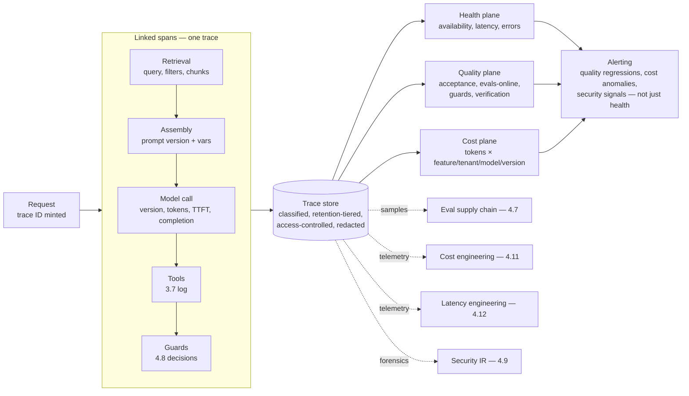

# Chapter 4.10 — Observability for LLM Systems

| | |
|---|---|
| **Part** | 4 — Enterprise GenAI Systems |
| **Maturity level** | 3 — Engineer |
| **Difficulty** | Advanced |
| **Estimated study time** | 3–4 hours (reading 2 h, exercise 90 min) |
| **Prerequisites** | [4.4](chapter-04-agent-architectures-production.md); [4.7](chapter-07-evaluation-systems.md) |

## Learning Objectives

After this chapter you will be able to:

1. Instrument the LLM-specific observability stack: traces spanning the full request (retrieval, model calls, tools, guards), quality signals, and cost/latency telemetry.
2. Design the trace as the unit of debugging — what to capture, how to link it, and how to make "the AI acted weird" reconstructable in minutes.
3. Build the three-plane dashboard — health, quality, cost — and the alerting that distinguishes the incident classes GenAI systems actually have.
4. Close observability into the other systems: traces feeding evals (4.7), telemetry feeding cost (4.11) and latency (4.12) engineering, logs supporting security forensics (4.9) and compliance (4.14).

## Introduction

Observability for LLM systems is classical observability (traces, metrics, logs) plus the dimensions classical systems never had: **quality is a runtime property** (a system can be up, fast, cheap, and *wrong* — the failure mode no uptime dashboard shows), **cost is per-request and variable** (1.7's token math, live), and **the unit of debugging is the trace of a probabilistic multi-step flow** (retrieval → assembly → model → tools → guards), not a stack trace. This chapter has been the silent dependency of the whole Part — 4.4's fleet dashboards, 4.7's online signals, 4.8's trigger rates, 4.9's forensics all assume the telemetry exists — and this is where it's built.

The framing: you cannot operate, improve, secure, or bill for what you cannot see, and LLM systems are *less* observable than classical ones by default (the model is a black box, the failures are semantic, the costs are diffuse) — so the instrumentation must be *more* deliberate. The trace is the spine.

## Business Motivation

Observability is the substrate every operational capability in Part 4 stands on, which makes its absence a compounding tax. Without traces, the "the assistant gave a customer wrong information" report is un-investigable — no way to reconstruct what was retrieved, what the prompt was, which model version answered (the "AI acted weird Tuesday" that 3.3 promised to convert into "prompt v43, 14:00–16:00" — that conversion *is* this chapter). Without quality telemetry, degradation is discovered by user complaint rather than dashboard (4.7's correlation drift, undetected). Without cost telemetry at request granularity, the month-three bill ambush (1.1's Nordgren, recurring) has no early warning and no attribution (which feature? which tenant? which prompt change?). Without security-grade logging, the injection incident (4.9) has no forensics. Each gap converts a manageable signal into an incident, and the incidents cluster precisely where GenAI systems are novel — quality and cost — because that's where teams port classical observability (uptime, latency) and stop. The positive case is velocity: mature LLM observability is what lets teams *ship confidently* (the trace shows the canary's behavior — 4.7), debug in minutes not days, and answer the auditor, the CFO, and the security lead from the same telemetry — the observability platform (7.9) as the shared nervous system of the whole GenAI estate.

## Theory

### The trace: the unit of everything

A single user request in an LLM system fans out — retrieval calls, prompt assembly, one or more model calls, tool invocations, guard checks, sub-agent spawns (4.5) — and the **trace** is the linked record of all of it under one request/task ID (the distributed-tracing span model, LLM-populated). What each span captures:

- **Model-call spans** — the *inputs and outputs*, not just timing: the assembled prompt (or a reference to its versioned parts — 3.3's registry, so you store the prompt *version* + the variable content, not a megabyte per call), the model and version (2.6's pinning, on every span), sampling profile (3.2), token counts (input/output split — 1.7), latency (TTFT and total — 2.5's phases), and the completion. This is the span that makes debugging possible and the span with the *sensitivity* problem (below).
- **Retrieval spans** — query (post-transform — 4.2), filters applied (the resolved ACL context — 4.1's audit answer), chunks returned with scores and provenance; the span that localizes RAG failures (3.6's taxonomy, from telemetry).
- **Tool spans** — 3.7's call log, in the trace: tool, arguments, consequence class, gate decision, result; the span that supports 4.9's forensics and 4.4's trajectory review.
- **Guard spans** — 4.8's decisions: which checks ran, what they scored, what the ladder did; the span that explains a refusal.

The linking discipline is the whole value: a trace ID that flows from the user's request through every span, queryable by ID, model version, prompt version, tenant, cost percentile, exit state, and guard outcome — so any slice ("all traces on prompt v43 that hit the binding-language guard for tenant X in the p99 cost bucket") is one query. A system whose spans aren't linked has logs, not observability.

### The three planes

LLM observability dashboards divide into three planes with different owners and questions:

1. **Health (classical, familiar)** — availability, error rates (transport, validation, provider), latency percentiles (p50/p95/p99, TTFT separately — 2.5), throughput, provider-dependency status. The SRE plane; necessary, insufficient.
2. **Quality (novel, hardest)** — the runtime signals that a system is *working*, not just up: online implicit signals (acceptance, edit distance, retries, escalations, abandonment — 4.7's loop), guard trigger/block rates (4.8), refusal rates, RAG faithfulness/citation-validity on sampled traffic (running the judge fleet online — 4.7), agent verification-disagreement and exit distributions (4.4). This plane is where GenAI's distinctive failures live and where most teams under-invest; its metrics are the ones that move *before* the complaints.
3. **Cost (novel, immediate)** — token consumption and spend, decomposed by the dimensions that enable action: per feature, per tenant, per model, per prompt version, per token type (input/output/cached — 2.5), with the *distribution* (mean and the p99 tail where runaways live — 4.4). The plane the CFO reads and the plane 4.11 acts on.

### Alerting on the right things

GenAI incident classes need GenAI alerts, not just classical ones:

- **Quality regressions** — a drop in acceptance rate, a spike in edit distance or escalation, an eval-score decline on the online-sampled suite; the alert that catches the bad prompt deploy or silent model change (2.6) *by its effect*, when the release-gate somehow missed it.
- **Cost anomalies** — spend or per-request-cost breaking its band (the prompt bloat, the model-mix drift, the retry storm — 3.2/4.6); the early warning the invoice can't give.
- **Guard/security signals** — trigger-rate spikes (4.8's tripwire; 4.9's attack indicator), verification-disagreement climbs (4.4's honesty gauge), refusal-rate anomalies.
- **The trap to avoid** — alerting only on the health plane (up and fast) while the quality plane silently degrades; the "everything's green but users are unhappy" state that means you're monitoring the wrong plane (4.7's Meridian correlation drift, as an alerting failure).

### The sensitivity problem

The trace's debugging value comes from capturing prompts and completions — which are *the user's data*, often sensitive (PHI in Meridian, matter content in Halvard & Roth, PII everywhere). This is observability's central tension with 4.14: the richest traces are the biggest data-exposure and retention liabilities. The resolutions: **classification and access control on the trace store** (it holds what the requests held — classify it accordingly, restrict access, audit it — the trace store is a sensitive data store, not a log file), **retention tiers** (full traces for a short window sufficient for debugging; sampled/redacted for longer trend analysis; metadata forever), **redaction at capture** (PII scrubbed from stored prompts/completions where debugging doesn't need the raw values — reusing 4.8's PII detection), and **deletion propagation** (traces are in-scope for right-to-be-forgotten — 4.1's probes reach here). The trace store is where observability and privacy negotiate, and the negotiation is explicit (1.4, with 4.14) or it's an audit finding.

## Architecture Perspective

Readings. **The trace store is the estate's shared nervous system** — one instrumentation standard and store feeds evals, cost, latency, security, and compliance (each a consumer, not a re-collector), which is the platform economics (7.9) that justify building it once and instrumenting to it everywhere; teams that let each concern collect its own telemetry get incompatible partial views and no whole-request trace. **Instrumentation is a convention enforced at the gateway** (7.9) — the gateway/SDK that every model call routes through is where trace context, versioning, and token capture attach automatically, so instrumentation is a property of the platform rather than a discipline each team must remember (the reliable way to get complete traces is to make *not* tracing the hard path). **And the quality plane is the differentiator** — health and cost planes are mechanical; the quality plane requires the 4.7 eval machinery running *online* (sampled judges, wired implicit signals), which is why observability and evaluation are sibling systems sharing the trace store, and why an org that built 4.7 gets its quality plane nearly for free (the same judges, pointed at production samples).

## Real-world Example

**Vantora Systems** (1.8, 2.5, 3.10, 4.4) built the platform's observability layer as the gateway's mandatory companion — and its value showed in three incidents that would have been invisible or unsolvable without it. **The five-minute debug:** a customer escalation ("the assistant told me our product supports a feature it doesn't") arrived with a conversation ID; the trace showed retrieval had surfaced a *superseded* datasheet (the 4.1 freshness gap, caught here), the prompt version was current, the model version pinned — root cause in five minutes, fixed in the corpus, and the trace became a golden-set entry (4.7's incident-input flywheel). Pre-observability, the same investigation had once taken a team two days and ended in "couldn't reproduce." **The cost anomaly caught early:** the cost plane's per-prompt-version panel flagged a 30% per-request cost jump on one feature within a day of a prompt deploy — the "improvement" had added a verbose few-shot example (2.5's accretion), caught by the anomaly alert before the monthly invoice, reverted in an hour. **The quality-plane save:** health was green for weeks while the quality plane's acceptance-rate metric drifted down 15% on the German-language slice — a model upgrade (2.6) had subtly degraded German instruction-following (3.10's hidden dimension), invisible to uptime and latency dashboards, visible to the acceptance signal, confirmed by the online-sampled eval (4.7), and fixed by re-routing the German task class. The platform lead's line in the observability runbook: *"Green means it's up. It doesn't mean it's working. We built a plane to tell the difference — and it's the plane that catches the incidents nobody else can see."* The sensitivity discipline was designed in from the start: traces classified per the requesting system's data class, PHI-adjacent content redacted at capture for the health-plane consumers while the restricted debugging tier held full traces for 14 days under access audit — the compliance review (4.14) signed the observability design without a finding, which the team counted as the deeper win.

## Hands-on Exercise

**Instrument a request end to end.** Extends any Part 3/4 build (RAG assistant with a tool). ~90 minutes.

1. **Linked tracing (40 min).** Add a trace ID minted at request entry and propagated through every span: retrieval (query, filters, chunk IDs + scores), assembly (prompt version + variable content), model call (version, token split, TTFT, latency, completion), tool call (3.7 fields), guard decision (4.8). Store as linked spans queryable by trace ID. Run 15 varied requests.
2. **The three planes (30 min).** Build minimal dashboards (scripts/notebooks fine): health (latency percentiles, error rate), quality (a wired implicit signal — e.g., simulated acceptance/retry — plus guard trigger rate), cost (tokens by feature and prompt version, with the p99 tail). Populate from your 15 traces plus a deliberately expensive outlier.
3. **The debug drill (15 min).** Have a colleague (or your later self) inject a "bad" behavior into one request (wrong retrieval, or a prompt-version swap); from the traces alone, reconstruct what happened and identify the responsible span/version. Time yourself.
4. **The sensitivity pass (15 min).** Identify what in your traces is sensitive (the completions, any PII in queries); implement redaction-at-capture for one field and state your retention-tier and access policy in three lines.

**Acceptance criteria:**
- [ ] Full request reconstructable from one trace ID across all span types
- [ ] Three planes populated; the cost plane shows per-version attribution and the p99 tail
- [ ] Debug drill: the injected fault localized to a span/version from traces alone, in minutes
- [ ] Sensitivity policy stated: what's redacted, retention tier, access control

## Enterprise Considerations

Enterprise LLM observability is a platform-and-governance concern before a tooling one. **Standardize or fragment:** without a mandated instrumentation standard and shared store (attached at the gateway — 7.9), forty teams produce forty partial telemetry schemas and no cross-system view — the standard is the platform's most leveraged early decision, and retrofitting it is a re-instrumentation project. **The trace store is a regulated data store:** it holds copies of everything the requests processed, so its classification, access control, retention, deletion propagation, and residency inherit the *most* sensitive data any instrumented system handles (4.14) — treating it as "just logs" is the recurring audit finding, and the observability/privacy negotiation (retention tiers, redaction) is a design-time governance decision with legal, not an ops afterthought. **Cross-functional consumers, one source:** finance reads the cost plane (chargeback — 7.9), security reads the forensic traces (4.9), compliance reads the audit trail (4.14), SRE reads health, product reads quality — the platform serves all from one instrumentation, which is both its efficiency and its governance complexity (access scoped per consumer to the planes and fields their role permits). **And vendor observability tools are architecture decisions:** the LLM-observability tooling market is active and immature — evaluated against the trace-completeness, sensitivity-handling, and integration requirements here (1.4), and with the lock-in awareness that instrumentation standards are expensive to change (7.10).

## Trade-offs

| Decision | Option A | Option B | Choose A when… | Choose B when… |
|----------|----------|----------|----------------|----------------|
| Trace richness | Full prompts/completions captured | Metadata + references only | Debugging and quality need the content (usually) | Sensitivity/volume forbids — then redact-at-capture, restricted tier, short retention |
| Instrumentation | Gateway-enforced, automatic | Per-team, manual | Always at scale — completeness requires it | Never as the primary path; the un-instrumented call is the un-debuggable one |
| Quality-plane signals | Full implicit + online eval sampling | Explicit ratings only | Default — implicit is higher-volume, less biased | Privacy limits behavioral capture (acknowledge the weakened quality plane) |
| Retention | Tiered (full-short / sampled-long / metadata-forever) | Uniform | Default — balances debugging, trends, and liability | Never uniform-long (liability) or uniform-short (no trends) |

## Common Mistakes

1. **Monitoring only the health plane** — up and fast while quality degrades silently; the "everything's green, users unhappy" state is monitoring the wrong plane (Vantora's German-slice save is the counter).
2. **Unlinked spans** — model calls, retrieval, and tools logged separately with no trace ID joining them; you have logs, not observability, and the multi-step debug is archaeology.
3. **No version on the spans** — prompt and model versions absent from traces, so "which change caused this?" is unanswerable (3.3's promise, unkept); version-stamp every span.
4. **Cost telemetry without attribution** — a total spend number nobody can act on; per feature/tenant/model/version/token-type or it's a bill, not a signal (4.11 needs the decomposition).
5. **The trace store as "just logs"** — sensitive content retained uniformly, unclassified, unaudited; it's a regulated data store holding everything the requests held (4.14's finding).
6. **Manual per-team instrumentation** — incomplete, inconsistent traces because someone forgot; gateway-enforced or unreliable.
7. **Alerting classically only** — thresholds on latency and errors, none on quality or cost anomalies; the GenAI incidents fire in the planes you didn't alert.
8. **Ignoring the p99 cost tail** — mean-only cost dashboards hiding the runaway tasks (4.4) where the money and the incidents live; monitor the distribution.

## Best Practices

1. **Make the trace the spine** — one ID through all spans, every span version-stamped and content-or-reference captured; queryable by every operational dimension.
2. **Enforce instrumentation at the gateway** — automatic trace context, versioning, and token capture; make un-instrumented the hard path.
3. **Build all three planes; invest most in quality** — health is table stakes, cost is immediate, quality is the differentiator and the under-invested one; run the 4.7 judges online for it.
4. **Alert on GenAI incident classes** — quality regressions, cost anomalies, guard/security signals, verification-disagreement — not just health.
5. **Attribute cost to action** — feature, tenant, model, prompt version, token type, with the distribution; the decomposition is what makes 4.11 possible.
6. **Treat the trace store as regulated data** — classify, access-control, tier retention, redact at capture, propagate deletion; design the observability/privacy negotiation explicitly with legal.
7. **One store, many consumers** — evals, cost, latency, security, compliance all draw from the shared instrumentation; don't let concerns re-collect partial views.
8. **Make traces feed the flywheels** — incident traces into golden sets (4.7), cost outliers into cost engineering (4.11), latency spans into performance work (4.12).

## Architecture Checklist

For any LLM system in production:

- [ ] Every request produces a linked trace (one ID) spanning retrieval, assembly, model calls, tools, guards
- [ ] Every span version-stamped (prompt, model, index); content captured or referenced with the sensitivity policy applied
- [ ] Instrumentation enforced at the gateway/SDK, not left to per-team discipline
- [ ] Three planes built: health, quality (with online eval sampling and implicit signals), cost (attributed and distributional)
- [ ] Alerting covers quality regressions, cost anomalies, and guard/security signals — not just health
- [ ] Trace store classified and governed as sensitive data: access control, retention tiers, redaction at capture, deletion propagation, residency
- [ ] Cost telemetry decomposed by feature/tenant/model/prompt-version/token-type with the p99 tail visible
- [ ] Traces queryable by all operational dimensions (version, tenant, cost bucket, exit state, guard outcome)
- [ ] Downstream consumers wired: evals (4.7), cost (4.11), latency (4.12), security forensics (4.9), compliance (4.14)

## Interview Questions

1. *"A customer says your assistant gave them wrong information yesterday. Walk me through the investigation."* — Strong answers start from the trace ID: reconstruct retrieval (was it stale/wrong — 4.1), prompt version, model version, guard decisions — root-causing to a span in minutes, then feeding the trace into the golden set; and they note this is only possible if spans were linked and version-stamped by design.
2. *"What's different about observing LLM systems versus classical services?"* — Strong answers name the three planes and stress that quality is a *runtime* property (up ≠ working), cost is per-request and variable, and the debugging unit is a multi-step probabilistic trace — plus the sensitivity tension the rich traces create.
3. *"Everything's green on the dashboard but users are unhappy. What went wrong with your observability?"* — Strong answers diagnose a health-only monitoring posture missing the quality plane; prescribe implicit-signal instrumentation and online eval sampling, alerting on acceptance/escalation/eval drift — the plane that moves before complaints (Vantora's German slice, 4.7's correlation drift).
4. *"How do you handle the privacy risk of capturing prompts and completions for debugging?"* — Strong answers treat the trace store as a regulated data store: classification, access control, retention tiers, redaction at capture, deletion propagation — and frame it as an explicit observability/privacy negotiation with legal (4.14), not an ops default.

## Further Reading

- OpenTelemetry documentation and the emerging GenAI semantic conventions (opentelemetry.io) — the standard your LLM spans should speak; instrumentation portability depends on it.
- Your LLM-observability vendor's documentation (official docs of the tool you evaluate) — trace models, sensitivity handling, and eval integration; assessed against this chapter's requirements (1.4).
- Google SRE book, the monitoring and alerting chapters (sre.google) — the health-plane discipline and the "alert on symptoms users feel" principle this chapter extends to the quality plane.
- The [evaluation checklist](../../checklists/evaluation-checklist.md) — its online-evaluation section is the quality plane's content; 4.7 and this chapter are siblings sharing the trace store.

## Summary

- LLM observability is classical observability **plus quality as a runtime property, cost as per-request telemetry, and the multi-step trace as the debugging unit** — and LLM systems are *less* observable by default, so instrumentation must be more deliberate.
- **The trace is the spine**: one ID through linked spans (retrieval, assembly, model, tools, guards), every span version-stamped and content-captured, queryable by every operational dimension — the machinery that turns "acted weird Tuesday" into "prompt v43, 14:00–16:00."
- **Three planes**: health (up and fast — necessary, insufficient), quality (working — the under-invested differentiator, powered by 4.7's judges online), cost (attributed and distributional — the CFO's plane and 4.11's input); alert on all three, not just health.
- The **trace store is a regulated data store** holding everything the requests held — classification, retention tiers, redaction, and deletion propagation are the explicit observability/privacy negotiation with 4.14.
- **One instrumentation, many consumers** (evals, cost, latency, security, compliance) — the shared nervous system, enforced at the gateway. Its telemetry drives the next two chapters directly: **cost** (4.11) and **latency** (4.12) engineering.

---

**Previous:** [Chapter 4.9 — GenAI Security & Threat Modeling](chapter-09-genai-security-threat-modeling.md) · **Next:** [Chapter 4.11 — Cost Engineering](chapter-11-cost-engineering.md) · **Related:** [4.4 Agent Architectures](chapter-04-agent-architectures-production.md), [4.7 Evaluation Systems](chapter-07-evaluation-systems.md), [4.14 Privacy, Compliance & AI Governance](chapter-14-privacy-compliance-governance.md)
