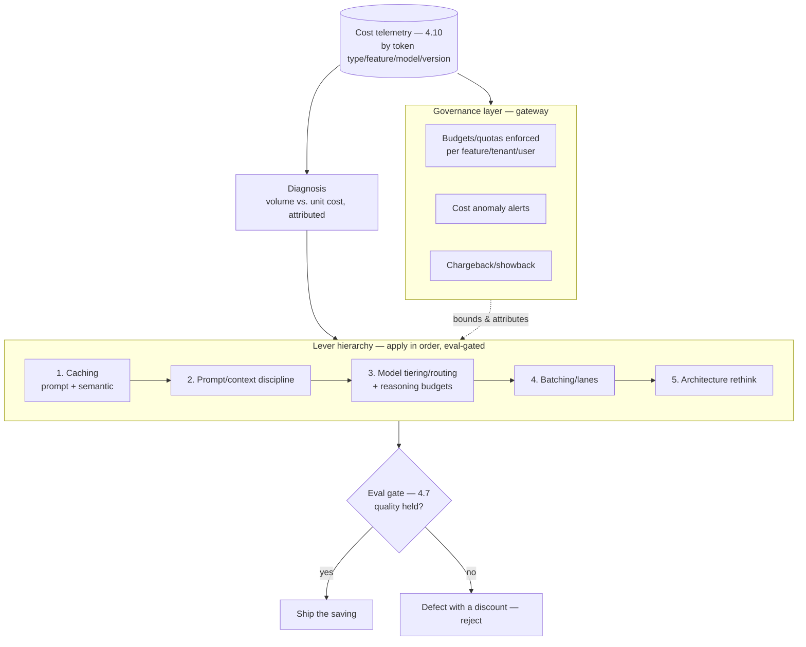

# Chapter 4.11 — Cost Engineering

| | |
|---|---|
| **Part** | 4 — Enterprise GenAI Systems |
| **Maturity level** | 3 — Engineer |
| **Difficulty** | Advanced |
| **Estimated study time** | 3–4 hours (reading 2 h, exercise 90 min) |
| **Prerequisites** | [1.7 Estimation](../part-1-professional-foundation/chapter-07-estimation.md); [2.5](../part-2-artificial-intelligence/chapter-05-transformer-architecture.md); [4.10](chapter-10-observability.md) |

## Learning Objectives

After this chapter you will be able to:

1. Apply the cost-reduction levers in priority order — caching, prompt discipline, model tiering/routing, batching — each gated by evals.
2. Diagnose a cost problem from telemetry (4.10) to root cause: which token type, which feature, which change drove the spend.
3. Design the cost-governance layer: budgets, quotas, alerts, and chargeback that keep spend attributable and bounded.
4. Make the cost-quality trade explicitly, per task class, with the arithmetic and the eval evidence a CFO and a product owner both accept.

## Introduction

Cost engineering is where 1.7's estimation becomes operation and 2.5's mechanics become levers. The premise: GenAI's marginal-cost-per-request economics (2.3's inference plane) make cost a *continuous engineering discipline*, not a one-time procurement decision — spend scales with usage and drifts with every prompt edit, model choice, and retrieval tweak, so an unengineered system's unit cost rises monotonically (the accretion dynamic — Vantora's 31K-token prompt, 2.5) until a budget review forces a reckoning. The discipline is the alternative to the reckoning: measure (4.10), attribute, and apply the levers in the order of their return, each gated by evals so cost cuts don't become quality cuts by stealth.

The chapter's spine is the lever hierarchy — a priority order that reflects the recurring finding across this curriculum's cases that the biggest savings are usually the *cheapest* to capture (caching a stable prefix, trimming an unjustified example) and the model-swap heroics come later, if at all.

## Business Motivation

Cost engineering is directly a margin decision and indirectly a viability decision. Directly: for cost-play systems (1.3), unit cost *is* the product — Corvid's tiering, Kestrel's fine-tune (2.6), the 30–80% reductions that recur in this curriculum's examples are the difference between a positive and negative business case, captured by engineering rather than renegotiation. Indirectly: cost is the constraint that decides *what's buildable* — a workflow whose honest unit economics don't close doesn't ship (1.3's KPI trees), and cost engineering is what moves the boundary of the possible (the feature that's unaffordable at frontier-model-for-everything becomes affordable with tiering, so it exists). The governance side is its own business case: without budgets, quotas, and attribution, an enterprise's GenAI spend is unaccountable and unbounded — the runaway agent (4.4), the retry storm (4.6), the team that shipped a 10× prompt — and the CFO's response to unaccountable spend is a spending freeze (the whole program taxed for one team's leak). The observability-to-cost pipeline (4.10) is what converts spend from a monthly surprise into a managed engineering quantity with early warning and clear attribution.

## Theory

### The lever hierarchy

Apply in order; each earlier lever is cheaper and safer than the later ones:

1. **Caching (highest return, lowest risk)** — *prompt caching* (2.5): stable prefixes (system prompt, tool defs, few-shot examples) cached by the provider and billed at a fraction on hit — pure win from cache-aligned prompt structure (stable-first ordering, 3.2), routinely 20–50% off input cost with zero quality impact. *Semantic caching* (7.8): identical or near-identical *requests* served from a cache of prior responses — powerful for repetitive query distributions (FAQ-shaped traffic), with the correctness caveat (a stale cached answer to a time-sensitive question — cache with TTLs and invalidation, and only where response staleness is tolerable). Caching is first because it's free money the mechanics hand you.
2. **Prompt and context discipline** — every token in the context is billed every call (2.5's input dominance), so the 3.2 budget discipline *is* cost engineering: trim eval-unjustified examples, threshold retrieval instead of fixed-k (4.2), compact history (3.2), remove the accreted rule-pile (3.3). The recurring finding: prompts carry 20–50% dead weight nobody owns, and removing it cuts cost *and* often improves quality (focused attention, 2.5) *and* latency (prefill, 2.5) — the rare pure-win lever, gated only by the eval suite confirming the trims are dead weight.
3. **Model tiering and routing** — the 3.10 portfolio as a cost lever: route each task class to the cheapest model that passes its suite (the 5–20× tier cost deltas at measured quality parity — the routine bake-off finding). Includes *within-request* tiering (a cheap model for the easy sub-steps, frontier for the hard one — 3.8's decomposition paying cost dividends) and *reasoning-budget* routing (3.2: generous thinking tokens for hard task classes, minimal for easy). The lever with the largest headline savings and the most eval work (every routing decision is a bake-off, 3.10).
4. **Batching and lane economics** — offline workloads (4.3's ingestion, 4.6's batch lane) use batch-pricing APIs (materially cheaper for latency-tolerant work) and off-peak scheduling; the lever specific to the non-interactive tail.
5. **Architectural reconsideration (the deepest, last)** — sometimes the cheapest system is a different system: RAG instead of long-context stuffing (2.5's quadratic arbitrage; 3.6), a fine-tuned compact model instead of a prompted frontier one (2.6's Kestrel, when volume justifies the 2.6 sorting rule), classical ML instead of an LLM for the sub-task (2.1's routing classifier). These are 1.4 decisions with build cost, reached when the cheaper levers plateau.

The discipline throughout: **every cost lever is eval-gated** — a cut that drops quality below the fit criterion (1.6) isn't a saving, it's a defect with a discount, and the 4.7 gates are what keep cost engineering honest.

### Diagnosis from telemetry

4.10's cost plane makes cost problems diagnosable; the method (2.4's work-upstream discipline, cost edition): a spend rise decomposes into *volume up* (good news for a revenue play, expected — 1.3) or *unit cost up* (a regression to hunt). Unit-cost rises decompose by token type (input up → prompt bloat or retrieval growth; output up → verbosity or reasoning-budget drift; cached-ratio down → prompt structure broke the cache), by feature (which one's panel moved), by model (mix drifted toward the expensive tier — the unrouted "feels better" migration, 2.3's Corvid), and by version (which prompt/model deploy correlates with the jump — 4.10's version-stamped spans). The per-dimension attribution turns "the bill went up" into "the v43 prompt deploy added 800 tokens of example to the triage feature, dropping the cache ratio" — an actionable finding in minutes, which is the entire point of 4.10's decomposition.

### The governance layer

Cost control is architectural, not exhortational:

- **Budgets and quotas enforced at the gateway** (7.9) — per-feature, per-tenant, per-user token/spend limits, enforced (reject or degrade over-budget), with the hierarchy rolling up to fleet-level breakers (4.4). Advisory budgets drift; enforced ones hold.
- **Alerts on the cost plane** (4.10) — spend and unit-cost anomalies, cache-ratio drops, model-mix shifts; the early warning before the invoice.
- **Chargeback/showback** (7.9) — attributing spend to consuming teams (showback: they see it; chargeback: they pay it) is what aligns incentives — a team that sees its own token bill engineers its prompts; a team on shared invisible cost doesn't. Requires 4.10's per-tenant attribution as the substrate.
- **The cost-quality trade, governed** — for each task class, the chosen point on the cost-quality curve is a *recorded decision* (1.4) with the eval evidence and the arithmetic, owned by someone who can weigh the product and finance sides — not an engineer's silent default and not a finance mandate ignoring quality.

## Architecture Perspective

Readings. **The gateway is the cost control point** (7.9): caching, routing, budgets, quotas, and attribution all live in the one component every model call routes through — which is why the gateway pattern earns its platform investment thrice over (selection reversibility 3.10, observability 4.10, cost control here), and why cost engineering is largely *platform* engineering (the levers are platform capabilities that every consuming feature inherits, versus each team reimplementing caching and routing badly). **Eval-gating is the architectural safeguard against false savings** — the cost lever and the 4.7 gate are wired together so a cost change cannot ship without its quality proof; a cost-optimization path that bypasses evals is how the "we cut costs 40%" celebration becomes the "quality quietly tanked" incident. **And cost is a first-class SLO** — alongside latency (4.12) and quality (4.7), unit cost per task class has a target and an error budget; a system meeting its quality and latency SLOs while breaking its cost SLO is failing, and the cost plane is where that failure is visible before the invoice makes it undeniable.

## Real-world Example

**Vantora Systems** (1.8, 2.5, 4.4, 4.10) ran a formal cost-engineering pass on the support-assistant estate after the gateway's cost plane (4.10) made the spend legible for the first time — and the pass walked the lever hierarchy exactly, which is why it's the chapter's example. **Caching first:** the estate's prompts weren't cache-aligned (volatile content interleaved into the stable prefix — the anti-pattern 2.5 warned of); restructuring stable-first turned the cache ratio from 12% to 71% across the estate, a 34% input-cost cut with zero eval movement — captured in a week, no model changes, the cheapest lever paying the most. **Prompt discipline second:** the per-feature panels (4.10) ranked prompts by dead-weight; the triage feature's 4K of accreted few-shot examples pruned to 1.2K on eval evidence (most were near-duplicate — 3.3's audition discipline, retroactive), another 15% off that feature with a *latency* bonus (2.5's prefill). **Tiering third and largest:** the 3.10 bake-off harness routed 60% of frontier traffic to a mid-tier at measured parity (the surprise from 3.10, monetized) — 34% off total model spend, the headline number, but *third* in the sequence and the most eval-intensive to earn. **Batching fourth:** the nightly eval runs and the ingestion re-embedding (4.3) moved to batch-pricing lanes — a smaller absolute saving but pure margin on the non-interactive tail. The governance layer landed alongside: showback dashboards per team (the team that saw its bill cut its own prompts within a sprint — incentive alignment, live), gateway-enforced per-tenant quotas (the runaway-protection 4.4 needed), and cost-anomaly alerts that had, three months later, caught two prompt-bloat regressions within a day of deploy (4.10's early warning, operational). Total: 58% estate cost reduction, no measured quality loss, and the CFO ally (1.8) got the slide that funded the platform team's next two hires. Adaeze's cost-review doctrine: *"We didn't negotiate a better price. We stopped wasting the one we had — cheapest lever first, evals on every cut, and the bill on every team's own dashboard."*

## Hands-on Exercise

**Run the lever hierarchy on a real system.** Uses any Part 3/4 build with 4.10-style telemetry. ~90 minutes.

1. **Diagnose (20 min).** From your cost telemetry (build it if absent — 4.10), decompose your system's per-request cost: token split (input/output/cached), the biggest input contributor (system prompt? retrieval? history?), and the model tier. State where the money goes before touching anything.
2. **Lever 1 — caching (20 min).** Verify prompt structure is stable-first; measure the cache ratio; restructure if needed and re-measure. Record the input-cost delta and confirm zero eval movement (run your suite).
3. **Lever 2 — prompt discipline (25 min).** Identify dead weight (examples/rules unjustified by evals — audition them, 3.3); trim; re-measure cost and re-run the suite. Record cost delta and quality (must hold).
4. **Lever 3 — the tiering memo (25 min).** Don't rebuild the router — *decide* it: from a two-tier bake-off on one task class (3.10), write the memo — quality delta, cost delta, the routing decision, and the eval evidence. State the cost-quality trade explicitly (1.4).

**Acceptance criteria:**
- [ ] Per-request cost decomposed by token type and contributor before optimizing
- [ ] Caching lever applied with measured input-cost delta and confirmed quality-neutrality
- [ ] Prompt trims eval-gated: cost down, quality held (or the trim rejected as a real quality cut)
- [ ] Tiering memo states the cost-quality trade with arithmetic and eval evidence, in 1.4 form

## Enterprise Considerations

Enterprise cost engineering is FinOps for GenAI, threaded into existing cost governance. **Chargeback drives behavior at scale:** the enterprise decision between showback (visibility) and chargeback (teams pay their own AI bills) is a powerful incentive lever (7.9) — chargeback aligns engineering incentives with cost automatically (the team that pays optimizes), but requires trustworthy per-tenant attribution (4.10) and a fair allocation model (shared-infrastructure and platform costs split defensibly, or the chargeback breeds gaming). **Commitment economics complicate the levers:** provisioned throughput and committed-spend agreements (5.4, 3.10) change the marginal-cost math — under a commitment, unused capacity is already paid for, so the caching/tiering levers optimize against a different baseline (and over-committing is its own waste); the FinOps and architecture teams model this jointly. **Cost is a sustainability metric too:** token consumption maps to compute maps to energy (2.3's ESG line), so the same telemetry and levers serve carbon reporting — build once, report twice. **And cost governance is a review-board input** (6.9): new AI initiatives present unit economics and cost SLOs at approval (1.3, 1.7), the platform's cost trends inform portfolio decisions, and the runaway-spend runbook (who's alerted, what's throttled) is part of operational readiness — the enterprise version of the exercise's gateway quotas.

## Trade-offs

| Decision | Option A | Option B | Choose A when… | Choose B when… |
|----------|----------|----------|----------------|----------------|
| Optimization order | Caching → prompt → tiering → batch → architecture | Jump to model-swap heroics | Always — cheapest, safest levers first, biggest savings often earliest | Never; the model swap is eval-expensive and third in line, not first |
| Semantic caching | Cache near-identical requests | No response caching | Repetitive query distributions; staleness tolerable | Time-sensitive or highly varied queries — staleness risk outweighs saving |
| Cost accountability | Chargeback (teams pay) | Showback (teams see) | Mature orgs; trustworthy attribution; incentive alignment needed | Early stage; attribution immature — start with showback, evolve |
| Cost-quality point | Explicit recorded trade per class | Engineer's default / finance mandate | Always — owned decision with evidence | Neither silent default nor quality-blind mandate is acceptable |

## Common Mistakes

1. **Model-swap-first** — reaching for the expensive, eval-heavy tiering lever before capturing the free caching and prompt-discipline savings; walk the hierarchy in order (Vantora's sequence).
2. **Un-gated cost cuts** — shipping a "40% saving" that quietly dropped quality below the fit criterion; every lever is eval-gated or it's a defect with a discount.
3. **Cache-hostile prompt structure** — volatile content in the stable prefix zeroing the cache ratio (2.5); stable-first is a cost decision, and the cheapest one.
4. **Total-cost dashboards** — a spend number with no attribution; un-decomposed cost is undiagnosable and unactionable (4.10's per-dimension telemetry is the prerequisite).
5. **Advisory budgets** — quotas that warn but don't enforce; drift is guaranteed, and the runaway (4.4) meets no wall. Enforce at the gateway.
6. **Ignoring the cached-ratio and model-mix drift signals** — the silent regressions (prompt bloat breaking the cache, traffic drifting to the expensive tier) that the cost plane shows and nobody watches.
7. **Invisible cost to consuming teams** — no showback/chargeback, so the teams generating the spend have no incentive to engineer it; visibility is the cheapest governance lever.
8. **Optimizing the mean, ignoring the tail** — mean-cost focus while the p99 (agents, long contexts — 4.4) drives the bill and the incidents; budget and monitor the distribution.

## Best Practices

1. **Walk the lever hierarchy in order** — caching, prompt/context discipline, tiering/routing, batching, architecture rethink; cheapest and safest first, and the free wins are usually the biggest.
2. **Eval-gate every lever** — wire the cost change to the 4.7 gate; a cut that fails quality is rejected, not shipped with a discount.
3. **Diagnose before optimizing** — decompose spend (volume vs. unit cost, by token type/feature/model/version) from 4.10's telemetry; fix the actual driver.
4. **Enforce budgets and quotas at the gateway** — per feature/tenant/user, rolling up to fleet breakers; enforced, not advised.
5. **Make cost visible to those who generate it** — showback minimum, chargeback where mature; visibility aligns incentives cheaper than any mandate.
6. **Cache-align prompts as standing practice** — stable-first ordering in every prompt (3.2/2.5); it's the free lever, applied by default.
7. **Treat unit cost as an SLO** — target and error budget per task class, alerted on the cost plane, alongside quality and latency SLOs.
8. **Record the cost-quality trade** — per class, with arithmetic and eval evidence, owned by someone weighing both sides (1.4).

## Architecture Checklist

For any LLM system at production scale:

- [ ] Cost telemetry decomposed (token type, feature, tenant, model, prompt version) with the p99 tail — from 4.10
- [ ] Prompt caching exploited: stable-first structure, cache ratio monitored and alerted on drops
- [ ] Prompt/context dead weight audited against evals; retrieval thresholded, history compacted
- [ ] Model tiering/routing by task class, each routing decision bake-off-justified (3.10); reasoning budgets routed
- [ ] Batch lanes used for offline workloads (ingestion, eval runs)
- [ ] Every cost lever eval-gated (4.7); false savings caught before ship
- [ ] Budgets/quotas enforced at the gateway per feature/tenant/user, rolling to fleet breakers
- [ ] Cost anomaly alerting (spend, unit cost, cache ratio, model mix) on the cost plane
- [ ] Showback/chargeback attributing spend to consuming teams
- [ ] Unit cost is an SLO per task class; cost-quality trade recorded with evidence

## Interview Questions

1. *"Your GenAI inference bill jumped 40% with flat traffic. Walk me through the diagnosis and fix."* — Strong answers decompose from telemetry (unit cost up, which token type, which feature/version — 4.10), find the driver (prompt bloat, cache-break, model-mix drift), and fix with the matched lever, eval-gated — Vantora and Corvid's shape, not "switch to a cheaper model."
2. *"What's your priority order for reducing LLM costs?"* — Strong answers give the hierarchy (caching → prompt discipline → tiering/routing → batching → architecture) with the rationale (cheapest/safest first, free wins often biggest, tiering is eval-expensive and third) — and stress eval-gating throughout.
3. *"How do you keep cost optimization from quietly degrading quality?"* — Strong answers wire every lever to the 4.7 gate (a cut failing quality is a defect with a discount), treat unit cost as an SLO alongside quality, and record the cost-quality trade explicitly with evidence.
4. *"Design cost governance for an enterprise with fifty teams using a shared model gateway."* — Strong answers put budgets/quotas and attribution at the gateway (7.9), choose chargeback vs. showback by maturity, alert on cost anomalies, and feed unit economics into the review board (6.9) — architecture and incentives, not exhortation.

## Further Reading

- Your providers' pricing, prompt-caching, and batch-API documentation (official docs) — the exact lever mechanics and current prices; date-stamp what you use (1.7), reread quarterly.
- FinOps Foundation materials (finops.org) — the cloud-cost-management discipline this chapter specializes for GenAI; the chargeback/showback and unit-economics framing.
- Anthropic's cost-optimization and prompt-caching guidance (docs.anthropic.com) — practitioner patterns for the caching and prompt-discipline levers.
- The [architecture review checklist](../../checklists/architecture-review-checklist.md) — its cost section is this chapter's gate at design time; 1.7 is the estimation companion, 4.10 the telemetry substrate.

## Summary

- Cost is a **continuous engineering discipline** in the marginal-cost inference economy — unengineered unit cost rises monotonically until a budget reckoning; the discipline is the alternative.
- Apply the **lever hierarchy in order**: caching (free, biggest — cache-aligned prompts + semantic where staleness-tolerant), prompt/context discipline (20–50% dead weight, pure win), model tiering/routing (largest headline, most eval work — third), batching (the offline tail), architecture rethink (deepest, last) — **every lever eval-gated**.
- **Diagnose before optimizing**: decompose spend from 4.10's telemetry (volume vs. unit cost, by token type/feature/model/version) to the actual driver.
- **Governance is architectural**: gateway-enforced budgets and quotas, cost-anomaly alerts, and showback/chargeback that aligns incentives — advisory budgets and invisible costs both drift.
- Treat **unit cost as an SLO** with the cost-quality trade recorded and owned; a system passing quality and latency while breaking cost is failing. The sibling SLO — latency — is the next chapter (4.12).

---

**Previous:** [Chapter 4.10 — Observability for LLM Systems](chapter-10-observability.md) · **Next:** [Chapter 4.12 — Latency & Performance Engineering](chapter-12-latency-performance.md) · **Related:** [1.7 Estimation](../part-1-professional-foundation/chapter-07-estimation.md), [3.10 Model Selection](../part-3-core-building-blocks-of-genai/chapter-10-model-selection-benchmarking.md), [7.8 Cost & Performance Patterns](../part-7-enterprise-ai-architecture-patterns/chapter-08-cost-performance-patterns.md)
