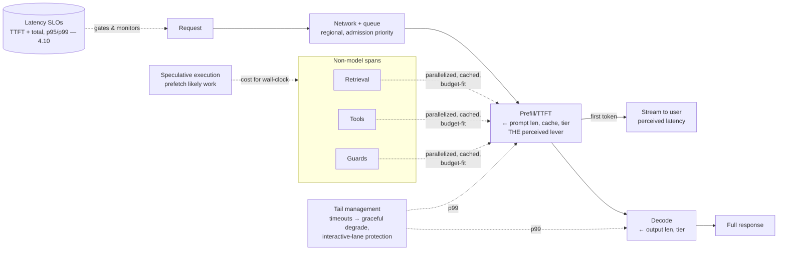

# Chapter 4.12 — Latency & Performance Engineering

| | |
|---|---|
| **Part** | 4 — Enterprise GenAI Systems |
| **Maturity level** | 3 — Engineer |
| **Difficulty** | Advanced |
| **Estimated study time** | 3 hours (reading 90 min, exercise 90 min) |
| **Prerequisites** | [2.5 The Transformer](../part-2-artificial-intelligence/chapter-05-transformer-architecture.md); [4.10](chapter-10-observability.md) |

## Learning Objectives

After this chapter you will be able to:

1. Decompose LLM latency into its phases (network, queue, prefill/TTFT, decode) and attack each with the right lever.
2. Design for perceived latency — streaming, progressive disclosure, optimistic UI — separately from actual latency.
3. Meet latency SLOs across multi-step pipelines: parallelization, speculative execution, caching, and the latency-quality-cost trade.
4. Engineer the hard cases: real-time voice, agentic loops, and the tail (p99) where SLOs actually break.

## Introduction

Latency is where 2.5's transformer mechanics meet user patience, and the two don't naturally agree: LLMs generate sequentially (decode, one token at a time — 2.5), which makes them structurally slower than the sub-second responses users expect from software. The discipline is closing that gap — partly by making the system actually faster (the levers), partly by making it *feel* faster (perceived latency, which is often the higher-leverage half), and always by knowing which phase of the request the latency lives in, because — as with cost (4.11) and retrieval (4.2) — the wrong lever on the wrong phase buys nothing.

The framing that organizes the chapter: **latency is phase-structured and perception-mediated.** Phase-structured because a request's total time is a sum of distinct stages each with its own levers (2.5's prefill/decode split is the core). Perception-mediated because the user experiences *time-to-first-token* and *streaming smoothness*, not total time — so a system can be slower in total yet feel faster, and the UX levers frequently beat the infrastructure ones.

## Business Motivation

Latency is an adoption and conversion variable with well-established economics: users abandon slow interfaces, and the classical web finding (each additional second of latency measurably erodes engagement and conversion) applies with force to interactive AI, where the baseline expectation was set by instant software. For interactive systems (the support assistant, the copilot), latency is the difference between a tool people reach for and one they route around — a quality dimension in the 1.6 fit-criteria sense, with a hard SLO. The specific GenAI shape: **time-to-first-token dominates the perceived experience** (2.5), so a system that streams a first token in 800ms and takes 6 seconds total feels responsive, while one that thinks silently for 3 seconds then dumps a full answer feels broken — the same total time, opposite adoption outcomes. The trade against the other SLOs is real and must be governed: latency competes with quality (bigger models, more retrieval, reasoning tokens all add time) and with cost (parallel/speculative execution spends tokens to save time), so latency engineering is not free optimization — it's a three-way negotiation (latency-quality-cost) made explicitly per task class, the same governed trade as 4.11's cost-quality point with a third axis.

## Theory

### The latency decomposition

Total request latency is a sum of phases, each with distinct levers (4.10's spans make them measurable):

| Phase | What it is | Levers |
|---|---|---|
| Network + queue | Round-trip and any admission wait (4.6) | Regional endpoints (5.1), connection reuse, admission priority for interactive lane |
| **Prefill / TTFT** | Processing the whole prompt before the first output token (2.5) | *The dominant perceived-latency lever*: shorter prompts (4.11's discipline pays double), **prompt caching** (cached prefix skips prefill — 2.5), smaller model tier where evals allow (3.10) |
| **Decode** | Generating output tokens sequentially (2.5) | Shorter outputs (bounded generation, terse formats — 3.2), smaller/faster model, streaming (perceived, below) |
| Retrieval / tools / guards | The non-model spans in the pipeline | Parallelization, caching, thresholding (4.2), fitting the guard funnel in budget (4.8) |

The decomposition is the method: measure the phases (4.10), find the dominant one, apply its lever. The recurring diagnostic error (2.5's Vantora) is attacking the model tier when the latency is prefill (prompt length) — a phase-misattribution the decomposition prevents.

### Perceived latency: the higher-leverage half

Users experience the *shape* of the response, not its total duration, which opens levers that cost nothing in infrastructure:

- **Streaming** (2.5's decode, surfaced) — showing tokens as they generate turns a 6-second wait into an 800ms-to-first-word experience; the single highest-leverage perceived-latency move, and the default for any interactive text UX. The cost is output-validation complexity (4.8: guarding content that's already rendering — the validate-then-stream vs. incremental-with-retraction trade).
- **Progressive disclosure** — showing the pipeline's work as it happens (retrieval sources appearing, then the answer streaming) fills the wait with progress rather than a spinner; the agentic version (4.4) shows the trajectory ("searching… found 3 sources… drafting…"), which also builds trust (the user sees the grounding).
- **Optimistic and staged UI** — rendering the parts that are ready (the retrieved sources, a skeleton) before the full answer; the perceived-latency toolkit of classical UX, applied to AI's longer waits.

The design principle: engineer perceived latency *first* (it's cheap and high-impact), then actual latency where perception isn't enough (the total time genuinely matters for a downstream deadline, or the wait is too long for perception tricks to mask).

### Multi-step and the actual-latency levers

When total time genuinely must drop:

- **Parallelization** — independent steps run concurrently (parallel retrieval + a preparatory model call; fan-out workers — 4.5); the classical latency lever, gated by genuine independence (4.5's sequential-in-costume warning applies).
- **Speculative execution** — starting likely-next work before it's confirmed needed (prefetching the probable retrieval, pre-warming a likely tool), spending cost/compute to save wall-clock; the latency-cost trade made concrete, worth it for high-value interactive paths, wasteful for batch.
- **Caching** (4.11's lever, latency face) — prompt caching skips prefill (the biggest single win), semantic caching skips the whole call for repeat requests (sub-100ms for cache hits).
- **Model and reasoning-budget selection** — the 3.10/3.2 levers: smaller models are faster (decode and prefill), minimal reasoning budgets are faster on easy tasks; routed per task class, eval-gated (a faster model that fails the suite is a latency win that's a quality loss — 4.11's discipline, latency edition).

### The hard cases and the tail

- **Real-time voice** — the latency-critical extreme: speech-to-text → model → text-to-speech, with a conversational-turn budget (~sub-second to feel natural) that forces every lever simultaneously — streaming throughout, smallest viable models, barge-in handling, and often a specialized real-time stack rather than the standard request pipeline (a 1.4 architecture decision; CS32's world).
- **Agentic loops** — latency compounds across iterations (3.8); the levers are loop-level (fewer iterations via better tools, parallel workers — 4.5, speculative tool prefetch) plus the perceived-latency essential of streaming the *trajectory* so a 40-second agent task shows continuous progress rather than a 40-second spinner.
- **The tail (p99)** — SLOs break at the tail, not the mean: the long-document request, the retry (4.6), the agent that iterated more, the cache miss. Latency SLOs are set and monitored at p95/p99 (4.10), and the tail has its own levers (timeouts with graceful degradation — 3.1's fallback ladder, latency edition: return a partial or a "still working" rather than hang; tail-specific caching; admission control keeping the interactive lane's tail protected from batch — 4.6). Mean-latency engineering that ignores the tail ships an SLO that breaks exactly when users notice.

## Architecture Perspective

Readings. **TTFT and total are separate SLOs** — because perceived and actual latency are different variables, the SLO is two numbers (TTFT for responsiveness, total for completion), monitored separately at the tail (4.10); a single "latency" number conflates the perceived experience with the completion time and hides the streaming win. **The latency budget is allocated across the pipeline** (4.2/4.8 previewed this) — a 2-second interactive TTFT budget divides among network, admission, retrieval, guard-input-screening, and prefill, so each component's latency is a *budget line* (the reranker that adds 200ms, the guard funnel's input tier, the retrieval round-trip), and adding a component means finding its budget — which is why per-query-class latency policies (cheap path vs. full funnel — 4.2) exist. **Latency is the third SLO in the governed trade** — with quality (4.7) and cost (4.11), it forms the triangle every task-class design negotiates explicitly: the interactive support path optimizes TTFT (streaming, cached prefix, mid-tier model) accepting some quality ceiling; the overnight analysis path optimizes quality (frontier model, deep reasoning, full retrieval) ignoring latency; the trade is recorded per class (1.4), not defaulted.

## Real-world Example

**Meridian Health Partners** (1.5, 3.2, 3.6, 4.10) hit latency as a clinical-adoption blocker: the assistant's median TTFT was 3.1 seconds, and clinicians — mid-workflow, patient waiting — abandoned it for the old intranet search that was worse but *instant-feeling*. The latency pass, using the 4.10 spans, was a phase-decomposition textbook. The spans localized it: 2.4 of the 3.1 seconds was **prefill** — a 9K-token clinical system prompt plus fixed top-10 retrieval (the 3.2/4.2 anti-patterns, latency-costed). The levers, in order: prompt cache-alignment (the stable clinical prompt cached — prefill on cache hits dropped to near-zero, the single biggest win, zero quality impact); retrieval thresholded from top-10 to relevance-gated (4.2 — fewer tokens to prefill, no recall loss on the golden set); and — the perceived-latency move that mattered most — **streaming with progressive disclosure**: the assistant now showed retrieved sources appearing within 400ms (the clinician sees "checking 3 protocols…" and the citations) then streamed the answer, turning a 3-second silence into a 400ms-to-first-signal experience that *felt* instant even though total time only halved. Adoption recovered within a week of the streaming ship — before the deeper infrastructure work — confirming the chapter's thesis that perceived latency was the higher-leverage half.

The tail lesson came later and harder: p99 TTFT was 11 seconds — the long-history sessions (3.2) and the cache-miss cold starts — and clinicians remembered the 11-second experiences, not the 400ms median. The tail levers: history compaction (3.2) capping prefill growth, a timeout-with-graceful-degradation (past 4 seconds, stream a "pulling this up, one moment" acknowledgment rather than silence — 3.1's ladder, latency edition), and interactive-lane admission priority protecting clinical queries from the batch ingestion load (4.6) that had been contending for provider rate limits during morning rounds. The medical director's adoption-review note captured the whole chapter: *"It didn't need to be fast. It needed to feel like it was already working — and it needed its worst moments to be rare and graceful, because those are the ones people remember."*

## Hands-on Exercise

**Decompose and attack latency on a real system.** Uses any interactive Part 3/4 build. ~90 minutes.

1. **Phase decomposition (25 min).** Instrument (or extend 4.10) to measure per request: network, retrieval, prefill/TTFT, decode, guards. Run 20 requests including 3 long-prompt and 3 long-output. Identify the dominant phase — write it down before optimizing.
2. **Perceived latency first (25 min).** Add streaming to your text output (if not present). Measure TTFT before/after the *experience* (even if total time is unchanged). If you have a UI, add one progressive-disclosure element (sources-first). Note the perceived vs. actual delta.
3. **Actual latency lever (25 min).** Attack your dominant phase with its matched lever (prefill → cache-align + trim; decode → bound output/smaller tier; retrieval → threshold/parallelize). Re-measure the phase and total; confirm quality held (eval suite).
4. **The tail (15 min).** Find your p95/p99 (from the 20 requests + deliberately add 2 pathological long ones). Design one tail lever (timeout-to-graceful-degradation, or history cap) and state your two SLOs (TTFT and total, at p95).

**Acceptance criteria:**
- [ ] Dominant phase identified from measurement before any optimization
- [ ] Streaming implemented; perceived (TTFT) improvement shown separately from total
- [ ] Matched lever applied to the dominant phase, quality confirmed held
- [ ] Two SLOs stated (TTFT, total) at p95; one tail lever designed with graceful degradation

## Enterprise Considerations

Enterprise latency engineering meets infrastructure and contract realities. **Regional architecture is a latency lever with a residency constraint** (5.1, 5.11): endpoints near users cut network latency, but data-residency rules (4.14) may forbid the nearest region — the latency-vs-residency trade is a real one in multinational deployments, resolved per jurisdiction. **Provisioned throughput protects the tail** (5.4, 3.10): shared/on-demand capacity has latency variance under load (the noisy-neighbor tail), while committed capacity gives predictable latency — the interactive lane's tail SLO may justify the commitment cost (4.11's commitment economics, latency edition). **Latency SLOs are contractual downstream:** an assistant embedded in a customer-facing product inherits that product's latency SLA, and the GenAI component's budget is a line in a larger performance contract — the architect negotiates the AI's share (and where it can't fit, the perceived-latency and async-pattern escape hatches). **And the multi-step pipeline's latency is a portfolio SLO:** enterprise systems chain LLM calls with legacy-system calls (6.4), so the latency budget spans components the AI team doesn't own — making latency a cross-team integration concern (the slow ERP call in the middle of the agent's loop is someone else's system and the whole team's SLO breach).

## Trade-offs

| Decision | Option A | Option B | Choose A when… | Choose B when… |
|----------|----------|----------|----------------|----------------|
| First lever | Perceived latency (streaming, disclosure) | Actual latency (infra, model) | Interactive UX — cheapest, highest-impact, first | Total time genuinely gates a downstream deadline; perception can't mask it |
| Speculative execution | Prefetch likely work | Lazy, on-demand | High-value interactive paths where wall-clock matters | Batch/cost-sensitive — speculation wastes tokens |
| Model for latency | Smaller/faster tier | Larger, accept latency | Interactive SLO binds and evals permit the smaller model | Quality-critical async work where latency is free |
| Tail handling | Timeout → graceful degradation | Let slow requests complete | Interactive UX — the p99 is what users remember | Batch, where completion beats responsiveness |

## Common Mistakes

1. **Optimizing total latency, ignoring TTFT** — engineering the completion time while users abandon in the silent prefill; TTFT is the perceived experience, and streaming is the first lever (Meridian's adoption recovery).
2. **Phase misattribution** — attacking the model tier when the latency is prefill (prompt length); the decomposition prevents the 2.5-Vantora error, cost edition repeated as latency.
3. **Mean-latency SLOs** — a median that looks fine while the p99 users remember breaks; SLOs at the tail, tail-specific levers, graceful degradation.
4. **Streaming without validation strategy** — content rendering before guards check it (4.8); the validate-then-stream vs. incremental-with-retraction trade decided, not ignored.
5. **Speculative execution everywhere** — prefetching on batch or low-value paths, spending cost for wall-clock nobody needed; the latency-cost trade, made where it pays.
6. **Latency lever without eval gate** — the faster smaller model that fails the suite; latency wins are quality-gated like cost wins (4.11).
7. **Unprotected interactive tail** — batch workloads contending for capacity, spiking the interactive p99 during peak (Meridian's morning rounds); lane admission priority (4.6).
8. **Ignoring the perceived/actual distinction entirely** — treating latency as one number, missing that the cheap UX levers often beat the expensive infra ones.

## Best Practices

1. **Decompose by phase, attack the dominant one** — measure (4.10) before optimizing; prefill/TTFT is usually the perceived-latency dominant, and prompt discipline (4.11) is its shared lever.
2. **Engineer perceived latency first** — streaming as the default interactive pattern, progressive disclosure filling the wait; cheap, high-impact, before infra work.
3. **Set two SLOs — TTFT and total — at the tail** — p95/p99, monitored on 4.10's spans, because the tail is where SLOs break and users remember.
4. **Allocate a latency budget across the pipeline** — each component (retrieval, rerank, guards, prefill) a budget line; per-query-class policies for the cheap-vs-full-funnel paths (4.2).
5. **Use caching as the shared cost-and-latency lever** — prompt caching skips prefill, semantic caching skips the call; the win both chapters claim.
6. **Manage the tail explicitly** — timeouts with graceful degradation (partial/acknowledgment over hang), history caps, interactive-lane protection.
7. **Govern the latency-quality-cost triangle per task class** — recorded trade (1.4), eval-gated latency wins, the three SLOs negotiated together.
8. **Treat real-time voice and agentic loops as special stacks** — their budgets force every lever; design them as the distinct architectures they are.

## Architecture Checklist

For any latency-sensitive LLM system:

- [ ] Latency decomposed by phase (network, queue, prefill/TTFT, decode, retrieval, tools, guards) and measured per 4.10
- [ ] Two SLOs defined — TTFT and total — at p95/p99, monitored at the tail
- [ ] Streaming implemented for interactive text UX; progressive disclosure where applicable
- [ ] Output validation strategy chosen for streaming (validate-then-stream vs. incremental-with-retraction)
- [ ] Latency budget allocated across pipeline components; per-query-class path policies (cheap vs. full funnel)
- [ ] Caching exploited for both prefill-skip (prompt) and call-skip (semantic)
- [ ] Tail managed: timeouts with graceful degradation, history caps, interactive-lane admission priority
- [ ] Latency levers eval-gated (faster model/less retrieval quality-confirmed)
- [ ] Latency-quality-cost trade recorded per task class
- [ ] Special stacks (voice, agentic loops) designed for their turn/iteration budgets

## Interview Questions

1. *"Users say your assistant is slow. Walk me through diagnosis and fix."* — Strong answers decompose by phase from telemetry (usually prefill/TTFT), distinguish perceived from actual, reach for streaming *first* (the cheap high-impact win), then the matched actual-latency lever eval-gated — and check the tail, not just the mean (Meridian's shape).
2. *"Why does time-to-first-token matter more than total time?"* — Strong answers explain perception-mediation (users experience the response shape, not duration — 2.5's decode surfaced via streaming), with the concrete contrast (800ms-then-6s feels responsive; 3s-silent-then-dump feels broken).
3. *"How do you meet a 2-second latency SLO for a RAG assistant?"* — Strong answers allocate the budget across phases (network, retrieval, guard-input, prefill), apply the levers (cached prefix, thresholded retrieval, mid-tier model, streaming for perceived), set TTFT and total SLOs at the tail, and record the latency-quality-cost trade.
4. *"Your median latency is great but p99 is terrible. Does it matter, and what do you do?"* — Strong answers affirm it matters (users remember the tail — Meridian's clinicians), identify tail drivers (long prompts, retries, cache misses, contention), and prescribe tail levers: timeouts with graceful degradation, history caps, interactive-lane protection — SLOs at the tail, not the mean.

## Further Reading

- Your provider's streaming, prompt-caching, and latency documentation (official docs) — TTFT characteristics per model, streaming APIs, and caching latency semantics; the operational ground truth.
- Web performance latency research (the classic Amazon/Google page-latency-vs-conversion studies) — the business case for the perceived-latency levers, transferable to interactive AI.
- Your provider's real-time / voice API documentation where applicable (official docs) — the specialized low-latency stack for the voice hard case (CS32, P15).
- 2.5 The Transformer (re-read the prefill/decode and caching sections) — the mechanical basis for every lever here; this chapter is 2.5's operations manual.

## Summary

- Latency is **phase-structured and perception-mediated**: decompose into network, queue, prefill/TTFT, and decode (4.10's spans), attack the dominant phase with its matched lever — and engineer *perceived* latency (streaming, progressive disclosure) first, because it's the cheap, high-leverage half.
- **TTFT and total are separate SLOs** set at the tail (p95/p99) — because perceived responsiveness and completion time are different variables, and the tail is where SLOs break and users remember.
- The **latency budget is allocated across the pipeline**; every component (retrieval, rerank, guards, prefill) is a budget line, with per-query-class path policies and caching as the shared cost-and-latency lever.
- **The tail is managed explicitly**: timeouts with graceful degradation, history caps, interactive-lane protection — mean-latency engineering ships an SLO that breaks when users notice.
- Latency is the third axis of the **governed latency-quality-cost trade**, negotiated per task class and recorded — the same discipline as 4.11, one axis richer. The final Part 4 concerns are the decision framework tying the knowledge/behavior choices together (4.13) and the governance wrapping all of it (4.14).

---

**Previous:** [Chapter 4.11 — Cost Engineering](chapter-11-cost-engineering.md) · **Next:** [Chapter 4.13 — Prompting vs. RAG vs. Fine-tuning: the Decision Framework](chapter-13-prompting-rag-finetuning.md) · **Related:** [2.5 The Transformer](../part-2-artificial-intelligence/chapter-05-transformer-architecture.md), [4.10 Observability](chapter-10-observability.md), [7.8 Cost & Performance Patterns](../part-7-enterprise-ai-architecture-patterns/chapter-08-cost-performance-patterns.md)
