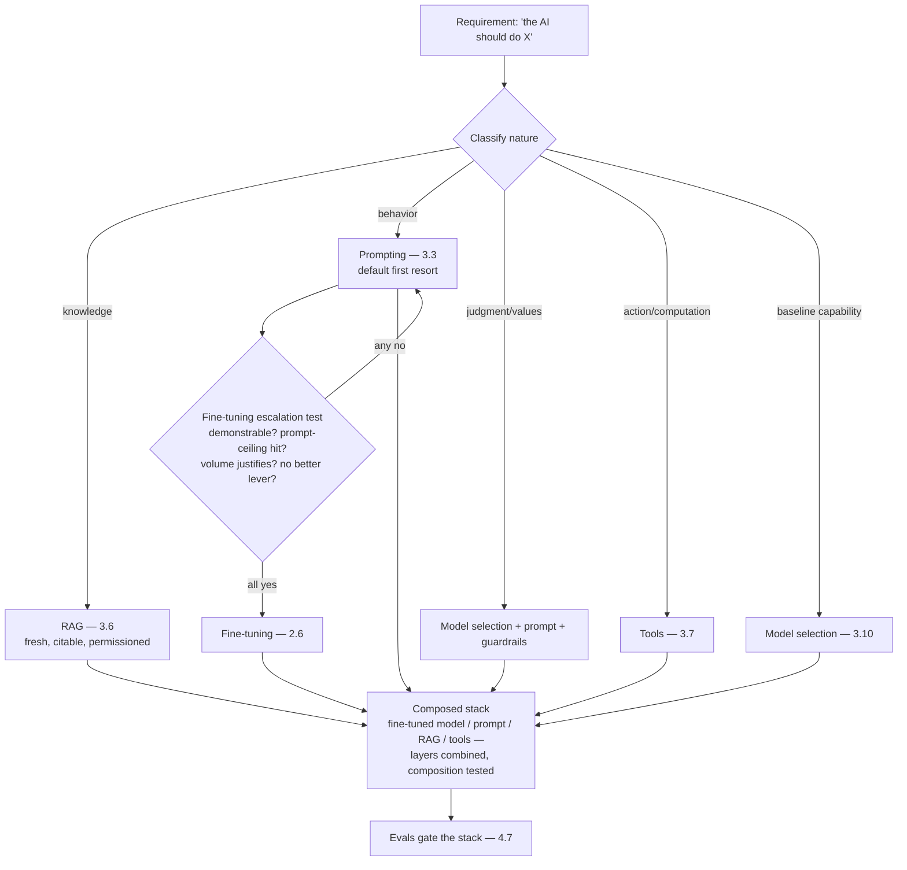

# Chapter 4.13 — Prompting vs. RAG vs. Fine-tuning: the Decision Framework

| | |
|---|---|
| **Part** | 4 — Enterprise GenAI Systems |
| **Maturity level** | 3 — Engineer |
| **Difficulty** | Advanced |
| **Estimated study time** | 3 hours (reading 90 min, exercise 90 min) |
| **Prerequisites** | [2.6](../part-2-artificial-intelligence/chapter-06-training-finetuning-alignment.md); [3.6](../part-3-core-building-blocks-of-genai/chapter-06-rag-fundamentals.md); [1.4](../part-1-professional-foundation/chapter-04-tradeoff-analysis.md) |

## Learning Objectives

After this chapter you will be able to:

1. Apply the full decision framework for how a requirement gets implemented — prompting, RAG, fine-tuning, tools, or a combination — with the sorting logic that makes the choice defensible.
2. Recognize that these are *composable layers*, not competing options, and design the stack that combines them.
3. Run the decision as a 1.4 trade-off analysis with the GenAI-specific criteria: freshness, auditability, unit cost, capability gap, and maintenance burden.
4. Sequence adoption: the cheap-reversible-first ordering that de-risks the knowledge/behavior implementation choice.

## Introduction

This chapter consolidates a decision the curriculum has approached from every angle — 2.6's sorting rule (knowledge → RAG, behavior → fine-tune, judgment → selection), 3.6's RAG case, 2.6's fine-tuning economics, 3.3's prompting discipline — into the single framework an architect applies when a stakeholder says "we need the AI to do X." It is the most common consequential decision in GenAI architecture and the one most often made wrong, usually in the same direction: reaching for fine-tuning (the impressive-sounding option) when prompting or RAG (the boring, correct ones) would serve better, cheaper, and sooner (2.6's expensive-sentence warning, now with its full framework).

The reframe that dissolves most of the confusion: **these are not competing options to choose *between* — they are composable layers to combine.** Production systems routinely run a fine-tuned compact model (behavior), behind a system prompt (instructions), over RAG (knowledge), with tools (actions) — the question is never "which one" but "which requirement lands in which layer," and the framework is the sorting function.

## Business Motivation

The decision's business stakes are large because the options differ by *orders of magnitude* in cost, time, and maintenance. Prompting: hours to change, near-zero marginal cost, instantly reversible. RAG: weeks to build, moderate run cost, the knowledge-freshness and auditability winner. Fine-tuning: a data-preparation-and-training project (six figures and months at enterprise scale — 2.6), a retraining treadmill on every change, and a provider-dependency deepening — justified only where its specific advantages (behavior consistency at volume, unit-cost reduction via compact models) are the actual need. Getting the sorting wrong is expensive in both directions: the misdirected fine-tuning project (the "train on our documents" that should have been RAG — 2.6's Kestrel) burns the six figures and ships late and worse; the under-reach (prompting a task that genuinely needed fine-tuning's consistency, fighting an endless prompt-pile — 3.3) caps quality and inflates per-request cost forever. The framework's business value is routing each requirement to the option whose cost/time/maintenance profile matches its actual need — and the meta-value is *speed*: the cheap-first sequencing means most requirements are satisfied by prompting or RAG in the time a fine-tuning project would still be assembling its dataset, so the framework is a velocity multiplier, not just a cost control.

## Theory

### The layers and what each is *for*

Restating the curriculum's building blocks as an implementation menu, each with its defining strength:

- **Prompting** (3.3) — for *behavior specifiable in instructions and examples*: format, tone, task structure, reasoning approach. Instant, reversible, free. The default first resort for behavior; its ceiling is instruction-drift and context cost when the behavior needs more than a prompt can stably carry.
- **RAG** (3.6) — for *knowledge*: facts, documents, current/private information. The freshness, permissions, auditability, and unit-economics winner (3.6's four reasons). The default and near-only correct resort for anything involving "our documents / current data / who's allowed to see what."
- **Fine-tuning** (2.6) — for *behavior at volume that prompting can't stably or economically carry*: consistent house style, domain-specific task patterns, and — the killer economic case — moving a task from a frontier model to a fine-tuned compact one at 5–20× unit-cost reduction (Kestrel's 82%). Poor for knowledge (unupdatable, unauditable), expensive, provider-binding.
- **Tools** (3.7) — for *actions and precise operations*: computation, current lookups, system interactions — the compensations for capability limits (3.1) and the bridge to acting (4.4).
- **Model selection** (3.10) — for *baseline capability and judgment/values*: the alignment residue and raw capability you *choose* rather than build (2.6).

### The sorting framework

The decision procedure, requirement by requirement:

1. **Classify the requirement's nature** — is it about *knowledge* (facts, documents, freshness), *behavior* (format, style, task pattern), *judgment/values* (refusal, tone-of-values), *action/computation*, or *baseline capability*? This is the primary sort (2.6's rule), and most requirements classify cleanly once the question is asked.
2. **Route to the default layer**: knowledge → RAG; behavior → prompting (then fine-tuning if the prompt can't carry it — see the escalation below); judgment → model selection + system prompt + guardrails; action → tools; capability → model selection. Write the routing with its reason (the ADR).
3. **Apply the fine-tuning escalation test** — only escalate behavior from prompting to fine-tuning when *all* hold: the behavior is demonstrable (you have or can create quality examples — 2.6's demonstration constraint), prompting has been tried and hits a real ceiling (consistency, prompt-length cost, or latency — measured, not assumed), the volume justifies the project (the unit-cost math closes — 1.7), and there's no better lever (a smaller prompted model, a better example set). The test is deliberately strict because the default failure is escalating too eagerly.
4. **Compose the layers** — the requirement set as a whole maps to a *stack*, not a single choice; design the combination (the fine-tuned model over RAG behind a prompt with tools) and verify the layers don't conflict (a fine-tune's baked-in behavior fighting a system prompt's instruction — test the composition).

### The decision as a 1.4 trade-off

For the genuinely contested cases (the ones where two layers could plausibly serve), run the full 1.4 analysis with the GenAI-specific criteria:

| Criterion | Prompting | RAG | Fine-tuning |
|---|---|---|---|
| Knowledge freshness | Cutoff-bound | **Current (re-index)** | Frozen at training |
| Auditability (why this answer) | Prompt-visible | **Citable to source** | Opaque (weights) |
| Change speed | **Hours** | Days (re-index) | Weeks (retrain) |
| Unit cost | Baseline | + retrieval | **Lowest** (compact model) |
| Build cost / time | **Minimal** | Moderate | High |
| Maintenance | **Low** | Pipeline upkeep | Retraining treadmill |
| Consistency | Variable | Variable | **Highest** |
| Capability ceiling | Model's | Model's + knowledge | Model's + behavior |

The table's shape shows why the defaults are the defaults: prompting and RAG dominate on the criteria that usually matter most (speed, auditability, freshness, maintenance), and fine-tuning wins narrowly on consistency and unit cost — the exact profile of its legitimate case (high-volume behavior where those two criteria dominate).

### Sequencing: cheap and reversible first

The adoption ordering (1.4's reversibility discipline, applied): **prompt first** (hours, reversible — establishes the baseline and often suffices), **add RAG if knowledge is involved** (the freshness/audit requirement is usually non-negotiable, so this is early), **add tools for actions/computation**, **fine-tune last and only if the escalation test passes** (the expensive, least-reversible option earns its place by exhausting the cheaper ones). This sequencing is a de-risking strategy: each step's evals reveal whether the next is needed, so you rarely build the expensive layer speculatively — the fine-tuning decision is made with prompting-and-RAG evidence in hand, not as a first guess.

## Architecture Perspective

Readings. **The layers compose along the request path** — RAG supplies context, the prompt shapes behavior, the (possibly fine-tuned) model generates, tools act; they're stacked stages (3.4's typed joints), not alternatives, and the architecture is the composition. **The decision is per-requirement, the stack is per-system** — a system's requirement set sorts across layers (this fact → RAG, this style → fine-tune, this action → tool), and the architect's output is the mapping plus the assembled stack, recorded as ADRs (2.6's sorting rule as the standing artifact). **And the framework is a bulwark against the fashionable-option pull** — "let's fine-tune" and "let's build an agent" (3.8) are the two most common over-reaches, and the framework's strict escalation tests (this chapter's fine-tuning test; 3.8's autonomy grid) are the same defense in two places: make the expensive, impressive option earn its place against the boring, correct default, with evidence.

## Real-world Example

**Kestrel Assurance** (1.6, 2.6, 3.3) is the framework's canonical worked example because Marta ran it explicitly on the claims-correspondence requirement set — and it sorted the two proposals (2.6) into opposite layers by the framework's logic. The requirement set decomposed: *"answers must reflect current policy terms"* → knowledge, current, citable → **RAG** (the freshness and the liability-audit requirement made it non-negotiable; the "fine-tune on the policy manuals" proposal failed the classification at step one — knowledge isn't a fine-tuning job). *"drafts must match our empathetic house register"* → behavior → **prompting first**, which is where the framework's escalation test did its real work: prompting *carried* the register adequately but at 6K tokens of style instruction and few-shot per call (a measured prompt-length cost and a consistency wobble across edge cases), the volume was high (every claim letter), and quality demonstrations existed (3,000 adjuster-approved letters) — all four escalation conditions met, so fine-tuning was *justified* here (the 82% cost cut, the consistency win — 2.6). *"never use liability-admitting language"* → judgment/values with a hard line → **guardrails + system prompt** (4.8's blocklist, not a fine-tune — a hard line needs enforcement, not trained tendency). *"draft, don't send"* → action gating → **tools/workflow** (3.7). The composed stack: a fine-tuned compact model (register), behind a system prompt (instructions), over RAG (current policy), with guardrails (liability line) and workflow gating (send control) — five layers, each holding the requirement its nature sorted it to. The sequencing proved the de-risking: RAG and prompting shipped in weeks and revealed (via evals) that the register genuinely needed fine-tuning's consistency — the expensive layer built with evidence, not as a first guess. Marta's ADR, quoted in the earlier chapters, is the framework in one line: *"Retrieval for what we know, fine-tuning for how we sound, guardrails for the lines we don't cross, workflow for what we do — each requirement to its own layer."*

## Hands-on Exercise

**Sort a requirement set and design the stack.** ~90 minutes. Use a system you know or [CS06 — Relationship Manager Copilot](../../case-studies/README.md) (banking RM assistant: current product info, house advisory style, suitability-rule compliance, CRM actions).

1. **Decompose and classify (30 min).** Break the system into 8–10 discrete requirements. Classify each by nature (knowledge / behavior / judgment / action / capability). Be honest about the ambiguous ones — note why.
2. **Route with reasons (25 min).** Route each to its default layer (knowledge → RAG, etc.). For any behavior requirement, apply the fine-tuning escalation test explicitly — does it pass all four conditions, or stay in prompting? Write the reason per routing (the ADR content).
3. **Design the stack (20 min).** Assemble the composed stack from your routings; draw the layer diagram; identify any composition risk (a fine-tune fighting a prompt, a guardrail conflicting with a tool). State how you'd test the composition.
4. **Sequence (15 min).** Order the build: prompt-first, RAG-early-if-knowledge, tools-for-actions, fine-tune-last-if-justified. State what each step's evals would need to show to justify proceeding to the next.

**Acceptance criteria:**
- [ ] Every requirement classified by nature with the ambiguous ones reasoned through
- [ ] Fine-tuning escalation test applied explicitly to behavior requirements (passed or failed against all four conditions)
- [ ] Composed stack designed with composition risks named and a test approach
- [ ] Build sequence is cheap-reversible-first with eval gates between steps

## Enterprise Considerations

The framework meets enterprise realities that sharpen its defaults. **Fine-tuning's hidden enterprise costs** (2.6): beyond training, the data-rights clearance (whose text are the demonstrations? — works-council and privacy review), the artifact governance (adapter registry, lineage, the retraining-on-model-deprecation treadmill — 3.10's fire drill applied to every fine-tune), and the deepened provider lock-in (7.10) — all of which push the escalation test's bar higher in enterprise contexts than the raw capability case suggests. **RAG's enterprise defaults strengthen** correspondingly: its auditability is often a *requirement* not a preference (regulated decisions need the citation — 4.14), which removes fine-tuning from contention for knowledge tasks entirely in regulated domains. **The build-vs-buy dimension layers on** (6.8): "fine-tune a model" competes not just with prompting and RAG but with "buy a vendor's domain-specialized model" — the framework's escalation test extends (is the behavior worth building *or buying* the fine-tune for, vs. prompting a general model?). **And governance wants the decision recorded** (6.9): the per-requirement routing ADRs are review-board inputs and audit evidence — the framework produces the paper trail that shows *why* knowledge lives in RAG (auditable) rather than weights (opaque), which is itself a compliance argument in regulated deployments.

## Trade-offs

| Decision | Option A | Option B | Choose A when… | Choose B when… |
|----------|----------|----------|----------------|----------------|
| Knowledge implementation | RAG | Fine-tune on documents | Almost always — fresh, citable, auditable | Never for changing facts; narrow *fluency* adaptation only (2.6) |
| Behavior implementation | Prompting | Fine-tuning | Default — instant, reversible, free | All four escalation conditions met (demonstrable, prompt-ceiling, volume, no better lever) |
| Contested cases | Full 1.4 analysis with the criteria table | Intuition / fashion | Always for genuine two-layer contests | Never — the fine-tune-because-impressive pull is the failure mode |
| Sequencing | Cheap-reversible-first, eval-gated | Build the expensive layer speculatively | Always — evidence before the expensive commitment | Never; speculative fine-tuning is the six-figure guess |

## Common Mistakes

1. **Fine-tuning for knowledge** — the flagship error (2.6, re-emphasized): "train on our documents" for facts that change; RAG's job, and fine-tuning does it worse, staler, and unauditably.
2. **Fine-tuning-first** — reaching for the impressive option before exhausting prompting and RAG; the escalation test exists precisely to gate this, and most requirements never pass it.
3. **Treating the layers as exclusive** — "should we use RAG *or* fine-tuning?" as if one wins; they compose, and the real question is which requirement lands where (Kestrel's five-layer stack).
4. **Skipping the escalation test** — fine-tuning a behavior that prompting carried fine, paying the project cost for no measured gain over the prompted baseline (2.6's mandatory baseline).
5. **Under-reaching** — fighting an ever-growing prompt-pile (3.3) on a high-volume behavior that genuinely needed fine-tuning's consistency; the escalation test cuts both ways.
6. **Composition-blind stacking** — assembling layers without testing their interaction (the fine-tune's baked behavior fighting the system prompt); composition is tested, not assumed.
7. **Speculative expensive layers** — building the fine-tune before the prompting-and-RAG evidence says it's needed; sequence cheap-first so the expensive decision has evidence.
8. **No recorded routing** — the decision made implicitly, so the next architect (or auditor) can't see why knowledge is in RAG vs. weights; the ADRs are the framework's durable output.

## Best Practices

1. **Classify every requirement by nature first** — knowledge / behavior / judgment / action / capability; the primary sort resolves most decisions immediately.
2. **Route to defaults, escalate only on the test** — knowledge → RAG, behavior → prompting; fine-tune only when all four escalation conditions hold, measured.
3. **Compose, don't choose** — design the layered stack (the requirement set maps to a combination), and test the composition for conflicts.
4. **Run genuine contests as 1.4 analyses** — the criteria table (freshness, audit, cost, speed, maintenance, consistency) with the fashionable-option pull explicitly resisted.
5. **Sequence cheap-reversible-first** — prompt, then RAG, then tools, then fine-tune-if-justified; each step's evals gate the next, so the expensive layer is built with evidence.
6. **Demand the prompted baseline before any fine-tune** (2.6) — fund the measured gap, not the impressive idea.
7. **Record the routing as ADRs** — per-requirement, with reasons; the audit trail and the successor's map.
8. **Re-run the decision on triggers** — model capability improvements can move a requirement's best layer (last year's fine-tune-worthy behavior may be a prompt today); revisit dates on the routing ADRs (1.4).

## Architecture Checklist

For any "make the AI do X" requirement set:

- [ ] Each requirement classified by nature (knowledge / behavior / judgment / action / capability)
- [ ] Each routed to its default layer with a recorded reason (ADR)
- [ ] Fine-tuning escalations pass all four conditions (demonstrable, prompt-ceiling-measured, volume-justified, no-better-lever) or stay in prompting
- [ ] Prompted baseline measured before any fine-tuning commitment (2.6)
- [ ] The composed stack designed; layer conflicts identified and composition tested
- [ ] Build sequenced cheap-reversible-first with eval gates between layers
- [ ] Knowledge implemented as RAG where auditability/freshness matter (regulated → mandatory)
- [ ] Enterprise fine-tuning costs (data rights, artifact governance, provider lock-in, retraining treadmill) weighed in the escalation
- [ ] Routing ADRs recorded with revisit triggers (capability improvements can move the best layer)

## Interview Questions

1. *"A stakeholder wants to fine-tune a model on the company knowledge base. Walk me through your response."* — Strong answers classify it (knowledge → RAG, not fine-tuning — freshness, auditability, cost), salvage any legitimate behavior remainder for the escalation test, and frame the whole thing as sorting requirements to layers, not choosing an option — 2.6/Kestrel's shape.
2. *"Prompting vs. RAG vs. fine-tuning — how do you choose?"* — Strong answers reject the "choose between" framing: classify by requirement nature, route to defaults, escalate to fine-tuning only on the strict four-condition test, and compose the layers — with the criteria table for genuine contests.
3. *"When is fine-tuning actually the right call?"* — Strong answers give the narrow legitimate case: high-volume behavior (not knowledge) where prompting hits a measured consistency/cost/latency ceiling, demonstrations exist, volume justifies the project, and no cheaper lever serves — the Kestrel register, with the 82% unit-cost case.
4. *"How do you sequence building a system that needs current data, a house style, and the ability to take actions?"* — Strong answers sequence cheap-first (prompt the style, RAG the data, tools the actions), gate each step on evals, and fine-tune the style *last and only if* the prompted baseline hits a real ceiling — de-risking the expensive layer with evidence.

## Further Reading

- 2.6 Training, Fine-tuning & Alignment (re-read the sorting rule and economics) — this chapter is its decision framework fully elaborated; the two are a pair.
- Your provider's guidance on RAG vs. fine-tuning (docs.anthropic.com and equivalents) — the vendor's own framing of the trade, useful cross-reference against this chapter's framework.
- 3.6 RAG Fundamentals (the four business reasons) and 3.3 Prompt Engineering (the discipline) — the default-layer chapters this framework routes to.
- The [architecture review checklist](../../checklists/architecture-review-checklist.md) — its design section's "workflow vs. agent" and model-choice lines extend to this chapter's layer-routing decisions.

## Summary

- Prompting, RAG, fine-tuning, tools, and model selection are **composable layers, not competing options** — the question is never "which one" but "which requirement lands in which layer," and the framework is the sorting function.
- **Classify by requirement nature** (knowledge → RAG, behavior → prompting, judgment → selection + guardrails, action → tools, capability → model), then route to defaults.
- **Fine-tuning escalates from prompting only on a strict four-condition test** (demonstrable, prompt-ceiling-measured, volume-justified, no-better-lever) — deliberately strict because escalating too eagerly is the default failure, and knowledge is *never* its job.
- The layers **compose into a per-system stack** (Kestrel's five layers, each holding its sorted requirement); design and test the composition, and record the routing as ADRs.
- **Sequence cheap-reversible-first** — prompt, RAG, tools, then fine-tune-if-justified — so the expensive, least-reversible layer is built with evidence, not as a first guess. The framework's decisions, and everything in Part 4, run inside the governance the final chapter covers: **privacy, compliance & AI governance** (4.14).

---

**Previous:** [Chapter 4.12 — Latency & Performance Engineering](chapter-12-latency-performance.md) · **Next:** [Chapter 4.14 — Privacy, Compliance & AI Governance](chapter-14-privacy-compliance-governance.md) · **Related:** [2.6 Training, Fine-tuning & Alignment](../part-2-artificial-intelligence/chapter-06-training-finetuning-alignment.md), [3.6 RAG Fundamentals](../part-3-core-building-blocks-of-genai/chapter-06-rag-fundamentals.md), [1.4 Trade-off Analysis](../part-1-professional-foundation/chapter-04-tradeoff-analysis.md)
