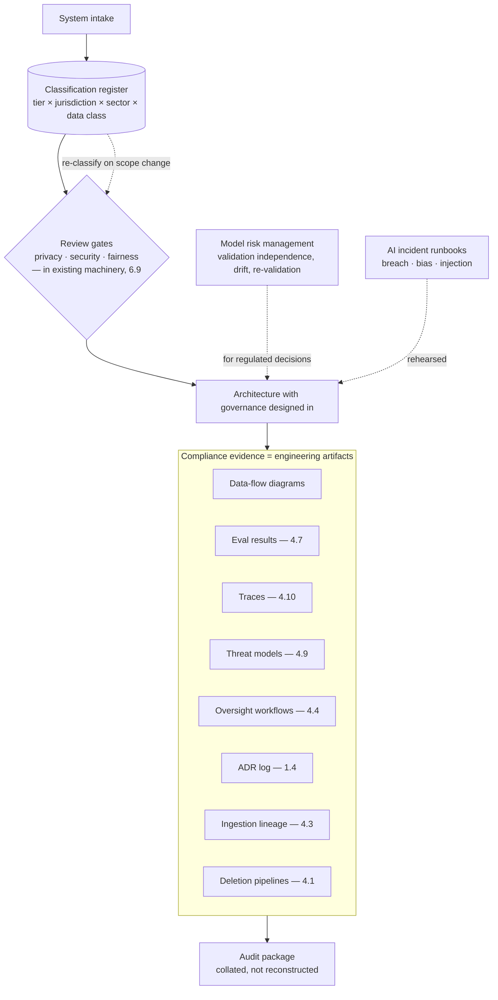

# Chapter 4.14 — Privacy, Compliance & AI Governance

| | |
|---|---|
| **Part** | 4 — Enterprise GenAI Systems |
| **Maturity level** | 3 — Engineer |
| **Difficulty** | Advanced |
| **Estimated study time** | 4 hours (reading 2 h, exercise 2 h) |
| **Prerequisites** | [2.8 Responsible AI](../part-2-artificial-intelligence/chapter-08-responsible-ai.md); [4.1](chapter-01-production-rag.md); [4.10](chapter-10-observability.md) |

## Learning Objectives

After this chapter you will be able to:

1. Map privacy obligations (GDPR-class rights, HIPAA-class rules, data residency) onto concrete GenAI architecture: data flows, retention, deletion, and the third-party-processor problem.
2. Build the compliance evidence GenAI systems need — assembled from engineering artifacts (evals, traces, ADRs) rather than produced separately.
3. Operate AI governance as a function: the classification register, review gates, model risk management, and the audit-readiness posture.
4. Turn the whole Part 4 apparatus into a system that can answer "how do you know?" and "prove it" for any regulator, court, or board.

## Introduction

This chapter closes Part 4 by wrapping everything it built in the governance that makes it deployable in a regulated enterprise — and its thesis, established across the Part, is that **governance done well is mostly the engineering you should already have done, formatted as evidence.** The eval suites (4.7), the traces (4.10), the ACL enforcement (4.1), the guardrails (4.8), the security threat models (4.9), the decision ADRs (1.4) — each was built for engineering reasons and each is *also* a compliance artifact; the governance chapter's job is to make that dual-use explicit and to add the wrapping (classification, review gates, evidence assembly) that turns a well-engineered system into an auditable one.

The framing 2.8 established holds: compliance is the floor, arriving late, codifying failures that were architecture and evaluation failures first. This chapter builds the floor into the architecture from the start, because retrofitting governance onto a shipped system costs multiples (2.8's one-way-door classification) and because the systems that treat governance as designed-in clear review in days while the bolted-on ones stall for months (4.1's Meridian, generalized to the whole regulatory surface).

## Business Motivation

GenAI governance is where the program's largest tail risks live and where its license to operate is granted or revoked. The exposure classes are concrete and quantified: **privacy penalties** (GDPR-class regimes at percentages of global turnover; sectoral rules — HIPAA, financial-privacy — with their own enforcement) triggered by the data-flow failures GenAI makes easy (PII in prompts sent to third-party processors, personal data in traces retained forever, right-to-be-forgotten that doesn't reach the vector index — 4.1); **regulatory exposure** from the AI-specific regimes (2.8's risk tiers, now with the architecture obligations) where a high-risk system lacking documented evals, human oversight, or audit logging is a finding regardless of quality; and **the deployment veto** — the system that can't clear privacy and compliance review doesn't launch, so governance readiness is directly a time-to-market variable (the difference between the days-long and months-long review). The positive framing that motivates the engineering: the enterprise's willingness to deploy GenAI *at all* in its high-value regulated workflows (healthcare, finance, legal — where the [case-study catalog's](../../case-studies/README.md) biggest cases live) depends entirely on the governance being real — so governance capability is not a tax on the program, it's the *enabler* of the program's most valuable half, and the architect who builds it well unlocks the deployments the architect who treats it as afterthought never reaches.

## Theory

### The privacy architecture

GenAI stresses privacy in specific, enumerable ways (2.8's data protection, architected):

- **Data flows are the first artifact** — the data-flow diagram (1.5) showing every path personal data travels: into prompts (and thus to the model provider — a third-party processor), into retrieval indexes (4.1), into traces and logs (4.10), into training/fine-tuning data (2.6), into caches (4.11). The diagram is the privacy review's core input and the map for every subsequent control; a GenAI system whose personal-data flows aren't diagrammed is un-reviewable.
- **The third-party processor problem** — sending prompts to an external model API is a data-processing transfer to a processor, governed by data-processing agreements, the provider's data-use and retention terms (do they train on it? retain it? where?), and cross-border transfer rules (residency). This is the flow that surprises teams: the convenience of the API call is a personal-data export with contractual and regulatory weight — read the provider terms per data class (2.6/3.10's operational-fit gates, now as compliance controls), and for the most sensitive data, the answer may be self-hosting (5.3) or a provider with the right terms and region.
- **Data minimization and PII handling** — the least-data principle applied: redact/pseudonymize PII before it enters prompts and traces where the task doesn't need the raw values (4.8's PII detection, 4.10's redaction-at-capture), retain the minimum for the minimum time (retention tiers everywhere — traces, caches, indexes), and classify all data so the controls know what they're protecting.
- **The data-subject rights, mechanized** — access, correction, deletion, portability as *implemented pipeline operations*: right-to-be-forgotten propagating through source → index → chunks → vectors → caches → traces (4.1's deletion probes, 4.10's trace deletion, reaching everywhere personal data landed), with proof. The right that most exposes GenAI's data sprawl, because personal data spreads across more stores than teams track.
- **Residency and sovereignty** — where data is processed and stored, constrained by law and contract (5.11's subject); a one-way-door architecture input (1.4) that partitions the design space (which providers, which regions) before capability does.

### Compliance evidence from engineering artifacts

The chapter's central efficiency: the evidence regulated GenAI needs *is* the engineering, assembled:

| Obligation | Engineering artifact that satisfies it |
|---|---|
| Documented risk management | Threat models (4.9), risk registers (1.7), the classification register (below) |
| Data governance | Data-flow diagrams, ingestion lineage (4.3), retention/deletion pipelines (4.1) |
| Accuracy/quality standards | Eval suites and results (4.7), the golden sets and gates |
| Human oversight | Approval workflows (4.4), review queues, the oversight-effectiveness metrics (2.8) |
| Logging & traceability | Traces (4.10), tool logs (3.7), audit-reconstruction (4.1) |
| Transparency | Model/system documentation, ADRs (1.4), user-facing AI disclosure |
| Decision records | The ADR log (1.4) — why the system is the way it is |

The discipline: **build the artifacts documentable from the start** — an eval result formatted for a regulator, a trace store designed as evidence, an ADR written to be read by a compliance officer — so that "assemble the compliance package" is a collation task, not a scramble to reconstruct what the system does (Bellhaven's regulator submission "assembled from artifacts that already existed" — 2.8, generalized). The failure mode this prevents: the audit that requires a document that doesn't exist, which is an engineering-practice gap surfacing as a compliance finding.

### AI governance as a function

The operating structure (2.8's governance, built out):

- **The classification register** — every AI system, its risk tier (2.8), jurisdictions, sectoral rules, data classes, owner, and review date; the portfolio-level source of truth (2.1's wave-map, now the compliance backbone) and the first thing a regulator asks for. Classification happens at intake and re-runs on scope change (the drafting tool that becomes a decision tool — 2.8's re-classification trigger).
- **Review gates** — governance checkpoints in the delivery lifecycle: privacy review (the data-flow diagram), security review (4.9's threat model), a fairness/impact assessment where applicable (2.8), and sign-off proportionate to the risk tier — integrated into the existing review machinery (6.9), not a parallel bureaucracy (2.8's integration-vs-parallel lesson, which decides whether governance is followed or routed around).
- **Model risk management** — for regulated decisions (banking's SR 11-7-style regimes spreading via AI regulation — 2.7): validation independence (the team validating isn't the team shipping), documented model behavior, monitoring for drift, and the periodic re-validation that treats the LLM system like the credit model it's regulated as.
- **Incident readiness** (2.8/4.9) — AI-specific runbooks (the privacy breach via completions, the discriminatory-outcome discovery, the injection incident), serious-incident reporting duties (increasingly mandated), and the tabletop rehearsal that makes the runbook real.

### The "how do you know / prove it" test

The chapter's synthesizing lens: for any claim the system makes or any control it relies on, can you *answer how you know and prove it with an artifact*? "The assistant is accurate" → the eval suite and results (4.7). "Users only see permitted documents" → the ACL architecture and audit reconstruction (4.1). "We don't send PHI to the provider" → the data-flow diagram and redaction pipeline. "A human reviews consequential decisions" → the approval workflow and its oversight metrics (4.4). A control you can't evidence is a control you don't have (from the auditor's view, and often in reality), and the whole Part 4 apparatus is what makes the answers exist — Bellhaven's regulator exit note ("able to answer 'how do you know?' for every claim" — 2.8) is this chapter's exit criterion for the entire Part.

## Architecture Perspective

Readings. **Governance is a cross-cutting concern with security's status** (2.8's line, realized): designed in from intake, not reviewed at the end — the classification is the one-way-door input (which tier determines which controls are *architecturally required*), and retrofitting oversight, audit logging, or data-flow controls onto a shipped system costs multiples. **The evidence is dual-use engineering** — every artifact in the evidence subgraph was built for an engineering reason in an earlier chapter and serves compliance without separate production, which is why a *well-engineered* Part 4 system is *most of the way* to a governed one (and a system that skipped the engineering — no evals, no traces, no ACL enforcement, no ADRs — is un-governable, not just non-compliant: there's nothing to assemble). **And the register is the portfolio's governance backbone** — the enterprise doesn't govern systems one at a time but as a portfolio (6.9's boards, 6.10's TCO), and the classification register is the shared source of truth that makes portfolio governance, regulatory response, and the "what AI do we even run?" question answerable — the humble spreadsheet that is, at enterprise scale, a compliance-critical asset.

## Real-world Example

**Meridian Health Partners** (1.5, 3.6, 4.10) — the clinician assistant is a HIPAA-regulated, high-risk-tier system, and its governance story is the chapter's synthesis because governance was designed in from the 4.1-era security review onward rather than bolted on. The **data-flow diagram** (built for the 1.5 security review) doubled as the privacy review's core artifact: it showed PHI's every path — into prompts (with the de-identification step marked — the redaction that kept the *minimum* PHI in the provider transfer), into the vector index (ACL-governed — 4.1), into traces (the 4.10 redaction-at-capture and the classified, access-controlled, retention-tiered trace store that signed without a finding), and to the model provider (a BAA-covered processor with contractual no-training terms and in-region processing — the third-party-processor problem, contracted). The **evidence-from-engineering** thesis held at the annual HIPAA and the state AI-transparency reviews: the accuracy obligation was met by the 4.7 eval suite and results (the clinical faithfulness rubric, the golden sets, the gates); the human-oversight obligation by the 4.4-style review and the clinician-in-the-loop design (with the designed refusal — 3.6 — as documented evidence of the "know your limits" boundary); the traceability obligation by the 4.10 traces; the decision rationale by the ADR log — *"the package was collation, not archaeology"* (the compliance lead's phrase). The **right-to-be-forgotten** drill was the hardest engineering: a patient's deletion request had to propagate through source records, the vector index (chunks and embeddings — 4.1's probes), the trace store (4.10), and the caches — the pipeline built and tested to prove zero residual PHI, with the automated probe as the standing evidence. And the **classification register** entry drove it all: high-risk tier + HIPAA + state AI law + PHI data class → the control set was determined at intake, which is why nothing was retrofitted. The medical director's governance-review summary, closing the case as it closed 2.8: *"We can answer 'how do you know?' for every promise the system makes — because we built the answers as we built the system."*

## Hands-on Exercise

**Build the governance layer for a regulated system.** ~2 hours. Use [CS01 — Clinical Documentation Assistant](../../case-studies/README.md) or a regulated system from your work.

1. **Classification (20 min).** Determine risk tier (2.8), jurisdictions, sectoral rules, and data classes. Write the classification register entry. Identify what scope change would re-classify it upward.
2. **Data-flow diagram (35 min).** Diagram every path personal/sensitive data travels: prompts (→ provider), index, traces, caches, any training data. Mark the controls on each path (redaction, de-identification, ACL, retention tier) and flag the third-party-processor transfer with its required terms.
3. **Evidence mapping (35 min).** For each of six obligations (risk management, data governance, accuracy, human oversight, traceability, decision records), name the specific engineering artifact (from your Part 4 builds or the case) that satisfies it — and identify any obligation with *no* artifact (that's your gap, and your finding-in-waiting).
4. **The deletion drill and the "prove it" test (30 min).** Trace a right-to-be-forgotten request through every store your data-flow diagram shows; state how you'd prove zero residual. Then take three claims the system makes ("accurate," "permissioned," "oversought") and write the artifact that proves each — flag any you can't evidence.

**Acceptance criteria:**
- [ ] Classification register entry complete with the re-classification trigger
- [ ] Data-flow diagram shows every sensitive-data path with controls marked and the processor transfer flagged
- [ ] Every obligation mapped to a specific artifact; gaps (obligations with no artifact) identified
- [ ] Deletion drill reaches every store; three system claims each have a proving artifact or a flagged gap

## Enterprise Considerations

This chapter *is* largely enterprise considerations, but the operating realities compound. **Governance is a function needing an owner** (6.9): the classification register, review gates, and MRM need a home — typically an AI governance body threaded into existing risk, privacy, and security functions, with the failure mode being the parallel bureaucracy that teams route around (2.8's lesson, load-bearing) versus the integrated one that designs-in. **The regulatory surface is multi-layered and moving**: a single system faces AI-specific law (EU AI Act-class), sectoral regulation (health, finance), privacy law (GDPR-class), and jurisdiction-specific rules simultaneously — the classification register's multi-dimensional entry (tier × sector × jurisdiction × data class) exists because the obligations *stack*, and the architecture that's configurable per jurisdiction (5.11) is what serves the multinational reality. **Vendor and provider diligence is inherited liability** (2.8's deployer-duty): the model provider's terms, the tool servers' security (4.9's supply chain), the fine-tuning data rights (2.6) — all flow into the deploying enterprise's compliance posture, and procurement needs AI-specific clauses (data use, incident notification, sub-processor disclosure, use-restriction flow-down). **And board-level AI governance is arriving**: AI risk is increasingly a board and audit-committee topic (2.8's incident tax at governance scale), which makes the portfolio-level register, the aggregate risk view, and the incident-readiness posture reporting artifacts — the architect's governance work feeding the enterprise's highest oversight tier.

## Trade-offs

| Decision | Option A | Option B | Choose A when… | Choose B when… |
|----------|----------|----------|----------------|----------------|
| Governance timing | Designed in from intake | Reviewed at the end | Always — retrofitting costs multiples (one-way door) | Never; end-review is the months-long stall |
| Provider data handling | Contracted terms (BAA, no-training, in-region) on managed API | Self-hosting | Terms available and sufficient for the data class | Most sensitive classes where no acceptable terms exist (5.3) |
| Governance structure | Integrated into existing risk/privacy/security | Parallel AI-governance bureaucracy | Always — integration is followed | Never — parallel is routed around (2.8) |
| Evidence production | Assembled from engineering artifacts | Produced separately for audit | Always — dual-use, collation not scramble | Never; separate evidence means the engineering didn't produce it, which is the deeper gap |

## Common Mistakes

1. **Governance as afterthought** — the security/privacy/fairness review at the end, discovering the missing oversight component or audit logging when retrofitting costs multiples (2.8's one-way door); design in from intake via the classification.
2. **The un-diagrammed data flow** — personal data's paths untracked, so the third-party transfer, the trace retention, and the cache are invisible until the breach or the audit; the data-flow diagram is the un-skippable first artifact.
3. **The API-call-as-innocent** — treating the model API as internal when it's a personal-data export to a processor; read the terms per data class, contract the transfer, or self-host the sensitive.
4. **Deletion that doesn't reach the sprawl** — right-to-be-forgotten propagating to the source but not the index, chunks, embeddings, caches, and traces; personal data spreads further than teams track (4.1's probes, everywhere).
5. **Evidence produced separately** — scrambling to document what the system does at audit time, because the engineering didn't produce documentable artifacts; the artifacts are built documentable from the start, or the audit is archaeology.
6. **The parallel governance bureaucracy** — an AI-governance function disconnected from existing risk machinery, experienced as pure friction and routed around (1.8's adoption logic, governance edition); integrate.
7. **Classification skipped or stale** — building before determining the tier (2.8), or not re-classifying when scope creep turns a tool into a decision system; the register drives the controls, and a stale register mis-governs.
8. **A control you can't evidence** — relying on "we have oversight / it's accurate / it's permissioned" with no artifact to prove it; from the auditor's view (and often in reality) it's not a control.

## Best Practices

1. **Classify at intake; let the tier drive the controls; re-classify on scope change** — the register is the governance backbone and the one-way-door input.
2. **Diagram the data flows first** — every personal-data path with its controls; the un-skippable artifact for privacy review and the map for every subsequent control.
3. **Treat the model API as a processor transfer** — contracted terms per data class, residency respected, redaction minimizing what's transferred; self-host where no terms suffice.
4. **Build compliance evidence as dual-use engineering** — evals, traces, threat models, ADRs formatted documentable from the start; the audit package is collation.
5. **Mechanize the data-subject rights** — deletion propagating through every store with automated proof; access and correction as pipeline operations.
6. **Integrate governance into existing machinery** — review gates in the existing lifecycle, MRM in the existing risk function; never parallel.
7. **Run the "how do you know / prove it" test on every claim** — a control without an artifact isn't a control; the test is the Part 4 exit criterion.
8. **Rehearse the AI incident** — breach-via-completions, discriminatory-outcome, injection; the runbook and the tabletop, because reporting duties run on regulators' clocks.

## Architecture Checklist

For any GenAI system touching personal data or regulated decisions:

- [ ] Classification register entry: tier × jurisdiction × sector × data class, owner, review date, re-classification trigger
- [ ] Data-flow diagram maps every personal/sensitive-data path with controls marked; processor transfers flagged with required terms
- [ ] Model-provider transfer contracted (data-use, retention, residency, sub-processors) per data class; self-hosting where terms insufficient
- [ ] Data minimization applied: redaction/pseudonymization before prompts and traces; retention tiers on all stores (index, traces, caches)
- [ ] Data-subject rights mechanized: deletion propagating through source → index → chunks → vectors → caches → traces, with automated proof
- [ ] Compliance evidence mapped to engineering artifacts (evals, traces, threat models, oversight workflows, ADRs, lineage); gaps identified
- [ ] Review gates (privacy, security, fairness) integrated into the delivery lifecycle, sign-off proportionate to tier
- [ ] Model risk management for regulated decisions: validation independence, drift monitoring, re-validation
- [ ] AI-specific incident runbooks exist and are rehearsed; reporting duties known
- [ ] Every system claim ("accurate," "permissioned," "oversought") has a proving artifact — the "how do you know?" test passes

## Interview Questions

1. *"How do you handle privacy for a GenAI system that processes customer data through a third-party model API?"* — Strong answers name the processor-transfer framing (contracted terms, residency, data-use), the data-flow diagram as the first artifact, minimization/redaction before the transfer, and the deletion-propagation problem across the full data sprawl (index, traces, caches) — with self-hosting as the escape for the most sensitive.
2. *"A regulator asks you to demonstrate your high-risk AI system is compliant. What do you show them?"* — Strong answers produce the evidence-from-engineering package (classification register, data-flow diagram, eval results, traces, threat model, oversight workflows, ADRs) and stress it's collation not reconstruction *because* the artifacts were built documentable — Bellhaven/Meridian's "answer how you know for every claim."
3. *"Where does AI governance go wrong in enterprises?"* — Strong answers name the recurring failures: afterthought timing (retrofit multiples), the parallel bureaucracy that's routed around, evidence produced separately (the engineering didn't create it), classification skipped or stale, and the un-evidenced control — and the fixes (design-in, integrate, dual-use artifacts, register-driven).
4. *"Walk me through implementing right-to-be-forgotten in a RAG system."* — Strong answers trace the full sprawl (source, index chunks, embeddings, caches, traces, any fine-tuning data), mechanize the propagation pipeline, and prove it with automated probes — recognizing that GenAI's data spread is wider than teams track and the proof is the deliverable.

## Further Reading

- The EU AI Act (EUR-Lex) and your sector's AI/data regulations (official sources) — read the obligations for your systems' risk tier directly; 2.8 is the conceptual companion, this chapter the architectural one.
- Your data-protection authority's guidance on AI and GDPR-class rights (official regulator sources) — the data-subject-rights and processor-transfer specifics that drive the deletion and contracting architecture.
- Your model providers' data-processing terms, BAAs, and residency documentation (official docs) — the third-party-processor contract reality; read per data class, reread at renewal.
- The [security checklist](../../checklists/security-checklist.md) and [architecture review checklist](../../checklists/architecture-review-checklist.md) — their data-protection and governance sections are this chapter operationalized; apply to P14 and P17, the compliance-centric projects.

## Summary

- **Governance done well is mostly the engineering you already did, formatted as evidence** — evals, traces, ACLs, threat models, and ADRs are dual-use, so a well-engineered Part 4 system is most of the way to a governed one (and a system that skipped the engineering is un-governable, not just non-compliant).
- **Privacy is a data-flow problem**: diagram every path personal data travels (prompts → provider, index, traces, caches), treat the model API as a **processor transfer** (contracted, residency-bound, minimized), and mechanize **data-subject rights** across the full sprawl with automated proof.
- **Governance is a function**: the classification register (tier × jurisdiction × sector × data class) as the backbone, review gates integrated into existing machinery (never parallel), model risk management for regulated decisions, and rehearsed AI incident runbooks.
- **Classification is designed in from intake** — the one-way-door input that determines which controls are architecturally required; retrofitting costs multiples.
- The synthesizing test — **"how do you know / prove it"** — is Part 4's exit criterion: every claim and control has a proving artifact, or it isn't real. This closes the production core of the curriculum; **Part 5** turns to the cloud and platform infrastructure it all runs on.

---

**Previous:** [Chapter 4.13 — Prompting vs. RAG vs. Fine-tuning](chapter-13-prompting-rag-finetuning.md) · **Next:** [Part 5 — Cloud, Infrastructure & Platform Engineering](../part-5-cloud-infrastructure-platform/) · **Related:** [2.8 Responsible AI](../part-2-artificial-intelligence/chapter-08-responsible-ai.md), [4.1 Production RAG](chapter-01-production-rag.md), [4.10 Observability](chapter-10-observability.md), [6.9 Architecture Governance](../part-6-enterprise-architecture/chapter-09-architecture-governance.md)
