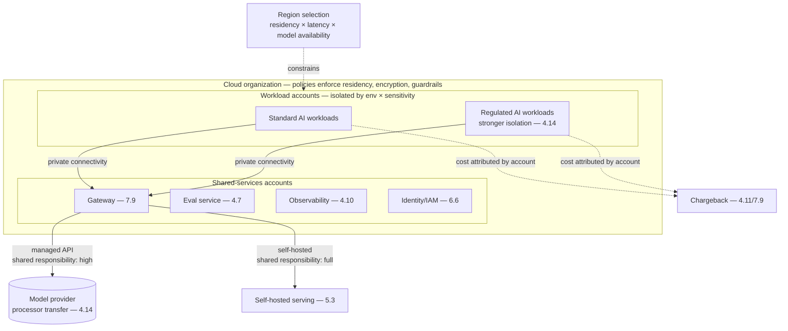

# Chapter 5.1 — Cloud Architecture Fundamentals for AI Workloads

| | |
|---|---|
| **Part** | 5 — Cloud, Infrastructure & Platform Engineering |
| **Maturity level** | 2 — Build |
| **Difficulty** | Intermediate |
| **Estimated study time** | 3 hours (reading 90 min, exercise 90 min) |
| **Prerequisites** | [2.3 Deep Learning Fundamentals](../part-2-artificial-intelligence/chapter-03-deep-learning-fundamentals.md); basic cloud familiarity |

## Learning Objectives

After this chapter you will be able to:

1. Reason about the cloud primitives AI workloads depend on — regions, zones, accounts/subscriptions, networking, identity — through the lens of GenAI's specific needs.
2. Apply the shared-responsibility model to GenAI, knowing what the provider secures and what remains yours across managed-API vs. self-hosted choices.
3. Design landing zones and account structures that keep AI workloads isolated, governed, and cost-attributable.
4. Place the managed-vs-self-hosted decision in its cloud context: where GenAI capability is consumed and what that implies for architecture.

## Introduction

Part 5 turns from *what* GenAI systems do (Parts 3–4) to *what they run on*. This first chapter is the cloud substrate — deliberately foundational, because GenAI architecture decisions constantly bottom out in cloud primitives (a residency requirement is a region decision, a tenancy model is an account-structure decision, a latency SLO is partly a networking decision — 4.12) and an architect fluent in the AI stack but vague on the cloud beneath it designs systems that don't survive contact with the platform team. The chapter is cloud-agnostic by design (2.1's timeless-over-tools discipline): the concepts — regions, zones, isolation, identity, shared responsibility — are stable across AWS, Azure, and GCP, which appear only as interchangeable examples.

The framing: GenAI added a new *kind* of workload to the cloud (2.3's two-plane world — batch training capital projects and latency-bound inference marginal costs), and while most enterprises consume the training plane as a vendor API (2.1's utility shift), the inference plane, the data around it, and the governance over it all live in *your* cloud — so cloud fundamentals are the ground the whole GenAI estate stands on.

## Business Motivation

Cloud-architecture decisions for AI are largely one-way doors (1.4) with outsized downstream cost. The account/landing-zone structure decided at program start determines whether AI workloads are isolatable (blast-radius containment for the inevitable incident), governable (the review gates and controls of 4.14 have somewhere to attach), and cost-attributable (the chargeback and showback of 4.11 need account-level boundaries) — and restructuring accounts after the estate has grown is a migration nobody budgets for. Region decisions bind residency (4.14's one-way-door constraint) and latency (4.12's network phase) simultaneously, often in tension. And the shared-responsibility understanding decides whether security gaps are covered or assumed-away — the recurring incident being the team that thought the managed service secured something it didn't (the provider secures the infrastructure; you secure the configuration, the data, and the access — and the boundary shifts with every managed-vs-self-hosted choice). The positive case: a well-designed cloud foundation makes every subsequent GenAI decision cheaper — the landing zone that isolates and attributes by default, the identity architecture that propagates (6.6), the networking that respects residency — is the platform the whole program builds on, and getting it right early is the highest-leverage infrastructure investment in the program.

## Theory

### The primitives, through the AI lens

- **Regions and zones** — regions are geographic (residency, latency, and *model availability* — not every model is in every region, a GenAI-specific constraint that can force a residency-vs-capability trade, 3.10); availability zones are isolated failure domains within a region (the substrate for the high-availability of 5.9). For AI: region selection balances residency law (4.14), user latency (4.12's network phase), and which models/services are actually offered there — a three-way constraint classical workloads didn't have.
- **Accounts/subscriptions/projects** — the top-level isolation and governance boundary; the AI-relevant design question is the account topology (below), which determines blast radius, cost attribution, and governance attachment points.
- **Networking** — VPCs/VNets, subnets, private endpoints, egress control. For AI: private connectivity to model endpoints (keeping the personal-data-transfer of 4.14 off the public internet), egress control as a security boundary (4.9's exfiltration containment; 4.4's agent egress allowlists), and the latency implications of network topology (4.12).
- **Identity and access** — the cloud IAM that everything authenticates through; for AI, the substrate for the user-identity propagation (3.7, 6.6) and the least-privilege that bounds injection blast radius (4.9) — and the place the "god-credential" anti-pattern (3.7) is either prevented or enabled at the foundation.
- **Storage and data services** — object storage, databases, warehouses — the homes of the corpus (4.3), the traces (4.10), the golden sets (4.7), each with its own classification and residency (4.14). The data architecture (5.5) builds on these.

### The shared-responsibility model, GenAI edition

The cloud's foundational security principle — the provider secures *of* the cloud, you secure *in* the cloud — has a GenAI-specific shape that shifts with the consumption model:

- **Managed model API** — the provider secures the model infrastructure, serving, and (per contract) the data handling; *you* secure the data you send (4.14's transfer), the prompts and outputs (4.8, 4.9), the access to the API, and the application around it. The boundary is high (most infrastructure is theirs), but the data-and-application half that remains is exactly where GenAI's novel risks live.
- **Self-hosted model** — you secure everything from the GPU up: the serving infrastructure (5.3), the model artifact (2.6's supply chain), scaling and reliability (5.8, 5.9) — the full stack, chosen when residency, unit economics at volume, or capability control justify the burden (5.3's decision).
- **The recurring gap** — assuming the managed service covers what it doesn't (the data-use terms unread, the access misconfigured, the "it's managed so it's secure" fallacy); the shared-responsibility boundary is read explicitly per service (4.14's provider-terms discipline, cloud edition), or the gaps become incidents.

### Landing zones and account topology

The account/subscription structure that governs the AI estate (extending cloud landing-zone practice):

- **Isolation by environment and sensitivity** — separate accounts for prod/non-prod, and separate accounts (or strong boundaries) for high-sensitivity AI workloads (the regulated-data systems of 4.14), so blast radius is contained and governance attaches at the boundary.
- **Cost attribution by structure** — account/project boundaries aligned with the chargeback model (4.11, 7.9), so spend is attributable without heroic tagging discipline (the structure does the attribution the tags would otherwise struggle to).
- **Shared-services vs. workload accounts** — the platform capabilities (the gateway of 7.9, the shared eval service of 4.7, the observability of 4.10) live in shared-services accounts consumed by workload accounts — the account topology reflecting the platform/product split that recurred through Part 4.
- **Guardrails at the organization level** — org-wide policies (allowed regions for residency, mandatory encryption, forbidden configurations) enforced as preventive controls (the IaC and policy-as-code of 5.10), so governance is architectural not exhortational.

## Architecture Perspective

Readings. **The account topology is the governance and cost skeleton** — isolation, attribution, and policy attachment all hang on it, and it's a one-way-door decision (1.4) that determines how cheap every subsequent governance and cost task is; design it before the estate grows. **The shared-services accounts are the platform** — the gateway, eval, observability, and identity capabilities that Part 4 kept centralizing live here as shared infrastructure consumed by workload accounts (7.9's platform, in cloud-topology form), and this structure is what lets the platform/product split be real rather than aspirational. **Region is a three-way constraint** unique to AI — residency (law), latency (users), and model availability (which capabilities exist where) — resolved per workload, sometimes forcing the residency-vs-capability trade (the strongest model isn't in the required region) that classical workloads never faced.

## Real-world Example

**Bellhaven Insurance** (1.3, 2.1, 4.14) restructured its cloud foundation when the GenAI program outgrew its initial "everything in one account" pilot setup — and the restructuring is the chapter's cautionary-then-corrective example. The pilot's single account had worked for the submission-intake proof-of-concept, but as the estate grew (intake, the customer assistant, the renewal advisor of 2.8) three problems compounded: cost was un-attributable (one bill, no way to tell which system or team drove it — 4.11's governance impossible), blast radius was uncontained (the customer-facing assistant and the regulated renewal advisor shared an account, so an incident in one threatened the other), and governance had nowhere to attach (the regulated renewal advisor's controls — 4.14 — couldn't be enforced at a boundary that didn't exist). The restructure applied the topology: shared-services accounts for the gateway, eval, and observability platforms; workload accounts split by environment and sensitivity (the regulated renewal advisor in its own strongly-isolated account with the residency and audit controls enforced at the account boundary); org-level policies enforcing the EU-region residency for the European entity's data (4.14) and mandatory encryption everywhere. The region decision surfaced the three-way constraint directly: the strongest model for the renewal-advisor reasoning wasn't available in the required EU region at the time, forcing an explicit trade (recorded as an ADR — 1.4) between a slightly-weaker in-region model and a residency exception that legal wouldn't grant — the in-region model won, and the eval evidence (3.10) showed it cleared the bar. The platform lead's foundation-review note: *"The pilot taught us the AI. The restructure taught us that the AI runs on a cloud with a shape, and the shape decides what's cheap — isolation, attribution, governance — for the rest of the program."*

## Hands-on Exercise

**Design the cloud foundation for a GenAI program.** ~90 minutes. Paper design plus optional hands-on in any cloud's free tier.

1. **Account topology (30 min).** Design the account/subscription structure for a program with three AI systems (one internal, one customer-facing, one regulated-data). Mark: shared-services accounts (which platform capabilities), workload accounts (isolation by env × sensitivity), and where cost attribution and governance attach.
2. **The shared-responsibility map (25 min).** For one system consumed via managed API and (hypothetically) the same system self-hosted, draw the shared-responsibility boundary for each: what the provider secures, what you secure. Identify the "recurring gap" — the thing teams assume is covered but isn't — for the managed case.
3. **Region decision (20 min).** For the regulated system, work the three-way constraint: state the residency requirement, the latency need, and the model-availability reality (assume the strongest model isn't in the required region). Make the trade explicit and record it as an ADR sketch (1.4).
4. **Org guardrails (15 min).** List five org-level preventive policies (residency, encryption, allowed regions, forbidden configs) that would enforce your governance architecturally rather than by review.

**Acceptance criteria:**
- [ ] Account topology isolates by env × sensitivity, with shared-services and workload accounts distinguished, and attribution/governance attachment points marked
- [ ] Shared-responsibility boundary drawn for both managed and self-hosted, with the managed "recurring gap" named
- [ ] Region decision works the three-way constraint explicitly and records the trade
- [ ] Org guardrails are preventive (architectural), not detective (review-based)

## Enterprise Considerations

Enterprise cloud foundations for AI are governed by the existing cloud operating model, which the AI program joins rather than reinvents. **Landing-zone conformance:** most enterprises have an established landing-zone and account-vending process (6.1's EA machinery) — the AI program's accounts conform to it, and the architect's work is fitting AI's specific needs (model-availability regions, GPU quotas if self-hosting, the shared-services platform accounts) into the existing structure, not building a parallel one (2.8/4.14's integrate-don't-parallel lesson, cloud edition). **Cloud provider vs. model provider are distinct decisions:** the cloud the estate runs on and the model API it calls may be the same vendor (the hyperscalers offer both) or different (a model provider consumed from within a different cloud) — the architecture keeps them separable (the gateway abstracts the model provider — 3.10 — while the cloud is the substrate), preserving the model-selection reversibility (3.10) independent of the cloud commitment. **Quota and capacity are real constraints:** GPU availability (if self-hosting — 5.2), model API rate limits (5.4), and regional service quotas are supply-constrained and lead-time-bound (1.7's calendar-time items) — the foundation accounts for them. **And FinOps integration** (4.11): the account topology feeds the enterprise cost-management practice, and the AI estate's spend becomes a line in the cloud FinOps reporting that boards increasingly scrutinize.

## Trade-offs

| Decision | Option A | Option B | Choose A when… | Choose B when… |
|----------|----------|----------|----------------|----------------|
| Account granularity | Fine (per-system/per-sensitivity accounts) | Coarse (shared accounts) | Regulated workloads, blast-radius and attribution needs | Small estates, early stage — but plan the split before growth |
| Consumption model | Managed model API | Self-hosted | Default — provider secures most, faster to ship | Residency/sensitivity/volume-economics demand it (5.3) |
| Region strategy | In-region model, accept capability trade | Preferred model, seek residency exception | Residency is legally binding (usually) | Exception is grantable and the capability gap is decisive (rare) |
| Cloud/model coupling | Separable (gateway-abstracted model) | Coupled (single-vendor stack) | Default — preserves model reversibility (3.10) | Deep single-vendor commitment with the lock-in accepted (7.10) |

## Common Mistakes

1. **The single-account estate** — everything in one account until cost is un-attributable, blast radius uncontained, and governance unattachable (Bellhaven's pilot); the topology is a one-way door, planned before growth.
2. **Shared-responsibility assumptions** — "it's managed so it's secure," the data-use terms unread, the access misconfigured; the boundary is read explicitly per service, and the remaining half is where GenAI's risks live.
3. **Region chosen for latency alone** — ignoring residency (4.14) or model availability, discovering the constraint after the architecture is built; the three-way constraint, worked upfront.
4. **Cloud/model vendor lock coupling** — a single-vendor stack that forfeits model reversibility (3.10); keep the model provider gateway-abstracted from the cloud substrate.
5. **Governance by review, not by guardrail** — org policies as documents teams should follow rather than preventive controls that enforce (5.10); architectural governance holds, exhortational drifts.
6. **Ignoring model-availability-by-region** — assuming the model is everywhere, hitting the residency-vs-capability trade unprepared; check availability as a region-selection input.
7. **Reinventing the landing zone** — a parallel AI cloud structure disconnected from the enterprise's existing operating model; conform and fit, don't rebuild.

## Best Practices

1. **Design the account topology early** — isolation by env × sensitivity, shared-services vs. workload accounts, attribution and governance attaching at boundaries; it's the one-way-door skeleton.
2. **Read the shared-responsibility boundary per service** — know exactly what's yours (data, access, application) versus the provider's, especially the managed-API case where the remaining half is GenAI's risk surface.
3. **Work region as a three-way constraint** — residency × latency × model availability, resolved per workload with the trade recorded (1.4).
4. **Keep cloud and model providers separable** — gateway-abstract the model (3.10) so cloud commitment doesn't forfeit model reversibility.
5. **Enforce governance as org-level guardrails** — residency, encryption, allowed configs as preventive policy-as-code (5.10), not review checklists.
6. **Put the platform in shared-services accounts** — gateway, eval, observability, identity as shared infrastructure (7.9's platform, in topology form).
7. **Conform to the enterprise landing zone** — fit AI's specific needs into the existing operating model; integrate, don't parallel.

## Architecture Checklist

For the cloud foundation of any GenAI program:

- [ ] Account/subscription topology isolates by environment × sensitivity; regulated workloads strongly bounded
- [ ] Shared-services accounts host the platform (gateway, eval, observability, identity); workload accounts consume them
- [ ] Cost attribution and governance attach at account boundaries, aligned with the chargeback model (4.11/7.9)
- [ ] Shared-responsibility boundary documented per consumed service; managed-API gaps (data, access, application) owned explicitly
- [ ] Region selection works residency × latency × model availability; trades recorded as ADRs
- [ ] Private connectivity to model endpoints; egress control as a security boundary (4.9)
- [ ] Cloud and model providers kept separable; model gateway-abstracted (3.10)
- [ ] Org-level preventive guardrails (residency, encryption, allowed configs) enforced as policy-as-code (5.10)
- [ ] Conforms to the enterprise landing zone; GPU/API quotas accounted for as calendar-time constraints

## Interview Questions

1. *"How do you structure cloud accounts for an enterprise GenAI program?"* — Strong answers give the topology (isolation by env × sensitivity, shared-services for the platform, workload accounts consuming), tie it to blast radius, cost attribution, and governance attachment, and note it's a one-way door planned before growth.
2. *"What does the shared-responsibility model mean for a system using a managed LLM API?"* — Strong answers draw the boundary (provider: infrastructure, serving, contracted data handling; you: data sent, prompts/outputs, access, application), stress that the remaining half is exactly where GenAI's novel risks live, and name the "it's managed so it's secure" fallacy.
3. *"How do you choose a region for a GenAI workload?"* — Strong answers work the three-way constraint (residency law, user latency, model availability), note the AI-specific model-availability dimension classical workloads lack, and handle the residency-vs-capability trade explicitly with eval evidence (Bellhaven's shape).
4. *"How do you keep from getting locked into one cloud/model vendor?"* — Strong answers separate the cloud substrate from the model provider (gateway abstraction — 3.10), preserving model reversibility independent of cloud commitment, and weigh the single-vendor-stack convenience against the lock-in explicitly (7.10).

## Further Reading

- Your cloud provider's well-architected framework and landing-zone documentation (AWS Well-Architected, Azure Cloud Adoption Framework, Google Cloud Architecture Framework — official) — the foundational cloud discipline this chapter applies to AI; read the security and cost pillars especially.
- Your cloud's shared-responsibility documentation (official) — the exact boundary per service; the AI/ML managed services' pages specifically.
- Your model provider's regional availability and private-connectivity documentation (official docs) — the model-availability-by-region reality that drives the three-way constraint.
- The [architecture review checklist](../../checklists/architecture-review-checklist.md) — its operations and cost sections attach to the foundation this chapter builds.

## Summary

- Part 5's foundation: GenAI systems run on a cloud with a *shape*, and the shape — account topology, regions, networking, identity — decides what's cheap (isolation, attribution, governance) for the whole program.
- **Account topology is the one-way-door skeleton**: isolate by environment × sensitivity, put the platform in shared-services accounts, attach cost attribution and governance at boundaries — designed before the estate grows.
- The **shared-responsibility model shifts with the consumption model**: managed API leaves you the data-and-application half (GenAI's risk surface); self-hosted leaves you everything; the "it's managed so it's secure" gap is the recurring incident.
- **Region is a three-way constraint** unique to AI — residency × latency × model availability — sometimes forcing the residency-vs-capability trade, resolved per workload with recorded trades.
- **Governance is architectural**: org-level preventive guardrails (policy-as-code), not review checklists; and the cloud and model providers are kept separable to preserve model reversibility. The next chapter goes down a layer to the compute itself: **GPUs, containers, and serverless** (5.2).

---

**Previous:** [Part 5 index](README.md) · **Next:** [Chapter 5.2 — Compute for AI: GPUs, Containers & Serverless](chapter-02-compute-for-ai.md) · **Related:** [2.3 Deep Learning Fundamentals](../part-2-artificial-intelligence/chapter-03-deep-learning-fundamentals.md), [4.14 Privacy, Compliance & Governance](../part-4-enterprise-genai-systems/chapter-14-privacy-compliance-governance.md), [7.9 Platform & Multi-tenancy Patterns](../part-7-enterprise-ai-architecture-patterns/README.md)
