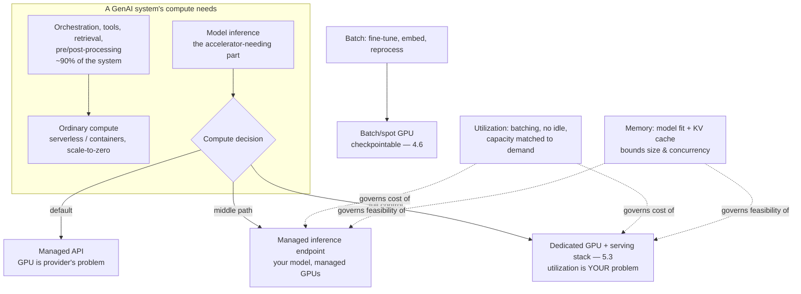

# Chapter 5.2 — Compute for AI: GPUs, Containers & Serverless

| | |
|---|---|
| **Part** | 5 — Cloud, Infrastructure & Platform Engineering |
| **Maturity level** | 3 — Engineer |
| **Difficulty** | Advanced |
| **Estimated study time** | 3 hours (reading 90 min, exercise 90 min) |
| **Prerequisites** | [2.3 Deep Learning Fundamentals](../part-2-artificial-intelligence/chapter-03-deep-learning-fundamentals.md); [5.1](chapter-01-cloud-fundamentals-ai.md) |

## Learning Objectives

After this chapter you will be able to:

1. Reason about GPU/accelerator economics — memory, compute, utilization — well enough to make and defend compute decisions.
2. Match compute models (managed API, serverless, containers, dedicated GPU) to workload shapes (inference, batch, fine-tuning, embedding).
3. Handle GPU supply reality: availability constraints, reservation vs. on-demand, and the capacity planning it forces.
4. Decide when compute is even your problem — the managed-API default vs. the self-hosting cases.

## Introduction

This chapter goes down a layer from 5.1's cloud primitives to the compute those primitives allocate — and confronts the fact that 2.3 established: AI runs on specialized, expensive, supply-constrained accelerators, which makes compute a distinct category with economics classical workloads never had. For most enterprises the punchline is liberating (2.1's utility shift): the managed model API means the GPU is the *provider's* problem, and this chapter's compute decisions collapse to "consume the API." But the cases where compute *is* your problem — self-hosted serving (5.3), fine-tuning (2.6), high-volume embedding (3.5), sovereignty (5.11) — are real, growing, and economically consequential, and the architect who can't reason about accelerator economics can't evaluate them.

The framing: **compute for AI is a memory-and-utilization problem before it's a raw-power problem.** The naive mental model (bigger GPU = faster) misses what actually governs cost and feasibility — whether the model *fits* in accelerator memory (2.5's KV cache made GPU memory, not compute, the serving bottleneck) and whether the expensive hardware stays *busy* (idle GPUs are the dominant waste in self-hosted AI). Get those two right and the economics work; miss them and the bill is inexplicable.

## Business Motivation

Compute is the largest infrastructure cost line in self-hosted AI and a major procurement constraint even for API consumers. The economics are unforgiving: accelerators are expensive and their cost is *time-based* (you pay for the GPU-hour whether it's busy or idle), so utilization is the dominant lever — a self-hosted deployment at 20% GPU utilization is paying 5× per useful inference, and the recurring finding is that under-utilized dedicated GPUs, not model choice, drive the surprising self-hosting bill. Supply is the second constraint: high-end accelerators are genuinely scarce (lead times, quota limits, regional unavailability — 1.7's calendar-time items in hardware form), which turns "we'll just self-host" into a capacity-planning and procurement project, not a config change. The business decision this chapter enables is the managed-vs-self-hosted one (deepened in 5.3): for most workloads the managed API's economics win decisively (the provider's utilization is amortized across all their customers — you can't match their efficiency at your scale), and self-hosting earns its place only where its specific advantages (residency, unit economics at very high sustained volume, capability control, latency floors) justify taking on the utilization-and-supply burden. Getting this decision right is often a seven-figure difference, and getting it wrong in the self-hosting direction is the classic "we built a GPU cluster running at 15% utilization" post-mortem.

## Theory

### Accelerator economics: memory and utilization

- **Memory is the binding constraint** — a model's weights must fit in accelerator memory to serve it, and (2.5) the KV cache for in-flight requests consumes *more* memory that scales with context length and concurrency; so GPU memory, not compute throughput, usually decides how big a model you can serve and how many concurrent requests fit. The consequences: large models need multiple GPUs (model parallelism — splitting the model across accelerators, with its own complexity), and concurrency is memory-bounded (each additional in-flight request costs KV-cache memory — 5.3's batching math).
- **Utilization is the cost lever** — the GPU-hour is paid regardless of use, so keeping accelerators busy is everything: batching (2.5's serving efficiency — processing multiple requests together to saturate the GPU), avoiding idle dedicated capacity (the utilization killer), and matching capacity to demand (the scaling of 5.8). A self-hosted serving stack's economics *are* its utilization economics.
- **Quantization** — reducing the numerical precision of weights (2.6's compact-model territory, at the serving layer) shrinks memory footprint and speeds inference at some quality cost — a key lever for fitting bigger models in less memory, evaluated on quality (2.7) like every other trade.
- **Accelerator types** — GPUs (the general workhorse), TPUs and other AI-specific accelerators (provider-specific, sometimes more efficient for specific workloads), and the CPU (fine for embedding models and small workloads, hopeless for large-model inference — 2.3's 100× gap); the choice is a workload-fit-and-availability decision.

### Compute models matched to workloads

| Compute model | What it is | Best for |
|---|---|---|
| **Managed model API** | Provider hosts and serves; you call it | Default for inference — no GPU ops, provider's utilization amortized |
| **Serverless (functions/containers)** | On-demand, scale-to-zero, no GPU (usually) | The *non-model* pipeline (orchestration, tools, pre/post-processing — 4.6); glue code around the model |
| **Managed inference endpoints** | Provider hosts *your* model artifact on managed GPUs | Self-hosted models without full GPU-ops burden (the middle path — 5.3) |
| **Container orchestration + dedicated GPU** | You run the serving stack on GPU nodes | Full-control self-hosting: residency, high volume, custom models (5.3) |
| **Batch GPU** | Scheduled, latency-tolerant GPU jobs | Fine-tuning (2.6), bulk embedding (3.5), reprocessing campaigns (4.3) — the batch lane (4.6) |

The mapping's logic: **most of a GenAI system isn't the model** — the orchestration, tools, retrieval, and pre/post-processing run on ordinary serverless/container compute (cheap, familiar, scale-to-zero), and only the model inference needs accelerators (or the managed API that hides them). Architects who conflate "AI workload" with "GPU everything" over-provision the 90% that doesn't need it.

### GPU supply and capacity planning

The reality self-hosting confronts: **accelerators are supply-constrained**, so capacity is planned and procured, not summoned. The levers: *on-demand* (flexible, expensive, availability-not-guaranteed at scale), *reserved/committed* (cheaper per hour, capacity guaranteed, but you pay for the commitment whether used or not — the utilization risk moves to you), and *spot/preemptible* (cheapest, interruptible — fine for batch/fine-tuning that can checkpoint and resume (4.6), wrong for interactive serving). Capacity planning for self-hosted serving is the classical exercise (peak demand, headroom, failover capacity — 5.8, 5.9) with the twist that the resource is scarce and lead-time-bound, so under-provisioning risks unavailability and over-provisioning burns money on idle accelerators — the utilization tightrope, walked with demand forecasting and autoscaling (5.8).

## Architecture Perspective

Readings. **Separate the model compute from the glue compute** — the architecture that runs everything on GPUs over-provisions the 90% of the system that's ordinary orchestration; put the glue on cheap scale-to-zero compute and reserve accelerators (or the API) for inference (the compute analog of 4.11's tiering: the right compute for each workload). **The managed API is the default because utilization is a scale game you lose** — the provider amortizes GPU utilization across all customers, achieving efficiency you can't match at your volume, which is why the managed economics win for most workloads and self-hosting needs a *specific* justification beyond "we want control" (5.3's decision). **Memory and utilization are the two questions that decide self-hosting feasibility and cost** — will the model fit (memory), and will the GPUs stay busy (utilization) — and a self-hosting business case that hasn't answered both quantitatively is the "15% utilization cluster" waiting to happen.

## Real-world Example

**Corvid Logistics** (1.4, 2.3, 4.4) faced the compute decision when a data-residency ruling required the customs-document extraction (2.3's inference-cost story) to run entirely within the EU on infrastructure the company controlled — pushing a workload that had been a managed API call into self-hosting territory. The analysis was this chapter's memory-and-utilization discipline applied. **Memory first:** the extraction model (a compact fine-tuned model — 2.6's tiering) fit comfortably in a single mid-range GPU's memory with room for reasonable concurrency — feasible without model parallelism, which kept the architecture simple. **Utilization second, and decisive:** the extraction workload was *bursty* (customs documents arrive in daily waves aligned with shipping schedules, not evenly), so a dedicated always-on GPU would sit idle most of the day — the "15% utilization" trap in the making. The design solved it by matching compute to the workload shape: the *interactive* extraction path (documents needing fast turnaround) ran on a managed inference endpoint (the middle path — the provider handled utilization by scaling the managed GPUs, and Corvid paid closer to per-use), while the *batch* extraction (the daily wave, latency-tolerant) ran on scheduled spot GPU jobs that spun up for the wave and down after (checkpointable — 4.6), achieving high utilization during the burst and zero cost between. The glue — the whole ingestion pipeline (4.3), the orchestration (4.6) — stayed on ordinary serverless, never touching a GPU. The residency requirement was met (all EU, controlled infrastructure), and the utilization discipline kept the cost within 30% of the managed-API baseline it had replaced (rather than the 3× a naive always-on dedicated cluster would have cost). Priit's compute-review note (echoing his 2.3 line): *"The residency ruling forced us off the managed API. The utilization discipline kept it from bankrupting us — bursty workload, bursty compute, and the GPU busy when it's on."*

## Hands-on Exercise

**Reason through the compute decision.** ~90 minutes. Mostly analysis; optional hands-on with any cloud's GPU offerings (mind the cost).

1. **Workload decomposition (25 min).** For a GenAI system you know, decompose its compute needs: what's model inference (needs accelerator or API), what's glue (ordinary compute), what's batch (fine-tune/embed/reprocess). Estimate the proportion — confirm the 90/10 shape or explain the exception.
2. **The memory question (20 min).** For a self-hosting scenario: pick a model size, look up its memory footprint (weights + estimated KV cache for your context/concurrency — provider docs), and determine what accelerator it needs and whether model parallelism is required. State the concurrency memory bounds.
3. **The utilization analysis (30 min).** For your workload, characterize the demand shape (steady? bursty? diurnal?). Design the compute match: dedicated (steady, high-util), managed endpoint (variable, provider-scaled), or batch/spot (latency-tolerant bursts). Estimate the utilization each achieves and the relative cost.
4. **The managed-vs-self-hosted memo (15 min).** From the above plus a residency/volume/control assessment, write the 1.4 decision: managed API, managed endpoint, or full self-hosting — with the utilization and memory findings as evidence.

**Acceptance criteria:**
- [ ] Workload decomposed into model/glue/batch with proportions; the 90/10 shape confirmed or the exception explained
- [ ] Memory analysis determines accelerator fit and concurrency bounds; parallelism need stated
- [ ] Utilization analysis matches compute model to demand shape with cost implications
- [ ] Decision memo justifies the compute model with memory and utilization evidence, not preference

## Enterprise Considerations

Enterprise compute for AI is procurement, quota, and platform economics at scale. **GPU procurement is a supply-chain project** (1.7's calendar-time, hardware edition): committed-capacity agreements, reservation lead times, and regional availability are negotiated ahead of need, and the FinOps/procurement teams model the reserved-vs-on-demand-vs-spot mix against the workload's utilization profile — over-committing wastes as surely as under-provisioning starves. **The platform amortizes utilization across the enterprise:** a shared GPU platform (or shared managed endpoints — 7.9) achieves the utilization efficiency that per-team clusters can't (the enterprise-internal version of the provider's amortization advantage), which is a strong argument for centralizing self-hosted serving rather than letting each team run its own under-utilized GPUs. **Sustainability reporting** (2.3's ESG line): GPU-hours map to energy and carbon, and the utilization discipline that saves money also saves emissions — the same telemetry serves both. **And the build-vs-buy calculus is dynamic:** managed-API pricing falls over time (historically) while GPU efficiency improves, so the self-hosting break-even volume moves — the decision (5.3) carries a revisit trigger (1.4), and a self-hosting commitment made at one price point is re-evaluated as the economics shift.

## Trade-offs

| Decision | Option A | Option B | Choose A when… | Choose B when… |
|----------|----------|----------|----------------|----------------|
| Compute for inference | Managed API | Self-hosted GPU | Default — provider's utilization unbeatable at your scale | Residency, very high sustained volume, capability control, latency floors (5.3) |
| Self-hosting path | Managed inference endpoint | Dedicated GPU + serving stack | Want self-hosted model without full GPU-ops burden | Need full control (custom serving, extreme scale) and have the ops capability |
| Capacity purchasing | Reserved/committed | On-demand / spot | Steady, predictable, high-utilization workloads | Bursty or batch — spot for checkpointable, on-demand for variable interactive |
| Glue compute | Ordinary serverless/containers | GPU nodes | Always — the 90% doesn't need accelerators | Never for glue; reserve GPUs for inference only |

## Common Mistakes

1. **GPU-everything** — running the orchestration, tools, and glue (the 90%) on accelerators; the workload decomposition puts glue on cheap scale-to-zero compute, GPUs on inference only.
2. **The 15%-utilization cluster** — a dedicated always-on GPU serving a bursty workload, idle most of the time and paying for it; match compute shape to demand shape (Corvid's bursty-workload-bursty-compute).
3. **Self-hosting for control without the economics** — taking on the utilization-and-supply burden because "we want control," when the managed API's amortized efficiency wins decisively; self-hosting needs a *specific* justification (5.3).
4. **Ignoring the memory bound** — sizing by compute throughput while the model doesn't fit or concurrency is memory-starved; memory is the binding constraint, checked first.
5. **Reserved capacity for bursty workloads** — committing to always-on capacity for demand that isn't always on; reserved for steady, spot/on-demand for variable.
6. **Under-planning GPU supply** — "we'll just self-host" as a config change, hitting lead times and quota limits; capacity is procured with lead time, not summoned.
7. **Static compute decisions** — a self-hosting commitment never revisited as managed pricing falls and efficiency improves; the break-even moves, so the decision carries a revisit trigger.

## Best Practices

1. **Decompose the workload; GPU only the inference** — the glue runs on ordinary scale-to-zero compute, accelerators reserved for the model, matched by 4.11's tiering logic.
2. **Answer memory and utilization before any self-hosting decision** — will it fit (memory bound, parallelism), will it stay busy (demand shape vs. compute shape); a self-hosting case without both quantified is the 15% cluster.
3. **Default to managed** — the provider's amortized utilization is unbeatable at your scale; self-host only on a specific residency/volume/control/latency justification (5.3).
4. **Match capacity purchasing to demand shape** — reserved for steady high-util, spot for checkpointable batch, on-demand for variable interactive.
5. **Centralize self-hosted serving** — a shared GPU platform amortizes utilization across the enterprise the way the provider does across customers (7.9).
6. **Plan GPU supply with lead time** — capacity is a procurement project (1.7's calendar-time), not a config change.
7. **Revisit the compute decision on a trigger** — managed pricing and GPU efficiency move the self-hosting break-even; the commitment is re-evaluated (1.4).

## Architecture Checklist

For any GenAI system's compute design:

- [ ] Workload decomposed: model inference (accelerator/API) vs. glue (ordinary compute) vs. batch; glue not on GPUs
- [ ] Compute model chosen per component: managed API default, managed endpoint / dedicated GPU only on specific justification
- [ ] For self-hosting: memory bound verified (model fit + KV cache concurrency), parallelism need determined
- [ ] Utilization designed: batching, demand-matched capacity, no idle dedicated accelerators
- [ ] Capacity purchasing matches demand shape (reserved/on-demand/spot); batch workloads checkpointable for spot
- [ ] GPU supply planned with lead time; quota and regional availability confirmed
- [ ] Self-hosted serving centralized where multiple teams need it (utilization amortization)
- [ ] Compute decision carries a revisit trigger as managed pricing and efficiency shift

## Interview Questions

1. *"When should a company self-host models versus use a managed API?"* — Strong answers default to managed (the provider's amortized utilization is unbeatable at your scale), require a specific justification for self-hosting (residency, sustained high volume, capability control, latency floors), and stress the memory-and-utilization analysis that decides whether the self-hosting economics actually work.
2. *"Why do self-hosted GPU deployments often cost more than expected?"* — Strong answers name utilization: the GPU-hour is paid whether busy or idle, bursty workloads on dedicated always-on GPUs sit idle (the 15% cluster), and the fix is matching compute shape to demand shape (batch/spot for bursts, managed endpoints for variable) — plus over-provisioning the glue that doesn't need GPUs.
3. *"What's the binding constraint when serving large models, and why?"* — Strong answers say memory, not compute: weights plus the KV cache (2.5) that scales with context and concurrency, which decides model size feasibility (parallelism) and concurrent-request capacity — the naive bigger-GPU-faster model misses it.
4. *"How do you plan GPU capacity for a self-hosted serving workload?"* — Strong answers treat it as constrained procurement (lead times, quotas, regional availability), match purchasing to demand (reserved for steady, spot for checkpointable batch, on-demand for variable), walk the utilization tightrope (under-provision risks unavailability, over-provision burns money), and note supply as a calendar-time constraint.

## Further Reading

- Your cloud provider's GPU/accelerator instance documentation and pricing (official) — the memory specs, availability, and reserved/spot economics that drive the decisions; the ML-optimized instance families specifically.
- NVIDIA's inference optimization and memory documentation (official) — the KV-cache and batching mechanics from the hardware side, deepening 2.5.
- Your provider's managed inference endpoint documentation (official docs) — the middle-path option's capabilities and economics.
- 5.3 Model Serving (next chapter) — the serving-stack detail that this chapter's compute decisions feed into; and 2.3 (re-read the two-plane economics).

## Summary

- Compute for AI is a **memory-and-utilization problem before a raw-power one**: memory (weights + KV cache — 2.5) bounds model size and concurrency; utilization (the GPU-hour is paid busy or idle) is the dominant cost lever, and idle dedicated accelerators are the top self-hosting waste.
- **Most of a GenAI system isn't the model** — the glue (orchestration, tools, retrieval) runs on ordinary scale-to-zero compute; reserve accelerators (or the managed API) for inference only.
- **Managed API is the default** because the provider amortizes utilization across all customers — an efficiency you can't match at your scale; self-hosting needs a *specific* justification (residency, sustained volume, control, latency) beyond "we want control."
- **Match compute shape to demand shape**: reserved for steady high-util, spot for checkpointable batch, managed endpoints for variable — and answer memory-and-utilization quantitatively before any self-hosting commitment, or build the 15%-utilization cluster.
- **Compute is supply-constrained and dynamic**: GPU capacity is procured with lead time, and the self-hosting break-even moves as managed pricing and efficiency shift — the decision carries a revisit trigger. The serving stack that runs on this compute is next: **model serving & inference infrastructure** (5.3).

---

**Previous:** [Chapter 5.1 — Cloud Architecture Fundamentals for AI Workloads](chapter-01-cloud-fundamentals-ai.md) · **Next:** [Chapter 5.3 — Model Serving & Inference Infrastructure](chapter-03-model-serving.md) · **Related:** [2.3 Deep Learning Fundamentals](../part-2-artificial-intelligence/chapter-03-deep-learning-fundamentals.md), [4.11 Cost Engineering](../part-4-enterprise-genai-systems/chapter-11-cost-engineering.md), [5.11 Multi-cloud, Hybrid & Sovereignty](chapter-11-multicloud-hybrid-sovereignty.md)
