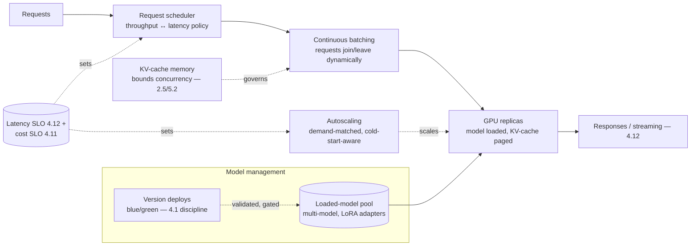

# Chapter 5.3 — Model Serving & Inference Infrastructure

| | |
|---|---|
| **Part** | 5 — Cloud, Infrastructure & Platform Engineering |
| **Maturity level** | 3 — Engineer |
| **Difficulty** | Advanced |
| **Estimated study time** | 3–4 hours (reading 2 h, exercise 90 min) |
| **Prerequisites** | [2.5 The Transformer](../part-2-artificial-intelligence/chapter-05-transformer-architecture.md); [5.2](chapter-02-compute-for-ai.md) |

## Learning Objectives

After this chapter you will be able to:

1. Design a self-hosted serving stack: the inference server, batching, autoscaling, and the memory management that governs it all.
2. Reason about serving performance — throughput vs. latency, batching strategies, KV-cache management — from 2.5's mechanics.
3. Make the managed-vs-self-hosted decision with the serving-specific detail (beyond 5.2's compute economics): operational burden, capability, and the middle paths.
4. Operate serving infrastructure: multi-model serving, model loading/versioning, and the reliability the serving layer must provide.

## Introduction

This chapter is for the cases where 5.2's decision landed on self-hosting — where you run the inference server, not the provider. It's the deepest infrastructure chapter in Part 5, and deliberately scoped: most enterprises consume managed APIs and can treat this chapter as *understanding what the provider does for them* (valuable for reasoning about the managed service's behavior and limits) rather than *building it themselves*. But the self-hosting cases (5.2's residency, volume, control, latency justifications) are real, and serving is where 2.5's transformer mechanics become operational engineering: the prefill/decode phases, the KV cache, and batching stop being concepts and become the knobs that decide whether your serving stack hits its throughput and latency targets.

The framing: **serving is the art of keeping expensive accelerators busy while meeting latency SLOs** — the throughput-vs-latency tension (batching more requests raises throughput and utilization but can raise per-request latency) that governs every serving decision, resolved by the mechanics 2.5 established.

## Business Motivation

For self-hosted deployments, serving efficiency directly determines the unit economics that justified self-hosting in the first place (5.2). A serving stack that batches poorly, manages memory naively, or scales sluggishly squanders the utilization advantage that was the whole point — the difference between a self-hosting decision that pays off and one that becomes the "why is this more expensive than the API?" post-mortem. Serving is also where the latency SLOs (4.12) are met or missed at the infrastructure level: the batching strategy, the autoscaling responsiveness, and the cold-start behavior all feed directly into TTFT and total latency, so serving engineering *is* latency engineering for self-hosted models. And serving reliability is the foundation the whole system's reliability (5.9) rests on for self-hosted models — the serving layer's availability, failover, and graceful degradation are what the application above it inherits. The strategic business framing: serving expertise is what makes self-hosting *viable* — an enterprise that can serve models efficiently has a real option (residency, control, volume economics) that one without the expertise doesn't, so serving capability widens the architectural choice space even for organizations that mostly consume managed APIs.

## Theory

### The serving stack

- **The inference server** — the software that loads the model and serves requests, implementing the optimizations that matter: continuous batching, KV-cache management, and the request scheduling that balances throughput and latency (mature open-source inference servers implement these; the architect's job is understanding and configuring them, rarely building from scratch — 2.1's timeless-over-tools, so we cover the concepts the servers implement).
- **Continuous (in-flight) batching** — the key serving optimization: rather than waiting to assemble a fixed batch, the server dynamically adds and removes requests from the running batch as they arrive and complete (exploiting 2.5's decode being token-by-token — a new request can join between decode steps), keeping the GPU saturated without forcing requests to wait for batch assembly. This is what makes serving throughput-efficient without sacrificing latency, and it's the single most important serving concept.
- **KV-cache management** — 2.5's KV cache is the memory that makes decode fast, and (5.2) the memory bottleneck for concurrency; serving stacks manage it carefully (paged attention and similar techniques allocate KV-cache memory efficiently, fitting more concurrent requests), because KV-cache efficiency directly determines how many requests fit and thus throughput per GPU.
- **Autoscaling** — matching serving capacity to demand (5.8's subject, serving-specific here): scaling GPU replicas up under load and down when idle, with the cold-start problem (loading a large model into GPU memory takes time — the scale-up isn't instant, so autoscaling must anticipate or tolerate the lag) as the serving-specific wrinkle.

### The throughput-latency tension

The central serving trade: larger batches raise throughput (more requests per GPU-second, better utilization, lower cost per inference) but can raise per-request latency (a request waits for the batch's decode steps); smaller batches lower latency but waste utilization. Continuous batching softens the tension (requests join and leave dynamically) but doesn't eliminate it — the serving configuration (max batch size, scheduling policy) picks a point on the throughput-latency curve, and that point is a *business decision* mapped to the workload's SLOs (4.12's latency targets and 4.11's cost targets, resolved at the serving layer): the interactive workload configures for latency (smaller effective batches, latency-priority scheduling), the batch workload (4.6's lane) configures for throughput (large batches, utilization-priority).

### Multi-model serving and model management

- **Multi-model serving** — hosting several models on shared serving infrastructure (multiple fine-tunes — 2.6's LoRA adapters are especially efficient here, sharing the base model's memory and swapping small adapters; or different models for different task classes — 3.10's portfolio, self-hosted). Improves utilization (the amortization of 5.2, within your own infrastructure) and is how a self-hosted portfolio (3.10) is served economically.
- **Model loading and versioning** — models are large artifacts (2.3's weights-as-artifact); loading them into GPU memory is slow, so serving stacks manage a loaded-model pool, and model version changes (3.10's migrations, 2.6's re-training) are deployments with the blue/green discipline (4.1's index blue/green, model edition — load the new version alongside, validate, cut over, rollback available).
- **Quantization at serving** (5.2) — serving quantized models to fit more in memory and speed inference, with the quality trade evaluated (2.7) — a serving-layer lever for the memory-and-throughput economics.

### The managed-vs-self-hosted decision, serving detail

Beyond 5.2's compute economics, serving adds the *operational* dimension to the decision: self-hosting means owning the serving stack's operation — the inference server configuration, the autoscaling tuning, the KV-cache and batching optimization, the model-loading and versioning machinery, the reliability engineering (5.9) — a substantial and specialized operational burden. The middle paths matter here: *managed inference endpoints* (5.2) give you self-hosted models (residency, custom models) without the full serving-ops burden (the provider operates the serving stack), which is often the pragmatic answer to a residency requirement that doesn't also demand deep serving control. The full-self-hosting case (own the serving stack) earns its place when the control (custom serving optimizations, extreme scale economics, specific latency engineering) justifies the operational investment — a narrower set than 5.2's compute-economics case alone suggests, because serving *operations* is the burden the compute economics don't fully capture.

## Architecture Perspective

Readings. **Continuous batching plus KV-cache management is what makes serving economical** — they're the mechanisms (from 2.5) that keep the expensive GPU busy across concurrent requests without forcing latency-killing batch waits; a serving stack that doesn't do them well squanders the self-hosting economics. **The scheduler's throughput-latency policy maps the SLOs to the serving layer** — the interactive-vs-batch configuration (4.6's lanes, served differently), decided by the workload's 4.11/4.12 targets, which is why serving isn't one-size-fits-all even within a self-hosted estate. **Model management is deployment engineering** — the loaded-model pool, multi-model/adapter serving (the self-hosted 3.10 portfolio), and blue/green version deploys (4.1's discipline, model edition) — the serving layer inherits Part 4's release and versioning disciplines, applied to the model artifact.

## Real-world Example

**Corvid Logistics** (5.2's residency-driven self-hosting) built out the serving layer for the EU-resident extraction workload, and the serving engineering is where 5.2's utilization strategy became operational. The interactive extraction path (5.2's managed-endpoint choice) largely delegated serving to the provider — but as volume grew and a second residency requirement (a new jurisdiction) plus a latency-floor need (real-time broker-facing extraction) pushed part of the workload to full self-hosting, the serving stack became Corvid's to operate. The engineering followed the chapter: an open-source inference server with continuous batching (the throughput win that kept the GPUs busy across the bursty document waves — 5.2's utilization, mechanized), paged KV-cache management (fitting more concurrent extractions per GPU during the daily peaks), and a throughput-latency policy split by path (the real-time broker path configured latency-priority with smaller effective batches; the bulk daily-wave path configured throughput-priority with large batches — 4.6's lanes, served differently on the same infrastructure). Multi-model serving earned its keep: the several fine-tuned extraction adapters (per document type — 2.6's LoRA) shared one base model's memory, swapping adapters per request, which made the self-hosted 3.10 portfolio economical (a single GPU pool serving the whole adapter set rather than a GPU per model). The version-deploy discipline caught a regression: a re-trained adapter (2.6's re-base) deployed blue/green, validated against the extraction golden set (4.7) on the green replicas before cutover, and the validation caught a quality drop that would otherwise have hit production — the model-deployment blue/green (4.1's discipline, model edition) working as designed. Priit's serving-review note: *"The managed endpoint was fine until residency and latency forced full self-hosting. Then serving became real engineering — continuous batching to stay busy, paged cache to fit concurrency, and blue/green because a model deploy is a deploy. The provider had been doing all of this invisibly; now we saw the bill for their expertise."*

## Hands-on Exercise

**Understand serving by configuring it.** ~90 minutes. Optional hands-on with an open-source inference server (or a managed endpoint's configuration); analysis-primary given GPU costs.

1. **The throughput-latency curve (30 min).** For a serving scenario, reason through the trade: describe how max batch size affects throughput (utilization, cost/inference) and per-request latency (TTFT, total). Pick a point for an interactive workload and a point for a batch workload; justify each from the SLOs (4.11/4.12).
2. **KV-cache and concurrency (20 min).** For a model size and context length, estimate how KV-cache memory bounds concurrent requests per GPU (2.5/5.2). State how paged attention or similar would improve it, and what happens when concurrency exceeds memory (queuing, or the request rejection that autoscaling must prevent).
3. **Multi-model design (25 min).** Design serving for a self-hosted 3.10 portfolio (3 task-class models, one with 4 fine-tuned adapters). Decide: separate GPU pools or shared multi-model serving? LoRA adapter sharing? Estimate the utilization difference.
4. **The version-deploy plan (15 min).** Write the blue/green plan for deploying a re-trained model version to the serving layer: load-alongside, validation gate (4.7), cutover, rollback — the model edition of 4.1's discipline.

**Acceptance criteria:**
- [ ] Throughput-latency points chosen for interactive and batch workloads, justified from SLOs
- [ ] KV-cache concurrency bound estimated, with the memory-exceeded behavior stated
- [ ] Multi-model design decides pooling and adapter sharing with utilization reasoning
- [ ] Version-deploy plan applies blue/green with a validation gate and rollback

## Enterprise Considerations

Enterprise serving is a platform capability, not a per-team build. **Centralized serving as a platform** (7.9, 5.2's amortization): a shared self-hosted serving platform (the inference servers, the GPU pools, the model management) operated once and consumed by many teams achieves the utilization and operational efficiency that per-team serving can't — the strongest argument for making serving a platform service rather than each team running its own inference server (the [P16 multi-tenant platform](../../projects/README.md) territory). **Serving operations is a specialized skill** (8.7): the expertise to configure continuous batching, tune autoscaling, manage KV-cache memory, and operate the serving stack reliably is scarce and specialized — an enterprise self-hosting at scale invests in the capability or buys the middle path (managed endpoints), and the honest build-vs-buy weighs the operational-skill cost the compute economics (5.2) don't capture. **The serving layer's reliability is foundational** (5.9): for self-hosted models, the serving stack's availability, failover across replicas and zones (5.1), and graceful degradation are what the whole system's reliability inherits — serving SLOs feed the system SLOs. **And model artifact governance** (2.6, 4.14) reaches the serving layer: the loaded models are artifacts with lineage and access control, the serving infrastructure is in the residency-and-security scope, and the model-loading pipeline is part of the supply chain (4.9) that must be secured.

## Trade-offs

| Decision | Option A | Option B | Choose A when… | Choose B when… |
|----------|----------|----------|----------------|----------------|
| Serving approach | Managed endpoint (provider operates serving) | Full self-hosted serving stack | Residency/custom-model need without deep serving control | Serving control, extreme scale, or specific optimizations justify the ops burden |
| Batching policy | Throughput-priority (large batches) | Latency-priority (smaller effective batches) | Batch workloads (4.6's batch lane) | Interactive workloads with tight TTFT SLOs |
| Multi-model | Shared serving + adapter swapping | Dedicated pool per model | Portfolio with shared base models (LoRA — utilization win) | Models with different bases or isolation requirements |
| Serving ownership | Platform service (centralized) | Per-team serving | Multiple teams self-hosting — amortization and skill concentration | Single specialized team with unique needs |

## Common Mistakes

1. **Self-hosting the serving without the serving expertise** — owning the inference server without the skill to configure batching, cache, and autoscaling well; the middle-path managed endpoint exists for exactly this, and the ops-skill cost is the burden 5.2's compute economics understate.
2. **Naive batching** — fixed batches with assembly waits instead of continuous batching, squandering utilization or latency; continuous batching is the key serving optimization.
3. **Ignoring the KV-cache concurrency bound** — configuring for compute throughput while memory starves concurrency (2.5/5.2); the cache is the concurrency governor.
4. **One batching policy for all workloads** — throughput-priority serving on an interactive path (latency suffers) or latency-priority on batch (utilization wasted); the policy maps to the workload's SLOs.
5. **Model deploys without blue/green** — swapping model versions in-place with no validation gate or rollback; a model deploy is a deploy (4.1's discipline).
6. **Per-team serving sprawl** — every team running its own under-utilized inference server; centralize serving as a platform for the amortization and skill concentration.
7. **Cold-start-blind autoscaling** — scaling policies that don't account for large-model load time, so scale-up lags demand and requests fail; anticipate or tolerate the cold-start lag.

## Best Practices

1. **Use continuous batching and paged KV-cache management** — the mechanisms (2.5) that keep GPUs busy across concurrent requests without latency-killing waits; configure the mature inference servers that implement them rather than building from scratch.
2. **Map the throughput-latency policy to the workload's SLOs** — latency-priority for interactive, throughput-priority for batch (4.6's lanes), on the same infrastructure differently configured.
3. **Serve the portfolio with multi-model / adapter sharing** — the self-hosted 3.10 portfolio economically, LoRA adapters sharing base-model memory (2.6).
4. **Deploy model versions blue/green with validation gates** — load-alongside, eval-gate (4.7), cutover, rollback — the model edition of 4.1's discipline.
5. **Prefer the managed endpoint middle path** — where residency/custom-model needs don't also demand deep serving control, it avoids the serving-ops burden.
6. **Centralize serving as a platform** — amortize utilization and concentrate the specialized skill (7.9), rather than per-team inference servers.
7. **Design autoscaling for cold starts** — anticipate large-model load time so scale-up doesn't lag demand into failures.

## Architecture Checklist

For any self-hosted model serving:

- [ ] Inference server implements continuous batching and efficient KV-cache management (paged or equivalent)
- [ ] Throughput-latency scheduling policy set per workload, mapped to 4.11/4.12 SLOs
- [ ] KV-cache concurrency bounds understood; memory-exceeded behavior (queuing/rejection) handled with autoscaling
- [ ] Multi-model serving with adapter sharing where the portfolio permits (utilization)
- [ ] Model version deploys use blue/green with eval-gate validation and rollback
- [ ] Autoscaling demand-matched and cold-start-aware
- [ ] Serving centralized as a platform service where multiple teams self-host
- [ ] Serving reliability (availability, replica/zone failover, graceful degradation) designed as the system's foundation (5.9)
- [ ] Model artifacts governed (lineage, access, residency, supply-chain security) at the serving layer

## Interview Questions

1. *"Explain continuous batching and why it matters."* — Strong answers describe requests dynamically joining and leaving the running batch (exploiting 2.5's token-by-token decode), keeping the GPU saturated without forcing batch-assembly waits — the optimization that makes serving throughput-efficient without sacrificing latency, and the difference between viable and wasteful self-hosting economics.
2. *"How do you configure serving differently for interactive vs. batch workloads?"* — Strong answers map the throughput-latency trade to SLOs: latency-priority (smaller effective batches, latency scheduling) for interactive TTFT (4.12), throughput-priority (large batches, utilization scheduling) for batch (4.6/4.11) — same infrastructure, different policy.
3. *"When is a managed inference endpoint better than running your own serving stack?"* — Strong answers name the operational-burden dimension serving adds beyond 5.2's compute economics: the middle path gives self-hosted models (residency, custom) without owning batching/cache/autoscaling/reliability ops, which is the right answer for residency needs that don't also demand deep serving control.
4. *"How do you deploy a new model version to production serving?"* — Strong answers apply blue/green (4.1's discipline, model edition): load the new version alongside, validate against the golden set (4.7) on the green replicas, cut over with rollback available — a model deploy is a deploy, not an in-place swap.

## Further Reading

- vLLM and other open-source inference server documentation (official project docs) — the continuous batching and paged-attention mechanics this chapter describes, from the implementations; read for the concepts the servers embody.
- The PagedAttention paper (Kwon et al., arxiv.org/abs/2309.06180) — the KV-cache memory management technique, at concept level; the mechanics behind serving concurrency.
- Your cloud/provider's managed inference endpoint documentation (official docs) — the middle-path option's serving capabilities and operations.
- 2.5 The Transformer (re-read prefill/decode, KV cache) — the mechanical foundation this chapter operationalizes; 5.2 (compute economics) and 5.8 (scaling) are the neighbors.

## Summary

- Serving is **the art of keeping expensive accelerators busy while meeting latency SLOs** — the throughput-vs-latency tension resolved by 2.5's mechanics, and only relevant where 5.2's decision landed on self-hosting (most enterprises consume managed APIs and read this as understanding what the provider does).
- **Continuous batching and KV-cache management are the economical-serving mechanisms** — requests joining/leaving the running batch keep the GPU saturated without latency-killing waits; paged cache fits more concurrency; a stack that does them poorly squanders self-hosting economics.
- The **scheduler's throughput-latency policy maps SLOs to the serving layer** — latency-priority for interactive, throughput-priority for batch, configured per workload on shared infrastructure.
- **Model management is deployment engineering**: multi-model/adapter serving for the self-hosted portfolio (utilization), and blue/green version deploys with eval gates (4.1's discipline, model edition).
- The **managed-endpoint middle path** avoids the serving-ops burden for residency/custom needs that don't demand deep serving control, and **centralized serving as a platform** amortizes utilization and concentrates the specialized skill. Above the serving layer sits the API and integration layer that exposes it: **the API & integration layer** (5.4).

---

**Previous:** [Chapter 5.2 — Compute for AI](chapter-02-compute-for-ai.md) · **Next:** [Chapter 5.4 — API & Integration Layer](chapter-04-api-integration-layer.md) · **Related:** [2.5 The Transformer](../part-2-artificial-intelligence/chapter-05-transformer-architecture.md), [4.12 Latency & Performance](../part-4-enterprise-genai-systems/chapter-12-latency-performance.md), [5.8 Scalability Patterns](chapter-08-scalability-patterns.md)
