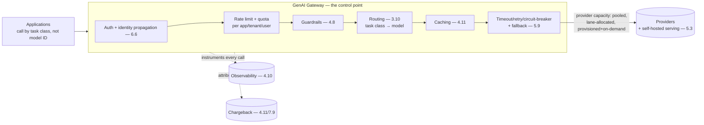

# Chapter 5.4 — API & Integration Layer

| | |
|---|---|
| **Part** | 5 — Cloud, Infrastructure & Platform Engineering |
| **Maturity level** | 3 — Engineer |
| **Difficulty** | Advanced |
| **Estimated study time** | 3 hours (reading 90 min, exercise 90 min) |
| **Prerequisites** | [3.10](../part-3-core-building-blocks-of-genai/chapter-10-model-selection-benchmarking.md); [4.10](chapter-10-observability.md); [4.11](chapter-11-cost-engineering.md) |

## Learning Objectives

After this chapter you will be able to:

1. Design the GenAI gateway — the layer between applications and models — that centralizes the cross-cutting concerns Part 4 kept routing to "the gateway."
2. Handle the API-layer essentials: authentication, rate limiting, quotas, and streaming over HTTP.
3. Manage provider capacity: rate limits, provisioned throughput, and the multi-provider abstraction that makes model selection reversible.
4. Place the gateway as the platform's keystone — where routing, caching, budgets, observability, and guardrails converge.

## Introduction

Throughout Part 4, one component kept absorbing responsibilities: the gateway. Cost control lives there (4.11), observability instruments there (4.10), model routing happens there (3.10), guardrails screen there (4.8), budgets enforce there (4.4). This chapter builds that component explicitly — the **GenAI gateway**, the API and integration layer sitting between applications and models, which is the single most important piece of platform infrastructure in an enterprise GenAI estate because it's where every cross-cutting concern converges and where the platform/product split (Part 4's recurring theme) is physically realized.

The framing: **the gateway is the enterprise's control point for GenAI** — the one place every model call routes through, which makes it simultaneously the point of leverage (change routing, caching, budgets, or observability once and every consumer inherits it) and the point of risk (its availability and correctness are the estate's). Building it well is the highest-leverage platform investment; skipping it means every application re-implements the cross-cutting concerns badly and inconsistently.

## Business Motivation

The gateway's business case is the compounding of every Part 4 platform argument. Without it, each application talks directly to model providers, which means: model selection is hard-coded per app (3.10's reversibility lost — a model change is N app migrations), cost control is per-app or absent (4.11's governance impossible), observability is inconsistent (4.10's partial views), guardrails are re-implemented or skipped (4.8's gaps), and provider capacity is un-pooled (each app hits its own rate limits while others have headroom). With it, all of these become platform capabilities inherited by every consumer — the gateway is what turns "forty teams each solving the same problems badly" into "the platform solves them once." The specific high-value functions: **provider capacity pooling** (aggregate rate limits and provisioned throughput managed centrally, allocated by lane and priority — 4.6, so one team's spike doesn't starve another), **model reversibility** (3.10's task-class routing behind a stable API, so model changes are config not migration), and **the single control point** for the cost, observability, guardrail, and budget concerns that are otherwise scattered. The gateway is, in short, what makes the GenAI estate governable, economical, and evolvable — the keystone whose absence is felt as chaos across every other dimension.

## Theory

### What the gateway does

The gateway centralizes the cross-cutting concerns, exposing a stable internal API to applications while managing the messy provider reality behind it:

- **Model routing and abstraction** (3.10) — applications call by *task class* (or a stable model alias), not a provider-specific model ID; the gateway routes to the current model per the portfolio policy, making model selection a config change and preserving reversibility.
- **Authentication and authorization** — the gateway authenticates callers (applications, and propagates user identity — 6.6) and authorizes access to models, tools, and data scopes; the identity-propagation point that 3.7's user-scoped credentials and 4.9's least-privilege depend on.
- **Rate limiting and quotas** — per-application, per-tenant, per-user limits (4.11's budgets, 4.4's fleet quotas), enforced here; and the provider-capacity pooling (below) that shares aggregate limits fairly.
- **Caching** (4.11) — prompt caching coordination and semantic caching, applied centrally so every consumer benefits.
- **Observability instrumentation** (4.10) — the gateway is where trace context, versioning, and token capture attach automatically, making complete instrumentation a platform property.
- **Guardrail integration** (4.8) — input/output screening applied at the gateway (or coordinated by it), so policy enforcement is consistent across consumers.
- **Cost tracking and attribution** (4.11) — per-call cost captured and attributed to the consuming application/tenant/user, feeding chargeback (7.9).

### API-layer essentials

The concrete engineering of exposing model capability as an API:

- **Streaming over HTTP** — model outputs stream token-by-token (2.5, 4.12), which the gateway must support end-to-end (server-sent events or streaming responses), preserving the perceived-latency win (4.12) while still applying output-side concerns (the streaming-vs-validation trade — 4.8 — coordinated at the gateway).
- **Rate limiting mechanics** — token-bucket or similar, per the quota dimensions (app/tenant/user), with graceful behavior on limit (429s with retry-after, backpressure — 4.6) rather than hard failures.
- **Timeouts, retries, and circuit breakers** — the resilience patterns (5.9) applied at the gateway: per-call timeouts, retry policies matched to failure modes (4.6's matched retries), and circuit breakers that fail over (to a fallback model — 3.10, 5.9) when a provider degrades.
- **Request/response transformation** — normalizing the differences between providers (each has its own API shape) behind the stable internal API, which is part of what makes multi-provider abstraction and model reversibility work.

### Provider capacity management

The gateway manages the scarce, rate-limited resource that is provider capacity:

- **Rate limits** — providers impose per-account request and token rate limits (TPM/RPM); the gateway pools the account's aggregate capacity and allocates it across consumers by lane and priority (4.6's admission control, provider-capacity edition), so the interactive lane is protected from the batch lane's bulk consumption (4.6/4.12's tail protection).
- **Provisioned throughput** — committed capacity agreements (5.2's commitment economics) give guaranteed, predictable capacity and latency (4.12's tail); the gateway routes across on-demand and provisioned capacity, using provisioned for the latency-critical lanes and on-demand for the burst overflow.
- **Multi-provider abstraction** — the gateway's routing across providers (3.10's portfolio, cross-provider fallback — 5.9) is what makes provider diversity a resilience and leverage asset (3.10's leverage, 5.9's failover) rather than a per-app integration burden — and it's the concrete mechanism of the model reversibility that 3.10 relies on.

## Architecture Perspective

Readings. **The gateway is where the platform/product split is physical** — every cross-cutting concern (auth, limits, guards, routing, caching, resilience, observability, cost) is a platform capability implemented once at the gateway and inherited by every application, which is what makes the platform real rather than aspirational (the recurring Part 4 theme, given an address). **Applications calling by task class, not model ID, is the keystone design decision** — it's the indirection that makes model selection reversible (3.10), routing changeable, and the 200-services-hard-coding-200-decisions anti-pattern (3.10) impossible; the gateway's stable internal API is the contract that decouples applications from provider reality. **And the gateway is a critical dependency** whose own reliability (5.9) is the estate's — it's on every request path, so its availability, latency overhead (kept minimal — 4.12's budget), and failure behavior (fail-open vs. fail-closed decisions per concern) are load-bearing, which is why the gateway itself gets the full reliability engineering (5.9) and isn't a place to cut corners.

## Real-world Example

**Vantora Systems** (1.8, 2.5, 3.10, 4.4, 4.10, 4.11) — the gateway *is* Vantora's platform story, and by this point in the curriculum it has appeared as the vehicle for nearly every Part 4 capability; this chapter is where it's assembled explicitly. The pre-gateway chaos (1.8's eleven teams, six models, chosen by conference demo) was the gateway's absence: no routing abstraction (models hard-coded per app), no cost control (one un-attributable bill), no consistent observability or guardrails, and un-pooled provider capacity (teams hitting their own rate limits while others had headroom). The gateway build assembled the concerns this chapter enumerates: task-class routing (the 3.10 portfolio, applications calling `support-assistant` not a model ID — the reversibility that later let the deprecation migration be a config change, 3.10); pooled provider capacity allocated by lane (the interactive support lane protected from the batch ingestion lane's bulk consumption — 4.6/4.12); centralized caching (the 34% input-cost cut of 4.11, applied once for all consumers); automatic observability instrumentation (the trace spine of 4.10, complete because the gateway attached it); guardrail integration (the policy enforcement of 4.8, consistent across the estate); and per-call cost attribution (the showback that aligned incentives — 4.11). The provider-capacity management proved its worth in an incident: a provider's regional degradation (5.9's territory) triggered the gateway's circuit breaker, failing the affected task classes over to the cross-provider fallback (3.10's portfolio, 5.9's failover) — the applications never knew, because they called by task class and the gateway handled the provider reality. Adaeze's platform-architecture summary, which by now reads as the thesis of Vantora's whole arc: *"Every capability we built — routing, cost control, observability, guardrails, failover — lives at the gateway. It's not a component; it's the control point. Build it first, or rebuild everything else around its absence."*

## Hands-on Exercise

**Design and prototype the gateway.** ~90 minutes. A minimal gateway (a proxy service) in front of any model API.

1. **The stable API (25 min).** Design the gateway's internal API: applications call by task class (or alias), not model ID. Implement the routing (task class → current model, configurable) so a model change is a config edit, not an app change. Demonstrate swapping the model behind a task class without touching the caller.
2. **Cross-cutting concerns (35 min).** Add to the gateway: per-caller rate limiting (token bucket), automatic observability (trace ID, token capture, model version — 4.10), and cost attribution per caller. Route 15 requests from two simulated "applications" and show the per-app cost and trace attribution.
3. **Resilience (20 min).** Add timeout, retry (matched to failure mode — 4.6), and a circuit breaker that fails over to a fallback model on repeated provider failure. Simulate a provider failure and verify the failover (applications unaffected because they call by task class).
4. **Capacity allocation (10 min).** Add a lane distinction (interactive vs. batch) with priority; simulate the batch lane consuming heavily and verify the interactive lane's requests are prioritized (4.6/4.12's protection).

**Acceptance criteria:**
- [ ] Applications call by task class; model swappable behind the alias without caller changes
- [ ] Rate limiting, automatic observability, and cost attribution work per caller
- [ ] Circuit breaker fails over to a fallback model on provider failure, transparently to callers
- [ ] Lane priority protects the interactive lane from batch consumption

## Enterprise Considerations

The gateway is the enterprise GenAI platform's keystone, and its enterprise concerns are correspondingly weighty. **It's a critical shared dependency** (5.9): on every request path for every AI application, so its reliability, capacity, and latency overhead are estate-wide concerns — it gets the highest reliability tier (multi-zone, failover, the works — 5.9), and its own scaling (5.8) must stay ahead of the aggregate estate demand. **It's the enforcement point for governance** (4.14): the auth, guardrails, cost attribution, and observability that governance depends on are enforced here, which makes the gateway a compliance-critical control (its logs are audit evidence, its policy enforcement is the control regulators check) — and a strong argument for the gateway being non-bypassable (applications *must* route through it; direct provider access is blocked at the network layer — 5.1's egress control), because a bypass is a governance hole. **Build-vs-buy is a real decision** (6.8): the GenAI-gateway/LLM-proxy tooling market is active — the enterprise weighs building (full control, fits the specific platform) vs. buying/adopting (faster, but the lock-in and fit concerns of 7.10, and the gateway is a component you *really* don't want to be locked into given its centrality). **And the gateway is the natural home for the FinOps, security, and platform teams' collaboration** — it's where cost governance (4.11), security enforcement (4.9), and platform capabilities (7.9) physically meet, so its ownership and evolution are a cross-functional concern (6.9's governance).

## Trade-offs

| Decision | Option A | Option B | Choose A when… | Choose B when… |
|----------|----------|----------|----------------|----------------|
| Gateway adoption | Build/adopt a gateway | Direct provider calls per app | Always beyond a couple of apps — the concerns compound | Genuinely one app, one model, throwaway — and plan the gateway before the second |
| Application API | Call by task class/alias | Call by model ID | Always — the reversibility keystone | Never; hard-coded model IDs are the 200-decisions anti-pattern |
| Build vs. buy | Build the gateway | Adopt a gateway product | Specific platform needs, control over the critical dependency | Faster start acceptable and the lock-in of the most central component is weighed (7.10) |
| Bypass policy | Non-bypassable (enforced routing) | Gateway optional | Governance/cost matter (always at enterprise) — a bypass is a hole | Never optional where governance depends on it |

## Common Mistakes

1. **No gateway** — every app talking directly to providers, re-implementing (or skipping) the cross-cutting concerns inconsistently; the concerns compound, and the gateway is the highest-leverage platform investment (Vantora's pre-gateway chaos).
2. **Hard-coded model IDs in applications** — forfeiting reversibility (3.10), making model changes N migrations; call by task class, always.
3. **Un-pooled provider capacity** — apps hitting individual rate limits while aggregate headroom sits unused, and no lane protection so the batch spike starves interactive; pool and allocate by lane at the gateway.
4. **Bypassable gateway** — applications able to call providers directly, punching holes in the governance, cost, and observability the gateway enforces; non-bypassable via network egress control (5.1).
5. **Gateway as a single point of failure without reliability engineering** — the critical dependency on every path, under-invested in availability; it gets the highest reliability tier (5.9).
6. **Excessive latency overhead** — a gateway that adds significant latency to every call, eating the 4.12 budget; keep the overhead minimal, it's on every request.
7. **Locking into a gateway product uncritically** — adopting a gateway with heavy lock-in for the *most central* component; weigh the build-vs-buy and the lock-in (7.10) with extra care given the centrality.

## Best Practices

1. **Build the gateway first** — it's the control point every other capability attaches to; building it early is cheaper than rebuilding everything around its absence (Vantora's thesis).
2. **Expose a stable task-class API** — applications call by task class/alias, never model ID; the reversibility keystone (3.10).
3. **Centralize the cross-cutting concerns at the gateway** — auth, rate limits, guardrails, caching, observability, cost attribution, resilience — implemented once, inherited by all.
4. **Pool and lane-allocate provider capacity** — aggregate rate limits and provisioned throughput managed centrally, allocated by lane and priority (4.6/4.12).
5. **Make the gateway non-bypassable** — enforce routing via network egress control (5.1), so governance and cost enforcement have no holes.
6. **Engineer the gateway for reliability** — highest tier (multi-zone, failover, circuit breakers), minimal latency overhead; it's the critical dependency (5.9).
7. **Weigh gateway build-vs-buy with extra care for lock-in** — it's the most central component; the 7.10 concerns apply with force.

## Architecture Checklist

For the GenAI gateway / API layer:

- [ ] Applications call by task class/alias, not model ID; model routing configurable behind the stable API
- [ ] Cross-cutting concerns centralized: auth + identity propagation, rate limits/quotas, guardrails, caching, observability instrumentation, cost attribution
- [ ] Streaming supported end-to-end with the output-side concerns coordinated (4.8)
- [ ] Resilience: per-call timeouts, matched retries, circuit breakers with fallback-model failover (3.10/5.9)
- [ ] Provider capacity pooled and lane-allocated (interactive protected from batch); provisioned + on-demand mix
- [ ] Multi-provider abstraction normalizes provider APIs behind the stable internal API
- [ ] Non-bypassable: direct provider access blocked at the network layer (5.1)
- [ ] Gateway engineered for reliability (highest tier, multi-zone, minimal latency overhead) as the critical dependency
- [ ] Build-vs-buy decision weighs lock-in with extra care given centrality (7.10)

## Interview Questions

1. *"What is a GenAI gateway and why does an enterprise need one?"* — Strong answers describe the control point where every cross-cutting concern converges (routing, auth, limits, caching, guardrails, observability, cost), explain that it turns per-app chaos into inherited platform capabilities, and name the keystone functions (provider-capacity pooling, model reversibility, single governance enforcement point).
2. *"Why should applications call the gateway by task class rather than model ID?"* — Strong answers give the reversibility keystone: task-class indirection makes model changes config not migration (3.10), enables central routing and failover, and prevents the 200-services-hard-coding-200-decisions anti-pattern — the decoupling that makes the whole portfolio manageable.
3. *"How does the gateway handle provider rate limits and outages?"* — Strong answers cover capacity pooling and lane allocation (aggregate limits shared, interactive protected from batch — 4.6/4.12) and resilience (circuit breakers failing over to cross-provider fallback — 3.10/5.9), transparent to applications because they call by task class.
4. *"The gateway is on every request path — how do you keep it from being a liability?"* — Strong answers engineer it as the critical dependency it is: highest reliability tier (multi-zone, failover), minimal latency overhead (it's on every call — 4.12's budget), non-bypassable for governance, and careful build-vs-buy given its centrality (7.10).

## Further Reading

- API gateway and service mesh patterns (general architecture references) — the classical gateway discipline this chapter specializes for GenAI; rate limiting, circuit breaking, and the gateway-as-control-point pattern.
- Your model providers' rate-limit, provisioned-throughput, and streaming documentation (official docs) — the provider-capacity reality the gateway manages; the API shapes it normalizes.
- LLM gateway / proxy open-source projects and products (evaluate several) — the build-vs-buy landscape, assessed against this chapter's requirements and 7.10's lock-in concerns.
- 7.9 Platform & Multi-tenancy Patterns (when written) — the pattern-form treatment of the gateway as the platform keystone; this chapter is its infrastructure detail.

## Summary

- The **GenAI gateway is the enterprise's control point** — the API and integration layer where every cross-cutting concern converges (routing, auth, rate limits, caching, guardrails, observability, cost attribution, resilience), implemented once and inherited by every application.
- It's where the **platform/product split becomes physical**: the cross-cutting concerns are platform capabilities at the gateway, not per-app re-implementations — the recurring Part 4 theme given an address.
- **Applications call by task class, not model ID** — the keystone indirection that makes model selection reversible (3.10), routing changeable, and the hard-coded-decisions anti-pattern impossible.
- The gateway **manages scarce provider capacity** — pooling rate limits and provisioned throughput, allocating by lane (interactive protected from batch — 4.6/4.12), and abstracting multiple providers for failover and leverage (3.10/5.9).
- It's a **critical, non-bypassable dependency** engineered for reliability (5.9) with minimal latency overhead — build it first, because everything else attaches to it, and build-vs-buy weighs lock-in with extra care given the centrality. The data that flows through all of this is the next subject: **data architecture for GenAI** (5.5).

---

**Previous:** [Chapter 5.3 — Model Serving & Inference Infrastructure](chapter-03-model-serving.md) · **Next:** [Chapter 5.5 — Data Architecture for GenAI](chapter-05-data-architecture.md) · **Related:** [3.10 Model Selection](../part-3-core-building-blocks-of-genai/chapter-10-model-selection-benchmarking.md), [4.11 Cost Engineering](../part-4-enterprise-genai-systems/chapter-11-cost-engineering.md), [7.9 Platform & Multi-tenancy Patterns](../part-7-enterprise-ai-architecture-patterns/README.md)
