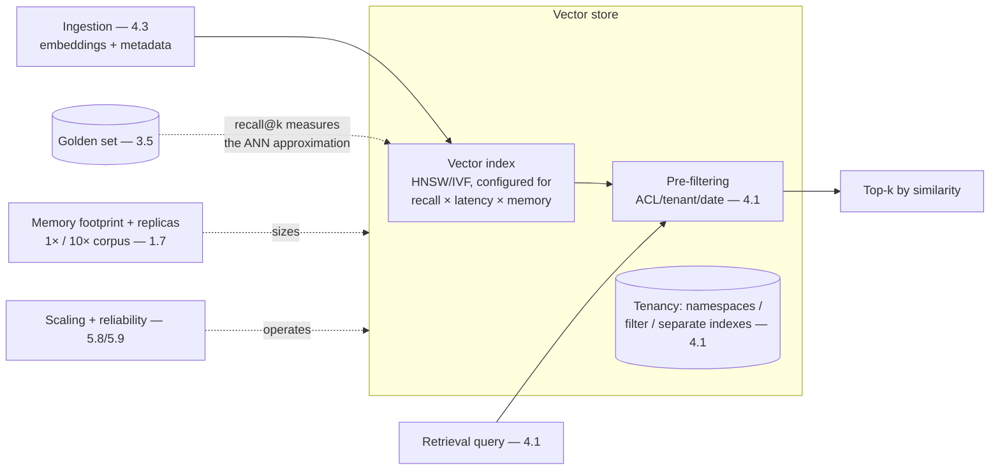

# Chapter 5.6 — Vector & Search Infrastructure

| | |
|---|---|
| **Part** | 5 — Cloud, Infrastructure & Platform Engineering |
| **Maturity level** | 3 — Engineer |
| **Difficulty** | Advanced |
| **Estimated study time** | 3 hours (reading 90 min, exercise 90 min) |
| **Prerequisites** | [3.5](../part-3-core-building-blocks-of-genai/chapter-05-embeddings-semantic-search.md); [4.1](../part-4-enterprise-genai-systems/chapter-01-production-rag.md) |

## Learning Objectives

After this chapter you will be able to:

1. Reason about vector index internals — ANN algorithms (HNSW, IVF), the recall-vs-speed-vs-memory trade — well enough to configure and size them.
2. Select vector infrastructure: dedicated vector databases vs. vector-capable existing databases, and the tenancy and filtering realities.
3. Size and operate vector stores: memory footprint, index build costs, and the scaling and reliability the retrieval layer needs.
4. Place vector infrastructure in the estate: its relationship to the data platform (5.5), the retrieval service (4.1), and the operational realities that determine cost and quality.

## Introduction

This chapter is the specialized store 5.5 deferred: the vector infrastructure that holds the embeddings semantic search (3.5) and RAG (3.6, 4.1) retrieve by. It's where 3.5's "the index is a derived artifact" and 4.1's "indexes are cattle" meet the infrastructure realities of *how* approximate nearest-neighbor search actually works at scale — the algorithms, the memory footprint, the filtering, the tenancy — that determine whether the retrieval layer is fast, accurate, affordable, and operable.

The framing: **vector search is approximate by necessity, and the approximation is a configurable trade** — exact nearest-neighbor search over millions of high-dimensional vectors is too slow, so vector indexes use approximate algorithms (ANN) that trade a little recall for a lot of speed, and configuring that trade (recall vs. latency vs. memory) is the core operational decision. The architect who understands the internals configures retrieval that hits its quality and cost targets; the one who treats the vector store as a black box gets surprised by the recall, the latency, or the bill.

## Business Motivation

Vector infrastructure is a significant cost and quality lever in RAG-heavy estates. Cost: vector stores are memory-hungry (the index often lives in RAM for speed — millions of high-dimensional vectors is real memory), so the sizing (memory footprint, replicas) is a material infrastructure line (1.7's vector-store cost), and the index configuration (which trades memory for recall or speed) directly moves it. Quality: the ANN configuration determines recall (3.5's binding constraint — a poorly-configured index silently drops relevant results, capping the whole RAG system), so vector-infrastructure configuration *is* retrieval-quality engineering at the infrastructure layer. Operability: the vector store is a stateful, scaling, reliability-requiring system (5.8, 5.9) that the retrieval service (4.1) depends on, and its operational maturity determines the retrieval layer's availability. The business decision this chapter enables is the vector-infrastructure selection and sizing — a build-vs-buy (dedicated vector DB vs. extending an existing database), tenancy (4.1's isolation models, vector edition), and cost-vs-quality (the ANN trade) decision that, gotten wrong, either overspends on memory, underdelivers on recall, or under-provisions reliability — and gotten right, gives the RAG estate a fast, accurate, affordable, operable retrieval foundation.

## Theory

### ANN algorithms and the core trade

Exact nearest-neighbor search (compare the query to every vector) is O(n) — too slow at scale. Approximate nearest-neighbor (ANN) algorithms trade exactness for speed:

- **HNSW (Hierarchical Navigable Small World)** — a graph-based index (the most common): builds a multi-layer graph where search navigates from coarse to fine, finding approximate nearest neighbors fast. High recall and speed, higher memory (the graph structure). The configuration knobs (graph connectivity, search breadth) trade recall against speed and memory — the core tuning.
- **IVF (Inverted File)** — a clustering-based index: partitions vectors into clusters, searches only the nearest clusters. Lower memory, tunable recall (how many clusters to search — more clusters, more recall, more latency). Often combined with quantization (compressing vectors) for memory efficiency at some recall cost.
- **The universal trade**: recall vs. latency vs. memory — you can have high recall and low latency (at high memory), or low memory (at some recall or latency cost); the configuration picks the point, mapped to the retrieval SLO (recall gate from 3.5, latency budget from 4.12) and the cost target (4.11). The recall is *measured* (3.5's golden set — recall@k against the ANN index vs. what exact search would return), not assumed, because the approximation's recall loss is the silent quality cap.

### Metadata filtering and the tenancy problem

The infrastructure reality behind 4.1's filter-before-similarity:

- **Filtering** — retrieval filters by metadata (ACL, tenant, date, type — 3.5, 4.1) *before or during* the similarity search; the vector store must support efficient pre-filtering (filter the candidate set, then rank by similarity), because post-filtering (rank then filter) breaks recall (4.1's existence-leak and consumed-top-k problems). Filtering efficiency is a real vector-store capability difference (some do pre-filtering well, some poorly) and a selection criterion.
- **Tenancy** (4.1's isolation ladder, vector edition) — the vector store's support for multi-tenancy: namespaces/collections per tenant (the workhorse isolation — 4.1's per-tenant namespaces), metadata-filter-based tenancy (cheaper, the shared-index-with-filter of 4.1 with its defense-in-depth caveat), or separate indexes (strong isolation). The vector store's tenancy primitives (5.1's tenancy decision, at the vector layer) determine which 4.1 isolation model is efficient.

### Vector infrastructure selection

The build-vs-buy landscape:

- **Dedicated vector databases** — purpose-built for vector search (optimized ANN, filtering, tenancy, scaling); the specialized option, strong on vector-specific capabilities, another system to operate.
- **Vector-capable existing databases** — relational and document databases increasingly add vector search (extensions, native types); the pragmatic option that keeps the vectors in the existing operational database (one fewer system, unified with the metadata and transactions), often sufficient for moderate scale and simpler than a dedicated store.
- **The selection** (1.4) — dedicated for scale, vector-specific performance, and advanced filtering/tenancy needs; existing-database vector capability for moderate scale, operational simplicity, and keeping vectors close to the related data (5.5) — a decision on scale, performance needs, operational preference, and the recall/latency/tenancy requirements, with the caution (7.10) that the vector store holds a derived-but-expensive-to-rebuild artifact (re-embedding at scale — 3.5), so migration between stores is a real cost.

### Sizing and operations

- **Memory footprint** — the index size (vectors × dimensions × the index overhead — HNSW's graph, IVF's structure) often in RAM for speed; the sizing (1.7's vector-store line at 1× and 10× corpus — 3.5) is a material cost, moved by the index choice and quantization.
- **Index build and update** — building the index is compute-intensive (embedding — 5.2, plus index construction); updates (new documents, deletions — 4.1's propagation) must be efficient, and blue/green rebuilds (4.1) are index-level operations.
- **Scaling and reliability** (5.8, 5.9) — the vector store scales with corpus and query load (replicas for read throughput, sharding for size) and needs reliability (the retrieval layer depends on it — replicas, failover, backup of the derived-but-expensive index).

## Architecture Perspective

Readings. **The ANN configuration is retrieval-quality engineering at the infrastructure layer** — the recall/latency/memory trade is set here and *measured* by the golden set (3.5), because the approximation's recall loss is a silent quality cap that the RAG evals (3.6) would otherwise attribute to the wrong layer (4.1's taxonomy: a recall problem that's actually an ANN-config problem). **Pre-filtering support is a selection-determining capability** — 4.1's filter-before-similarity requires the vector store to filter efficiently before ranking, and stores vary in this; the tenancy model (4.1's isolation) depends on the store's tenancy primitives, making vector-infrastructure selection partly a 4.1-requirements-driven decision. **And the vector store is a stateful dependency with real operational weight** — memory-hungry, scaling, reliability-requiring, holding a derived-but-expensive-to-rebuild artifact (re-embedding at scale is costly — 3.5), which means it gets the sizing (1.7), scaling (5.8), and reliability (5.9) engineering of any critical stateful system, and its selection weighs migration cost (7.10) because moving vector stores means re-embedding.

## Real-world Example

**Halvard & Roth** (1.7, 3.5, 4.1) sized and operated the vector infrastructure for the two-million-document matter corpus, and the infrastructure engineering is where 3.5's retrieval quality and 4.1's production scale met the ANN realities. The recall-config lesson came first: the initial HNSW index was configured for low memory (to save cost on the large corpus), and the retrieval golden set (3.5) revealed recall@5 was lower than the exact-search baseline by enough to matter — the memory-saving config had traded away recall the legal use case couldn't afford (a missed relevant clause is a due-diligence failure — 3.8's stakes). The fix was the explicit trade (1.4): reconfigure HNSW for higher recall (higher graph connectivity and search breadth), accepting more memory and cost, with the recall@5 restored to the gate — the ANN trade made deliberately against the SLO rather than defaulted to cheap. The pre-filtering capability drove the store selection: the matter-wall and matter-scoping (4.1's ACL-before-similarity) required efficient pre-filtering (filter to the accessible matters, *then* rank), and the evaluation of vector stores was partly a filtering-capability bake-off — the dedicated vector DB that pre-filtered efficiently won over the existing-database vector extension that would have post-filtered (breaking 4.1's guarantees at the corpus's scale). Tenancy used per-matter-scope namespaces (4.1's isolation, vector edition) for the strong isolation the confidentiality required. Sizing was a material line: the two-million-document index (with the higher-recall config's memory overhead) was a real memory cost, replicated for read throughput and reliability (5.8/5.9 — the retrieval layer the whole contract-analysis depended on), and the re-embedding cost of any embedding-model upgrade (3.5) made the store migration a weighed concern (7.10). Yusuf's vector-infrastructure note: *"The ANN config is a recall knob wearing a cost costume — we'd cheaped out on memory and silently lost recall the legal work couldn't afford. Configured against the golden set, sized for the corpus, filtered before similarity, and replicated because the whole practice depends on it. The vector store is infrastructure, not a magic box."*

## Hands-on Exercise

**Configure and measure vector infrastructure.** ~90 minutes. Uses any vector store (a local library like FAISS or a managed store) and your 3.5 corpus/golden set.

1. **The ANN recall trade (35 min).** Build an HNSW (or IVF) index over your 3.5 corpus at two configurations: one memory-optimized (low connectivity/few clusters), one recall-optimized (high connectivity/many clusters). Measure recall@5 against your golden set for both, plus the latency and memory difference. State which config meets your recall gate and its cost.
2. **Pre-filtering (25 min).** Add metadata (ACL/tenant labels) to your vectors. Implement pre-filtering (filter then rank) and verify it respects the labels (4.1's guarantee); contrast with post-filtering (rank then filter) and observe the recall/leak problem it causes.
3. **Sizing (15 min).** Estimate your index's memory footprint (vectors × dimensions × overhead) at 1× and 10× corpus (1.7/3.5). State the replicas you'd add for read throughput and reliability (5.8/5.9).
4. **Selection memo (15 min).** From your findings, write the 1.4 selection: dedicated vector DB vs. existing-database vector capability — weighing scale, filtering/tenancy needs, operational simplicity, and migration cost (7.10).

**Acceptance criteria:**
- [ ] Recall@5 measured for two ANN configs, with the recall/latency/memory trade quantified and the gate-meeting config chosen
- [ ] Pre-filtering respects labels; post-filtering's recall/leak problem demonstrated
- [ ] Memory footprint estimated at 1× and 10× with replica plan
- [ ] Selection memo weighs the real criteria including migration cost

## Enterprise Considerations

Enterprise vector infrastructure is a platform and governance concern. **Centralized vector infrastructure** (7.9, 5.5): a shared vector-store platform serving the retrieval service (4.1) across teams amortizes the operational and memory cost (the vector-store equivalent of 5.2's utilization amortization and 5.5's shared data platform), rather than each team running its own vector store — and it's where the tenancy isolation (4.1) is implemented consistently. **The vector store holds sensitive data** (4.14): the embeddings encode the corpus content (personal data, confidential documents), so the vector store is in the classification, residency, access-control, and deletion scope (4.1's deletion propagation reaches the vectors — 4.14) — it's a sensitive data store, not a cache. **Selection is a lock-in decision with migration teeth** (7.10): because moving vector stores means re-embedding the corpus (3.5's cost), the vector-store choice is stickier than most infrastructure, so the selection weighs the migration cost and the store's longevity/openness carefully. **And the ANN configuration is a governance-relevant quality control** (4.7): the recall the index config delivers is a retrieval-quality property that, in regulated retrieval (4.14), is part of the accuracy evidence — the config is documented and the recall measured (3.5) as part of the quality story.

## Trade-offs

| Decision | Option A | Option B | Choose A when… | Choose B when… |
|----------|----------|----------|----------------|----------------|
| Store type | Dedicated vector DB | Existing-database vector capability | Scale, vector-specific performance, advanced filtering/tenancy | Moderate scale, operational simplicity, keeping vectors near related data (5.5) |
| ANN config | Recall-optimized (more memory) | Memory-optimized (some recall/latency cost) | Recall is the binding constraint and the use case can't afford loss (legal, medical) | Cost-sensitive, recall gate met at lower memory — measured, not assumed |
| Tenancy | Per-tenant namespaces/indexes | Metadata-filter tenancy | External tenants, strong isolation needs (4.1) | Internal, uniform sensitivity — with defense-in-depth on the filter |
| Index (IVF) | With quantization (compressed) | Full-precision vectors | Memory-critical at large scale, recall loss acceptable | Recall-critical, memory affordable |

## Common Mistakes

1. **Treating the vector store as a magic box** — not understanding the ANN recall trade, so recall is silently capped by a memory-optimized config the use case couldn't afford (Halvard & Roth's cheaped-out memory); the config is measured against the golden set (3.5).
2. **Post-filtering** — ranking then filtering, breaking 4.1's recall and existence-leak guarantees; the vector store must pre-filter efficiently, and this is a selection criterion.
3. **ANN config defaulted, not measured** — accepting the store's default recall/latency/memory point without measuring recall@k against the golden set; the approximation's recall loss is the silent quality cap.
4. **Under-sizing memory** — not planning the index's RAM footprint at 1× and 10× corpus (1.7/3.5), hitting the memory wall or the cost surprise; size for the corpus and its growth.
5. **Ignoring migration cost in selection** — choosing a vector store without weighing that migration means re-embedding (3.5), making the choice stickier than realized (7.10).
6. **Vector store as a cache, not a sensitive data store** — un-classified, un-access-controlled, un-deletion-propagated embeddings that encode confidential content (4.14); it's in the governance scope.
7. **Per-team vector-store sprawl** — every team operating its own vector store, un-amortized memory and inconsistent tenancy; centralize as a platform (7.9).

## Best Practices

1. **Understand and measure the ANN trade** — configure HNSW/IVF for the recall/latency/memory point that meets the retrieval SLO (3.5's gate, 4.12's latency, 4.11's cost), measured against the golden set, not defaulted.
2. **Require efficient pre-filtering** — 4.1's filter-before-similarity is a selection criterion; verify the store pre-filters well and use it for tenancy and ACLs.
3. **Size for the corpus and its growth** — memory footprint at 1× and 10× (1.7/3.5), with replicas for throughput and reliability (5.8/5.9).
4. **Weigh migration cost in selection** — the re-embedding cost makes vector-store choice sticky (7.10); choose for longevity and openness.
5. **Govern the vector store as sensitive data** — classification, residency, access control, deletion propagation (4.14) for the embeddings that encode the content.
6. **Centralize vector infrastructure as a platform** — amortize memory and operations, implement tenancy consistently (7.9/5.5).
7. **Document the ANN config as a quality control** — the recall it delivers is part of the retrieval accuracy evidence (4.7/4.14) in regulated retrieval.

## Architecture Checklist

For any vector/search infrastructure:

- [ ] ANN algorithm (HNSW/IVF) and configuration chosen for the recall/latency/memory point that meets the SLO, measured against the golden set (3.5)
- [ ] Efficient pre-filtering supported and used for ACL/tenant/date filtering (4.1's filter-before-similarity)
- [ ] Tenancy model implemented via the store's primitives (namespaces/indexes/filter) per 4.1's isolation choice
- [ ] Memory footprint sized at 1× and 10× corpus (1.7/3.5); replicas for read throughput and reliability
- [ ] Index build and update (including deletion propagation — 4.1) efficient; blue/green rebuilds supported
- [ ] Store selection weighs migration cost (re-embedding) and lock-in (7.10)
- [ ] Vector store governed as sensitive data (classification, residency, access, deletion — 4.14)
- [ ] Centralized as a platform where multiple teams need retrieval (7.9/5.5)

## Interview Questions

1. *"Explain the core trade-off in vector search infrastructure."* — Strong answers give the ANN recall-vs-latency-vs-memory trade (exact search is too slow, so approximate algorithms like HNSW/IVF trade a little recall for a lot of speed), stress that the config is measured against a golden set (3.5) because the recall loss is a silent quality cap, and map the config to the retrieval SLO and cost target.
2. *"How do you handle document permissions in a vector store?"* — Strong answers require efficient pre-filtering (filter to accessible content before ranking — 4.1's filter-before-similarity), explain why post-filtering breaks recall and leaks existence, and make pre-filtering capability a store-selection criterion, with tenancy via the store's namespace/index primitives.
3. *"When would you use a dedicated vector database vs. adding vectors to your existing database?"* — Strong answers weigh scale, vector-specific performance, and filtering/tenancy needs (dedicated) against operational simplicity and keeping vectors near related data (existing DB — 5.5), and note the migration cost (re-embedding) that makes the choice sticky (7.10).
4. *"Your RAG recall is capped and the retrieval config looks fine. Where else do you look?"* — Strong answers include the ANN configuration: a memory-optimized index silently dropping recall below the exact-search baseline (Halvard & Roth's lesson), diagnosed by measuring recall@k against the golden set at different configs — the infrastructure layer of 4.1's retrieval taxonomy.

## Further Reading

- Malkov & Yashunin, *HNSW* (arxiv.org/abs/1603.09320) — re-linked from 3.5; the graph-index algorithm behind most vector stores, at the depth this chapter's configuration decisions need.
- Your vector store's documentation on index configuration, filtering, and tenancy (official docs) — the specific knobs and primitives; the recall/latency/memory tuning and the pre-filtering capability.
- The FAISS documentation (official) — the reference implementation of the ANN algorithms (HNSW, IVF, quantization) for hands-on understanding.
- 3.5 Embeddings & Semantic Search and 4.1 Production RAG (re-read the index-as-artifact and ACL sections) — the retrieval-quality and production context this infrastructure serves.

## Summary

- Vector search is **approximate by necessity**: exact nearest-neighbor is too slow, so ANN algorithms (HNSW, IVF) trade a little recall for a lot of speed — and the **recall/latency/memory configuration is the core operational decision**, measured against the golden set (3.5) because the approximation's recall loss is a silent quality cap.
- **Pre-filtering is a selection-determining capability**: 4.1's filter-before-similarity requires the store to filter efficiently before ranking (post-filtering breaks recall and leaks existence), and the tenancy model depends on the store's primitives (namespaces/indexes/filter).
- **The vector store is a stateful, memory-hungry, reliability-requiring dependency** holding a derived-but-expensive-to-rebuild artifact (re-embedding — 3.5) — sized (1.7), scaled (5.8), and reliability-engineered (5.9) like any critical stateful system, with migration cost making the selection sticky (7.10).
- **Selection** weighs dedicated vector DB (scale, performance, filtering/tenancy) vs. existing-database vector capability (simplicity, data locality — 5.5), governed as sensitive data (4.14) and centralized as a platform (7.9).
- The ANN config is **retrieval-quality engineering at the infrastructure layer** — configured against the SLO, documented as a quality control (4.7/4.14). The delivery discipline that ships all this infrastructure and the models on it is next: **LLMOps** (5.7).

---

**Previous:** [Chapter 5.5 — Data Architecture for GenAI](chapter-05-data-architecture.md) · **Next:** [Chapter 5.7 — LLMOps: CI/CD for AI Systems](chapter-07-llmops.md) · **Related:** [3.5 Embeddings & Semantic Search](../part-3-core-building-blocks-of-genai/chapter-05-embeddings-semantic-search.md), [4.1 Production RAG](../part-4-enterprise-genai-systems/chapter-01-production-rag.md), [5.5 Data Architecture](chapter-05-data-architecture.md)
