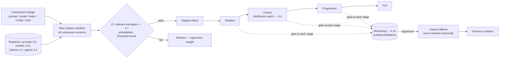

# Chapter 5.7 — LLMOps: CI/CD for AI Systems

| | |
|---|---|
| **Part** | 5 — Cloud, Infrastructure & Platform Engineering |
| **Maturity level** | 3 — Engineer |
| **Difficulty** | Advanced |
| **Estimated study time** | 3–4 hours (reading 2 h, exercise 90 min) |
| **Prerequisites** | [3.3](../part-3-core-building-blocks-of-genai/chapter-03-prompt-engineering.md); [4.7](../part-4-enterprise-genai-systems/chapter-07-evaluation-systems.md); [3.10](../part-3-core-building-blocks-of-genai/chapter-10-model-selection-benchmarking.md) |

## Learning Objectives

After this chapter you will be able to:

1. Design the LLMOps delivery pipeline: versioning of the composite artifact (prompts, models, indexes, configs), eval gates, staged rollout, and rollback.
2. Extend CI/CD for the realities LLM systems add: probabilistic testing, eval-as-tests, and the multi-component versioning that classical CI/CD never faced.
3. Manage the release of every changeable component — prompts (3.3), models (3.10), indexes (4.1), agent definitions (4.4), configs — through one coherent delivery discipline.
4. Operate the deployment lifecycle: staged rollout with distribution watching (4.4), instant rollback, and the change discipline that makes shipping safe.

## Introduction

LLMOps is CI/CD for AI systems — the delivery discipline that ties together the versioning, gating, and rollout that Part 4 kept invoking (3.3's prompt registry, 4.1's index blue/green, 4.4's agent-definition releases, 3.10's model migrations, 4.7's eval gates). This chapter assembles them into one coherent delivery pipeline, because the recurring insight across those chapters is that an LLM system's behavior depends on a *composite* of independently-changeable components (prompts, models, indexes, configs, tools), and shipping changes safely requires versioning and gating the composite — a discipline classical CI/CD (which versioned code) never faced.

The framing: **the deployable unit of an LLM system is a composite of versioned components, and LLMOps is the discipline of changing it safely** — every component change (a prompt edit, a model upgrade, an index rebuild, a config tweak) is a behavior change that rides an eval-gated, staged, rollback-able release, because the alternative (Part 4's recurring incident) is the ungated change that ships a regression. LLMOps is what makes the velocity of GenAI iteration safe.

## Business Motivation

LLMOps is the precondition for shipping fast without shipping regressions — the velocity-and-safety balance that determines a GenAI program's iteration speed. Without it: changes ship ungated (the prompt hotfix, the silent model upgrade — 2.6, the index rebuild), and the majority of production GenAI quality incidents (4.7's finding) are exactly these ungated changes; rollback is ad-hoc (the change that broke production can't be cleanly reverted because the composite wasn't versioned); and the fear of breaking things slows iteration (teams ship rarely and nervously). With it: changes ride a pipeline that gates them on evals (4.7), stages the rollout (watching distributions — 4.4), and rolls back instantly (the composite versioned) — which makes shipping *safe*, which makes teams ship *often*, which is the velocity that compounds (the eval-driven development loop of 4.7, at delivery scale). The business case is the same as classical CI/CD's, sharpened by GenAI's realities: the composite versioning and the eval gates are what let an organization iterate on its GenAI systems at the pace the technology moves (models change quarterly — 3.10, prompts change daily — 3.3) without the regression tax that ungated change imposes.

## Theory

### The composite artifact and its versioning

An LLM system's behavior is determined by a composite of versioned components (the recurring Part 4 registries, unified):

- **Prompts** (3.3) — versioned in the registry, model-assumptions tracked.
- **Models** (3.10) — pinned versions, portfolio routing, migration playbooks.
- **Indexes** (4.1, 5.6) — versioned artifact sets (embedding model + chunker config + index), blue/green deployed.
- **Agent definitions** (4.4) — composite artifacts (system prompt + tools + gates + budgets + model).
- **Guardrail configs** (4.8), **sampling profiles** (3.2), **routing policies** (3.10), **tool contracts** (3.7) — the configuration that shapes behavior.
- **Application code** — the classical part, versioned as always.

The LLMOps discipline: a **release manifest** captures the versions of every component in a deployment (3.10's manifest, generalized), so a deployment is a reproducible composite, and any change to any component is a new manifest that rides the pipeline. This is what makes rollback clean (revert to the previous manifest — all components together — 4.6's in-flight versioning at deployment scale) and what makes "which change caused this?" answerable (the manifest diff between the good and bad deployment — 4.10's version-stamped traces trace to the manifest).

### CI/CD extended for LLM realities

Classical CI/CD (build, test, deploy) extended for what LLM systems add:

- **Eval-as-tests** (4.7) — the eval suites are the test suite: CI runs them on any component change, with the noise-floor-honest thresholds (2.7) and the "eval before feature" discipline (4.7). This is the biggest extension — the "tests" are probabilistic quality measurements, not deterministic assertions, so they gate on thresholds and trends, not pass/fail exactness.
- **Probabilistic testing** — LLM outputs vary (3.2), so tests account for the distribution (multiple runs, statistical gates — 2.7's noise floor) rather than expecting deterministic output; the classical "assert output equals expected" becomes "assert quality metric meets threshold across samples."
- **Multi-component gating** — a change to any component (not just code) triggers the relevant evals: a prompt change runs the prompt suite (3.3), a model change re-runs everything (2.6's fire drill), an index change runs the retrieval golden set (4.1) — the CI knows which suites gate which component changes.
- **The pipeline** — component change → relevant eval gates → staged rollout → monitor → (rollback or complete): the classical pipeline shape with the eval gates and the composite versioning making it LLM-appropriate.

### Staged rollout and rollback

The deployment lifecycle (4.4's canary discipline, generalized; 4.1's blue/green):

- **Staged rollout** — shadow (run the new version alongside, compare, no user impact) → canary (a small traffic percentage) → progressive (increasing percentage) → full, with the eval and monitoring gates at each stage (4.4's distribution-watching — exit distributions, quality signals, cost, latency move before aggregate metrics do). The staging is what catches the regression the offline evals missed (4.7's offline↔online gap) before it hits everyone.
- **Instant rollback** — the composite manifest makes rollback one operation (revert to the previous manifest — prompts, model, index, config together, atomically — 4.1's atomic rollback, composite edition); a rollback that reverts only some components leaves an untested composite, so rollback is manifest-level.
- **Feature flags** (classical, applied) — separating deployment from release, so a component can be deployed dark and enabled progressively, decoupling the risk of deploying from the risk of releasing.

## Architecture Perspective

Readings. **The release manifest is the deployable unit** — capturing every component's version makes the deployment reproducible, the rollback atomic, and the "which change caused this?" answerable via manifest diff; a system without composite versioning can't cleanly roll back or attribute regressions, which are the two things production most needs. **Eval gates are the CI's test suite** (4.7) — the biggest extension over classical CI/CD, and the reason 4.7's eval platform is sequenced before the systems that depend on it (the gates have to exist to gate); the gates being probabilistic (threshold and trend, noise-floor-honest — 2.7) is the LLM-specific discipline. **And staged rollout with distribution-watching is what catches the offline↔online gap** (4.7) — the regression that passed the offline evals but shows in production behavior is caught at canary (distribution shifts — 4.4) before full rollout, which is why the staging is not optional ceremony but the safety mechanism for the gap that offline evals structurally can't close.

## Real-world Example

**Vantora Systems** (the platform arc — 1.8 through 4.11) built LLMOps as the delivery discipline over the gateway (5.4) and the eval platform (4.7), and by this point the pieces are familiar; this chapter is where they become one pipeline. The composite-versioning lesson was learned from an incident: early on, a "quick prompt fix" was applied to the support assistant directly (the live-edit anti-pattern — 3.3), and when it interacted badly with the current model version (a composite interaction), rollback was messy because the prompt change wasn't versioned as part of a deployable composite — the team reverted the prompt but the incident's diagnosis was slow because there was no manifest to diff (4.10's traces pointed at "a prompt changed" but not *which deployment*). The LLMOps build fixed it: every change — prompt (3.3's registry), model (3.10's routing config), index (4.1's blue/green), guardrail config (4.8), agent definition (4.4) — became a release manifest riding the pipeline, gated by the relevant eval suites (4.7 — a prompt change ran the prompt suite, a model change re-ran everything), staged (shadow → canary → progressive, with the fleet dashboards — 4.4 — watched at each stage), and rollback-able atomically (revert the manifest). The staging caught a regression the offline evals missed: a prompt change passed the offline suite but, at canary, the online acceptance signal (4.7's correlation, 4.10's quality plane) dropped on a user segment the golden set under-represented — caught at 5% traffic, rolled back atomically, the segment's cases added to the golden set (4.7's flywheel), re-shipped. The velocity payoff was the point: with the pipeline, the support team shipped prompt improvements multiple times a week (safely, gated, staged) rather than the nervous monthly deploys of the pre-LLMOps era — the safety enabling the velocity. Adaeze's LLMOps note: *"The deployable thing isn't the prompt or the model — it's the manifest of all of them together. Version the composite, gate on evals, stage the rollout, and rollback is one operation. That's what let us ship daily instead of dreading deploys."*

## Hands-on Exercise

**Build the LLMOps pipeline.** ~90 minutes. Extends your Part 3/4 build with its prompts, model config, and index.

1. **The release manifest (25 min).** Define a manifest capturing every component version (prompt version, model, index version, guardrail config, sampling profile). Make a deployment reference the manifest. Demonstrate that two deployments are distinguished by their manifests.
2. **Eval-gated CI (30 min).** Wire the eval gates (4.7): a prompt change triggers the prompt suite, an index change the retrieval golden set, with noise-floor-honest thresholds (2.7). Demonstrate a regressing change blocked and a clean change passed. Make the gate probabilistic (multiple runs, threshold on the metric).
3. **Staged rollout (25 min).** Implement a staged rollout (even simulated: shadow compare → canary at 10% → full) with a monitoring check (quality/cost signal) at each stage. Demonstrate a canary catching a regression (inject one) that the offline gate missed, and stopping before full.
4. **Atomic rollback (10 min).** Demonstrate rolling back to the previous manifest as one operation (all components reverted together), and show why reverting only one component would leave an untested composite.

**Acceptance criteria:**
- [ ] Release manifest captures all component versions; deployments distinguished by manifest
- [ ] Eval gates are probabilistic (threshold + trend), trigger per component change, and block a regression
- [ ] Staged rollout catches a canary-stage regression the offline gate missed
- [ ] Rollback is atomic at the manifest level, with the partial-rollback problem explained

## Enterprise Considerations

Enterprise LLMOps is a platform capability integrated with the enterprise delivery machinery. **It joins the existing CI/CD** (5.1's conform): the LLM-specific extensions (eval gates, composite versioning, staged rollout with distribution-watching) integrate into the enterprise's existing delivery platform and practices, not a parallel AI-delivery pipeline — the eval gates become steps in the existing CI, the manifests version alongside the code. **Governance rides the pipeline** (4.14, 6.9): in regulated systems, the change-control, sign-offs, and audit evidence (4.14) are pipeline stages — the eval-gate results are the accuracy evidence, the staged rollout is the controlled-change discipline, and the manifest history is the change audit trail; LLMOps is where the governance controls (4.14) are physically enforced on change. **The composite-versioning discipline scales the estate's manageability** (7.9): an estate where every system's behavior is a versioned, gated, rollback-able manifest is governable and debuggable at scale, where one of ungated live-edits is chaos — the LLMOps discipline is what makes a large GenAI estate operable. **And the model-migration fire drill** (2.6, 3.10) is an LLMOps operation: the provider deprecation runs through the pipeline (re-run suites against the new model, stage the rollout, watch, complete or rollback) — the fire drill rehearsed as a standard pipeline flow rather than an emergency.

## Trade-offs

| Decision | Option A | Option B | Choose A when… | Choose B when… |
|----------|----------|----------|----------------|----------------|
| Change discipline | Every change rides the eval-gated pipeline | Live edits for "small" changes | Always in production — the "small" prompt edit is the regression vector (3.3) | Never in production; pre-prod exploration only |
| Versioning | Composite manifest (all components) | Per-component, uncoordinated | Always — atomic rollback and regression attribution need it | Never; per-component rollback leaves untested composites |
| Rollout | Staged (shadow→canary→progressive→full) | Direct to full | Any production change — staging catches the offline↔online gap | Trivial config with no behavior impact, and even then cautiously |
| Eval gates | Probabilistic (threshold + trend, sized) | Deterministic assertions | Always for LLM quality — outputs vary (3.2) | Deterministic components (schema validity — 3.4) can assert exactly |

## Common Mistakes

1. **Live-editing production** — the "quick prompt fix" applied directly (3.3's anti-pattern), ungated and un-versioned, the regression vector and the messy-rollback cause (Vantora's early incident); every change rides the pipeline.
2. **Per-component versioning without a composite manifest** — no reproducible deployment, no atomic rollback, no clean regression attribution; the manifest is the deployable unit.
3. **No eval gates** — changes shipping without the eval suite as the test (4.7), the majority-of-incidents cause; eval-as-tests is the biggest LLMOps extension.
4. **Deterministic assertions on probabilistic output** — expecting exact output equality when LLM outputs vary (3.2); gates are threshold-and-trend, noise-floor-honest (2.7).
5. **Direct-to-full rollout** — skipping the staging that catches the offline↔online gap (4.7), so the regression that passed offline hits everyone; stage and watch distributions (4.4).
6. **Partial rollback** — reverting one component and leaving an untested composite; rollback is manifest-level, atomic.
7. **Parallel AI-delivery pipeline** — an LLMOps pipeline disconnected from the enterprise CI/CD; integrate (5.1's conform), the eval gates as steps in the existing delivery.

## Best Practices

1. **Version the composite as a manifest** — every component's version in the deployable unit, making deployments reproducible, rollback atomic, and regression attribution a manifest diff.
2. **Every change rides the eval-gated pipeline** — no live edits in production; the pipeline gates (4.7), stages, and enables rollback for every component change.
3. **Eval-as-tests, probabilistic** — the eval suites are the CI test suite, gating on thresholds and trends (noise-floor-honest — 2.7), triggered per component change.
4. **Stage the rollout with distribution watching** — shadow → canary → progressive → full, watching the fleet dashboards (4.4) at each stage to catch the offline↔online gap (4.7).
5. **Rollback at the manifest level, atomically** — all components together (4.1's atomic rollback, composite edition); partial rollback leaves untested composites.
6. **Integrate with the enterprise CI/CD** — the LLM extensions as steps in the existing delivery (5.1's conform), governance controls riding the pipeline (4.14).
7. **Run model migrations through the pipeline** — the fire drill (2.6/3.10) as a standard staged, gated flow, rehearsed not improvised.

## Architecture Checklist

For the LLMOps delivery pipeline:

- [ ] Release manifest versions every component (prompts, models, indexes, agent definitions, guardrail/routing/sampling configs, code)
- [ ] Every component change rides the pipeline; no live production edits
- [ ] Eval gates (4.7) as the CI test suite: probabilistic (threshold + trend, noise-floor-honest), triggered per component change
- [ ] Staged rollout (shadow → canary → progressive → full) with monitoring/distribution gates at each stage (4.4/4.10)
- [ ] Atomic manifest-level rollback; feature flags separating deployment from release
- [ ] Model migrations run through the pipeline as a standard flow (2.6/3.10)
- [ ] Integrated with the enterprise CI/CD (5.1's conform); governance controls ride the pipeline (4.14)
- [ ] Manifest history is the change audit trail (4.14/6.9)

## Interview Questions

1. *"What makes CI/CD for LLM systems different from classical CI/CD?"* — Strong answers name the composite artifact (behavior determined by prompts + models + indexes + configs, not just code — versioned as a manifest), eval-as-tests (probabilistic quality gates, not deterministic assertions), multi-component gating (each change triggers relevant evals), and staged rollout catching the offline↔online gap — the classical shape extended for LLM realities.
2. *"How do you safely deploy a change to a production LLM system?"* — Strong answers ride the pipeline: new manifest → eval gates (4.7) → staged rollout (shadow/canary/progressive with distribution watching — 4.4) → monitor → complete or atomic rollback; and stress no live edits, composite versioning, and the staging that catches what offline evals miss.
3. *"Why version the whole composite instead of individual components?"* — Strong answers give the two production needs: atomic rollback (revert all components together, or leave an untested composite) and regression attribution (the manifest diff between good and bad deployment) — plus reproducibility; per-component versioning can't cleanly do either.
4. *"Your provider is deprecating your model in 90 days. How does LLMOps handle it?"* — Strong answers run the fire drill (2.6/3.10) through the pipeline: enumerate affected manifests, re-run the suites against the new model, stage the rollout with distribution watching, complete or rollback — the migration as a standard gated pipeline flow, rehearsed not improvised.

## Further Reading

- Classical CI/CD and continuous delivery references (Humble & Farley, *Continuous Delivery*) — the delivery discipline this chapter extends for LLM systems; the staged-rollout and rollback foundations.
- MLOps literature (the MLOps maturity models and practices) — the ML-delivery discipline LLMOps specializes; the model-versioning and pipeline-gating heritage.
- Your CI/CD platform's documentation on staged rollout, feature flags, and pipeline gates (official docs) — the machinery the LLM extensions integrate into.
- 4.7 Evaluation Systems (re-read — the gates), 3.10 Model Selection (the migration playbook), 4.1 Production RAG (index blue/green), 4.4 Agent Architectures (agent-definition releases) — the component-specific delivery disciplines this chapter unifies.

## Summary

- LLMOps is **CI/CD for AI systems** — the delivery discipline unifying the versioning, gating, and rollout Part 4 invoked per component (prompts, models, indexes, agent definitions, configs) into one coherent pipeline.
- The **deployable unit is a composite manifest** capturing every component's version — making deployments reproducible, rollback atomic (all components together), and regression attribution a manifest diff.
- **Eval-as-tests is the biggest extension**: the eval suites (4.7) are the CI test suite, probabilistic (threshold + trend, noise-floor-honest — 2.7), triggered per component change — the gates that catch the majority-of-incidents ungated changes.
- **Staged rollout with distribution watching** (shadow → canary → progressive → full — 4.4) catches the offline↔online gap (4.7) before full rollout, and **atomic manifest-level rollback** reverts safely.
- LLMOps makes **shipping safe, which makes teams ship often** — the velocity-and-safety balance that lets a GenAI program iterate at the pace the technology moves, integrated with the enterprise CI/CD (5.1) with governance controls riding the pipeline (4.14). The scaling this pipeline deploys into is next: **scalability patterns** (5.8).

---

**Previous:** [Chapter 5.6 — Vector & Search Infrastructure](chapter-06-vector-search-infrastructure.md) · **Next:** [Chapter 5.8 — Scalability Patterns](chapter-08-scalability-patterns.md) · **Related:** [4.7 Evaluation Systems](../part-4-enterprise-genai-systems/chapter-07-evaluation-systems.md), [3.10 Model Selection](../part-3-core-building-blocks-of-genai/chapter-10-model-selection-benchmarking.md), [4.1 Production RAG](../part-4-enterprise-genai-systems/chapter-01-production-rag.md)
