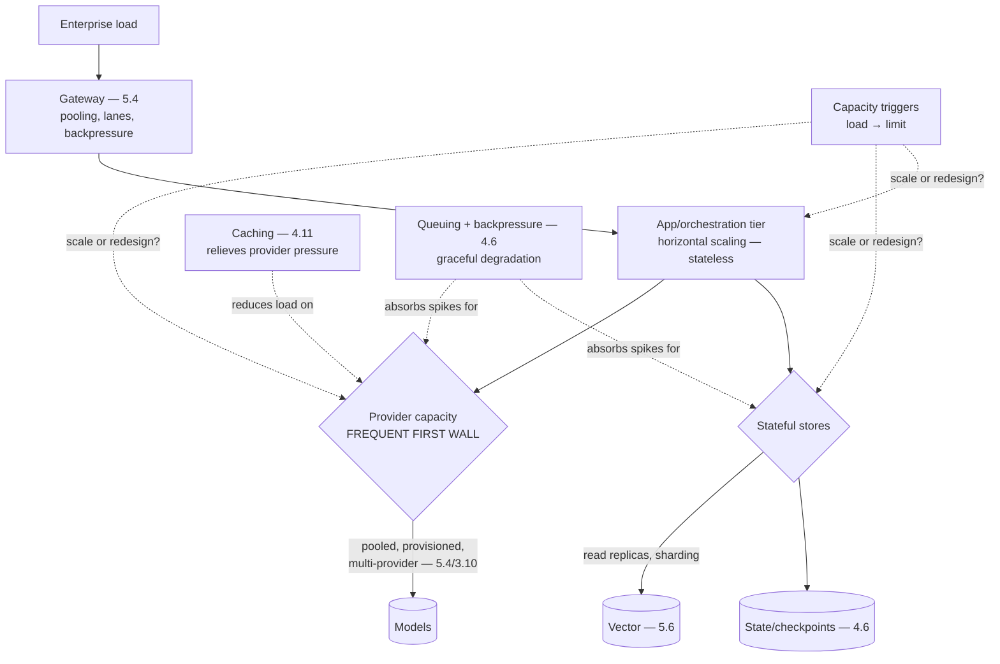

# Chapter 5.8 — Scalability Patterns

| | |
|---|---|
| **Part** | 5 — Cloud, Infrastructure & Platform Engineering |
| **Maturity level** | 3 — Engineer |
| **Difficulty** | Advanced |
| **Estimated study time** | 3 hours (reading 90 min, exercise 90 min) |
| **Prerequisites** | [4.6](../part-4-enterprise-genai-systems/chapter-06-orchestration-workflows.md); [5.4](chapter-04-api-integration-layer.md) |

## Learning Objectives

After this chapter you will be able to:

1. Scale GenAI systems to enterprise load: identify the bottlenecks in order of appearance and the patterns that address each.
2. Apply the scaling patterns — queuing, backpressure, autoscaling, caching, load distribution — to the GenAI-specific constraints (provider limits, GPU capacity, stateful stores).
3. Distinguish what scales horizontally from what needs redesign, and know the capacity triggers that force each.
4. Handle the GenAI-specific scaling reality: provider rate limits as the frequent binding constraint, not compute.

## Introduction

Scalability for GenAI systems is classical distributed-systems scaling (horizontal scaling, queuing, caching, load distribution) with GenAI-specific bottlenecks that often bind *before* the classical ones — most notably provider rate limits (5.4), which cap throughput regardless of how many application replicas you run. This chapter is about scaling GenAI systems to enterprise load, and its organizing discipline is the same as 4.2's retrieval and 4.11's cost: **find the actual bottleneck before applying the pattern**, because the scaling lever on the wrong bottleneck buys nothing (the app tier scaled to handle load that's actually capped at the provider rate limit).

The framing: **GenAI scaling bottlenecks appear in a characteristic order**, and the patterns address them in that order — provider capacity (usually first), stateful stores (vector, state — 5.6, 4.6), then the classical application tier — so the architect who knows the order scales efficiently, while the one who scales the app tier first (the classical instinct) often scales the part that wasn't the constraint.

## Business Motivation

Scalability determines whether a GenAI system that works at pilot scale survives production load — and GenAI systems fail to scale in characteristic ways that surprise teams applying classical instincts. The provider-rate-limit wall is the common one: a system scaled to enterprise user load hits the provider's TPM/RPM limit and throttles, and no amount of application-tier scaling helps because the constraint is upstream (5.4's capacity pooling exists for this) — the pilot that handled 100 users fine falls over at 10,000 not because the app can't handle it but because the provider account's rate limit is the wall. The business consequences are the classical ones (degraded latency, failed requests, lost users — 4.12's abandonment) plus the GenAI-specific cost dimension (scaling often means more provider capacity, which is more spend — 4.11, so scaling and cost are coupled). The positive case is the classical one: a well-scaled system handles the enterprise load its business case assumed (1.3's KPI trees depend on the system actually serving the projected volume), degrades gracefully under spikes (4.6's backpressure) rather than failing, and scales cost-efficiently (the capacity matched to demand — 5.2's utilization, at the system level). Getting scaling right is the difference between a GenAI system that delivers its projected value at scale and one that works in the demo and throttles in production.

## Theory

### The bottleneck order

GenAI scaling bottlenecks tend to appear in this order (find yours by measurement — 4.10 — not assumption):

1. **Provider rate limits** (5.4) — the frequent first wall: the provider account's TPM/RPM caps aggregate throughput. Addressed by capacity pooling and lane allocation (5.4/4.6), provisioned throughput (committed capacity — 5.2), multi-provider distribution (3.10/5.9), and request-level efficiency (caching — 4.11, batching offline work — 4.6). This is the GenAI-specific bottleneck classical scaling doesn't have, and it often binds before any compute limit.
2. **Stateful stores** — the vector store (5.6) under query load (read replicas, sharding for size), the state/checkpoint store (4.6) under workflow volume, the trace store (4.10) under write volume; stateful systems scale harder than stateless (replication, sharding, consistency) and are the second common wall.
3. **The application/orchestration tier** — the classical stateless tier (the glue — 5.2, the orchestration — 4.6, the gateway — 5.4); scales horizontally (more replicas) relatively easily, and is often *not* the binding constraint despite being where the classical instinct scales first.
4. **Self-hosted serving** (5.3) — where self-hosting, the GPU serving capacity (autoscaling replicas, the utilization and cold-start realities of 5.2/5.3); the provider-rate-limit equivalent for self-hosted, addressed by 5.3's serving scaling.

### The scaling patterns

The classical patterns, applied to the GenAI bottlenecks:

- **Horizontal scaling** — more stateless replicas (app tier, gateway); the easy scaling, effective where the constraint is stateless compute, useless where it's the provider limit or the stateful store.
- **Queuing and backpressure** (4.6) — buffering load and shedding gracefully when capacity binds: the interactive lane protected, batch deferred, backpressure flowing up (4.6's lanes); the pattern that turns a hard throttle (provider limit hit → failures) into graceful degradation (requests queued, batch deferred, interactive prioritized). Essential for the provider-limit bottleneck.
- **Caching** (4.11) — reducing load at the source: prompt caching (fewer prefill tokens), semantic caching (fewer calls entirely), which directly relieves the provider-rate-limit pressure (cached responses don't consume the rate limit) — caching is a scaling pattern, not just a cost one.
- **Autoscaling** — demand-matched capacity (app tier replicas, self-hosted serving GPUs — 5.3's cold-start-aware autoscaling); scaling capacity up under load and down when idle (5.2's utilization).
- **Load distribution** — spreading load across providers (3.10's portfolio), regions (5.1), and replicas; the multi-provider distribution that raises aggregate capacity above any single provider's limit.

### Horizontal scaling vs. redesign

The capacity-planning judgment (5.9's neighbor): what scales by adding capacity vs. what needs architectural change:

- **Scales horizontally** — the stateless tiers (app, gateway, orchestration workers — add replicas), read load on replicated stores (add read replicas), and provider capacity (pool, add providers, provision) — the load that more-of-the-same handles.
- **Needs redesign** — the constraints that more capacity doesn't fix: a synchronous architecture that can't absorb spikes (redesign to async/queued — 4.6), a single-provider dependency at its limit (redesign to multi-provider — 3.10/5.9), a stateful store hitting a size wall (redesign to sharded — 5.6), a workflow that doesn't checkpoint hitting a duration wall (redesign to durable — 4.6). The capacity triggers (load approaching a limit) signal which is needed: if adding capacity keeps working, scale; if it stops helping, redesign.

## Architecture Perspective

Readings. **The provider limit is the GenAI-specific first wall** — the classical instinct scales the app tier, but the app tier is stateless and easy while the provider limit is the actual constraint at GenAI scale (the pilot-to-production surprise), so the scaling attention goes to provider capacity (pooling, provisioning, multi-provider — 5.4/3.10) and load reduction (caching — 4.11) first, guided by measurement (4.10) not instinct. **Queuing and backpressure convert hard walls into graceful degradation** — when a capacity binds (provider limit, store saturation), the difference between failure (requests error out) and degradation (requests queue, batch defers, interactive prioritizes — 4.6's lanes) is the queuing-and-backpressure pattern, which is why 4.6's lane discipline is a scalability pattern as much as an orchestration one. **And the scale-vs-redesign judgment is the capacity-planning core** — the capacity triggers (load approaching a limit) signal whether more capacity keeps working (scale) or stops helping (redesign to async, multi-provider, sharded, durable), and recognizing the redesign-needed case *before* the wall (from the trigger, not the outage) is the architect's scaling foresight.

## Real-world Example

**Vantora Systems** (the platform arc) scaled the support-assistant estate from pilot to enterprise load (thousands of concurrent users across the support organization), and the scaling followed the bottleneck order — with the provider-limit wall arriving first exactly as the chapter predicts. The pilot had scaled the app tier (the classical instinct) and handled hundreds of users fine; at enterprise load, the system throttled — and the diagnosis (from the gateway's telemetry — 4.10/5.4) was the provider rate limit, not the app tier (which had headroom). The fix was the provider-capacity patterns: the gateway's capacity pooling (5.4) aggregated and lane-allocated the limits (interactive support protected from the batch ingestion — 4.6), provisioned throughput (5.2's commitment) gave the interactive lane guaranteed capacity for its peak, caching (4.11 — the 71% cache ratio) relieved the rate-limit pressure directly (cached responses didn't consume the limit), and multi-provider distribution (3.10's portfolio) raised aggregate capacity above any single provider's ceiling. The stateful-store wall came second: the vector store (5.6) under the enterprise query load needed read replicas (the retrieval throughput the whole estate depended on), and the workflow state store (4.6) needed scaling for the orchestration volume. The app tier — where the pilot had scaled first — was never the binding constraint (stateless, horizontally scaled trivially). The scale-vs-redesign judgment appeared once: a synchronous batch-processing path hit a spike-absorption wall that more capacity didn't fix, and was redesigned to async/queued (4.6) — the trigger (spikes causing failures despite capacity) signaling redesign not more-capacity. Adaeze's scaling-review note: *"We scaled the app tier at pilot because that's the reflex. At enterprise load the wall was the provider limit — upstream of everything we'd scaled. Pool the capacity, cache to relieve it, spread across providers, and queue so the wall degrades gracefully instead of failing. The bottleneck order is real, and it's not where the classical instinct points."*

## Hands-on Exercise

**Analyze and design scaling.** ~90 minutes. Analysis-primary for a GenAI system you know or a case study.

1. **Bottleneck order (30 min).** For your system at 100×, 1000×, and 10000× pilot load, identify the bottleneck at each scale in order: provider limits (estimate the TPM/RPM at each load), stateful stores (vector query load, state volume), app tier. Which binds first? Confirm the provider-limit-first pattern or explain the exception.
2. **The scaling patterns (25 min).** For the first-binding bottleneck (likely provider), design the patterns: capacity pooling and lane allocation (5.4/4.6), provisioning (5.2), caching relief (4.11), multi-provider distribution (3.10). Estimate the capacity each adds.
3. **Graceful degradation (20 min).** Design the queuing-and-backpressure behavior for when capacity binds: which lane is protected, what defers, how backpressure flows (4.6). Contrast the degraded behavior with the un-queued hard-failure behavior.
4. **Scale vs. redesign (15 min).** Identify one part of your system that would need *redesign* (not more capacity) to scale — a synchronous path, a single-provider dependency, an unsharded store — and state the capacity trigger that would signal it.

**Acceptance criteria:**
- [ ] Bottleneck order identified across scales; the first-binding constraint named (provider limit likely)
- [ ] Scaling patterns designed for the first bottleneck with capacity estimates
- [ ] Graceful degradation (queuing/backpressure) designed, contrasted with hard failure
- [ ] One redesign-needed part identified with its capacity trigger

## Enterprise Considerations

Enterprise GenAI scaling is a platform and capacity-planning concern. **The gateway is the scaling control point** (5.4): the capacity pooling, lane allocation, and backpressure that address the provider-limit bottleneck live at the gateway, which is why the gateway's own scaling (it's on every request path) must lead the estate's — and why the platform team owns the aggregate capacity planning (the provider commitments, the multi-provider distribution) across all consuming teams rather than each team planning its own. **Capacity is planned and procured** (1.7's calendar-time, 5.2's GPU supply, 5.4's provider commitments): provider provisioned-throughput and GPU capacity are committed ahead of need against demand forecasts, so enterprise scaling is a forecasting-and-procurement discipline (the FinOps and platform teams modeling demand growth against committed capacity), not just an autoscaling-config one. **Scaling couples with cost** (4.11): more capacity is more spend, so scaling decisions are cost decisions (the provider provisioning, the multi-provider distribution, the read replicas all have cost), governed together (4.11's cost SLOs at scale). **And the scale-vs-redesign judgment is an architecture-review concern** (6.9): recognizing that a system needs redesign to scale (not more capacity) before it hits the wall is the architecture foresight that review boards (6.9) exist to surface — the capacity trigger flagged in review, the redesign planned before the outage.

## Trade-offs

| Decision | Option A | Option B | Choose A when… | Choose B when… |
|----------|----------|----------|----------------|----------------|
| First scaling attention | Provider capacity (pool, provision, multi-provider) | App tier replicas | GenAI scale — the provider limit is the frequent first wall | The app tier is measurably the constraint (rare at GenAI scale) |
| Capacity under spikes | Queue + backpressure (graceful degradation) | Hard limits (fail fast) | Interactive UX — degrade, don't fail (4.6/4.12) | Batch, where failure is acceptable and completion beats responsiveness |
| Provider capacity | Provisioned throughput (committed) | On-demand only | Predictable high load, latency-critical lanes (5.2) | Bursty/unpredictable, or early stage before demand is known |
| Scale vs. redesign | Add capacity | Architectural redesign | The trigger shows capacity keeps working | The trigger shows capacity stops helping (async, multi-provider, sharded, durable) |

## Common Mistakes

1. **Scaling the app tier first** — the classical instinct applied to a GenAI system where the provider limit is the actual wall (Vantora's pilot); measure the bottleneck (4.10), and it's usually upstream of the app tier.
2. **Ignoring the provider rate limit** — scaling to enterprise load without addressing the TPM/RPM cap, hitting the throttle wall; capacity pooling, provisioning, caching relief, and multi-provider distribution (5.4/3.10) are the provider-bottleneck patterns.
3. **Hard failure instead of graceful degradation** — no queuing/backpressure, so capacity binds cause request failures instead of degradation (4.6); queue, protect the interactive lane, defer batch.
4. **Caching seen as cost-only** — missing that caching relieves the provider-rate-limit pressure (cached responses don't consume the limit), so it's a scaling pattern too (4.11).
5. **Scaling stateful stores like stateless** — treating the vector store or state store as horizontally-scalable-by-replicas without the replication/sharding/consistency reality (5.6/4.6); stateful scales harder.
6. **Adding capacity where redesign is needed** — throwing capacity at a synchronous-spike or single-provider-limit wall that more capacity doesn't fix; the trigger (capacity stops helping) signals redesign.
7. **No aggregate capacity planning** — each team planning its own provider capacity, un-pooled, hitting individual limits while aggregate headroom sits unused; platform-level capacity planning (5.4).

## Best Practices

1. **Find the bottleneck by measurement, in order** — provider limits, stateful stores, app tier (4.10); the provider limit is the frequent first wall, upstream of the classical instinct.
2. **Address the provider bottleneck with its patterns** — capacity pooling and lane allocation (5.4/4.6), provisioned throughput (5.2), caching relief (4.11), multi-provider distribution (3.10) at the gateway.
3. **Queue and backpressure for graceful degradation** — turn hard capacity walls into degradation (interactive protected, batch deferred — 4.6), not failure.
4. **Scale stateful stores as stateful** — read replicas, sharding, consistency for the vector and state stores (5.6/4.6), which scale harder than the stateless tiers.
5. **Recognize scale-vs-redesign from the trigger** — capacity keeps working (scale) vs. stops helping (redesign to async/multi-provider/sharded/durable), flagged before the wall (6.9).
6. **Plan aggregate capacity at the platform** — provider commitments and multi-provider distribution across all teams (5.4), forecast-driven procurement (1.7).
7. **Govern scaling and cost together** — more capacity is more spend (4.11); scaling decisions are cost decisions with cost SLOs at scale.

## Architecture Checklist

For scaling any GenAI system to enterprise load:

- [ ] Bottleneck order identified by measurement (provider limits, stateful stores, app tier); the first-binding constraint known
- [ ] Provider capacity addressed: pooling and lane allocation (5.4/4.6), provisioned throughput (5.2), caching relief (4.11), multi-provider distribution (3.10)
- [ ] Queuing and backpressure for graceful degradation; interactive lane protected, batch deferred (4.6)
- [ ] Stateful stores scaled as stateful (replicas, sharding, consistency — 5.6/4.6)
- [ ] App/orchestration tier horizontally scalable (stateless)
- [ ] Self-hosted serving autoscaled (cold-start-aware — 5.3) where applicable
- [ ] Scale-vs-redesign judgments made from capacity triggers, before the wall (6.9)
- [ ] Aggregate capacity planned at the platform (forecast-driven — 1.7); scaling governed with cost (4.11)

## Interview Questions

1. *"Your GenAI system works at pilot but throttles at enterprise load. Diagnose."* — Strong answers suspect the provider rate limit first (the frequent GenAI wall, upstream of the app tier the classical instinct scales), verify by measurement (4.10/5.4), and prescribe the provider-bottleneck patterns: capacity pooling, provisioning, caching relief, multi-provider distribution — Vantora's shape.
2. *"What scales horizontally in a GenAI system, and what needs redesign?"* — Strong answers separate the stateless tiers (app, gateway, orchestration — add replicas) from the constraints capacity doesn't fix (synchronous spikes → async, single-provider limit → multi-provider, store size → sharding, non-durable workflows → durable), and use the capacity trigger (capacity stops helping) to signal redesign.
3. *"How do you keep a GenAI system from failing when it hits a capacity limit?"* — Strong answers give queuing and backpressure (4.6): the interactive lane protected, batch deferred, backpressure flowing up — turning a hard throttle into graceful degradation, and note caching (4.11) relieving the provider-limit pressure as a scaling pattern.
4. *"How does scaling couple with cost for GenAI?"* — Strong answers explain that scaling often means more provider capacity (provisioning, multi-provider) or more infrastructure (replicas), which is more spend (4.11) — so scaling decisions are cost decisions, governed together with cost SLOs at scale, and caching serves both.

## Further Reading

- Classical scalability references (the scalability chapters of *Designing Data-Intensive Applications* — Kleppmann) — the horizontal-scaling, replication, sharding, and backpressure patterns this chapter applies to GenAI bottlenecks.
- Your provider's rate-limit and provisioned-throughput documentation (official docs) — the provider-capacity reality that's the frequent first GenAI bottleneck.
- Your cloud's autoscaling documentation (official docs) — the app-tier and self-hosted-serving autoscaling machinery.
- 4.6 Orchestration (queuing, backpressure, lanes), 5.4 API Layer (capacity pooling), 5.6 Vector Infrastructure (store scaling) — the specific scaling machinery this chapter organizes.

## Summary

- GenAI scaling is **classical scaling with GenAI-specific bottlenecks that bind first** — most notably provider rate limits (5.4), which cap throughput upstream of the app tier the classical instinct scales.
- The **bottleneck order** is characteristic: provider limits (frequent first wall), stateful stores (vector, state — scale harder), then the stateless app tier — found by measurement (4.10), not assumption.
- The **provider bottleneck's patterns** are capacity pooling and lane allocation (5.4/4.6), provisioned throughput (5.2), caching relief (4.11 — caching is a scaling pattern), and multi-provider distribution (3.10).
- **Queuing and backpressure convert hard walls into graceful degradation** (4.6's lanes) — interactive protected, batch deferred — the difference between failure and degradation under load.
- The **scale-vs-redesign judgment** reads the capacity trigger: capacity keeps working (scale) vs. stops helping (redesign to async, multi-provider, sharded, durable) — recognized before the wall (6.9), and governed with cost (4.11). The reliability this scaled system must deliver is next: **reliability engineering** (5.9).

---

**Previous:** [Chapter 5.7 — LLMOps: CI/CD for AI Systems](chapter-07-llmops.md) · **Next:** [Chapter 5.9 — Reliability Engineering: SLOs, Failover & DR](chapter-09-reliability-engineering.md) · **Related:** [4.6 Orchestration & Workflow Design](../part-4-enterprise-genai-systems/chapter-06-orchestration-workflows.md), [5.4 API & Integration Layer](chapter-04-api-integration-layer.md), [5.6 Vector & Search Infrastructure](chapter-06-vector-search-infrastructure.md)
