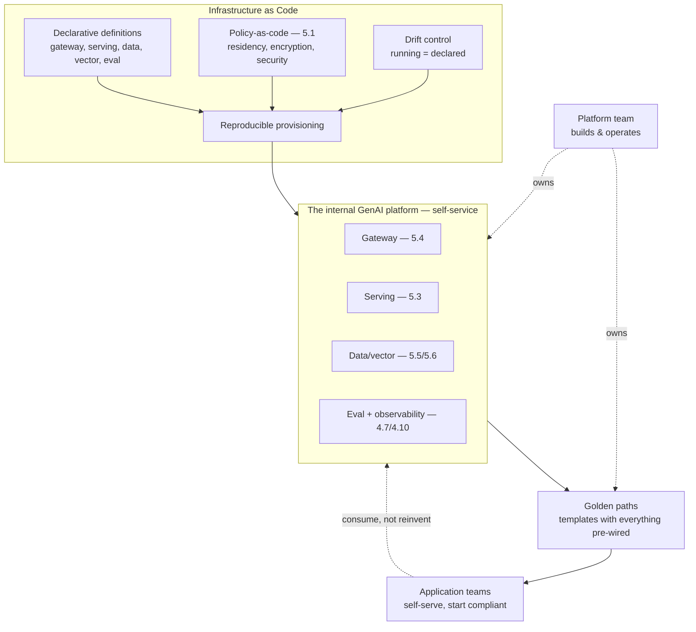

# Chapter 5.10 — Infrastructure as Code & Platform Engineering

| | |
|---|---|
| **Part** | 5 — Cloud, Infrastructure & Platform Engineering |
| **Maturity level** | 3 — Engineer |
| **Difficulty** | Advanced |
| **Estimated study time** | 3 hours (reading 90 min, exercise 90 min) |
| **Prerequisites** | [5.1](chapter-01-cloud-fundamentals-ai.md); [5.4](chapter-04-api-integration-layer.md); [5.7](chapter-07-llmops.md) |

## Learning Objectives

After this chapter you will be able to:

1. Codify GenAI infrastructure as code: reproducible environments, policy-as-code guardrails, and the drift control that keeps them true.
2. Design the internal GenAI platform: the self-service capabilities that let application teams build on paved roads rather than reinventing infrastructure.
3. Apply platform-engineering thinking to GenAI: the golden paths (templates, defaults) that make the right thing the easy thing (1.8's influence-at-scale).
4. Place the platform as the culmination of Part 5: the assembled infrastructure (gateway, serving, data, eval, observability) offered as a coherent self-service platform.

## Introduction

This chapter assembles Part 5's infrastructure into a *platform* — the self-service internal platform that application teams build on, codified as infrastructure-as-code and offered as golden paths. It's the culmination of two threads: the cloud-and-infrastructure thread of Part 5 (the gateway — 5.4, serving — 5.3, data — 5.5, vector — 5.6, all assembled), and the platform/product-split thread that ran through Part 4 (the recurring "the platform provides X, teams consume it" — now made concrete as the internal platform). Infrastructure-as-code is the *how* (reproducible, version-controlled, policy-enforced infrastructure — 5.7's discipline extended from application delivery to infrastructure), and platform engineering is the *what* (the self-service capabilities and golden paths that make the infrastructure consumable).

The framing: **the internal GenAI platform is the paved road** — the assembled infrastructure offered as self-service capabilities with golden-path templates, so application teams build GenAI systems by consuming the platform (the gateway, the eval service, the observability, the serving) rather than reinventing each piece, which is both an efficiency (build once, consume many — the amortization that recurred through Part 5) and a governance mechanism (the paved road has the guardrails built in — 1.8's make-the-right-thing-easy).

## Business Motivation

The internal platform is what makes an enterprise's GenAI program scale beyond a few systems — the difference between forty teams each reinventing (and mis-implementing) the infrastructure and forty teams building on a coherent platform. Without it: every team builds its own gateway (badly — 5.4), its own eval (inconsistently — 4.7), its own observability (partially — 4.10), its own security and cost controls (or none) — the sprawl that recurred as the anti-pattern through Part 4/5, multiplying cost, inconsistency, and governance gaps. With it: the platform provides these as self-service capabilities, teams consume them via golden paths, and the whole estate inherits the platform's quality, governance, and cost-efficiency — the compounding platform economics (build once, amortize across all consumers) that justified centralizing each piece (5.2's serving, 5.5's data, 5.6's vector, 5.4's gateway) now realized as the coherent platform. The governance dimension is as important as the efficiency: the paved road *is* the governance mechanism (1.8's influence-at-scale) — the golden-path template that has the guardrails, observability, cost controls, and eval gates built in means teams get governance by default (the make-the-right-thing-easy that beats the mandate teams route around — 1.8/2.8/4.14's integrate-don't-parallel), so the platform is how enterprise GenAI governance actually scales.

## Theory

### Infrastructure as code for GenAI

The IaC discipline (5.7's version-and-gate discipline, applied to infrastructure):

- **Reproducible environments** — the GenAI infrastructure (the gateway, serving, vector stores, data pipelines) defined as code (declarative infrastructure definitions), so environments are reproducible, version-controlled, and reviewable — the same environment provisioned identically for dev/staging/prod, and disaster recovery (5.9) as a re-provision.
- **Policy-as-code** (5.1's guardrails) — the org-level governance (residency, encryption, allowed configs, security baselines — 5.1, 4.14) enforced as code (preventive policies that reject non-compliant infrastructure), so governance is architectural not exhortational (5.1's preventive-vs-detective) — the guardrails that make the paved road safe.
- **Drift control** — detecting and correcting when running infrastructure diverges from its code definition (configuration drift), keeping the reproducible-and-governed property true over time (the infrastructure equivalent of 5.7's version discipline — the running state matches the declared state).
- **The GenAI-specific IaC** — beyond the classical infrastructure, the GenAI configuration (the gateway's routing policies — 3.10, the guardrail configs — 4.8, the eval gates — 4.7) codified alongside, so the whole GenAI platform is reproducible and version-controlled, not just the compute under it.

### Platform engineering: self-service and golden paths

The platform-engineering discipline (the internal-platform-as-product thinking):

- **The platform as product** — the internal GenAI platform treated as a product with the application teams as customers: self-service capabilities (provision a gateway route, an eval suite, an observability dashboard, a vector index — without a ticket to the platform team), documentation, support, and a roadmap driven by the consuming teams' needs (8.7's team-building, platform edition).
- **Golden paths** — the paved roads: templates and defaults that make building a GenAI system on the platform the easy, right way (the golden-path repo with the gateway integration, eval harness, observability, and guardrails pre-wired — 4.7/4.8/4.10's platform integrations, packaged), so a team building a new GenAI feature starts compliant, observable, and cost-controlled by default. The golden path is 1.8's make-the-right-thing-the-easy-thing, industrialized — the influence mechanism that scales governance.
- **Self-service with guardrails** — the balance: teams self-serve (velocity — no platform-team bottleneck) within the guardrails (policy-as-code — the self-service can't provision non-compliant infrastructure), so the platform gives autonomy *and* governance, not the false choice between them.
- **The platform team** — the team that builds and operates the platform (distinct from the application teams that consume it — the platform/product split, organizationally), with the platform-engineering skills (infrastructure, the GenAI-specific serving/gateway/eval expertise — 5.3's serving skill, etc.) concentrated.

### The assembled platform

What the GenAI platform provides (Part 5, assembled):

- **The gateway** (5.4) — routing, auth, rate limits, caching, observability, cost attribution, guardrail integration, provider failover.
- **Serving** (5.3) — for self-hosted models, the shared serving infrastructure.
- **Data and vector** (5.5, 5.6) — the data platform integration and the shared vector infrastructure.
- **Eval and observability** (4.7, 4.10) — the shared eval service and observability platform.
- **The golden paths** — the templates that wire these together for a consuming team.

The platform is the coherent offering of all of these as self-service, which is the [P16 multi-tenant GenAI platform](../../projects/README.md) and the 7.9 platform patterns.

## Architecture Perspective

Readings. **The platform is Part 5 assembled and offered as self-service** — every piece of infrastructure Part 5 built (gateway, serving, data, vector, eval, observability) becomes a self-service capability of the coherent platform, which is the culmination the whole Part was building toward (the recurring "centralize as a platform" now realized). **The golden path is the governance mechanism** — the template with the guardrails, observability, cost controls, and eval gates pre-wired means teams get governance *by default* (1.8's make-the-right-thing-easy, industrialized), which is how enterprise GenAI governance actually scales (the paved road beats the mandate teams route around — the integrate-don't-parallel lesson at its culmination). **And self-service-with-guardrails resolves the autonomy-vs-governance tension** — policy-as-code lets teams self-serve (velocity) within the guardrails (governance), so the platform gives both rather than forcing the choice, which is the platform-engineering insight that makes the platform an enabler rather than a bottleneck.

## Real-world Example

**Vantora Systems** (the platform arc, culminating here) is the internal GenAI platform's fullest example — the whole arc from 1.8's fragmented eleven-teams-six-models chaos to the coherent self-service platform has been building to this chapter. The IaC discipline codified the platform: the gateway (5.4), the shared eval service (4.7), the observability (4.10), the vector infrastructure (5.6) all defined as code (reproducible, version-controlled), with policy-as-code enforcing the org guardrails (residency for the EU entity, encryption, security baselines — 5.1/4.14) as preventive controls, and drift control keeping the running platform true to its definition. The platform-as-product thinking made it self-service: an application team building a new GenAI feature could provision a gateway route, wire an eval suite, and get an observability dashboard without a ticket to the platform team — self-service within the policy-as-code guardrails (they couldn't provision non-compliant infrastructure). The golden paths were the influence mechanism (1.8's make-the-right-thing-easy, now industrialized): the golden-path template had the gateway integration (routing, caching, cost attribution — 5.4), the eval harness (4.7), the observability (4.10), and the guardrails (4.8) pre-wired, so a team building a new feature *started* compliant, observable, and cost-controlled — the governance-by-default that the pre-platform era's mandates never achieved (teams had routed around them). The adoption told the platform story: nine of eleven teams adopted the golden path within two quarters (1.8's Marek-pilot-to-platform arc, completed), not by mandate but because the paved road was genuinely easier than reinventing the infrastructure, and the two hold-outs migrated once the CFO's cost visibility (the chargeback — 4.11, on the platform) made their un-amortized costs visible. Adaeze's platform-engineering summary, closing Vantora's arc as it closes Part 5: *"We started with eleven teams each reinventing the infrastructure badly. We ended with a platform they build on — self-service so it's fast, policy-as-code so it's governed, golden paths so the right way is the easy way. The platform is Part 5 assembled: the gateway, the eval, the observability, the serving, all offered as a paved road. That's how GenAI scales past a few systems — not more mandates, a better road."*

## Hands-on Exercise

**Design the platform and a golden path.** ~90 minutes. Analysis-primary with optional IaC.

1. **IaC the infrastructure (30 min).** For a GenAI platform's core (the gateway and an eval service), sketch the infrastructure-as-code: the declarative definition, the policy-as-code guardrails (residency, encryption — 5.1), and the drift-control approach. If coding, define a simple piece of infrastructure declaratively.
2. **The golden path (30 min).** Design the golden-path template for a team building a new RAG feature: what's pre-wired (gateway integration, eval harness, observability, guardrails — 5.4/4.7/4.10/4.8), what the team fills in (their corpus, prompts, task-specific evals), and how starting on the path makes them compliant/observable/cost-controlled by default.
3. **Self-service with guardrails (15 min).** Design one self-service capability (provision a gateway route) with its policy-as-code guardrail (the route must have cost attribution and can't bypass guardrails). Show how the team self-serves within the guardrail.
4. **The platform-as-product view (15 min).** Write the one-paragraph platform-as-product statement: who the customers are (application teams), what the self-service capabilities are, and how the roadmap is driven by their needs — the platform/product split, organizationally.

**Acceptance criteria:**
- [ ] IaC sketch includes declarative definition, policy-as-code guardrails, and drift control
- [ ] Golden path pre-wires the platform capabilities and makes compliance/observability/cost-control the default
- [ ] Self-service capability designed with its policy-as-code guardrail (autonomy within governance)
- [ ] Platform-as-product statement identifies customers, capabilities, and needs-driven roadmap

## Enterprise Considerations

The internal GenAI platform is a major enterprise investment and organizational structure. **It conforms to the enterprise platform-engineering practice** (5.1): most enterprises have (or are building) an internal developer platform, and the GenAI platform fits into it (the GenAI-specific capabilities added to the existing platform's paved roads) rather than a parallel one — the integrate-don't-parallel lesson at the platform level. **The platform team is an org-design decision** (8.7): the platform/product split becomes organizational (a platform team building and operating the GenAI platform, application teams consuming it), with the platform-engineering and GenAI-infrastructure skills (5.3's serving, 5.4's gateway, 4.7's eval) concentrated in the platform team — a Conway's-law-aware structure (6.4) where the platform boundary reflects the team boundary. **The build-vs-buy spans the platform** (6.8): the platform can be built (full control, fits the enterprise) or assembled from products (the gateway product, the eval product, etc. — faster but the lock-in and integration concerns of 7.10), and the decision weighs the platform's centrality (5.4's gateway-lock-in caution applies to the whole platform). **And the platform is the governance-at-scale mechanism** (4.14, 6.9): the golden paths with governance built in are how the enterprise's GenAI governance (the classification, the controls, the evidence — 4.14) actually reaches every system, so the platform team and the governance function collaborate closely (the paved road carries the governance).

## Trade-offs

| Decision | Option A | Option B | Choose A when… | Choose B when… |
|----------|----------|----------|----------------|----------------|
| Platform investment | Build an internal GenAI platform | Teams self-assemble infrastructure | Beyond a few systems — the sprawl anti-pattern compounds | Genuinely one or two systems — but plan the platform before the sprawl |
| Self-service | Self-service with policy-as-code guardrails | Platform-team-provisioned (ticket) | Always — velocity without the bottleneck, governance via guardrails | Never as the primary model; the ticket-bottleneck kills velocity |
| Governance mechanism | Golden paths (make right easy) | Mandates and reviews | Always — the paved road beats the routed-around mandate (1.8) | Reviews as a backstop for the off-path cases, not the primary |
| Platform sourcing | Build | Assemble from products | Centrality and fit justify the build (the platform is core) | Speed acceptable and the lock-in weighed (7.10) — with extra care given centrality |

## Common Mistakes

1. **No platform, infrastructure sprawl** — every team reinventing the gateway, eval, observability badly and inconsistently (the recurring Part 4/5 anti-pattern); the platform amortizes and governs, built before the sprawl compounds.
2. **Mandates instead of golden paths** — governance by mandate-and-review that teams route around (1.8/2.8/4.14), instead of the paved road that makes the right way the easy way; the golden path is the governance-at-scale mechanism.
3. **Self-service without guardrails** — teams self-serving into non-compliant infrastructure (no policy-as-code), or guardrails without self-service (the ticket bottleneck); self-service-with-guardrails gives both.
4. **Infrastructure not as code** — manually-provisioned, un-reproducible, drift-prone infrastructure; IaC (reproducible, version-controlled, policy-enforced, drift-controlled) is the foundation.
5. **The platform as a cost center, not a product** — a platform team that builds what it thinks teams need without the platform-as-product discipline (customers, self-service, needs-driven roadmap); the platform serves its consuming teams or they route around it.
6. **A parallel GenAI platform** — disconnected from the enterprise's existing platform-engineering practice; fit the GenAI capabilities into the existing internal developer platform (5.1's conform).
7. **Under-weighing platform lock-in** — assembling the platform from heavily-locked-in products without weighing that the platform is the *most central* thing (5.4's gateway caution, whole-platform edition — 7.10).

## Best Practices

1. **Build the internal GenAI platform** — assemble Part 5's infrastructure (gateway, serving, data, vector, eval, observability) as coherent self-service; it's how GenAI scales past a few systems.
2. **Codify as infrastructure-as-code** — reproducible, version-controlled, policy-as-code-governed (5.1), drift-controlled; the whole GenAI platform including the GenAI-specific config (routing, guardrails, eval gates).
3. **Offer golden paths** — templates with the platform capabilities and governance pre-wired, making compliant/observable/cost-controlled the default (1.8's make-the-right-thing-easy, industrialized — the governance-at-scale mechanism).
4. **Self-service within guardrails** — teams self-serve (velocity) within policy-as-code (governance); autonomy and governance, not the false choice.
5. **Run the platform as a product** — application teams as customers, self-service capabilities, documentation, needs-driven roadmap (the platform/product split, organizationally).
6. **Conform to the enterprise platform practice** — fit the GenAI capabilities into the existing internal developer platform (5.1), don't parallel.
7. **Weigh platform build-vs-buy with lock-in care** — the platform is the most central thing (7.10); the gateway-lock-in caution (5.4) applies to the whole platform.

## Architecture Checklist

For the internal GenAI platform:

- [ ] Part 5's infrastructure assembled as coherent self-service (gateway, serving, data/vector, eval, observability)
- [ ] Infrastructure-as-code: reproducible, version-controlled definitions including the GenAI-specific config
- [ ] Policy-as-code guardrails (residency, encryption, security, non-bypass — 5.1/4.14) as preventive controls
- [ ] Drift control keeping running infrastructure true to its definition
- [ ] Golden paths: templates with platform capabilities and governance pre-wired, compliance/observability/cost-control by default
- [ ] Self-service capabilities within policy-as-code guardrails (autonomy + governance)
- [ ] Platform run as a product: application-team customers, documentation, needs-driven roadmap
- [ ] Platform team distinct from consuming teams (platform/product split, organizationally — 8.7)
- [ ] Conforms to the enterprise platform-engineering practice (5.1); build-vs-buy weighs centrality/lock-in (7.10)

## Interview Questions

1. *"What is an internal GenAI platform and why build one?"* — Strong answers describe Part 5's infrastructure (gateway, serving, data, vector, eval, observability) assembled as self-service with golden paths, explain the platform economics (build once, amortize — the alternative is per-team sprawl), and stress the governance dimension (golden paths with governance built in are how enterprise GenAI governance scales — the paved road beats the mandate).
2. *"How do golden paths relate to governance?"* — Strong answers give the make-the-right-thing-easy insight (1.8, industrialized): the golden-path template with guardrails, observability, cost controls, and eval gates pre-wired means teams get governance *by default*, which is how governance actually scales (the integrate-don't-parallel lesson — teams adopt the easy compliant path rather than routing around a mandate).
3. *"How do you balance self-service velocity with governance?"* — Strong answers give self-service-with-guardrails: policy-as-code lets teams self-serve (no platform-team ticket bottleneck) within the guardrails (can't provision non-compliant infrastructure), so the platform gives autonomy *and* governance rather than forcing the choice — the platform-engineering insight.
4. *"How should the platform team relate to the application teams?"* — Strong answers give the platform-as-product discipline: application teams are customers, the platform offers self-service capabilities with documentation and support, the roadmap is driven by their needs, and the platform/product split is organizational (concentrated platform-engineering and GenAI-infrastructure skills) — a Conway's-law-aware structure.

## Further Reading

- Team Topologies (Skelton & Pais) — the platform-team and stream-aligned-team model this chapter's platform/product split draws on; the organizational structure of platform engineering.
- Your IaC tool's documentation (Terraform, Pulumi, or your cloud's native — official) — the infrastructure-as-code mechanics; the policy-as-code capabilities (OPA, cloud policy engines) for the guardrails.
- Internal developer platform / platform engineering references (the platform-engineering literature and your enterprise's IDP if it exists) — the self-service-and-golden-paths discipline this chapter applies to GenAI.
- [7.9 Platform & Multi-tenancy Patterns](../part-7-enterprise-ai-architecture-patterns/chapter-09-platform-multitenancy-patterns.md) — the pattern-form treatment of the platform; this chapter is its infrastructure-and-engineering detail, and P16 builds it.

## Summary

- The **internal GenAI platform is Part 5 assembled** — the gateway (5.4), serving (5.3), data/vector (5.5/5.6), eval (4.7), and observability (4.10) offered as coherent self-service, the culmination of the Part's recurring "centralize as a platform."
- **Infrastructure-as-code** makes it reproducible, version-controlled, and policy-governed (5.1's guardrails as preventive policy-as-code, drift-controlled) — including the GenAI-specific config (routing, guardrails, eval gates).
- **Golden paths are the governance-at-scale mechanism**: templates with governance, observability, and cost controls pre-wired make compliant/observable/cost-controlled the *default* (1.8's make-the-right-thing-easy, industrialized) — the paved road that beats the routed-around mandate.
- **Self-service-with-guardrails** resolves the autonomy-vs-governance tension: policy-as-code lets teams self-serve within the guardrails — velocity *and* governance, run as a product with application teams as customers.
- The platform is **how enterprise GenAI scales past a few systems** — not more mandates, a better road. The one remaining Part 5 concern is the cross-boundary reality some enterprises face: **multi-cloud, hybrid & sovereignty** (5.11).

---

**Previous:** [Chapter 5.9 — Reliability Engineering](chapter-09-reliability-engineering.md) · **Next:** [Chapter 5.11 — Multi-cloud, Hybrid & Sovereignty](chapter-11-multicloud-hybrid-sovereignty.md) · **Related:** [5.1 Cloud Architecture Fundamentals](chapter-01-cloud-fundamentals-ai.md), [5.4 API & Integration Layer](chapter-04-api-integration-layer.md), [7.9 Platform & Multi-tenancy Patterns](../part-7-enterprise-ai-architecture-patterns/chapter-09-platform-multitenancy-patterns.md)
