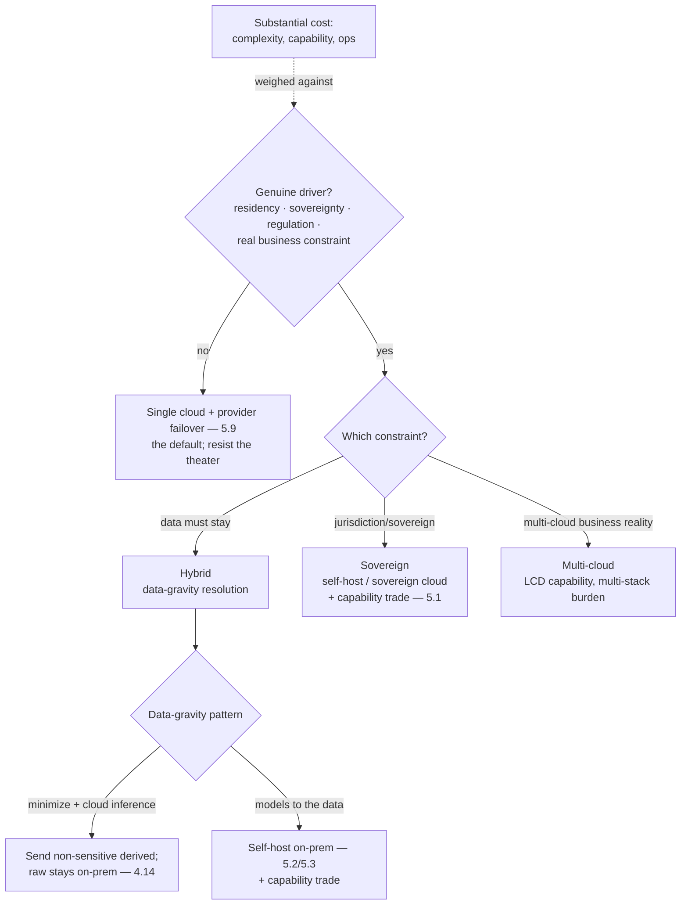

# Chapter 5.11 — Multi-cloud, Hybrid & Sovereignty

| | |
|---|---|
| **Part** | 5 — Cloud, Infrastructure & Platform Engineering |
| **Maturity level** | 4 — Architect |
| **Difficulty** | Advanced |
| **Estimated study time** | 3 hours (reading 90 min, exercise 90 min) |
| **Prerequisites** | [5.1](chapter-01-cloud-fundamentals-ai.md); [5.2](chapter-02-compute-for-ai.md); [4.14](../part-4-enterprise-genai-systems/chapter-14-privacy-compliance-governance.md) |

## Learning Objectives

After this chapter you will be able to:

1. Decide when multi-cloud, hybrid, or sovereign deployment is genuinely warranted for GenAI — and recognize the majority of cases where it isn't.
2. Design for the drivers that force these architectures: data residency and sovereignty, regulatory requirements, and specific business constraints (M&A, existing commitments).
3. Handle the GenAI-specific hybrid reality: keeping data on-premises while accessing cloud inference, or running models where the data must stay.
4. Weigh the substantial costs — complexity, capability trade-offs, operational burden — against the drivers, with the architect's discipline of not paying them without cause.

## Introduction

This is Part 5's Level-4 (Architect) chapter — the one that requires the judgment to weigh drivers against substantial costs rather than the engineering to build a specific thing. It closes Part 5 by addressing the cross-boundary architectures (multi-cloud, hybrid, sovereign) that some enterprises genuinely need and many over-adopt.

Multi-cloud, hybrid, and sovereign architectures are where GenAI meets the hardest infrastructure constraints — the ones law, geopolitics, and enterprise reality impose regardless of technical preference. This chapter's discipline is the 1.4 trade-off analysis at its most consequential: these architectures carry *substantial* costs (complexity, capability trade-offs, operational burden), so they are adopted only when a genuine driver forces them, and the architect's job is as much resisting the unjustified adoption (multi-cloud for resilience theater, sovereignty for imagined requirements) as designing the justified one. The through-line from 5.1's residency-vs-capability trade and 4.14's sovereignty constraint: **these architectures are driven by constraints, not preferences, and the constraints must be real to justify the cost.**

The framing: **cross-boundary architectures are constraint-driven and expensive** — data residency and sovereignty (the law says the data stays here), regulatory requirements (the sector says it runs this way), and specific business constraints (M&A, existing commitments) are the drivers that justify them, and absent a real driver, the single-cloud simplicity (5.1) wins.

## Business Motivation

The business stakes of these architectures cut both ways: getting the driver-assessment wrong in either direction is costly. Under-adopting when a driver is real: a GenAI system that violates data-residency law (4.14) because it used the convenient cloud region the data legally couldn't leave is a compliance breach with penalties and a deployment veto — the sovereignty constraint is a hard requirement where it applies, and ignoring it isn't an option. Over-adopting when no driver exists: a multi-cloud GenAI architecture built for "resilience" or "avoiding lock-in" without a real driver pays the substantial complexity-and-capability cost (the lowest-common-denominator capability across clouds, the operational burden of multiple stacks, the lost platform coherence — 5.10) for benefits that a well-designed single-cloud architecture with provider failover (5.9) would deliver more cheaply — the resilience theater that costs real money for imagined protection. The business case for the architect's discipline is precisely this two-sided risk: the genuine drivers (residency, sovereignty, regulation, real business constraints) are non-negotiable where they apply and must be designed for, while the imagined drivers (resilience theater, lock-in fear without a real exit need) are expensive mistakes to resist — and telling them apart, with the 1.4 rigor, is the Level-4 architect judgment this chapter builds.

## Theory

### The drivers (and non-drivers)

The genuine drivers that justify cross-boundary architectures:

- **Data residency and sovereignty** — the law or contract requires data to stay in a jurisdiction or on controlled infrastructure (4.14's residency, the strongest driver): GDPR-class residency, sector-specific data-localization laws, government/defense sovereignty requirements. This forces the data (and often the inference over it) to a specific location — the driver behind most legitimate hybrid and sovereign GenAI.
- **Regulatory requirements** — the sector mandates specific deployment (regulated industries with infrastructure-control or air-gap requirements); the driver that forces on-premises or sovereign-cloud deployment.
- **Specific business constraints** — M&A (inherited infrastructure across clouds), existing enterprise commitments (a cloud commitment that must be used), or genuine multi-cloud strategy (rare, but real for some large enterprises) — the business-reality drivers.

The common non-drivers (the ones to resist):

- **Resilience theater** — multi-cloud "for resilience" when provider failover (5.9) within or across providers delivers the resilience more cheaply; the multi-cloud complexity isn't the resilience mechanism, the failover is.
- **Lock-in fear without an exit need** — multi-cloud "to avoid lock-in" when there's no real intention or need to exit, paying the multi-cloud cost for an option never exercised; the model-selection reversibility (3.10, via the gateway — 5.4) addresses the GenAI-specific lock-in without full multi-cloud.

### The architectures

- **Multi-cloud** — running across multiple cloud providers; costs the lowest-common-denominator capability (the GenAI services differ across clouds — 5.1's model availability by region/cloud), the operational burden of multiple stacks, and the lost platform coherence (5.10). Justified by genuine multi-cloud drivers (M&A, real strategy), rarely by resilience or lock-in fear.
- **Hybrid** — combining on-premises and cloud; the GenAI-specific pattern: keeping data on-premises (residency/sovereignty) while accessing cloud inference, *or* running models on-premises where the data must stay. The data-gravity problem (the data can't move, so the compute comes to it, or a careful boundary is designed) is the hybrid GenAI core.
- **Sovereign** — deployment meeting sovereignty requirements (data and processing within a jurisdiction or on controlled/sovereign-cloud infrastructure); the strongest constraint, forcing self-hosting (5.2/5.3) or sovereign-cloud offerings, with the capability trade (the sovereign environment may not have the latest models — 5.1's residency-vs-capability, at its sharpest).

### The hybrid GenAI reality

The specific hybrid patterns for GenAI (the data-gravity resolutions):

- **Data on-prem, inference in cloud** — the data stays on-premises (residency), but inference uses cloud models: requires either sending only non-sensitive derived data to the cloud (the minimization of 4.14 — send the redacted/de-identified content, keep the raw on-prem), or a careful boundary that keeps the sensitive data on-prem while using cloud capability on non-sensitive parts. The boundary design is the hybrid craft.
- **Models on-prem, where the data must stay** — self-hosting (5.2/5.3) the models on-premises or in the sovereign environment, so the data never leaves: the full self-hosting burden (5.2/5.3) plus the capability trade (the on-prem/sovereign models may lag the frontier — the eval-gated acceptance of a capable-enough in-boundary model, 3.10, that 5.1's Bellhaven faced).
- **The connectivity and consistency** — the hybrid architecture's networking (5.1), latency (4.12 — the on-prem-to-cloud round trip), and data-consistency realities; the classical hybrid-infrastructure concerns, GenAI-flavored.

## Architecture Perspective

Readings. **The driver-assessment is the architecture decision** — the 1.4 analysis of whether a genuine driver justifies the substantial cost is the Level-4 judgment, and the default (no driver → single cloud with provider failover — 5.9) resists the resilience-theater and lock-in-fear non-drivers that over-adopt these architectures. **Data gravity is the hybrid core** — the data that can't move (residency/sovereignty) forces either the compute to the data (on-prem self-hosting — 5.2/5.3, with the capability trade) or a careful minimization boundary (send non-sensitive derived data to cloud inference, keep raw on-prem — 4.14), and designing that boundary is the hybrid GenAI craft. **And the capability trade is sharpest at the sovereign edge** (5.1's residency-vs-capability, at its extreme) — the sovereign/on-prem environment may lag the frontier models, forcing the eval-gated acceptance of a capable-enough in-boundary model (3.10) — the trade Bellhaven faced (5.1) at its most acute, where the constraint is non-negotiable and the capability is what gives.

## Real-world Example

**Bellhaven Insurance** (1.3, 2.1, 4.14, 5.1) faced the sovereignty constraint in its sharpest form when a new market entry required a jurisdiction with strict data-localization law — customer data (and the inference over it) legally could not leave the country, and the country's available cloud offerings didn't include the frontier models Bellhaven used elsewhere. This was the driver-real case (not resilience theater — a hard legal requirement — 4.14), so the substantial cost was justified, and the architecture was the sovereign/hybrid design the chapter describes. The data-gravity resolution: the sensitive customer data stayed in-country (residency), and the inference ran on self-hosted models (5.2/5.3) in the in-country environment — the models-to-the-data pattern, because the minimization pattern (send derived data out) couldn't satisfy the strict localization (even derived data was restricted). The capability trade was the sharp Level-4 decision (5.1's trade, at its extreme): the frontier model Bellhaven used elsewhere wasn't available in-country, so the sovereign deployment used a capable open-weights model self-hosted (5.2/5.3) — and the eval-gated acceptance (3.10) confirmed it cleared the bar for the in-country use cases (the extraction and assistant tasks — the capable-enough in-boundary model, the constraint non-negotiable and the capability what gave). The cost was real and accepted: the self-hosting burden (5.2/5.3 — the serving, the ops), the capability trade (the in-country systems used a less-capable model), and the operational complexity of a distinct sovereign environment (a separate platform instance — 5.10 — for the sovereign market). Critically, Bellhaven *resisted* the over-adoption elsewhere: the temptation to go multi-cloud "for consistency with the sovereign market" or "for resilience" was declined (the 1.4 discipline — no driver justified it for the other markets, which stayed single-cloud with provider failover — 5.9). The architect's sovereignty note: *"The localization law was a real driver, non-negotiable — so we paid the cost: self-hosted models where the data had to stay, a capable-enough model since the frontier wasn't available in-country, a separate platform instance. But we paid it *only* where the driver was real. The other markets stayed simple. The discipline isn't building the sovereign architecture — it's building it only where the law forces it, and resisting it everywhere else."*

## Hands-on Exercise

**Assess drivers and design (or decline) the architecture.** ~90 minutes. Analysis-primary — this is a Level-4 judgment chapter.

1. **Driver assessment (30 min).** For three scenarios (a: a system in a strict-data-localization jurisdiction; b: a system where the team wants multi-cloud "for resilience"; c: a system inheriting cross-cloud infrastructure from an M&A), assess whether a genuine driver justifies a cross-boundary architecture. For each, state the driver (or non-driver) and the default that applies if no driver.
2. **The justified design (30 min).** For the genuine-driver scenario (a), design the architecture: the data-gravity resolution (minimize-and-cloud-inference vs. models-to-the-data), the capability trade (5.1 — the eval-gated acceptance of an in-boundary model if the frontier isn't available), and the cost you're accepting.
3. **The resisted case (15 min).** For the non-driver scenario (b), write the 1.4 case for *declining* the multi-cloud: what the real need is (resilience), what actually delivers it (provider failover — 5.9), and what the multi-cloud would cost for no marginal benefit.
4. **The M&A reality (15 min).** For scenario (c), design the pragmatic handling of inherited cross-cloud infrastructure: consolidate over time vs. maintain, and how to avoid the inherited complexity becoming permanent without a driver.

**Acceptance criteria:**
- [ ] Driver assessment distinguishes genuine drivers (residency/sovereignty/regulation/business-reality) from non-drivers (resilience theater, lock-in fear)
- [ ] The justified design resolves data gravity and handles the capability trade with eval-gated acceptance
- [ ] The resisted case makes the 1.4 argument for declining, with provider failover as the real resilience mechanism
- [ ] The M&A handling avoids inherited complexity becoming permanent without a driver

## Enterprise Considerations

These architectures are among the most consequential and expensive enterprise GenAI decisions, deeply entangled with legal, geopolitics, and enterprise strategy. **Sovereignty is a legal-and-geopolitical determination** (4.14): the residency and sovereignty requirements come from law, contracts, and geopolitical reality (data-localization laws, sector regulations, government requirements), so the architecture is driven by legal determination — the architect designs to the constraint that legal-and-compliance defines, and the constraint is non-negotiable where it applies (the deployment veto if violated). **The capability trade is a strategic acceptance** (5.1, 6.10): accepting a less-capable in-boundary model (the sovereign/on-prem reality) is a strategic decision with business implications (the sovereign market's systems may be less capable than others), weighed at the business-case level (1.3/6.10) — the sovereignty cost includes the capability cost. **The platform implications are significant** (5.10): a sovereign deployment often means a separate platform instance (the sovereign environment's own gateway, serving, eval — 5.10), multiplying the platform operational burden, which is part of the substantial cost. **And the discipline is strategic** (1.4, board-level): the resist-the-over-adoption discipline (declining multi-cloud without a driver) is a strategic cost-discipline that saves substantial money and complexity, and the genuine-driver architectures are strategic commitments (the sovereign market entry) weighed at the enterprise-strategy level (6.10) — the Level-4 architect's judgment feeding the enterprise's strategic decisions.

## Trade-offs

| Decision | Option A | Option B | Choose A when… | Choose B when… |
|----------|----------|----------|----------------|----------------|
| Cross-boundary architecture | Adopt (multi-cloud/hybrid/sovereign) | Single cloud + provider failover (5.9) | A genuine driver (residency, sovereignty, regulation, business reality) forces it | Default — no genuine driver; resist the theater |
| Hybrid data-gravity | Models to the data (on-prem self-host) | Minimize + cloud inference | Strict localization forbids even derived data leaving | Minimization satisfies the residency (send non-sensitive derived, keep raw on-prem) |
| Capability trade | Accept capable-enough in-boundary model | Hold out for frontier | Sovereignty/residency is non-negotiable and eval-gated in-boundary model clears the bar | The constraint has flexibility (rare) and the capability gap is decisive |
| Multi-cloud for resilience | Provider failover within/across (5.9) | Full multi-cloud | Always — failover delivers the resilience more cheaply | Never for resilience alone; multi-cloud needs a real multi-cloud driver |

## Common Mistakes

1. **Resilience theater** — multi-cloud "for resilience" when provider failover (5.9) delivers it more cheaply; the multi-cloud complexity isn't the resilience mechanism, the failover is, and this is the top over-adoption mistake.
2. **Lock-in fear without an exit need** — multi-cloud "to avoid lock-in" with no real intention to exit, paying the cost for an unexercised option; the gateway's model reversibility (3.10/5.4) addresses GenAI lock-in without full multi-cloud.
3. **Ignoring a real residency driver** — using the convenient cloud region the data legally couldn't leave (4.14), a compliance breach and deployment veto; the residency constraint is non-negotiable where it applies.
4. **Under-designing data gravity** — a hybrid architecture that doesn't resolve the data-can't-move reality (sending sensitive data to cloud inference in violation, or failing to design the minimization boundary); the data gravity is the hybrid core.
5. **Denying the capability trade** — a sovereign/on-prem deployment that pretends it has frontier capability when it doesn't; the eval-gated acceptance of a capable-enough in-boundary model (3.10) is the honest handling.
6. **Over-adopting from one sovereign need** — going multi-cloud/hybrid everywhere because one market required it (Bellhaven's resisted temptation); the driver applies where it applies, not estate-wide.
7. **Inherited complexity becoming permanent** — M&A cross-cloud infrastructure maintained indefinitely without a driver or a consolidation plan; consolidate over time unless a driver justifies keeping it.

## Best Practices

1. **Assess the driver with 1.4 rigor** — genuine drivers (residency, sovereignty, regulation, business reality) justify the cost; non-drivers (resilience theater, lock-in fear) don't; the default is single cloud with provider failover (5.9).
2. **Resist the over-adoption** — decline multi-cloud/hybrid/sovereign where no genuine driver forces it; the resist-discipline saves substantial cost (Bellhaven's other markets stayed simple).
3. **Resolve data gravity explicitly** — for hybrid, design the boundary (minimize-and-cloud-inference or models-to-the-data) that handles the data-can't-move reality (4.14).
4. **Handle the capability trade honestly** — accept the capable-enough in-boundary model where sovereignty forces it, eval-gated (3.10/5.1); don't pretend the constraint is free.
5. **Design to the legal constraint** — the residency/sovereignty requirement is a legal determination (4.14); design to what legal-and-compliance defines, non-negotiable where it applies.
6. **Account for the platform multiplication** — the sovereign/separate environment is a separate platform instance (5.10), part of the substantial cost.
7. **Treat it as a strategic decision** — the genuine-driver architectures and the resist-discipline are strategic (6.10), weighed at the enterprise level.

## Architecture Checklist

For any cross-boundary GenAI architecture decision:

- [ ] The driver assessed with 1.4 rigor: genuine (residency/sovereignty/regulation/business reality) vs. non-driver (resilience theater, lock-in fear)
- [ ] The default (single cloud + provider failover — 5.9) applied where no genuine driver exists
- [ ] For hybrid: the data-gravity resolution designed (minimize-and-cloud-inference or models-to-the-data — 4.14)
- [ ] For sovereign/on-prem: the self-hosting (5.2/5.3) and the capability trade (eval-gated in-boundary model — 3.10/5.1) handled honestly
- [ ] The substantial cost (complexity, capability, ops, platform multiplication — 5.10) weighed against the driver
- [ ] The architecture confined to where the driver applies (not over-adopted estate-wide)
- [ ] The residency/sovereignty constraint designed to as a legal determination (4.14), non-negotiable where it applies
- [ ] Treated as a strategic decision at the enterprise level (6.10)

## Interview Questions

1. *"When should a company adopt a multi-cloud GenAI architecture?"* — Strong answers resist the common non-drivers (resilience theater — provider failover delivers it more cheaply; lock-in fear without an exit need — the gateway addresses GenAI lock-in), require a genuine multi-cloud driver (M&A, real strategy), and default to single cloud with failover — the resist-discipline is the answer.
2. *"How do you architect a GenAI system where data legally cannot leave the country?"* — Strong answers give the data-gravity resolution: models-to-the-data (self-host in-country — 5.2/5.3) if even derived data can't leave, or minimize-and-cloud-inference (send non-sensitive derived, keep raw on-prem — 4.14) if minimization satisfies it, with the capability trade (eval-gated in-boundary model — 3.10/5.1) handled honestly — Bellhaven's shape.
3. *"A team wants multi-cloud for resilience. How do you respond?"* — Strong answers make the 1.4 case for declining: the real need is resilience, what delivers it is provider failover (5.9 — within or across providers, without full multi-cloud complexity), and the multi-cloud would cost the LCD capability and multi-stack burden for no marginal resilience benefit — resilience theater resisted.
4. *"What's the hardest trade-off in sovereign GenAI deployment?"* — Strong answers name the capability trade (5.1, at its extreme): the sovereign/on-prem environment may lag the frontier models, forcing the eval-gated acceptance of a capable-enough in-boundary model (3.10) — the constraint non-negotiable and the capability what gives, a strategic acceptance weighed at the business level (6.10).

## Further Reading

- Your cloud providers' sovereign-cloud and data-residency documentation (official docs) — the sovereign-cloud offerings and residency capabilities that the genuine-driver architectures use.
- Your jurisdiction's data-localization and sovereignty regulations (official legal sources) — the legal determinations that drive these architectures (4.14's regulatory companion).
- Open-weights model documentation (the capable open models' docs) — the in-boundary self-hosting option for sovereign deployment where frontier models aren't available.
- 5.1 Cloud Fundamentals (the residency-vs-capability trade), 5.2/5.3 (self-hosting), 4.14 (residency and sovereignty) — the chapters this Level-4 chapter synthesizes into the cross-boundary judgment.

## Summary

- Cross-boundary architectures (multi-cloud, hybrid, sovereign) are **constraint-driven and expensive** — adopted only when a genuine driver (residency, sovereignty, regulation, business reality) justifies the substantial cost, and the Level-4 discipline is as much *resisting the unjustified adoption* (resilience theater, lock-in fear) as designing the justified one.
- The **default is single cloud with provider failover** (5.9) — which delivers the resilience the resilience-theater multi-cloud claims, more cheaply.
- **Data gravity is the hybrid core**: the data that can't move forces either models-to-the-data (on-prem self-hosting — 5.2/5.3) or a minimize-and-cloud-inference boundary (4.14), designed explicitly.
- The **capability trade is sharpest at the sovereign edge** (5.1's residency-vs-capability, extreme): the in-boundary environment may lag the frontier, forcing the eval-gated acceptance of a capable-enough model (3.10) — the constraint non-negotiable and the capability what gives.
- These are **strategic decisions** (6.10) — the genuine-driver architectures are strategic commitments, and the resist-discipline is a strategic cost-discipline; both weighed at the enterprise level. This closes Part 5 — the full infrastructure stack, from cloud fundamentals to the sovereign edge. **Part 6** zooms out to the enterprise architecture that governs the whole GenAI portfolio.

---

**Previous:** [Chapter 5.10 — Infrastructure as Code & Platform Engineering](chapter-10-iac-platform-engineering.md) · **Next:** [Part 6 — Enterprise Architecture](../part-6-enterprise-architecture/) · **Related:** [5.1 Cloud Architecture Fundamentals](chapter-01-cloud-fundamentals-ai.md), [4.14 Privacy, Compliance & Governance](../part-4-enterprise-genai-systems/chapter-14-privacy-compliance-governance.md), [6.10 TCO & the Business Case](../part-6-enterprise-architecture/chapter-10-tco-business-case.md)
