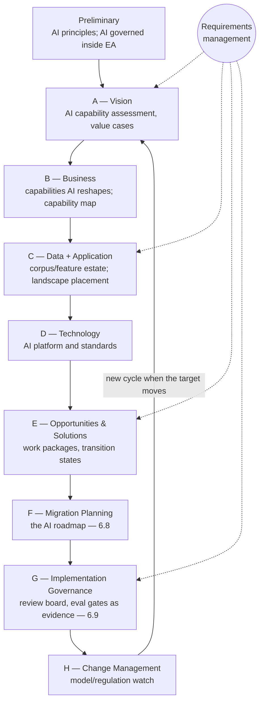

# Chapter 6.1 — Enterprise Architecture Frameworks in Practice

| | |
|---|---|
| **Part** | 6 — Enterprise Architecture |
| **Maturity level** | 3 — Engineer |
| **Difficulty** | Advanced |
| **Estimated study time** | 2.5 hours (reading 40 min, exercise ~2 h) |
| **Prerequisites** | [1.1](../part-1-professional-foundation/chapter-01-from-engineer-to-architect.md); [1.3](../part-1-professional-foundation/chapter-03-business-understanding.md); [1.4](../part-1-professional-foundation/chapter-04-tradeoff-analysis.md) |

## Learning Objectives

After this chapter you will be able to:

1. Walk the TOGAF ADM — Preliminary Phase plus Phases A–H — at practitioner level: what each phase produces, and where AI-specific work (capability assessment, target architectures, the roadmap, implementation governance) lands in the cycle.
2. Map an AI portfolio across the four architecture domains — business, data, application, technology — and build the AI-annotated capability map that anchors the portfolio in business value.
3. Describe the Zachman Framework's interrogatives-by-perspectives grid and judge honestly when its rigor pays and when it is ceremony; know where ArchiMate fits and when to defer it.
4. Engage a real EA function from inside its own vocabulary: route AI funding and review through the machinery it already runs, and shape the target state where AI needs new standards.

## Introduction

Part 6 changes altitude: from the systems of Parts 3–5 to the enterprise they live in — portfolio, governance, integration, business case. This chapter is enterprise architecture itself, and its stance is the one the rest of Part 6 leans on: use the framework **concepts without the ceremony**. But that advice is only usable by someone who knows what the ceremony contains. "Skip the ADM's documentation weight" means nothing to an architect who cannot name the ADM's phases, and an AI architect who cannot say which phase an AI roadmap belongs to will be told — by an EA function that can. So this chapter teaches the frameworks properly: the TOGAF ADM phase by phase, the four architecture domains with a worked AI-portfolio mapping, Zachman's grid and its honest use, and ArchiMate's place — and *then* cashes the concepts-without-ceremony stance by naming exactly which artifacts and disciplines to keep when you strip the process down.

## Business Motivation

Framework literacy has a direct commercial payoff, and it runs through other people's machinery. In most large enterprises, significant technology investment is already funneled through an EA-shaped process — value cases before funding, architecture review before build, a standards catalog that procurement enforces. An AI program that can locate itself in that machinery ("our value cases are Phase A work; the roadmap you're asking for is Phase E–F; here is the Phase G evidence pack") gets funded and reviewed at the speed of the existing process. One that cannot gets a choice of two failure modes: a parallel AI track with its own funding and review path, which re-litigates every settled decision and collects enemies in the EA function; or submission to a process it cannot negotiate with, because negotiation requires the vocabulary. The opposite failure is just as expensive — Bellhaven's $700K lesson below is what full-ceremony adoption costs when the estate changes faster than its documentation. The literacy that avoids both costs a few evenings: the [TOGAF](https://www.opengroup.org/togaf) core is a free read, and this chapter is the AI-specific map of it.

## Theory

### The TOGAF ADM — the shape of an enterprise transformation

TOGAF (The Open Group Architecture Framework) is the most widely adopted EA framework, and its core is the **Architecture Development Method (ADM)**: a cycle of phases that takes an organization from "why change" through "what the target looks like" to "how we migrate" and "how we govern the build." Two facts about the ADM that its reputation hides. First, it is explicitly **iterative** — the standard itself says to cycle at whatever scope fits, and running one giant waterfall lap around the circle is a misreading, not a requirement. Second, **Requirements Management sits at the center**, feeding every phase — requirements are expected to change mid-cycle, which matters for AI portfolios whose requirements churn faster than anything else in the estate.

The phase walk, with the AI-specific work placed in each phase — this table is the chapter's working artifact, and the answer to the interview question "where does an AI roadmap live?" is in rows E and F:

| ADM phase | What it produces | Where the AI work lands |
|---|---|---|
| **Preliminary** | Architecture principles, tailored method, governance structures | AI principles adopted as *architecture* principles (the responsible-AI posture of [2.8](../part-2-artificial-intelligence/chapter-08-responsible-ai.md) with enforcement teeth); the decision that AI is governed inside the EA machinery, not beside it |
| **A — Architecture Vision** | Scoped vision, stakeholder map, business value proposition, Statement of Architecture Work | **AI capability assessment and value cases**: where AI could move the business, first-cut capability map, executive approval to proceed — [1.3](../part-1-professional-foundation/chapter-03-business-understanding.md)'s value analysis in ADM clothing |
| **B — Business Architecture** | Baseline and target business architecture, gap analysis | Which capabilities AI reshapes and how the processes change around it — human-in-the-loop points, redesigned handoffs; the finished AI-annotated capability map |
| **C — Information Systems Architectures** (data + application) | Target data architecture and target application architecture | The corpus and feature estate ([5.5](../part-5-cloud-infrastructure-platform/chapter-05-data-architecture.md)); where each AI system sits in the application landscape — extend an existing application or stand up a new one ([6.4](chapter-04-enterprise-integration.md)) |
| **D — Technology Architecture** | Target technology architecture, technology standards | The AI platform ([5.10](../part-5-cloud-infrastructure-platform/chapter-10-iac-platform-engineering.md)), model and vendor choices as *standards*, the inference estate and cloud posture ([5.1](../part-5-cloud-infrastructure-platform/chapter-01-cloud-fundamentals-ai.md)) |
| **E — Opportunities & Solutions** | Work packages, **transition architectures**, build/buy/reuse decisions | The AI portfolio shaped into sequenced work packages: quick wins vs. platform foundations, consolidation of duplicate builds, vendor-vs-build calls |
| **F — Migration Planning** | The costed, sequenced Implementation and Migration Plan | **The AI roadmap** ([6.8](chapter-08-legacy-modernization-ai-adoption.md)) — this, with E, is its ADM home: not a wish list but priced work packages with transition states between here and the target |
| **G — Implementation Governance** | Architecture contracts, compliance reviews during build | The AI review board ([6.9](chapter-09-architecture-governance.md)); [eval](../../GLOSSARY.md) gates and model-risk evidence ([6.11](chapter-11-model-risk-management.md)) presented as compliance artifacts, not parallel paperwork |
| **H — Architecture Change Management** | Ongoing change monitoring; the decision to start a new cycle | The watch list AI makes mandatory: new model classes, regulation ([4.14](../part-4-enterprise-genai-systems/chapter-14-privacy-compliance-governance.md)), vendor moves — any of which can reopen the target state years early |
| **Requirements Management** (center) | Continuously reconciled requirements across all phases | Where AI's fast-moving requirements meet the estate's slow ones without either pretending the other doesn't exist |

Read the phase order as a discipline even when you produce none of the formal deliverables: **value before design (A before B–D), design before plan (B–D before E–F), plan before build, govern what's built (G), watch for change (H).** Most AI-program failures in Part 6's scope are phase-order violations wearing other names — a platform built before any value case is D-before-A; forty pilots with no sequencing is a portfolio that never reached E.

### The four architecture domains, with the AI portfolio mapped

TOGAF's Phases B–D organize the enterprise into four **architecture domains**: **business** (capabilities, processes, value streams), **data** (the information estate), **application** (the application landscape and its interfaces), and **technology** (the infrastructure everything runs on). The domains are a completeness check: an initiative described in only one of them is under-designed. AI initiatives fail this check in a characteristic way — described entirely in the technology domain ("we're deploying an LLM") with the other three left implicit. The worked mapping, for four Bellhaven Insurance initiatives:

| Initiative | Business domain | Data domain | Application domain | Technology domain |
|---|---|---|---|---|
| Submission intake extraction | Underwrite risk — submission processing step redesigned; underwriter reviews, no longer re-keys | Broker document corpus; extraction ground-truth set | New intake service feeding the policy admin system's existing API | LLM extraction on the shared AI platform |
| Customer service assistant | Service policies — deflection with escalation paths | Policy and product knowledge corpus, curated and versioned | Assistant embedded in the contact-center desktop, not a new destination | RAG stack on the platform |
| Renewal pricing advisor | Retain customers — renewal conversation, adviser-mediated | Claims and pricing history via the feature platform | Advisory panel inside the existing renewal workbench | Classical scoring, batch |
| Claims triage scorer | Handle claims — queue routing changes adjuster workflow | Claims history; adjuster outcomes as labels | Routing service inside the claims system | Classical model, nightly batch |

Every row touches all four columns, and the columns are where the cross-domain questions surface: the assistant's *data*-domain row is where corpus governance lives; the triage scorer's *business*-domain row is where the workflow change — usually the hard part — stops being an afterthought.

### The capability map — the business-architecture artifact you keep

A **business capability map** models what the business *does* — "underwrite risk," "handle claims" — independent of org structure or systems. That independence is the point: departments reorganize and applications get replaced, but the enterprise still underwrites risk, which makes the capability map the most stable surface to pin an AI portfolio to. The **AI-annotated capability map** adds, per capability: where AI creates leverage, the KPI it would move, and the portfolio status — which makes gaps (capability with AI leverage, no initiative) and collisions (two initiatives, one capability) visible in a single view. Bellhaven's, abbreviated:

| Capability | AI leverage | KPI it moves | Portfolio status |
|---|---|---|---|
| Acquire customers | Lead scoring; marketing content drafting | Cost per acquired policy | **Gap** — scored, unfunded |
| Underwrite risk | Submission extraction; risk summarization | Quote turnaround time | Submission intake — live |
| Price & quote | Pricing model refresh | Loss ratio | **Gap** — classical candidate |
| Service policies | Assistant; correspondence drafting | Cost per contact | Assistant — pilot |
| Handle claims | Triage scoring; document extraction | Claims cycle time | Triage scorer — build |
| Retain customers | Renewal advisor | Retention rate | Renewal advisor — pilot |
| Manage distribution | Broker portal Q&A | Broker satisfaction | **Gap** — deferred |

This is the executive communication artifact ([1.5](../part-1-professional-foundation/chapter-05-communicating-architecture.md)): it presents the AI strategy in the business's own language, and the gap rows are next year's Phase A candidates.

### Zachman — the grid, and when its rigor pays

The **Zachman Framework** predates TOGAF and is a different kind of thing: not a method but an **ontology** — a classification grid with the six **interrogatives** as columns (*what* — data; *how* — function; *where* — network; *who* — people; *when* — time; *why* — motivation) and six **perspectives** as rows, descending from the executive's contextual view through business management, architect, engineer, and technician to the functioning enterprise itself. Each of the 36 cells is a distinct description of the enterprise; the grid's claim is that a complete architecture has an answer in every cell, at every altitude. It prescribes no phases, no sequence, no deliverables — which is both its limitation (Zachman alone cannot run a transformation; there is no equivalent of Phases E–F) and its use.

The honest guidance: **the grid pays as a completeness probe, and costs as a work plan.** Filling 36 cells is ceremony almost everywhere — documentation produced because the grid has a slot, not because a decision needs it. But *interrogating* the grid against a material system finds real holes fast, and for AI systems the holes cluster predictably: the **who** column (who is accountable when the model decides? who approves an agent's action?) and the **why** column (what business rule justifies this decision, and can we produce it for a regulator?) are the cells AI portfolios most often leave empty — the same gaps [6.11](chapter-11-model-risk-management.md) formalizes as ownership and conceptual soundness. Use Zachman as a checklist for a few consequential rows and columns; reach for the full grid only where examination or due diligence genuinely demands cell-by-cell evidence.

### ArchiMate, briefly

**ArchiMate** is The Open Group's modeling *language* for enterprise architecture — a standardized notation whose layers (business, application, technology, plus strategy, motivation, and implementation extensions) mirror the domains above, letting one model express a capability realized by an application service running on a platform. It answers "how do I draw this consistently," not "what should I build" — the notation-and-views territory of [6.2](chapter-02-architecture-views-documentation.md), which covers where it fits in a documentation practice. The placement judgment for now: model in ArchiMate if the EA function already reads it; if not, C4-style diagrams and the tables above carry the same content, and adopting a notation before it has an audience is tooling ceremony.

### Concepts without ceremony — cashed

Stripped of the process weight, what survives is a **minimum artifact set** and a **phase discipline**. Keep four living artifacts: the *principles* (Preliminary), the *AI-annotated capability map* with its value cases (A/B), the *application landscape view* (C — the one baseline worth maintaining, as Bellhaven learned expensively), and the *roadmap with transition architectures* (E–F). Keep two disciplines: the phase order as a checklist, and Phase G/H as standing functions — review with evidence, watch for change. Skip: exhaustive baseline documentation, framework certification as a proxy for competence, and repository tooling ahead of readership. That is the whole stance — and note it required naming the phases to state.

## Architecture Perspective

Three readings. **The cycle is the map of Part 6**: A–B is this chapter's capability work, C–D spans [6.4](chapter-04-enterprise-integration.md)–[6.7](chapter-07-data-governance-knowledge.md)'s integration and estate chapters, E–F is [6.8](chapter-08-legacy-modernization-ai-adoption.md)'s adoption strategy, G is [6.9](chapter-09-architecture-governance.md)'s governance — the part's structure is an ADM lap whether or not an enterprise uses the name. **The H-to-A arrow is shorter for AI than for anything else in the estate** — a new model class can invalidate a Phase D standard in a quarter — so the change-management function AI portfolios need is a standing watch, not an annual review. And **the center is where the speed mismatch is managed**: AI requirements churning against a slow estate is not a defect to engineer away but the permanent condition Requirements Management exists to reconcile.

## Real-world Example

**Bellhaven Insurance** reached enterprise architecture the expensive way. Its first attempt was full-ceremony adoption: the CIO, alarmed that GenAI pilots were sprouting without coordination, sponsored a consultancy-led TOGAF program — eight architects into certification, and a complete baseline documentation of all four domains before any target-state work would begin. Nine months and roughly $700K later, the program had produced a 300-page baseline that was outdated in the sections written first, and the two pilots that had motivated it were still unreviewed and unfunded — queued "until the baseline completes." The new chief architect, Ana Whitfield, made the call that cost her: she killed the program, wrote off most of the engagement, and told the CIO to his face that the baseline would *never* complete, because the estate changed faster than it could be documented. She spent her first two quarters of political capital on that sentence. She kept exactly two artifacts from the wreckage: the half-finished capability map and the principles.

The restart was ADM-shaped without ADM paperwork: a two-week Phase A pass — value cases and capability assessment — that got both pilots funded within the month; target-state *deltas* per domain instead of baselines; a one-page E/F roadmap with two transition states; Phase G through the review board that already existed. But the over-correction had its own price. Having skipped the application-landscape baseline entirely, the Phase E work missed that claims and underwriting were each building their own document-extraction service — discovered only when both landed in the platform team's intake queue, a full team-quarter written off in consolidation. Ana's fix was not more ceremony; it was one page — a landscape view added to the minimum set, with an owner. Bellhaven's EA practice today maintains four artifacts: principles, capability map, landscape view, roadmap. The failed program had produced forty.

## Hands-on Exercise

**Build the EA placement kit for an AI portfolio.** ~2 hours, analysis-primary, for an enterprise you know or a [case-study](../../case-studies/README.md) company.

1. **Capability map (30 min).** Model 8–12 capabilities (what the business does, not its org chart). Annotate each: AI leverage, the KPI it would move, portfolio status (initiative or gap).
2. **Domain mapping (25 min).** For three initiatives (real or from your map), fill a four-domain row each — business, data, application, technology — in the format of the Bellhaven table.
3. **ADM placement drill (30 min).** Place each of these work items in its ADM phase, naming the artifact it belongs in: (a) an AI value case awaiting executive sign-off; (b) the corpus data architecture for a RAG system; (c) a build-vs-buy call on an extraction vendor; (d) a costed 18-month sequence of AI work packages; (e) an eval-gate report presented to the review board mid-build; (f) a watch item on a newly released model class that might obsolete a platform choice.
4. **Roadmap page (35 min).** Write the one-page E/F roadmap for your portfolio: work packages, two transition architectures (what the estate looks like at each intermediate point and who operates it), rough costs.

**Acceptance criteria:**
- [ ] Capability map has ≥8 capabilities, none named after a department, each annotated with leverage and KPI; ≥2 gaps identified
- [ ] Domain mapping fills all four domains for every initiative — no technology-only rows
- [ ] All six drill items placed correctly (key: A, C, E, F, G, H) with a named artifact each
- [ ] Roadmap shows transition states an operator could run, not just a project list

## Enterprise Considerations

EA maturity varies more than any other function the AI architect meets, and the engagement strategy follows it. In a **formal TOGAF shop** (common in banking, insurance, government), fluency is the price of admission: submit Phase A-shaped value cases, expect Phase G contracts, and negotiate standards in Phase D vocabulary — the machinery is slower than the AI program wants, and the productive response is feeding it well-formed inputs, not routing around it. In a **nascent-EA enterprise**, the AI architect often becomes the de facto EA function for the AI estate — which means *bringing* the minimum artifact set, because nobody else will, and resisting the temptation to install ceremony the organization cannot sustain. Two constituencies deserve specific handling: **EA repository tools** (the enterprise may mandate one) are worth feeding with the four living artifacts and nothing speculative, since stale repository content is worse than absence; and **regulated-industry examinations** occasionally ask Zachman-shaped completeness questions — who owns this decision, where is its justification — for which the who/why probe above, done in advance on material systems, is cheap insurance ([6.11](chapter-11-model-risk-management.md) turns that probe into a regime).

## Trade-offs

| Decision | Option A | Option B | Choose A when… | Choose B when… |
|----------|----------|----------|----------------|----------------|
| ADM engagement | Per-portfolio lightweight pass (days per phase) | Full-cycle enterprise iteration | Most AI programs — scope is one portfolio, speed matters | Enterprise-wide transformation with executive sponsorship and a standing EA function to run it |
| Capability map depth | Level 1–2 (8–15 capabilities) | Level 3+ decomposition | Portfolio placement and executive communication — this chapter's uses | An initiative needs process-level redesign inside one capability (that capability only) |
| Baseline documentation | Target-state deltas + landscape view only | Full four-domain baseline first | Estate changes faster than documentation — the AI default | The baseline itself is the deliverable: M&A due diligence, regulatory examination |
| Zachman use | Targeted probe of a few cells (who/why on material systems) | Full-grid completeness audit | Standing hygiene — cheap, finds AI's characteristic gaps | Examination or due-diligence contexts that demand cell-by-cell evidence |

## Common Mistakes

1. **Phases B–D before Phase A** — a target architecture (often a platform) designed and part-built with no approved value case; it dies at the first budget round, and the post-mortem calls it "the business wasn't ready" when it was a phase-order violation.
2. **The ADM as one waterfall lap** — Bellhaven's nine-month baseline is the canonical form; the method is iterative by its own text, and the giant-lap reading is what earned EA its reputation.
3. **The capability map drawn as the org chart** — capabilities named after departments; the next reorg invalidates the map, and turf disputes over box ownership replace value analysis. Capabilities describe what the business does, which survives both.
4. **A roadmap with no transition architectures** — a sequenced project list that never designs the in-between states, so mid-migration the enterprise runs an architecture nobody designed, and operations inherits the gap.
5. **Notation before audience** — ArchiMate tooling and repository licenses adopted before anyone reads models; the repository becomes write-only within a year, and the sunk cost then argues for more ceremony to justify it.
6. **The special AI track** — AI funding and review routed outside the EA machinery because "AI moves too fast for it"; every release then becomes a Phase G exception, and the exception queue is slower than the process it bypassed.

## Best Practices

1. **Learn the ADM well enough to place any piece of work in it** — "that's Phase A work; the roadmap comes after" is a scoping instrument, not trivia.
2. **Keep the minimum artifact set living, with owners** — principles, AI-annotated capability map, landscape view, roadmap with transition states; four artifacts, current, beats forty, stale.
3. **Anchor every initiative in a capability and a KPI before any domain design** — the A-before-B–D order enforced at initiative grain.
4. **Write target-state deltas, not encyclopedic baselines** — with the one exception Bellhaven paid for: maintain the application landscape view, because duplicate builds hide in its absence.
5. **Run the who/why probe on material AI systems** — Zachman's interrogatives applied where AI is weakest: accountability and justification cells, before an examiner asks.
6. **Route AI funding and review through the existing EA machinery, and shape it where AI needs new standards** — the shape-the-EA move: conform to what applies, contribute the AI-specific standards ([5.10](../part-5-cloud-infrastructure-platform/chapter-10-iac-platform-engineering.md)'s platform, [6.9](chapter-09-architecture-governance.md)'s review criteria) rather than forking the process.
7. **Write the Phase H watch list down** — the model classes, regulations, and vendor moves that would reopen your target state, reviewed on a cadence; for AI estates the H-to-A loop is the shortest in the enterprise.

## Architecture Checklist

Before presenting an AI portfolio at the enterprise level:

- [ ] Every initiative names its business capability and the KPI it moves (Phase A/B anchoring)
- [ ] Every initiative has a four-domain mapping — business, data, application, technology — with no empty columns
- [ ] The AI-annotated capability map exists, is org-chart-free, and shows gaps as explicitly as initiatives
- [ ] The roadmap is E/F-grade: costed work packages and transition architectures, not a wish list
- [ ] Funding and review run through the EA machinery; any exception is explicit and temporary
- [ ] The application landscape view exists and is owned — duplicate-build risk is visible
- [ ] Who/why cells answered for material systems: decision ownership and business justification producible on demand
- [ ] The Phase H watch list is written, with triggers that would reopen the target state
- [ ] Notation matches audience: ArchiMate where the EA function reads it, simpler views where it doesn't ([6.2](chapter-02-architecture-views-documentation.md))

## Interview Questions

1. *"Which ADM phase does an AI roadmap live in, and what must exist before it?"* — Strong answers place it in **E–F** (shaped into work packages and transition architectures in E, costed and sequenced in F) and name the prerequisites in phase order: Phase A value cases and vision, B–D target architectures across the four domains. A roadmap without the A-through-D work behind it is a project list wearing the name.
2. *"Our EA function runs formal TOGAF and your AI program finds it slow. What do you do?"* — Strong answers refuse the parallel-track bait: feed the machinery well-formed inputs (A-shaped value cases, G-ready evidence packs), negotiate cadence rather than exemption, and shape the standards where AI genuinely needs new ones — noting that the exception queue of a bypassed process is slower than the process.
3. *"TOGAF versus Zachman — what is each actually for?"* — Strong answers get the category difference right: TOGAF's ADM is a *method* (phases, deliverables, a transformation engine), Zachman is an *ontology* (interrogatives × perspectives, a completeness schema with no process); use the ADM's order to run change and Zachman's grid to probe material systems for empty cells — for AI, characteristically who and why.
4. *"Walk me from forty scattered AI pilots to a strategic portfolio."* — Strong answers run the cycle: capability map with AI annotation (value anchoring and gap discovery), four-domain mapping per initiative (kills technology-only thinking and finds duplicates), target-state deltas, an E/F roadmap with transition states, and G/H as standing functions — Bellhaven's arc, minus its $700K first draft.

## Further Reading

- **The TOGAF Standard** (The Open Group) — freely readable online; Part II (the ADM) is the load-bearing read, and it is shorter than its reputation. Read the phase chapters' "Objectives" and "Outputs" sections and skip the templates.
- **John A. Zachman, "A Framework for Information Systems Architecture"** (IBM Systems Journal, 1987) — the original grid paper; short, and clearer about the ontology-not-method point than most secondhand accounts.
- **The ArchiMate Specification** (The Open Group) — skim the layer structure now; return with [6.2](chapter-02-architecture-views-documentation.md) if your enterprise models in it.
- **Ross, Weill & Robertson, *Enterprise Architecture as Strategy*** — the case that EA's product is a foundation for execution, not documentation; the best antidote to repository-first practice.
- **Gregor Hohpe, *The Software Architect Elevator*** — the altitude-spanning role this chapter's literacy serves, from Part 1's reading list and worth re-reading at Part 6's altitude.

## Summary

- EA framework literacy is the price of admission to the enterprise conversation: the **TOGAF ADM** runs value → design → plan → build-governance → change-watch (Preliminary, A–H, Requirements Management at center), and AI work has specific homes in it — capability assessment and value cases in **A**, target architectures across the domains in **B–D**, the AI roadmap in **E–F**, review evidence in **G**, the model-and-regulation watch in **H**.
- The **four architecture domains** — business, data, application, technology — are a completeness check AI initiatives characteristically fail by living only in the technology column; the four-domain mapping is where workflow, corpus, and landscape questions surface.
- The **AI-annotated capability map** anchors the portfolio in business value, exposes gaps and collisions, and speaks the executive's language; capabilities outlive org charts, which is why the map is pinned to them.
- **Zachman** is an ontology, not a method: full-grid completion is ceremony, but the who/why probe on material AI systems finds the accountability and justification gaps that examiners and [6.11](chapter-11-model-risk-management.md) both hunt. **ArchiMate** is notation — adopt it where it has readers ([6.2](chapter-02-architecture-views-documentation.md)).
- Concepts without ceremony, cashed: four living artifacts (principles, capability map, landscape view, roadmap with transition states), the phase order as discipline, and G/H as standing functions — Bellhaven's forty-artifact program failed where its four-artifact practice works.

---

**Previous:** [Part 6 index](README.md) · **Next:** [Chapter 6.2 — Architecture Views & Documentation](chapter-02-architecture-views-documentation.md) · **Related:** [1.3 Business Understanding](../part-1-professional-foundation/chapter-03-business-understanding.md), [6.8 Legacy Modernization & AI Adoption Strategy](chapter-08-legacy-modernization-ai-adoption.md), [6.9 Architecture Governance](chapter-09-architecture-governance.md)
