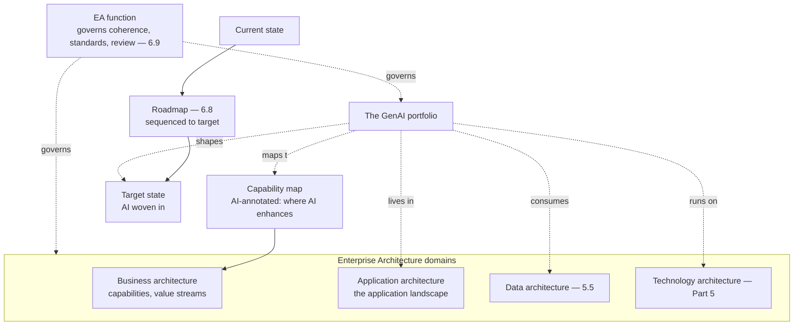

# Chapter 6.1 — Enterprise Architecture Frameworks in Practice

| | |
|---|---|
| **Part** | 6 — Enterprise Architecture |
| **Maturity level** | 3 — Engineer |
| **Difficulty** | Advanced |
| **Estimated study time** | 3 hours (reading 90 min, exercise 90 min) |
| **Prerequisites** | [1.1](../part-1-professional-foundation/chapter-01-from-engineer-to-architect.md); [1.4](../part-1-professional-foundation/chapter-04-tradeoff-analysis.md) |

## Learning Objectives

After this chapter you will be able to:

1. Use EA framework *concepts* — viewpoints, capability maps, current/target-state, roadmaps — without the ceremony that gives frameworks a bad name.
2. Place GenAI initiatives in the enterprise architecture context: how the AI portfolio relates to business capabilities, the application landscape, and the technology estate.
3. Build a capability-based view of where GenAI creates value, connecting AI initiatives to the business architecture rather than treating them as isolated tech projects.
4. Navigate the EA function: what it governs, how AI initiatives interact with it, and how to work with (not around) it.

## Introduction

Part 6 zooms out from the systems of Parts 3–5 to the *enterprise* they live in — the portfolio, the governance, the integration, the business case. This first chapter is enterprise architecture itself: the discipline of aligning technology to business strategy across the whole organization, which GenAI initiatives must operate within (they don't get a pass from the EA function's governance, integration standards, or portfolio logic). The chapter's stance is pragmatic (2.1's timeless-over-tools, EA edition): EA frameworks (TOGAF, Zachman, and their kin) have a reputation for heavyweight ceremony, but their *concepts* — viewpoints, capability maps, current-and-target-state, roadmaps — are genuinely useful for placing GenAI in the enterprise, and the architect's job is using the concepts without the ceremony.

The framing: **GenAI is a portfolio within the enterprise architecture, not a set of isolated projects** — the AI initiatives relate to business capabilities, the application landscape, and the technology estate, and reasoning about them as a portfolio (where does AI create value across the business? how does it fit the target-state architecture?) is what elevates the architect from system-builder to enterprise-shaper.

## Business Motivation

EA-level thinking is what turns a scattered collection of AI projects into a coherent AI strategy — the difference between an enterprise with forty disconnected GenAI pilots and one with a capability-aligned AI portfolio. Without it: AI initiatives are isolated tech projects, chosen by whoever had the enthusiasm (1.3's orphaned initiatives), duplicating effort (the sprawl anti-pattern of Parts 4–5, at the portfolio level), and disconnected from where the business actually creates value (1.3's KPI trees, un-anchored). With it: the AI portfolio is mapped to business capabilities (where does AI move the value chain?), sequenced by a roadmap (current-to-target-state), and governed as a portfolio (6.9) — the coherence that makes AI a strategic capability rather than a pile of experiments. The business case for EA-level thinking is the portfolio coherence: an enterprise that knows where AI creates value across its business capabilities, how the initiatives fit together, and how they move toward a target-state invests in AI strategically, while one without EA thinking invests in AI opportunistically and wonders why the pilots don't add up to a transformation. The architect who can do EA-level thinking (place AI in the business architecture, build the capability view, work with the EA function) operates at the strategic level where the biggest AI decisions are made.

## Theory

### EA framework concepts (without the ceremony)

The genuinely useful concepts, stripped of the heavyweight process:

- **Viewpoints / architecture domains** — EA distinguishes business architecture (capabilities, processes, value streams), application architecture (the application landscape), data architecture (the data estate — 5.5), and technology architecture (the infrastructure — Part 5). The concept's value: reasoning about AI across these domains (the AI *capability* it enables, the *applications* it lives in, the *data* it consumes, the *technology* it runs on) rather than only the technology, which connects AI to business value (1.3).
- **Capability maps** — a model of what the business *does* (its capabilities — "underwrite risk," "service claims," "acquire customers") independent of how; the concept's value for AI: mapping where GenAI enhances capabilities (which capabilities does AI make faster, better, cheaper?) is the capability-based value view that anchors AI in the business (1.3's value-chain position, formalized).
- **Current-state and target-state** — the architecture as-is vs. the desired future; the concept's value for AI: the target-state includes the AI-enhanced future (what the architecture looks like with AI woven in), and the gap between current and target is the transformation the roadmap sequences.
- **Roadmaps** — the sequenced path from current to target-state; the concept's value for AI: the AI adoption roadmap (6.8) sequences the initiatives toward the target-state, which is what makes AI adoption strategic (sequenced) rather than opportunistic (scattered).

The ceremony to skip: the heavyweight documentation, the multi-year framework certification, the process-for-process's-sake — the concepts are useful, the ceremony often isn't, and the pragmatic architect uses the former without the latter (adapting to the enterprise's actual EA maturity — 5.1's conform).

### The GenAI portfolio in the enterprise architecture

Placing AI in the EA context:

- **AI as capability enhancement** — GenAI initiatives map to the business capabilities they enhance (the capability map, AI-annotated: which capabilities does AI touch, and how does it move them — 1.3's KPI trees at the capability level); this is the value view that connects the AI portfolio to the business.
- **AI in the application landscape** — the AI systems relate to the existing application landscape (they enhance existing applications, integrate with them — 6.4, or are new applications); the AI portfolio is part of the application architecture, not separate from it.
- **AI on the technology estate** — the AI infrastructure (Part 5) is part of the technology architecture (the platform — 5.10, the cloud — 5.1); the AI technology fits the enterprise technology strategy.
- **The AI portfolio view** — the whole set of AI initiatives seen as a portfolio (the classification register — 4.14, extended to the value and capability view): where they create value, how they relate, how they're sequenced — the coherence that makes AI strategic.

### Working with the EA function

The EA function's role and how AI interacts with it:

- **What EA governs** — the EA function governs the coherence of the enterprise architecture: the standards (technology standards, integration standards — 6.4), the target-state, the review of significant initiatives (6.9), the portfolio coherence; AI initiatives operate within this governance.
- **Working with, not around** (1.8's influence, EA edition) — the AI architect works with the EA function (bringing AI into the target-state, conforming to the standards where they apply, engaging the review process — 6.9), not around it (the shadow-AI initiatives disconnected from the EA that become the un-governed sprawl); the integrate-don't-parallel lesson (2.8/4.14/5.10), at the EA level.
- **AI's influence on the EA** — AI also *shapes* the EA (the target-state evolves to include AI, the standards adapt to AI's needs — the AI-specific technology standards, the AI governance — 6.9); the AI architect contributes to the EA's evolution, not just conforms to it.

## Architecture Perspective

Readings. **The capability map is the value-anchoring view** — annotating the business capability map with where AI enhances (which capabilities AI makes faster/better/cheaper — 1.3's value view at the capability level) is what connects the AI portfolio to the business, turning AI from isolated tech projects into capability enhancements with business value; the architect who builds this view operates at the strategic level. **AI is a portfolio across all EA domains** — it maps to capabilities (business), lives in applications (application), consumes data (data — 5.5), and runs on the technology (Part 5), so reasoning about AI across the EA domains (not just the technology) is what makes the AI strategy coherent. **And the AI architect both conforms to and shapes the EA** — conforming to the standards and governance (6.9, working-with-not-around), and shaping the target-state (AI woven into the enterprise's future architecture) — the two-way relationship (1.8's influence) that makes the AI architect an enterprise-shaper, not just a system-builder.

## Real-world Example

**Bellhaven Insurance** (1.3, 2.1, 4.14, 5.1, 5.11) matured from scattered AI pilots to an EA-anchored AI portfolio, and the maturation is this chapter's arc. The early state was the scattered-pilots problem: the submission-intake platform (2.1), the customer assistant, the renewal advisor (2.8) — each a valuable initiative, but chosen opportunistically and disconnected from a portfolio view (the enterprise had AI *projects*, not an AI *strategy*). The EA-level response, led by an enterprise architect working with the AI architects, built the capability-based view: Bellhaven's capability map (underwrite, service, acquire, retain, handle claims — 1.3's value chain) was AI-annotated, showing where GenAI enhanced each capability (intake enhancing underwriting-submission-processing, the assistant enhancing customer-service, the renewal advisor enhancing retention-pricing) — which connected the AI portfolio to the business value (each initiative mapped to the capability it moved and the KPI — 1.3) and revealed the gaps (capabilities where AI could create value but no initiative existed — the strategic opportunities the scattered-pilots view had missed). The target-state architecture wove AI in (the AI-enhanced future architecture), and the roadmap (6.8) sequenced the portfolio toward it. Critically, the AI initiatives worked *with* the EA function (5.1's conform, EA edition): the platform (5.10) conformed to the enterprise technology architecture, the AI governance (4.14) integrated with the EA's governance (6.9), and the AI portfolio became part of the enterprise architecture rather than a shadow parallel to it. The AI architect's EA-review note: *"We had AI projects, not an AI strategy. The capability map changed that — annotating where AI enhances each business capability connected the portfolio to the value, revealed the gaps, and gave us a target-state to sequence toward. The frameworks' ceremony we skipped; the concepts — capability maps, target-state, roadmaps — turned the scattered pilots into a portfolio. That's EA-level thinking: AI as a coherent portfolio in the enterprise architecture, not a pile of experiments."*

## Hands-on Exercise

**Build the capability-based AI portfolio view.** ~90 minutes. Analysis-primary, for an enterprise you know or a case study's company.

1. **Capability map (30 min).** Build a simple business capability map (8–12 capabilities — what the business does, not how). AI-annotate it: for each capability, note whether/how GenAI could enhance it (faster/better/cheaper) and the KPI it would move (1.3).
2. **The AI portfolio (25 min).** Map the enterprise's AI initiatives (real or hypothetical) to the capabilities. Identify: which capabilities have initiatives, which have AI opportunity but no initiative (the gaps — strategic opportunities), and how the initiatives relate (overlap, dependency).
3. **Current-to-target (20 min).** Sketch the current-state (AI as-is) and the target-state (the AI-enhanced future architecture) for one capability area. State the gap the roadmap (6.8) would sequence.
4. **EA function interaction (15 min).** Describe how the AI portfolio would work *with* the EA function: what standards it conforms to, how it engages the governance (6.9), and how it shapes the target-state — the working-with-not-around discipline.

**Acceptance criteria:**
- [ ] Capability map is AI-annotated with value (how AI enhances) and KPIs (1.3)
- [ ] AI portfolio mapped to capabilities, with gaps (opportunity without initiative) identified
- [ ] Current-to-target sketched for one area with the roadmap gap
- [ ] EA-function interaction is working-with (conform, engage, shape), not working-around

## Enterprise Considerations

EA-level AI thinking is where the AI architecture meets the enterprise's strategic and governance machinery. **The EA maturity varies** (5.1's conform): enterprises range from heavyweight EA functions (formal TOGAF-style practice) to lightweight or nascent ones — the AI architect adapts (using the concepts at the enterprise's maturity level, bringing EA thinking where it's absent, conforming where it's established), and the pragmatic use-the-concepts-skip-the-ceremony discipline serves both. **The capability view is a strategic communication tool** (1.5's communication, EA edition): the AI-annotated capability map is a powerful artifact for executive and board communication (where AI creates value across the business, in the business's own capability language — 1.3/1.5), which is how the AI architect communicates the AI strategy at the strategic level. **The portfolio view enables portfolio governance** (6.9, 6.10): the AI portfolio (mapped to capabilities, sequenced by roadmap) is what the governance (6.9) and the business-case/TCO (6.10) operate on — the portfolio view is the substrate for the strategic AI decisions. **And the AI architect's EA engagement is a career-level positioning** (Part 8): operating at the EA level (portfolio, capability, target-state, strategic governance) is the architect-to-principal progression (8.8), where the AI architect shapes the enterprise's AI strategy rather than building individual systems — the EA-level thinking this chapter builds is the strategic altitude the senior architect operates at.

## Trade-offs

| Decision | Option A | Option B | Choose A when… | Choose B when… |
|----------|----------|----------|----------------|----------------|
| EA framework use | Concepts (viewpoints, capability maps, target-state) | Full framework ceremony | Always — the concepts are useful, adapted to maturity | Never the ceremony for its own sake; heavyweight process only where the enterprise genuinely runs it |
| AI portfolio view | Capability-mapped portfolio | Isolated project list | Always — the coherence that makes AI strategic | Never; isolated projects are the scattered-pilots anti-pattern |
| EA function relationship | Work with (conform, engage, shape) | Work around (shadow AI) | Always — integrate-don't-parallel (2.8/4.14/5.10) | Never; shadow AI becomes the un-governed sprawl |
| AI's EA role | Both conform and shape | Only conform | Always — the AI architect shapes the target-state too | Only-conform under-uses the architect's strategic influence (1.8) |

## Common Mistakes

1. **AI as isolated projects** — a scattered collection of pilots disconnected from the business capabilities and each other (Bellhaven's early state); the capability-mapped portfolio view is the coherence that makes AI strategic.
2. **Framework ceremony over concepts** — heavyweight EA process for its own sake, giving EA the bad name; use the concepts (capability maps, target-state, roadmaps), skip the ceremony (adapt to maturity).
3. **Shadow AI around the EA function** — AI initiatives disconnected from the EA governance and standards, becoming the un-governed sprawl (2.8/4.14/5.10's integrate-don't-parallel, EA edition); work with the EA function.
4. **AI disconnected from business capabilities** — technology-only AI thinking that never maps to where the business creates value (1.3's un-anchored initiatives); the AI-annotated capability map anchors AI in the business.
5. **Only conforming, not shaping** — the AI architect conforming to the EA without contributing to its evolution (the AI-enhanced target-state, the AI standards); shape the EA too (1.8's influence).
6. **No target-state for AI** — AI adopted opportunistically without a target-state to sequence toward, so the pilots don't add up to a transformation; the current-to-target and roadmap (6.8) make AI adoption strategic.
7. **Ignoring EA maturity** — applying heavyweight EA to a lightweight-EA enterprise (or vice versa); adapt the concepts to the enterprise's actual maturity (5.1's conform).

## Best Practices

1. **Use EA concepts, skip the ceremony** — viewpoints, capability maps, current/target-state, roadmaps, adapted to the enterprise's maturity; the concepts are useful, the ceremony often isn't.
2. **Build the AI-annotated capability map** — where GenAI enhances each business capability, with the KPIs (1.3); the value-anchoring view that connects the AI portfolio to the business.
3. **Reason about AI as a portfolio across the EA domains** — capabilities (business), applications, data (5.5), technology (Part 5); the coherence that makes AI strategic.
4. **Work with the EA function** — conform to the standards, engage the governance (6.9), and shape the target-state (integrate-don't-parallel, EA edition — 1.8's influence).
5. **Define the AI target-state and roadmap** — the AI-enhanced future architecture and the sequenced path to it (6.8); what makes AI adoption strategic rather than opportunistic.
6. **Use the capability view for strategic communication** — the executive and board communication of the AI strategy in the business's capability language (1.5).
7. **Operate at the EA altitude** — the portfolio, capability, target-state, strategic level where the biggest AI decisions are made (8.8's principal progression).

## Architecture Checklist

For placing GenAI in the enterprise architecture:

- [ ] The AI portfolio is mapped to the business capability map (AI-annotated with value and KPIs — 1.3)
- [ ] AI reasoned about across the EA domains: capabilities, applications, data (5.5), technology (Part 5)
- [ ] Gaps identified (capabilities with AI opportunity but no initiative — strategic opportunities)
- [ ] Current-state and target-state (AI-enhanced) defined; the roadmap (6.8) sequences the gap
- [ ] The AI portfolio works with the EA function (conforms to standards, engages governance — 6.9, shapes target-state)
- [ ] EA concepts used pragmatically (skip the ceremony), adapted to the enterprise's EA maturity
- [ ] The capability view used for strategic (executive/board) communication (1.5)

## Interview Questions

1. *"How do you connect a set of GenAI initiatives to business strategy?"* — Strong answers build the AI-annotated capability map (where GenAI enhances each business capability, with KPIs — 1.3), reason about the AI portfolio across the EA domains, identify gaps (opportunity without initiative), and define the target-state and roadmap (6.8) — turning scattered pilots into a coherent, value-anchored portfolio (Bellhaven's arc).
2. *"EA frameworks have a reputation for heavyweight ceremony. How do you use them for AI?"* — Strong answers use the *concepts* (viewpoints, capability maps, current/target-state, roadmaps) while skipping the ceremony, adapt to the enterprise's EA maturity (5.1's conform), and stress that the concepts genuinely help place AI in the enterprise while the process-for-process's-sake often doesn't.
3. *"How should AI initiatives relate to the enterprise architecture function?"* — Strong answers give the working-with-not-around discipline (integrate-don't-parallel, EA edition — 2.8/4.14/5.10): conform to the standards, engage the governance (6.9), and *shape* the target-state (the AI-enhanced future) — the two-way relationship, not shadow AI disconnected from the EA.
4. *"What makes an AI portfolio strategic rather than opportunistic?"* — Strong answers give the portfolio coherence: mapped to business capabilities (value-anchored — 1.3), sequenced by a roadmap toward a target-state (6.8), and governed as a portfolio (6.9) — the difference between forty disconnected pilots and a capability-aligned AI strategy that adds up to a transformation.

## Further Reading

- TOGAF and the EA framework literature (the Open Group's TOGAF documentation) — read for the *concepts* (the architecture domains, the ADM's phases as a mental model, capability-based planning), not as a process to follow wholesale; the concepts-over-ceremony discipline.
- Capability-based planning references (the business-capability-map literature) — the capability map concept this chapter centers, the most useful EA concept for anchoring AI in business value.
- Gregor Hohpe, *The Software Architect Elevator* (re-linked from Part 1) — the architect operating across the organizational altitudes (the strategic EA level to the engine room), the through-line of the AI architect's EA engagement.
- 1.3 Business Understanding (the value view) and 6.8 Legacy Modernization & AI Adoption Strategy (the roadmap) — the chapters this EA thinking connects.

## Summary

- Part 6 zooms out to the **enterprise architecture** GenAI operates within — the portfolio, governance, integration, and business case — and this chapter is EA itself: aligning AI to business strategy across the organization, using the framework **concepts** (viewpoints, capability maps, current/target-state, roadmaps) without the ceremony.
- **GenAI is a portfolio, not isolated projects** — mapped to business capabilities (the AI-annotated capability map that anchors AI in value — 1.3), living across the EA domains (business, application, data, technology), sequenced toward a target-state.
- **The capability map is the value-anchoring view** — annotating where AI enhances each business capability connects the portfolio to the business, reveals the gaps (opportunity without initiative), and gives executives the AI strategy in their own capability language (1.5).
- **The AI architect works with and shapes the EA function** — conforming to standards and governance (6.9), and shaping the AI-enhanced target-state (integrate-don't-parallel, EA edition — 1.8) — the two-way relationship that makes the architect an enterprise-shaper.
- **EA-level thinking makes AI strategic** — the portfolio coherence that turns scattered pilots into a capability-aligned transformation, at the strategic altitude the senior architect operates at (8.8). The views and documentation that communicate this architecture are next: **architecture views & documentation** (6.2).

---

**Previous:** [Part 6 index](README.md) · **Next:** [Chapter 6.2 — Architecture Views & Documentation](chapter-02-architecture-views-documentation.md) · **Related:** [1.3 Business Understanding](../part-1-professional-foundation/chapter-03-business-understanding.md), [6.8 Legacy Modernization & AI Adoption Strategy](chapter-08-legacy-modernization-ai-adoption.md), [6.9 Architecture Governance](chapter-09-architecture-governance.md)
