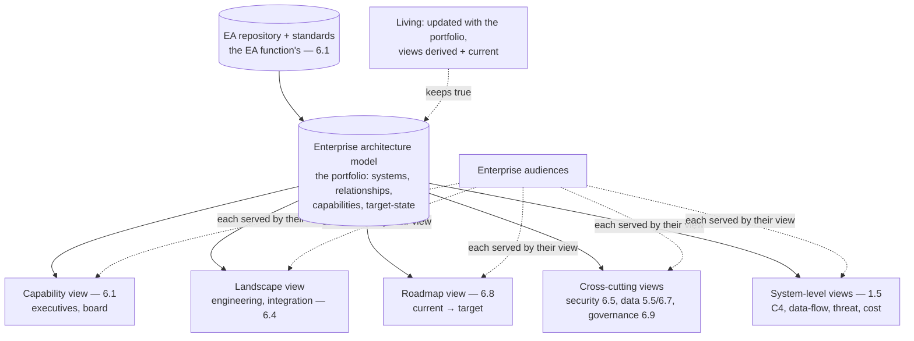

# Chapter 6.2 — Architecture Views & Documentation

| | |
|---|---|
| **Part** | 6 — Enterprise Architecture |
| **Maturity level** | 3 — Engineer |
| **Difficulty** | Advanced |
| **Estimated study time** | 3 hours (reading 90 min, exercise 90 min) |
| **Prerequisites** | [1.5 Communicating Architecture](../part-1-professional-foundation/chapter-05-communicating-architecture.md); [6.1](chapter-01-ea-frameworks.md) |

## Learning Objectives

After this chapter you will be able to:

1. Produce the architecture views enterprise GenAI systems need, from C4 and 4+1-style views to the enterprise-level views (capability, landscape, roadmap).
2. Document for the enterprise audiences — engineers, security, executives, review boards — from one coherent model, at the enterprise scale.
3. Extend 1.5's communication discipline to the enterprise-architecture level: the standards, the repository, and the views that a large organization needs.
4. Keep enterprise architecture documentation true and useful, avoiding the twin failures of over-documentation and stale-documentation.

## Introduction

This chapter scales 1.5's architecture communication from the individual system to the enterprise architecture — the views and documentation a large organization needs to understand, govern, and evolve its GenAI portfolio. 1.5 established the discipline (audience-artifact matching, C4, SCQA, diagrams-as-claims, the one-model-many-views principle); this chapter applies it at the enterprise scale, where the audiences include the EA function and review boards (6.9), the views include the enterprise-level ones (capability maps — 6.1, application landscapes, roadmaps), and the documentation lives in an enterprise repository with standards.

The framing: **enterprise architecture documentation is 1.5's discipline at portfolio scale** — the same one-model-many-views, audience-matched, true-not-stale principles, applied to the enterprise architecture where the model spans the portfolio and the audiences span the organization, and the challenge is keeping it coherent and true at that scale.

## Business Motivation

Enterprise architecture documentation is what makes a large GenAI portfolio governable and evolvable — the shared understanding that lets an organization reason about, decide on, and change its AI architecture at the portfolio level. Without it: the portfolio is understood only in fragments (each team knows its system, nobody sees the whole), governance decisions (6.9) are made without a coherent view, and the portfolio can't be evolved coherently (the target-state — 6.1 — exists in someone's head, not in shared artifacts). The documentation failures are costly in both directions (1.5's twin failures, at scale): over-documentation (the heavyweight EA repository nobody reads, the ceremony of 6.1) wastes effort and goes stale; under-documentation (the portfolio understood only tribally) prevents portfolio-level reasoning and governance. The business case is the enterprise-scale version of 1.5's: the architecture documentation is how the portfolio gets governed (6.9 needs the views), decided on (the business case — 6.10 — needs the portfolio view), and evolved (the roadmap — 6.1/6.8 — needs the target-state artifacts) — the shared understanding that makes the AI portfolio a manageable enterprise asset rather than a fragmented set of tribal knowledge.

## Theory

### The view hierarchy

Enterprise GenAI architecture needs views at multiple levels (1.5's C4, extended up to the enterprise views):

- **System-level views** (1.5) — C4 (context, container, component) and the data-flow, threat-model, and cost views for individual systems; the views 1.5 built, now the leaves of the enterprise view hierarchy.
- **Landscape views** — the application landscape (how the AI systems relate to each other and the existing applications — 6.1's application architecture), showing the portfolio's shape and the integration (6.4); the view that reveals the portfolio's coherence (or sprawl).
- **Capability views** (6.1) — the AI-annotated capability map (where AI enhances the business), the value-anchoring view for executive and board communication (1.5/6.1).
- **Roadmap views** (6.1/6.8) — the current-to-target-state and the sequenced roadmap, the evolution view.
- **Cross-cutting views** — the enterprise-level security architecture (6.5), the data architecture (5.5/6.7), the governance view (6.9) — the concerns that span the portfolio.

The hierarchy's discipline (1.5's altitude control, enterprise edition): each view at its level, for its audience, never mixing enterprise-landscape altitude with system-component altitude (the enterprise equivalent of 1.5's C4 altitude discipline).

### One model, enterprise-scale

1.5's one-model-many-views, at the enterprise scale:

- **The enterprise architecture model** — the coherent model of the portfolio (the systems, their relationships, their capability mappings, the target-state) from which the views derive; the enterprise-scale version of 1.5's single source of truth, spanning the portfolio.
- **Derived views for enterprise audiences** — the executive capability view (6.1), the review-board governance view (6.9), the engineering landscape and integration views (6.4), the security architecture view (6.5) — all derived from the one model, so they're coherent (the enterprise equivalent of 1.5's no-forked-views, at portfolio scale where the forking risk is worse — many teams, many views).
- **The repository and standards** — the enterprise architecture repository (where the model and views live), with the documentation standards (the notations, the templates, the review — 5.1's conform, the EA function's standards) that keep the enterprise documentation coherent; the enterprise-scale version of 1.5's versioned-artifacts, with the EA function's governance.

### Keeping it true and useful

The twin failures (1.5's, at enterprise scale) and their avoidance:

- **Against over-documentation** — the minimum-viable-enterprise-documentation (1.5's minimum true set, enterprise edition): the capability map, the landscape view, the roadmap, the cross-cutting views (security, data, governance), and the system-level views for the significant systems — kept true, not the exhaustive heavyweight repository nobody reads (6.1's ceremony).
- **Against stale-documentation** — the enterprise documentation kept current (the model updated as the portfolio evolves, the views regenerated — the enterprise equivalent of 1.5's versioned-in-the-repo, with the update discipline at portfolio scale where staleness is the constant risk); the stale enterprise architecture (the target-state from three years ago, the landscape missing half the current systems) is worse than useless (it misleads governance and decisions).
- **The living documentation** — the enterprise architecture documentation as a living artifact (updated with the portfolio, the model as the source of truth, the views derived and current), which is what makes it useful for the ongoing governance (6.9), decisions (6.10), and evolution (6.8) — not a point-in-time artifact that ossifies.

## Architecture Perspective

Readings. **The view hierarchy serves the enterprise audiences at their altitude** — executives get the capability view (6.1), review boards the governance view (6.9), engineers the landscape and system views, security the security architecture view (6.5) — each at its level, from the one model, the enterprise-scale version of 1.5's audience-artifact matching and altitude control. **The one-model-many-views is harder and more important at scale** — the forking risk (1.5) is worse at portfolio scale (many teams, many views, more drift), so the enterprise architecture model as the single source of truth (with the EA repository and standards — 6.1) is what keeps the enterprise views coherent, and the discipline that prevents the each-team-holds-a-different-architecture chaos (1.5's forked-views, at portfolio scale). **And the living-documentation discipline is the enterprise-scale challenge** — keeping the enterprise architecture model and views true as the portfolio evolves (the constant staleness risk at scale) is what makes the documentation useful for governance and decisions, versus the stale enterprise architecture that misleads (the target-state from three years ago) — the update discipline (1.5's versioned-artifacts, with the portfolio-scale update rigor).

## Real-world Example

**Bellhaven Insurance** (6.1's EA-anchored portfolio) built the enterprise architecture documentation for its AI portfolio, and the documentation is where 6.1's capability-mapped portfolio became the shared artifacts that governed and evolved it. The view hierarchy served the audiences: the AI-annotated capability map (6.1) for the executive committee and board (the AI strategy in the business's capability language — 1.5/6.1); the landscape view for the engineering and EA teams (how the intake platform, the assistant, the renewal advisor related to each other and the existing applications, with the integration — 6.4 — shown); the roadmap view (6.8) for the strategic planning (current-to-target, the sequenced initiatives); the cross-cutting security architecture (6.5) and data architecture (5.5/6.7) views for the security and data governance functions; and the system-level views (1.5) for the individual systems. The one-model-many-views discipline was the enterprise-scale challenge Bellhaven took seriously: the enterprise architecture model (the portfolio's systems, relationships, capability mappings, target-state) was the single source of truth in the EA repository (6.1's EA function's standards), and the views derived from it — which prevented the forking (1.5) that the earlier scattered-pilots era had suffered (each team's own diagrams, no coherent portfolio view). The living-documentation discipline was where Bellhaven learned the enterprise-scale lesson: the first version of the enterprise architecture documentation went stale within a year (the portfolio evolved, the model didn't update, the landscape view missed the new systems), and the correction was the update discipline (the model updated as part of the governance process — 6.9, the views regenerated, the documentation living not point-in-time). The enterprise architect's documentation note: *"At the enterprise scale, the challenge isn't drawing the views — it's keeping them true across a portfolio that's always changing, and coherent across a model many teams touch. One model, derived views, updated with the portfolio, at the altitude each audience needs. The stale enterprise architecture is worse than none — it misleads the governance. Living, coherent, audience-matched: that's 1.5's discipline at portfolio scale, and the scale makes it harder and more important."*

## Hands-on Exercise

**Build the enterprise view hierarchy.** ~90 minutes. For an enterprise's AI portfolio (real or a case study's).

1. **The view hierarchy (35 min).** For a portfolio of 3–4 AI systems, sketch the view hierarchy: a capability view (6.1 — the executive altitude), a landscape view (how the systems relate — the engineering altitude), a roadmap view (current-to-target — the strategic altitude), and one cross-cutting view (security or data). Mark each view's audience and altitude.
2. **One model, derived views (25 min).** Describe the enterprise architecture model the views derive from (the portfolio's systems, relationships, capability mappings, target-state). Show how two views (capability and landscape) derive from the one model coherently, and what would go wrong if they forked (1.5's forking, at scale).
3. **The minimum true set (15 min).** For this portfolio, define the minimum-viable-enterprise-documentation (against over-documentation): which views are essential, kept true, vs. the exhaustive documentation to avoid.
4. **The living discipline (15 min).** Design how the documentation stays true as the portfolio evolves: what updates the model (the governance process — 6.9), how the views regenerate, and the staleness risk you're guarding against.

**Acceptance criteria:**
- [ ] View hierarchy has views at multiple altitudes (capability, landscape, roadmap, cross-cutting) with audiences marked
- [ ] The one-model-derived-views discipline shown, with the forking risk at scale identified
- [ ] The minimum true set defined against over-documentation
- [ ] The living discipline keeps the documentation true as the portfolio evolves

## Enterprise Considerations

Enterprise architecture documentation is governed by the EA function and serves the enterprise's strategic and governance machinery. **The EA repository and standards are the EA function's** (6.1): the enterprise architecture model and views live in the EA function's repository with its standards (notations, templates, review — 5.1's conform), so the AI architecture documentation conforms to the enterprise EA documentation practice (integrate-don't-parallel, documentation edition) rather than a parallel AI documentation silo. **The documentation is the governance and decision substrate** (6.9, 6.10): the review boards (6.9) govern from the views (the landscape, the security architecture, the system views), and the business-case/TCO decisions (6.10) use the portfolio view — so the documentation quality directly determines the governance and decision quality (the stale or fragmented documentation degrades both). **The audience range is the enterprise's full stakeholder set** (1.5/1.6): executives, board, review boards, security, data governance, engineering, compliance (4.14) — each served by their view at their altitude, and the enterprise architecture documentation is how the AI architecture communicates to the whole organization. **And the documentation is a compliance artifact** (4.14): the architecture views (the data-flow — 4.14, the security architecture — 6.5, the system documentation) are part of the compliance evidence (the auditable record of what the systems are and how they're governed — 4.14's evidence-from-engineering), so the enterprise architecture documentation serves the compliance function too.

## Trade-offs

| Decision | Option A | Option B | Choose A when… | Choose B when… |
|----------|----------|----------|----------------|----------------|
| Documentation scope | Minimum true set (essential views, kept true) | Exhaustive repository | Always — the minimum true set is useful, the exhaustive one goes stale | Never the exhaustive-for-its-own-sake; ceremony only where genuinely governed |
| View coherence | One model, derived views | Independent per-team views | Always at scale — the forking risk is worse (1.5) | Never; forked views are the each-team-different-architecture chaos |
| Documentation currency | Living (updated with the portfolio) | Point-in-time | Always — the stale enterprise architecture misleads governance | Never; point-in-time enterprise architecture ossifies and misleads |
| Repository | The EA function's (conform) | A parallel AI documentation silo | Always — integrate-don't-parallel (documentation edition) | Never; the parallel silo fragments the enterprise view |

## Common Mistakes

1. **Over-documentation** — the heavyweight exhaustive EA repository nobody reads and nobody keeps true (6.1's ceremony, documentation edition); the minimum-viable-enterprise-documentation kept true is what's useful.
2. **Stale enterprise architecture** — the documentation not updated as the portfolio evolves (the target-state from three years ago, the landscape missing half the systems — Bellhaven's first-version lesson); worse than useless, it misleads governance — the living discipline is essential.
3. **Forked views at scale** — each team's own diagrams, no coherent portfolio model, so nobody sees the whole (the scattered-pilots documentation); one model, derived views (1.5, at scale where the risk is worse).
4. **Altitude mixing at the enterprise level** — mixing enterprise-landscape altitude with system-component altitude in one view (1.5's altitude discipline, enterprise edition); each view at its level for its audience.
5. **The parallel AI documentation silo** — AI architecture documentation disconnected from the enterprise EA repository and standards; conform (5.1/6.1's EA function's standards), don't parallel.
6. **Documentation as point-in-time, not living** — the enterprise architecture documented once and ossifying, not updated with the portfolio; the living discipline (updated via the governance process — 6.9) keeps it useful.
7. **Ignoring the compliance role** — not recognizing the architecture views as compliance evidence (4.14); the enterprise architecture documentation serves the compliance function too.

## Best Practices

1. **Build the view hierarchy** — capability (executive), landscape (engineering), roadmap (strategic), cross-cutting (security/data/governance), system-level (1.5) — each at its altitude for its audience.
2. **One model, derived views** — the enterprise architecture model as the single source of truth (in the EA repository — 6.1), views derived, coherent; the forking-prevention that matters more at scale (1.5).
3. **Keep the minimum true set** — the essential views kept true, against the over-documentation ceremony; useful beats exhaustive.
4. **Make it living** — the model updated with the portfolio (via the governance process — 6.9), the views regenerated and current; the stale enterprise architecture misleads.
5. **Conform to the EA function's repository and standards** — integrate-don't-parallel (5.1/6.1), the AI documentation in the enterprise EA practice.
6. **Serve every enterprise audience at their altitude** — executives, board, review boards, security, data, engineering, compliance — each their view (1.5/1.6).
7. **Use the documentation as compliance evidence** — the architecture views (data-flow, security architecture, system documentation) as part of the compliance record (4.14).

## Architecture Checklist

For enterprise GenAI architecture documentation:

- [ ] View hierarchy built: capability (6.1), landscape, roadmap (6.8), cross-cutting (security 6.5, data 5.5/6.7, governance 6.9), system-level (1.5)
- [ ] One enterprise architecture model as the single source of truth; views derived coherently (no forking at scale)
- [ ] Each view at its altitude for its audience (altitude discipline, enterprise edition — 1.5)
- [ ] The minimum true set kept (essential views, true), against over-documentation ceremony
- [ ] Documentation is living: the model updated with the portfolio (via governance — 6.9), views current
- [ ] Conforms to the EA function's repository and standards (5.1/6.1); no parallel AI silo
- [ ] Serves the full enterprise audience set (executives to compliance)
- [ ] Architecture views serve as compliance evidence (4.14)

## Interview Questions

1. *"How do you document a GenAI portfolio for a large enterprise?"* — Strong answers build the view hierarchy (capability for executives, landscape for engineering, roadmap for strategy, cross-cutting for security/data/governance, system-level per 1.5), derive them from one model (the forking-prevention at scale), keep the minimum true set living, and conform to the EA function's repository (6.1) — 1.5's discipline at portfolio scale.
2. *"What's the biggest documentation challenge at the enterprise scale?"* — Strong answers name keeping it true and coherent: the living-documentation discipline (updated with the always-changing portfolio, the stale enterprise architecture misleads governance) and the one-model-many-views (the forking risk worse at scale with many teams) — the scale making 1.5's discipline harder and more important (Bellhaven's stale-first-version lesson).
3. *"How do you avoid the over-documentation that gives EA a bad name?"* — Strong answers give the minimum-viable-enterprise-documentation (the essential views kept true — capability, landscape, roadmap, cross-cutting, significant systems — against the exhaustive heavyweight repository), skip the ceremony (6.1), and keep it living (useful beats exhaustive) — 1.5's minimum true set at enterprise scale.
4. *"Who are the audiences for enterprise AI architecture documentation, and how do you serve them?"* — Strong answers give the full stakeholder range (executives, board, review boards, security, data, engineering, compliance — 1.5/1.6) each served by their view at their altitude from the one model, and note the compliance role (the views as evidence — 4.14) — the enterprise-scale audience-artifact matching.

## Further Reading

- 1.5 Communicating Architecture (re-read) — the discipline this chapter scales to the enterprise; the audience-artifact matching, C4, diagrams-as-claims, and one-model-many-views that extend to portfolio scale.
- The C4 model (c4model.com, re-linked from 1.5) — the system-level views that are the leaves of the enterprise view hierarchy; and the EA-level view frameworks (ArchiMate for the enterprise views, if the enterprise uses it).
- Your enterprise's EA repository and documentation standards (internal, and 6.1's EA function) — the standards the AI documentation conforms to.
- 6.1 EA Frameworks (the capability map and target-state) and 6.9 Architecture Governance (the governance the documentation serves) — the chapters this documentation connects.

## Summary

- Enterprise architecture documentation is **1.5's communication discipline at portfolio scale** — the same one-model-many-views, audience-matched, true-not-stale principles, applied where the model spans the portfolio and the audiences span the organization.
- The **view hierarchy** serves the enterprise audiences at their altitude: capability (executives — 6.1), landscape (engineering, integration — 6.4), roadmap (strategy — 6.8), cross-cutting (security 6.5, data 5.5/6.7, governance 6.9), and system-level (1.5) — each at its level from the one model.
- **One model, derived views** is harder and more important at scale — the forking risk (1.5) is worse with many teams, so the enterprise architecture model as the single source of truth (in the EA function's repository — 6.1) keeps the views coherent.
- The **living-documentation discipline** is the enterprise-scale challenge — keeping the model and views true as the portfolio always evolves, because the stale enterprise architecture misleads governance (worse than none — Bellhaven's lesson).
- The documentation is the **governance and decision substrate** (6.9/6.10) and a **compliance artifact** (4.14) — served to the full enterprise audience, conforming to the EA function's standards (integrate-don't-parallel). The decision records that document the *why* behind the architecture are next: **ADRs & decision governance** (6.3).

---

**Previous:** [Chapter 6.1 — Enterprise Architecture Frameworks in Practice](chapter-01-ea-frameworks.md) · **Next:** [Chapter 6.3 — ADRs & Decision Governance](chapter-03-adrs-decision-governance.md) · **Related:** [1.5 Communicating Architecture](../part-1-professional-foundation/chapter-05-communicating-architecture.md), [6.1 EA Frameworks](chapter-01-ea-frameworks.md), [6.9 Architecture Governance](chapter-09-architecture-governance.md)
