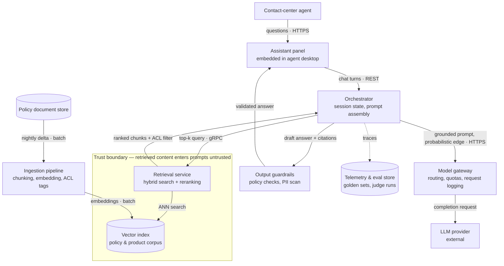

# Chapter 6.2 — Architecture Views & Documentation

| | |
|---|---|
| **Part** | 6 — Enterprise Architecture |
| **Maturity level** | 3 — Engineer |
| **Difficulty** | Advanced |
| **Estimated study time** | 2 hours (reading 40 min, exercise ~90 min) |
| **Prerequisites** | [1.5 Communicating Architecture](../part-1-professional-foundation/chapter-05-communicating-architecture.md); [6.1](chapter-01-ea-frameworks.md) |

## Learning Objectives

After this chapter you will be able to:

1. Distinguish the system-communication problem ([1.5](../part-1-professional-foundation/chapter-05-communicating-architecture.md)) from the documentation-estate problem, and name the disciplines that only exist at estate scale: selection, ownership, freshness engineering.
2. Apply the C4 model as an estate standard: what each level asserts, where each stops paying for its maintenance, and why level 3 and below rot fastest.
3. Read ArchiMate at working literacy — the business, application, and technology layers — and judge when a queryable EA model repays its modeling staff.
4. Design a docs-as-code practice around a **view catalog**: owners, freshness SLAs, same-PR gates, a generated-versus-authored split, and staleness detection ending in update or archive.

## Introduction

[1.5](../part-1-professional-foundation/chapter-05-communicating-architecture.md) solved a bounded problem: **one system, communicated to its stakeholders** — the architect is in the room, knows the audiences, and hand-crafts each artifact. This chapter's problem only looks similar. A portfolio runs many systems, documented by many authors for overlapping audiences, and the documentation must stay true across years of turnover — long after every original author has left. That is not a bigger communication problem; it is a different one: **the documentation estate**. The unit of design shifts from the diagram to the inventory of diagrams, and the hard questions shift with it: not "which artifact serves this audience" but *which views exist at all*, *who owns each*, and *what keeps each true*. The governing artifact is the **view catalog**; the working method is docs-as-code, which turns "living documentation" from a policy sentence into a CI outcome.

## Business Motivation

Documentation costs run on two meters. The carrying cost is visible: every authored view consumes maintenance for as long as it exists, which is why estates that never say no to a view drown in their own diagrams. The staleness cost hides in other budgets: security reviews that extract the design interrogatively, on-call engineers debugging from diagrams that predate last quarter's migration, partner audits that take weeks because evidence must be assembled instead of indexed. The asymmetry that makes staleness the worse cost: a missing view announces itself, while a stale view is *believed* — documentation's authority with a rumor's accuracy, misleading exactly the people conscientious enough to read it. The business case is therefore a portfolio decision: hold fewer documentation liabilities, deliberately, each with an owner and a freshness mechanism. Estates that do answer audits in days and pass reviews on the first round.

## Theory — running the documentation estate

### What changes between one system and an estate

1.5's craft assumes the author is present to explain and update the artifacts. At estate scale that assumption fails structurally — authors rotate, and a view's reader is usually someone its author never met. Three disciplines exist only at this scale:

- **Selection** — which views the estate carries at all. Depth follows materiality: full view sets where failure or examination would hurt, the minimum elsewhere.
- **Ownership** — every authored view names an accountable person or role. A view without an owner does not have a freshness SLA; it has a staleness date that hasn't arrived yet.
- **Freshness engineering** — mechanisms, not intentions: gates coupling updates to the changes that invalidate views, generation removing hand-maintenance, checks detecting drift.

The view catalog records all three, which is why it — not any diagram — is the estate's governing artifact.

### C4 at estate scale — where each level stops paying

1.5 introduced C4 as altitude discipline for one system. At estate scale its four levels become an *economic* question: each has a change rate and a readership, and earns authored maintenance only while readership justifies change rate.

- **Level 1 — Context**: the system as one box among users and neighbors. Changes only when scope changes; read by everyone — onboarding, review boards, adjacent teams. Cheapest truth, highest traffic. *Mandate for every system.*
- **Level 2 — Container**: the deployable pieces and their interactions — the engineering workhorse, where GenAI containers (orchestrator, retrieval service, model gateway, eval service) appear. Changes at architecture cadence, and those changes surface in code review — which is what makes a same-PR update gate enforceable. *Mandate for material systems.*
- **Level 3 — Component**: inside one container. The economics invert: component structure tracks code, which changes at sprint cadence, while readership shrinks to the owning team — who can read the code itself. Highest change rate, lowest external readership: **this is why level-3-and-below documentation rots fastest**. *Generate or omit*; author only where a container's internals are themselves a governed decision — a prompt-assembly pipeline whose stage order is a security control, say.
- **Level 4 — Code**: never authored; tools produce it on demand.

The estate rule in one line: **authored depth ends where readership ends.** 1.5's two GenAI markings — trust boundaries where untrusted content enters prompts, probabilistic edges where output quality is a distribution — become review-enforced standards here, because [threat models](../../GLOSSARY.md) and eval placement ([4.9](../part-4-enterprise-genai-systems/chapter-09-genai-security-threat-modeling.md)) are read off them by people who didn't draw them.

### ArchiMate — reading literacy for the AI architect

[6.1](chapter-01-ea-frameworks.md) placed ArchiMate as notation to adopt only where it has readers; this section makes you one of those readers. Its core is three layers mirroring 6.1's domains: the **business layer** (actors, processes, services — "handle claims"), the **application layer** (components and the services they expose — "claims triage service"), and the **technology layer** (nodes, platforms — "the shared AI platform"). Typed relationships link them, and the verticals carry the meaning: an application service *serves* a business process; a component *realizes* a service and is *deployed on* technology. Reading a model is mostly following those verticals.

What this buys a large EA practice: the model is **one typed graph**, and views are projections of it. Cross-layer questions become queries — "which business processes depend on the platform we're retiring?" is a traversal, not archaeology — and cross-view consistency holds by construction: the industrialized form of 1.5's one-model-many-views. That case prices its own limits. The payoff requires a maintained model, which requires modeling staff, and a model decays faster than diagrams because fewer people can repair it. **Do not adopt** when no staffed EA function will keep it true, when the audience reads C4 and tables instead, or when the landscape fits on one maintained page. Literacy and adoption are separate decisions — you must *read* your EA function's ArchiMate even if your teams never author any.

### Docs-as-code — the freshness machinery

Four mechanisms, in increasing order of leverage:

1. **Repo residence.** System views live as text (Mermaid here; Structurizr DSL is the common alternative) in the system's repository — versioned, diffable, rendered by CI where readers look. A diagram that can be diffed can be reviewed.
2. **Same-PR gates.** Couple the update to the change that invalidates the view: a pull request that adds a container, changes a cross-container protocol, or reroutes a data path must update the corresponding view *in that PR*, code diff and diagram diff reviewed together. This works only for code-coupled views — context, container, data-flow. Portfolio views are coupled to planning, so their mechanism is a cadence review pinned to the planning cycle.
3. **The generated-versus-authored split.** Generate everything a tool can derive: deployment inventories from IaC, dependency graphs from build metadata, component views from code, model-and-eval status from the [model registry](../../GLOSSARY.md). Author only what carries *intent*: context, container, data-flow, capability, roadmap. The kinds must never blur — a generated view is never stale but asserts no intent (it cannot be wrong, so it cannot be a claim); an authored view is a set of claims and therefore needs an owner.
4. **Staleness detection.** Every authored view carries a reviewed-on date; the catalog carries its SLA; CI flags breaches, plus cheap heuristics ("untouched for ninety days while its directory churned"). A flagged view has two exits — **updated or archived** — and archiving is legitimate maintenance. An estate that can only grow converges on mostly-stale.

### The view catalog — worked example

The catalog for Bellhaven Insurance's AI platform (the estate behind [6.1](chapter-01-ea-frameworks.md)'s portfolio). Every material view has a row; a view without a row does not officially exist.

| View | Primary audience | Notation & home | Owner | Freshness SLA | Kind |
|---|---|---|---|---|---|
| AI-annotated capability map | Executives, board | ArchiMate business/motivation layers, EA repository | Chief architect | Each planning cycle (quarterly) | Authored |
| Application landscape | EA function, engineering leads, review board | ArchiMate application layer, EA repository | EA function | 30 days after any system add/retire/replatform | Authored |
| System context (C4 L1), per system | New joiners, review board, adjacent teams | Mermaid, system repo | Owning team lead | Same-PR on external-interface change | Authored |
| Container view (C4 L2), material systems | Engineering, security, SRE | Mermaid, system repo | Owning team lead | Same-PR on boundary or protocol change | Authored |
| Data-flow view (prompt and PII paths) | Security, privacy office | Mermaid DFD, system repo | Team authors; security architect reviews | Re-review at change thresholds ([4.14](../part-4-enterprise-genai-systems/chapter-14-privacy-compliance-governance.md)) | Authored |
| Component views (C4 L3) | Owning team only | Generated from code | Build pipeline | Regenerated nightly; never hand-edited | Generated |
| Deployment & inventory view | SRE, FinOps | Generated from IaC and cloud APIs | Platform team | Regenerated on deploy | Generated |
| Model & eval status view | Review board ([6.9](chapter-09-architecture-governance.md)) | Generated from registry + eval store | Platform team | Regenerated on promotion | Generated |
| Roadmap view (current → target) | Sponsors, strategy | One-pager derived from the [6.8](chapter-08-legacy-modernization-ai-adoption.md) roadmap | Chief architect | Each planning cycle | Authored |

Three readings. Six of nine rows are authored — that number is the estate's real maintenance budget, and the catalog is where it is capped. The owner column is where freshness disputes get a name. And the catalog doubles as the audit index: when an examiner asks for the estate's documentation, this table is the response's first page.

## Architecture Perspective

What row four of the catalog mandates, drawn once as the estate's reference standard — the container view of Bellhaven's customer-service [RAG](../../GLOSSARY.md) platform:

Every arrow carries payload and protocol; the trust boundary encloses where retrieved content enters prompt assembly; the gateway edge is marked probabilistic — 1.5's conventions, enforced in review rather than left to taste. The trust boundary is where [4.9](../part-4-enterprise-genai-systems/chapter-09-genai-security-threat-modeling.md)'s threat model attaches; the telemetry-and-eval container is where [6.9](chapter-09-architecture-governance.md)'s review evidence originates; the *why* behind each contested edge lives in the [ADR](../../GLOSSARY.md) log ([6.3](chapter-03-adrs-decision-governance.md)). The same-PR gate in practice: a pull request adding a tool-calling path from the orchestrator must show this diagram's diff in the same review, or it is rejected as an undocumented boundary change.

## Real-world Example

Two years after its EA restart ([6.1](chapter-01-ea-frameworks.md)), **Bellhaven Insurance** ran nine AI delivery teams and kept its four portfolio artifacts true — but system documentation was every team's own affair: wiki pages, whiteboard photos, five notational dialects, one team's private ArchiMate model. The bill arrived twice in one quarter. A reinsurance partner's vendor-risk audit requested architecture documentation for the AI estate; assembling it took **five weeks** and surfaced three mutually contradictory container diagrams of the customer-service assistant, none current. Weeks later, a 2 a.m. incident on the renewal advisor ran ninety minutes long because the on-call engineer debugged from the wiki's diagram, which predated the feature-platform migration and showed a service that no longer existed.

The first fix failed. Bellhaven ran a two-week **documentation sprint** — all teams, update everything — and it worked, for one quarter. Nothing structural had changed: no owners, no gates, no checks, so the trued views drifted again, and the next audit-readiness check found a third of them wrong. Cost of the lesson: a team-week times nine, purchasing one quarter of truth.

The real fix was a decision with a price. Chief architect Ana Whitfield ruled that the estate would carry *fewer* views, each owned and gated: a catalog of about thirty authored views replaced the wiki's hundred and forty. The rest were archived — including the claims team's eighteen-month ArchiMate side-model, written off because it had exactly two readers, both on the claims team. She traded completeness for truth in public and spent real goodwill doing it; the platform team spent most of a quarter on the unglamorous machinery — render pipelines, same-PR gates, staleness checks wired to the catalog's SLAs. The next partner audit was answered in **four days**, from the catalog. Ana's retro line became the practice's motto: *"The wiki had an architecture per author. The catalog has one per system."*

## Hands-on Exercise

**Build the documentation estate for a three-system AI portfolio** (~90 min). Use systems you know or a [case-study](../../case-studies/README.md) company's.

1. **View catalog (30 min).** At least eight rows with the worked example's columns; at least two rows generated, with sources named.
2. **Reference container view (30 min).** A Mermaid C4-style container diagram of the portfolio's RAG system: every arrow labeled with payload and protocol, the trust boundary drawn where retrieved or user content enters prompts, at least one probabilistic edge marked.
3. **Freshness gates (20 min).** For the container and data-flow views, write the same-PR trigger conditions (which code changes force which view update) and one staleness check implementable in CI.
4. **ArchiMate memo (10 min).** A half-page adopt/don't-adopt recommendation for this portfolio, argued from readership and modeling staff, not notation features.

**Acceptance criteria:**
- [ ] Catalog has ≥8 rows; every authored row names an owner and a checkable SLA — a trigger or a date, never "kept current"
- [ ] ≥2 catalog rows are generated, each naming its source of truth
- [ ] Container diagram has zero unlabeled arrows, a drawn trust boundary, and a marked probabilistic edge
- [ ] Gate triggers are stated as conditions a PR reviewer could detect; the CI check is concrete enough to implement
- [ ] The ArchiMate memo takes a position and names the readership that decides it

## Enterprise Considerations

Large enterprises run two documentation worlds — an EA suite holding portfolio views, engineering repos holding system views — and the honest bridge is directional: every view has one authoritative home, and any other appearance is rendered from it, never re-drawn, because double-authoring guarantees divergence. In regulated estates the documentation doubles as **documentation-as-evidence** ([4.14](../part-4-enterprise-genai-systems/chapter-14-privacy-compliance-governance.md)): approved data-flow and container views are examination artifacts — dated, versioned, review trail attached — and the catalog serves as the audit index, precisely the difference between Bellhaven's five-week scramble and its four-day response. Vendor and SaaS systems sit in the landscape but expose no code to generate from: contract for documentation rights and give vendor views catalog rows with their own refresh terms. Ownership follows the catalog's grain — the EA function owns the catalog and portfolio views, teams their system views, security the data-flow review — so a firing staleness check routes to a name, not a mailing list. The estate's quietest return is onboarding: a current context-plus-container pair per system converts a new engineer's first month from folklore acquisition into reading.

## Trade-offs

| Decision | Option A | Option B | Choose A when… | Choose B when… |
|----------|----------|----------|----------------|----------------|
| Portfolio-view notation | ArchiMate in an EA repository | C4-style views + tables | A staffed EA function maintains the model and stakeholders read it | Readership is engineers and executives; notation without readers is ceremony ([6.1](chapter-01-ea-frameworks.md)) |
| Component-level (L3) docs | Authored and maintained | Generated, or omitted | The container's internals are themselves a governed decision (a prompt pipeline that is a security control) | Default — highest change rate, lowest external readership |
| Freshness mechanism | Same-PR gate | Cadence review | Views coupled to code boundaries: context, container, data-flow | Views coupled to planning: capability, landscape, roadmap |
| Estate coverage | Deep view sets on material systems | Uniform shallow coverage | Default — depth follows materiality, as [6.11](chapter-11-model-risk-management.md) tiers validation | A uniform inventory is itself the deliverable: M&A due diligence, a regulator's estate census |

## Common Mistakes

1. **The documentation sprint as the staleness cure** — Bellhaven's failed first fix: one quarter of truth, nothing structural changed, decay resumes the day it ends.
2. **Double-authoring the same view in the EA tool and the repo** — done to satisfy both audiences, it guarantees the copies diverge and that an auditor eventually finds both.
3. **Authored component diagrams for every container** — the estate's fastest-rotting artifact class, maintained for a readership that reads the code instead. Decoration with a maintenance bill.
4. **"Living documentation" declared, not engineered** — a policy sentence with no owner column, no SLA, no check behind it. Freshness is a mechanism or it is a hope.
5. **Presenting generated views as architecture** — a dependency dump asserts no intent; it cannot be wrong, so it cannot be a claim, and reviewers who accept it have reviewed nothing.
6. **An estate that only grows** — no archive path, so stale views accumulate until readers cannot tell which are load-bearing. Bellhaven archived a hundred and ten views to make thirty true.
7. **Portfolio views locked where responders can't reach them** — the landscape that exists only inside a licensed EA tool fails the 2 a.m. test; render views where their readers stand.

## Best Practices

1. **Run the estate from the catalog** — every view has a row: audience, notation, home, owner, SLA, kind. No row, no view — and the catalog caps the authored count.
2. **Mandate C4 to container level; generate below it** — authored depth ends where readership ends.
3. **Gate boundary-coupled views in the same PR as the change** — the diagram diff beside the code diff is the cheapest review the estate will ever get.
4. **Keep generated and authored views visibly distinct** — inventory from tools, intent from architects; label which is which.
5. **Date every authored view and route staleness to its named owner** — an unowned view is staleness on a schedule.
6. **Archive aggressively** — a flagged view is updated or archived within its SLA; a small true set beats a large stale one (1.5's rule, promoted to estate policy).

## Architecture Checklist

For an AI portfolio's documentation estate:

- [ ] A view catalog covers every material system; each row carries audience, owner, and a checkable freshness SLA
- [ ] Context and container views are current per material system — labeled arrows, single altitude, trust boundaries and probabilistic edges marked
- [ ] Component-level documentation is generated or explicitly justified, never hand-maintained by default
- [ ] Same-PR gates cover context, container, and data-flow views; cadence reviews cover capability, landscape, and roadmap views
- [ ] Generated and authored views are distinguishable at a glance
- [ ] Staleness checks run in CI and route breaches to the owning name
- [ ] Every view has one authoritative home; all other appearances are rendered from it
- [ ] The catalog can serve as an audit index: views dated, versioned, review trail attached ([4.14](../part-4-enterprise-genai-systems/chapter-14-privacy-compliance-governance.md))
- [ ] An archive path exists and has been used — the estate can shrink

## Interview Questions

1. *"Forty AI systems, and the architecture documentation is always stale. Fix it."* — Strong answers refuse the "more discipline" framing and build machinery: shrink the authored estate, then a view catalog with owners and SLAs, same-PR gates, generation for everything derivable, staleness checks with archive as a legitimate exit. Weak answers propose a documentation sprint.
2. *"Which C4 levels would you standardize across an estate, and why?"* — Strong answers mandate context and container (slow change, wide readership, gateable) and generate-or-omit component and code (fastest change, narrowest readership — the rot argument), adding the GenAI markings as estate standards.
3. *"Your EA function models in ArchiMate; your teams draw C4 in Mermaid. Problem?"* — Strong answers say no, if governed: portfolio views in the model, system views in the repos, names consistent across the seam, every view single-homed. The problem to hunt is double-authoring, not two notations — and the architect reads the EA model regardless.
4. *"An auditor asks for your AI estate's architecture documentation by Friday. What determines whether that's easy?"* — Strong answers name indexing and freshness, not volume: a catalog that doubles as the evidence index, views dated and versioned, data-flow views re-reviewed at change thresholds. The five-weeks-versus-four-days difference was built before the request arrived.

## Further Reading

- **Simon Brown, the C4 model (c4model.com)** — re-read past the notation this time, for the guidance on which diagrams to keep, review, and skip.
- **The ArchiMate Specification** (The Open Group) — the layer and relationship chapters are the reading-literacy core; an afternoon there lets you navigate any EA function's model.
- **arc42 (arc42.org)** — a pragmatic, free documentation template; a useful quarry for what an authored system view set should contain.
- **Clements et al., *Documenting Software Architectures: Views and Beyond*** — the deep treatment of stakeholder-driven view selection; its method is this chapter's catalog with two decades of rigor behind it.

## Summary

- [1.5](../part-1-professional-foundation/chapter-05-communicating-architecture.md) communicates one system to its stakeholders; this chapter runs the **documentation estate** — many systems, many audiences, kept true over years — through selection, ownership, and freshness engineering, governed by the **view catalog** (audience × view × notation × owner × freshness SLA).
- **C4's estate economics**: mandate context and container; generate or omit component and code, which rot fastest — sprint-cadence change for readers who read the code. Authored depth ends where readership ends.
- **ArchiMate** is a typed three-layer graph whose payoff — queryable impact analysis, consistency by construction — requires a staffed, maintained model; adopt it where that holds, keep reading literacy either way.
- **Docs-as-code** supplies the freshness machinery: views in the repo, same-PR gates for code-coupled views, cadence reviews for planning-coupled ones, a strict generated-versus-authored split, staleness checks whose exits are update or archive.
- A stale view is worse than a missing one because it is believed; Bellhaven's arc — five-week audit, failed sprint, thirty owned views instead of a hundred and forty — is the cost curve in miniature. The *why* behind the views is next: **ADRs & decision governance** ([6.3](chapter-03-adrs-decision-governance.md)).

---

**Previous:** [Chapter 6.1 — Enterprise Architecture Frameworks in Practice](chapter-01-ea-frameworks.md) · **Next:** [Chapter 6.3 — ADRs & Decision Governance](chapter-03-adrs-decision-governance.md) · **Related:** [1.5 Communicating Architecture](../part-1-professional-foundation/chapter-05-communicating-architecture.md), [6.1 EA Frameworks](chapter-01-ea-frameworks.md), [6.9 Architecture Governance](chapter-09-architecture-governance.md)
