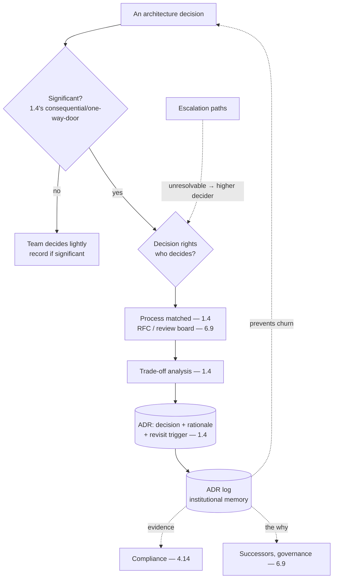

# Chapter 6.3 — ADRs & Decision Governance

| | |
|---|---|
| **Part** | 6 — Enterprise Architecture |
| **Maturity level** | 3 — Engineer |
| **Difficulty** | Advanced |
| **Estimated study time** | 3 hours (reading 90 min, exercise 90 min) |
| **Prerequisites** | [1.4 Trade-off Analysis](../part-1-professional-foundation/chapter-04-tradeoff-analysis.md); [6.2](chapter-02-architecture-views-documentation.md) |

## Learning Objectives

After this chapter you will be able to:

1. Run architecture decision-making that scales: ADR practice, RFC processes, and the decision-rights clarity that keeps decisions moving.
2. Establish the decision-governance that a large GenAI portfolio needs: what decisions need what process, who decides, and how disagreements resolve.
3. Extend 1.4's trade-off analysis into the enterprise decision-governance: the ADRs as the record, the processes as the flow, the rights as the clarity.
4. Avoid the decision pathologies at scale: the decisions that don't get made, get re-made, or get made by the wrong people.

## Introduction

This chapter scales 1.4's trade-off analysis and decision-making from the individual decision to the enterprise decision-governance — the practice, processes, and rights that keep architecture decisions in a large GenAI portfolio getting made well, recorded, and not re-litigated. 1.4 built the individual decision (the trade-off analysis, the ADR, the reversibility triage); this chapter builds the *governance* around decisions at scale, where the questions are which decisions need which process, who has the rights to decide, and how the organization avoids the decision pathologies (paralysis, churn, wrong-decider) at portfolio scale.

The framing: **decision governance is the enterprise's decision-making at scale** — the ADR practice (the record — 1.4), the RFC processes (the flow), and the decision rights (the clarity) that turn individual good decisions (1.4) into an organization that decides well consistently, versus the organization where decisions stall, churn, or get made by whoever shouts loudest.

## Business Motivation

Decision governance is what keeps a large GenAI portfolio's architecture decisions moving and coherent — the difference between an organization that decides well at scale and one that drowns in decision dysfunction. Without it: decisions stall (nobody knows who decides — 1.4's paralysis, at scale), get re-litigated (no ADR record, so every decision is re-fought when a new stakeholder arrives — 1.4's churn, at scale), or get made by the wrong people (no decision rights, so the loudest or most senior decides regardless of the right owner — 1.4's HiPPO, institutionalized). The cost is velocity and coherence: the organization with poor decision governance decides slowly (the stall), inconsistently (the churn), and badly (the wrong-decider), which at GenAI's pace (models change quarterly — 3.10, the technology moves fast) is a serious drag on the whole portfolio. The business case is the enterprise-scale version of 1.4's: good decision governance (ADRs recording the decisions and their rationale, processes flowing the decisions, rights clarifying the deciders) makes the organization decide fast (clear rights, no stall), coherently (recorded, no churn), and well (the right decider, the trade-off analysis) at portfolio scale — the decision infrastructure that lets the AI program move at the technology's pace without the decision dysfunction that scale otherwise brings.

## Theory

### The ADR practice at scale

1.4's ADR, as an enterprise practice:

- **ADRs as the decision record** (1.4) — the architecturally-significant decisions recorded (context, options, decision, consequences, revisit triggers — 1.4's format), so the *why* is durable (against 1.4's re-litigation) and auditable (4.14's decision-records evidence); the practice this curriculum has used throughout (the [ADR log](../../adr/) and template).
- **The ADR log as institutional memory** — the accumulated ADRs as the portfolio's decision history (why the architecture is the way it is), which is the successor's map (1.4), the auditor's evidence (4.14), and the churn-prevention (the decision was made, here's why, revisit only on the trigger — 1.4).
- **Which decisions get ADRs** — the architecturally-significant ones (1.4's consequential, one-way-door, wide-blast-radius decisions), not every decision (the ADR practice scales by recording the significant, not drowning in the trivial); the judgment of significance is part of the practice.

### The decision processes

The processes that flow decisions at scale:

- **RFC (Request for Comments) processes** — for the decisions that need broad input (the cross-team, portfolio-affecting decisions): a proposal circulated for comment, the input gathered, the decision made and recorded (the ADR); the process that scales the 1.4 trade-off analysis's stakeholder input (the pre-socialization — 1.8) to the organization.
- **Lightweight vs. heavyweight** — the process matched to the decision (1.4's effort-to-reversibility): the reversible team-level decisions decided lightly (the team decides, records if significant), the one-way-door portfolio decisions decided heavily (the RFC, the review board — 6.9, the formal ADR); the process-matching that avoids both the everything-is-heavyweight ceremony and the everything-is-lightweight chaos.
- **The review board interaction** (6.9) — the significant decisions that go to the architecture review board (6.9): the board reviews the decision (the trade-off analysis, the ADR), and the process is how the decision flows to and from the board (6.9's governance).

### Decision rights

The clarity of who decides (1.4's named decider, at scale):

- **Decision rights defined** — who has the authority to decide what (the team decides X, the platform team decides Y, the review board decides Z, the escalation goes to whom) — the clarity that prevents the stall (nobody knows who decides) and the wrong-decider (the loudest decides); the enterprise-scale version of 1.4's named-decider.
- **The RACI-style clarity** — who's Responsible, Accountable, Consulted, Informed for the decision types (a lightweight model, not the heavyweight RACI ceremony): the clarity of roles that keeps decisions moving (the accountable decider knows they decide, the consulted know they're consulted not deciding — resolving 1.4's consensus-scales-terribly).
- **Escalation paths** — where decisions go when they can't be resolved at their level (the disagreement that needs a higher decider, the cross-team conflict that needs the EA function or the review board — 6.9); the path that prevents the stall (the unresolvable decision has somewhere to go) and the 1.8 disagree-and-commit (the escalation resolves, and the parties commit).

### The decision pathologies at scale

1.4's pathologies, institutionalized and their governance-level fixes:

- **Paralysis at scale** — decisions that stall because no rights are clear; fixed by the decision rights (who decides) and the escalation paths (where the stuck decision goes).
- **Churn at scale** — decisions re-litigated because no ADR record; fixed by the ADR practice (the decision recorded with its rationale and revisit trigger, re-opened only on the trigger — 1.4).
- **Wrong-decider at scale** — decisions made by the loudest or most senior regardless of the right owner (1.4's HiPPO, institutionalized); fixed by the decision rights (the accountable decider defined) and the process (the RFC/trade-off analysis that makes the decision evidence-based, not authority-based — 1.4).
- **Process pathology** — the governance itself becoming the dysfunction (everything heavyweight, the decision drowning in process — the ceremony of 6.1); fixed by the process-matching (lightweight for reversible, heavyweight for one-way-door — 1.4's effort-to-reversibility).

## Architecture Perspective

Readings. **The ADR log is the institutional memory that prevents churn** — the accumulated decisions with their rationale and revisit triggers (1.4) are what let the organization *not* re-litigate (the decision was made, here's why, revisit only on the trigger), which at scale (many stakeholders, personnel changes) is the churn-prevention that keeps the portfolio's decisions stable — and it's the auditor's evidence (4.14) and the successor's map (1.4). **Decision rights are the stall-and-wrong-decider prevention** — the clarity of who decides what (the enterprise-scale named-decider — 1.4) prevents both the paralysis (nobody knows who decides) and the wrong-decider (the loudest decides), and the escalation paths give the unresolvable decision somewhere to go (the 1.8 disagree-and-commit after the escalation resolves). **And the process-matching prevents the process pathology** — matching the process to the decision (lightweight for reversible, heavyweight for one-way-door — 1.4's effort-to-reversibility) is what keeps the governance from becoming the dysfunction (the everything-heavyweight ceremony that drowns decisions — 6.1's ceremony), so the decision governance accelerates decisions rather than obstructing them.

## Real-world Example

**Vantora Systems** (the platform arc) built decision governance for its GenAI platform and portfolio, and the governance is where 1.4's individual decisions became the organization's decision infrastructure. The pre-governance state was the decision dysfunction at scale (1.8's fragmented era, decision edition): decisions stalled (the model-choice decisions nobody owned — 3.10's pre-portfolio chaos, a decision-rights failure), churned (the same infrastructure decisions re-fought as teams and stakeholders changed — no ADR record), and got made by the wrong people (the conference-demo model choices — 1.8, a wrong-decider pathology). The decision governance fixed each: the ADR practice recorded the significant decisions (the platform decisions, the model-portfolio decisions — 3.10, the tenancy decisions — 4.1, each with the trade-off analysis, decision, and revisit trigger — 1.4), building the ADR log as the platform's institutional memory (the why, durable and auditable — 4.14); the decision rights were defined (the platform team decides the platform architecture, the application teams decide their systems within the platform's guardrails — 5.10, the review board — 6.9 — decides the portfolio-significant, with clear escalation paths); and the processes were matched (the reversible team decisions decided lightly, the one-way-door platform decisions via RFC and the review board — 6.9, the effort-to-reversibility of 1.4). The churn-prevention proved its worth: when a new VP arrived advocating a different model provider (the classic re-litigation trigger — 3.10's Vantora, 1.4's Corvid), the ADR log had the model-portfolio decision recorded with its rationale and revisit trigger — the re-litigation took one meeting (review the ADR, check whether the revisit trigger was met — it partly was, so re-score those criteria — 1.4's Corvid pattern), not the months the un-recorded decision would have churned. Adaeze's decision-governance note: *"At scale, the individual good decision (1.4) isn't enough — you need the governance: ADRs so decisions don't churn, rights so they don't stall or get made by the wrong people, processes matched so the governance accelerates rather than obstructs. The ADR log is the platform's memory — it's why the new VP's model challenge was a one-meeting re-score, not a three-month re-fight. Decide well individually, govern well at scale."*

## Hands-on Exercise

**Design the decision governance.** ~90 minutes. For a GenAI portfolio (real or a case study's).

1. **Decision-type taxonomy (25 min).** List the architecture decision types in a GenAI portfolio (model selection, tenancy, platform architecture, a system's design, a prompt-registry standard). For each, classify significance (1.4 — reversible/one-way-door) and thus the process (lightweight team vs. heavyweight RFC/board).
2. **Decision rights (25 min).** Define the decision rights for each type: who's accountable (decides), who's consulted, who's informed (the lightweight RACI-style clarity), and the escalation path for the unresolvable. Show how this prevents the stall and the wrong-decider (1.4).
3. **The ADR practice (25 min).** For one significant decision, write the ADR (1.4's format: context, options, decision, consequences, revisit trigger). Describe how the ADR log prevents churn (the re-litigation-becomes-a-re-score, Vantora's shape).
4. **The re-litigation drill (15 min).** Simulate a new stakeholder challenging a recorded decision: walk through how the ADR log handles it (review the ADR, check the revisit trigger, re-score if met — one meeting, not a re-fight — 1.4's Corvid).

**Acceptance criteria:**
- [ ] Decision types classified by significance (1.4) and matched to process (lightweight/heavyweight)
- [ ] Decision rights defined (accountable/consulted/informed, escalation) preventing stall and wrong-decider
- [ ] ADR written in 1.4's format; the churn-prevention role described
- [ ] The re-litigation drill shows the ADR log turning a re-fight into a re-score

## Enterprise Considerations

Decision governance is part of the enterprise's overall governance and integrates with the EA and review-board machinery. **It integrates with the EA function and review boards** (6.1, 6.9): the decision governance (the ADR practice, the processes, the rights) is part of the EA function's governance and flows through the review boards (6.9) for the significant decisions — the AI decision governance conforms to and extends the enterprise's decision-governance practice (integrate-don't-parallel, decision edition). **The ADR log is compliance and audit evidence** (4.14): the decision records are the auditable *why* behind the architecture (4.14's decision-records evidence, 6.2's documentation-as-evidence), so the ADR practice serves the compliance function (the regulator's "why is it built this way?" answered by the ADR log). **Decision rights reflect the org structure** (Conway's law — 6.4): the decision rights (who decides what) reflect and shape the organizational structure (the platform team's rights, the application teams' rights — 5.10's platform/product split), so the decision governance is partly an org-design concern (8.7). **And the decision-governance maturity is an organizational capability** (8.8): an organization that decides well at scale (fast, coherent, right-decider) has a genuine capability that the poor-decision-governance organization lacks — the decision infrastructure is part of what makes an enterprise able to move at GenAI's pace, and building it is a principal-level contribution (8.8).

## Trade-offs

| Decision | Option A | Option B | Choose A when… | Choose B when… |
|----------|----------|----------|----------------|----------------|
| Process weight | Matched to significance (1.4) | Uniform (all heavy or all light) | Always — lightweight reversible, heavyweight one-way-door | Never uniform; all-heavy is ceremony, all-light is chaos |
| ADR scope | Significant decisions (1.4's consequential) | Every decision | Always — record the significant, not the trivial | Never every decision (drowns) nor no decisions (churn) |
| Decision rights | Defined (accountable decider, escalation) | Undefined (whoever decides) | Always — prevents stall and wrong-decider (1.4) | Never undefined; the stall and HiPPO pathologies follow |
| Governance integration | Integrate with EA/review boards (6.1/6.9) | Parallel AI decision process | Always — integrate-don't-parallel (decision edition) | Never; the parallel process fragments the governance |

## Common Mistakes

1. **No ADR record** — decisions made but not recorded, so they churn (re-litigated on every stakeholder change — 1.4's churn, at scale — Vantora's pre-governance re-fights); the ADR log is the churn-prevention.
2. **Undefined decision rights** — nobody knows who decides, so decisions stall (paralysis) or the loudest decides (wrong-decider — 1.4's HiPPO, institutionalized); define the rights and escalation.
3. **Uniform process** — everything heavyweight (the ceremony that drowns decisions — 6.1) or everything lightweight (the chaos of no process for the one-way-door decisions); match the process to the significance (1.4).
4. **Recording every decision** — the ADR practice drowning in trivial decisions; record the architecturally-significant (1.4), not everything.
5. **The parallel AI decision process** — decision governance disconnected from the EA function and review boards (6.1/6.9); integrate-don't-parallel (decision edition).
6. **Ignoring the revisit trigger** — ADRs without revisit triggers, so decisions either ossify (never revisited past validity) or churn (re-litigated without a trigger — 1.4); the revisit trigger is the re-litigation control.
7. **Decision rights ignoring the org structure** — decision rights that don't reflect who actually owns what (Conway's law — 6.4); the rights reflect and shape the org structure (the platform/product split — 5.10).

## Best Practices

1. **Record the significant decisions as ADRs** — 1.4's format (context, options, decision, consequences, revisit trigger), building the ADR log as institutional memory (the churn-prevention, the audit evidence — 4.14, the successor's map).
2. **Define decision rights and escalation** — the accountable decider per decision type, the consulted/informed, the escalation path (the enterprise-scale named-decider — 1.4); prevents stall and wrong-decider.
3. **Match the process to the significance** — lightweight for reversible, heavyweight (RFC, review board — 6.9) for one-way-door (1.4's effort-to-reversibility); the governance accelerates, not obstructs.
4. **Use the ADR log to prevent churn** — the recorded decision with its rationale and revisit trigger turns re-litigation into a re-score (check the trigger, re-score if met — 1.4's Corvid, Vantora's one-meeting VP challenge).
5. **Integrate with the EA function and review boards** — the AI decision governance in the enterprise's governance (6.1/6.9), integrate-don't-parallel (decision edition).
6. **Serve compliance with the ADR log** — the decision records as the auditable *why* (4.14's decision-records evidence).
7. **Reflect the org structure in the rights** — the decision rights matching who owns what (Conway's law — 6.4, the platform/product split — 5.10).

## Architecture Checklist

For GenAI portfolio decision governance:

- [ ] Architecturally-significant decisions recorded as ADRs (1.4's format with revisit triggers); the ADR log maintained as institutional memory
- [ ] Decision rights defined (accountable decider, consulted/informed, escalation paths) per decision type; prevents stall and wrong-decider
- [ ] Process matched to significance (lightweight reversible, heavyweight one-way-door via RFC/review board — 6.9)
- [ ] The ADR log prevents churn (re-litigation → re-score against the revisit trigger)
- [ ] Decision governance integrates with the EA function and review boards (6.1/6.9); no parallel process
- [ ] The ADR log serves as compliance/audit evidence (4.14) and the successor's map
- [ ] Decision rights reflect the org structure (Conway's law — 6.4, the platform/product split — 5.10)

## Interview Questions

1. *"How do you keep architecture decisions from being re-litigated in a large organization?"* — Strong answers give the ADR practice: the decision recorded with its rationale and revisit trigger (1.4), so re-litigation becomes a re-score (check the trigger, re-score if met — Vantora's one-meeting VP challenge), and the ADR log as institutional memory (the churn-prevention at scale where stakeholders and personnel change).
2. *"How do you decide who gets to make an architecture decision?"* — Strong answers give the decision rights (the accountable decider per decision type, consulted/informed, escalation — the enterprise-scale named-decider — 1.4), matched to the org structure (Conway's law — the platform team's rights, the application teams' — 5.10), preventing the stall (nobody decides) and the wrong-decider (the loudest — 1.4's HiPPO).
3. *"When does a decision need a heavyweight process vs. a quick call?"* — Strong answers give the process-matching (1.4's effort-to-reversibility): lightweight for the reversible team decisions, heavyweight (RFC, review board — 6.9) for the one-way-door portfolio decisions — the matching that keeps the governance accelerating decisions, not the everything-heavyweight ceremony (6.1) or the everything-light chaos.
4. *"What decision pathologies do you see at scale, and how does governance fix them?"* — Strong answers give 1.4's pathologies institutionalized (paralysis → decision rights and escalation; churn → the ADR log; wrong-decider → the rights and the evidence-based process; process pathology → the process-matching), the governance-level fixes for the scale versions of the individual pathologies.

## Further Reading

- Michael Nygard, *Documenting Architecture Decisions* (re-linked from 1.4) — the ADR practice this chapter scales to enterprise decision governance; the format and discipline.
- RFC process references (the IETF RFC model, and engineering-org RFC practices like those documented publicly by various companies) — the decision-flow process for broad-input decisions.
- Jeff Bezos's one-way/two-way door framing (re-linked from 1.4) — the reversibility triage that drives the process-matching, at the decision-governance level.
- 1.4 Trade-off Analysis (the individual decision) and 6.9 Architecture Governance (the review boards) — the chapters this decision governance connects; 6.9 is the governance-body detail.

## Summary

- Decision governance is **1.4's decision-making at scale** — the ADR practice (the record), the RFC and review processes (the flow), and the decision rights (the clarity) that turn individual good decisions into an organization that decides well consistently.
- The **ADR log is institutional memory** — the accumulated decisions with rationale and revisit triggers (1.4) prevent churn (re-litigation → re-score against the trigger — Vantora's one-meeting VP challenge), serve as compliance evidence (4.14), and map the *why* for successors.
- **Decision rights prevent stall and wrong-decider** — the clarity of who's accountable (the enterprise-scale named-decider — 1.4), with escalation paths for the unresolvable, reflecting the org structure (Conway's law — 6.4/5.10).
- **Process-matching prevents the process pathology** — lightweight for reversible, heavyweight for one-way-door (1.4's effort-to-reversibility) — so the governance accelerates decisions rather than drowning them in ceremony (6.1).
- Good decision governance lets the organization **decide fast, coherently, and well at portfolio scale** — the decision infrastructure that keeps the AI program moving at the technology's pace, integrated with the EA and review-board machinery (6.1/6.9). The integration of AI into the existing enterprise systems is next: **enterprise integration patterns** (6.4).

---

**Previous:** [Chapter 6.2 — Architecture Views & Documentation](chapter-02-architecture-views-documentation.md) · **Next:** [Chapter 6.4 — Enterprise Integration Patterns](chapter-04-enterprise-integration.md) · **Related:** [1.4 Trade-off Analysis](../part-1-professional-foundation/chapter-04-tradeoff-analysis.md), [6.9 Architecture Governance](chapter-09-architecture-governance.md), [ADR template](../../templates/adr-template.md)
