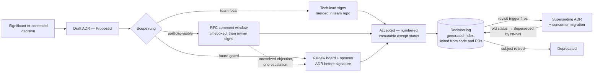

# Chapter 6.3 — ADRs & Decision Governance

| | |
|---|---|
| **Part** | 6 — Enterprise Architecture |
| **Maturity level** | 3 — Engineer |
| **Difficulty** | Advanced |
| **Estimated study time** | 2 h 10 min (reading 40 min, exercise 90 min) |
| **Prerequisites** | [1.4 Trade-off Analysis](../part-1-professional-foundation/chapter-04-tradeoff-analysis.md); [6.2](chapter-02-architecture-views-documentation.md) |

## Learning Objectives

After this chapter you will be able to:

1. Decide which decisions earn an [ADR](../../GLOSSARY.md) — the significance test plus the AI decision classes that always qualify — and write one a stranger can act on two years later.
2. Place any decision on the scope ladder (team-local, portfolio-visible, board-gated), name who signs each rung, and run the RFC and escalation machinery that closes contested decisions with dissent recorded.
3. Operate the status lifecycle: supersession with a consumer migration path, deprecation, and the immutability rule that keeps the log trustworthy.
4. Detect the four ADR anti-patterns — post-hoc justification, decision laundering, minutes-as-ADRs, orphaned records — and measure a log's health with three concrete metrics.

## Introduction

Chapter [1.4](../part-1-professional-foundation/chapter-04-tradeoff-analysis.md) taught you to make one architecture decision well; this chapter builds the organizational machinery around many of them. An Architecture Decision Record — a practice tracing to Michael Nygard's 2011 blog post — is a short, numbered, versioned document capturing one architecturally significant decision; a *decision log* is the accumulated set. *Decision governance* is everything that keeps the log honest: who may make which class of decision, when the record must exist relative to the commitment it describes, and what happens when reality invalidates a recorded choice. The distinction matters because the format is trivial to adopt and the governance is not — most failed ADR programs produced plenty of documents and no working memory. This chapter covers the working version: what earns a record, who signs at which scope, how decisions die, and how to tell whether your log is alive.

## Business Motivation

Unrecorded decisions bill the organization three ways. First, re-litigation: every senior-stakeholder change reopens settled questions, and the people re-arguing them are the most expensive people you employ. AI portfolios pay this tax at a premium because the technology turns over fast — every notable model release invites "should we switch providers?", and without a recorded decision carrying a [revisit trigger](../part-1-professional-foundation/chapter-04-tradeoff-analysis.md), that question is a standing argument rather than a monitored condition. Second, blind commitments: when the record is written after the contract, the trade-off analysis that would have caught the bad exit clause never ran — Vantora Systems paid roughly $140k to learn this (below). Third, evidence debt: regulators and enterprise customers increasingly ask *why* a system is built the way it is, and a maintained log answers in an afternoon what an archaeology project answers in a quarter — [6.11](chapter-11-model-risk-management.md)'s evidence-as-output economics, applied to decisions. Against all three, the practice is nearly free: one to two pages, written once, at the moment the thinking is already done.

## Theory

### What earns an ADR — significance, plus the AI mandatory classes

The general test is 1.4's: a decision earns a record when it is expensive to reverse, wide in blast radius, or genuinely contested — not merely because a meeting happened. Recording everything is how logs die; the trivial drowns the significant and readers stop reading.

For an AI portfolio, four decision classes clear the bar so reliably they should be mandatory — a design review that finds any of them undocumented should stop:

1. **Approach choice** — rules, classical ML, or GenAI. The [2.11](../part-2-artificial-intelligence/chapter-11-choosing-the-right-ai-approach.md) triage memo is this ADR's context section, already written; it doubles as the conceptual-soundness evidence a validator will later ask for.
2. **Model and provider selection** — which provider, API versus self-hosted, hosting geography. The shortest-half-life decisions in the portfolio, which makes the revisit trigger the most load-bearing line in the document.
3. **Data-use decisions** — what data may appear in prompts, be retained, be used for fine-tuning, or be shared under a vendor's terms. One-way doors with legal blast radius; they belong on the top rung of the ladder below.
4. **Autonomy level** — [workflow](../../GLOSSARY.md) versus [agent](../../GLOSSARY.md), and where human review sits. Raising autonomy later is a governed change, and the ADR is where the raise gets argued.

### A worked exhibit

The fastest way to internalize the form is to read a filled one. This is Vantora's, lightly condensed:

> **ADR-0017: Route all LLM provider access through the platform gateway**
>
> **Status:** Accepted · **Date:** 2025-11-04 · **Deciders:** Adaeze N. (platform lead, accountable); app-team leads (consulted); CISO, finance (informed)
>
> **Context.** Six product teams call three LLM providers through per-team SDK integrations. Provider keys live in six secret stores; spend is invisible until the invoice; March's model deprecation required six uncoordinated migrations; security cannot produce one egress audit trail.
>
> **Options.** (1) *Status quo, direct SDKs* — lowest latency, no platform dependency; no shared quota, cost, or audit view. (2) *Gateway-mediated access* — one egress point with auth, logging, quotas, and model-version pinning; adds a hop and makes the gateway Tier-1 infrastructure. (3) *Shared client library* — consistency without a runtime chokepoint; unenforceable, since teams can fork or bypass it.
>
> **Decision.** Option 2. All provider calls route through the platform gateway; direct SDK use leaves the golden path now and is blocked at network egress by end of Q2.
>
> **Consequences.** *Positive:* one audit log; per-team cost attribution; a provider swap becomes a gateway config change. *Negative, accepted:* ~30 ms added p50 latency; an on-call rota for the gateway; teams lose day-one access to new provider features until the gateway proxies them. *Revisit when:* gateway p99 overhead exceeds 80 ms for two consecutive weeks, or a product needs a provider capability the gateway cannot proxy within a sprint.

Notice what makes it durable. The context describes forces, not personalities, so it still reads in two years. The losing options have real pros — the analysis was live, not staged. The negative consequences are specific enough to check ("~30 ms", "on-call rota"), and the revisit trigger is measurable, so the next "should we reconsider?" is a metrics lookup rather than an opinion fight.

### The decision-scope ladder

One process weight for all decisions fails in both directions, so scope is triaged onto three rungs, each with a different signer and ceremony:

| Rung | What lives here | Who signs | Process |
|---|---|---|---|
| **Team-local** | Reversible within a sprint, blast radius one system: [chunking](../../GLOSSARY.md) strategy, [reranking](../../GLOSSARY.md) choice, eval harness internals | The team's tech lead | ADR merged in the team repo; the shared index picks it up; no wider review |
| **Portfolio-visible** | Crosses team boundaries or constrains future teams: gateway design, prompt-registry conventions, shared eval standards | A named accountable owner, after comments | RFC — the draft ADR circulated to affected teams with a timeboxed comment window (five working days is typical); silence is consent |
| **Board-gated** | One-way doors with legal or financial blast radius: provider contracts, data-use and residency, customer-facing autonomy | The review board ([6.9](chapter-09-architecture-governance.md)) plus an executive sponsor | Full trade-off analysis presented; ADR merged **before** the contract is signed or the capability ships |

Two governance rules make the ladder work. **Disagreement protocol:** the RFC window ends with a decision by the named owner, not with consensus; unresolved objections escalate once, to the review board, and the ADR records the dissent and the disagree-and-commit ([1.8](../part-1-professional-foundation/chapter-08-leadership-influence.md)) by name — which later lets the dissenter say "reopen per my recorded objection" instead of "I told you so." **Contract effect:** from the portfolio rung up, an accepted ADR is an inter-team contract — other teams build against it, so changing it requires supersession with a migration path, never a quiet edit.

### The status lifecycle and supersession

An ADR moves through a small state machine: **Proposed → Accepted → (Superseded by ADR-NNNN | Deprecated)**. Only Proposed drafts may be edited freely; once accepted, the document is immutable *except its status field* — a log whose past entries can be rewritten proves nothing to anyone.

Supersession is how decisions die well. When a revisit trigger fires (or reality invalidates the decision another way), you write a *new* ADR whose context section opens with what changed; the old ADR's status becomes "Superseded by ADR-NNNN," a forward pointer redirecting any reader who lands on it. Because portfolio-rung decisions have consumers, the superseding ADR's consequences must name them and state the migration window — teams that had built on ADR-0009's per-team SDK pattern did not discover ADR-0017 by surprise; the document told them what changes and by when. Deprecation, the rarer exit, marks a decision whose subject was retired outright — no successor.

This repository's own log is a live exhibit: [ADR-0004](../../adr/ADR-0004-reposition-to-ai-solution-architect.md) repositioned the whole curriculum's scope, explicitly resolves a question ADR-0002 had left open, and carries a two-branch revisit trigger naming both its success condition (parity targets → rebrand) and its fallback if progress stalls. A decision that plans its own supersession is the mature form.

### Metrics of a healthy log

You cannot inspect ADR quality at scale, but you can measure the log:

1. **Contested-decision coverage.** Sample last quarter's arguments that outlived one meeting; what fraction ended in a merged ADR? The failure signature is a load-bearing architecture fact that exists only as folklore.
2. **Findability.** The stranger test: someone outside the deciding team, starting from the index, finds the ADR answering "why do we do X?" in under five minutes. Track median time-to-find; an unfindable record loses to institutional memory, and re-litigation returns.
3. **Supersession hygiene.** Zero accepted ADRs contradicting current reality; every superseded record carries its forward pointer; every fired revisit trigger re-scored or explicitly reaffirmed within a quarter. A laundering check belongs here too: merge dates should precede the contract and implementation dates they authorize.

## Architecture Perspective

Physical layout matters as much as the flow. ADRs live in version control next to what they govern, because version control gives authorship, dates, and review for free — exactly the fields laundering detection needs. A generated index spans the repos so the stranger test has one starting point; numbers are sequential and never reused, so "per 0017" stays a stable citation in code comments and runbooks. The reverse links are the underused half: an implementation PR that cites its ADR gives the future maintainer a one-hop path from *what* to *why*.

## Real-world Example

**Vantora Systems** (the platform arc) built its decision log twice. The first attempt was a mandate: a wiki space named "Architecture Decisions," template attached, every team instructed to record decisions there. Two quarters later it held 143 pages — retitled sync notes and, buried among them, three genuinely significant decisions with no numbering and no status fields. The test that exposed it was small: a new team lead asked why inference ran only in a US region when her customers were mostly European. The answer existed — as a paragraph inside "Platform Sync 2024-08-19" — and nobody could find it; the decision got re-argued for three weeks and re-decided the same way.

The expensive failure was quieter. A product team evaluated a transcription vendor, signed a one-year contract, and wrote the "decision record" three weeks afterward, listing two alternatives no one had seriously assessed. The review board approved a decision that was already irreversible — decision laundering, working as designed. When the vendor deprecated the underlying model mid-contract, the exit clause nobody had scrutinized left Vantora paying roughly $140k for capacity it no longer used; the analysis that catches bad exit terms was never run, because the record came after the signature.

The rebuild took the shape this chapter describes: ADRs in repos with a generated index, the three-rung ladder, and one enforcement rule with teeth — procurement would not countersign a vendor contract without a merged board-gated ADR number. That rule had a price, and Adaeze paid it knowingly: a launch slipped two weeks waiting on a provider-selection ADR, the team lead escalated, and she held the gate. For the decision class that had already burned them, the velocity cost was the accepted consequence — and she wrote *that* down too.

## Hands-on Exercise

~90 minutes, using your own portfolio or a case study's.

1. **Ladder triage (15 min).** List ten decisions from an AI initiative (mix approach choice, provider, data-use, chunking, eval conventions, autonomy). Place each on a rung and name the signer role. At least one should be "no ADR — below significance," with reasoning.
2. **Write the ADR (30 min).** Pick one portfolio-visible decision and write the full record against the [template](../../templates/adr-template.md): context a stranger can follow, at least two losing options with genuine pros, checkable negative consequences, a measurable revisit trigger.
3. **Supersession drill (25 min).** Eighteen months pass and your trigger fires. Write the superseding ADR's context section (what changed), the exact status-line edit to the old record, and a one-paragraph consumer note naming who must migrate and by when.
4. **Log audit (20 min).** Audit this repository's [adr/ directory](../../adr/) against the three health metrics. Score each and write one concrete finding — for example, which ADR's revisit trigger is closest to firing, and what checking it would involve.

**Acceptance criteria:**
- [ ] Ten decisions placed on rungs with named signer roles, including one justified non-ADR
- [ ] ADR contains ≥2 losing options with real pros, checkable negative consequences, and a measurable revisit trigger
- [ ] Supersession drill includes the forward-pointer status edit and a consumer migration note
- [ ] Log audit scores all three metrics and states one specific finding

## Enterprise Considerations

At enterprise scale the governance questions are placement and enforcement. Placement: the decision log conforms to the EA function's documentation standards ([6.2](chapter-02-architecture-views-documentation.md)) rather than running as a parallel AI-only archive, and the board rung is the existing architecture review board ([6.9](chapter-09-architecture-governance.md)) with the AI decision classes added to its docket — a second board for AI decisions fragments precisely the memory the log exists to hold. Enforcement lives at commitment points, not in policy documents: procurement holds vendor signatures for a board-gated ADR number, and the platform's golden-path review asks for the ADR link in the design PR. Compliance is a beneficiary rather than a driver: the log is the documented "why" that privacy audits ([4.14](../part-4-enterprise-genai-systems/chapter-14-privacy-compliance-governance.md)) and model-risk validation (6.11) otherwise reconstruct at consulting rates. And the practice scales down honestly — a twenty-person company collapses the ladder to two rungs (team-local, founder-gated) and keeps the rest: numbering, immutability, triggers, the stranger test.

## Trade-offs

| Decision | Option A | Option B | Choose A when… | Choose B when… |
|----------|----------|----------|----------------|----------------|
| Log placement | In-repo per team + generated index | Single central store | Teams own repos and decisions ship with code — authorship and dates come free | Small org, or decision-makers who will never open a repo; accept weaker laundering detection |
| Sign-off model | One named accountable signer per rung | Committee consensus | Default — speed and accountability; consulted parties comment, one person signs | True one-way doors with legal/financial blast radius; that is what the board rung is for |
| RFC window | Timeboxed, silence is consent | Open until consensus | Default — decisions close on a date | First-of-class decisions where the affected-team list itself is unknown; extend once, not indefinitely |
| Changing an accepted ADR | Supersede with a new numbered record | Edit in place | Always for Accepted status — the history is the audit asset | Only while status is Proposed; drafts are meant to be edited |

## Common Mistakes

1. **Post-hoc justification.** The system is built, works, and then the ADR is written — options reverse-engineered so the winner wins. Detectable because the losing options have hollow pros and the negatives are vague. The fix is timing, not exhortation: the ADR merges before the implementation PR opens.
2. **Decision laundering.** The vendor edition of the same disease: contract signed, then the record written for the board to bless. Vantora's $140k exit clause is the canonical outcome — the analysis ran after it could matter. Only enforcement at the signature point (procurement requires the ADR number) survives deadline pressure.
3. **ADR-as-meeting-minutes.** The log fills with retitled sync notes; Vantora's first attempt buried three real decisions in 143 pages. One decision per record, minutes elsewhere — a log's value is inversely related to its noise floor.
4. **Orphaned ADRs.** Written, correct, and unfindable — a wiki silo, no numbering, no links from code. An unfindable record loses every argument with institutional memory, so re-litigation returns while the paperwork burden stays.
5. **The frozen status field.** Reality moved and the statuses did not; two Accepted ADRs now contradict each other and readers can no longer tell which records are load-bearing. Trust in a log is binary, and it does not return by memo.
6. **Template maximalism.** A mandatory three-page form with risk matrices and sign-off grids; teams comply for a month, then stop writing records at all. The two-page ceiling is a survival constraint, not a style preference.

## Best Practices

1. **One decision per ADR; sequential numbers, never reused** — "per 0017" must stay a stable citation for years.
2. **Merge before commitment** — before the implementation PR, before the vendor signature; the record's date is your laundering defense.
3. **Immutable once Accepted, except the status line** — corrections and reversals are new numbered records, not edits.
4. **Write context for the stranger two years out** — forces and constraints, not meeting attendance; the exhibit above is the register to imitate.
5. **Record dissent and the disagree-and-commit by name** — it closes the argument now and licenses a clean reopen when the trigger fires.
6. **Link both ways** — design PRs cite their ADR; the generated index gives the stranger test its starting point.
7. **Walk revisit triggers quarterly** — each fired trigger re-scored or explicitly reaffirmed; a trigger nobody checks is a comment, not a control.

## Architecture Checklist

For an AI portfolio's decision governance:

- [ ] The four mandatory AI decision classes (approach, model/provider, data-use, autonomy) each have a merged ADR per system
- [ ] Every recorded decision sits on a ladder rung with a named signer; board-gated classes are enumerated in writing
- [ ] ADR merge dates precede the implementation PRs and vendor signatures they authorize
- [ ] No Accepted ADR contradicts current reality; superseded records carry forward pointers; consumers of superseded decisions have migration notes
- [ ] Revisit triggers are measurable and walked on a stated cadence
- [ ] The log passes the stranger test — five minutes from index to answer, for someone outside the deciding team
- [ ] Dissent and escalation outcomes appear in the records, not only in memories

## Interview Questions

1. *"We have 400 ADRs and nobody reads them. Diagnose."* — Strong answers reach for the health metrics rather than more process: check the noise floor (minutes-as-ADRs), run the stranger test, audit status hygiene. The prescription is usually deletion and re-indexing before any new writing.
2. *"When would you refuse to write an ADR?"* — Strong answers show the significance test cutting both ways: reversible, team-local, uncontested choices are recorded in code review if at all, because a log that records everything protects nothing — with the counter-edge that the four AI mandatory classes never get this exemption.
3. *"A new VP wants to reverse your provider decision. Walk me through it."* — Strong answers pull the ADR, check whether its revisit trigger has fired, and either re-score with the changed inputs or reaffirm — one meeting against a recorded baseline, not a from-scratch re-fight. Bonus signal: if the VP's argument is good and the trigger never anticipated it, the outcome is a superseding ADR, not an edit.
4. *"How do you stop ADRs becoming paperwork written after the fact?"* — Strong answers put enforcement at commitment points (procurement requires the ADR number; design-PR review requires the link) and name the post-hoc signature: hollow losing options, merge dates trailing signatures.

## Further Reading

- Michael Nygard, "Documenting Architecture Decisions" (2011) — the original blog post; still the best five-minute statement of why context and consequences are the load-bearing sections.
- [adr.github.io](https://adr.github.io) — the ADR community's collected templates, examples, and tooling for maintaining logs in version control.
- This repository's [adr/ directory](../../adr/) — four real records governing the curriculum itself, including ADR-0004's self-superseding trigger design; the object of this chapter's audit exercise.
- [1.4 Trade-off Analysis](../part-1-professional-foundation/chapter-04-tradeoff-analysis.md) and [6.9 Architecture Governance](chapter-09-architecture-governance.md) — the analysis inside a single record, and the board that signs the top rung.

## Summary

- An ADR records one architecturally significant decision; decision governance is the surrounding machinery — scope-based sign-off, timing enforcement, lifecycle hygiene — that keeps the log a working memory rather than a paperwork graveyard.
- Four AI decision classes always earn records: approach choice (the 2.11 triage), model/provider selection, data-use decisions, and autonomy level — with the revisit trigger the most load-bearing line in a fast-moving portfolio.
- The scope ladder assigns process to blast radius: tech leads sign team-local decisions, a named owner signs portfolio-visible ones after a timeboxed RFC, and the review board plus a sponsor signs one-way doors — with the ADR merged before any signature.
- Decisions die by supersession: a new numbered record explains what changed and names its consumers' migration path, while the old record becomes an immutable, forward-pointing part of history.
- Log health is measurable — contested-decision coverage, the stranger findability test, supersession hygiene — and the anti-patterns (laundering, post-hoc justification, minutes, orphans) are defeated at commitment points, not by policy memos. How the decided-upon systems connect to the rest of the enterprise is next: **enterprise integration patterns** ([6.4](chapter-04-enterprise-integration.md)).

---

**Previous:** [Chapter 6.2 — Architecture Views & Documentation](chapter-02-architecture-views-documentation.md) · **Next:** [Chapter 6.4 — Enterprise Integration Patterns](chapter-04-enterprise-integration.md) · **Related:** [1.4 Trade-off Analysis](../part-1-professional-foundation/chapter-04-tradeoff-analysis.md), [6.9 Architecture Governance](chapter-09-architecture-governance.md), [ADR template](../../templates/adr-template.md)
