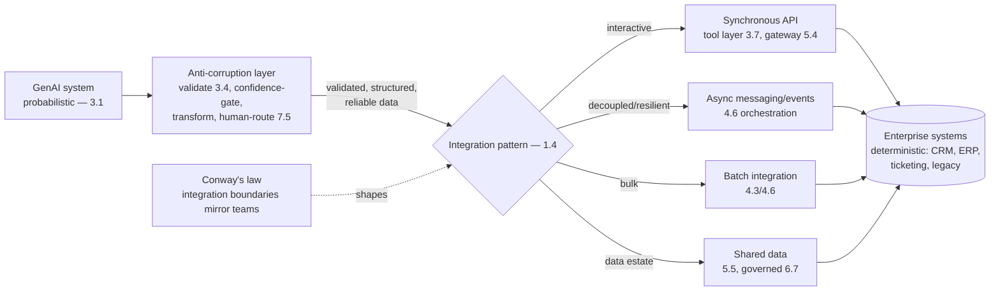

# Chapter 6.4 — Enterprise Integration Patterns

| | |
|---|---|
| **Part** | 6 — Enterprise Architecture |
| **Maturity level** | 4 — Architect |
| **Difficulty** | Advanced |
| **Estimated study time** | 3 hours (reading 90 min, exercise 90 min) |
| **Prerequisites** | [3.7 Function Calling & Tool Use](../part-3-core-building-blocks-of-genai/chapter-07-function-calling-tool-use.md); [5.4](../part-5-cloud-infrastructure-platform/chapter-04-api-integration-layer.md) |

## Learning Objectives

After this chapter you will be able to:

1. Integrate GenAI into an existing enterprise estate using the classical integration patterns — events, messaging, APIs, batch — matched to the GenAI needs.
2. Design the anti-corruption layer between probabilistic GenAI and the deterministic enterprise systems it must work with.
3. Handle the integration realities: the legacy systems, the data flows, and the Conway's-law organizational boundaries the integration crosses.
4. Place GenAI integration in the enterprise-integration context: the tool layer (3.7) and gateway (5.4) as the integration surfaces, extended to the full estate.

## Introduction

GenAI systems don't exist in isolation — they integrate with the existing enterprise estate (the CRMs, ERPs, ticketing systems, databases, and legacy applications that run the business), and this chapter is that integration: the classical enterprise-integration patterns (events, messaging, APIs, batch — the discipline that predates GenAI by decades) applied to the GenAI-specific needs. 3.7 built the tool layer (the model's integration surface — the tools it calls), and 5.4 built the gateway (the application's integration surface — how applications reach models); this chapter extends integration to the *full estate* — how the GenAI systems integrate with the enterprise's existing systems, which is where the tool layer (3.7) becomes enterprise integration and the anti-corruption layer (the boundary between probabilistic GenAI and deterministic enterprise systems) becomes the key pattern.

The framing: **GenAI integration is classical enterprise integration with an anti-corruption layer between the probabilistic and the deterministic** — the events, messaging, APIs, and batch patterns are the classical discipline (Hohpe's enterprise integration patterns), and the GenAI-specific addition is the anti-corruption layer that keeps the probabilistic GenAI (variable, occasionally-wrong — 3.1) from corrupting the deterministic enterprise systems (which expect correct, structured, reliable data — 3.4's type boundary, at the enterprise scale).

## Business Motivation

Integration is where GenAI's value is realized or stranded — the value concentrates in the last hop where the GenAI output drives the existing enterprise systems (3.4's integration-is-where-value-concentrates, at the enterprise scale). The pattern from the case studies (Bellhaven's intake driving the rating engine, Corvid's extraction driving the customs systems, Kestrel's correspondence driving the claims workflow): the GenAI reads the mess and produces the structure, and the *integration* into the existing systems is what turns the structure into business value (the payload that enters the rating engine, the ticket that updates the ticketing system) — an un-integrated GenAI system (the output a human re-types into the existing system) saved nobody anything (3.4's re-typed-workflow). The integration failures are costly: the probabilistic GenAI output corrupting the deterministic enterprise systems (the hallucinated value flowing into the ERP, the wrong extraction driving the wrong action — 3.4's valid-but-wrong, at the enterprise scale, with the enterprise-data-quality consequences — 2.2/5.5), and the brittle integration (the tight coupling to a legacy system that breaks on the legacy system's change). The business case is the integration-realizes-value one: the well-integrated GenAI system drives the existing enterprise systems reliably (the value realized), with the anti-corruption layer protecting the deterministic systems from the probabilistic GenAI's variability — and the integration discipline (the classical patterns, the anti-corruption layer) is what makes the integration reliable and evolvable rather than brittle and corruption-prone.

## Theory

### The classical integration patterns (GenAI-applied)

The enterprise integration patterns (Hohpe's classical discipline), matched to GenAI:

- **Synchronous APIs** — request-response integration (the GenAI system calls an enterprise API, or is called by one); the tool layer (3.7) is this (the model's tools calling enterprise APIs), and the gateway (5.4) exposes the GenAI as an API. Best for the interactive, low-latency integration (the real-time enterprise-system call).
- **Asynchronous messaging / events** — the GenAI system produces or consumes events/messages (the extracted structure published as an event the enterprise systems consume, the enterprise event triggering a GenAI workflow — 4.6); best for the decoupled, resilient integration (the GenAI and the enterprise systems decoupled via the message queue — 4.6's orchestration, integration edition), which scales (5.8) and tolerates the GenAI's variable latency (4.12).
- **Batch integration** — the bulk, scheduled integration (the batch GenAI processing — 4.3's ingestion, 4.6's batch lane — driving the enterprise systems in bulk); best for the latency-tolerant, high-volume integration.
- **Shared data / database integration** — the GenAI and the enterprise systems sharing data (the structured output — 3.4 — written to the shared database the enterprise systems read); the integration via the data estate (5.5), with the data-governance (6.7) and quality (2.2/5.5) implications.

The pattern-matching (1.4): the integration pattern matched to the need (synchronous for interactive, async for decoupled/resilient, batch for bulk, shared-data for the data-estate integration) — the classical integration discipline, GenAI-applied.

### The anti-corruption layer

The GenAI-specific integration pattern (the boundary between probabilistic and deterministic):

- **The problem** — the GenAI is probabilistic (variable, occasionally-wrong — 3.1), and the enterprise systems are deterministic (they expect correct, structured, reliable data — the rating engine expects a valid submission, the ERP expects a correct value); the probabilistic GenAI output flowing directly into the deterministic systems risks corruption (the hallucinated value, the wrong extraction — 3.4's valid-but-wrong, at the enterprise scale).
- **The anti-corruption layer (ACL — note: distinct from access-control lists)** — the boundary layer (3.4's type boundary and validation pipeline, at the enterprise integration scale) that protects the deterministic systems from the probabilistic GenAI: the GenAI output validated (3.4's schema and semantic validation, the anti-fabrication checks), the confidence-gated (the low-confidence output routed to human review — 3.1/7.5, not straight into the enterprise system), and the transformed into the deterministic systems' expected form — so the enterprise systems receive validated, structured, reliable data, and the GenAI's variability is contained at the boundary.
- **The pattern's discipline** — the anti-corruption layer is where the type boundary (3.4) meets the enterprise integration: the GenAI output never flows raw into the enterprise systems (the validation, confidence-gating, and human-review-routing at the boundary), which is what makes the integration reliable (the enterprise systems protected from the GenAI's variability) and what keeps the enterprise data quality (2.2/5.5) from being corrupted by the probabilistic GenAI.

### The integration realities

The realities the integration crosses:

- **Legacy systems** — the enterprise estate includes legacy systems (old, brittle, poorly-documented, hard to change — 6.8's modernization territory); the integration handles them (the adapter/anti-corruption layer isolating the GenAI from the legacy system's quirks, the legacy system's change-fragility isolated), and 6.8 addresses the modernization.
- **The data flows** — the integration is data flowing between the GenAI and the enterprise systems (the structured output — 3.4, the events, the shared data), with the data-governance (6.7), quality (2.2/5.5), and lineage (5.5) implications (the GenAI-produced data entering the enterprise data estate carries its provenance — 3.4/5.5).
- **Conway's law** — the integration crosses organizational boundaries (the GenAI team and the teams owning the enterprise systems), and the integration architecture reflects the org structure (Conway's law — the integration boundaries mirror the team boundaries); the integration is partly an organizational-coordination concern (1.8's influence, the enterprise-system teams as stakeholders — 1.6), which 6.8's adoption and 8.7's team-building address.

## Architecture Perspective

Readings. **The anti-corruption layer is the GenAI-specific integration keystone** — it's the type boundary (3.4) at the enterprise integration scale, protecting the deterministic enterprise systems from the probabilistic GenAI's variability (validate, confidence-gate, transform, human-route the low-confidence) — so the enterprise systems receive reliable data and the GenAI's occasionally-wrong output (3.1) never corrupts the enterprise data estate (2.2/5.5); the integration that skips the anti-corruption layer is the hallucinated-value-in-the-ERP incident. **The classical patterns are matched to the need** — synchronous (the tool layer 3.7, the gateway 5.4) for interactive, async/events (4.6) for decoupled and resilient (tolerating the GenAI's variable latency — 4.12), batch (4.3/4.6) for bulk, shared-data (5.5) for the data-estate integration — the classical enterprise-integration discipline (Hohpe), GenAI-applied. **And Conway's law shapes the integration** — the integration crosses organizational boundaries (the GenAI team and the enterprise-system teams), and the integration architecture reflects the org structure, making the integration partly an organizational-coordination concern (1.8's influence, the enterprise-system teams as stakeholders — 1.6) that 6.8's adoption and 8.7's team-building address.

## Real-world Example

**Bellhaven Insurance** (the recurring intake platform — 2.1, 3.4) is the enterprise-integration example because the intake platform's value was entirely in its integration with the existing systems (the rating engine, the policy admin system, the legacy submission database), and the integration is where 3.4's type boundary became enterprise integration. The anti-corruption layer was the keystone: the intake platform's GenAI extraction (2.1's LLM reading the broker submissions) produced structured output (3.4's schema), but that output *never* flowed raw into the deterministic rating engine — the anti-corruption layer (3.4's validation pipeline, at the enterprise integration scale) validated it (schema, semantic, the anti-fabrication span checks — 3.4), confidence-gated it (the low-confidence extractions routed to underwriter review — 7.5, not straight into the rating engine), and transformed it into the rating engine's expected form — so the rating engine (deterministic, expecting valid submissions) received validated, structured, reliable data, and the GenAI's variability (the occasional wrong extraction — 3.1) was contained at the boundary (the v3-schema-treaty of 3.4, now the anti-corruption layer). The integration patterns were matched: synchronous API for the interactive extraction (the underwriter's real-time submission processing — the tool layer 3.7, the gateway 5.4), async events for the decoupled bulk processing (the daily submission wave published as events the downstream systems consumed — 4.6, decoupling the GenAI from the enterprise systems' availability), and shared-data integration for the submission database (the structured output written to the shared database, governed — 6.7, with provenance — 3.4/5.5). The legacy reality was handled: the legacy submission database (old, brittle) was isolated behind an adapter (the anti-corruption layer isolating the GenAI from the legacy system's quirks), so the legacy system's change-fragility didn't propagate to the GenAI. And Conway's law was visible: the integration crossed the intake team and the rating-engine team (the treaty of 3.4 was an inter-team contract — 6.3's decision governance, integration edition), an organizational-coordination as much as a technical one. Tomás's integration note: *"The intake platform's value was never the extraction — it was the extraction *integrated* into the rating engine. The anti-corruption layer is the whole game: the probabilistic GenAI produces, the boundary validates and confidence-gates, and the deterministic rating engine receives reliable data. The GenAI's occasional wrong extraction stops at the boundary — it never corrupts the rating engine. That's how GenAI integrates with the enterprise: classical patterns for the flow, an anti-corruption layer for the probabilistic-meets-deterministic."*

## Hands-on Exercise

**Design the GenAI-to-enterprise integration.** ~90 minutes. For a GenAI system integrating with enterprise systems (real or a case study's).

1. **Integration pattern selection (25 min).** For a GenAI system integrating with 3–4 enterprise systems, select the integration pattern per system (synchronous API, async events, batch, shared-data) matched to the need (interactive/decoupled/bulk/data-estate — 1.4). Justify each.
2. **The anti-corruption layer (35 min).** Design the anti-corruption layer between the GenAI and one deterministic enterprise system: the validation (3.4 — schema, semantic, anti-fabrication), the confidence-gating (low-confidence → human review — 7.5), the transformation (into the enterprise system's form), and how it protects the enterprise system from the GenAI's variability. Show what would go wrong without it (the corruption — 3.4's valid-but-wrong in the enterprise system).
3. **Legacy handling (15 min).** For one legacy enterprise system, design the adapter/isolation (the anti-corruption layer isolating the GenAI from the legacy quirks and change-fragility), and note the 6.8 modernization relationship.
4. **Conway's law (15 min).** Identify the organizational boundaries the integration crosses (the GenAI team, the enterprise-system teams), and describe the coordination (the inter-team contract — 6.3, the stakeholders — 1.6) the integration requires.

**Acceptance criteria:**
- [ ] Integration patterns matched to needs per enterprise system (1.4)
- [ ] Anti-corruption layer designed (validate, confidence-gate, transform, human-route) with the without-it corruption shown
- [ ] Legacy handling isolates the GenAI from the legacy quirks and change-fragility
- [ ] Conway's-law organizational boundaries and coordination identified

## Enterprise Considerations

Enterprise GenAI integration is deeply entangled with the existing enterprise-integration estate and organizational structure. **It conforms to the enterprise integration standards** (6.1, 5.1's conform): most enterprises have integration standards (the API standards, the messaging/event platform, the integration patterns — the EA function's — 6.1), and the GenAI integration conforms to them (integrate-don't-parallel, integration edition) rather than a parallel GenAI integration approach — the GenAI systems integrate via the enterprise's existing integration infrastructure. **The anti-corruption layer is a data-quality control** (2.2/5.5/6.7): the anti-corruption layer protecting the enterprise systems from the probabilistic GenAI is a data-quality control at the enterprise scale (the GenAI-produced data entering the enterprise data estate is validated and confidence-gated at the boundary — 6.7's governance), so the integration serves the data governance (6.7). **Legacy modernization interacts** (6.8): the integration with legacy systems is entangled with the legacy modernization strategy (6.8 — modernize the legacy, or isolate it behind the anti-corruption layer), a 6.8 decision. **And the organizational coordination is significant** (1.8, 8.7): the integration crosses the enterprise-system teams (Conway's law), so the integration is an organizational-coordination effort (the enterprise-system teams as stakeholders — 1.6, the inter-team contracts — 6.3, the influence — 1.8) that the AI architect navigates — the integration is as much organizational as technical.

## Trade-offs

| Decision | Option A | Option B | Choose A when… | Choose B when… |
|----------|----------|----------|----------------|----------------|
| Integration pattern | Async events (decoupled) | Synchronous API | Decoupling, resilience, variable latency tolerance (4.12/5.8) | Interactive, low-latency, request-response needs |
| Anti-corruption layer | Always present (validate, gate, transform) | GenAI output direct to enterprise system | Always — protects the deterministic systems from the probabilistic GenAI | Never direct; the raw GenAI output corrupts the enterprise data (3.4) |
| Legacy integration | Isolate behind an adapter/anti-corruption layer | Tight coupling to the legacy system | Default — isolates the GenAI from the legacy fragility | Never tight-couple to brittle legacy; the modernization (6.8) decides the longer term |
| Integration approach | Conform to the enterprise integration standards | A parallel GenAI integration | Always — integrate-don't-parallel (integration edition) | Never; the parallel approach fragments the integration estate |

## Common Mistakes

1. **No anti-corruption layer** — the probabilistic GenAI output flowing raw into the deterministic enterprise systems, corrupting the enterprise data (the hallucinated value in the ERP, the wrong extraction driving the wrong action — 3.4's valid-but-wrong at enterprise scale); the anti-corruption layer is the keystone.
2. **Un-integrated GenAI** — the GenAI output a human re-types into the enterprise system (3.4's re-typed workflow), stranding the value; the integration is where the value is realized.
3. **Wrong integration pattern** — synchronous coupling where async decoupling was needed (the GenAI's variable latency — 4.12 — breaking the synchronous integration), or vice versa; match the pattern to the need (1.4).
4. **Tight coupling to legacy** — the GenAI tightly coupled to a brittle legacy system that breaks on the legacy's change; isolate behind an adapter/anti-corruption layer.
5. **Ignoring the data-quality role** — the anti-corruption layer not treated as a data-quality control (the GenAI-produced data entering the enterprise estate un-validated — 2.2/5.5/6.7); the boundary is a data-quality control.
6. **The parallel GenAI integration** — a GenAI integration approach disconnected from the enterprise integration standards (6.1); conform, don't parallel.
7. **Ignoring Conway's law** — treating the integration as purely technical, missing the organizational coordination (the enterprise-system teams as stakeholders — 1.6, the inter-team contracts — 6.3); the integration is organizational as much as technical.

## Best Practices

1. **Always put an anti-corruption layer between the GenAI and the deterministic systems** — validate (3.4), confidence-gate (low-confidence → human — 7.5), transform; the keystone that protects the enterprise systems from the GenAI's variability (3.1).
2. **Match the integration pattern to the need** — synchronous (tool layer 3.7, gateway 5.4) for interactive, async/events (4.6) for decoupled/resilient, batch (4.3/4.6) for bulk, shared-data (5.5) for the data estate (1.4's classical integration discipline).
3. **Isolate legacy systems behind adapters** — the anti-corruption layer isolating the GenAI from the legacy quirks and change-fragility, with the 6.8 modernization for the longer term.
4. **Treat the anti-corruption layer as a data-quality control** — the GenAI-produced data validated and confidence-gated at the boundary before entering the enterprise data estate (2.2/5.5/6.7).
5. **Conform to the enterprise integration standards** — integrate-don't-parallel (6.1/5.1), the GenAI integrating via the enterprise's existing integration infrastructure.
6. **Carry provenance through the integration** — the GenAI-produced data carrying its provenance (3.4/5.5) into the enterprise systems for lineage and auditability (4.14).
7. **Navigate the organizational coordination** — the enterprise-system teams as stakeholders (1.6), the inter-team contracts (6.3), the influence (1.8) — the integration is organizational as much as technical (Conway's law).

## Architecture Checklist

For GenAI integration with the enterprise estate:

- [ ] An anti-corruption layer between the GenAI and each deterministic enterprise system: validate (3.4), confidence-gate (7.5), transform, protecting from the GenAI's variability
- [ ] Integration patterns matched to needs (synchronous/async/batch/shared-data — 1.4) per enterprise system
- [ ] Legacy systems isolated behind adapters; the 6.8 modernization relationship noted
- [ ] The anti-corruption layer serves as a data-quality control (2.2/5.5/6.7); GenAI-produced data validated before entering the enterprise estate
- [ ] Conforms to the enterprise integration standards (6.1/5.1); no parallel GenAI integration
- [ ] Provenance carried through the integration (3.4/5.5) for lineage and audit (4.14)
- [ ] The organizational coordination navigated (enterprise-system teams as stakeholders — 1.6, inter-team contracts — 6.3, Conway's law)

## Interview Questions

1. *"How do you integrate a GenAI system with existing enterprise systems?"* — Strong answers use the classical integration patterns (synchronous/async/batch/shared-data matched to need — 1.4) *and* the anti-corruption layer (the GenAI-specific keystone — the boundary protecting the deterministic enterprise systems from the probabilistic GenAI via validation, confidence-gating, transformation — 3.4/3.1), and note the integration is where the value is realized (3.4).
2. *"What's the anti-corruption layer and why is it essential for GenAI integration?"* — Strong answers explain the probabilistic-meets-deterministic problem (the GenAI is variable/occasionally-wrong — 3.1, the enterprise systems expect correct/reliable data), the anti-corruption layer as the boundary (3.4's type boundary at enterprise scale — validate, confidence-gate, transform, human-route) that contains the GenAI's variability, and the without-it corruption (the hallucinated value in the ERP — Bellhaven's rating-engine protection).
3. *"How do you handle integration with a brittle legacy system?"* — Strong answers isolate behind an adapter/anti-corruption layer (the GenAI isolated from the legacy quirks and change-fragility), note the data-quality and provenance flows (5.5), and connect to the 6.8 modernization decision (isolate now, modernize the legacy over time).
4. *"What makes enterprise GenAI integration as much organizational as technical?"* — Strong answers name Conway's law (the integration crosses the enterprise-system teams, the integration architecture reflects the org structure), the enterprise-system teams as stakeholders (1.6) with the inter-team contracts (6.3) and the influence (1.8), and the integration as an organizational-coordination effort the AI architect navigates.

## Further Reading

- Gregor Hohpe & Bobby Woolf, *Enterprise Integration Patterns* — the classical integration-patterns discipline (messaging, events, routing, transformation) this chapter applies to GenAI; the definitive reference.
- Eric Evans, *Domain-Driven Design* (the anti-corruption layer pattern) — the source of the anti-corruption-layer concept this chapter centers for the probabilistic-meets-deterministic boundary.
- 3.4 Structured Outputs (the type boundary) and 3.7 Function Calling & Tool Use (the model's integration surface) — the GenAI-side integration this chapter extends to the enterprise; 5.4 (the gateway) is the application-side surface.
- 6.8 Legacy Modernization & AI Adoption Strategy — the legacy-integration and modernization relationship this chapter connects to.

## Summary

- GenAI integration is **classical enterprise integration with an anti-corruption layer** between the probabilistic GenAI and the deterministic enterprise systems — the events, messaging, APIs, and batch patterns (Hohpe) are the classical discipline, and the anti-corruption layer is the GenAI-specific keystone.
- **The anti-corruption layer** (3.4's type boundary at enterprise scale) protects the deterministic systems from the probabilistic GenAI — validate, confidence-gate (low-confidence → human — 7.5), transform — so the enterprise systems receive reliable data and the GenAI's occasional wrong output (3.1) never corrupts the enterprise data estate (2.2/5.5).
- **The classical patterns are matched to the need** — synchronous (tool layer 3.7, gateway 5.4) for interactive, async/events (4.6) for decoupled/resilient, batch (4.3/4.6) for bulk, shared-data (5.5) for the data estate.
- **Integration is where GenAI's value is realized** (3.4) — the last hop where the GenAI output drives the existing enterprise systems, and the un-integrated GenAI (the re-typed output) strands the value.
- The integration is **organizational as much as technical** (Conway's law) — crossing the enterprise-system teams (stakeholders — 1.6, inter-team contracts — 6.3, influence — 1.8), conforming to the enterprise integration standards (6.1). The security architecture that spans this integrated estate is next: **security architecture & zero trust** (6.5).

---

**Previous:** [Chapter 6.3 — ADRs & Decision Governance](chapter-03-adrs-decision-governance.md) · **Next:** [Chapter 6.5 — Security Architecture & Zero Trust](chapter-05-security-architecture-zero-trust.md) · **Related:** [3.4 Structured Outputs](../part-3-core-building-blocks-of-genai/chapter-04-structured-outputs.md), [3.7 Function Calling & Tool Use](../part-3-core-building-blocks-of-genai/chapter-07-function-calling-tool-use.md), [6.8 Legacy Modernization & AI Adoption Strategy](chapter-08-legacy-modernization-ai-adoption.md)
