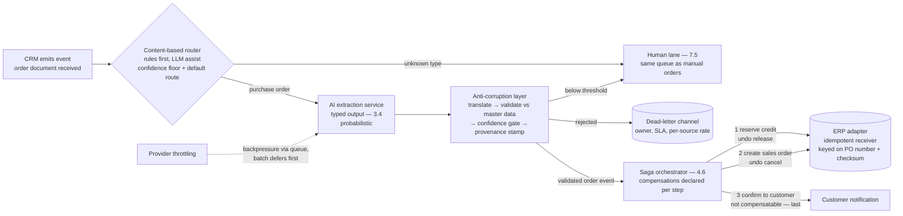

# Chapter 6.4 — Enterprise Integration Patterns

| | |
|---|---|
| **Part** | 6 — Enterprise Architecture |
| **Maturity level** | 4 — Architect |
| **Difficulty** | Advanced |
| **Estimated study time** | 2.5 hours (reading 40 min, exercise ~2 h) |
| **Prerequisites** | [3.7 Function Calling & Tool Use](../part-3-core-building-blocks-of-genai/chapter-07-function-calling-tool-use.md); [4.6](../part-4-enterprise-genai-systems/chapter-06-orchestration-workflows.md); [5.4](../part-5-cloud-infrastructure-platform/chapter-04-api-integration-layer.md) |

## Learning Objectives

After this chapter you will be able to:

1. Apply the Hohpe & Woolf messaging patterns — content-based router, message translator, idempotent receiver, dead-letter channel — at the AI boundary, and name which failure mode each one absorbs.
2. Design the anti-corruption layer (ACL) as the point where probabilistic AI output becomes deterministic enterprise data, and position the other patterns around it.
3. Choose synchronous, asynchronous, or event-driven integration from an AI system's latency and cost profile, including backpressure behavior when the model provider throttles.
4. Design saga-style compensation for multi-step agent workflows that write to systems of record — including the ordering rule for steps that cannot be undone.

## Introduction

[3.7](../part-3-core-building-blocks-of-genai/chapter-07-function-calling-tool-use.md) built the model's integration surface (tools) and [5.4](../part-5-cloud-infrastructure-platform/chapter-04-api-integration-layer.md) built the application's (the gateway). This chapter crosses the last gap: connecting AI systems to the CRMs, ERPs, and ticketing systems that run the business. Most of this problem was solved twenty years ago — Hohpe and Woolf's *Enterprise Integration Patterns* catalog is the working vocabulary of every middleware team, and AI systems ride the same rails. What is new is exactly one thing: one party in the conversation is probabilistic. A message from an inventory service is wrong when the code is buggy; a message from an LLM can be wrong when everything worked as designed. The chapter's organizing idea is therefore the **anti-corruption layer** — the boundary at which probabilistic output is either converted into deterministic enterprise data or refused — with the classical messaging patterns arranged around it, each absorbing one failure that AI makes routine.

## Business Motivation

An extraction service whose output a clerk re-types into the ERP has automated nothing; the value of AI in an enterprise concentrates in the hop where its output *drives* a system of record ([3.4](../part-3-core-building-blocks-of-genai/chapter-04-structured-outputs.md)'s argument, now at estate scale). That hop is also where money is lost when integration is naive, and the losses come in recognizable shapes: a plausible-but-wrong value posted to the ERP propagates into invoices before anyone reads it; a retried AI step creates the same order twice; a document the model cannot parse vanishes into an error log, its order discovered when the customer calls. Each shape is the *absence of a named pattern* — semantic validation, idempotent receiver, dead-letter channel — which is the business case in one sentence: failures that look like unpredictable AI incidents are mostly forty-year-old messaging problems with known solutions, bought at design time for the price of a review or after the incident for the price of a credit-note run and a customer escalation.

## Theory — The Messaging Patterns at the AI Boundary

### The anti-corruption layer: where probabilistic becomes deterministic

The ACL comes from Evans's *Domain-Driven Design* (note: unrelated to access-control lists), where it insulates one system's model from another's. The AI application sharpens it: on one side sits model output — fluent, schema-shaped at best, occasionally wrong with full confidence ([3.1](../part-3-core-building-blocks-of-genai/chapter-01-llm-capabilities-limits.md)'s [hallucination](../../GLOSSARY.md) reality); on the other sit systems of record that treat whatever arrives as fact. The ACL is a pipeline of four stations, in order:

1. **Translate** — map the model's output schema into the enterprise system's contract (the message translator, below).
2. **Validate** — schema checks, then *semantic* checks against reference data: does this customer exist, is this SKU real, is this price inside the contracted band? Structure-only validation is the ACL's most common hole.
3. **Confidence-gate** — output below threshold routes to a human lane ([7.5](../part-7-enterprise-ai-architecture-patterns/chapter-05-human-in-the-loop-patterns.md)) rather than into the system of record; the threshold is a tuned parameter with an owner, re-set against measured precision, not a launch-day constant.
4. **Stamp provenance** — source document, model and prompt version, and confidence travel with the record, keeping every AI-entered value auditable and reversible ([6.7](chapter-07-data-governance-knowledge.md)).

The ACL's design test: **systems downstream of the boundary should be unable to tell whether a record came from the AI service or from a careful clerk.** Everything AI-specific — retries, confidence, variability — ends at the boundary.

### Five messaging patterns, AI-applied

The centerpiece: the Hohpe & Woolf patterns an AI integration actually needs, and the AI-specific failure each absorbs.

| EIP pattern | Classical job | AI-specific application | Failure it absorbs |
|---|---|---|---|
| **Content-based router** | Route messages by inspecting the payload | Classify inbound documents/requests to the right pipeline; deterministic rules first, LLM-as-router where classification is genuinely linguistic — always with a confidence floor and a deterministic default route | Wrong-pipeline processing; a router-provider outage becoming an intake outage instead of a routed-to-human event |
| **Message translator** | Map between two systems' schemas | Mediate between the model's output schema ([3.4](../part-3-core-building-blocks-of-genai/chapter-04-structured-outputs.md)) and each enterprise contract, so prompt-side iteration never ripples into the ERP | Schema coupling — a prompt change breaking downstream consumers |
| **Idempotent receiver** | Process duplicate deliveries exactly once | LLM timeouts, worker restarts ([4.6](../part-4-enterprise-genai-systems/chapter-06-orchestration-workflows.md)), and [agent](../../GLOSSARY.md) re-planning make duplicate delivery *routine*; deduplicate on business identity, never transport message ID | Double-created orders, double-posted transactions from retried AI steps |
| **Dead-letter channel** | Park messages that cannot be processed | The document the model cannot parse and the output validation rejects, parked with full context — payload, source reference, failure reason, model version | Silent loss of business-bearing messages; one poisoned document stalling the flow |
| **Saga / compensation** | A sequence of local transactions, each with an undo step | Multi-step agent workflows writing to systems of record: no step writes until its compensation exists; non-compensatable steps go last | The half-completed workflow leaving the ERP inconsistent, with no path back |

Four of these deserve a sharper edge than the table can hold:

- **The router's degradation discipline.** An LLM router earns its seat only when rules and a small classifier fail — and even then it needs two properties: below its confidence floor it routes to a *default* lane (usually human triage), and its decisions are logged as message attributes so misroutes are traceable. Under a provider incident it degrades to the default route; it must never be the component whose outage stops all intake.
- **The translator as a treaty.** Prompts and output schemas iterate weekly; ERP contracts change quarterly through change control. The translator is the only component that knows both sides, making its mapping a versioned inter-team contract ([6.3](chapter-03-adrs-decision-governance.md)) whose ownership is settled before go-live, not during the first schema dispute.
- **Why duplicates are routine here.** A caller times out on a 30-second LLM call and retries; a worker crashes after firing a side effect and resumes ([4.6](../part-4-enterprise-genai-systems/chapter-06-orchestration-workflows.md)'s kill drill); an agent re-plans and re-issues a tool call. Each delivers the same business action twice with *different* transport IDs — so the receiver deduplicates on business identity (purchase-order number plus document checksum), and the receiver, not the sender, owns the guarantee.
- **The dead-letter channel is a workload, not a landfill.** There are typically two — input-side (unparseable documents) and output-side (validation-rejected results) — and both need an owner, a triage SLA (parked messages carry orders, and orders age badly), and a per-source rate on a dashboard: a rising rate is the earliest signal that a sender changed formats or the model drifted ([4.3](../part-4-enterprise-genai-systems/chapter-03-document-ingestion.md) reads the same signal at ingestion).

### Saga and compensation for agent workflows

Distributed transactions across an ERP, a CRM, and a payment system do not exist; the saga (Garcia-Molina and Salem's 1987 construct) is what does: a sequence of local transactions where each step carries a compensating action, and a failure at step *n* runs the compensations back to step 1. Two rules carry the pattern for AI use. First, **no step writes to a system of record until its compensation is defined and tested** — reserve credit / release credit, create order / cancel order. Second, **steps that cannot be compensated — the sent email, the initiated payment — go last**, after every reversible step has succeeded, usually behind a human gate ([7.5](../part-7-enterprise-ai-architecture-patterns/chapter-05-human-in-the-loop-patterns.md)). The agent twist: when an agent *plans* its own [workflow](../../GLOSSARY.md) ([4.4](../part-4-enterprise-genai-systems/chapter-04-agent-architectures-production.md)), nobody hand-designs the saga in advance — so the compensation lives in the tool catalog instead, every consequential tool declaring its undo: a constraint integration imposes on the tool layer ([3.7](../part-3-core-building-blocks-of-genai/chapter-07-function-calling-tool-use.md)).

### Sync, async, event-driven — the AI latency and cost fit

An interactive LLM call runs seconds at the median and tens of seconds at p99, on top of provider rate limits — a latency profile classical integration never had to absorb ([4.12](../part-4-enterprise-genai-systems/chapter-12-latency-performance.md)). The consequences:

- **Synchronous** integration is defensible only where a human is waiting *and* every upstream timeout budget covers the AI step's p99. A sync chain through an AI step exports the model's tail latency to every caller above it — and when a caller's timeout is shorter than that tail, timeouts trigger retries, and retries meet the idempotency problem.
- **Asynchronous messaging** is the system-to-system default: the queue absorbs tail latency and provider outages, with retry policy matched to failure class — back off on throttling, retry transient errors, *never* retry validation failures (those dead-letter; the eleventh attempt at an unparseable document costs tokens and yields the same result).
- **Event-driven** integration is the cleanest coupling: enterprise events trigger AI processing (*order-document-received*), and the AI service publishes *domain* events (*order-validated*) rather than model output — subscribers stay ignorant of the AI's existence, the ACL's design test restated for events.
- **Backpressure** is where the provider's behavior becomes your architecture: under throttling, queue depth rises and the lane discipline of [4.6](../part-4-enterprise-genai-systems/chapter-06-orchestration-workflows.md) decides who waits — batch defers first, interactive degrades last, upstream producers get an explicit signal. Latency-tolerant bulk work belongs on batch integration anyway, where provider batch tiers price below interactive ones.

## Architecture Perspective

The walkthrough: an AI document-processing service integrated into an ERP/CRM order flow — a customer's purchase-order PDF arriving against an accepted quote — with every pattern placed.

Walk the flow: the CRM's event triggers processing; the router sends non-orders to the same human queue that handles manual intake — the human lane is a routed destination, not an exception handler. The extraction service emits its own typed schema; the ACL translates it to the ERP contract, validates against master data, gates on confidence, and stamps provenance. Only then does the saga touch systems of record — reversible steps first, the unrecallable customer confirmation last — while the ERP adapter deduplicates on PO number plus document checksum, so a retry anywhere upstream lands exactly once. Two readings of the whole: every AI-specific risk has exactly one named pattern absorbing it (the design-review check), and the ERP cannot tell this order from a clerk's (the ACL's guarantee).

## Real-world Example

**Corvid Logistics** (the European freight operator of [3.1](../part-3-core-building-blocks-of-genai/chapter-01-llm-capabilities-limits.md) and [4.4](../part-4-enterprise-genai-systems/chapter-04-agent-architectures-production.md)) integrated its shipping-instruction extraction service into the booking flow twice. The first build — "Direct Connect" — called the model synchronously from the booking API and wrote the output into the transport-management system after schema validation. It sailed through a low-volume pilot and failed three ways in its first quarter at volume. Monday document waves met provider throttling; extraction p99 blew past the customer portal's ten-second timeout; the gateway retried; and because bookings were keyed on transport message IDs, each retry was a "new" booking — one weekend produced 41 duplicates reversed by hand. The same quarter, a well-formed extraction with a wrong Incoterm passed schema validation and mispriced a top-ten customer's invoices for three weeks: a €38,000 credit-note run, discovered by the customer. And scanned instructions the model could not parse simply threw errors — the bookings they carried never existed anywhere, found only when customers called about silent shipments.

The integration lead, Anneke Voss, took an expensive proposal to the steering committee: rebuild on the company's event backbone with an ACL and a booking saga, at the cost of a three-month slip to the promised customer-tracking feature — and a confidence gate that would initially route roughly one booking in five to the operations queue, surrendering the "touchless booking" headline the project had been sold on. The committee took the slip. The rebuild keyed the idempotent receiver on booking reference plus document checksum, ending duplicates outright; semantic validation against each customer's contracted rate card caught the Incoterm class of error at the boundary; and the dead-letter queue — owned by operations, four-hour triage SLA, per-customer rate chart — turned silent loss into a visible queue, paying for itself within a month when one customer's spiking rate exposed their new document template a day after they changed it. The confidence threshold moved downward over the following months, each step justified by measured precision rather than by the program's original promise.

## Hands-on Exercise

**Design the integration, then break it on paper.** ~2 hours. Take an AI document service feeding an order flow — your own system, or [CS16](../../case-studies/cs16-supplier-document-intelligence.md)'s supplier documents against an ERP.

1. **Pattern placement map (30 min).** Diagram the flow end to end and place each pattern by name: router (with its default route), translator, ACL stations, confidence gate, dead-letter channels (input- and output-side), idempotent receiver, saga. For each placement, write the one-sentence failure it absorbs.
2. **ACL specification (30 min).** Write the four stations concretely: the translator's field mapping (model schema → enterprise contract, with owner), three semantic validations against reference data, the confidence threshold with its human-lane destination and its review cadence, and the provenance fields stamped on every record.
3. **Saga table (25 min).** List every step that writes to a system of record with its compensation, ordered so non-compensatable steps come last. Mark any step whose compensation cannot be tested today — that mark is a go-live blocker, and saying so is part of the exercise.
4. **Failure drill (35 min).** Trace three incidents through your design on paper: (a) the provider throttles for 40 minutes during peak intake; (b) a worker crashes after step 2 of the saga and the message redelivers; (c) a sender changes document formats overnight. For each, name which pattern absorbs it and what a human sees.

**Acceptance criteria:**
- [ ] Every pattern placement is annotated with the specific failure it absorbs — no decorative boxes
- [ ] The ACL includes semantic validation against named reference data, not schema checks alone
- [ ] The saga table orders non-compensatable steps last, and untestable compensations are flagged as blockers
- [ ] The idempotency key is business identity, and the drill shows the redelivered message landing exactly once
- [ ] All three drill traces end in a defined state a named role can see — nothing ends in "the message is lost"

## Enterprise Considerations

Enterprises already own integration infrastructure — an event backbone, an iPaaS or ESB, API standards under an EA function ([6.1](chapter-01-ea-frameworks.md)) — and AI systems ride it rather than growing a parallel AI-only bus the middleware team will spend years unwinding. That team is also the Conway's-law reality here: the translator mapping and event contracts are inter-team treaties between the AI team and system owners, so coordination cost belongs in the integration estimate, not in later surprises. Legacy systems get the ACL treatment in the other direction — an adapter isolating the AI service from the legacy system's quirks and change-fragility, with the modernize-or-isolate decision belonging to [6.8](chapter-08-legacy-modernization-ai-adoption.md). Finally, the provenance stamp is what makes AI-entered data governable downstream: lineage, audit, and the ability to find and reverse every record a later-discovered model defect touched — an integration feature that becomes a compliance feature the first time an [MRM](../../GLOSSARY.md) validator asks which records the model wrote.

## Trade-offs

| Decision | Option A | Option B | Choose A when… | Choose B when… |
|----------|----------|----------|----------------|----------------|
| AI hop coupling | Async via queue/events | Synchronous call | Default for system-to-system — absorbs tail latency and outages | A human waits and every upstream timeout covers the AI p99 |
| Routing | Deterministic rules / small classifier | LLM-as-router with confidence floor | Taxonomy is stable and expressible — cheaper, faster, testable | Classification is genuinely linguistic; keep the default route and decision logging |
| Multi-system writes | Saga with per-step compensation | AI drafts, human commits the write | Volume justifies automation and compensations are testable | Writes are rare, high-stakes, or genuinely irreversible — the human *is* the compensation |
| Confidence threshold | Start high, lower with evidence | Start at the business-case target | Default — precision data accumulates and buys automation honestly | Never start at the promised automation rate; the promise is not evidence |

## Common Mistakes

1. **Schema-only validation at the ACL.** Well-formed, plausible, wrong values pass — the mispriced-invoice class of incident. The boundary must check *meaning* against reference data: real customer, real SKU, price inside the contract.
2. **Deduplicating on transport message IDs.** Every retry mints a fresh message ID, so the dedup that passed testing does nothing in production — Corvid's 41 weekend duplicates were this one mistake. The key is business identity.
3. **Designing the compensation during the incident.** The team discovers step 3 has no undo while step 3 is committed and the workflow is half-done. The saga table, with non-compensatable steps last, is a go-live artifact, not a postmortem one.
4. **The unstaffed dead-letter queue.** A DLQ exists, so the design review passes; nobody owns it, so business-bearing messages age in it for weeks — silent loss with better logging.
5. **The LLM router with no floor.** No confidence threshold, no default route: the router misroutes quietly, and a provider incident stops *all* intake instead of degrading to human triage.
6. **Exporting AI tail latency through a sync chain.** An upstream timeout shorter than the AI step's p99 turns every slow Monday into a retry storm that lands on mistake 2 — the pairing is the classic first-quarter AI integration incident.
7. **The launch-day confidence threshold, forever.** Never revisited: either humans review traffic that measured precision says they need not, or drift quietly erodes a threshold that was right at launch.

## Best Practices

1. **Give every AI-specific risk a named pattern owner** — the design-review question for this chapter is "which pattern absorbs this failure?", asked for wrong output, duplicates, unparseable input, partial completion, and provider outage.
2. **Build the ACL to the clerk test** — downstream systems cannot tell AI-entered records from human-entered ones; everything probabilistic ends at the boundary.
3. **Default to async for system-to-system AI hops** — with retry policies matched to failure class, and validation failures dead-lettered rather than retried.
4. **Key idempotency on business identity** — and put the guarantee in the receiver, where it survives every upstream retry mechanism you did not anticipate.
5. **Write the saga's compensation table before the first write** — non-compensatable steps last, behind a gate; for agent-planned workflows, put the compensation in the tool catalog.
6. **Staff the dead-letter channel** — owner, triage SLA, per-source rate on a dashboard; read a rising rate as the earliest drift-or-format-change alarm.
7. **Version the translator mapping as an inter-team contract** — an [ADR](../../GLOSSARY.md)-governed treaty ([6.3](chapter-03-adrs-decision-governance.md)), so prompt-side iteration and ERP-side change control evolve without breaking each other.

## Architecture Checklist

For an AI system integrating with the enterprise estate:

- [ ] An ACL stands between AI output and every system of record: translate, validate semantically against reference data, confidence-gate, stamp provenance
- [ ] The confidence threshold has an owner and a review cadence tied to measured precision
- [ ] Routers have a confidence floor, a deterministic default route, and logged decisions
- [ ] Receivers deduplicate on business identity; duplicate delivery is assumed, not exceptional
- [ ] Both dead-letter channels (input- and output-side) have owners, SLAs, and per-source rate dashboards
- [ ] Every system-of-record write belongs to a saga step with a tested compensation; non-compensatable steps run last
- [ ] No synchronous chain's upstream timeout is shorter than the AI step's p99
- [ ] Backpressure behavior under provider throttling is designed: lane priorities, upstream signals
- [ ] The integration rides the enterprise's existing backbone; translator mappings are versioned inter-team contracts

## Interview Questions

1. *"Integrate an LLM document-extraction service into an ERP order flow."* — Strong answers place patterns by the failures they absorb — event trigger, router with default route, translator, ACL with semantic validation and confidence gate, idempotent receiver on business identity, saga for the writes — and state the clerk test: the ERP cannot tell the AI's orders from a human's.
2. *"Your agent workflow writes to three systems and fails at step two. What happens?"* — Strong answers run the saga: compensations execute in reverse, the redelivered message lands exactly once at the idempotent receiver, and non-compensatable steps were ordered last so nothing unrecallable happened. Weak answers reach for a distributed transaction that does not exist.
3. *"When is an LLM an acceptable message router?"* — Strong answers require a genuinely linguistic taxonomy first (rules and small classifiers are cheaper and testable), then impose the discipline: confidence floor, deterministic default route, logged decisions, and outage degradation to human routing rather than stopped intake.
4. *"The model provider throttles for an hour at your peak. Walk the estate."* — Strong answers show queues absorbing the wave, batch lanes deferring before interactive ones, and upstream producers receiving explicit backpressure — and observe that a synchronous design fails this question in its first sentence.

## Further Reading

- Gregor Hohpe & Bobby Woolf, *Enterprise Integration Patterns* — the catalog this chapter draws from; the router, translator, idempotent receiver, and dead-letter channel chapters are short and directly applicable.
- Eric Evans, *Domain-Driven Design* — the anti-corruption layer's origin, worth reading in its bounded-context setting to use it precisely.
- Hector Garcia-Molina & Kenneth Salem, "Sagas" (SIGMOD 1987) — the original compensation paper; brief, and clearer than most retellings.
- Martin Kleppmann, *Designing Data-Intensive Applications* — the delivery-semantics and exactly-once chapters are the substrate discipline under the idempotent receiver.

## Summary

- AI-to-enterprise integration is the classical Hohpe & Woolf discipline plus one new problem — a probabilistic participant — and the anti-corruption layer is where that problem ends: translate, validate semantically, confidence-gate, stamp provenance, so downstream systems cannot tell AI-entered data from a clerk's.
- Each messaging pattern absorbs one AI-routine failure: the content-based router (confidence floor, default route) absorbs misrouting and router outage; the message translator decouples prompt iteration from enterprise change control; the idempotent receiver, keyed on business identity, absorbs the duplicates retries make routine; the dead-letter channel turns silent loss into an owned, measured queue.
- Multi-step workflows that write to systems of record are sagas: no write without a tested compensation, non-compensatable steps last and gated — and agent-planned workflows carry compensations in the tool catalog.
- Coupling follows the AI latency profile: async by default, sync only where a human waits and timeouts cover p99, events for the cleanest decoupling, designed backpressure for the hour the provider throttles.
- The design-review question that compresses the chapter: for every AI-specific failure — wrong output, duplicate delivery, unparseable input, partial completion, provider outage — which named pattern absorbs it? Securing this integrated estate is next: **security architecture and zero trust** ([6.5](chapter-05-security-architecture-zero-trust.md)).

---

**Previous:** [Chapter 6.3 — ADRs & Decision Governance](chapter-03-adrs-decision-governance.md) · **Next:** [Chapter 6.5 — Security Architecture & Zero Trust](chapter-05-security-architecture-zero-trust.md) · **Related:** [3.4 Structured Outputs](../part-3-core-building-blocks-of-genai/chapter-04-structured-outputs.md), [3.7 Function Calling & Tool Use](../part-3-core-building-blocks-of-genai/chapter-07-function-calling-tool-use.md), [6.8 Legacy Modernization & AI Adoption Strategy](chapter-08-legacy-modernization-ai-adoption.md)
