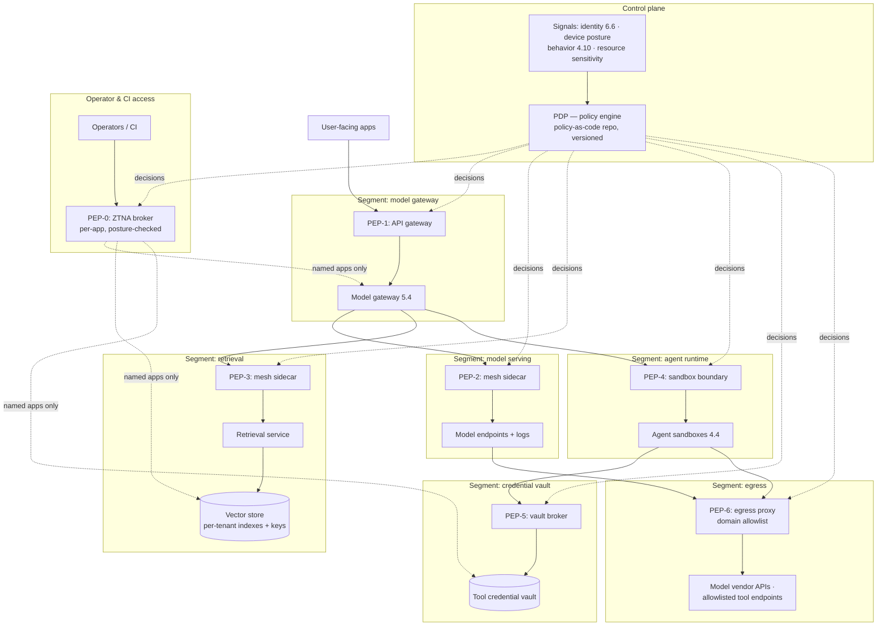

# Chapter 6.5 — Security Architecture & Zero Trust

| | |
|---|---|
| **Part** | 6 — Enterprise Architecture |
| **Maturity level** | 4 — Architect |
| **Difficulty** | Advanced |
| **Estimated study time** | 2 hours (reading 40 min, exercise 80 min) |
| **Prerequisites** | [4.9 GenAI Security & Threat Modeling](../part-4-enterprise-genai-systems/chapter-09-genai-security-threat-modeling.md); [6.4](chapter-04-enterprise-integration.md) |

## Learning Objectives

After this chapter you will be able to:

1. Decompose zero trust per NIST SP 800-207: the policy decision point / policy enforcement point split, policy-as-code, and the signals continuous verification consumes.
2. Microsegment a GenAI platform: model endpoints, vector stores, agent runtimes, credential vaults, and egress paths as separately policed, default-deny segments.
3. Replace network-reachability access (the VPN) with per-application ZTNA for operators and CI pipelines.
4. Apply the AI-specific extensions — the agent as an untrusted-by-default principal, egress as the exfiltration backstop, per-tenant isolation — and locate [4.9](../part-4-enterprise-genai-systems/chapter-09-genai-security-threat-modeling.md)'s blast-radius doctrine inside the enterprise zero-trust model.

## Introduction

Chapter [4.9](../part-4-enterprise-genai-systems/chapter-09-genai-security-threat-modeling.md) secured the GenAI system from the inside: threat models, privilege architecture, the defense hierarchy. This chapter secures it from the outside — the enterprise architecture that decides which workload may connect to which, and what a compromised laptop on the corporate network can actually reach. That architecture has a reference model: **zero trust**, specified in NIST SP 800-207 not as a philosophy but as components with jobs. This chapter does the engineering — where the decision and enforcement points sit in a GenAI platform, how the platform is cut into segments, and which controls are load-bearing when something inside the perimeter is compromised.

## Business Motivation

The economic argument for zero trust in the AI estate is concentration. A GenAI platform gathers, in one place, the enterprise's most attractive east-west targets: a [vector database](../../GLOSSARY.md) holding embeddings of documents from every connected repository, a credential vault holding the tool keys agents use to act on line-of-business systems, and model endpoints whose logs contain whatever users pasted into them. On the still-common flat corporate network — authenticate once at the VPN, enjoy broad reachability inside — every one of those is one lateral hop from any compromised laptop. Part 4's application-layer controls do not help, because a flat network lets an attacker skip the application: the vector store's API and the model registry's admin port answer network calls directly. Segmentation puts an enforcement point demanding a verified identity in front of every asset, wherever the caller stands. And a schedule argument compounds across the portfolio: each new workload on a segmented platform inherits the segment model, so its security review starts from a known posture instead of re-litigating the network.

## Theory — zero trust as components, not slogan

### The PDP/PEP split and policy-as-code

SP 800-207's core move is to make access a **per-request decision** produced by one component and enforced by another. The **policy decision point (PDP)** — the policy engine plus the administrator configuring the data path — evaluates each request against policy and signals. The **policy enforcement point (PEP)** sits in the traffic path and does only what the PDP decided; it holds no policy of its own. The split makes the architecture governable: policy lives in one reviewable place, enforcement is distributed wherever traffic flows — a gateway, a sidecar proxy, a vault front end, an egress proxy. "Never trust, always verify" decomposes into exactly this machinery: *no network location confers access* (the PEP challenges every caller), *every request carries an identity* ([6.6](chapter-06-iam-for-ai.md)'s subject), and *the decision is continuous* — re-evaluated per request, not granted at session start.

**Policy-as-code** keeps the PDP honest: policies live in version control, change through review, run through tests, deploy through a pipeline — and exceptions get expiry dates by construction, because the emergency allow rule that outlives its emergency is the classic segmentation rot.

### The signals continuous verification consumes

A PDP's decision is only as good as its inputs; four signal classes matter for an AI estate:

- **Identity** — who or what is asking: human user, CI pipeline, agent runtime, each a first-class principal (credential mechanics in [6.6](chapter-06-iam-for-ai.md)).
- **Device and workload posture** — is the operator's laptop managed and patched; is the calling workload the attested container image the platform deployed, or something else wearing its IP address?
- **Behavior** — telemetry-derived confidence: an operator pulling ten thousand embeddings at 3 a.m., an agent whose tool-call sequence deviates from every recorded trajectory ([4.10](../part-4-enterprise-genai-systems/chapter-10-observability.md)'s data as a security signal).
- **Resource sensitivity** — the target's classification raises the bar: the public-docs index and the M&A index should not cost the same signal strength.

Degraded signal produces *step-up or deny*, never silent allow — a valid token presented from an unmanaged device is exactly the case session-time authentication passes and continuous verification catches.

### Microsegmenting the AI platform

Microsegmentation shrinks SP 800-207's "implicit trust zones" until each contains one class of asset, with **default-deny east-west traffic** between them — a connection exists only if a policy names it. The GenAI platform's segments, and why each boundary earns its keep:

- **Model gateway** ([5.4](../part-5-cloud-infrastructure-platform/chapter-04-api-integration-layer.md)) — the sanctioned front door; the only segment user-facing applications may call.
- **Model serving** — the endpoints and their logs; reachable from the gateway alone, so a compromised internal app cannot prompt the model directly.
- **Retrieval / vector store** — reachable only from the retrieval service; nothing else, the agent runtime included, gets a direct connection to the index or its admin API.
- **Agent runtime** — sandboxed executors for [agent](../../GLOSSARY.md) workloads; may call named tool endpoints and nothing else, because everything the runtime processes is potentially attacker-authored.
- **Tool credential vault** — reachable only through a broker that mints 6.6's short-lived, task-scoped credentials; no workload holds a standing path to raw secrets.
- **Egress** — a single proxied exit with a domain allowlist; the model vendor's API is a named, contracted destination, and everything unlisted is unreachable.

One implementation decision dominates: **segment on workload identity, not IP address**. AI platforms autoscale — sandboxes and replicas appear and vanish, addresses churn — so IP-based rules either break the platform or get quietly widened until they police nothing. Identity-based enforcement (mesh mTLS with attested workload identities, or the cloud provider's tag equivalents) moves with the workload, which is why it survives production.

### ZTNA versus the VPN for operators and CI

The VPN's grant is **network reachability**: authenticate once, then stand on the internal network with everything that implies on a flat topology. **Zero trust network access (ZTNA)** inverts the grant: a broker — a PEP for human and pipeline access — connects an authenticated, posture-checked identity to *one named application*, and the network stays dark. Concretely: the platform engineer reaches the vector-store admin console through the broker, session recorded, and nothing else by default; CI pipelines authenticate as workload identities scoped to their deploy targets, so a leaked CI token can push to one endpoint, not explore the estate. The honest cost: ZTNA requires enumerating applications and their authorized identities — that enumeration *is* the security work, and why the migration is a project, not a purchase.

### The AI-specific extensions

Three places where an AI estate needs more than the standard playbook:

- **The agent is an untrusted-by-default principal.** An agent runtime processes attacker-influenceable content and can be steered by it (4.9's founding fact), so its segment is designed like a workload you expect to be compromised: default-deny everything, allow named tool endpoints, broker-mediated credentials, no direct egress. The identity mechanics are [6.6](chapter-06-iam-for-ai.md)'s; the network posture around them is this chapter's.
- **Egress control is the exfiltration backstop.** When [prompt injection](../../GLOSSARY.md) succeeds despite everything upstream, the stolen data still has to leave. A default-deny egress allowlist works *after* the model is fooled — which, per 4.9's hierarchy, is what makes it load-bearing. Police the quiet channels too: DNS lookups are egress.
- **Per-tenant isolation is segmentation, not filtering.** On a multi-tenant platform ([7.9](../part-7-enterprise-ai-architecture-patterns/chapter-09-platform-multitenancy-patterns.md)), a shared index with a `tenant_id` metadata filter is an application-layer promise — one retrieval bug from being a breach. Zero-trust tenancy puts structure under the promise: per-tenant indexes, per-tenant keys, and PEP-enforced policy so tenant A's workloads cannot *reach* tenant B's partition even when the application code is wrong.

### The bridge from 4.9

4.9's blast-radius doctrine and zero trust are the same three commitments at two scales: least privilege is least privilege; *assume the model can be instructed* is assume-breach applied to a component; *fence untrusted content* is verify-explicitly applied to data. That mapping is why a system built to 4.9's standard drops into a zero-trust enterprise without redesign, and why AI security runs as a specialization within the enterprise security function rather than beside it. What the enterprise layer adds is everything above: the PDP/PEP machinery, the segment map, and the access architecture for humans and pipelines.

## Architecture Perspective

The placement table is the artifact a security review signs — per segment: enforcement technology, decision inputs, and the posture when the PDP is unreachable (owned *before* the outage):

| Segment | PEP placement | Decision inputs weighed | On PDP outage |
|---|---|---|---|
| Model gateway | API gateway (PEP-1) | User identity, app identity, rate/budget | Fail closed for new sessions |
| Model serving | Mesh sidecar (PEP-2) | Workload identity (gateway only), attestation | Cached allow, short TTL |
| Retrieval / vector store | Mesh sidecar (PEP-3) | Workload identity, tenant partition, sensitivity | Fail closed |
| Agent runtime | Sandbox boundary (PEP-4) | Task identity, named tool endpoints, behavior | Fail closed |
| Credential vault | Vault broker (PEP-5) | Delegation chain (6.6), task scope, expiry | Fail closed, always |
| Egress | Egress proxy (PEP-6) | Destination allowlist, workload identity, data class | Fail closed |
| Operator/CI access | ZTNA broker (PEP-0) | Human/pipeline identity, device posture, target app | Break-glass path, logged |

Read the table's grain: every "fail closed" is an availability cost accepted so a control-plane outage never becomes an open door; the serving path's cached-allow is the one deliberate exception, because inference is the availability-critical path with the most tightly attested callers.

## Real-world Example

**Vantora Systems** (the 2,000-person software company whose helpdesk agent caught a live social-engineering attempt in [3.7](../part-3-core-building-blocks-of-genai/chapter-07-function-calling-tool-use.md)) built its internal AI platform — support agents, a RAG assistant over engineering and HR documents — inside a corporate network that was flat behind the VPN. Their first segmentation attempt used what the network team's change process supported: IP-based firewall rules between the platform's subnets. It failed slowly. Sandboxes and serving replicas autoscaled, addresses churned, and the rules lagged — twice during peak weeks, stale rules blocked legitimate retrieval traffic. After the second outage an engineer widened the rules to subnet-wide allows "until the automation catches up." It never caught up, and nobody re-narrowed the rules.

Five months later Vantora's red team ran an assumed-breach exercise from a simulated compromised contractor laptop on the VPN. They reached the vector store's admin API directly — no application in the path — dumped the HR assistant's embedding index, then showed they could have swapped an artifact in the model registry. Nothing in the application layer had failed; the network had never asked who was calling.

The platform lead took a decision that cost real money: halt the planned onboarding of two more business units for a quarter — deferring roughly $1.8M of budgeted internal chargeback and the flagship product-analytics feature tied to it — and rebuild the boundary on workload identity instead of addresses: mesh mTLS with attested identities as the east-west PEPs, a brokered vault path replacing standing secrets, a default-deny egress proxy, and ZTNA replacing VPN reachability for operators. The rebuild triggered a bruising ownership negotiation — settled by giving the platform team the mesh PEPs, and the network team the ZTNA broker and egress proxy — and cost a measured 7 ms of added p50 latency. The retest stopped where it should: the laptop reached the ZTNA broker and nothing else; a compromised retrieval pod reached its own segment's named flows and no admin plane. The lead's post-mortem line became the design rule: "The firewall rules didn't fail because they were wrong. They failed because they were static in an estate where every address changes twice a day."

## Hands-on Exercise

**Design the zero-trust architecture for a GenAI platform.** ~80 minutes. Use your own platform or any Part 4/7 case-study system with RAG, agents, and tools.

1. **Segment map (25 min).** Draw the platform as segments (gateway, serving, retrieval, agent runtime, vault, egress — adapt to your system). For each, list the *named allowed flows* in and out; everything unlisted is default-deny. Mark flows carrying attacker-influenceable content.
2. **PDP/PEP placement table (20 min).** Reproduce this chapter's table shape: PEP technology per segment, the decision inputs weighed there, the on-PDP-outage posture — defending each fail-open in one sentence.
3. **Policy-as-code samples (20 min).** Write two policies in pseudo-code: (a) agent-runtime may call the vault broker for task-scoped credentials, nothing calls the vault directly; (b) only the retrieval service reaches the vector store, tenant partition enforced. Add one *expiring* exception with an owner and a date.
4. **Access matrix (15 min).** For operators, CI, and break-glass: which identity reaches which application through the ZTNA broker, with what posture requirement. No row may grant network-level reachability.

**Acceptance criteria:**
- [ ] Every segment boundary lists named flows; no implicit any-any on the map
- [ ] The placement table covers every segment; every fail-open has a written defense
- [ ] Both policies are identity-based, not IP-based; the exception rule has an owner and expiry
- [ ] The access matrix is per-application; admin planes are reachable only through the broker
- [ ] The egress allowlist names the model vendor and each external tool endpoint explicitly

## Enterprise Considerations

In a real enterprise you join a zero-trust journey already in motion — CISA's Zero Trust Maturity Model is the vocabulary security functions use for where they are — and the first placement question is whether the AI platform consumes the enterprise's shared PDP or runs a platform-local engine federated with it: shared is the default, platform-local reserved for decisions the central engine cannot evaluate fast enough. Ownership follows Conway's law ([6.4](chapter-04-enterprise-integration.md)): mesh PEPs usually land with the platform team while the ZTNA broker and egress proxy land with network security, and leaving that split un-negotiated is how enforcement gaps open. The egress allowlist doubles as vendor governance — every external model API is a named destination with a contract behind it, so shadow AI surfaces as blocked egress rather than an audit surprise. And the segment map plus policy history serve as compliance evidence: the data-residency and access-control claims 4.14's regime must prove are readable off the policy repo instead of reconstructed by interview.

## Trade-offs

| Decision | Option A | Option B | Choose A when… | Choose B when… |
|----------|----------|----------|----------------|----------------|
| Segmentation granularity | Coarse zones (3–5 segments) | Per-workload microsegments | Small platform, limited ops capacity — maintained boundaries beat fine ones that rot | Multi-tenant or agent-heavy estates needing per-workload blast radius |
| East-west PEP technology | Service-mesh sidecars (identity-based) | SDN / cloud firewall rules | Kubernetes-style churn; you need mTLS and attestation anyway | Static VM estates; no mesh skills — a firewall enforced beats a mesh half-deployed |
| PDP outage posture | Fail closed | Fail open, cached decisions | Vault, admin planes, egress — anywhere an open door outlasts the outage | The availability-critical inference path, with short-TTL caches |
| Operator access | ZTNA per-application | Keep the VPN | Applications are enumerable and the migration is funded | Transitional only — paired with segment PEPs so reachability stops meaning access |

## Common Mistakes

1. **IP-based rules in an autoscaling estate.** Addresses churn, rules lag, on-call pain drives quiet widening, and eighteen months later the "segmented" network is flat with extra steps — Vantora's first attempt.
2. **Segmenting the inference path and forgetting the management plane.** User-facing traffic gets PEPs while the vector-store admin API, model registry, and eval dashboards stay on the flat network; red teams go straight for the admin plane.
3. **Calling the VPN zero trust.** "We authenticate everyone at the door" is perimeter security with a newer logo; the grant is still network reachability.
4. **Continuous verification that only checks identity.** A stolen valid token from an unmanaged device passes every identity check; posture and behavior signals exist for exactly this case.
5. **Tenant isolation by metadata filter alone.** The shared index with a `tenant_id` clause is one query-construction bug from a cross-tenant breach; without partition-level enforcement at a PEP, the tenancy promise is application code.
6. **An egress allowlist with side doors.** The proxy polices HTTPS while DNS resolves freely, or the "temporary" wildcard for a vendor's CDN never narrows. Egress earns its backstop status only if genuinely default-deny.

## Best Practices

1. **Name the PDP and every PEP in the design document.** If you cannot point at what decides and what enforces, you have principles, not architecture.
2. **Segment on workload identity.** Attested identities move with autoscaled workloads; addresses do not.
3. **Default-deny east-west, with flows as policy-as-code.** Every allowed connection is a reviewed, versioned statement with an owner; exceptions expire by construction.
4. **Treat the agent runtime as already compromised.** Named tool endpoints, brokered credentials, no direct egress — the posture that makes 4.9's assumption survivable.
5. **Make egress the backstop it claims to be.** One proxied exit, explicit destinations including the model vendor, DNS policed, wildcards refused.
6. **Decide outage postures in advance.** Fail-closed by default; fail-open only where the availability case is argued and the compensations are named.

## Architecture Checklist

For an AI platform's zero-trust architecture:

- [ ] PDP identified (shared enterprise engine, platform-local, or federated); policy in version control
- [ ] Every segment boundary has a named PEP; the placement table exists and is review-signed
- [ ] East-west traffic is default-deny; all allowed flows are named, identity-based policies
- [ ] Management planes (vector-store admin, model registry, eval tooling) sit inside segments, not on the flat network
- [ ] PDP signals include attestation and device posture, not identity alone; degraded signal steps up or denies
- [ ] Agent runtime segment: named tool endpoints only, brokered credentials, no direct egress
- [ ] Egress is a single default-deny proxy with explicit destinations; DNS is policed
- [ ] Tenant isolation is enforced at PEPs (partitions, keys), not only in application filters
- [ ] Operator and CI access runs through ZTNA per-application; break-glass exists and is logged
- [ ] Every PEP has a written on-PDP-outage posture; policy exceptions carry owners and expiry dates

## Interview Questions

1. *"Walk me through what happens when an agent requests a document from the vector store in a zero-trust AI platform."* — Strong answers trace the machinery: the sandbox-boundary PEP intercepts; the PDP weighs task identity, attestation, behavior, and index sensitivity; the flow exists only because a named policy allows agent-runtime → retrieval service → tenant partition. Weak answers say "it's authenticated."
2. *"Design the segmentation for a multi-tenant RAG platform."* — Strong answers produce the segment map, name the PEP per boundary, insist on identity-based enforcement over IP, and put tenancy below the application layer: partitions and keys at the PEP, not a metadata filter.
3. *"Why replace the VPN with ZTNA for the AI estate, and what does it cost?"* — Strong answers contrast the grants (network reachability versus per-application access) and volunteer the cost: enumerating applications and authorized identities is real work — which is also the security work.
4. *"An injection got past the guardrails and the model is exfiltrating. What limits the damage?"* — Strong answers reach for the controls that work after the model is fooled: the agent segment's default-deny, the brokered vault (no standing credential to steal), and the egress allowlist as backstop — 4.9's hierarchy on this chapter's network.

## Further Reading

- NIST SP 800-207, *Zero Trust Architecture* (nist.gov) — the reference model behind this chapter; short, and the PDP/PEP vocabulary comes straight from it.
- Google's BeyondCorp papers (research.google) — the original operators-without-a-VPN architecture; the practical ancestor of ZTNA.
- CISA Zero Trust Maturity Model (cisa.gov) — the staging vocabulary enterprise security functions use for the journey you join mid-flight.
- The [security checklist](../../checklists/security-checklist.md) and [4.9](../part-4-enterprise-genai-systems/chapter-09-genai-security-threat-modeling.md) (re-read after this chapter) — the system-level doctrine this network architecture enforces at enterprise scale.

## Summary

- Zero trust is machinery, not a motto: a **policy decision point** evaluating per-request signals — identity, posture, behavior, resource sensitivity — and **policy enforcement points** in every traffic path, governed as policy-as-code.
- The AI platform is cut into **default-deny segments** — gateway, serving, retrieval/vector store, agent runtime, vault, egress — enforced on **workload identity rather than IP**, because autoscaling estates rot address-based rules into flat networks.
- Operators and CI reach the estate through **ZTNA**: per-application access for verified, posture-checked identities instead of the VPN's network reachability.
- The AI-specific extensions: the **agent runtime is architected as already compromised**, **egress is the exfiltration backstop** that works after injection succeeds, and **tenant isolation is PEP-enforced structure**, not an application-layer filter.
- 4.9's blast-radius doctrine and zero trust are the same commitments at two scales — well-architected AI systems drop into the enterprise model without redesign. The identity substrate every PDP decision starts from is next: **identity & access management for AI systems** ([6.6](chapter-06-iam-for-ai.md)).

---

**Previous:** [Chapter 6.4 — Enterprise Integration Patterns](chapter-04-enterprise-integration.md) · **Next:** [Chapter 6.6 — Identity & Access Management for AI Systems](chapter-06-iam-for-ai.md) · **Related:** [4.9 GenAI Security & Threat Modeling](../part-4-enterprise-genai-systems/chapter-09-genai-security-threat-modeling.md), [6.6 IAM for AI Systems](chapter-06-iam-for-ai.md), [4.14 Privacy, Compliance & Governance](../part-4-enterprise-genai-systems/chapter-14-privacy-compliance-governance.md)
