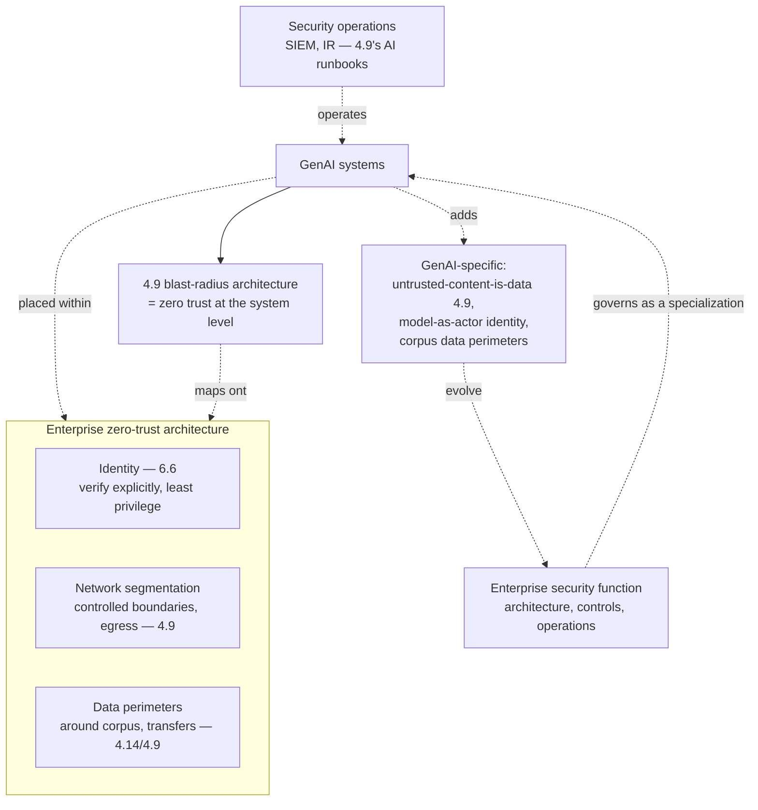

# Chapter 6.5 — Security Architecture & Zero Trust

| | |
|---|---|
| **Part** | 6 — Enterprise Architecture |
| **Maturity level** | 4 — Architect |
| **Difficulty** | Advanced |
| **Estimated study time** | 3 hours (reading 90 min, exercise 90 min) |
| **Prerequisites** | [4.9 GenAI Security & Threat Modeling](../part-4-enterprise-genai-systems/chapter-09-genai-security-threat-modeling.md); [6.4](chapter-04-enterprise-integration.md) |

## Learning Objectives

After this chapter you will be able to:

1. Place GenAI systems inside the enterprise security architecture: identity, network segmentation, data perimeters, and the zero-trust model.
2. Extend 4.9's system-level GenAI security into the enterprise security architecture: how the blast-radius and least-privilege principles map to the enterprise security controls.
3. Design the data perimeters and segmentation that contain GenAI's specific risks at the enterprise scale.
4. Integrate GenAI security into the enterprise security function, its zero-trust architecture, and its existing controls.

## Introduction

4.9 built GenAI security at the system level (the threat modeling, the blast-radius architecture, the defense hierarchy); this chapter places that security inside the *enterprise* security architecture — the identity, segmentation, data perimeters, and zero-trust model that the enterprise security function operates, and how GenAI systems fit within them. The through-line from 4.9: the blast-radius-over-detection philosophy and the least-privilege principle (4.9) map directly onto the enterprise security architecture's zero-trust model (never trust, always verify, least privilege everywhere) — GenAI security is not separate from enterprise security, it's a specialization within it, and this chapter is the placement.

The framing: **GenAI security is a specialization within the enterprise's zero-trust architecture** — the zero-trust principles (verify explicitly, least privilege, assume breach) are exactly the principles 4.9's blast-radius architecture applied at the system level, so GenAI fits naturally within the enterprise zero-trust model, with the GenAI-specific additions (the untrusted-content-is-data problem — 4.9, the data perimeters around the corpus and the model transfers) placed within the enterprise security controls.

## Business Motivation

Enterprise security architecture is what makes GenAI deployable in a security-conscious enterprise — the placement within the enterprise's security controls that lets the security function approve GenAI systems (4.9's fast-review-when-designed-in, at the enterprise-architecture scale). Without the enterprise-security placement: GenAI systems are security islands (their own ad-hoc security, disconnected from the enterprise's identity, segmentation, and controls — the parallel-security anti-pattern), which the security function can't govern coherently and which create the gaps (the GenAI system outside the zero-trust perimeter, the identity not integrated — the blast-radius uncontained at the enterprise scale). With it: GenAI systems fit the enterprise zero-trust architecture (the identity integrated — 6.6, the segmentation and data perimeters containing the GenAI risks — 4.9's blast-radius at enterprise scale), so the security function governs them coherently and the GenAI-specific risks (the injection — 4.9, the data exposure — 4.14) are contained by the enterprise security controls. The business case is the deployability-and-coherence one: the GenAI security placed within the enterprise security architecture is deployable (the security function approves it — it fits the controls) and coherent (governed as part of the enterprise security, not a security island) — and the enterprise-security integration is what lets GenAI operate in the security-conscious enterprise at scale, versus the security islands that don't get approved or that create the uncontained-blast-radius gaps.

## Theory

### Zero trust and GenAI

The zero-trust model and how GenAI fits:

- **Zero-trust principles** — verify explicitly (authenticate and authorize every access — never trust based on network location), least privilege (grant the minimum access needed — 4.9's least-privilege, at the enterprise scale), assume breach (design as if the perimeter is compromised — the blast-radius containment — 4.9); the enterprise security model GenAI operates within.
- **The natural fit** — 4.9's blast-radius architecture *is* zero trust at the GenAI system level (the least-privilege bounding the injection blast-radius, the assume-the-model-can-be-instructed as assume-breach — 4.9); so GenAI fits the enterprise zero-trust model naturally (the same principles), and the placement is extending the system-level 4.9 to the enterprise zero-trust controls.
- **The GenAI-specific zero-trust additions** — the untrusted-content-is-data problem (4.9 — the content the model processes is untrusted, verified/fenced, never trusted), the model as an actor whose access is verified and least-privileged (the model's tool access — 3.7, scoped and verified — the zero-trust applied to the model's actions), and the assume-breach for the model (the model can be instructed — 4.9, so its access is bounded assuming it's compromised).

### Identity, segmentation, and data perimeters

The enterprise security controls GenAI is placed within:

- **Identity** (6.6's subject) — the enterprise identity that everything authenticates through (the users, the applications, the models, the tools — 3.7/6.6), the substrate for the zero-trust verify-explicitly and the least-privilege; GenAI's identity integration (6.6) is the placement.
- **Network segmentation** — the enterprise network divided into segments with controlled boundaries (the GenAI systems in their segments, the egress controlled — 4.4's egress allowlists, 4.9's exfiltration containment, at the enterprise segmentation scale), so the GenAI's network access is segmented and controlled (the zero-trust network, the blast-radius contained by segmentation).
- **Data perimeters** — the boundaries around the sensitive data (the corpus — 4.1, the training data — 2.6, the traces — 4.10), controlling where the data can go (the data-perimeter preventing the sensitive data from leaving the perimeter — 4.14's residency and the exfiltration containment — 4.9, at the enterprise data-perimeter scale); the GenAI-specific data perimeters (around the corpus, the model transfers — 4.14) placed within the enterprise data-perimeter architecture.
- **The GenAI security controls** (4.9, 4.8) — the guardrails (4.8), the threat models (4.9), the blast-radius architecture (4.9) placed within the enterprise controls (the enterprise's SIEM, its security monitoring, its incident response — the GenAI security integrated with the enterprise security operations).

### Integration with the enterprise security function

The placement within the security function:

- **GenAI security as a specialization** (4.9's fit-the-existing-machinery, at the architecture scale) — the enterprise security function (its architecture, its controls, its operations) governs GenAI security as a specialization within it, not a parallel security org; the integrate-don't-parallel (2.8/4.14/5.10), security-architecture edition.
- **The security architecture's GenAI additions** — the enterprise security architecture adds the GenAI-specific elements (the data perimeters around the corpus, the model-actor identity and least-privilege, the injection-aware controls — 4.9), so the security architecture evolves to include GenAI (the AI architect contributing to the security architecture — 6.1's shape-the-EA, security edition).
- **The security operations integration** — the GenAI security monitoring (4.9's adversarial testing, the guardrail telemetry — 4.8, the trajectory forensics — 4.4) integrated with the enterprise security operations (the SIEM, the incident response — 4.9's AI-incident runbooks in the enterprise IR), so the GenAI security is operated as part of the enterprise security.

## Architecture Perspective

Readings. **4.9's blast-radius architecture is zero trust at the system level** — the least-privilege (bounding the injection blast-radius), the assume-the-model-can-be-instructed (assume-breach), the verify/fence-the-untrusted-content (verify explicitly) are exactly the zero-trust principles, so GenAI fits the enterprise zero-trust model naturally, and the placement is extending 4.9's system-level security to the enterprise zero-trust controls (identity — 6.6, segmentation, data perimeters). **GenAI adds specific elements to the enterprise security architecture** — the untrusted-content-is-data problem (4.9), the model-as-actor whose access is verified and least-privileged (the model's tool access — 3.7, zero-trust-applied), and the data perimeters around the corpus and model transfers (4.14/4.9) — which evolve the enterprise security architecture to include GenAI (the AI architect shaping the security architecture — 6.1's shape-the-EA). **And GenAI security is a specialization within the security function, not a parallel org** — the integrate-don't-parallel (2.8/4.14/5.10, security edition): the enterprise security function governs GenAI security (its architecture, controls, operations — the SIEM, the IR with 4.9's AI runbooks), so the GenAI security is coherent (part of the enterprise security) and deployable (the security function approves what fits its controls — 4.9's fast-review-when-designed-in).

## Real-world Example

**Meridian Health Partners** (the recurring clinician-assistant — 1.5, 4.9, 4.14) placed its GenAI systems within the enterprise zero-trust security architecture, and the placement is where 4.9's system-level security became enterprise security architecture. The zero-trust fit was natural (4.9's blast-radius = zero trust): the clinician assistant's least-privilege (the model's access scoped to the clinician's permissions — 4.9/6.6, bounding the injection blast-radius), the assume-breach (the assume-the-model-can-be-instructed — 4.9, so the model's access bounded assuming compromise), and the verify-explicitly (the untrusted content — the patient documents, the retrieved protocols — fenced and verified, never trusted — 4.9) mapped directly onto Meridian's enterprise zero-trust model, so the assistant fit the enterprise security architecture rather than being a security island. The GenAI-specific additions were placed within the enterprise controls: the data perimeter around the PHI corpus (4.1/4.14 — the boundary preventing the PHI from leaving the perimeter, integrated with Meridian's HIPAA data-perimeter architecture), the model-as-actor identity (the model's tool access verified and least-privileged through Meridian's enterprise identity — 6.6), and the network segmentation (the assistant in its segment, egress controlled — 4.9's exfiltration containment, at Meridian's segmentation scale). The security-function integration was the deployability key (4.9's fast-review, at the architecture scale): the assistant's security was governed by Meridian's security function as a specialization (not a parallel AI-security org — integrate-don't-parallel), its monitoring integrated with Meridian's SIEM and security operations (the guardrail telemetry — 4.8, the trajectory forensics — 4.4, the AI-incident runbooks — 4.9 in Meridian's IR), so the security function approved and governed it coherently. And the AI architect shaped the security architecture (6.1's shape-the-EA, security edition): Meridian's enterprise security architecture evolved to include the GenAI-specific elements (the corpus data perimeters, the model-actor identity, the injection-aware controls — 4.9), contributed by the AI architect. The security architect's note: *"The clinician assistant's security wasn't separate from our zero-trust architecture — it *was* zero trust, applied to a GenAI system. Least privilege bounding the injection blast-radius, assume-breach for the model, verify-and-fence the untrusted content — the same principles. We placed it within the enterprise controls (the PHI data perimeter, the enterprise identity, the segmentation), governed it through the security function as a specialization, and evolved the security architecture to include the GenAI-specific elements. GenAI security is enterprise security, specialized — not a security island."*

## Hands-on Exercise

**Place GenAI in the enterprise security architecture.** ~90 minutes. For a GenAI system in an enterprise (real or a case study's).

1. **Zero-trust mapping (30 min).** For a GenAI system, map 4.9's blast-radius architecture onto the zero-trust principles: how does the least-privilege (4.9) implement least-privilege (zero-trust), the assume-the-model-can-be-instructed (4.9) implement assume-breach, the verify-and-fence-untrusted-content (4.9) implement verify-explicitly? Show the natural fit.
2. **The enterprise controls (25 min).** Place the GenAI system within the enterprise security controls: the identity (6.6 — the model-as-actor, the user propagation), the network segmentation (the segment, the egress control — 4.9), the data perimeters (around the corpus, the model transfers — 4.14/4.9). Describe how each contains a GenAI-specific risk at the enterprise scale.
3. **The GenAI-specific additions (20 min).** Identify the GenAI-specific elements the enterprise security architecture must add (the untrusted-content-is-data problem — 4.9, the model-actor identity, the corpus data perimeters), and how they evolve the security architecture (6.1's shape-the-EA).
4. **The security-function integration (15 min).** Describe how the GenAI security integrates with the enterprise security function (governed as a specialization, monitored via the SIEM, the AI-incident runbooks in the IR — integrate-don't-parallel), not as a security island.

**Acceptance criteria:**
- [ ] 4.9's blast-radius architecture mapped onto the zero-trust principles (the natural fit shown)
- [ ] The GenAI system placed within the enterprise controls (identity, segmentation, data perimeters) with the risk-containment per control
- [ ] The GenAI-specific additions to the security architecture identified
- [ ] The security-function integration is integrate-don't-parallel (specialization, not island)

## Enterprise Considerations

Enterprise GenAI security architecture is deeply integrated with the enterprise security function and its zero-trust journey. **It conforms to and extends the enterprise zero-trust architecture** (5.1/6.1's conform): most security-conscious enterprises have (or are building) a zero-trust architecture, and GenAI fits within it (the natural fit — 4.9 = zero trust) with the GenAI-specific additions (the AI architect extending the security architecture — 6.1's shape) — the integrate-don't-parallel (security-architecture edition). **The security function governs it as a specialization** (4.9): the enterprise security function (its architecture reviews — 6.9, its controls, its operations) governs GenAI security as a specialization within it (the GenAI-specific threat models — 4.9 in the enterprise threat-modeling, the guardrails — 4.8 in the enterprise controls, the AI-incident runbooks — 4.9 in the enterprise IR), and the AI architect works with the security function (1.8's influence, bringing the GenAI security expertise) not around it (the shadow-AI-security islands). **The data perimeters are a compliance control** (4.14): the data perimeters around the corpus and the model transfers (4.14's residency, the exfiltration containment — 4.9) are compliance controls (the PHI/PII perimeter — 4.14), so the security architecture serves the compliance function (the data perimeter as both a security and compliance control). **And the zero-trust journey is enterprise-wide** (6.10): the enterprise's zero-trust architecture is a major, ongoing enterprise-security investment, and GenAI is one workload within it — the AI architect ensures GenAI fits and contributes, part of the broader enterprise-security strategy (6.10's strategic context).

## Trade-offs

| Decision | Option A | Option B | Choose A when… | Choose B when… |
|----------|----------|----------|----------------|----------------|
| GenAI security placement | Within the enterprise zero-trust architecture | A GenAI security island | Always — the natural fit (4.9 = zero trust), coherent and deployable | Never; the security island is un-governable and uncontained |
| Security governance | The security function as a specialization | A parallel AI-security org | Always — integrate-don't-parallel (security edition) | Never; the parallel org fragments the security |
| Data perimeter | Around the sensitive data (corpus, transfers) | No perimeter (trust the network) | Always — zero-trust assume-breach, the exfiltration containment (4.9/4.14) | Never; no-perimeter is the pre-zero-trust trust-the-network model |
| Model access | Verified, least-privileged (model-as-actor) | Broad (the god-credential — 3.7/4.9) | Always — zero-trust least-privilege bounds the blast-radius | Never; the broad model access is the uncontained-injection risk |

## Common Mistakes

1. **The GenAI security island** — the GenAI system with its own ad-hoc security, disconnected from the enterprise zero-trust architecture and security function (the parallel-security anti-pattern); GenAI security is a specialization within the enterprise security (integrate-don't-parallel).
2. **Missing the natural zero-trust fit** — not recognizing that 4.9's blast-radius architecture *is* zero trust, so re-inventing GenAI security instead of placing it within the enterprise zero-trust model; the fit is natural, the placement is the work.
3. **No data perimeters** — the sensitive data (corpus, transfers) without perimeters, trusting the network (the pre-zero-trust model); the data perimeters contain the exfiltration and residency risks (4.9/4.14).
4. **Broad model access** — the model-as-actor with broad access (the god-credential — 3.7/4.9), violating zero-trust least-privilege and leaving the injection blast-radius uncontained; verify and least-privilege the model's access (6.6).
5. **Security not integrated with operations** — the GenAI security monitoring disconnected from the enterprise SIEM and IR (the AI-incident runbooks not in the enterprise IR — 4.9); integrate the GenAI security operations with the enterprise security operations.
6. **Not shaping the security architecture** — the AI architect conforming to the enterprise security without adding the GenAI-specific elements (the untrusted-content-is-data, the model-actor identity, the corpus perimeters); shape the security architecture (6.1's shape-the-EA).
7. **Ignoring the compliance role of the perimeters** — the data perimeters as security-only, missing their compliance role (the PHI/PII perimeter — 4.14); the perimeters are both security and compliance controls.

## Best Practices

1. **Place GenAI within the enterprise zero-trust architecture** — recognize the natural fit (4.9's blast-radius = zero trust), extend 4.9's system-level security to the enterprise controls (identity — 6.6, segmentation, data perimeters).
2. **Verify and least-privilege the model as an actor** — the model's access (tools — 3.7, data) verified and least-privileged through the enterprise identity (6.6), bounding the injection blast-radius (zero-trust, 4.9).
3. **Build data perimeters around the sensitive data** — the corpus, the training data, the model transfers (4.14/4.9), containing the exfiltration and residency risks (both security and compliance controls).
4. **Govern GenAI security as a specialization within the security function** — integrate-don't-parallel (security edition), the enterprise security function governing the GenAI-specific threat models (4.9), guardrails (4.8), and controls.
5. **Integrate the GenAI security operations with the enterprise operations** — the guardrail telemetry (4.8), the trajectory forensics (4.4), the AI-incident runbooks (4.9) in the enterprise SIEM and IR.
6. **Shape the security architecture with the GenAI-specific elements** — the untrusted-content-is-data (4.9), the model-actor identity, the corpus data perimeters — evolving the enterprise security architecture (6.1's shape-the-EA).
7. **Serve compliance with the security controls** — the data perimeters as compliance controls (4.14), the security architecture serving the compliance function.

## Architecture Checklist

For placing GenAI in the enterprise security architecture:

- [ ] GenAI placed within the enterprise zero-trust architecture (4.9's blast-radius mapped onto zero-trust principles — the natural fit)
- [ ] The model verified and least-privileged as an actor (tool/data access through the enterprise identity — 6.6), bounding the injection blast-radius
- [ ] Data perimeters around the sensitive data (corpus, training, transfers — 4.14/4.9); both security and compliance controls
- [ ] Network segmentation with controlled egress (4.9's exfiltration containment)
- [ ] GenAI security governed as a specialization within the security function (integrate-don't-parallel, security edition)
- [ ] GenAI security operations integrated with the enterprise SIEM and IR (guardrail telemetry, forensics, AI-incident runbooks — 4.8/4.4/4.9)
- [ ] The security architecture evolved with the GenAI-specific elements (6.1's shape-the-EA)

## Interview Questions

1. *"How does GenAI security fit into an enterprise zero-trust architecture?"* — Strong answers show the natural fit (4.9's blast-radius architecture *is* zero trust — the least-privilege bounding the injection blast-radius, the assume-the-model-can-be-instructed as assume-breach, the verify-and-fence-untrusted-content as verify-explicitly), and the placement (extending 4.9's system-level security to the enterprise controls — identity 6.6, segmentation, data perimeters), with the GenAI-specific additions.
2. *"What data perimeters do GenAI systems need at the enterprise scale?"* — Strong answers give the perimeters around the sensitive data (the corpus — 4.1, the training data — 2.6, the model transfers — 4.14), containing the exfiltration (4.9) and residency (4.14) risks, as both security and compliance controls, placed within the enterprise data-perimeter architecture.
3. *"How should GenAI security relate to the enterprise security function?"* — Strong answers give the integrate-don't-parallel (security edition — 4.9's fit-the-machinery): GenAI security as a specialization within the security function (governed by its architecture reviews — 6.9, controls, operations — the SIEM, the IR with AI runbooks), the AI architect working with the security function (1.8) and shaping the security architecture (6.1) — not a security island.
4. *"What does zero-trust least-privilege mean for the model itself?"* — Strong answers give the model-as-actor: the model's access (its tools — 3.7, its data) verified and least-privileged through the enterprise identity (6.6), assuming the model can be compromised (4.9's assume-the-model-can-be-instructed = assume-breach), which bounds the injection blast-radius (4.9) — the god-credential (3.7/4.9) being the zero-trust violation.

## Further Reading

- NIST Zero Trust Architecture (SP 800-207, nist.gov) — the zero-trust model this chapter places GenAI within; the principles (verify explicitly, least privilege, assume breach) that 4.9's blast-radius architecture embodies.
- 4.9 GenAI Security & Threat Modeling (re-read) — the system-level GenAI security this chapter places in the enterprise architecture; the blast-radius-over-detection and least-privilege that map onto zero trust.
- Your enterprise's zero-trust and security-architecture documentation (internal, and the security function's) — the architecture GenAI conforms to and extends.
- 6.6 Identity & Access Management for AI Systems (the identity substrate) — the next chapter, the identity that the zero-trust verify-and-least-privilege depends on.

## Summary

- GenAI security is **a specialization within the enterprise zero-trust architecture** — 4.9's blast-radius architecture *is* zero trust at the system level (least-privilege bounding the injection blast-radius, assume-the-model-can-be-instructed as assume-breach, verify-and-fence-untrusted-content as verify-explicitly), so GenAI fits naturally, and the placement extends 4.9 to the enterprise controls.
- GenAI is placed within the **enterprise security controls**: identity (6.6 — the model verified and least-privileged as an actor), network segmentation (egress-controlled — 4.9), and data perimeters (around the corpus and transfers — 4.14/4.9, both security and compliance controls).
- GenAI **adds specific elements to the security architecture** — the untrusted-content-is-data problem (4.9), the model-as-actor identity, the corpus data perimeters — which the AI architect contributes (6.1's shape-the-EA, security edition).
- GenAI security is governed as a **specialization within the security function** (integrate-don't-parallel, security edition — 4.9's fit-the-machinery), its operations integrated with the enterprise SIEM and IR (the AI-incident runbooks — 4.9), not a security island.
- The placement makes GenAI **deployable and coherent** in the security-conscious enterprise (the security function approves what fits its controls, governs it as part of the enterprise security). The identity substrate the zero-trust model depends on is next: **identity & access management for AI systems** (6.6).

---

**Previous:** [Chapter 6.4 — Enterprise Integration Patterns](chapter-04-enterprise-integration.md) · **Next:** [Chapter 6.6 — Identity & Access Management for AI Systems](chapter-06-iam-for-ai.md) · **Related:** [4.9 GenAI Security & Threat Modeling](../part-4-enterprise-genai-systems/chapter-09-genai-security-threat-modeling.md), [6.6 IAM for AI Systems](chapter-06-iam-for-ai.md), [4.14 Privacy, Compliance & Governance](../part-4-enterprise-genai-systems/chapter-14-privacy-compliance-governance.md)
