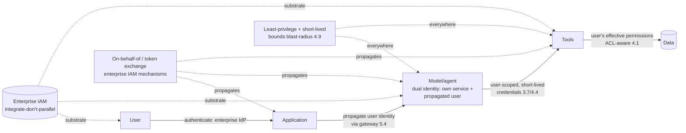

# Chapter 6.6 — Identity & Access Management for AI Systems

| | |
|---|---|
| **Part** | 6 — Enterprise Architecture |
| **Maturity level** | 4 — Architect |
| **Difficulty** | Advanced |
| **Estimated study time** | 3 hours (reading 90 min, exercise 90 min) |
| **Prerequisites** | [3.7 Function Calling & Tool Use](../part-3-core-building-blocks-of-genai/chapter-07-function-calling-tool-use.md); [4.1](../part-4-enterprise-genai-systems/chapter-01-production-rag.md); [6.5](chapter-05-security-architecture-zero-trust.md) |

## Learning Objectives

After this chapter you will be able to:

1. Design identity and access end-to-end for AI systems: the chain from users through applications, agents, and tools to data.
2. Solve the identity-propagation problem — the user's identity flowing through the AI system to the tools and data it accesses on their behalf.
3. Handle the AI-specific identity challenges: the model and agent as actors, service identity, and the least-privilege that bounds the blast radius.
4. Place AI identity within the enterprise IAM: integrating with the enterprise identity, not building a parallel identity system.

## Introduction

Identity is the substrate everything in 6.5's zero-trust architecture depends on — the verify-explicitly and least-privilege have no meaning without the identity that's verified and the access that's least-privileged. This chapter is that identity for AI systems: the end-to-end chain from users through applications, agents, and tools to data, and the AI-specific challenge that runs through it — **identity propagation** (the user's identity flowing through the AI system to the resources it accesses on their behalf), which 3.7 (the tool layer's user-scoped credentials), 4.1 (the ACL-aware retrieval), and 4.9 (the least-privilege bounding the blast-radius) all depend on and which this chapter builds.

The framing: **AI identity is the end-to-end chain with identity propagation as the core challenge** — the user's identity must flow through the application, the model/agent, and the tools to the data, so the AI system acts *as the user* (with the user's permissions, not a god-credential — 3.7/4.9), which is what makes the ACL-aware retrieval (4.1), the user-scoped tool access (3.7), and the blast-radius containment (4.9) work, and which is the recurring "identity is the long pole" (3.7, 4.1, 4.4) this chapter finally addresses.

## Business Motivation

Identity is the recurring long-pole and the recurring failure surface across the AI system — the challenge that Parts 3–5 kept flagging as the hard integration (3.7's identity plumbing, 4.1's permission systems of record, 4.4's per-task credentials) and the failure that causes the serious incidents (the god-credential that turns one injection into an enterprise breach — 3.7/4.9, the ACL failure that leaks data across users — 4.1). The business stakes: identity done wrong is the data-breach vector (the AI system accessing data the user shouldn't see — 4.1's permission failure, the god-credential's over-broad access — 3.7/4.9) and the compliance failure (the access not auditable, the least-privilege not enforced — 4.14), while identity done right is the enabler of the secure, compliant, auditable AI system (the user's identity propagated, the access least-privileged and ACL-aware, the audit answerable — 4.1's audit reconstruction). The business case is the security-and-compliance one, sharpened by the recurring-long-pole reality: identity is on the critical path of nearly every AI system (the ACL-aware retrieval — 4.1, the user-scoped tools — 3.7, the agent's credentials — 4.4), it's routinely the longest workstream (the calendar-time item — 1.7, the integration with the enterprise identity across the systems of record — 4.1), and getting it right is what makes the AI system deployable in the enterprise (the security function approves the least-privilege, ACL-aware, auditable identity — 6.5, and rejects the god-credential). The architect who solves identity propagation solves the recurring hard problem that gates the secure AI system.

## Theory

### The end-to-end identity chain

The chain from users to data:

- **User → application** — the user authenticates to the application (the enterprise identity — SSO, the enterprise IdP), establishing who they are; the entry point of the chain, using the enterprise identity (not a parallel AI identity).
- **Application → model/agent** — the application invokes the model/agent (via the gateway — 5.4), carrying the user's identity context (the user's identity propagated to the model/agent invocation), so the model/agent acts on the user's behalf with the user's identity context.
- **Model/agent → tools** (3.7) — the model/agent invokes tools (3.7), and the tools execute *under the user's effective permissions* (3.7's user-scoped credentials — the tool the model calls on the user's behalf can do what the user can do, no more — the least-privilege — 4.9), which is the identity propagation to the tool layer.
- **Tools → data** (4.1) — the tools access data under the user's permissions (the ACL-aware retrieval — 4.1, the user sees only what they may see — resolved from the systems of record — 4.1), which is the identity propagation to the data layer.

The chain's discipline: the user's identity propagates end-to-end (user → application → model/agent → tools → data), so the AI system acts *as the user* throughout, with the user's permissions enforced at each layer (the ACL-aware retrieval — 4.1, the user-scoped tools — 3.7) — the identity propagation that makes the AI system's access the user's access, bounding the blast-radius (4.9) and enabling the ACL-awareness (4.1).

### The identity propagation problem

The core challenge (the recurring long-pole):

- **The problem** — the AI system accesses resources (tools, data) on the user's behalf, so it must act *as the user* (with the user's permissions), which requires the user's identity to propagate through the system (the application, the model/agent, the tools) to the resource access — the identity propagation.
- **The mechanisms** — the enterprise identity mechanisms that propagate identity (on-behalf-of flows, token exchange — standardized as RFC 8693, worked below —, delegated credentials — the enterprise IAM's mechanisms for one system acting on a user's behalf), applied to the AI system (the application's token exchanged for the user-scoped credential the tool uses — the on-behalf-of flow, AI edition); the mechanisms exist in the enterprise IAM, and the AI identity uses them (integrate-don't-parallel — 6.5).
- **The god-credential anti-pattern** (3.7/4.9) — the failure to propagate: the AI system using a broad service credential (the god-credential) instead of the user's identity, so the AI system can access more than the user should (the over-broad access — the injection blast-radius uncontained — 4.9, the data leaked across users — 4.1); the anti-pattern the identity propagation prevents (the AI acts as the user, not as a god-credential).

### The AI-specific identity challenges

- **The model/agent as an actor** (6.5) — the model/agent is an actor whose access is verified and least-privileged (zero-trust — 6.5), so it has an identity (the model/agent's service identity, distinct from the user's, for the actions it takes as itself — the non-user-scoped actions) *and* it acts on the user's behalf (the user's identity propagated for the user-scoped actions); the dual identity (the model/agent's own service identity plus the propagated user identity).
- **Service identity** — the AI system's components (the gateway — 5.4, the agents — 4.4, the tools — 3.7) have service identities (for the system-to-system authentication, the non-user actions), managed like any enterprise service identity (the enterprise IAM's service-identity management), with the least-privilege (the service identity scoped to what the component needs — 4.9).
- **Least-privilege and short-lived credentials** (3.7/4.4/4.9) — the credentials (the user-scoped, the service) least-privileged (the minimum access — 4.9) and short-lived (expiring, minted per-task — 4.4's per-task credentials, the agent's credentials expiring with the task), which bounds the blast-radius (the compromised credential's window and scope both minimal — 4.9's zero-trust).
- **The agent's identity** (4.4) — the agent (running in the sandbox — 4.4) receives the user-scoped credentials per task (4.4's per-task credential injection), acting on the user's behalf with the user's permissions, the credentials expiring with the task — the identity propagation to the agent, with the per-task least-privilege and expiry (4.4/4.9).

### The token-exchange flow, worked (RFC 8693)

"On-behalf-of flow" stays abstract until you see the tokens, so here is the propagation mechanism concretely. The standardized form is **OAuth 2.0 Token Exchange — RFC 8693**: a service holding a token that proves the user's identity presents it to the authorization server and receives a *new* token — different audience, reduced scope, delegation recorded — to call the next hop. Chained through an agent to a tool:

```mermaid
sequenceDiagram
    participant U as User
    participant App as Application
    participant AS as Authorization server<br/>(enterprise IdP)
    participant Ag as Agent runtime
    participant T as Tool (order API)
    U->>App: authenticate (SSO); App holds user token
    App->>AS: token exchange (RFC 8693):<br/>subject = user token, audience = agent
    AS-->>App: delegated token<br/>(acts for user, agent audience)
    App->>Ag: invoke task + delegated token
    Ag->>AS: token exchange: subject = delegated token,<br/>audience = order API, scope = orders:read
    AS-->>Ag: narrow token (user identity, orders:read only,<br/>short-lived, actor chain recorded)
    Ag->>T: call tool with narrow token
    T->>T: authorize as the user, orders:read
    T-->>Ag: result
```

Three properties do the work. **Identity survives; authority narrows** — the final token still asserts the *user's* identity (the ACL-aware retrieval — 4.1 — and the audit both see the user), but its scope is the intersection of what the user may do and what *this task at this hop* needs (`orders:read`, not the user's full authority) — 4.9's least-privilege, minted per hop. **The delegation chain is recorded** — RFC 8693's actor claim carries "the agent, acting for the application, acting for the user," so the audit (4.14) reconstructs the delegation, not just the endpoint access. **And every token is short-lived** — minted at the hop, expiring with the task (4.4's per-task credentials *are* these tokens, operationalized). The god-credential dies here structurally: there is no standing credential to steal, only a chain of narrow, expiring delegations.

### Non-human identity: the agent as a first-class principal

The scale problem current practice has named: **non-human identities (NHIs)** — service accounts, workload identities, and now agents — already outnumber human identities in most enterprises by an order of magnitude, and agent fleets (4.4) multiply the count again: every agent type, every task-scoped credential, every tool-server connection is an identity to govern. The governance discipline, at agent scale:

- **Agents are principals, not features** — each agent type registered in the enterprise IAM as a first-class identity with an owner, a purpose, a scope, and a review cadence (4.4's named-owner discipline, identity edition); an agent the IAM can't name is an agent the audit can't explain.
- **Credential lifecycle, managed end-to-end** — issuance through the enterprise vault (never in code, config, or prompt), rotation on schedule and on incident, and *decommissioning*: the agent retired last quarter whose credentials still work is the canonical NHI failure, and at agent scale it is the default outcome unless the lifecycle is automated.
- **The sprawl problem is the governance problem** — NHI sprawl (credentials accumulating faster than inventory, ownership, and rotation keep up) was already the enterprise's quiet weakness; agents industrialize it. The countermeasures: a complete NHI inventory (every identity enumerated, owned, scoped), preference for short-lived *attested* credentials over standing secrets (next subsection), and the same least-privilege review the human joiner-mover-leaver process gets — because an over-scoped, orphaned agent credential is 4.9's confused deputy waiting for its injection.

### Workload identity: attestation over secrets

For the service half of the dual identity — how the agent authenticates *as itself* — the strongest current pattern is **workload identity via attestation**, the SPIFFE/SVID model: the platform *attests* what the workload is (this container image, this runtime, this node) and issues it a short-lived cryptographic identity document (an SVID), renewed automatically and verifiable by any party in the trust domain. No standing secret exists to leak, vault, or rotate — the identity derives from what the workload verifiably *is*, not from what it *knows*. For agent platforms (4.4) this is the natural substrate: the sandbox attests the agent runtime, the runtime holds an attested service identity, and the user's delegated authority (the RFC 8693 chain above) rides on top — service identity from attestation, user authority from token exchange, both short-lived by construction.

### The MCP authorization model

Tool connectivity via MCP (3.7) has an identity architecture of its own, and it lands squarely in this chapter's frame: **remote MCP servers are OAuth resource servers** — the current specification builds on OAuth 2.1, with the server advertising its authorization requirements, the host obtaining tokens through standard flows, and **dynamic client registration** letting hosts register with servers they haven't met before (the ecosystem property — with the governance consequence that "who may register with what" needs an enterprise answer: the registry/allowlist — 3.7/4.9). The architect's reading: the MCP server is a *tool-layer hop* in the identity chain, so the propagation discipline applies unchanged — the token the server receives should carry the user's identity at reduced scope (the RFC 8693 chain, extended one hop), never a server-wide standing credential to downstream systems. A remote MCP server holding broad credentials is the god-credential relocated, not retired (4.9's confused deputy), and the same rejection applies — Halvard & Roth's reasoning, one protocol later.

## Architecture Perspective



Readings. **Identity propagation is the core challenge and the recurring long-pole** — the user's identity flowing end-to-end (user → application → model/agent → tools → data) so the AI system acts *as the user* is what makes the ACL-aware retrieval (4.1), the user-scoped tools (3.7), and the blast-radius containment (4.9) work — and it's routinely the longest workstream (the integration with the enterprise identity across the systems of record — 4.1, the calendar-time item — 1.7) because it touches every layer and every system of record. **The god-credential is the anti-pattern the propagation prevents** — the AI system using a broad service credential instead of the user's identity is the over-broad-access failure (the uncontained injection blast-radius — 4.9, the cross-user data leak — 4.1), and the identity propagation (the AI acts as the user, not as a god-credential) is the fix — the recurring 3.7/4.4/4.9 lesson, finally the architecture. **And AI identity integrates with the enterprise IAM, not parallel** — the on-behalf-of flows, token exchange, and service-identity management are the enterprise IAM's mechanisms (6.5's integrate-don't-parallel, identity edition), applied to the AI system (the AI identity using the enterprise IAM's propagation and least-privilege mechanisms), which is what makes the AI identity coherent and manageable (part of the enterprise IAM) rather than a parallel AI identity system.

## Real-world Example

**Halvard & Roth** (the recurring law-firm — 1.7, 3.5, 4.1) solved identity propagation for the matter-document AI systems, and the identity is where 4.1's ACL-aware retrieval and 3.7's user-scoped tools became the end-to-end chain. The identity propagation was the long-pole (the recurring 4.1 lesson): the firm's matter walls (the confidentiality — a lawyer can only access their matters) meant the AI systems had to act *as the user* (the user's matter access propagated end-to-end), which was the longest workstream (integrating with the firm's identity across the DMS, the matter-management system, the directory — 4.1's permission systems of record, the calendar-time item — 1.7). The chain was built: the user authenticated to the application (the firm's enterprise identity — SSO), the identity propagated through the gateway (5.4) to the model/agent (carrying the user's matter-access context), the model/agent's tools executed under the user's effective permissions (3.7's user-scoped credentials — the retrieval tool accessing only the user's matters), and the data access was ACL-aware (4.1 — the retrieval filtered to the user's accessible matters before similarity, resolved from the firm's matter-management system — 4.1's systems of record). The god-credential anti-pattern was explicitly rejected (3.7/4.9): the temptation to use a broad service credential ("the AI can access all matters, we'll filter in the application") was rejected as the over-broad-access failure (the cross-matter leak risk — 4.1's confidentiality incident, the uncontained blast-radius — 4.9) — the AI acts as the user, propagated, not as a god-credential. The agent identity (4.4) was per-task: the due-diligence agent (3.8/4.4) received the user's matter-scoped credentials per investigation (4.4's per-task injection), acting on the user's behalf with the user's matter access, the credentials expiring with the task (4.4/4.9's short-lived). And the enterprise-IAM integration was the coherence key (6.5's integrate-don't-parallel): the AI identity used the firm's enterprise IAM (the on-behalf-of flows, the service-identity management), not a parallel AI identity — so the identity was governed as part of the firm's IAM. Yusuf's identity note: *"Identity was the long pole — the matter walls meant the AI had to act as the user, propagated end-to-end, and integrating with the firm's identity across the DMS and matter-management was the longest workstream. But it's the whole game: the AI acts as the user (their matter access propagated), not as a god-credential (which would leak across matters — the confidentiality incident). User → application → model → tools → data, the user's permissions enforced at each layer, integrated with the enterprise IAM. Solve identity propagation and the ACL-aware retrieval and the user-scoped tools just work — because they're all the same thing: the AI acting as the user."*

## Hands-on Exercise

**Design the end-to-end identity chain.** ~90 minutes. For an AI system with user-scoped data access (real or a case study's).

1. **The identity chain (30 min).** Design the end-to-end chain: user → application (enterprise auth) → model/agent (identity propagation) → tools (user-scoped — 3.7) → data (ACL-aware — 4.1). For each hop, describe how the user's identity propagates and how the user's permissions are enforced.
2. **The propagation mechanism (25 min).** Design the identity-propagation mechanism (the on-behalf-of flow / token exchange — the enterprise IAM's mechanism): how the user's identity becomes the user-scoped credential the tool uses. Show how it makes the AI act as the user.
3. **Reject the god-credential (20 min).** Show the god-credential anti-pattern (the AI using a broad service credential, filtering in the application) and why it fails (the over-broad access, the cross-user leak — 4.1, the uncontained blast-radius — 4.9). Contrast with the propagated-identity approach.
4. **The agent and service identities (15 min).** Design the agent's per-task identity (4.4 — the user-scoped credentials per task, expiring) and the service identities (the gateway, the tools — the least-privileged service identities for the non-user actions).

**Acceptance criteria:**
- [ ] The end-to-end chain (user → app → model → tools → data) with propagation and permission enforcement per hop
- [ ] The propagation mechanism (on-behalf-of/token exchange) makes the AI act as the user
- [ ] The god-credential anti-pattern shown and rejected (the failure modes — 4.1/4.9)
- [ ] The agent per-task identity (4.4) and service identities (least-privileged) designed

## Enterprise Considerations

Enterprise AI identity is deeply integrated with the enterprise IAM and is routinely the hardest, longest AI workstream. **It integrates with the enterprise IAM** (6.5's integrate-don't-parallel, identity edition): the enterprise has an IAM (the IdP, the on-behalf-of flows, the service-identity management, the privileged-access management), and the AI identity uses it (the AI's identity propagation via the enterprise IAM's mechanisms, the AI's service identities managed by the enterprise IAM) — not a parallel AI identity system, which would fragment the identity and fail the security governance (6.5). **The permission systems of record are the integration challenge** (4.1, 1.7's calendar-time): the user's effective permissions come from multiple systems of record (the directory, the application ACLs, the matter walls, the legal holds — 4.1), maintained in different places, and resolving them into the user's effective access for the AI's identity propagation is the longest workstream (the calendar-time item — 1.7, start it first — 4.1) — the identity is the recurring long-pole because the permission integration is genuinely hard. **The privileged-access and audit are compliance controls** (4.14): the AI's access (the least-privilege, the short-lived credentials, the audit of who-accessed-what — 4.1's audit reconstruction) are compliance controls (4.14), so the AI identity serves the compliance function (the auditable, least-privileged access). **And the identity architecture is a Conway's-law-and-org concern** (6.4): the identity crosses the AI team, the IAM team, and the systems-of-record teams (Conway's law), so the identity is an organizational-coordination effort (the IAM team as a key stakeholder — 1.6, the influence — 1.8) — the identity long-pole is organizational as much as technical.

## Trade-offs

| Decision | Option A | Option B | Choose A when… | Choose B when… |
|----------|----------|----------|----------------|----------------|
| Identity model | Propagate the user's identity (AI acts as the user) | God-credential (broad service access) | Always — the AI acts as the user, ACL-aware, blast-radius-bounded | Never; the god-credential is the over-broad-access failure (4.1/4.9) |
| Identity integration | Use the enterprise IAM | A parallel AI identity system | Always — integrate-don't-parallel (identity edition) | Never; the parallel system fragments and fails governance |
| Credential lifetime | Short-lived, per-task (4.4) | Long-lived, static | Always — bounds the blast-radius (4.9's zero-trust) | Never long-lived-static; the compromised credential's window is unbounded |
| Permission resolution | From the systems of record (real-time or short-TTL cached — 4.1) | Hard-coded or stale | Always — the user's actual effective access (4.1's staleness discipline) | Never hard-coded/stale; the access diverges from the user's actual permissions |

## Common Mistakes

1. **The god-credential** — the AI using a broad service credential instead of the user's identity (the "AI accesses everything, filter in the app" — Halvard & Roth's rejected temptation); the over-broad-access failure (the cross-user leak — 4.1, the uncontained injection blast-radius — 4.9) — propagate the user's identity, the AI acts as the user.
2. **No identity propagation** — the user's identity not flowing through to the tools and data, so the AI can't act as the user (the ACL-aware retrieval — 4.1 — impossible without the propagated identity); build the end-to-end chain.
3. **The parallel AI identity system** — an AI identity disconnected from the enterprise IAM; integrate-don't-parallel (identity edition — 6.5), use the enterprise IAM's mechanisms.
4. **Long-lived static credentials** — the AI's credentials long-lived and static, the compromised credential's window unbounded; short-lived, per-task (4.4/4.9's zero-trust).
5. **Hard-coded or stale permissions** — the user's permissions hard-coded or stale, diverging from their actual effective access (4.1's staleness discipline); resolve from the systems of record.
6. **Under-planning the permission integration** — treating the identity as a config change, hitting the systems-of-record integration reality (4.1, the calendar-time item — 1.7); the identity is the long-pole, planned and started first.
7. **Ignoring the organizational coordination** — treating identity as purely technical, missing the IAM-team and systems-of-record-team coordination (Conway's law — 6.4, the stakeholders — 1.6); the identity is organizational as much as technical.

## Best Practices

1. **Propagate the user's identity end-to-end** — the AI acts as the user (user → application → model/agent → tools → data), the user's permissions enforced at each layer (the ACL-aware retrieval — 4.1, the user-scoped tools — 3.7); the core discipline that bounds the blast-radius (4.9).
2. **Reject the god-credential** — the AI never uses a broad service credential for the user-scoped access; the over-broad-access failure (4.1/4.9) is the anti-pattern the propagation prevents.
3. **Integrate with the enterprise IAM** — use the enterprise IAM's mechanisms (on-behalf-of flows, token exchange, service-identity management), integrate-don't-parallel (identity edition — 6.5).
4. **Least-privilege and short-lived credentials everywhere** — the user-scoped and service credentials least-privileged (4.9) and short-lived (per-task — 4.4), bounding the blast-radius (zero-trust).
5. **Resolve permissions from the systems of record** — the user's actual effective access from the directory, ACLs, walls (4.1), with the staleness discipline (4.1's TTL and invalidation).
6. **Plan and start the identity workstream first** — the identity is the recurring long-pole (the permission-systems-of-record integration — 4.1, the calendar-time item — 1.7); start it first.
7. **Navigate the organizational coordination** — the IAM team and the systems-of-record teams as stakeholders (1.6, the influence — 1.8, Conway's law — 6.4); the identity is organizational as much as technical.

## Architecture Checklist

For AI system identity and access:

- [ ] The end-to-end identity chain (user → application → model/agent → tools → data) with the user's identity propagated and permissions enforced at each layer
- [ ] The user's identity propagated via the enterprise IAM's mechanisms (on-behalf-of, token exchange); the AI acts as the user
- [ ] Delegation implemented as token exchange (RFC 8693): identity survives, scope narrows per hop, actor chain recorded for audit
- [ ] Agents registered as first-class NHIs: named owner, scope, vaulted credential lifecycle (issuance, rotation, decommissioning); NHI inventory maintained against sprawl
- [ ] Service identity via workload attestation (SPIFFE/SVID-style) preferred over standing secrets where the platform supports it
- [ ] Remote MCP servers treated as OAuth resource-server hops in the identity chain: user-scoped reduced tokens, no server-wide standing credentials; client registration governed via the allowlist (3.7/4.9)
- [ ] The god-credential rejected; no broad service credential for user-scoped access
- [ ] Credentials least-privileged (4.9) and short-lived (per-task — 4.4), bounding the blast-radius
- [ ] Permissions resolved from the systems of record (4.1) with the staleness discipline (TTL, invalidation)
- [ ] The model/agent's dual identity (own service identity + propagated user identity) and the service identities (least-privileged) designed
- [ ] Integrates with the enterprise IAM (integrate-don't-parallel — 6.5); the identity workstream planned and started first (the long-pole — 1.7)
- [ ] The access auditable (4.1's audit reconstruction); serves the compliance controls (4.14)

## Interview Questions

1. *"How do you handle identity for an AI system that accesses data on a user's behalf?"* — Strong answers give the end-to-end chain (user → application → model/agent → tools → data) with the user's identity propagated (the AI acts as the user, via the enterprise IAM's on-behalf-of mechanisms), the user's permissions enforced at each layer (ACL-aware retrieval — 4.1, user-scoped tools — 3.7), and reject the god-credential (the over-broad-access failure — 4.1/4.9).
2. *"What's the identity-propagation problem and why is it hard?"* — Strong answers explain the AI must act as the user (the user's identity flowing through the system to the resources it accesses on their behalf), the mechanisms (on-behalf-of, token exchange — the enterprise IAM's), and why it's the recurring long-pole (the permission-systems-of-record integration — 4.1, the calendar-time item — 1.7 — touching every layer and system of record — Halvard & Roth's matter walls).
3. *"Why is the god-credential an anti-pattern for AI systems?"* — Strong answers give the over-broad-access failure: the AI using a broad service credential can access more than the user should (the cross-user data leak — 4.1's confidentiality incident, the uncontained injection blast-radius — 4.9), and the fix is identity propagation (the AI acts as the user, least-privileged, not as a god-credential — 4.9's zero-trust).
4. *"How does AI identity relate to the enterprise IAM?"* — Strong answers give the integrate-don't-parallel (identity edition — 6.5): the AI identity uses the enterprise IAM's mechanisms (on-behalf-of, token exchange, service-identity management), not a parallel AI identity, which makes it coherent and governable — and note the organizational coordination (the IAM team as a stakeholder — 1.6, Conway's law — 6.4).
5. *"An agent calls a remote MCP server that in turn calls your order API. Whose identity does the API see, and how?"* — Strong answers walk the token-exchange chain (RFC 8693): the user's token exchanged for a delegated agent token, exchanged again for a narrow, short-lived token that still carries the user's identity plus the recorded actor chain, presented through the MCP server as an OAuth resource-server hop — and they reject the alternative (the server's own standing credential to the API) as the confused deputy, the god-credential relocated (4.9).

## Further Reading

- OAuth 2.0 and the on-behalf-of / token-exchange flows (the OAuth specifications and your IdP's documentation) — the identity-propagation mechanisms this chapter uses; the enterprise IAM's delegation flows.
- RFC 8693, *OAuth 2.0 Token Exchange* (ietf.org) — the standardized delegation mechanism behind this chapter's worked flow; read alongside your IdP's on-behalf-of documentation.
- SPIFFE / SPIRE documentation (spiffe.io) — the workload-identity-by-attestation pattern; the service half of the dual identity without standing secrets.
- Model Context Protocol specification, authorization section (modelcontextprotocol.io) — remote MCP servers as OAuth resource servers, dynamic client registration; the tool-connectivity hop of the identity chain.
- 4.1 Production RAG (the ACL-aware retrieval, permission systems of record) and 3.7 Function Calling & Tool Use (the user-scoped tool credentials) — the identity-propagation-dependent capabilities this chapter's identity chain enables.
- 4.4 Agent Architectures (the per-task credentials) — the agent identity this chapter's chain includes.
- Your enterprise IAM documentation (internal, and the IAM team) — the identity substrate the AI identity integrates with (6.5's zero-trust, this chapter's IAM).

## Summary

- AI identity is the **end-to-end chain** (user → application → model/agent → tools → data) with **identity propagation** as the core challenge — the user's identity flowing through the AI system so it acts *as the user*, which makes the ACL-aware retrieval (4.1), the user-scoped tools (3.7), and the blast-radius containment (4.9) work.
- **The god-credential is the anti-pattern the propagation prevents** — the AI using a broad service credential instead of the user's identity is the over-broad-access failure (the cross-user leak — 4.1, the uncontained injection blast-radius — 4.9); the AI acts as the user, least-privileged, not as a god-credential.
- The **model/agent has a dual identity** (its own service identity plus the propagated user identity), and all credentials are **least-privileged and short-lived** (per-task — 4.4, bounding the blast-radius — 4.9's zero-trust).
- AI identity **integrates with the enterprise IAM** (integrate-don't-parallel, identity edition — 6.5) — using its on-behalf-of flows, token exchange, and service-identity management — not a parallel AI identity system.
- The current practice layer makes the chain concrete: **token exchange (RFC 8693)** narrows authority per hop while identity survives and the actor chain is recorded; **NHI governance** treats agents as first-class principals with vaulted, rotated, decommissioned credentials against sprawl; **workload attestation** (SPIFFE/SVID-style) replaces standing secrets for the service identity; and **remote MCP servers** join the chain as OAuth resource-server hops, never credential-holding deputies.
- Identity is the **recurring long-pole** (the permission-systems-of-record integration — 4.1, the calendar-time item — 1.7, the organizational coordination — 6.4) — planned and started first, because solving identity propagation is what makes the ACL-aware retrieval and the user-scoped tools "just work." The data the identity governs access to is next: **data governance & knowledge management** (6.7).

---

**Previous:** [Chapter 6.5 — Security Architecture & Zero Trust](chapter-05-security-architecture-zero-trust.md) · **Next:** [Chapter 6.7 — Data Governance & Knowledge Management](chapter-07-data-governance-knowledge.md) · **Related:** [3.7 Function Calling & Tool Use](../part-3-core-building-blocks-of-genai/chapter-07-function-calling-tool-use.md), [4.1 Production RAG](../part-4-enterprise-genai-systems/chapter-01-production-rag.md), [6.5 Security Architecture & Zero Trust](chapter-05-security-architecture-zero-trust.md)
