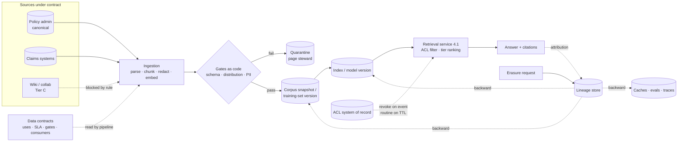

# Chapter 6.7 — Data Governance & Knowledge Management

| | |
|---|---|
| **Part** | 6 — Enterprise Architecture |
| **Maturity level** | 4 — Architect |
| **Difficulty** | Advanced |
| **Estimated study time** | 2 hours (reading 40 min, exercise 80 min) |
| **Prerequisites** | [2.12 Data Engineering & Feature Platforms](../part-2-artificial-intelligence/chapter-12-data-engineering-feature-platforms.md); [5.5 Data Architecture](../part-5-cloud-infrastructure-platform/chapter-05-data-architecture.md); [4.14](../part-4-enterprise-genai-systems/chapter-14-privacy-compliance-governance.md) |

## Learning Objectives

After this chapter you will be able to:

1. Write a data contract that governs an AI-consumed dataset: change policy, freshness SLA, classification, permitted uses including [RAG](../../GLOSSARY.md) and training eligibility, quality gates, and named consumers.
2. Place quality gates as code at the ingestion boundary — schema, distribution, and PII checks that quarantine and page — rather than in a review meeting.
3. Design AI lineage in both directions: forward from source through transformation, corpus or training-set version, and index or model version to output attribution; backward from a source record to every artifact derived from it.
4. Govern the knowledge half — canonical sources, corpus tiers with staleness SLAs, and the access model propagating ACLs and deletions into indexes and caches.

## Introduction

Chapter [2.12](../part-2-artificial-intelligence/chapter-12-data-engineering-feature-platforms.md) contracted the feature estate; [5.5](../part-5-cloud-infrastructure-platform/chapter-05-data-architecture.md) laid out the data architecture GenAI runs on. This chapter is the governance layer that makes both enforceable, and its thesis is narrow enough to test: **governance is real only where it exists as an artifact that runs.** A contract a pipeline reads before it ingests. A gate that blocks a batch. A corpus tier that changes what retrieval will cite. Catalogs describe the estate; artifacts decide what happens to it.

The AI-specific pressure is that a GenAI estate turns governance gaps into things you cannot walk back: retrieval converts one stale document into thousands of confident, cited answers, and indexing converts one personal record into copies in seven stores you must enumerate on a regulator's clock.

## Business Motivation

Three costs justify the artifact work. The first is blast radius: an ungoverned table behind a monthly dashboard is a number one analyst squints at; behind an assistant it is an answer given to everyone who asks, in a uniformly confident register, with a citation that makes it look verified.

The second is review latency. Every uncontracted source is one whose privacy, licensing, and permitted-use questions get re-litigated per use case by people who were not in the original room — weeks per assistant, and the dominant schedule risk on the second and third AI deliveries. The third is erasure liability: a deletion request the architecture cannot answer is a finding with a statutory clock attached ([4.14](../part-4-enterprise-genai-systems/chapter-14-privacy-compliance-governance.md)).

Against those, contracts, gates, and lineage are paid once per *source* while assistants are built per *use* — the framing the funding memo needs, because "data governance" funds badly and "the second assistant ships in six weeks" funds well.

## Theory — governance as artifacts that run

### The data contract, in full

The contract is the unit of governance: every field exists because a downstream decision needs a machine-readable answer, and a contract with blank fields is a catalog entry in costume.

```yaml
# contract: uw.guidelines.corpus — v3.1 (effective 2026-04-01)
dataset:  uw.guidelines.corpus   # underwriting guidelines, endorsement rules, filings
canonical_source: Rating & Guidelines Manual (Policy Admin System), space UW-MANUAL
non_canonical:    Confluence space "UW Wiki" — excluded by pipeline rule
owner:    Director, Underwriting Operations   # content correctness
steward:  Data Platform team                  # pipeline, gates, lineage
acl_system_of_record: directory groups + Policy Admin doc-level ACLs

structure:
  required_metadata: [doc_id, state, line_of_business, effective_date, supersedes,
                      owner_upn, review_due]
  change_policy:
    additive:         announced in #data-contracts
    breaking:         30 days notice; parallel publication of both versions;
                      named-consumer sign-off before the old one retires
    emergency_bypass: Director UW Ops approval, expires in 14 days

freshness_sla:
  publication_to_index: 4 h (p95); index lag > 8 h pages the steward
  content_review_cycle: 180 days per document; overdue documents are demoted

classification:
  sensitivity: Internal-Confidential
  pii:         none-expected — scanner enforces (names, national IDs, broker emails);
               any hit quarantines the batch

permitted_uses:               # a use not listed here is not permitted
  rag_retrieval:      yes — broker assistant, intake classifier
  fine_tuning:        no  — bureau-licensed content in three states
  eval_golden_sets:   yes — redacted excerpts only, retained 24 months
  new_use:            contract amendment, not a ticket

quality_gates:                # at ingestion; failure quarantines, never imputes
  schema:        required_metadata present and typed; effective_date parseable
  referential:   every `supersedes` id resolves to a document already indexed
  distribution:  per-state document count within ±20% of trailing 30-day median
  extraction:    text yield >= 85% of page area (scan-quality guard)
  pii:           zero scanner hits
  on_failure:    quarantine batch, page steward, index serves last good version

consumers: [broker-assistant (prod), intake-classifier (prod), uw-analytics (aggregate)]
           # unnamed consumers are refused at the retrieval service

deletion_and_retention:
  retention:     superseded versions kept 7 years (state filing requirement)
  deletion_path: source -> chunk store -> vector index -> retrieval cache ->
                 answer cache -> eval snapshots -> traces
  deletion_sla:  24 h to index and caches; probe verifies after every rebuild
```

Two fields carry most of the value and are the two left blank. **Permitted uses** is a one-way door: a corpus ingested under a vague "internal use" and later consumed by a fine-tuning run raises its licensing question *after* the weights exist. **Named consumers** make impact analysis a table read and give the retrieval service a default answer — refuse.

### Quality gates as code, at the ingestion boundary

Gates belong where data enters the estate and immediately before a training snapshot is sealed — the two places where blocking is still cheap. Three classes do the work: **structural** (schema, required metadata, referential integrity), **distributional** (batch volume against a trailing median, category validity, extraction yield — these catch a silently changed upstream export), and **content** (PII scanners, classification labels, duplicate ratios).

Failure semantics matter more than check coverage, and a gate that logs is not a gate: quarantine the failing batch, keep serving the last good index version, page the *steward named in the contract*. A weekly review meeting cannot substitute — it runs against an hourly pipeline and can stop nothing; its real agenda is which gates fire and which have been muted.

Gates have a limit worth stating in the design document: **they check shape, not truth.** A superseded underwriting rule passes every check above.

### Lineage for AI, in both directions

Lineage tooling ships the forward direction well and the backward direction almost never. AI needs both.

**Forward — the audit chain.** Five versioned links: *source record or document version* → *transformation* (ingestion run id, parser version, chunker configuration, redaction version, [embedding](../../GLOSSARY.md) model version) → *corpus snapshot or training-set version* → *index or model version* → *output attribution* (answer id → chunk ids → document versions). The design test: given an answer id from four months ago, can the system name the chunks retrieved, the document versions behind them, and the ACL snapshot that permitted them? Chapter [4.1](../part-4-enterprise-genai-systems/chapter-01-production-rag.md) owns the query-side half; unless the halves share identifiers, neither is reconstructable.

**Backward — the erasure chain.** Given one source record id, enumerate every derived artifact: chunks, vectors, retrieval and answer caches, eval snapshots, traces, and any training set that included it. This inverse index is a design decision, not a query you write later — the ingestion job writes a membership record keyed by source id as it derives. And the part most designs skip: **deletion from a training set is not deletion from a model.** A defensible architecture answers specifically — "these records are in training sets D-14 and D-17, which produced model versions M3 and M4" — and attaches a retrain-exclusion policy with a residual-risk position agreed with counsel.

### The access model for RAG corpora

An index must never become an independent authority on who may read what. Three representations, mixed in real platforms: **principals copied into chunk metadata** (fastest filter; the index holds a snapshot of access that ages); **an ACL reference resolved at query time** (the chunk stores a group or matter identifier, which puts the identity service on the hot path — [6.6](chapter-06-iam-for-ai.md)); and **partition by security boundary** (indexes split per tenant, matter, or clearance — the only representation whose failure mode is "no results" rather than "wrong results").

The **staleness window** is then a written number owned jointly with security, and two-tier: revocation events (leavers, matter walls, legal holds) invalidate immediately off the source system's event, while routine group changes ride the TTL. Probe it on a schedule — revoke a synthetic principal, query as that principal, assert empty — because propagation breaks silently whenever a connector is upgraded.

Deletion propagation has one trap worth naming: **the rebuild that resurrects.** Sources soft-delete, connectors select every row, and a nightly full rebuild restores documents deleted on Monday. The fix is two-part — the connector's query filters deleted records, and the probe runs *after every rebuild* rather than on a drifting calendar.

### Knowledge management: canonical sources and corpus tiers

**Canonical source** is a per-topic decision, recorded in the contract, naming the one place a fact is true — and naming the near-duplicates that are *not*, so the pipeline excludes them. Enterprises rarely lack an authoritative source; they lack a decision about which candidate it is. **Corpus tiers** attach consequences:

| Tier | Typical content | Staleness SLA | Review cadence | On lapsed review |
|---|---|---|---|---|
| **A — authoritative** | Rating manuals, policy wordings, filings | 4 h from publication | 180 days per document | Removed from retrieval |
| **B — operational** | Procedures, runbooks, product FAQs | 24 h | 365 days | Demoted below Tier A; "last reviewed" shown in citation |
| **C — informational** | Team wikis, meeting notes, project pages | Best effort | None | Never cited as authority; excluded from decision-support corpora |

The last column is where corpus governance usually dies: flagging an overdue document changes nothing a retriever can see; removing or demoting it does.

**The wiki-rot chain** runs in four steps. A Tier C page paraphrases a Tier A rule; the rule changes and the page does not. Both sit in one index, chunked identically. The page's plain prose is closer to how users phrase the question than the manual's filed language, so it retrieves higher. The answer then cites a real internal document — what a well-behaved grounded answer looks like — so nobody looks closer.

## Architecture Perspective



Read it for what it forces. The contract sits *upstream of the pipeline*, so an uncontracted source has no path in; the gate sits between transformation and the sealed snapshot, so the worst outcome of a bad batch is a stale index rather than a poisoned one.

## Real-world Example

**Bellhaven Insurance** (the submission-intake platform of 2.1 and [5.5](../part-5-cloud-infrastructure-platform/chapter-05-data-architecture.md)) built data governance twice. The first build was conventional: a fortnightly stewardship council, a catalog crawling the estate, eleven named stewards. Within four months the catalog held roughly 9,000 assets whose ownership fields were mostly distribution-list addresses, and nothing in the ingestion path read any of it. The council reviewed dashboards and filed tickets while ingestion continued regardless, because no council decision could stop a pipeline.

Two incidents ended it in one quarter. The broker assistant spent three weeks quoting a superseded endorsement rule that lived on a wiki page — the rating manual had been updated on schedule, the page had not, and its plain-English phrasing out-retrieved the filed language. Because every answer cited a genuine internal document, nobody escalated; the errors surfaced through a broker complaint, and unwinding them cost roughly $310K in reissued quotes and goodwill credits. Six weeks later an erasure request was certified complete against the claims system of record — until a routine retrieval test returned the claimant's narrative from the answer cache eleven days on.

The decision that followed was expensive on purpose. Bellhaven made a signed contract the precondition for ingestion, and applied it to the existing estate rather than only to new sources. Five of eleven live corpora had no owner willing to sign and went dark — including the field-operations knowledge base a claims-adjuster assistant was scheduled to launch on, a slip of two quarters. Retrieval recall on the broker assistant fell about 9 points as long-tail informal documents left the corpus, a trade underwriting leadership accepted in writing. Two platform engineers moved off feature work for two quarters to build the gates, the lineage records, and the post-rebuild deletion probe.

## Hands-on Exercise

**Contract and govern one AI-consumed dataset.** ~80 minutes. Use a corpus from your work or a Part 4 case study.

1. **Write the contract (30 min).** Produce a complete contract in this chapter's shape, with no field left blank.
2. **Gate placement (15 min).** Draw the ingestion path; mark where each gate class runs, what happens on failure, and who is paged. Name one failure no gate can catch and the artifact that catches it.
3. **The lineage walk (20 min).** Take one answer your system produced and list the five forward links back to the source record. Then invert: take one source record and enumerate every derived artifact, naming the one you would most likely miss.
4. **Tiers and the ACL path (15 min).** Assign your corpora to tiers with staleness SLAs and a consequence for lapsed review. Then write the ACL propagation path: system of record, representation in the index, the two-tier staleness window, and how the probe runs.

**Acceptance criteria:**
- [ ] Permitted uses answer RAG and fine-tuning explicitly; the breaking-change clause names a notice period and a sign-off
- [ ] Every gate has a failure action (quarantine, block, page) and a named steward — none is "log"
- [ ] The forward walk names versions, not systems; the backward walk reaches at least one cache, one eval or trace store, and any training set
- [ ] The staleness window is a number with an owner, and the deletion probe is tied to the rebuild

## Enterprise Considerations

Most enterprises already run a data-governance office, a catalog, and a steward network, and the winning move is not a parallel one for AI. The delta is small and negotiable: three fields on the existing catalog entry (permitted uses, corpus tier, deletion path) plus one behavioural change — the pipeline reads those fields and refuses on absence. A turf conflict becomes a schema change.

Defend the ownership split explicitly. Content correctness belongs to the business function that authors the material; pipeline, gates, and lineage belong to the platform team. Collapsing both into one "data owner" produces a platform engineer accountable for whether an endorsement rule is current — a role nobody can perform. And adoption is political first, because a contract asks source teams to accept obligations they did not have ([6.4](chapter-04-enterprise-integration.md)): make the contract the price of being retrievable, and route gate failures to the platform steward at first.

## Trade-offs

| Decision | Option A | Option B | Choose A when… | Choose B when… |
|----------|----------|----------|----------------|----------------|
| ACL representation | Principals copied into chunk metadata | ACL reference resolved per query | Latency-critical retrieval, slow-moving groups, a signed staleness window | High-sensitivity corpora with frequent revocation, and an identity service that can carry the load |
| Corpus breadth | Curated Tier A/B only | Ingest broadly, rank by tier | A wrong cited answer is expensive — Bellhaven's choice, and it cost recall | Exploration by experts who verify; coverage beats authority |
| Contract enforcement | Hard block: no contract, no ingestion | Advisory contracts with reporting | Blocked teams have a path forward | Early adoption, where blocking pushes teams into shadow ingestion |
| Deletion mechanism | Event-driven propagation within SLA | Applied at the next full rebuild | Personal data and regulated erasure clocks | Non-personal corrections on a short rebuild cadence, with a probe |

## Common Mistakes

1. **The catalog that describes but governs nothing.** Thousands of crawled assets, ownership fields full of distribution lists, and not one field any pipeline reads. Governance you cannot fail is documentation.
2. **Deletion that stops at the vector index.** Chunk store, retrieval cache, answer cache, eval snapshots, and traces each hold a copy; the answer cache keeps serving deleted content verbatim after the certificate is signed.
3. **The rebuild that resurrects.** The source soft-deletes, the connector selects every row, and the nightly rebuild restores what Monday's deletion removed — while the weekly probe passes.
4. **Wiki alongside manual in one index.** Informal prose out-retrieves filed language because it matches how users ask, so the stalest text in the estate wins the ranking — with a real citation attached.
5. **Permitted-use fields left blank.** A corpus ingested as "internal" is later consumed by a fine-tuning run, and the licensing question surfaces after the weights exist.

## Best Practices

1. **Make the signed contract the precondition for ingestion** — the only enforcement point that does not depend on diligence.
2. **Designate the canonical source per topic and exclude near-duplicates by rule.**
3. **Build lineage bidirectionally and record training-set membership at derivation time.** The inverse index cannot be reconstructed later.
4. **Set the ACL staleness window as a two-tier number with an owner, and probe it on the rebuild's clock.**
5. **Tier corpora and give every tier a consequence retrieval can observe.** Removal and demotion change answers; flags do not.

## Architecture Checklist

For an AI estate's data and knowledge:

- [ ] Every ingested source has a signed contract; the pipeline reads it and refuses on absence
- [ ] Owner (content correctness) and steward (pipeline, gates, lineage) are different named roles
- [ ] Quality gates run at ingestion and before snapshot sealing; failure quarantines and pages
- [ ] Forward lineage names versions at all five links; backward lineage resolves a source record to every derived artifact, caches and training sets included
- [ ] ACL system of record is external to the index; the staleness window is signed, two-tiered, and probed
- [ ] Deletion propagates within SLA; the probe runs after every rebuild
- [ ] Canonical sources designated per topic; corpora tiered, with a retrieval-observable consequence for lapsed review

## Interview Questions

1. *"Show me a data contract for a corpus your assistant retrieves from."* — Strong answers produce fields rather than concepts, and volunteer the ones usually blank: permitted uses with training eligibility, the breaking-change process, the deletion path.
2. *"An erasure request arrives for a customer whose records fed a RAG index and a fine-tuning set."* — Strong answers invert the lineage (chunks, vectors, caches, eval snapshots, traces, training-set membership) and are honest that removal from a training set is not removal from a model.
3. *"Your assistant gave a confidently wrong answer with a valid citation. Diagnose it."* — Strong answers reach for the wiki-rot chain: a non-canonical page paraphrasing an authoritative rule, retrieving better because it matches user phrasing. The fix is canonical designation and tiering, not a reranker.
4. *"How do ACLs get from the source system into a vector index, and what breaks?"* — Strong answers pick a representation and own its cost, name the staleness window as a signed number, and note that connector upgrades break propagation silently.

## Further Reading

- DAMA-DMBOK (Data Management Body of Knowledge, second edition) — the reference vocabulary for stewardship, quality, metadata, and lineage; the frame this chapter narrows to AI artifacts.
- *Data Mesh* (Zhamak Dehghani, O'Reilly) — the data-as-a-product and contract framing that makes source-team ownership an architectural position rather than a plea.
- The OpenLineage specification (openlineage.io) — an open model for lineage events emitted by jobs; read it to see what a machine-written lineage record contains.
- The [data quality & labeling checklist](../../checklists/data-quality-labeling-checklist.md) and [4.1 Production RAG](../part-4-enterprise-genai-systems/chapter-01-production-rag.md) — gate mechanics, and the query-side half of the audit record.

## Summary

- Governance counts only as artifacts that run — and the **data contract** is the unit: change policy, freshness SLA, classification, permitted uses, quality gates, named consumers, deletion path. Making it the precondition for ingestion is the enforcement that works.
- **Quality gates run at ingestion**, quarantine rather than impute, and page a named steward; they check shape, not truth, which is why canonical-source designation exists.
- **AI lineage is bidirectional**: forward through source → transformation → snapshot → index/model → attribution for audit; backward from a source record to every derived artifact for erasure.
- **RAG corpora need a propagation contract**, not a filter: an ACL system of record outside the index, a two-tier staleness window, and deletion that survives the rebuild.
- **Knowledge management becomes concrete** through canonical sources and corpus tiers with consequences retrieval can observe — the structure that stops a stale page becoming thousands of correctly-cited wrong answers. Sequencing this into an estate that already exists is next: **legacy modernization & AI adoption strategy** ([6.8](chapter-08-legacy-modernization-ai-adoption.md)).

---

**Previous:** [Chapter 6.6 — Identity & Access Management for AI Systems](chapter-06-iam-for-ai.md) · **Next:** [Chapter 6.8 — Legacy Modernization & AI Adoption Strategy](chapter-08-legacy-modernization-ai-adoption.md) · **Related:** [2.2 ML Fundamentals](../part-2-artificial-intelligence/chapter-02-machine-learning-fundamentals.md), [5.5 Data Architecture](../part-5-cloud-infrastructure-platform/chapter-05-data-architecture.md), [4.1 Production RAG](../part-4-enterprise-genai-systems/chapter-01-production-rag.md)
