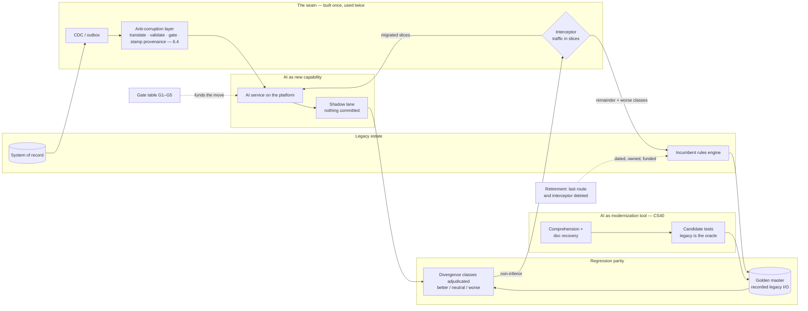

# Chapter 6.8 — Legacy Modernization & AI Adoption Strategy

| | |
|---|---|
| **Part** | 6 — Enterprise Architecture |
| **Maturity level** | 4 — Architect |
| **Difficulty** | Advanced |
| **Estimated study time** | 2 hours (reading 40 min, exercise 80 min) |
| **Prerequisites** | [1.3 Business Understanding](../part-1-professional-foundation/chapter-03-business-understanding.md); [6.1](chapter-01-ea-frameworks.md); [6.4](chapter-04-enterprise-integration.md) |

## Learning Objectives

After this chapter you will be able to:

1. Apply the strangler fig to an AI-era estate: place the seam, move traffic in slices, and fund the retirement step most programs cut.
2. Use AI in both modernization roles — the tool that recovers understanding and tests from legacy code, and the capability inserted at the seam — and say where LLM assistance is proven rather than asserted.
3. Build the regression-parity safety net: characterization tests captured before behavior changes, and eval-gated non-inferiority when a model replaces a rules engine.
4. Run a pilot-to-platform gate table, and pick the adoption operating model from the binding constraint.

## Introduction

Chapter [6.4](chapter-04-enterprise-integration.md) built the integration machinery and deferred one decision to here: for a given legacy system, modernize it or isolate it behind an adapter. This chapter answers that, and the question it is entangled with — which pilots deserve to become platform capabilities.

The two share an artifact. A strangler-fig migration needs an interceptor in front of the legacy system's traffic; an AI capability needs an anti-corruption layer between probabilistic output and a system of record. That is one piece of infrastructure with two consumers. Build it once, charge it to the first capability that needs it, and both programs get cheaper.

## Business Motivation

**Pilot purgatory** costs more than it looks: eleven pilots, each declared successful, none in production. The spend is small, but each consumed the scarcest engineering weeks in the enterprise on the same first twenty percent, and the sponsor who funded eleven demos stops taking the twelfth meeting. The opposite failure is the multi-year rewrite promising parity at the end while regulation, products, and integrations keep moving.

Between them sits the legacy estate. Legacy systems block AI capabilities for a reason that is rarely "old technology": there is **no seam** — no event, no queryable interface, no independent record of what the system does. A capability needing that data either re-keys it or reverse-engineers it, and neither survives review. The argument for building the seam first is amortization: the first capability pays for it and the next four inherit it, which turns modernization from a program justified on its own merits — a losing bid against revenue work — into infrastructure spread across a portfolio ([6.10](chapter-10-tco-business-case.md)). The gate table closes the loop from the other end: killing pilots early frees the funding the survivors need.

## Theory — modernization as a sequence of seams

### The strangler fig, and the step programs skip

Fowler's pattern is well known and usually half-implemented. A new system grows around the edges of the old, an interceptor routes an increasing share of traffic to it, and the old system is removed when its last route is gone. Three facts the metaphor hides:

- **The interceptor is production infrastructure** — availability budget, latency cost, and an owner, for the whole migration.
- **You pay for both systems at once**, so a case built on the end-state saving looks like a failure throughout.
- **Retirement is the step that gets cut.** Funding runs out around eighty percent because the last routes are the ugly ones, and a half-strangled estate is worse than what you started with: the same legacy, plus routers nobody owns. Fund the deletion in the build's envelope, with a date and an owner, or do not start.

The seam is concrete: change data capture or an outbox on the legacy store, an anti-corruption layer turning legacy record shapes into domain events through [6.4](chapter-04-enterprise-integration.md)'s four stations, and the interceptor on the write path. That surface is also reads of legacy state as events and writes back through validation and provenance — exactly what an AI capability needs.

### AI as modernization tool — the honest ledger

This is [CS40](../../case-studies/cs40-legacy-code-modernization-factory.md)'s territory and deserves an honest accounting. What LLM assistance does reliably, and *why*:

- **Comprehension** — summarizing what a module does, naming the rules implicit in its branches, tracing a field to where it is set. It works because checking is cheap: an engineer reads the summary against the code, and a wrong one is visible in minutes.
- **Documentation recovery** — drafting the interface docs nobody wrote. Cheap to check, and the baseline is an empty file.
- **Candidate test generation, in one direction only** — proposing characterization cases from observed inputs and outputs, admitted only when they run green against the *legacy* system. The model proposes; the legacy system disposes.
- **Transformation where tests already exist** — CS40's agentic loop works because the tests are the verifier, which puts it in the cheap-to-verify corner of [3.8](../part-3-core-building-blocks-of-genai/chapter-08-agents-concepts.md)'s autonomy grid. Remove the tests and the same loop produces a proposal, not a modernization.

Oversold: whole-system translation with correctness inferred from the translation itself, and "lines converted" as progress — it counts output, not *accepted* output. The rule is about order, not preference: **use AI to build the verifier before you use it to change behavior.**

### AI as the new capability at the seam

The second role inserts *at* the anti-corruption layer, never inside the legacy system: read domain events off the seam, write back through translate, validate, confidence-gate, and provenance-stamp. Two consequences follow.

**The capability can ship before the legacy system is modernized at all**, which makes the decision tractable: *modernize where the capability needs the legacy system's behavior or schema to change; isolate where it only reads and writes across a boundary.* The tell that isolation has curdled into avoidance is an adapter accumulating translation rules.

**A capability at the seam can run in shadow from day one** — same inputs, both outputs recorded, nothing committed. That lane is the mechanism the next section needs, and it is free once the seam exists.

### Regression parity: characterization first, then eval-gated equivalence

Capture behavior before changing it. Characterization tests — Feathers's term for tests that pin down what code *does* rather than what it should do — are the safety net. They are not [4.7](../part-4-enterprise-genai-systems/chapter-07-evaluation-systems.md)'s golden *sets*, which carry adjudicated truth; a golden *master* records only what the incumbent did, right or wrong. Three steps:

1. **Record** production inputs and legacy outputs over a window reaching the seasonal and segment tail, not last Tuesday.
2. **Replay** them through a sandboxed legacy instance and prove the replay reproduces the recording, *before any new code exists*. When it does not, you have found hidden state — and that discovery alone often justifies the exercise.
3. **Bucket every output field** as exact-match, tolerance (rounding, timestamps), or known-divergence with a signed exception naming who accepted it. An un-bucketed field is an unowned risk that resurfaces during cutover.

Then the inversion. When a model replaces a *rules* system, exact parity is the wrong gate: the new system is supposed to disagree where the old one was wrong. Substitute **eval-gated non-inferiority** — a golden set built from legacy outputs *plus* adjudicated truth on a sample, so the rules engine is a baseline rather than a label; a threshold on the agreed metric instead of zero divergence; and every divergence *class* adjudicated into better, neutral, or worse. A class adjudicated worse routes back to the rules path permanently rather than being tuned away under deadline. This is [champion–challenger](../../GLOSSARY.md) with a rules engine as incumbent, and the adjudication record is the evidence G2 demands.

### The pilot-to-platform gate table

A pilot earns platform funding by passing gates, not by impressing a steering committee.

| # | Gate | Evidence it demands | Who signs | What it catches |
|---|---|---|---|---|
| **G1** | Measured value | Pre-registered metric on the named KPI tree ([1.3](../part-1-professional-foundation/chapter-03-business-understanding.md)); delta measured from a holdout, or a pre/post with its confound named | Business sponsor + finance partner | The demo that impressed and never had a metric |
| **G2** | Eval coverage | Eval suite with golden sets and thresholds, judge calibration record, and the parity or non-inferiority result against the incumbent | Engineering lead + eval owner | Quality asserted from a happy-path demo |
| **G3** | Security and data | Threat model, data classification and retention decision, identity and egress placement ([6.5](chapter-05-security-architecture-zero-trust.md)), privacy record | Security architect + privacy counsel | The pilot on a personal key over unclassified data |
| **G4** | Unit economics at volume | Cost per successful outcome at pilot volume and projected at target volume, with the assumption whose failure breaks it ([4.11](../part-4-enterprise-genai-systems/chapter-11-cost-engineering.md)) | Platform lead + finance partner | Economical at 200 requests a day, ruinous at 20,000 |
| **G5** | Owner and budget | Named accountable owner, on-call rota, funded budget line, decommissioning criteria | Portfolio board ([6.9](chapter-09-architecture-governance.md)) | The orphan in production nobody funds |

Three rules keep it a gate rather than a form. **Thresholds are written before the pilot runs** — a gate rewritten mid-pilot is a governance exception with an approver and a date ([6.3](chapter-03-adrs-decision-governance.md)). **Failing G1 kills the pilot**, because extending one that cannot show value is how purgatory is built. And **gates are cheap on a platform, expensive alone**: G2's harness, G3's placement, and G4's telemetry come from paved-road infrastructure ([5.10](../part-5-cloud-infrastructure-platform/chapter-10-iac-platform-engineering.md)), so the first review takes a quarter and the fourth takes a week.

### The adoption operating model, in one rule

Three shapes recur at portfolio level: a **center of excellence** building the systems itself, a **federated** model where product teams build against central standards and a shared platform ([8.7](../part-8-professional-excellence/chapter-07-mentoring-building-teams.md)'s platform-plus-embedded shape, seen from the portfolio), and a **hybrid** — central platform and enablement, federated delivery — which is where most estates end up. The choice should follow the binding constraint. **Scarce skill and no platform → CoE**, because concentrating rare people is the only way the first three systems ship. **A platform in place and demand exceeding one team's throughput → federated**, because the central team has become the queue. The maturity signal is uncomfortable and reliable: **a CoE has succeeded exactly when its backlog becomes the bottleneck**, and its job then is to redistribute delivery rather than defend the queue.

## Architecture Perspective

The seam is drawn once and consumed twice — interceptor for the migration, anti-corruption layer for the capability — which is the amortization the business case rests on. The golden master is fed from two directions, and the AI-generated branch enters only after the legacy system validates it. Every arrow into the interceptor passes through adjudication, so no traffic slice moves on a demo. What the drawing forces is the unglamorous node: retirement is dated, owned, and funded, or this is a permanent two-system estate with extra hops.

## Real-world Example

**Corvid Logistics** had eleven AI pilots and one production system — the customs-document extraction service whose integration [6.4](chapter-04-enterprise-integration.md) describes. The blocker for most of the rest was a surcharge-and-tariff rules engine inside the transport-management system: roughly four thousand rules accreted over twelve years, deciding which fuel, congestion, and handling charges attach to a booking.

The first attempt was a modernization factory — coding agents pointed at the rule modules, €2.6M, three quarters. It delivered a modern surcharge service with a green generated test suite, written against the *translated* code. Run on live bookings, the new service disagreed with the legacy engine on about nine percent of them, and nobody could say which side was right, because no independent record of the legacy engine's behavior existed. Finance refused to sign: surcharge errors bill straight through to customers.

Anneke Voss, who had led that integration, argued for cancelling it, and won at a price. Corvid wrote off €1.9M, the AI roadmap slipped two board cycles, and the modernization program's director resigned rather than run a project whose first deliverable was a test corpus. What Anneke funded instead took two quarters and had no demo in it: replay eighteen months of recorded bookings through a sandboxed legacy engine, record every input and output, build the characterization suite, then build the seam. The replay refused to reproduce until the team found why — the engine read a fuel-index table refreshed weekly out of band, so the same booking priced differently depending on when it was replayed. Every parity claim the first attempt might have made would have been noise.

The second attempt inverted the roles. As a *tool*, agents read the rule modules, produced documentation that had never existed, and proposed characterization cases — admitted only when green against the legacy engine, lifting rule-path coverage from roughly sixty to eighty-five percent in six weeks. As a *capability*, the new surcharge classifier was inserted at the anti-corruption layer and ran in shadow for eight weeks, gated on non-inferiority. Two pricing analysts adjudicated the six divergence classes as four better, one neutral, one worse — project-cargo charters, routed permanently back to the rules path rather than tuned. The interceptor then moved traffic in slices, with the last rules path's retirement date inside the build's funding envelope.

The gate table then met the eleven pilots: three passed, five were killed, three got a missing-evidence remit, and one product lead escalated the kill decision and lost. Anneke's summary to the board that had watched her cancel a €2.6M program: *"The modernization didn't start when we wrote the new system. It started when we could prove what the old one did."*

## Hands-on Exercise

**Plan a seam-first modernization and gate a pilot portfolio.** ~80 minutes. Use your own estate or Corvid's surcharge engine above.

1. **Place the seam (20 min).** Pick one legacy system on a funded capability's critical path. Draw where change data capture or an outbox attaches, what the anti-corruption layer translates into which domain events, and where the interceptor sits. Mark which parts serve the migration and which serve the capability.
2. **Modernize or isolate (15 min).** Decide for four legacy systems using the behavior-or-schema-change test, one sentence each. For every "isolate," name the condition that would flip it.
3. **The parity plan (25 min).** For the system in step 1: define the recording window and why it is representative, state how you will prove replay fidelity, and bucket at least eight output fields. Specify the equivalence gate; if non-inferiority, name the metric, threshold, adjudicators, and the route for a class that comes out worse.
4. **Gate the portfolio (20 min).** Take five pilots through G1–G5, recording pass, fail, or the missing evidence with the signer named. Recommend proceed, kill, or remit.

**Acceptance criteria:**
- [ ] The seam diagram shows one build serving both the migration and the capability, and names the interceptor's owner
- [ ] Every isolate decision carries its reversal condition
- [ ] The parity plan proves replay fidelity *before* new code exists, and every listed field is bucketed
- [ ] The equivalence gate names its adjudicators and what happens to a "worse" divergence class
- [ ] At least one pilot is killed with the failed gate named — a portfolio where all five proceed has not been gated
- [ ] Every G4 projection names the assumption that breaks it

## Enterprise Considerations

Ownership of the seam is the first political problem, and Conway's law predicts it: the legacy system's owner has no incentive to build the interface that enables their system's replacement. The workable arrangement funds the seam from the AI portfolio, staffs it jointly, and gives the legacy owner a veto on write paths only. Vendor contracts need a matching correction, because modernization suppliers price and report in lines converted: contract on output that is accepted, merged, and green against the characterization suite. In regulated estates, replacing a rules engine with a model changes the artifact's governance class the moment the AI path carries decisions, so [6.11](chapter-11-model-risk-management.md)'s inventory and validation obligations attach — produce the adjudication record in the format validation reads. The change management is equally specific: the people whose judgment the rules engine encodes are the only credible adjudicators, and the people who maintain the legacy system are being asked to help kill it.

## Trade-offs

| Decision | Option A | Option B | Choose A when… | Choose B when… |
|----------|----------|----------|----------------|----------------|
| Legacy system treatment | Modernize | Isolate behind an adapter | The capability needs the system's behavior or schema to change, and the system has years of life left | It only reads and writes across a boundary — accepting adapter rules that accumulate and need review for creeping avoidance |
| Equivalence gate | Exact regression parity | Non-inferiority with adjudicated divergence | Deterministic logic replaces deterministic logic; any divergence is a defect | A model replaces judgment-shaped rules and is meant to disagree — at the cost of scarce expert adjudication time |
| Migration shape | Strangler fig, traffic in slices | Scheduled cutover | Change is continuous and the interceptor's cost and lifespan are affordable | The system is small or frozen, and the interceptor costs more than the overlap it removes |
| Operating model | CoE builds the systems | Federated teams build on a platform | Skill is the binding constraint and no platform exists — accepting that the CoE becomes a queue | The platform exists and central throughput is the bottleneck — accepting quality variance across teams |

## Common Mistakes

1. **Generating the tests from the translated code.** The suite goes green and proves only that the translation agrees with itself — Corvid's €1.9M version of the lesson.
2. **The strangler fig with no retirement funding.** Budget ends near eighty percent, the awkward routes stay, and the estate pays for two systems plus an unowned router.
3. **Pilot purgatory, diagnosed by what never happens.** Eleven successful pilots, none in production, not one ever killed. If nothing has failed a gate, they are not gates.
4. **Modernizing the loudest system first.** The system engineers hate goes ahead of the one on a funded capability's critical path, because complaint volume is easier to hear than dependency.
5. **Failing a better system for divergence.** The AI path disagrees precisely where the rules engine was wrong, the parity gate reads that as a defect, and the worse system survives with a cleaner test report.
6. **Counting unit economics at pilot volume.** Costs that round to nothing at 200 requests a day decide the business case at 20,000.
7. **The permanent CoE.** The team that was right at three systems is the bottleneck at thirty, and the metric it reports as success — demand for its services — is the signal to dissolve.

## Best Practices

1. **Build the seam once and charge it to the first capability**, arguing the amortization in the business case.
2. **Capture behavior before changing it** — record, prove replay fidelity, bucket every output field.
3. **Use AI to build the verifier before you use it to change behavior**, reserving agentic transformation for code that already has one.
4. **Gate pilots on pre-registered evidence with named signers**, and treat a kill as a successful gate outcome.
5. **Adjudicate divergence classes with the people whose judgment the legacy system encodes**, routing "worse" classes back permanently.
6. **Fund the deletion in the build's envelope**, so the interceptor is temporary by construction.
7. **Pick the operating model from the binding constraint**, revisiting it when the constraint moves rather than when the org chart does.

## Architecture Checklist

Before signing off a modernization or an AI adoption sequence:

- [ ] The seam is designed once and named — CDC/outbox, anti-corruption layer, interceptor — with an owner and an availability budget
- [ ] Every legacy system in scope has a modernize-or-isolate decision, each "isolate" carrying its reversal condition
- [ ] Characterization tests are recorded from legacy behavior, with replay fidelity proven before new code exists
- [ ] Every output field is bucketed exact-match / tolerance / signed divergence, with the exception owner named
- [ ] Where a model replaces rules, the gate is non-inferiority with adjudicated divergence classes
- [ ] AI-generated tests enter the suite only after passing against the legacy system
- [ ] Retirement of the interceptor and the last legacy route has a date, an owner, and a budget line
- [ ] Every pilot seeking platform funding has G1–G5 evidence with named signers, registered before the pilot ran
- [ ] G4's economics are projected at target volume with the breaking assumption stated
- [ ] The operating model matches the binding constraint, with a written review trigger

## Interview Questions

1. *"You have a four-thousand-rule legacy engine nobody understands. Where does AI help, and in what order?"* — Strong answers put comprehension and characterization capture first, validate generated tests against the legacy system as oracle, and reserve agentic transformation for code that already has a verifier. Weak answers start with the translation.
2. *"Your team wants to replace a rules engine with a model. What's the release gate?"* — Strong answers refuse exact parity, propose non-inferiority against an adjudicated golden set, classify divergences rather than count them, and name the adjudicators and the route for a class that comes out worse.
3. *"Eleven pilots, one production system. What do you do on Monday?"* — Strong answers write the gate table, apply it retroactively, and expect to kill most of the portfolio. They name a signer per gate, because a gate without a signature is a status report.
4. *"When is isolating a legacy system right, and when is it avoidance?"* — Strong answers use the behavior-or-schema-change test, and name the tell for avoidance: an adapter accumulating translation rules is a system being modernized badly, one case at a time.

## Further Reading

- Martin Fowler, "StranglerFigApplication" (martinfowler.com) — the anchor for this chapter's migration shape, and worth reading for how much weight the retirement step carries.
- Martin Fowler's bliki, "BranchByAbstraction" (martinfowler.com) — the in-codebase sibling of the interceptor.
- Michael Feathers, *Working Effectively with Legacy Code* — the origin of seams and characterization tests.
- Eric Evans, *Domain-Driven Design* — the anti-corruption layer in its original form, which [6.4](chapter-04-enterprise-integration.md) adapts to the AI boundary.
- [CS40](../../case-studies/cs40-legacy-code-modernization-factory.md) and the [evaluation checklist](../../checklists/evaluation-checklist.md) — the transformation pipeline, and the eval discipline G2 asks for.

## Summary

- A strangler-fig interceptor and an AI capability's anti-corruption layer are one piece of infrastructure with two consumers; building the **seam once** makes both programs affordable.
- As a **tool**, AI is strong at comprehension, documentation recovery, and proposing tests the legacy system then validates — and oversold at whole-system translation whose correctness is inferred from itself. As a **capability**, it inserts at the seam, shipping before the legacy system changes and running in shadow from day one.
- **Modernize where the capability needs the legacy system's behavior or schema to change; isolate where it only reads and writes across a boundary** — watching for the adapter whose growing rule count means isolation has become avoidance.
- The safety net is **characterization tests recorded before anything changes**, replay fidelity proven first, every field bucketed. When a model replaces rules the gate becomes **non-inferiority with adjudicated divergence classes**.
- The **G1–G5 gate table** — value, eval coverage, security and data, unit economics at volume, owner and budget — converts a pilot portfolio into platform funding, and killing pilots is what makes it real.
- The **operating model follows the binding constraint**: CoE while skill is scarce, federated once the central queue is the bottleneck. The boards and standards holding these gates in place are next: **architecture governance** ([6.9](chapter-09-architecture-governance.md)).

---

**Previous:** [Chapter 6.7 — Data Governance & Knowledge Management](chapter-07-data-governance-knowledge.md) · **Next:** [Chapter 6.9 — Architecture Governance: Boards, Reviews & Standards](chapter-09-architecture-governance.md) · **Related:** [6.1 EA Frameworks](chapter-01-ea-frameworks.md), [6.4 Enterprise Integration](chapter-04-enterprise-integration.md), [6.7 Data Governance](chapter-07-data-governance-knowledge.md)
