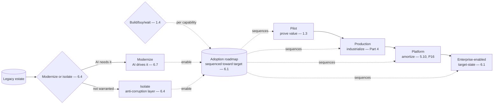

# Chapter 6.8 — Legacy Modernization & AI Adoption Strategy

| | |
|---|---|
| **Part** | 6 — Enterprise Architecture |
| **Maturity level** | 4 — Architect |
| **Difficulty** | Advanced |
| **Estimated study time** | 3 hours (reading 90 min, exercise 90 min) |
| **Prerequisites** | [1.3 Business Understanding](../part-1-professional-foundation/chapter-03-business-understanding.md); [6.1](chapter-01-ea-frameworks.md); [6.4](chapter-04-enterprise-integration.md) |

## Learning Objectives

After this chapter you will be able to:

1. Sequence AI adoption in a legacy estate: the pilot-to-platform path, the build-vs-buy-vs-wait decisions, and the modernization the AI adoption drives.
2. Make the AI adoption strategy: where to start, how to sequence, and how to move from scattered pilots to an AI-enabled enterprise.
3. Handle the legacy reality: the modernization the AI needs, the isolation where modernization isn't warranted, and the AI-as-modernization-driver dynamic.
4. Connect the adoption strategy to the EA target-state and roadmap, making AI adoption strategic rather than opportunistic.

## Introduction

This chapter is the adoption strategy that sequences the AI portfolio (6.1) into the enterprise's legacy estate — the pilot-to-platform path, the build-vs-buy-vs-wait decisions, and the legacy modernization the AI adoption entangles with. 6.1 built the AI portfolio and its target-state; 6.4 built the integration (including the legacy isolation); this chapter builds the *strategy* — how the enterprise moves from where it is (the legacy estate, the scattered pilots) to where it wants to be (the AI-enabled target-state — 6.1), sequenced as a roadmap that makes AI adoption strategic.

The framing: **AI adoption is a sequenced journey from pilots to platform, entangled with legacy modernization** — the sequencing (where to start, how to progress) makes AI adoption strategic (the roadmap toward the target-state — 6.1) rather than opportunistic (the scattered pilots — 6.1), and the legacy modernization (the AI needs modern data and integration, so the AI adoption drives the modernization) is the entanglement the strategy navigates.

## Business Motivation

The adoption strategy is what turns AI from scattered pilots into an enterprise transformation — the sequencing that determines whether the AI investment adds up to an AI-enabled enterprise or a pile of disconnected experiments. Without it: AI adoption is opportunistic (the scattered pilots — 6.1, chosen by enthusiasm — 1.3, disconnected from a roadmap), the pilots don't scale (the pilot-to-production gap — 1.7, no path to platform), and the legacy estate blocks the AI (the AI needs modern data and integration the legacy estate doesn't provide, and there's no modernization strategy) — the pilots that impressed and went nowhere. With it: AI adoption is sequenced (the roadmap toward the target-state — 6.1, the pilot-to-platform path), the successful pilots scale (the path to platform — 5.10, P16), and the legacy modernization is driven by the AI needs (the AI adoption driving the data and integration modernization the enterprise needed anyway — 6.7's forcing-function, modernization edition). The business case is the transformation one, sharpened by the pilots-don't-add-up reality: an enterprise with an AI adoption strategy (sequenced, pilot-to-platform, legacy-modernization-entangled) achieves the AI-enabled transformation (the pilots adding up to the target-state — 6.1), while one without wonders why the many pilots didn't transform the enterprise (the scattered-pilots-don't-add-up — 6.1) — the strategy is what makes the AI investment a transformation rather than a collection of experiments, and the architect who builds the adoption strategy operates at the strategic level (6.1's EA altitude) where the AI transformation is directed.

## Theory

### The pilot-to-platform path

The sequenced progression:

- **Pilot** — the initial proof (the scoped pilot proving the value — 1.3's business case, the pilot demonstrating the capability); the start, but not the end (the pilot-to-production gap — 1.7, the pilot is the beginning of the journey, not the destination).
- **Production** — the pilot taken to production (the production-grade system — Part 4, the pilot's demo becoming the reliable, governed, monitored system — 1.7's demo-to-production multiplier, the Part 4 industrialization).
- **Platform** — the production systems built on a shared platform (5.10, P16 — the platform amortizing the infrastructure across the systems, the golden paths — 5.10, the sprawl-avoided); the platform that makes AI scale across the enterprise (the many systems on the shared platform — 5.10's culmination).
- **Enterprise-enabled** — the AI woven into the enterprise (the target-state — 6.1, the AI-enhanced capabilities — 6.1, the AI a standard capability the enterprise builds with); the destination (the AI-enabled enterprise, the transformation).

The path's discipline: the sequenced progression (pilot → production → platform → enterprise-enabled), each stage building on the previous (the pilot proving value — 1.3, the production industrializing — Part 4, the platform amortizing — 5.10, the enterprise-enabling transforming — 6.1) — the sequencing that makes AI adoption a strategic journey.

### Build vs. buy vs. wait

The recurring adoption decision (1.4, adoption edition):

- **Build** — building the AI capability in-house (the custom system — the differentiation, the control, the cost and time — 1.4's build); chosen where the capability is differentiating (the proprietary data and workflow — 2.2's moat, the differentiation the enterprise builds).
- **Buy** — buying the AI capability (the vendor product, the SaaS — the speed, the lower cost, the less control and the lock-in — 7.10); chosen where the capability is commodity (the non-differentiating capability the enterprise buys rather than builds — 4.13's build-vs-buy, adoption edition).
- **Wait** — deferring the AI adoption for a capability (the capability not yet mature, or not yet worth the investment — the wait); chosen where the capability isn't ready or worth it yet (the honest wait — not every capability is adopted now, the sequencing defers the not-yet-ready).
- **The decision** (1.4) — the build-vs-buy-vs-wait matched to the capability (build the differentiating, buy the commodity, wait the not-yet-ready), the classical build-vs-buy with the wait option (the sequencing defers what isn't ready) — the adoption decision per capability, sequenced in the roadmap.

### Legacy modernization entanglement

The legacy reality the adoption navigates:

- **The AI needs modern foundations** — the AI needs modern data (5.5/6.7 — the governed, quality data the legacy estate may not provide) and modern integration (6.4 — the APIs and events the legacy estate may not expose); the AI adoption entangled with the modernization (the AI can't be built well on the un-modernized legacy foundations).
- **AI as the modernization driver** (6.7's forcing-function, modernization edition) — the AI adoption drives the legacy modernization (the AI's need for modern data and integration creating the business case for the modernization the enterprise needed anyway — the data modernization — 6.7, the integration modernization — 6.4); the AI-as-modernization-driver dynamic (the AI adoption forcing the modernization).
- **Isolate vs. modernize** (6.4) — the decision per legacy system: modernize it (where the AI needs it and the modernization is warranted — the strategic modernization) or isolate it (where the modernization isn't warranted — the anti-corruption layer isolating the AI from the legacy — 6.4, the isolate-now); the classical modernization decision (modernize the strategic, isolate the rest), sequenced.

## Architecture Perspective

Readings. **The pilot-to-platform path is the strategic sequencing** — the progression (pilot → production → platform → enterprise-enabled) sequenced toward the target-state (6.1) is what makes AI adoption strategic (the roadmap) rather than opportunistic (the scattered pilots — 6.1), and each stage builds on the previous (the pilot proving — 1.3, the production industrializing — Part 4, the platform amortizing — 5.10, the enterprise-enabling transforming — 6.1). **Build-vs-buy-vs-wait is the per-capability adoption decision** — the classical build-vs-buy (4.13, adoption edition) with the wait option (the sequencing defers the not-yet-ready), matched to the capability (build the differentiating — 2.2's moat, buy the commodity, wait the not-ready), sequenced in the roadmap — the adoption decisions that populate the sequenced journey. **And AI is the legacy-modernization driver** — the AI adoption entangled with the legacy modernization (the AI needs modern data — 5.5/6.7 and integration — 6.4), driving the modernization (the AI's needs creating the business case for the modernization the enterprise needed anyway — 6.7's forcing-function, modernization edition), with the modernize-vs-isolate decision per legacy system (6.4 — modernize the strategic, isolate the rest) — the AI adoption both needing and driving the modernization.

## Real-world Example

**Bellhaven Insurance** (the recurring EA-anchored portfolio — 6.1) built its AI adoption strategy, and the strategy is where 6.1's portfolio and target-state became the sequenced pilot-to-platform journey entangled with the legacy modernization. The pilot-to-platform path was the strategic sequencing: the submission-intake platform (2.1) started as a pilot (proving the value — 1.3's Tomás business case), went to production (Part 4's industrialization), and became the foundation for the platform (5.10 — the shared gateway, eval, observability the later systems built on — the platform amortizing across the intake, the assistant, the renewal advisor); the sequenced progression toward the AI-enabled target-state (6.1 — the AI woven into the underwriting, service, and retention capabilities). The build-vs-buy-vs-wait decisions were sequenced: the submission-intake (the differentiating capability — the proprietary submission data and underwriting workflow — 2.2's moat) was *built* (the differentiation), the general-purpose capabilities (the commodity — the document OCR — 2.1's trench coat, the general observability tooling) were *bought*, and some capabilities (the not-yet-mature — a fully-autonomous claims agent — 3.8's autonomy grid, not yet worth the risk) were *waited* (deferred in the roadmap) — the build-differentiating, buy-commodity, wait-not-ready, sequenced. The legacy modernization was the entanglement: the intake platform needed modern data (5.5/6.7 — the governed submission data the legacy submission systems didn't provide) and modern integration (6.4 — the APIs the legacy rating engine exposed via the anti-corruption layer), so the AI adoption drove the modernization (the data governance — 6.7, forced by the AI's needs — the forcing-function, the integration modernization — 6.4); and the modernize-vs-isolate decisions were made per legacy system (6.4 — the legacy submission database modernized where the AI needed it, the legacy rating engine isolated behind the anti-corruption layer where the modernization wasn't warranted — 6.4). And the strategy connected to the EA (6.1): the adoption roadmap sequenced the portfolio toward the target-state (6.1's roadmap), making the AI adoption strategic (the sequenced journey) rather than opportunistic (the scattered pilots the early era had been). The AI adoption lead's note: *"We moved from scattered pilots to a sequenced journey: pilot (prove value — 1.3), production (industrialize — Part 4), platform (amortize — 5.10), enterprise-enabled (the target-state — 6.1). Build the differentiating (the intake — our moat), buy the commodity, wait the not-ready. And the legacy modernization was entangled — the AI needed modern data and integration, so the AI adoption drove the modernization (the data governance forced by the AI's needs — 6.7), modernizing the strategic legacy and isolating the rest (6.4). The strategy is what turned the scattered pilots into a transformation — sequenced toward the target-state, entangled with the modernization the AI drove."*

## Hands-on Exercise

**Build the AI adoption strategy.** ~90 minutes. Analysis-primary, for an enterprise (real or a case study's).

1. **The pilot-to-platform sequencing (30 min).** For an enterprise's AI portfolio (6.1), sequence the pilot-to-platform path: which capabilities are pilots, which go to production, which build the platform, toward the target-state (6.1). Design the roadmap (the sequenced journey).
2. **Build-vs-buy-vs-wait (25 min).** For 5–6 AI capabilities, make the build-vs-buy-vs-wait decision (1.4): build the differentiating (2.2's moat), buy the commodity, wait the not-ready. Justify each and sequence them in the roadmap.
3. **Legacy modernization (20 min).** For the AI adoption, identify the legacy modernization it needs (the modern data — 5.5/6.7, the modern integration — 6.4), and the modernize-vs-isolate decisions per legacy system (6.4). Show the AI-as-modernization-driver dynamic (the AI driving the modernization — 6.7).
4. **The strategic connection (15 min).** Connect the adoption roadmap to the EA target-state and roadmap (6.1), making the AI adoption strategic (the sequenced journey toward the target-state) rather than opportunistic.

**Acceptance criteria:**
- [ ] The pilot-to-platform path sequenced as a roadmap toward the target-state (6.1)
- [ ] Build-vs-buy-vs-wait decisions made per capability (build differentiating, buy commodity, wait not-ready) and sequenced
- [ ] The legacy modernization identified (the AI's needs), with modernize-vs-isolate per system (6.4) and the AI-as-driver dynamic
- [ ] The adoption roadmap connected to the EA target-state (6.1), making the adoption strategic

## Enterprise Considerations

AI adoption strategy is a strategic enterprise-transformation concern, deeply connected to the EA and the business strategy. **It's an EA and business-strategy concern** (6.1, 1.3): the AI adoption strategy is part of the enterprise's technology and business strategy (the AI-enabled target-state — 6.1, the business value — 1.3), so the AI architect builds it with the EA function and the business leadership (the adoption strategy as a strategic artifact — 6.1's EA altitude, the business case — 1.3/6.10) — the adoption strategy operates at the strategic level. **The modernization entanglement is a major program** (6.4, 6.7): the legacy modernization the AI drives is often a major enterprise program (the data modernization — 6.7, the integration modernization — 6.4, the legacy replacement), with its own cost, timeline, and risk (1.7), so the AI adoption strategy and the modernization strategy are entangled programs (the AI adoption driving and depending on the modernization) that the enterprise sequences together. **The change management is significant** (1.8, 8.7): the AI adoption is an organizational transformation (the AI woven into the capabilities — 6.1, the workflows changed, the people affected — 1.8's adoption dynamics, the replacement fear — 1.8), so the adoption strategy includes the change management (the organizational adoption — 1.8, the team-building — 8.7) — the adoption is organizational as much as technical. **And the sequencing is a portfolio-governance concern** (6.9, 6.10): the adoption roadmap (the sequenced portfolio) is governed as a portfolio (6.9, the business case and TCO — 6.10), so the adoption strategy feeds the portfolio governance (the roadmap sequenced, the initiatives governed, the investment directed — 6.9/6.10).

## Trade-offs

| Decision | Option A | Option B | Choose A when… | Choose B when… |
|----------|----------|----------|----------------|----------------|
| Adoption approach | Sequenced (pilot-to-platform, roadmap) | Opportunistic (scattered pilots) | Always — the sequenced journey transforms; the scattered pilots don't add up (6.1) | Never opportunistic; the scattered pilots are the don't-add-up anti-pattern |
| Capability sourcing | Build (differentiating) | Buy (commodity) | The capability is differentiating (2.2's moat, the proprietary data/workflow) | The capability is commodity (buy, faster, cheaper — with the lock-in weighed — 7.10) |
| Not-ready capability | Wait (defer in the roadmap) | Adopt now | The capability isn't mature or worth it yet (the honest wait) | Never force the not-ready; the wait sequences it for later |
| Legacy system | Modernize (AI needs it) | Isolate (anti-corruption layer — 6.4) | The AI needs it and the modernization is warranted (strategic) | The modernization isn't warranted; isolate now, modernize later or never |

## Common Mistakes

1. **Opportunistic adoption** — the scattered pilots chosen by enthusiasm (1.3), disconnected from a roadmap, that don't add up to a transformation (6.1's don't-add-up); sequence the adoption (pilot-to-platform, toward the target-state — 6.1).
2. **The pilot-to-production gap** — the pilots that impressed and went nowhere (1.7's demo-to-production, no path to platform); sequence the pilot-to-platform path (the pilot is the beginning, not the end).
3. **Build-vs-buy confusion** — building the commodity (over-investing in the non-differentiating) or buying the differentiating (forfeiting the moat — 2.2); build the differentiating, buy the commodity (1.4/4.13).
4. **Forcing the not-ready** — adopting a not-yet-mature capability (the autonomous agent not yet worth the risk — 3.8), instead of waiting; the wait sequences the not-ready for later.
5. **AI on un-modernized legacy** — building the AI on the un-modernized legacy foundations (the un-governed data — 6.7, the un-exposed integration — 6.4), so the AI is built poorly; the AI needs modern foundations, and drives the modernization (6.7's forcing-function).
6. **Modernize-everything or isolate-everything** — modernizing all the legacy (the over-modernization) or isolating all of it (the never-modernize); modernize the strategic, isolate the rest (6.4), per system.
7. **Adoption disconnected from the EA** — the adoption strategy disconnected from the EA target-state and roadmap (6.1); connect it (the adoption strategic, sequenced toward the target-state).

## Best Practices

1. **Sequence the pilot-to-platform path** — pilot (prove — 1.3), production (industrialize — Part 4), platform (amortize — 5.10), enterprise-enabled (the target-state — 6.1); the sequenced journey that transforms.
2. **Make the build-vs-buy-vs-wait decisions per capability** — build the differentiating (2.2's moat), buy the commodity, wait the not-ready (1.4/4.13); sequenced in the roadmap.
3. **Drive the legacy modernization with the AI needs** — the AI's need for modern data (5.5/6.7) and integration (6.4) as the business case for the modernization the enterprise needed anyway (6.7's forcing-function, modernization edition).
4. **Modernize the strategic legacy, isolate the rest** — the modernize-vs-isolate per system (6.4 — modernize where the AI needs it, isolate behind the anti-corruption layer where it doesn't).
5. **Connect the adoption to the EA target-state** — the adoption roadmap sequenced toward the target-state (6.1), making the adoption strategic (the sequenced journey) rather than opportunistic.
6. **Include the change management** — the organizational adoption (1.8's dynamics, the replacement fear), the team-building (8.7); the adoption is organizational as much as technical.
7. **Govern the adoption as a portfolio** — the roadmap governed (6.9), the business case and TCO (6.10); the adoption feeding the portfolio governance.

## Architecture Checklist

For the AI adoption strategy:

- [ ] The pilot-to-platform path sequenced as a roadmap toward the target-state (6.1)
- [ ] Build-vs-buy-vs-wait decisions made per capability (build differentiating, buy commodity, wait not-ready — 1.4/4.13) and sequenced
- [ ] The legacy modernization the AI needs identified; the AI-as-modernization-driver leveraged (6.7's forcing-function)
- [ ] Modernize-vs-isolate decisions made per legacy system (6.4 — modernize strategic, isolate rest)
- [ ] The adoption roadmap connected to the EA target-state and roadmap (6.1); the adoption strategic, not opportunistic
- [ ] The change management included (the organizational adoption — 1.8, the team-building — 8.7)
- [ ] The adoption governed as a portfolio (6.9, business case and TCO — 6.10)

## Interview Questions

1. *"How do you sequence AI adoption in an enterprise?"* — Strong answers give the pilot-to-platform path (pilot → production → platform → enterprise-enabled, toward the target-state — 6.1), the build-vs-buy-vs-wait decisions per capability (build differentiating, buy commodity, wait not-ready — 1.4/4.13), and the legacy modernization entanglement (the AI needs and drives the modernization — 6.7), connected to the EA roadmap (6.1) — the sequenced journey that transforms.
2. *"When do you build vs. buy an AI capability?"* — Strong answers give the differentiating-vs-commodity (build the differentiating — the proprietary data and workflow, the moat — 2.2/4.13, buy the commodity — faster, cheaper, with the lock-in weighed — 7.10), plus the wait option (defer the not-yet-ready — 3.8's autonomy grid), sequenced in the roadmap.
3. *"How does AI adoption relate to legacy modernization?"* — Strong answers give the entanglement (the AI needs modern data — 5.5/6.7 and integration — 6.4) and the AI-as-driver (the AI adoption driving the modernization the enterprise needed anyway — 6.7's forcing-function), with the modernize-vs-isolate per legacy system (6.4 — modernize strategic, isolate rest behind the anti-corruption layer).
4. *"Why do enterprises end up with scattered AI pilots that don't transform anything?"* — Strong answers give the opportunistic-adoption anti-pattern (the pilots chosen by enthusiasm — 1.3, disconnected from a roadmap, that don't add up — 6.1's don't-add-up), the pilot-to-production gap (1.7), and the fix (the sequenced pilot-to-platform journey toward the target-state — 6.1, the adoption strategy that turns pilots into transformation).

## Further Reading

- 6.1 EA Frameworks (the target-state and roadmap) and 1.3 Business Understanding (the value and business case) — the strategic context this adoption strategy operates within.
- 6.4 Enterprise Integration (the legacy isolation and the anti-corruption layer) and 6.7 Data Governance (the data modernization) — the modernization the AI adoption drives.
- The legacy-modernization literature (the strangler-fig pattern and the modernization-strategy references) — the classical modernization approaches this chapter applies to the AI-driven modernization.
- 8.8 Operating as a Principal Architect — the strategic altitude the adoption strategy operates at.

## Summary

- AI adoption is a **sequenced journey from pilots to platform** — pilot (prove — 1.3), production (industrialize — Part 4), platform (amortize — 5.10), enterprise-enabled (the target-state — 6.1) — the sequencing that makes AI adoption strategic (the roadmap) rather than opportunistic (the scattered pilots that don't add up — 6.1).
- **Build-vs-buy-vs-wait** is the per-capability adoption decision (1.4/4.13, adoption edition) — build the differentiating (2.2's moat), buy the commodity, wait the not-ready — sequenced in the roadmap.
- **AI is the legacy-modernization driver** — the AI adoption entangled with the modernization (the AI needs modern data — 5.5/6.7 and integration — 6.4), driving the modernization the enterprise needed anyway (6.7's forcing-function, modernization edition), with modernize-vs-isolate per legacy system (6.4).
- The adoption strategy **connects to the EA target-state and roadmap** (6.1), making AI adoption strategic — and includes the **change management** (the organizational transformation — 1.8/8.7) and the **portfolio governance** (6.9/6.10).
- The strategy is what **turns scattered pilots into an enterprise transformation** — the sequenced journey toward the target-state, entangled with the modernization the AI drives, at the strategic altitude the senior architect operates at (8.8). The governance that oversees this portfolio and its decisions is next: **architecture governance** (6.9).

---

**Previous:** [Chapter 6.7 — Data Governance & Knowledge Management](chapter-07-data-governance-knowledge.md) · **Next:** [Chapter 6.9 — Architecture Governance: Boards, Reviews & Standards](chapter-09-architecture-governance.md) · **Related:** [6.1 EA Frameworks](chapter-01-ea-frameworks.md), [6.4 Enterprise Integration](chapter-04-enterprise-integration.md), [6.7 Data Governance](chapter-07-data-governance-knowledge.md)
