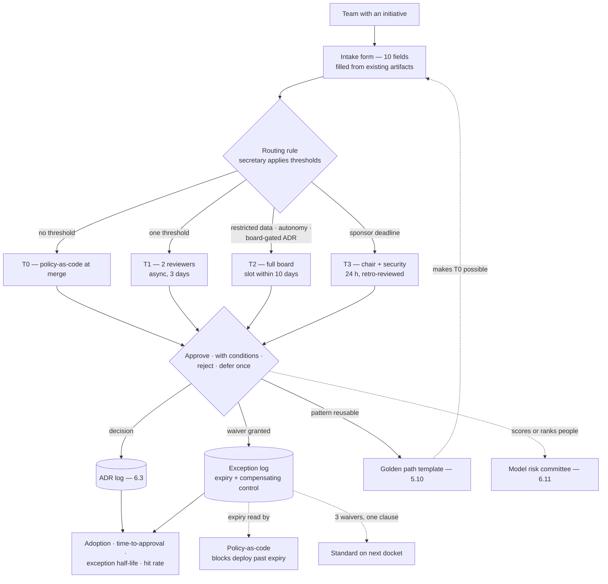

# Chapter 6.9 — Architecture Governance: Boards, Reviews & Standards

| | |
|---|---|
| **Part** | 6 — Enterprise Architecture |
| **Maturity level** | 4 — Architect |
| **Difficulty** | Advanced |
| **Estimated study time** | 2 hours (reading 40 min, exercise 80 min) |
| **Prerequisites** | [1.8 Leadership & Influence](../part-1-professional-foundation/chapter-08-leadership-influence.md); [6.3](chapter-03-adrs-decision-governance.md) |

## Learning Objectives

After this chapter you will be able to:

1. Charter a review board: membership by role, quorum, the scope thresholds that decide what arrives, decision rights, appeal path.
2. Operate an intake-to-decision pipeline — a fixed-field intake form, a tiered review SLA, and a routing rule that assigns tier mechanically.
3. Run standards as golden paths backed by an exception log whose waivers expire by construction.
4. Instrument the function with four metrics — golden-path adoption, time-to-approval, exception half-life, post-incident review hit rate — and route the AI-specific load.

## Introduction

Governance scales through enabling, not gating. That is the thesis, it is argued once here, and the rest of the chapter assumes it: a review teams can predict and afford is a review they use; one they cannot is a review they route around while shipping anyway.

What usually goes missing is everything after the thesis. A governance function is not a belief about enablement — it is a **charter** saying who decides what, an **intake form** whose fields do the triage, a **review SLA** telling a team when they get an answer, an **exception log** with expiry dates, and a **metric set** that says whether any of it works. This chapter builds those five, then attaches the AI-specific load. Chapter [6.3](chapter-03-adrs-decision-governance.md) built the records these decisions produce; here is the body that signs the top rung of 6.3's ladder.

## Business Motivation

Both failure modes are expensive, and they bill differently. **Under-governance** shows up as duplication and surprise: four teams building four retrieval stacks, a data flow nobody classified until an auditor asked, an exit clause nobody read. AI portfolios pay a premium because their riskiest properties — what data reaches a prompt, what runs without a human, whose decisions get scored — are invisible in a pipeline and visible only in a design.

**Over-governance** bills faster and more quietly, and queue time is the mechanism. When the wait for approval exceeds what a team believes the review is worth, the rational move is to relabel the work an experiment and ship it. The result is not a slower portfolio but an *unmeasured* one, surfacing months later in an egress log or an invoice. Time-to-approval is the price of compliance, and teams either pay it or evade it.

The upside funds the function: a live intake record and exception log answer security questionnaires, privacy audits, and model validation requests from records that already exist ([6.11](chapter-11-model-risk-management.md)).

## Theory

### The board charter

A board without a charter defaults to whoever attends. Five clauses do the work.

**Membership, by role rather than by name**, so the board survives reorganizations:

| Seat | Brings |
|---|---|
| Chair — principal or enterprise architect | Accountability; casting vote; signs conditions closed |
| Platform architect | Whether the design fits the golden path, and the cost of making it fit |
| Security architect | Threat surface, segmentation, egress ([6.5](chapter-05-security-architecture-zero-trust.md)) |
| Data & privacy | Classification, residency, retention ([4.14](../part-4-enterprise-genai-systems/chapter-14-privacy-compliance-governance.md)) |
| Responsible AI | Risk tier, fairness, human oversight ([2.8](../part-2-artificial-intelligence/chapter-08-responsible-ai.md)) |
| Rotating domain architect, from a line not under review | The outside reader who catches unstated assumptions |
| Secretary, non-voting | Routing rule; ADR record; exception log |

The presenting team attends and does not vote; the rotating seat spreads architectural judgement instead of concentrating it in six people.

**Quorum**: chair plus three, and any review touching restricted data is inquorate without the data and privacy seat. No proxies — a proxy carries the attendance but not the context.

**Scope thresholds** decide what arrives; crossing any one triggers review. Vantora's lines make the shape concrete, and every enterprise calibrates its own:

- Annualized run cost above $250k, or any multi-year vendor commitment.
- Customer-facing autonomy — an action a customer sees, taken without a human in the path.
- Restricted or regulated data classes in the prompt, the index, or the training set.
- Any decision on 6.3's board-gated rung: provider contract, data-use, residency.
- A new shared capability other teams will build on.
- Scoring or ranking people, which also triggers the model risk route below.

Everything under every threshold takes the golden path and self-attests: a large tail, deliberately unreviewed, and the charter says so in writing.

**Decision rights** are four: *approve*; *approve with conditions*, each named with an owner and a date, closed by evidence rather than by returning to the board; *reject*, naming the blocking risk, because "not comfortable" is not actionable; *defer once*, naming the missing input. The board may not add requirements after issuing conditions — unbounded re-review is how a body with decision rights behaves like one without them.

**Appeal**: the executive sponsor escalates once, within ten working days, to the architecture steering forum, which decides on the record and logs the outcome as an ADR whether the board is upheld or overruled. A board that is never appealed may simply be unappealable.

### Intake: the form that does the triage

A good intake form moves triage from the reviewer to the submitter. Ten fields:

1. **System and purpose** — one sentence in the customer's terms, with the KPI it moves.
2. **Owners** — accountable architect, product owner, the team carrying the pager.
3. **Stage and decision-needed date** — drives the tier and lets the secretary schedule.
4. **Approach-choice [ADR](../../GLOSSARY.md)** — the link, not a summary. Mandatory; see below.
5. **Data classes touched** — from the classification register, with residency and retention.
6. **Autonomy level** — [workflow](../../GLOSSARY.md) or [agent](../../GLOSSARY.md), plus the consequence class of anything done without a human.
7. **External dependencies** — providers, contracts, egress destinations.
8. **Cost estimate** — annualized, dominant driver named ([6.10](chapter-10-tco-business-case.md)).
9. **Checklist attestations** — the [architecture review checklist](../../checklists/architecture-review-checklist.md) self-scored, every "no" carrying one sentence, signed by the accountable architect.
10. **Requested decision and exceptions** — one sentence naming what the board is asked to approve ("customer-facing refunds up to $200 with a human on send"), plus waivers in exception-log format.

One rule keeps the form cheap: **every field is copied from an artifact that already exists**. If completing intake requires new writing, that gap is the review's first finding — usually at field 4.

### The review SLA and the routing rule

Published tiers turn governance from an unbounded risk in a delivery plan into a scheduled dependency:

| Tier | Trigger | Response time | Depth | Decided by |
|---|---|---|---|---|
| **T0 — self-service** | On the golden path, no threshold crossed | Immediate | Automated policy checks at merge | Tooling; logged |
| **T1 — async** | One threshold; no restricted data or customer-facing autonomy | 3 working days | Two named reviewers comment on the intake record | Chair, on reviewer concurrence |
| **T2 — full board** | Restricted data, customer-facing autonomy, board-gated ADR, shared capability | Slot within 10 working days | 45 min; intake circulated 3 days ahead; checklist walked | Board, quorum required |
| **T3 — expedited** | Incident remediation, or a sponsor-named deadline | 24 hours | Chair, security, one reviewer | Chair; retro-reviewed next board |

**The routing rule**: the secretary assigns tier mechanically from the intake fields. Any reviewer may escalate a tier; only the chair may lower one, in writing. T3 exists because a process with no legitimate fast door does not slow urgent work down — it loses it.

### Standards as golden paths, deviations as a log

Written, a standard is a document teams must read, remember, and translate. Embodied in a golden path — a template arriving with gateway integration, eval harness, observability, and policy defaults pre-wired ([5.10](../part-5-cloud-infrastructure-platform/chapter-10-iac-platform-engineering.md)) — it is something teams *receive*, which is why T0 can exist. The obligation is underestimated: when a standard changes, the template changes the same week, or the paved road becomes the slow road.

Standards that cannot flex get ignored, so each ships with a waiver route — the **exception log**, one table in version control:

| Field | Content |
|---|---|
| ID | `EXC-2026-014` — citable from the ADR and the deploy config |
| Standard waived | The exact clause; a standard's name alone is unauditable |
| System and accountable architect | A person — waivers belong to people, not teams |
| Reason | The specific constraint: not "timeline" but "the vendor SDK cannot use brokered credentials before release 4.2" |
| Compensating control | What covers the risk meanwhile, and its owner |
| Expiry date | 180 days maximum |
| Re-review owner | A named person, not "the board" |
| Status and closure | Open / closed-at-expiry / renewed once / standard amended |

**Expiry discipline** stops exceptions becoming policy. The log is machine-read and policy-as-code refuses the deploy past the date, so the calendar enforces rather than a reviewer's memory. Renewal is a decision, taken once; a *second* renewal request is evidence about the standard, and the chair's options narrow to amending it or refusing continued operation. Three live waivers against one clause put that clause on the next docket — a standard everyone deviates from describes a dead world.

### Measuring whether governance is working

Four metrics, each answering what the others cannot:

- **Golden-path adoption** — share of new systems started from the template, and of production traffic on it. Falling adoption is the earliest signal that the paved road stopped being the easy road, and it moves before any complaint reaches the board.
- **Time-to-approval by tier** — median and p90 days from intake to decision, published to teams. The p90 matters more, because evasion is decided by the worst case a team remembers.
- **Exception half-life** — median days a waiver stays open, and the ratio of closed-at-expiry to renewed. A rising half-life means the exception process has begun absorbing the standards' failures instead of surfacing them.
- **Post-incident review hit rate** — per significant incident: was this system reviewed, and did the review consider this failure mode? *Reviewed and caught* means the gap is enforcement; *reviewed and missed* grows the checklist; *never reviewed* means the thresholds are wrong.

Only the last tests whether reviews examine the right things. The anti-metrics — reviews held, standards published, attendance — all rise while a portfolio is being strangled.

### Where the AI-specific load attaches

Three attachments, all routing rather than new machinery. **The approach-choice ADR is a standing intake requirement**: no link, no intake. The [2.11](../part-2-artificial-intelligence/chapter-11-choosing-the-right-ai-approach.md) triage behind it doubles as the conceptual-soundness evidence a validator later asks for. **The MRM interlock**: any system that scores or ranks people also routes to model risk management — the board decides the architecture, the committee decides the model, and neither approves alone ([6.11](chapter-11-model-risk-management.md)). **Responsible-AI classification and data classes ride the same intake**: one submission, several reviewer lenses. Three AI boards with three forms is the shape that produces the queue that produces the evasion.

## Architecture Perspective

Read the couplings. The golden path feeds back into intake: every capability the template absorbs moves a population of systems from T1 to T0, which is what keeps a growing portfolio from growing its queue proportionally. The exception log feeds two consumers — tooling enforces expiry, waiver clustering puts standards back on the docket — and decisions fan out to records, not minutes.

## Real-world Example

**Vantora Systems** built architecture governance for its AI portfolio three times. The first was an advisory forum the platform architect, Adaeze, chartered after the gateway rollout: open invitation, monthly, no thresholds, no decision rights. In eight months it saw nine initiatives out of roughly forty, because teams brought work they wanted feedback on and withheld work they suspected might be stopped. The failure arrived as a sales-enablement assistant that reached production over a corpus including un-redacted customer contracts, and surfaced one customer's negotiated pricing to another customer's account team. Nothing had been circumvented; no threshold had ever been written down to cross.

The second was the CTO's correction — every AI initiative to the board. Within a quarter the p90 wait reached 25 working days, and two teams relabelled their work as internal experiments and shipped against personal provider keys, which the egress logs surfaced eleven weeks later ([6.5](chapter-05-security-architecture-zero-trust.md)). The mandate had manufactured the unreviewed systems it existed to prevent, faster than the absence of governance had.

The third is the five artifacts above, and it cost real things. To make a three-day async SLA credible, Adaeze had to staff it: two senior platform engineers on a permanent reviewer rota at roughly 30% time — about $340k a year of capacity, funded by cutting self-service tenancy from the platform roadmap, a feature three teams were waiting on. She also lost an argument she expected to win: she wanted restricted-data reviews handled async, security refused, and T2 kept its meeting and its ten-day slot. The third cost took nerve to write down — the thresholds leave a large tail of internal tools with no human review, recorded as an accepted consequence in the charter's ADR.

Nine months on, time-to-approval p90 had fallen to 6 working days. Of 14 waivers granted, 11 closed at expiry, 2 were renewed once, and one second-renewal request ended with the standard amended. The hit rate found the charter's one real error: an incident in a system never reviewed because it sat $40k under the cost threshold, which moved to $150k.

## Hands-on Exercise

**Charter and instrument a governance function.** ~80 minutes. Use your own organization or any Part 4/7 case-study portfolio.

1. **Charter (20 min).** Write the five clauses: membership by role, quorum including the seat that makes a review inquorate, three to six thresholds with your own numbers, the decision rights, and the appeal path with its time limit. State what your thresholds leave unreviewed.
2. **Intake form (15 min).** Draft your fields, marking for each the *existing* artifact it is copied from. Any field with no source artifact goes on a gap list.
3. **SLA and routing (15 min).** Build your tier table, then route five plausible initiatives, writing the tier and the field that decided it.
4. **Exception log (15 min).** Fill three rows for realistic deviations, with compensating controls, expiry dates, and named re-review owners. For one, write what happens on the second renewal.
5. **Metrics (15 min).** Define the four metrics with a source and a target, and name one anti-metric your organization reports today.

**Acceptance criteria:**
- [ ] Thresholds are numeric or categorical, testable from the intake form without a judgement call
- [ ] The charter states quorum, all four decision rights, and an appeal path with a time limit
- [ ] Every intake field names its source artifact, or appears on the gap list
- [ ] All five initiatives route to a tier, each citing the deciding field
- [ ] Every exception row has a compensating control, an expiry date, and a named re-review owner
- [ ] Each metric names a data source; the hit rate distinguishes its three outcomes

## Enterprise Considerations

The first placement question is whether this is a new board. Usually it should not be: the EA function ([6.1](chapter-01-ea-frameworks.md)) already has a review body, and the durable move is adding the AI decision classes to its docket and the AI seats to its roster. A separate AI board fragments the portfolio view.

Past a few hundred engineers, one board becomes the queue. What survives is domain boards running identical intake, SLA, and exception artifacts under a portfolio board holding only the cross-domain thresholds — shared capabilities, provider contracts, residency. Identical artifacts are what make federation work, since a waiver granted in one domain must be enforceable in another. Adjacent reviews should consume that same intake record rather than issue their own forms. Enforcement lives at commitment points: procurement holds vendor signatures for a board-gated ADR number ([6.3](chapter-03-adrs-decision-governance.md)), and the deploy pipeline reads the exception log.

The practice compresses honestly: a 200-person company runs one weekly slot, two thresholds, a shared exception sheet, and the same golden path, with the logs read as telemetry rather than filed ([8.8](../part-8-professional-excellence/chapter-08-principal-architect.md)).

## Trade-offs

| Decision | Option A | Option B | Choose A when… | Choose B when… |
|----------|----------|----------|----------------|----------------|
| Review trigger | Value/risk thresholds | Stage gates on every system | The portfolio has a long tail — thresholds concentrate reviewer time | Regulated estate where "unreviewed" is unacceptable; staff for the queue |
| Deviation handling | Time-boxed waiver | Amend the standard | The constraint is temporary and named — a vendor release, a migration | The waiver has been renewed, or several systems hit the same clause |
| Enforcement | Advisory board plus tooling | Hard gate in the pipeline | Most standards — tooling makes compliance the default without a stop button | Irreversible classes: data-use, customer-facing autonomy, residency |
| Reviewer staffing | Funded rota from the platform roadmap | Volunteers on top of delivery | The SLA is published and must hold — Vantora's $340k choice | Low volume; expect the SLA to slip under pressure |

## Common Mistakes

1. **The board with no thresholds.** Nothing states what must come, so what arrives is what teams felt safe bringing. Vantora's first version saw nine of forty initiatives and missed the one that mattered.
2. **Intake by slide deck.** Without fixed fields, reviewers spend the session reconstructing the design instead of assessing it, and no two submissions are comparable.
3. **Waivers without expiry.** The constraint passes, nobody revisits, and three years later the deviation is the de facto standard — discovered when a new system is refused for doing the same thing.
4. **The board that reviews and never decides.** "Come back next month with more detail," repeatedly, because decision rights were never written down. Teams learn it can only say "not yet," and stop bringing work.
5. **The standard that outruns its template.** The standard updates, the golden path does not, and complying now means leaving the paved road. Adoption falls quietly; nobody files a ticket.
6. **Reviewing after commitment.** The board convenes on a design whose provider contract is already signed, so it can only bless it — 6.3's decision laundering, at the board rather than in the log.

## Best Practices

1. **Write the charter before the first review** — membership, quorum, thresholds, decision rights, appeal, plus what is left unreviewed.
2. **Make the intake form the triage** — fields copied from existing artifacts, read mechanically by the routing rule, so tier is never negotiated.
3. **Publish the SLA and hold it**, and give urgency a legitimate door — an expedited tier with a retro-review obligation.
4. **Ship every standard as template plus tooling plus waiver route**, and change the template the same week the standard changes.
5. **Expire waivers mechanically** — policy-as-code reads the log; a second renewal means the standard is amended or the system stops.
6. **Run the post-incident hit rate quarterly** — the only loop that tells you your thresholds are wrong before an auditor does.

## Architecture Checklist

For standing up or auditing an architecture governance function:

- [ ] A written charter exists: membership by role, quorum, thresholds, decision rights, appeal path with a time limit
- [ ] Thresholds are testable from the intake form; what they exclude is stated in writing
- [ ] Intake fields are fixed and each sourced from an existing artifact; the approach-choice ADR link is mandatory
- [ ] The SLA is published per tier, the routing rule is applied by the secretary, and an expedited tier carries a retro-review obligation
- [ ] Every standard has a golden-path template, updated in step with the standard
- [ ] Every exception row carries clause, reason, compensating control, expiry, and a named re-review owner; expiry is tooling-enforced
- [ ] Systems that score or rank people route to model risk management as well as to the board
- [ ] The four metrics are collected; the hit rate distinguishes enforcement, checklist, and threshold gaps

## Interview Questions

1. *"Design the intake and review process for an AI portfolio of about sixty systems."* — Strong answers start from thresholds and tiers rather than a board calendar, describe an intake form whose fields do the routing, and state what never reaches a human reviewer. Weak answers describe a weekly meeting.
2. *"Your review queue is five weeks deep and teams are shipping around it. What do you change first?"* — Strong answers read queue length as the leading indicator of evasion and cut the arriving population before adding reviewers: raise thresholds, move a class of systems onto the golden path, split async from board review.
3. *"How do you stop exceptions becoming the standard?"* — Strong answers reach for the log's mechanics — expiry dates, compensating controls, named re-review owners, tooling that enforces the date — and the escalation rule: the second renewal is a decision about the standard.
4. *"How would you know, a year in, whether your governance is working?"* — Strong answers refuse activity metrics and offer the four, with the hit rate and its three distinct repairs.

## Further Reading

- The TOGAF Standard, architecture governance chapters (opengroup.org) — the classical framing of governance bodies, repositories, and compliance reviews; read it for vocabulary, with the ceremony calibrated down.
- Matthew Skelton and Manuel Pais, *Team Topologies* — the enabling-team and platform-as-product arguments behind why a golden path outperforms a mandate.
- Backstage documentation (backstage.io), particularly software templates — the tooling shape of a golden path, whether or not you adopt the tool.
- The [architecture review checklist](../../checklists/architecture-review-checklist.md) and [6.3](chapter-03-adrs-decision-governance.md) — the checklist a full-board session walks, and the records every decision produces.

## Summary

- Governance scales through enabling rather than gating, and the thesis is worth nothing without artifacts: a charter, an intake form, a review SLA, an exception log, a metric set.
- The charter names membership by role, quorum, scope thresholds, four decision rights, and an appeal path — including what is left unreviewed.
- Intake is the triage: fixed fields copied from existing artifacts, the approach-choice ADR mandatory, feeding a routing rule that assigns a tier mechanically — self-service, async, full board, expedited.
- Standards live as golden-path templates kept in step with the standards; deviations live in an exception log where expiry is tooling-enforced and a second renewal forces amendment or refusal.
- Four metrics say whether it works — adoption, time-to-approval p90, exception half-life, and the post-incident hit rate, pointing at enforcement, checklist, or threshold gaps. The AI-specific load attaches by routing, not by new bodies. What justifies the portfolio these boards govern is next: **TCO & the business case for AI** ([6.10](chapter-10-tco-business-case.md)).

---

**Previous:** [Chapter 6.8 — Legacy Modernization & AI Adoption Strategy](chapter-08-legacy-modernization-ai-adoption.md) · **Next:** [Chapter 6.10 — TCO & the Business Case for AI](chapter-10-tco-business-case.md) · **Related:** [1.8 Leadership & Influence](../part-1-professional-foundation/chapter-08-leadership-influence.md), [5.10 IaC & Platform Engineering](../part-5-cloud-infrastructure-platform/chapter-10-iac-platform-engineering.md), [6.3 ADRs & Decision Governance](chapter-03-adrs-decision-governance.md)
