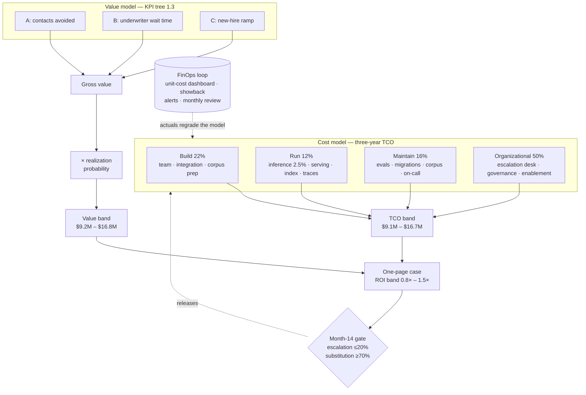

# Chapter 6.10 — TCO & the Business Case for AI

| | |
|---|---|
| **Part** | 6 — Enterprise Architecture |
| **Maturity level** | 4 — Architect |
| **Difficulty** | Advanced |
| **Estimated study time** | 3 hours (reading 45 min, exercise 2 h 15 min) |
| **Prerequisites** | [1.3 Business Understanding](../part-1-professional-foundation/chapter-03-business-understanding.md); [1.7 Estimation](../part-1-professional-foundation/chapter-07-estimation.md); [4.11](../part-4-enterprise-genai-systems/chapter-11-cost-engineering.md) |

## Learning Objectives

After this chapter you will be able to:

1. Build a three-year [TCO](../../GLOSSARY.md) model with named lines under build, run, maintain, and organizational — and read its *shape*, not just its total.
2. Derive unit economics end-to-end: the funnel from requests to AI-resolved to human-escalated, the division that produces a cost per unit, and the manual baseline that makes it mean something.
3. Run sensitivity on the three levers that move a GenAI bill, and say which one can kill the case alone.
4. Convert a KPI tree into a value band with realization probabilities, then present cost and value as bands in a one-page case a CFO can act on.

## Introduction

[1.7](../part-1-professional-foundation/chapter-07-estimation.md) taught you to estimate one system's cost and timeline; [4.11](../part-4-enterprise-genai-systems/chapter-11-cost-engineering.md) taught you to engineer the inference bill down once it runs. This chapter is the assembly — the artifact that goes to the funding committee, where full lifecycle cost meets a discounted value estimate and someone signs.

Two claims explain why GenAI business cases fail in a specific way, and the worked example below runs both to their arithmetic: the build is the small part, and what outlives it is staffed by people rather than servers; and the inference bill is a rounding error next to the human review capacity the system creates.

## Business Motivation

The business case converts an architecture into a budget line, and its failure modes are asymmetric. An under-scoped case gets funded and collapses in month twelve, when the escalation desk nobody costed arrives as an unbudgeted hiring request — a collapse that costs more than the project, because it spends the sponsor's credibility on the *next* AI initiative too. An over-scoped case never gets funded, and the capability is bought from a vendor at worse terms eighteen months later.

The architect owns this document because nobody else can produce its cost side. Finance can build a discounted cash flow; only the architect knows that provider deprecations force a prompt migration every eight months, and that raising an automation rate from 83% to 90% is not a configuration change. The value side stays with the business ([1.3](../part-1-professional-foundation/chapter-03-business-understanding.md)) — an honest case is one where both parties recognize their own numbers.

## Theory

All figures below are illustrative composites — realistic in shape, invented in value, never citable as industry data. Prices are as modelled in 2026 ([1.7](../part-1-professional-foundation/chapter-07-estimation.md) on date-stamping).

### The three-year TCO, with rows

**Bellhaven Insurance** ([1.3](../part-1-professional-foundation/chapter-03-business-understanding.md)) runs an internal assistant platform for 5,000 seats: policy-wording lookups, claims-procedure questions, IT and HR service requests, with tool calls into the service-management system. Fully loaded engineering cost is $195,000 per FTE-year. Volumes: 240,000 requests in Year 1 (staged rollout), 450,000 in Year 2, 510,000 in Year 3.

The inference line comes from the token math. One request averages six primary model calls; per call, a 2,000-token cached prefix at $0.30/M ($0.0006), 9,400 fresh input tokens at $3.00/M ($0.0282), and 600 output tokens at $15.00/M ($0.0090) — **$0.0378 per call**, so $0.2268 for six. Three guardrail and query-rewrite calls on a compact tier plus 10% judge sampling add roughly $0.007. Planning figure: **$0.23 per request**.

| Block | Line | Year 1 | Year 2 | Year 3 | 3-year |
|---|---|---:|---:|---:|---:|
| **Build** | Platform engineering (6.0 → 1.6 FTE) | 1,170,000 | 312,000 | 0 | 1,482,000 |
| | Enterprise integration (ITSM, IAM, HRIS, document repositories) | 420,000 | 130,000 | 0 | 550,000 |
| | Corpus preparation & permission mapping | 310,000 | 88,000 | 0 | 398,000 |
| | **Build subtotal** | **1,900,000** | **530,000** | **0** | **2,430,000** |
| **Run** | Model inference (@ $0.23/request) | 55,200 | 103,500 | 117,300 | 276,000 |
| | Serving & platform infrastructure | 150,000 | 220,000 | 250,000 | 620,000 |
| | Vector store & embedding refresh | 60,000 | 80,000 | 90,000 | 230,000 |
| | Observability, traces & eval runs | 55,000 | 85,000 | 100,000 | 240,000 |
| | **Run subtotal** | **320,200** | **488,500** | **557,300** | **1,366,000** |
| **Maintain** | Eval suite upkeep (0.8 → 1.0 FTE) | 156,000 | 195,000 | 195,000 | 546,000 |
| | Prompt & model migrations | 60,000 | 145,000 | 160,000 | 365,000 |
| | Corpus refresh & re-indexing | 95,000 | 140,000 | 160,000 | 395,000 |
| | Platform on-call & SRE | 117,000 | 195,000 | 195,000 | 507,000 |
| | **Maintain subtotal** | **428,000** | **675,000** | **710,000** | **1,813,000** |
| **Organizational** | Escalation & supervision desk (@ $21.00/escalation) | 856,800 | 1,606,500 | 1,820,700 | 4,284,000 |
| | Governance, model risk & assurance | 180,000 | 150,000 | 150,000 | 480,000 |
| | Training, enablement & change management | 460,000 | 210,000 | 180,000 | 850,000 |
| | **Organizational subtotal** | **1,496,800** | **1,966,500** | **2,150,700** | **5,614,000** |
| | **TOTAL** | **4,145,000** | **3,660,000** | **3,418,000** | **11,223,000** |

Three readings the total alone will not give you. **Build is 46% of Year 1 and 0% of Year 3** — 22% across three years, so a build-only case understates by construction. Bellhaven's first case did exactly that ($2.4M to build plus "about $400K a year to run") and landed at $3.6M against an honest $11.2M, a 3.1× miss. **Inference is $276,000, or 2.5% of TCO**; the line everyone argues about matters least, while the escalation desk alone is $4,284,000, or 38%. **And the lines scale on different drivers**, which is what makes the model predictive: Year 3's $3,418,000 splits into $2,288,000 on *request volume* (inference, serving, observability, escalation desk), $180,000 on *seats* (training and enablement), and $950,000 on *models and corpus* — eval upkeep, migrations, corpus refresh, vector store, on-call, governance — which move when a provider deprecates, not when traffic doubles.

### Unit economics, end to end

The funnel over three years: **1,200,000 requests** enter the assistant; **83% (996,000)** are resolved without a human; **17% (204,000)** escalate to a specialist who receives the transcript and the assistant's research.

Now the division. Fully loaded cost per request entering: **$11,223,000 ÷ 1,200,000 = $9.35** — $5.78 of platform ($6,939,000 ÷ 1,200,000, TCO less the escalation desk) plus $3.57 of escalation ($4,284,000 ÷ 1,200,000). Allocating the whole TCO only to requests the assistant closed gives **$11,223,000 ÷ 996,000 = $11.27 per AI-resolved request** — the number to quote when someone asks what automation costs.

The baseline makes it mean something. Before launch Bellhaven handled about 380,000 internal contacts a year: a tier-1 agent at $78,400 fully loaded taking 7,000 contacts ($11.20 each) and a knowledge specialist at $147,500 taking 5,000 ($29.50 each), roughly 50/50 — **$20.35 per contact**. The naive comparison is $20.35 against $9.35, saving $11.00 a request, and it is wrong: assistant volume exceeds old contact volume because self-service beats filing a ticket. Sampling 1,200 transcripts against the pre-launch taxonomy put the **substitution rate at 78%**; the rest is induced demand — real value, but not displaced labor. So 936,000 substitutable requests × $20.35 = **$19,047,600** of baseline-equivalent labor against $11,223,000 of TCO: a gross operating delta of **$7,824,600**, not the $13.2M the naive division implies.

### Sensitivity: three levers, one of them lethal

Recomputed against the $11,223,000 base, holding everything else at plan:

| Lever | Move | 3-year TCO impact |
|---|---|---:|
| Request volume | +40% (1.2M → 1.68M) | +2,168,000 (+19%) |
| Model price per token | +25% (or mix shifts to a reasoning tier) | +69,000 (+0.6%) |
| Escalation rate | 17% → 26% | +2,268,000 (+20%) |

All three together give a pessimistic TCO of **$16,662,800**: the $5,803,000 of non-scaling lines, plus escalations at 436,800 × $21 = $9,172,800, inference at 1,680,000 × $0.2875 = $483,000, serving at $868,000, and observability at $336,000.

What each lever does to the *case* matters more than what it does to the bill. Volume adds $2.17M of cost but adds substitutable requests too, so it is broadly self-financing. Price moves the total by less than 1% — which is why "we'll renegotiate with the provider" is not a business-case answer, and why [4.11](../part-4-enterprise-genai-systems/chapter-11-cost-engineering.md)'s token levers are an operating discipline rather than a funding argument. The escalation rate kills alone: at 26% and plan volume, TCO reaches $13,491,000 against a central value of $13,564,811 — a net of $73,811, breakeven to three significant figures. **A quality plateau is a financial event**, which is why the eval suite is a business-case line.

### The value side: KPI tree, then realization

Three disjoint leaves, each with a gross estimate and a probability the money is actually captured ([1.3](../part-1-professional-foundation/chapter-03-business-understanding.md)'s KPI trees, [1.7](../part-1-professional-foundation/chapter-07-estimation.md)'s risk discipline):

- **A — service-desk contacts avoided.** 936,000 substitutable requests × $20.35 = **$19,047,600**. Realization sits well under 1.0 because desk headcount falls only at attrition boundaries, and some freed capacity is reabsorbed as better service rather than lower cost.
- **B — underwriter wait time eliminated.** 240 underwriters × 1.1 hours/week × 46 weeks = 12,144 hours a year; at 2.4 productive hours per quoted submission, 5,060 extra submissions; at a 22% bind rate, 1,113 policies; at $9,400 average premium and 6% margin contribution, $564 each — **$627,732 a year**, ramped 0.4/1.0/1.0 for **$1,506,557**. Note the boundary: leaf A counts the *desk's* handling cost, leaf B the *underwriter's* waiting cost. Without that split the tree books one interaction twice.
- **C — new-hire ramp.** 620 hires × 6 working days saved × $340 fully loaded = **$1,264,800**.

| Scenario | A | B | C | Risk-adjusted value | vs. TCO $11.22M |
|---|---:|---:|---:|---:|---:|
| Conservative (45% / 25% / 20%) | 8,571,420 | 376,639 | 252,960 | **9,201,019** | −2.02M · 0.82× |
| Central (65% / 45% / 40%) | 12,380,940 | 677,951 | 505,920 | **13,564,811** | +2.34M · 1.21× |
| Optimistic (80% / 60% / 55%) | 15,238,080 | 903,934 | 695,640 | **16,837,654** | +5.61M · 1.50× |

The output is a band — **0.8× to 1.5×, central 1.2×** — and the band is the honest artifact. A committee told "ROI is 1.21×" discovers the third decimal is fiction and stops trusting the first. A committee told the case goes negative if desk capacity is reabsorbed rather than released will do something about that, which is the point.

### FinOps that survives contact with the platform

Four practices, each with an owner and a cadence. **Showback in Year 1, chargeback from Year 2** — departments see request counts and allocated cost at the $9.35 unit rate before they are billed, so the first invoice is never the first information. **A unit-cost dashboard** carrying three numbers rather than a spend total: cost per request entering, cost per AI-resolved request, escalation rate — because a rising bill on flat unit cost is adoption and needs no intervention. **Budget alerts** on spend against plan, unit-cost drift beyond ±15%, and any 90-day escalation rate above 20%. **A monthly review** — platform lead, finance business partner, the two largest consuming departments — working variance, unit-cost trend, top drivers, decisions taken.

### The one page that survives a CFO

1. **The ask** — $4,145,000 in Year 1, $11,223,000 across three years, Year 2 and Year 3 profiles shown.
2. **The TCO band** — $9.1M to $16.7M, central $11.2M, the three levers named with their arithmetic attached.
3. **The value band** — $9.2M to $16.8M risk-adjusted, central $13.6M, with the KPI tree and realization factors visible as assumptions someone can argue with.
4. **Risks with mitigations** — escalation above 20% (eval investment held at 1.0 FTE, quarterly automation-rate review); realization below 45% (a non-backfill schedule agreed with the service-desk owner before funding); provider deprecation (migration already budgeted at $365,000).
5. **The decision requested** — approve Year 1 and a month-14 gate, releasing Year 2 only if the 90-day escalation rate is ≤20% and measured substitution ≥70%. The gate is what makes the conservative scenario survivable.

## Architecture Perspective

Read the diagram for its two edges rather than its boxes. The **realization edge** is where a value model becomes a business case: gross benefit is what the KPI tree computes, risk-adjusted benefit is what the organization can bank, and the gap is a negotiation with a named owner rather than a spreadsheet cell. The **FinOps feedback edge** makes the model an instrument instead of a document — monthly unit cost regrades the estimate, which is the only mechanism by which a month-14 gate becomes a real decision. Both edges depend on the metering [4.11](../part-4-enterprise-genai-systems/chapter-11-cost-engineering.md) requires: a platform that cannot attribute cost per request per department cannot produce this artifact.

## Real-world Example

**Bellhaven Insurance** funded the assistant platform twice.

The first case was built by the platform team alone, over four days, ahead of a budget deadline: a build number ($2.4M), an inference estimate, and a value claim lifted from the pilot's satisfaction survey. It was approved. By month eleven the platform was live to 3,100 seats and the automation rate had settled at 71% rather than the assumed 88%, most of the gap in claims-procedure questions where the corpus was inconsistent across two legacy books. The escalation volume that produced landed on a desk already cut by four heads in anticipation of the savings, and queue times went up. The unbudgeted request to hire seven specialists is how the finance business partner, Priya Raghavan, first saw the platform's numbers.

The rebuild took six weeks and was co-authored. Priya supplied the $20.35 blended baseline from payroll and the ticket system, and refused the platform team's first value figure outright — they had counted every assistant request as a displaced contact. The transcript sample that produced the 78% substitution rate was her condition for signing. Her realization factors were lower than the architects expected and the harder conversation: 65% central, on the grounds that the desk sheds cost only at attrition boundaries.

The decision that cost something came out of the rebuilt model. At an honest $11.2M against a central $13.6M the case cleared — but only if eval upkeep held at a full FTE and the claims-procedure corpus was rebuilt, and there was no room for both those and the planned claims-adjuster module. The module was cancelled, writing off $780,000 of build already spent and removing $3.1M of claimed benefit. The steering group took the smaller platform over the larger promise and attached the month-14 gate.

At month fourteen the escalation rate was 18.4% and measured substitution 74%, so Year 2 was released — but the rollout stopped at 5,000 seats rather than the planned 9,000, because at that substitution rate the marginal seats did not clear the gate's own arithmetic.

## Hands-on Exercise

**Build a defensible business case with working arithmetic.** ~2 h 15 min. Use your own initiative or any Part 4/7 case-study system. Work in a spreadsheet — the acceptance criteria are checkable only if the sums are live.

1. **TCO model (45 min).** Three years, at least three lines per block. Derive inference from explicit token math — tokens per call, calls per request, date-stamped prices. Tag every line with its scaling driver (volume, seats, models/corpus) and total each driver by year.
2. **Unit economics (30 min).** State the funnel: requests, AI-resolved, human-escalated. Divide TCO by both denominators. Build the manual baseline from payroll and throughput, then apply a substitution rate and say how you would measure it.
3. **Sensitivity (25 min).** Recompute the three-year total for volume +40%, unit price +25%, and human-review rate +50% relative — each alone, then all three. Rank the levers and name the one that can push the case below breakeven by itself.
4. **Value band (25 min).** A KPI tree with at least three disjoint leaves; conservative, central, and optimistic realization probabilities, each justified in a line; three value totals.
5. **The one page (10 min).** Ask, TCO band, value band, three risks with mitigations, decision requested — the gate as a measurable threshold.

**Acceptance criteria:**
- [ ] Every column sums to its stated total and every row to its 3-year figure — check both directions
- [ ] The inference line traces to tokens × price × calls × volume, prices date-stamped; each line carries a scaling driver and per-driver totals reconcile
- [ ] Cost per unit given for both denominators; the manual baseline is derived, not asserted
- [ ] The substitution rate carries a measurement method and is not 100%
- [ ] Sensitivity gives three recomputed totals and names the lethal lever
- [ ] The KPI tree's leaves are disjoint — state the boundary between any two
- [ ] The ROI output is a band, and the decision requested carries a numeric threshold and a date

## Enterprise Considerations

Budget cycles quantize what you built as a band: annual planning wants one number, and the professional answer is a staged ask with a gate, not a fabricated point. Capitalization rules cut across your blocks — build effort is often capitalizable while eval upkeep and escalation staffing are operating expense, which changes how the case reads without changing a dollar of TCO; ask finance which lines land where before formatting the table. Portfolio comparison is where unit-cost discipline pays twice: initiatives with incomparable value stories become comparable at cost per resolved unit, which is why [6.1](chapter-01-ea-frameworks.md)'s portfolio view depends on this arithmetic existing per initiative. And the escalation desk is an organizational design decision before it is a cost line — whether it sits inside the service desk or beside it decides whether the saving is capturable at all, and [6.11](chapter-11-model-risk-management.md)'s supervision requirements often settle it.

## Trade-offs

| Decision | Option A | Option B | Choose A when… | Choose B when… |
|----------|----------|----------|----------------|----------------|
| Escalation staffing model | Dedicated AI escalation desk | Escalations return to the existing service desk | Volume justifies specialists; transcript-aware handling raises resolution | Volume is low or seasonal; a dedicated desk becomes idle capacity you cannot shed |
| Value presentation | Gross benefit with realization factors shown | Pre-discounted net benefit only | The audience will argue the factors — better they argue assumptions than the total | The committee's culture treats visible discounting as weakness; keep the working, present the net |
| Cost allocation basis | Per request | Per seat | Usage is uneven across departments; you want consumption incentives | Usage is broad and even; per-seat billing is cheaper to administer and predictable |
| Funding shape | Staged with a measured gate | Full three-year commitment upfront | The conservative scenario is negative — the gate is what makes the ask safe | Momentum matters more than optionality and the sponsor can absorb a bad year |

## Common Mistakes

1. **Costing the platform and not the operating model.** Bellhaven's first case priced every server and nobody on the receiving end of an escalation. The desk was 38% of the honest TCO and appeared as zero.
2. **Cutting baseline headcount before the automation rate is measured.** Four heads left the service desk on the strength of an assumed 88%. The actual 71% arrived as a queue crisis that cost more to fix than the savings.
3. **Counting every request as a displaced contact.** Substitution was 78%. The other 22% is real value and belongs in the case as adoption evidence — not in the labor-savings leaf, where it inflates a number the CFO will later audit.
4. **Optimizing the 2.5% line.** Weeks on token efficiency while the escalation rate — twenty times more consequential — is nobody's KPI.
5. **KPI trees that double-count.** One underwriter interaction booked once as an avoided desk contact and once as returned underwriter hours; it survives review because the leaves sit in different sections of the document.
6. **A gate with no threshold.** "Review at month 14" is a meeting. "Release Year 2 if the 90-day escalation rate is ≤20%" can go either way, which is the only kind worth writing down.

## Best Practices

1. **Build the table before the narrative.** The shape — build small, organizational large, inference marginal — is the argument; prose written first argues for whatever the author already believed.
2. **Tag every line with its scaling driver.** A model that cannot answer "what if traffic doubles" is a snapshot, not a forecast.
3. **Derive the manual baseline from payroll and throughput, and measure the substitution rate.** Both are sourceable in a week, and together they are what makes the comparison survive challenge.
4. **Co-author with finance from the first draft.** Realization factors, the capitalization split, and the baseline live on their side; a case they helped build is a case they defend.
5. **Publish unit cost monthly** — per request entering and per resolved request, next to the escalation rate — so a rising bill is diagnosable as adoption or regression before anyone asks.
6. **Attach a numeric gate to every staged ask.** A threshold and a date turn a wide, honest band from a weakness in the pitch into the reason it is credible.

## Architecture Checklist

Before a business case goes to a funding committee:

- [ ] Three-year table with named lines under build, run, maintain, organizational; columns and rows both sum
- [ ] Inference derived from token math with date-stamped prices, and its share of TCO stated
- [ ] Human review, supervision, and escalation capacity costed as lines, not assumed away
- [ ] Every line carries a scaling driver; per-driver totals reconcile to the year total
- [ ] Unit economics stated for both denominators, against a derived manual baseline
- [ ] Substitution rate measured, or scheduled with a method
- [ ] Sensitivity run on volume, unit price, and human-review rate; the lethal lever named
- [ ] Value from a KPI tree with disjoint leaves and explicit realization probabilities
- [ ] Output is a band, and the conservative scenario's consequence is stated
- [ ] FinOps mechanics named: showback or chargeback, unit-cost dashboard, alert thresholds, review cadence
- [ ] One page carries ask, TCO band, value band, risks with mitigations, and a decision with a numeric gate

## Interview Questions

1. *"Build the TCO for a 5,000-seat internal AI assistant."* — Strong answers produce lines under all four blocks and reach for human-review capacity early; they derive inference from token math and then say it is a small share. Weak answers cost infrastructure and stop.
2. *"What's your cost per resolved ticket, and how does it compare to a human?"* — Strong answers state the funnel, name both denominators, derive the baseline from payroll and throughput, and volunteer the substitution rate unprompted, because the comparison is meaningless without it.
3. *"Which variable would you most want to be right about?"* — Strong answers rank levers by measured impact rather than intuition — human-review rate, then volume, then price a distant third — and connect the review rate back to eval investment, making the quality budget a financial argument.
4. *"Your CFO says the benefits look optimistic. Respond."* — Strong answers agree, show the realization factors already applied, name who owns each leaf, and offer the gate — making the discount a shared assumption with an owner rather than a contested number.

## Further Reading

- Douglas Hubbard, *How to Measure Anything* — calibrated estimation and the value-of-information logic behind which assumption to measure first; the companion to this chapter's realization factors.
- FinOps Foundation materials (finops.org) — the unit-economics, showback, and allocation vocabulary borrowed here; read the allocation guidance before choosing per-request versus per-seat.
- Your finance function's capitalization policy and business-case template — the two documents that decide how your table is read; getting them early is cheaper than reformatting later.
- [4.11 Cost Engineering](../part-4-enterprise-genai-systems/chapter-11-cost-engineering.md) for the levers acting on the run block, and [1.7 Estimation](../part-1-professional-foundation/chapter-07-estimation.md) for the range discipline every band here depends on.

## Summary

- A GenAI platform's TCO is dominated by what happens after launch: build is 22% of the worked example's three-year $11,223,000, while organizational cost — chiefly the escalation desk — is 50%.
- **Inference is 2.5% of that TCO.** Derive it from token math because you must, then spend your analysis where the money is.
- Unit economics need a funnel, two denominators, and a derived baseline: $9.35 per request entering and $11.27 per AI-resolved request against $20.35 per human contact — corrected by a **measured 78% substitution rate**, without which the saving is badly overstated.
- Sensitivity ranks the levers: volume +40% adds 19% to the bill, model price +25% adds 0.6%, and a human-review rate moving from 17% to 26% adds 20% and reaches breakeven alone. **The eval budget is a financial control.**
- Value comes from a KPI tree with disjoint leaves discounted by realization probabilities, giving an ROI **band of 0.8× to 1.5×** — and the band, with a numeric gate attached, is what makes the ask credible rather than what weakens it.
- The one page carries ask, TCO band, value band, risks with mitigations, and a decision request. The regime that decision must then survive is next: model risk management and AI regulation ([6.11](chapter-11-model-risk-management.md)).

---

**Previous:** [Chapter 6.9 — Architecture Governance: Boards, Reviews & Standards](chapter-09-architecture-governance.md) · **Next:** [Chapter 6.11 — Model Risk Management & AI Regulatory Governance](chapter-11-model-risk-management.md) · **Related:** [1.3 Business Understanding](../part-1-professional-foundation/chapter-03-business-understanding.md), [1.7 Estimation](../part-1-professional-foundation/chapter-07-estimation.md), [4.11 Cost Engineering](../part-4-enterprise-genai-systems/chapter-11-cost-engineering.md)
