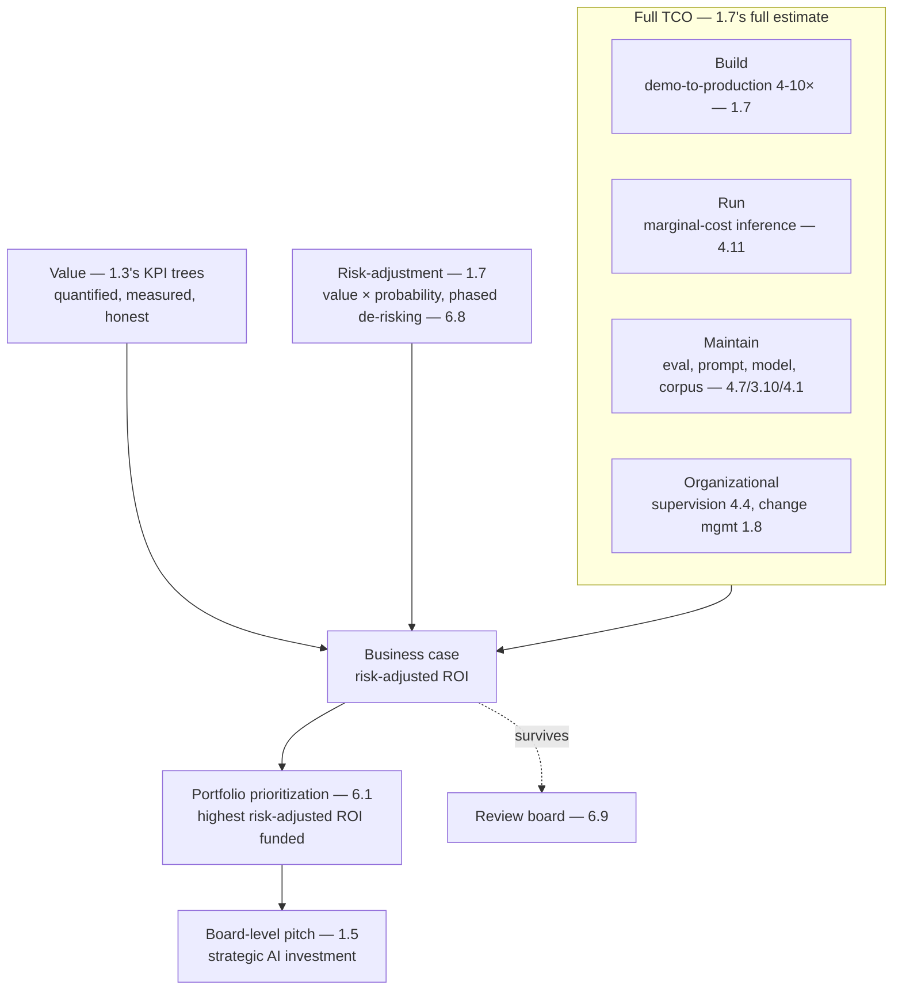

# Chapter 6.10 — TCO & the Business Case for AI

| | |
|---|---|
| **Part** | 6 — Enterprise Architecture |
| **Maturity level** | 4 — Architect |
| **Difficulty** | Advanced |
| **Estimated study time** | 4 hours (reading 2 h, exercise 2 h) |
| **Prerequisites** | [1.3 Business Understanding](../part-1-professional-foundation/chapter-03-business-understanding.md); [1.7 Estimation](../part-1-professional-foundation/chapter-07-estimation.md); [4.11](../part-4-enterprise-genai-systems/chapter-11-cost-engineering.md) |

## Learning Objectives

After this chapter you will be able to:

1. Build the full business case for an AI initiative: TCO, value quantification, risk-adjusted ROI, and the pitch that survives a review board.
2. Model the total cost of ownership across the lifecycle: build, run, maintain, and the organizational costs the naive estimate omits.
3. Quantify the value and risk-adjust the return, connecting the AI investment to the business outcomes (1.3) with the estimation discipline (1.7).
4. Make the business case at the portfolio level: the strategic AI investment decisions, the portfolio prioritization, and the board-level pitch.

## Introduction

This capstone chapter of Part 6 builds the full business case for AI — the TCO, the value quantification, the risk-adjusted ROI, and the pitch — that justifies the AI investment and survives the review board. It assembles the curriculum's business and estimation machinery (1.3's value view, 1.7's estimation, 4.11's cost engineering, 6.1's portfolio) into the business case an AI initiative (or portfolio) needs, at the strategic level where the AI investment decisions are made (6.1's EA altitude, the board-level).

The framing: **the business case is the full-lifecycle TCO against the risk-adjusted value, at the portfolio level** — the TCO (the total cost across build, run, maintain, and the organizational costs — 1.7's full estimate, 4.11's run costs), the value (the quantified business outcomes — 1.3's KPI trees), and the risk-adjustment (the value discounted by the probability of achieving it — 1.7's risk), assembled into the business case that justifies the AI investment and directs the portfolio (6.1) — the strategic business case at the EA altitude.

## Business Motivation

The business case is what gets AI funded and what directs the AI investment — the case that justifies the initiative to the review board (6.9) and the portfolio prioritization that directs the strategic investment. Without it: AI is funded on enthusiasm (1.3's orphaned initiatives, the un-quantified pitch), the TCO is under-estimated (the naive build-only estimate that omits the run, maintain, and organizational costs — 1.7's demo-to-production, 4.11's run costs), and the portfolio is un-prioritized (the AI investment scattered, not directed by the business case) — the AI that gets funded and disappoints (the un-quantified value that didn't materialize, the under-estimated cost that ballooned). With it: AI is funded on the business case (the quantified value — 1.3, the full TCO — 1.7/4.11, the risk-adjusted ROI), the TCO is realistic (the full-lifecycle estimate — 1.7's full estimate), and the portfolio is prioritized (the AI investment directed by the business case — the highest-value initiatives funded). The business case is the funding-and-direction one, sharpened by the AI-specific TCO reality: AI has a distinctive TCO (the marginal-cost inference — 4.11, the ongoing eval and maintenance — 4.7, the organizational costs — the supervision — 4.4, the change management — 1.8), which the naive business case under-estimates (the build-only estimate — 1.7's ambush), so the full-TCO business case is what makes the AI investment realistic and the portfolio directed — the architect who builds the full business case (the TCO, the value, the risk-adjustment) gets AI funded well and directs the investment strategically (6.1's altitude).

## Theory

### The full TCO

The total cost across the lifecycle (1.7's full estimate, TCO edition):

- **Build** — the development cost (the pilot-to-production — 1.7's demo-to-production multiplier, the Part 4 industrialization); the classical build cost, with the AI-specific 1.7 multiplier (the demo-to-production 4–10×).
- **Run** — the operational cost (the inference — 4.11's marginal-cost, the infrastructure — Part 5, the platform — 5.10); the AI-specific run cost (the marginal-cost inference — 4.11, the ongoing operational spend the naive estimate omits — 1.7's non-inference lines).
- **Maintain** — the maintenance cost (the eval maintenance — 4.7's supply chain, the prompt and model updates — 3.3/3.10's migrations, the retraining — 2.6, the corpus freshness — 4.1); the AI-specific maintenance cost (the ongoing eval, prompt, model, and corpus maintenance — the AI systems' distinctive maintenance).
- **Organizational** — the organizational cost (the supervision — 4.4's human review queues, the change management — 1.8's adoption, the governance — 6.9, the training — 8.7); the organizational cost the naive estimate omits (the supervision that's real headcount — 4.4, the change management — 1.8) — the full TCO includes the organizational.

The TCO's discipline: the full-lifecycle estimate (build + run + maintain + organizational), with the AI-specific costs (the marginal-cost inference — 4.11, the ongoing maintenance — 4.7/3.10, the organizational supervision — 4.4) the naive build-only estimate omits (1.7's full estimate, TCO edition) — the realistic TCO that avoids the under-estimate ambush.

### Value quantification

The value side (1.3's KPI trees, quantified):

- **The value model** (1.3) — the value connected to the business outcomes (the KPI tree — 1.3, the revenue/cost/risk play — 1.3, the capability enhancement — 6.1), quantified (the value in the business terms — the revenue increase, the cost reduction, the risk avoidance — 1.3); the value model that connects the AI to the business value (1.3).
- **The measurement** (4.7/4.10) — the value measured (the KPI tree's leading indicators — 1.3, the online signals — 4.10, the benefits realization — 4.11's showback); the value measured, not just claimed (1.3's benefits-realization discipline — the value proven — 1.7's grade-the-estimate).
- **The honest value** (1.3) — the value quantified honestly (the conservative, telemetry-backed value — 1.3's benefit-claim trade, not the ambitious un-backed claim — 1.3), so the value survives the review and materializes (the honest value the review board trusts and the benefits realize).

### Risk-adjusted ROI

The risk-adjustment (1.7's risk, ROI edition):

- **The risk-adjustment** (1.7) — the value discounted by the probability of achieving it (the risk-adjusted value — the value × the probability, 1.7's risk), so the ROI is risk-adjusted (the expected value, not the best-case value — 1.7's calibration); the risk-adjusted ROI that accounts for the uncertainty.
- **The phased de-risking** (1.4/6.8) — the phased delivery de-risking the investment (the pilot-to-platform — 6.8, each phase converting risk into evidence and re-rating the remaining plan — 1.7's cone, 6.8's sequencing); the phased de-risking that reduces the risk (the phased investment, the risk-adjusted return improving as the phases prove the value).
- **The risk register** (1.7) — the risks quantified (the risk register — 1.7, the probability and impact — 1.7), feeding the risk-adjustment; the risk register that informs the risk-adjusted ROI.

### The portfolio-level business case

The business case at the portfolio level (6.1):

- **The portfolio prioritization** — the business case at the portfolio level (the AI initiatives prioritized by the business case — the highest risk-adjusted ROI funded, the portfolio directed by the business case — 6.1's portfolio); the portfolio prioritization that directs the strategic AI investment.
- **The strategic investment** — the AI investment as a strategic decision (the portfolio investment — 6.1, the strategic bets — the differentiating build — 6.8, the platform investment — 5.10), directed by the portfolio business case; the strategic AI investment (the board-level — the AI investment as a strategic capability — 6.1's altitude).
- **The board-level pitch** (1.5) — the business case pitched at the board level (the strategic communication — 1.5/6.1, the capability view — 6.1, the risk-adjusted ROI, the portfolio); the board-level pitch that gets the strategic AI investment (the SCQA — 1.5, the portfolio business case at the board).

## Architecture Perspective

Readings. **The full TCO is the AI-specific estimate** — the build (with the demo-to-production multiplier — 1.7), the run (the marginal-cost inference — 4.11), the maintain (the ongoing eval, prompt, model, corpus — 4.7/3.10/4.1), and the organizational (the supervision — 4.4, the change management — 1.8) — the full-lifecycle TCO the naive build-only estimate omits (1.7's ambush), which is what makes the AI business case realistic. **The value is quantified, measured, and honest** — the value connected to the business outcomes (1.3's KPI trees), measured (the benefits realization — 4.11's showback, the online signals — 4.10), and honest (the conservative telemetry-backed value — 1.3's benefit-claim trade), so the value survives the review and materializes (the honest value that realizes — 1.3/1.7's grade-the-estimate). **And the business case is risk-adjusted and portfolio-level** — the risk-adjusted ROI (the value × probability — 1.7, the phased de-risking — 6.8), at the portfolio level (the prioritization — 6.1, the strategic investment — the board-level pitch — 1.5/6.1) — the strategic business case that directs the AI investment (6.1's altitude), surviving the review board (6.9) and directing the portfolio.

## Real-world Example

**Bellhaven Insurance** (the recurring EA-anchored portfolio — 6.1, culminating here) built the full business case for its AI portfolio, and the business case is where the curriculum's business and estimation machinery (1.3's value, 1.7's estimation, 4.11's cost, 6.1's portfolio) assembled into the strategic AI investment decision. The full TCO was the realistic estimate (1.7's full estimate, avoiding the ambush): the submission-intake platform's business case (Tomás's original — 1.3) had started with the value (the $14M premium — 1.3), and the full business case added the full TCO — the build (the demo-to-production — 1.7's multiplier, the Part 4 industrialization), the run (the marginal-cost inference — 4.11, the platform infrastructure — Part 5), the maintain (the eval maintenance — 4.7, the model migrations — 3.10, the corpus freshness — 4.1), and the organizational (the underwriter supervision of the extractions — 4.4, the change management — 1.8) — the full TCO that made the business case realistic (not the build-only under-estimate that would have ambushed — 1.7). The value was quantified, measured, and honest (1.3): the value connected to the KPI tree (the intake time → the capacity → the premium — 1.3's Tomás tree), measured (the benefits realization — 4.11's showback, the actual premium tracked — 1.3's benefits-realization), and honest (the conservative telemetry-backed value — 1.3's benefit-claim trade). The risk-adjustment was the phased de-risking (1.7/6.8): the investment phased (the pilot-to-platform — 6.8, each phase proving the value and re-rating the remaining — 1.7's cone), the risk-adjusted ROI (the value × the probability — 1.7), the risk register (1.7) feeding the adjustment. And the portfolio-level business case directed the strategic investment (6.1): the AI initiatives prioritized by the risk-adjusted ROI (the intake, the assistant, the renewal advisor prioritized — 6.1's portfolio), the strategic investment directed (the differentiating build — 6.8, the platform investment — 5.10), pitched at the board (1.5's SCQA, 6.1's capability view — the strategic AI investment). Tomás's business-case note (closing his arc from 1.3): *"My first business case was the value — the $14M premium. The full business case is the value against the full TCO (build + run + maintain + organizational — 1.7's full estimate, not the build-only that would ambush — 4.11's run costs, 4.4's supervision), risk-adjusted (the value × probability, the phased de-risking — 6.8), at the portfolio level (the prioritization — 6.1, the board pitch — 1.5). That's what gets AI funded well and directs the investment strategically — the honest value against the realistic TCO, risk-adjusted, prioritized across the portfolio. The business case is where the whole thing comes together: the value — 1.3, the estimation — 1.7, the cost — 4.11, the portfolio — 6.1 — assembled into the strategic AI investment decision."*

## Hands-on Exercise

**Build the full AI business case.** ~2 hours. For an AI initiative (real or a case study's).

1. **The full TCO (40 min).** Model the full-lifecycle TCO: build (with the demo-to-production multiplier — 1.7), run (the marginal-cost inference — 4.11, the infrastructure — Part 5), maintain (the eval, prompt, model, corpus — 4.7/3.10/4.1), organizational (the supervision — 4.4, the change management — 1.8). Show the naive build-only estimate vs. the full TCO (the ambush avoided).
2. **The value quantification (35 min).** Quantify the value (the KPI tree — 1.3, the revenue/cost/risk play — 1.3), the measurement (the benefits realization — 4.11, the online signals — 4.10), and the honest value (conservative, telemetry-backed — 1.3). Connect it to the business outcomes.
3. **The risk-adjusted ROI (30 min).** Risk-adjust the ROI (the value × probability — 1.7, the risk register — 1.7), design the phased de-risking (the pilot-to-platform — 6.8, each phase re-rating), and produce the risk-adjusted ROI.
4. **The portfolio pitch (15 min).** Place the initiative in the portfolio (the prioritization — 6.1, the risk-adjusted ROI ranking), and write the board-level pitch (1.5's SCQA, 6.1's capability view — the strategic AI investment).

**Acceptance criteria:**
- [ ] The full TCO (build + run + maintain + organizational) modeled; the naive build-only vs. full TCO shown (the ambush avoided)
- [ ] The value quantified (KPI tree — 1.3), measured (benefits realization — 4.11), and honest (conservative — 1.3)
- [ ] The risk-adjusted ROI (value × probability — 1.7) with the phased de-risking (6.8)
- [ ] The portfolio pitch (the prioritization — 6.1, the board-level SCQA — 1.5)

## Enterprise Considerations

The AI business case is a strategic enterprise-investment decision, made at the board and portfolio level. **It's a portfolio-and-strategic decision** (6.1): the AI business case (per-initiative and portfolio-level) is a strategic enterprise-investment decision (the AI investment as a strategic capability — 6.1, the portfolio prioritization — 6.1, the board-level — 1.5/6.1), so the AI architect builds it with the business leadership and the finance function (the business case as a strategic artifact — 6.1's altitude, the finance partnership — 1.3) — the business case operates at the strategic level. **The full TCO is the finance-and-FinOps partnership** (4.11, 1.3): the full TCO (the marginal-cost inference — 4.11, the ongoing costs) is built with the finance and FinOps functions (4.11's FinOps, 1.3's finance partnership — the CFO ally — 1.8), so the TCO is realistic and trusted (the finance-validated TCO — 1.3's recruit-finance-early). **The benefits realization is an enterprise discipline** (4.11, 1.3): the value measured (the benefits realization — 4.11's showback, the KPI tree tracked — 1.3) is an enterprise discipline (the enterprise increasingly audits the promised benefits — 1.3's benefits-realization), so the AI business case's value is measured and proven (1.3/1.7's grade-the-estimate) — the honest value that realizes. **And the portfolio prioritization is a governance-and-strategy concern** (6.9, 6.1): the portfolio prioritization (the AI investment directed by the business case — 6.1) is governed (6.9) and strategic (6.1's altitude), so the business case feeds the portfolio governance and the AI strategy (6.1/6.9) — the business case directing the strategic AI investment, the capstone of the enterprise architecture's AI portfolio.

## Trade-offs

| Decision | Option A | Option B | Choose A when… | Choose B when… |
|----------|----------|----------|----------------|----------------|
| TCO scope | Full TCO (build + run + maintain + organizational) | Build-only estimate | Always — the full TCO is realistic; the build-only ambushes (1.7/4.11) | Never build-only; the omitted run/maintain/organizational costs ambush |
| Value claim | Honest, conservative, telemetry-backed (1.3) | Ambitious, un-backed | Always — the honest value survives and realizes (1.3/1.7) | Never ambitious-un-backed; the un-backed value disappoints |
| ROI | Risk-adjusted (value × probability — 1.7) | Best-case | Always — the risk-adjusted ROI is honest (1.7's calibration) | Never best-case; the un-adjusted ROI ignores the uncertainty |
| Investment sequencing | Phased de-risking (pilot-to-platform — 6.8) | Big-bang | Always — the phased de-risking reduces the risk (1.7/6.8) | Never big-bang; the un-phased investment is the un-de-risked bet |

## Common Mistakes

1. **The build-only TCO** — the estimate that omits the run (the marginal-cost inference — 4.11), the maintain (the eval, model, corpus — 4.7/3.10/4.1), and the organizational (the supervision — 4.4, the change management — 1.8) costs, the ambush (1.7/4.11); the full TCO (build + run + maintain + organizational).
2. **The un-quantified value** — the value claimed on enthusiasm, not quantified (1.3's orphaned initiative); the value quantified (the KPI tree — 1.3), measured (the benefits realization — 4.11), and honest (1.3).
3. **The best-case ROI** — the ROI un-risk-adjusted (the best-case, ignoring the uncertainty); the risk-adjusted ROI (the value × probability — 1.7's calibration).
4. **The big-bang investment** — the un-phased investment (the un-de-risked bet); the phased de-risking (the pilot-to-platform — 6.8, each phase re-rating — 1.7).
5. **The ambitious un-backed value** — the value ambitious and un-telemetry-backed, that disappoints (1.3's benefit-claim); the honest, conservative, telemetry-backed value (1.3).
6. **The value not measured** — the value claimed but not measured (the benefits not realized — 1.3's benefits-realization); the value measured (the benefits realization — 4.11, the KPI tree tracked — 1.3).
7. **The business case not at the portfolio level** — the per-initiative business case without the portfolio prioritization (6.1); the portfolio-level business case (the prioritization, the strategic investment — 6.1).

## Best Practices

1. **Model the full TCO** — build (with the demo-to-production multiplier — 1.7) + run (the marginal-cost inference — 4.11) + maintain (the eval, model, corpus — 4.7/3.10/4.1) + organizational (the supervision — 4.4, the change management — 1.8); the realistic TCO that avoids the ambush.
2. **Quantify the value honestly** — the KPI tree (1.3), measured (the benefits realization — 4.11), conservative and telemetry-backed (1.3's benefit-claim); the honest value that survives and realizes.
3. **Risk-adjust the ROI** — the value × probability (1.7), the risk register (1.7), the phased de-risking (the pilot-to-platform — 6.8); the honest risk-adjusted ROI.
4. **Build the TCO with finance and FinOps** — the marginal-cost inference (4.11's FinOps), the finance partnership (1.3's recruit-finance-early, the CFO ally — 1.8); the realistic, trusted TCO.
5. **Measure the benefits** — the value tracked (the benefits realization — 4.11's showback, the KPI tree — 1.3, 1.7's grade-the-estimate); the value proven.
6. **Make the business case at the portfolio level** — the prioritization (6.1, the highest risk-adjusted ROI funded), the strategic investment (the board-level pitch — 1.5/6.1).
7. **Pitch at the board level** — the SCQA (1.5), the capability view (6.1), the risk-adjusted ROI, the portfolio; the strategic AI investment.

## Architecture Checklist

For the AI business case:

- [ ] The full TCO modeled: build (demo-to-production — 1.7), run (marginal-cost inference — 4.11), maintain (eval, model, corpus — 4.7/3.10/4.1), organizational (supervision — 4.4, change management — 1.8)
- [ ] The naive build-only vs. full TCO shown; the ambush avoided (1.7/4.11)
- [ ] The value quantified (KPI tree — 1.3), measured (benefits realization — 4.11), honest (conservative, telemetry-backed — 1.3)
- [ ] The ROI risk-adjusted (value × probability — 1.7); the risk register (1.7); the phased de-risking (6.8)
- [ ] The TCO built with finance and FinOps (4.11/1.3); the benefits measured (1.3/1.7)
- [ ] The business case at the portfolio level (the prioritization — 6.1, the strategic investment)
- [ ] The board-level pitch (SCQA — 1.5, capability view — 6.1, risk-adjusted ROI, portfolio)

## Interview Questions

1. *"Build the business case for an AI initiative."* — Strong answers give the full TCO (build + run + maintain + organizational — 1.7/4.11, the marginal-cost inference — 4.11, the supervision — 4.4, avoiding the build-only ambush), the quantified honest value (the KPI tree — 1.3, measured — 4.11), the risk-adjusted ROI (value × probability — 1.7, phased de-risking — 6.8), and the portfolio pitch (6.1/1.5) — the full business case assembling the value, estimation, cost, and portfolio machinery.
2. *"What does the naive AI business case get wrong about cost?"* — Strong answers name the build-only estimate that omits the AI-specific ongoing costs: the run (the marginal-cost inference — 4.11, unlike a one-time license), the maintain (the eval, model, corpus — 4.7/3.10/4.1), and the organizational (the supervision — 4.4's real headcount, the change management — 1.8) — the full-lifecycle TCO (1.7/4.11) that avoids the ambush.
3. *"How do you risk-adjust an AI ROI?"* — Strong answers give the value × probability (1.7's calibration, the expected value not the best-case), the phased de-risking (the pilot-to-platform — 6.8, each phase converting risk into evidence and re-rating — 1.7's cone), and the risk register (1.7) feeding the adjustment — the honest risk-adjusted ROI.
4. *"How do you make AI investment decisions at the portfolio level?"* — Strong answers give the portfolio prioritization (the AI initiatives ranked by risk-adjusted ROI — 6.1, the highest-value funded), the strategic investment (the differentiating build — 6.8, the platform — 5.10, the capability view — 6.1), and the board-level pitch (1.5/6.1) — the strategic AI investment directed by the portfolio business case.

## Further Reading

- 1.3 Business Understanding (the value view, the KPI trees) and 1.7 Estimation (the TCO, the risk, the calibration) — the business and estimation machinery this business case assembles.
- 4.11 Cost Engineering (the marginal-cost inference, the run costs) and 6.1 EA Frameworks (the portfolio, the target-state) — the cost and portfolio context.
- The TCO and business-case literature (the IT-investment and business-case references) — the classical business-case discipline this chapter applies to AI's distinctive TCO.
- Douglas Hubbard, *How to Measure Anything* (re-linked from 1.7) — the value-quantification and risk-adjustment discipline for the AI business case.

## Summary

- The AI business case is the **full-lifecycle TCO against the risk-adjusted value, at the portfolio level** — the TCO (build + run + maintain + organizational — 1.7/4.11), the value (quantified, measured, honest — 1.3), and the risk-adjustment (value × probability, phased de-risking — 1.7/6.8), assembled into the strategic AI investment decision.
- The **full TCO is the AI-specific estimate** — the build (demo-to-production multiplier — 1.7), the run (marginal-cost inference — 4.11), the maintain (eval, model, corpus — 4.7/3.10/4.1), and the organizational (supervision — 4.4, change management — 1.8) — the full-lifecycle TCO the naive build-only estimate omits (the ambush — 1.7/4.11).
- The **value is quantified, measured, and honest** (1.3) — connected to the business outcomes (the KPI trees), measured (the benefits realization — 4.11), conservative and telemetry-backed — so it survives the review and realizes.
- The **ROI is risk-adjusted** (value × probability — 1.7) with **phased de-risking** (the pilot-to-platform — 6.8), and the business case is at the **portfolio level** (the prioritization — 6.1, the board-level pitch — 1.5).
- The business case is where the curriculum's **business and estimation machinery assembles** (1.3's value, 1.7's estimation, 4.11's cost, 6.1's portfolio) into the strategic AI investment decision — closing Part 6's enterprise architecture. **Part 7** turns to the pattern language that compresses all this architecture into reusable form.

---

**Previous:** [Chapter 6.9 — Architecture Governance: Boards, Reviews & Standards](chapter-09-architecture-governance.md) · **Next:** [Part 7 — Enterprise AI Architecture Patterns](../part-7-enterprise-ai-architecture-patterns/) · **Related:** [1.3 Business Understanding](../part-1-professional-foundation/chapter-03-business-understanding.md), [1.7 Estimation](../part-1-professional-foundation/chapter-07-estimation.md), [4.11 Cost Engineering](../part-4-enterprise-genai-systems/chapter-11-cost-engineering.md)
