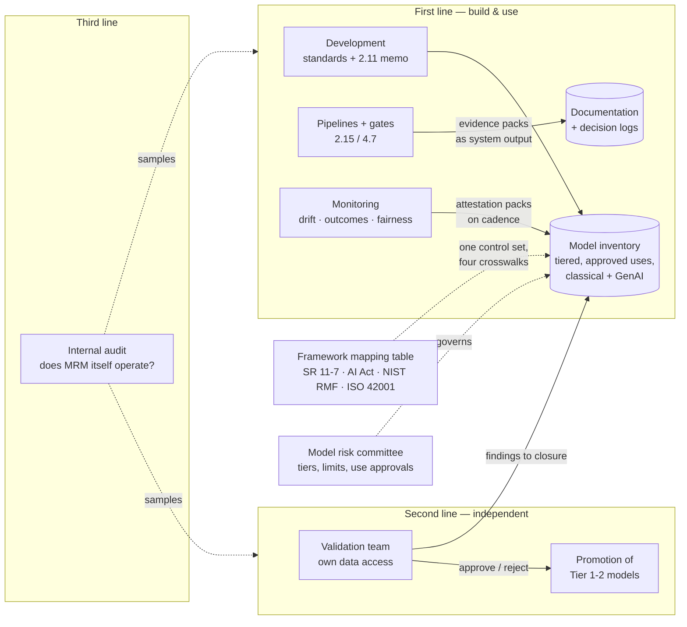

# Chapter 6.11 — Model Risk Management & AI Regulatory Governance

| | |
|---|---|
| **Part** | 6 — Enterprise Architecture |
| **Maturity level** | 4 — Architect |
| **Difficulty** | Advanced |
| **Estimated study time** | 4 hours (reading 2 h, exercise 2 h) |
| **Prerequisites** | [2.8](../part-2-artificial-intelligence/chapter-08-responsible-ai.md); [4.14](../part-4-enterprise-genai-systems/chapter-14-privacy-compliance-governance.md); [6.9](chapter-09-architecture-governance.md) |

## Learning Objectives

After this chapter you will be able to:

1. Design a model risk management (MRM) operating structure — three lines of defense, role independence, and a model inventory tiered by materiality — that covers classical models and GenAI systems in one regime.
2. Specify what independent validation actually examines (conceptual soundness, data, outcomes analysis, sensitivity, monitoring plan) and architect systems whose validation evidence is produced by the pipeline, not written after it.
3. Map the regulatory landscape — SR 11-7-class banking regimes, the EU AI Act's risk tiers, NIST AI RMF, ISO/IEC 42001 — onto one control set instead of four parallel bureaucracies.
4. Operate explainability and fairness as *governed controls* with owners, cadences, and limits — reason codes, disparity monitoring, and attestation — rather than as ethics aspirations.

## Introduction

Chapter [6.9](chapter-09-architecture-governance.md) governs *architecture decisions*; chapter [4.14](../part-4-enterprise-genai-systems/chapter-14-privacy-compliance-governance.md) governs *data and compliance*; this chapter governs **the models themselves as risk-bearing artifacts** — the discipline banks call model risk management, which 4.14 compressed into one sentence and which the AI Act era is exporting from banking to everyone. The premise, stated plainly in [CS55](../../case-studies/cs55-credit-risk-scoring-mrm.md): in regulated and consequential use, *the model is a governed artifact first and a predictor second*. Model risk — the risk of adverse outcomes from decisions based on incorrect or misused models — is a formal risk category with its own committee, inventory, validation function, and examination trail.

The through-line for an architect: **MRM is an architecture problem wearing a policy costume.** Every control this chapter describes is cheap if the systems were designed to produce its evidence (decision logs with model versions, gates that record their comparisons, monitoring that emits attestation packs) and cripplingly expensive if bolted on after ([CS55](../../case-studies/cs55-credit-risk-scoring-mrm.md)'s six-months-and-fails-first-review anti-pattern). The chapter's job is to make you the architect whose systems walk into validation with their evidence already in hand.

## Business Motivation

The costs run in both directions and both are large. Under-governance: model failures in regulated decisions produce regulatory findings, remediation of *booked* decisions (re-underwriting a year of loans), consent orders, and in the EU AI Act's high-risk tier, fines set as percentages of global turnover — and the reputational half-life of a discriminatory-model story exceeds any technical incident's. Over-governance: an MRM regime applied undifferentiated — every dashboard model validated like a credit scorecard — strangles the portfolio; Tembusu's first-year mistake (below) was exactly this, a nine-month validation queue that pushed teams into *not registering models at all*, the worst outcome for actual risk. The architect's business case is proportionality engineered: **materiality tiering** puts heavyweight validation where decisions are consequential and lightweight registration where they aren't, keeping the inventory honest because honesty is cheap ([6.9](chapter-09-architecture-governance.md)'s enabling-governance thesis, applied to models). And there is a quiet commercial upside the memo should claim: an estate that can *prove* its models work, with evidence, closes enterprise deals and regulatory examinations faster than one that asserts it — governance as a sales asset, not only a cost ([1.3](../part-1-professional-foundation/chapter-03-business-understanding.md)).

## Theory

### The operating structure: three lines, real independence

- **First line** — the teams that build and use models own their risk: development standards ([ml-model-validation checklist](../../checklists/ml-model-validation-checklist.md)), documentation, monitoring, incident response. First-line ownership is what the whole classical track has been teaching; MRM formalizes it.
- **Second line** — **independent model validation**: a function that does not report to the shipping organization, with its own data access and the authority to *reject*. Independence is structural, not aspirational — a validator who reports to the CDO who sponsors the model is a reviewer, not a validator. The organizing idea, in SR 11-7's own vocabulary, is **effective challenge**: critical analysis by objective, informed parties with the competence, influence, and incentives to actually change outcomes — independence is the *precondition*; effective challenge is the *product*. (Note the frames differ: "three lines of defense" is the general enterprise-risk construct used here for familiarity; SR 11-7 itself organizes around development/implementation/use, validation, and governance — the structures are compatible and both appear in practice.)
- **Third line** — internal audit: does the MRM process itself operate as designed? (Are models registered? Are findings closed? Do attestations happen?)

Roles must be *distinct people* for material models: model **owner** (accountable for use), **developer**, **validator**, **user**. The small-company version scales down honestly: an external validator or a structurally separated peer team beats pretending a self-review is independent.

### The model inventory and materiality tiering

The inventory is MRM's spine: every model in scope, registered with purpose, owner, **approved uses**, materiality tier, validation status and date, known limitations, and monitoring links. Three architect-grade points:

1. **"Model" is defined by consequence, not technology** — the AI-Act-era inventory includes the GBT scorecard, the LLM assistant, the vendor fraud score (vendor models are *your* model risk — SR 11-7 is explicit), and the spreadsheet pricing tool if decisions hang on it. One inventory, both lanes: 2.15's registry is its system-of-record for the classical lane; 5.7's composite manifest for the GenAI lane.
2. **Materiality tiering makes it survivable** — tier by decision consequence × exposure volume × autonomy: Tier 1 (credit decisioning, claims denial — full validation, annual re-validation, committee approval), Tier 2 (marketing propensity at scale — standard validation, biennial), Tier 3 (internal dashboards — registration and self-attestation). The tier decides the process weight; disagreement about a model's tier is itself a committee decision.
3. **Approved use is specific** — a churn score reused for collections prioritization is a *new model use* requiring fit-for-purpose review; use drift is how well-validated models cause unvalidated harm.

### What independent validation examines

Five components, in the order validators actually work — and, in italics, what the *architecture* must supply:

1. **Conceptual soundness** — is the approach defensible for the problem? (The [2.11](../part-2-artificial-intelligence/chapter-11-choosing-the-right-ai-approach.md) triage memo *is* this evidence; write it at design time.)
2. **Data appropriateness** — representativeness, quality, permissible use, leakage. (*[2.12](../part-2-artificial-intelligence/chapter-12-data-engineering-feature-platforms.md)'s lineage and point-in-time replay answer the questions validators spend weeks reconstructing.*)
3. **Outcomes analysis** — performance vs. alternatives and benchmarks, at the operating point, by segment, out of time. (*The champion–challenger gate's stored comparisons — [7.11](../part-7-enterprise-ai-architecture-patterns/chapter-11-predictive-scoring-patterns.md) — are this, pre-assembled.*)
4. **Sensitivity and stress** — behavior under shifted inputs, extreme values, missing features, subpopulation stress. (*The corrupted-batch and shifted-distribution drills of [2.15](../part-2-artificial-intelligence/chapter-15-mlops-engineering.md) are rehearsals of exactly this.*)
5. **Ongoing-monitoring plan** — limits, cadences, owners, escalation. (*The [drift checklist](../../checklists/drift-model-monitoring-checklist.md), instantiated per model.*)

Findings are tracked to closure; unresolved material findings block promotion. Two validation outputs beyond pass/fail deserve naming: **documented limitations with compensating controls** (every approved model carries known weaknesses, and the approval states how they are contained — overlays, conservatism buffers, restricted use), and **benchmarking against alternative models** as a standing validation technique, not just a development-time comparison. **For GenAI systems the components translate rather than disappear**: conceptual soundness becomes the workflow-vs-agent and grounding design rationale; outcomes analysis becomes the eval suite with its golden sets and judge calibration ([4.7](../part-4-enterprise-genai-systems/chapter-07-evaluation-systems.md)); sensitivity becomes adversarial and injection testing ([4.9](../part-4-enterprise-genai-systems/chapter-09-genai-security-threat-modeling.md)); the monitoring plan is 4.10's quality plane with limits. One validation grammar, two dialects — the architecture insight that lets one MRM function govern both lanes without doubling.

### The regulatory map — one control set, four frameworks

| Framework | Nature | What it demands (architect's reading) |
|---|---|---|
| **SR 11-7-class regimes** (banking supervision; analogues spreading via insurance and securities regulators) | Supervisory guidance with examination teeth | The full apparatus above: inventory, independent validation, documentation, ongoing monitoring, vendor-model coverage |
| **EU AI Act** | Statute with risk tiers | Prohibited / high-risk / limited / minimal tiers by *use case* ([2.8](../part-2-artificial-intelligence/chapter-08-responsible-ai.md)); high-risk (credit, employment, essential services…) requires risk management systems, data governance, logging, human oversight, accuracy/robustness documentation, conformity assessment — for classical and generative alike |
| **NIST AI RMF** | Voluntary framework | Govern / Map / Measure / Manage — the useful *organizing* vocabulary for enterprises without a statutory driver; maps cleanly onto the MRM structure |
| **ISO/IEC 42001** | Certifiable management standard | An AI management system (the ISO-27001 shape applied to AI): policies, roles, lifecycle controls, audit — the certification wrapper enterprises will increasingly be asked for in procurement |

The architect's move is **one control set, mapped four ways**: build the inventory, tiering, validation, documentation, and monitoring once; maintain a mapping table showing which control satisfies which framework clause. Four parallel compliance programs is the anti-pattern; the mapping table is one afternoon per framework and the audit response forever after.

**The EU AI Act has a clock, not just tiers** — and by 2026 most of it has already run out: the prohibited-practice bans applied from **February 2025**, the general-purpose AI (GPAI) model obligations from **August 2025**, and the bulk of the high-risk (Annex III) obligations — risk management system, data governance, logging, human oversight, conformity assessment, registration — apply from **August 2026**, with high-risk systems embedded in already-regulated products following in **August 2027**. Two consequences the tier table alone doesn't convey: an enterprise *deploying* a foundation model inherits documentation and transparency duties downstream of its provider's **GPAI obligations (Articles 53/55)** — provider due diligence is now a compliance input, not just procurement hygiene — and any Annex III use case (credit, employment, education, essential services) shipping today is shipping into an already-applicable regime, not preparing for a future one. Verify current dates and delegated acts against the Act itself; timelines here are as legislated at the time of writing (2026).

### Explainability and fairness as governed controls

[2.8](../part-2-artificial-intelligence/chapter-08-responsible-ai.md) taught the concepts; governance operationalizes them with owners, limits, and cadences: **reason codes** derived mechanically from the model for adverse decisions (ECOA/FCRA-class obligations; [CS55](../../case-studies/cs55-credit-risk-scoring-mrm.md)'s monotonicity trade shows architecture serving governance); **fairness metrics chosen deliberately** with counsel (they conflict — the choice is a governed decision, recorded), tested at the operating point pre-launch and monitored by group on cadence; **proxy analysis** with business-necessity documentation where disparity has a defended driver; **exposure equity** for ranking systems ([CS45](../../case-studies/cs45-learning-development-recommender.md) — who is *shown* the opportunity); and **the override channel measured as a decision system of its own** ([CS55](../../case-studies/cs55-credit-risk-scoring-mrm.md)'s unmeasured-override lesson). A generated narrative is not an audit artifact ([2.11](../part-2-artificial-intelligence/chapter-11-choosing-the-right-ai-approach.md)); the structured rationale is, and any LLM phrasing layered on it is validated against it.

## Architecture Perspective

What this couples to: [2.15](../part-2-artificial-intelligence/chapter-15-mlops-engineering.md)'s registry and gates (the first line's machinery *is* the evidence factory), [4.7](../part-4-enterprise-genai-systems/chapter-07-evaluation-systems.md)/[4.10](../part-4-enterprise-genai-systems/chapter-10-observability.md) for the GenAI dialect, and [6.9](chapter-09-architecture-governance.md)'s boards (the model risk committee is a sibling body with a different object — models, not architectures). What it forces: evidence-as-system-output, structural validator independence, and the one-inventory-both-lanes discipline. What it makes cheap: examinations, enterprise procurement, and the *next* model's approval.

## Real-world Example

**Tembusu Bank** built MRM twice. **Year one**: a policy-first regime — a 40-page standard, every model queued for identical full validation. Result: a nine-month backlog, teams quietly deploying "analytics tools" that were unregistered models, and a validation team hated by everyone including itself. **Year two**: the re-architecture this chapter teaches. Materiality tiering cut the full-validation population from 61 claimed models to 14 (Tier 1–2); Tier 3 became registration-plus-self-attestation, and registration *rose* because it stopped being punitive. The platform team wired evidence-as-output: the [2.15](../part-2-artificial-intelligence/chapter-15-mlops-engineering.md) gates began emitting validation-ready comparison packs; decision logs carried model versions and reason codes by construction; the monthly attestation pack ([CS55](../../case-studies/cs55-credit-risk-scoring-mrm.md)) became a pipeline artifact. The GenAI estate joined the *same* inventory with translated evidence (eval suites, injection-test results, judge-calibration records — [4.7](../part-4-enterprise-genai-systems/chapter-07-evaluation-systems.md)/[4.9](../part-4-enterprise-genai-systems/chapter-09-genai-security-threat-modeling.md)), and one framework-mapping table answered the AI Act gap analysis in a week. The regulator's next examination closed without findings; the head of validation's summary is the chapter in one line: *"we stopped writing documents about models and started reading the documents the models already write."*

## Hands-on Exercise

Build a miniature MRM regime for a fictional portfolio of five systems: a credit scorecard, a churn model, a demand forecast, a RAG policy assistant, and a vendor fraud score. (1) **Inventory**: register all five — purpose, owner, approved uses, materiality tier with your tiering rationale; (2) **Tier consequences**: define per-tier validation depth and re-validation cadence in a half-page policy; (3) **Validation plan**: for the credit scorecard, write the five-component validation outline and, for each component, name the *system artifact* that supplies its evidence (gate logs, lineage replay, drill results, monitoring pack); (4) **The GenAI dialect**: translate the same five components for the RAG assistant; (5) **Mapping table**: one row per control, columns for SR 11-7-class / EU AI Act / NIST AI RMF / ISO 42001, filled for your five controls; (6) **The use-drift test**: the churn model's owner wants to reuse it for collections — write the three-paragraph fit-for-purpose memo (approve, condition, or reject).

**Acceptance criteria:**
- [ ] All five systems registered, including the vendor model, with defensible tiers
- [ ] Validation depth differs visibly by tier — proportionality is the point
- [ ] Every validation component maps to a pipeline-produced artifact, not a to-be-written document
- [ ] The GenAI translation preserves all five components with lane-appropriate evidence
- [ ] The mapping table shows one control satisfying multiple frameworks
- [ ] The use-drift memo treats reuse as a new model use, with reasoning

## Enterprise Considerations

Org placement decides MRM's fate: validation inside the data organization fails the independence test regulators apply first; the durable shapes are risk-function placement (banking's norm) or a structurally separated assurance team with committee escalation. Vendor and platform reality: bought models and embedded AI features are in scope (your decisions, your model risk) — procurement contracts need evidence rights (documentation, performance data, change notification), and the AI Act's provider/deployer split makes some obligations contractual plumbing. Scaling down honestly matters for non-banks: a 200-person company runs the same *grammar* at smaller size — an inventory spreadsheet, an external or peer validator for its one material model, the mapping table — and gains the same examination-and-procurement speed; the anti-pattern is adopting the vocabulary without the independence. Culturally, expect the Tembusu year-one failure mode wherever MRM arrives policy-first: the architect's contribution is the *evidence-as-output* platform work that makes compliance the path of least resistance ([6.9](chapter-09-architecture-governance.md)'s paved road, applied to model governance).

## Trade-offs

| Decision | Option A | Option B | Choose A when… | Choose B when… |
|----------|----------|----------|----------------|----------------|
| Validation scope | Uniform full validation | Materiality-tiered | Never uniform — it collapses the inventory (Tembusu year one) | Always tier; disagreement over a tier is a committee decision, not a loophole |
| Validator sourcing | Internal independent team | External validators | Portfolio large enough to staff independence structurally | Small portfolios; conflicts; specialized model classes |
| Inventory span | Classical models only | One inventory, both lanes | Never — the AI Act and examiners won't split the estate | Always; translate the evidence dialect, not the regime |
| Framework posture | Per-framework programs | One control set + mapping table | Never — parallel bureaucracies drift apart | Always; the crosswalk is cheap, the duplication is not |

## Common Mistakes

1. **Documentation sprints before validation** — the model built first, papers written after; six months and a first-review failure. Evidence is a system output or it is fiction under deadline ([CS55](../../case-studies/cs55-credit-risk-scoring-mrm.md)).
2. **Validation that reports to the builders** — a reviewer with the validator's title; the examination finds it immediately. Independence is structural.
3. **Uniform rigor** — every model validated like the credit scorecard; teams stop registering models; actual risk rises while apparent control tightens.
4. **The technology-scoped inventory** — "ML models" registered, the vendor score and the LLM assistant excluded; consequence defines scope, not implementation.
5. **Use drift** — a validated model quietly reused for a new decision; the validation described a different system. Approved uses are specific; reuse is a review.
6. **Fairness as a launch checkbox** — tested once, never monitored; population shift does the discriminating later. Group-level monitoring on cadence, with limits and owners.
7. **The unmeasured override channel** — humans overriding model decisions with no tracking; the ungoverned parallel decision system ([CS55](../../case-studies/cs55-credit-risk-scoring-mrm.md)).

## Best Practices

1. **Architect evidence as output** — gates emit comparison packs, decisions log versions and reason codes, monitoring emits attestations; validation *reads*, it doesn't commission.
2. **Tier by consequence × volume × autonomy** — and make Tier 3 registration nearly free, so the inventory stays true.
3. **One inventory, one validation grammar, two evidence dialects** — classical and GenAI in the same regime; translate components, don't duplicate functions.
4. **Maintain the framework mapping table** — controls once, crosswalks per framework; gap analyses become table reads.
5. **Write the 2.11 memo at design time** — conceptual soundness evidence is cheapest the day the approach is chosen.
6. **Measure the override channel** — coded reasons, periodic override-vs-model review; every human lane is a decision system with a performance record.
7. **Put re-validation and decommissioning on calendars** — models leave the inventory deliberately; an inventory that only grows is a graveyard with good records.

## Architecture Checklist

Before signing off a design touching this topic:

- [ ] The model is registered at design time: purpose, owner, approved uses, materiality tier
- [ ] Validation depth and cadence follow the tier; the validator is structurally independent for Tier 1–2
- [ ] Each validation component (soundness, data, outcomes, sensitivity, monitoring) maps to a pipeline-produced artifact
- [ ] Decision logging carries model version, inputs, score, and reason codes — replayable for examination
- [ ] Fairness metrics chosen with counsel, tested at the operating point, monitored by group with limits and owners
- [ ] Vendor and GenAI systems are in the same inventory with translated evidence
- [ ] The framework mapping table covers the applicable regimes; no parallel compliance programs
- [ ] Overrides are coded, logged, and reviewed; use changes trigger fit-for-purpose review
- [ ] Re-validation and decommissioning are scheduled, not aspirational

## Interview Questions

1. *"Design model governance for a bank with 61 claimed models and a nine-month validation backlog."* — Strong answers reach for materiality tiering first (shrink the full-validation population, make registration cheap), evidence-as-system-output second, and structural independence third — and diagnose the backlog as a proportionality failure, not a staffing one.
2. *"How does MRM apply to a RAG assistant?"* — Strong answers translate the five validation components into the GenAI dialect (design rationale, corpus governance, eval suites with judge calibration, adversarial testing, quality-plane monitoring with limits) and put it in the *same* inventory — one regime, two evidence dialects.
3. *"The marketing team wants to reuse the churn model for collections prioritization. Governance answer?"* — Strong answers name use drift, require fit-for-purpose review (different population, different error asymmetry, possibly different fairness surface), and show the approved-uses field doing its job.
4. *"You're not a bank. How much of this applies?"* — Strong answers scale the grammar honestly: consequence-scoped inventory, an independent (possibly external) validator for material models, the mapping table for AI Act/ISO exposure — and note the commercial upside: provable models close procurement and examinations faster.

## Further Reading

- Federal Reserve SR 11-7, "Supervisory Guidance on Model Risk Management" — the canonical text; short, readable, and the template every analogous regime copies.
- The EU AI Act's high-risk obligations (Annex III use cases and Articles 8–15) — read the primary text for the tier definitions; secondary summaries drift.
- NIST AI Risk Management Framework (AI RMF 1.0) — the Govern/Map/Measure/Manage vocabulary and its playbook.
- ISO/IEC 42001 overview documentation — the management-system shape procurement will increasingly request; read enough to know what certification would demand.

## Summary

- Model risk management treats models — classical and generative, built and bought — as governed artifacts: inventoried, tiered by materiality, independently validated, monitored against limits, and retired deliberately.
- The three-lines structure works only with *structural* validator independence; roles (owner, developer, validator, user) are distinct people for material models.
- Validation examines soundness, data, outcomes, sensitivity, and monitoring — and a well-architected estate supplies each from pipeline-produced evidence (2.12 lineage, 2.15 gates, 4.7 evals), which is the difference between a week and six months.
- One control set maps onto SR 11-7-class regimes, the EU AI Act, NIST AI RMF, and ISO 42001 via a crosswalk table; parallel per-framework programs are the anti-pattern.
- Explainability and fairness operate as governed controls — mechanical reason codes, deliberately chosen and monitored fairness metrics, measured override channels — with owners and cadences, not intentions.
- Proportionality is what keeps the regime alive: heavyweight where decisions are consequential, nearly free where they aren't, so the inventory stays honest.

---

**Previous:** [Chapter 6.10 — TCO & the Business Case for AI](chapter-10-tco-business-case.md) · **Next:** [Part 7 — Enterprise AI Architecture Patterns](../part-7-enterprise-ai-architecture-patterns/) · **Related:** [2.8 Responsible AI](../part-2-artificial-intelligence/chapter-08-responsible-ai.md), [4.14 Privacy, Compliance & Governance](../part-4-enterprise-genai-systems/chapter-14-privacy-compliance-governance.md), [CS55 Credit Risk Scoring](../../case-studies/cs55-credit-risk-scoring-mrm.md), [mrm-fairness checklist](../../checklists/mrm-fairness-checklist.md), [7.11 Predictive & Scoring Patterns](../part-7-enterprise-ai-architecture-patterns/chapter-11-predictive-scoring-patterns.md)
