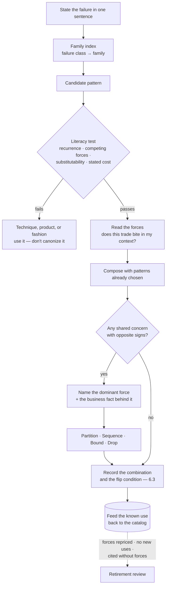

# Chapter 7.1 — A Pattern Language for GenAI

| | |
|---|---|
| **Part** | 7 — Enterprise AI Architecture Patterns |
| **Maturity level** | 3 — Engineer |
| **Difficulty** | Advanced |
| **Estimated study time** | 1 h 15 min (reading 35 min, exercise 40 min) |
| **Prerequisites** | Parts 3–6 (the patterns catalog draws on all of them) |

## Learning Objectives

After this chapter you will be able to:

1. Use the pattern form (Context → Problem → Forces → Solution → Structure → Consequences → Known uses → Related patterns) as a thinking tool, with attention to the two elements that carry its weight.
2. Apply a four-question test separating a genuine pattern from a technique, a product, and a fashion.
3. Resolve conflicts between patterns that fight, by naming the dominant force and choosing a resolution move.
4. Route from a named failure to the right pattern family, so Part 7 works as reference rather than reading.
5. Recognize when a pattern has stopped matching reality, and retire it.

## Introduction

Part 7 is a reference. Chapters 7.2–7.11 are catalogs you consult mid-design, not chapters you read front to back. This chapter is the instruction manual for consulting them.

Pattern catalogs fail in three specific ways. Entries get written without their forces, so a reader cannot tell when the pattern is wrong. Entries get written without their costs, so the catalog reads as a menu of good ideas. And entries get combined without anyone checking whether they pull against each other, which is where the expensive failures live. A fourth arrives later: a catalog nobody prunes.

## Business Motivation

An estate with no shared pattern vocabulary pays in repeated design work — every review starts from first principles, and the same argument about agent autonomy gets held in four teams in one quarter.

An estate with a *bad* catalog pays more, and that is the case worth understanding. A bad catalog launders unexamined choices into institutional standards. A team citing an entry has transferred responsibility for the choice to whoever wrote it; if that entry has no forces section, nobody ever made the choice at all. Vantora Systems paid about $90k in honored-price goodwill for exactly this shape of failure (below).

The return is review quality rather than review speed: a reviewer holding a pattern's forces asks the one question that matters — *does this trade bite in your context?* — instead of relitigating the design.

## Theory

### The eight elements, and the two that do the work

- **Context** — the situation in which the pattern applies.
- **Problem** — the recurring problem it solves.
- **Forces** — the competing concerns the solution has to balance.
- **Solution** — what to do.
- **Structure** — the shape: components, flow, boundaries.
- **Consequences** — what results, favorable and unfavorable.
- **Known uses** — systems where it has actually been applied.
- **Related patterns** — what it combines with, competes with, or presupposes.

Six of these are description. Two are the reason the form exists.

**Forces is the element that makes something a pattern.** A force is not a goal. "We need accurate answers" is a goal; "answer currency versus token cost" is a force pair, because you cannot maximize both and every design sets the dial somewhere. The test is mechanical: name two concerns the solution cannot simultaneously maximize, then describe a context where the trade should go the other way. If you cannot do the second half, you are holding a technique — a thing that is simply better, with no dial. Chunking at a particular size is a technique. Two-stage retrieve-then-rank is a pattern, because recall and latency genuinely pull against each other and different catalogs settle it differently. This is why forces is the field a reviewer reads first: the solution says what the team built, the forces say whether they should have.

**Consequences must include what the pattern costs**, and the money is usually the least interesting cost. The [approval gate](chapter-05-human-in-the-loop-patterns.md) costs a throughput ceiling set by human capacity, plus a queue that is a new failure mode with its own on-call. [Semantic caching](chapter-08-cost-performance-patterns.md) costs a window during which the system confidently says something that was true yesterday. Tenant isolation costs the ability to warm a shared cache. A consequences section containing nothing that would make a sponsor hesitate was written before the pattern reached production.

### Pattern literacy: four questions

Enterprise catalogs fill up with things that are not patterns. All four questions must answer yes:

1. **Recurrence** — has it solved the same problem in three systems sharing no vendor and no team? If no: it is an implementation, and belongs in a design doc.
2. **Competing forces** — can you name two concerns it trades against each other, *and* a context where the trade reverses? If no: it is a technique. Use it freely; do not canonize it.
3. **Substitutability** — does it survive swapping out every product inside it? If the entry's name contains a vendor's name, it is a product, and products get retired by procurement rather than by architects.
4. **Stated cost** — can you say what it costs in something other than money? If no: it is a fashion. "Everything is an agent" failed this question in 2024 and is now [an anti-pattern](chapter-10-anti-patterns.md).

Their value is defensive: they stop a catalog accumulating entries that end arguments without settling them.

### Composition and conflict — the chapter's core method

Patterns compose, and that part is mostly uninteresting: a system is [RAG](../../GLOSSARY.md) plus reranking plus an approval gate plus a cache, and the composition follows from the related-patterns links. What is not easy is that **some pairs fight** — two patterns, each correct in isolation, whose forces point in opposite directions. Neither entry warns you, because each was written about one pattern.

**One: put both forces lists side by side.** Not the solutions. Conflicts are invisible at the solution level and obvious at the force level.

**Two: find the shared concern with opposite signs.** That is the conflict axis. Aggressive caching and strict freshness both carry *answer currency*; one pushes it down for cost, the other holds it up for correctness. Full autonomy and human-in-the-loop gating both carry *reversibility*; one spends it for throughput, the other buys it back with latency.

**Three: name the dominant force, and the business fact that makes it dominant.** This step is the whole method. The dominant force is not a property of either pattern — it is a property of your decision: what a wrong answer costs, how reversible the action is, who is exposed. When the answer is "a customer sees a stale FAQ entry for an hour," currency loses and the cache wins. When it is "a customer is quoted a price we then have to honor," currency dominates and the cache yields. Same pair, opposite resolutions, and the difference is a business fact — which makes that fact your **flip condition**. Write it down; when it changes, the resolution changes with it.

**Four: choose a resolution move**, in rough order of preference. **Partition** — apply each pattern to a different slice; cache the volatility-stable questions, route the volatile ones straight through. **Sequence** — order them so one runs inside the other's boundary; the agent loop free over reversible steps, the gate at the irreversible edge. **Bound** — keep both, cap the weaker one with a TTL or a sampling rate. **Drop one** — and record why in an [ADR](../../GLOSSARY.md), because a future reader will otherwise re-add it.

Conflicts recur across teams, so a **conflict register** — pair, axis, deciding question — is worth maintaining once:

| Pattern pair | Conflict axis | The question that decides | Typical resolution |
|---|---|---|---|
| Semantic caching (7.8) × Freshness pipeline (7.7) | Answer currency vs. cost and latency | What does one stale answer cost, and who sees it? | Partition by volatility class; invalidate on corpus publish |
| Bounded agent loop (7.4) × Approval gate (7.5) | Autonomy vs. reversibility | How expensive is undoing the action? | Sequence: autonomy inside the reversible boundary, gate at the irreversible edge |
| ACL-propagated index (7.7) × Semantic caching (7.8) | Isolation vs. reuse | Can two users with different permissions share an answer? | Partition cache keys by permission set — never share across ACL groups |
| Model tiering (7.8) × Dual-model verification (7.6) | Cost vs. independent checking | Are the checker's errors correlated with the drafter's? | Bound: tier the drafting, never route the verifier to the drafting model |
| Prompt compression (7.8) × Citation-first RAG (7.2) | Token cost vs. attributability | Must this answer be defensible to a third party? | Drop compression on evidence spans; compress instructions instead |

Eleven of the fourteen rows in Vantora's register came from incidents rather than foresight — a reason to inherit someone else's rather than rediscover it.

### Selection: from a failure to a family

Part 7 is usable as reference only if you can get from a problem to a family in one hop. The rule that makes the index work: **state the failure in one sentence before opening a family.** If you cannot, you have a requirements problem, and no pattern will help.

| Family | The failure class it answers | Go to |
|---|---|---|
| RAG patterns | The model answers from memory — confident, unattributable, out of date | [7.2](chapter-02-rag-patterns.md) |
| Workflow patterns | One prompt is asked to do four things; quality can't be attributed to a step | [7.3](chapter-03-workflow-patterns.md) |
| Agentic patterns | The path can't be enumerated at design time — or the loop won't stop | [7.4](chapter-04-agentic-patterns.md) |
| Human-in-the-loop patterns | The system is right often enough to be trusted and wrong expensively | [7.5](chapter-05-human-in-the-loop-patterns.md) |
| Safety & guardrail patterns | Untrusted content reaches a privileged action, or harmful output reaches a user | [7.6](chapter-06-safety-guardrail-patterns.md) |
| Knowledge & data patterns | The corpus is stale, over-shared, un-deletable, or cross-tenant | [7.7](chapter-07-knowledge-data-patterns.md) |
| Cost & performance patterns | The bill scales with traffic, or the latency budget is blown | [7.8](chapter-08-cost-performance-patterns.md) |
| Platform & multi-tenancy patterns | Many teams are building the same infrastructure differently | [7.9](chapter-09-platform-multitenancy-patterns.md) |
| Anti-patterns | The design smells and you need the failure named before you can argue against it | [7.10](chapter-10-anti-patterns.md) |
| Predictive & scoring patterns | A trained model scores structured decisions — and decays silently | [7.11](chapter-11-predictive-scoring-patterns.md) |

### Honest limits: pattern languages ossify

Alexander's languages were meant to be local and continually revised; copied wholesale into another context, they stop describing anything. Software catalogs decay the same way, and one that only grows becomes a record of what an organization used to believe, with nothing marking which half is current. Three retirement triggers:

- **The forces repriced.** When one side of the trade gets an order of magnitude cheaper, the balance the pattern encodes is no longer right. Much of the 2023 prompt-compression discipline was repriced by context windows and cache pricing.
- **No new known uses.** An entry that gained none in a year is either solving a problem you no longer have or is unusable as written.
- **It is cited without its forces.** This is cargo-culting, and it is the most dangerous trigger because it looks like adoption. The symptom is a review in which naming the pattern ended the discussion.

Deprecate rather than delete when live systems still run on the pattern — their maintainers need the reasoning. Delete when the entry is actively steering teams wrong.

## Architecture Perspective

The closing edge at the bottom separates a maintained pattern language from a wiki. Known uses flowing back keep entries honest; the retirement review keeps the catalog smaller than the sum of everything anyone ever tried.

## Real-world Example

**Vantora Systems** (the platform arc — [5.10](../part-5-cloud-infrastructure-platform/chapter-10-iac-platform-engineering.md)) wrote its pattern catalog twice.

The first attempt was twenty-three wiki entries, each with a name, a diagram, and a "when to use" bullet. It was popular within weeks, which was the first bad sign: a design review could now be won by naming an entry. No entry had a forces section, so nobody could ask when one was *wrong*. Three were named after products; four described techniques that traded nothing against anything.

The bill arrived through a composition nobody had considered. The support assistant used both the semantic cache and the freshness pipeline; both were entries in good standing, and neither mentioned the other. When Vantora repriced its extended-warranty tiers, the corpus updated within the hour and the cache went on serving the previous wording for the rest of its 24-hour TTL. Roughly 1,900 customers were quoted the old price, and honoring those quotes cost about $90k. The postmortem's finding was not the TTL — it was that two patterns with opposing forces had been published as though they were independent.

Then came the decision that cost something. The platform lead ruled that no entry would stay without a forces section naming two competing concerns and a consequences section naming at least one non-monetary cost. Nine of the twenty-three could not be rewritten that way and were removed. Two of those removals had teams standing on them: the sidecar embedding service was built into two production services, and retiring the entry meant roughly six engineer-weeks of migration each — paid by teams who had done exactly what the catalog told them. The platform team absorbed that complaint rather than keep an entry it could no longer defend.

The rewrite added the conflict register, which started at three rows and reached fourteen over the following year, mostly by incident. Reviews changed shape measurably: "we're using the agent pattern" stopped counting as an answer, and reviewers began asking which force the pattern balanced and whether it bit here.

## Hands-on Exercise

**Audit a pattern language and resolve a conflict.** ~40 minutes.

1. **Literacy audit (10 min).** Take five named "patterns" from your organization's wiki, a vendor's reference architecture, or a conference deck. Run the four questions on each and classify every one as pattern, technique, product, or fashion.
2. **Conflict resolution (15 min).** Pick a pair from the conflict register — or from your own system — and work it in a system you know. Write both forces lists, name the axis, name the dominant force and the business fact behind it, choose a move, and state the flip condition.
3. **Selection path (10 min).** Write three one-sentence failure statements taken from incidents you have seen. Route each through the family index to a family, then to a named pattern.
4. **Retirement (5 min).** Nominate one pattern in the GSAC catalog you expect will not survive three years, naming the force whose price is moving.

**Acceptance criteria:**
- [ ] Five entries classified, with the failing question named for each non-pattern; at least one is not a pattern
- [ ] Both forces lists written; the conflict axis is a single concern appearing in both
- [ ] The dominant force is justified by a business fact, not a preference, and the flip condition is stated
- [ ] One of the four moves chosen (partition / sequence / bound / drop), with the discarded alternatives named
- [ ] Three failure statements, each routed to a family and to a named pattern
- [ ] The retirement nomination names a force whose price is changing, not a technology you dislike

## Enterprise Considerations

A pattern catalog is an owned artifact with a deprecation policy, or it is folklore with better formatting. Vantora's nine deletions were possible because someone held the authority to make them; catalogs without that role only accumulate.

The relationship to golden paths ([5.10](../part-5-cloud-infrastructure-platform/chapter-10-iac-platform-engineering.md)) deserves precision. A golden path is an opinionated composition with the defaults wired and the conflicts already resolved — it encodes somebody's dominant-force decisions, which makes it fast and makes those decisions invisible. When a team's context differs, the golden path is what needs the ADR, not the pattern.

Governance ([6.9](../part-6-enterprise-architecture/chapter-09-architecture-governance.md)) inherits a specific hazard: a review board that accepts pattern names as evidence has been captured by its own vocabulary. Onboarding has its own asymmetry — an architect who learns pattern names without their consequences becomes confident faster than they become correct. And vendor reference architectures are *known uses*: one deployment, one vendor's products, one context. They are evidence, not patterns, and the giveaway is question three.

## Trade-offs

| Decision | Option A | Option B | Choose A when… | Choose B when… |
|----------|----------|----------|----------------|----------------|
| Entry authority | Pattern is a default; deviation needs an ADR | Pattern is a reference; every choice needs an ADR | Your failure mode is inconsistency across many teams | Your failure mode is cargo-culting — forcing the argument is worth the review time |
| Conflicts | Maintain a conflict register | Leave conflicts to design review | The same pairs recur across teams, as they usually do | Compositions are few and highly context-specific; a register would ossify into rules |
| Novel problem | Adapt the nearest pattern | Derive from first principles | The forces match even though the surface doesn't | The forces genuinely differ — then write a new pattern only after three known uses |
| Aging entry | Delete it | Deprecate but keep it readable | It is actively steering teams wrong | Live systems still run on it and maintainers need the reasoning |

## Common Mistakes

1. **Pattern names used as review-ending arguments** — "we're using the agent pattern" answers nothing; ask which forces it balanced and whether they bite here.
2. **Forces written as goals** — "accurate, fast, and cheap" is a wish list. An entry whose forces do not conflict is a technique wearing a pattern's clothes.
3. **Consequences written as benefits** — a section with no cost in it was written before the pattern met production.
4. **Products promoted to patterns** — the entry named after a vendor gets retired by a procurement decision, and takes the designs built on it along.
5. **Composing without comparing forces** — Vantora's cache beside its freshness pipeline: individually correct, jointly $90k. Solutions compose silently; forces do not.
6. **Transplanting a resolution across contexts where the trade reverses** — batch-lane economics from a system with slack, applied to one with an SLA. Copy the method, not the answer.
7. **The immortal catalog** — nothing retired, so a new joiner cannot tell which half the organization still believes.

## Best Practices

1. **State the failure before opening a family** — the inability to write that sentence is itself the finding.
2. **Refuse entries without competing forces and a named non-monetary cost** — the two fields that make a pattern usable are the two most often skipped.
3. **Keep a conflict register and grow it from incidents** — pair, axis, deciding question; most rows arrive the expensive way.
4. **Record the business fact behind the dominant force** — it justifies the decision today and doubles as the flip condition for whoever revisits it.
5. **Prefer partition and bounding over dropping** — both patterns usually survive on different slices, and dropping one loses capability the design will want back.
6. **Feed known uses back after every project** — an entry gaining none in a year is a retirement candidate.
7. **Give the catalog an owner with authority to delete** — pruning keeps a language current, and it is nobody's job by default.

## Architecture Checklist

For using the pattern language:

- [ ] Every pattern in this design was reached from a stated failure, not from familiarity
- [ ] Each pattern's forces were checked against this context — the trade actually bites here
- [ ] Each pattern's costs are stated in the design, not only its benefits
- [ ] Pattern pairs were checked for shared concerns with opposite signs
- [ ] Each conflict is resolved by a named dominant force, with the business fact behind it and the flip condition written down
- [ ] The resolution move (partition / sequence / bound / drop) is recorded with the discarded alternatives — [6.3](../part-6-enterprise-architecture/chapter-03-adrs-decision-governance.md)
- [ ] Nothing in the design is justified by a pattern name alone
- [ ] Known uses fed back; entries with no live uses flagged for retirement review

## Interview Questions

1. *"How do you tell an architecture pattern from a technique?"* — Strong answers go to forces: a pattern names two concerns that cannot both be maximized and a context where the trade reverses; a technique has no dial. The four-question test earns senior marks, especially the point that products and fashions are the commonest catalog contaminants.
2. *"Your design caches aggressively and also promises fresh answers. Reconcile them."* — Strong answers identify answer currency as the shared force with opposite signs and derive dominance from what a stale answer costs and who sees it, then give a move (partition by volatility class plus invalidation on publish) and the flip condition that would reopen it.
3. *"A team says 'we're using the agentic pattern.' What do you ask next?"* — Strong answers treat the name as the start of the conversation: which forces, which consequences, how reversible the actions are, where the gate sits relative to the loop. The best name the governance hazard — a review accepting pattern names as evidence has stopped reviewing.
4. *"When would you retire a pattern?"* — Strong answers give the three triggers, distinguish deprecation from deletion by whether live systems depend on it, and note that an unpruned catalog becomes a record of past beliefs.

## Further Reading

- Christopher Alexander, *A Pattern Language* — the origin of the form, and the source of the insight that forces, not solutions, are what a pattern captures.
- Christopher Alexander, *The Timeless Way of Building* — the companion volume; the argument for why languages must be local and continually revised.
- Gamma, Helm, Johnson & Vlissides, *Design Patterns* — the software adaptation of the form, and a demonstration of consequences sections written honestly.
- Gregor Hohpe & Bobby Woolf, *Enterprise Integration Patterns* — the best-worked mature enterprise catalog, with related-patterns links doing real navigational work.
- The [GSAC case studies](../../case-studies/README.md) — the known-uses corpus for 7.2–7.11; read one with the family index open.

## Summary

- Six of the eight pattern elements are description; **forces** and **consequences** carry the weight. Forces tell a reviewer when the pattern is wrong; consequences must state a cost in something other than money.
- Four questions separate a pattern from an impostor: recurrence across unrelated systems, genuinely competing forces, substitutability of the products inside it, and a stated cost.
- Patterns compose easily and **conflict silently**. Compare forces lists, find the shared concern with opposite signs, name the dominant force and the business fact behind it, then partition, sequence, bound, or drop.
- That business fact is the flip condition: it is why the same pair resolves one way for a low-stakes FAQ and the other way for a quoted price.
- Selection starts from a failure stated in one sentence; the family index turns that sentence into a chapter.
- Pattern languages ossify. Retire on repriced forces, on absent new known uses, and on citation-without-forces — the last being cargo-culting, which looks like adoption right up until the incident.

---

**Previous:** [Part 7 index](README.md) · **Next:** [Chapter 7.2 — RAG Patterns](chapter-02-rag-patterns.md) · **Related:** [1.4 Trade-off Analysis](../part-1-professional-foundation/chapter-04-tradeoff-analysis.md), [1.5 Communicating Architecture](../part-1-professional-foundation/chapter-05-communicating-architecture.md), [Case studies](../../case-studies/README.md)
