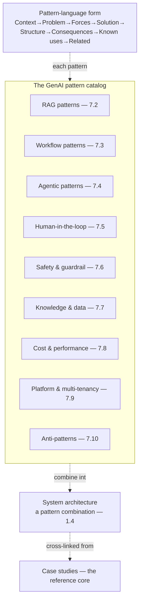

# Chapter 7.1 — A Pattern Language for GenAI

| | |
|---|---|
| **Part** | 7 — Enterprise AI Architecture Patterns |
| **Maturity level** | 3 — Engineer |
| **Difficulty** | Advanced |
| **Estimated study time** | 2–3 hours (reading 90 min, exercise 60 min) |
| **Prerequisites** | Parts 3–6 (the patterns catalog draws on all of them) |

## Learning Objectives

After this chapter you will be able to:

1. Read, apply, and combine architecture patterns using the pattern-language form (Context → Problem → Forces → Solution → Structure → Consequences → Known uses → Related).
2. Navigate the GenAI pattern catalog: the pattern families (7.2–7.9), the anti-patterns (7.10), and how they relate.
3. Combine patterns into system architectures, understanding the pattern-combination discipline.
4. Use patterns to compress and communicate architecture, the way architects encode and transfer experience.

## Introduction

Part 7 is the curriculum's reference core — the pattern language that compresses the architecture of Parts 3–6 into reusable, named, transferable form. Patterns are how architects encode experience: a *pattern* is a named, reusable solution to a recurring problem in a context, with its forces and consequences made explicit, so that the accumulated experience (the solution that works, the forces that shape it, the consequences to expect) transfers without re-deriving it. This chapter is the meta-chapter — how to read, apply, and combine patterns — and the map of the catalog (7.2–7.10) that follows.

The framing: **patterns compress experience into named, reusable, combinable form** — the pattern language (the vocabulary of named patterns) is how architects communicate and reuse architecture, and the GenAI pattern catalog (7.2–7.9, plus the anti-patterns of 7.10) is the compressed, reference form of the architecture the curriculum has built, cross-linked from every case study as the reference core.

## Business Motivation

Patterns are how architecture knowledge scales — the compression that lets experience transfer across architects, teams, and time. Without patterns: every architect re-derives the solutions (the RAG architecture re-invented, the agent loop re-designed — the re-derivation the patterns prevent), the knowledge is tribal (the solution in one architect's head, not transferable), and the communication is verbose (the architecture explained from scratch each time). With patterns: the solutions are named and reusable (the "orchestrator-workers pattern" — 4.5, the "semantic caching pattern" — 4.11, invoked by name), the knowledge transfers (the pattern language the architects share), and the communication is compressed (the architecture communicated in pattern vocabulary — "it's RAG with reranking and a human-in-the-loop approval gate" — the patterns compressing the architecture). The business case is the knowledge-scaling one: the pattern language is how the enterprise's architecture knowledge scales (the patterns transferring the experience across the architects and teams — the reuse, the communication, the onboarding — the new architect learning the pattern language rather than re-deriving), which is the reference core that makes the architecture knowledge an accessible, transferable asset (the pattern catalog as the enterprise's architecture knowledge base — the moat of accumulated architecture experience, compressed into patterns).

## Theory

### The pattern-language form

The form each pattern in the catalog uses (the classical pattern form — Alexander, the Gang of Four — adapted):

- **Context** — the situation the pattern applies in (when to consider it); the pattern's applicability.
- **Problem** — the recurring problem the pattern solves; the pattern's purpose.
- **Forces** — the competing concerns that shape the solution (the trade-offs — 1.4, the forces the solution balances); the pattern's tensions.
- **Solution** — the reusable solution (the pattern's core — what to do); the pattern's answer.
- **Structure** — the solution's structure (the diagram, the components); the pattern's shape.
- **Consequences** — the results of applying the pattern (the benefits and the costs — 1.4's trade-offs, the consequences to expect); the pattern's outcomes.
- **Known uses** — where the pattern is used (the case studies, the curriculum's examples); the pattern's evidence.
- **Related patterns** — the patterns it combines with or relates to; the pattern's connections.

The form's value: the pattern captures the *whole* solution (not just the what — the solution, but the when — the context, the why — the forces, the what-happens — the consequences, and the connections — the related), so the pattern transfers the full experience (the architect applying the pattern gets the context, forces, and consequences, not just the solution) — the pattern-language form that makes patterns genuinely reusable.

### The GenAI pattern catalog

The catalog (7.2–7.10), mapped:

- **RAG patterns** (7.2) — the retrieval-augmented-generation patterns (basic RAG, hybrid, reranked, agentic retrieval, GraphRAG, citation-first); the knowledge-grounding patterns.
- **Workflow patterns** (7.3) — the workflow patterns (prompt chaining, routing, parallelization, orchestrator-workers, evaluator-optimizer); the fixed-control-flow patterns.
- **Agentic patterns** (7.4) — the agent patterns (bounded agent loop, planner-executor, reflection, tool sandbox, checkpoint-and-resume); the model-directed-control-flow patterns.
- **Human-in-the-loop patterns** (7.5) — the HITL patterns (approval gate, review sampling, escalation, confidence routing, draft-not-send); the human-oversight patterns.
- **Safety & guardrail patterns** (7.6) — the safety patterns (layered filters, dual-model verification, constrained decoding, output quarantine, kill switch); the safety patterns.
- **Knowledge & data patterns** (7.7) — the knowledge patterns (freshness pipeline, ACL-propagated index, tenant isolation, forgetting/deletion, feedback-to-dataset); the data patterns.
- **Cost & performance patterns** (7.8) — the cost/performance patterns (model tiering/routing, semantic caching, prompt compression, batch lanes, budget enforcement); the efficiency patterns.
- **Platform & multi-tenancy patterns** (7.9) — the platform patterns (GenAI gateway, shared eval service, prompt registry, usage metering, central model governance); the platform patterns.
- **Anti-patterns** (7.10) — the anti-patterns (agent-for-everything, demo-driven architecture, eval-free shipping, prompt spaghetti, framework lock-in, unbounded autonomy); the patterns to avoid.

The catalog's organization: the pattern families (each a family of related patterns), covering the architecture the curriculum built (Parts 3–6, compressed into patterns), plus the anti-patterns (the patterns to avoid — the mistakes the curriculum warned against, named).

### Combining patterns

The pattern-combination discipline:

- **Patterns combine into architectures** — a system architecture is a combination of patterns (the RAG pattern + the reranking pattern + the human-in-the-loop approval pattern + the semantic caching pattern — the architecture as a pattern combination); the patterns compose (the architecture built from the patterns).
- **The combination is a design** (1.4) — the pattern combination is a design decision (which patterns, how combined — the design — 1.4, the trade-offs — the forces of each pattern in the combination); the combination designed, not just assembled (the patterns combined deliberately, the forces balanced).
- **The related-patterns links** — the patterns' related-patterns links guide the combination (the pattern's related patterns — the ones it combines with — the RAG pattern's related reranking, the agent pattern's related human-in-the-loop); the related links that guide the combination (the pattern language's connections).

## Architecture Perspective

Readings. **The pattern-language form captures the whole solution** — the context (when), the problem (what for), the forces (the trade-offs — 1.4), the solution (what), the structure (the shape), the consequences (the outcomes), the known uses (the evidence), and the related (the connections) — so the pattern transfers the full experience (not just the solution but the when, why, what-happens, and connections), which is what makes patterns genuinely reusable (the architect applying the pattern gets the whole experience). **The catalog compresses the curriculum's architecture into patterns** — the pattern families (7.2–7.9) cover the architecture the curriculum built (Parts 3–6, compressed into named, reusable patterns), plus the anti-patterns (7.10 — the mistakes named) — the reference core that makes the architecture knowledge an accessible, transferable asset (the pattern catalog as the compressed architecture knowledge base). **And patterns combine into architectures** — a system architecture is a pattern combination (the RAG + reranking + human-in-the-loop + caching — the architecture built from patterns), combined deliberately (the design — 1.4, the forces balanced) guided by the related-patterns links (the pattern language's connections) — the patterns as the building blocks of the architecture, and the pattern language as the vocabulary for communicating and reusing it.

## Real-world Example

**The GSAC case studies** (the [case-study catalog](../../case-studies/README.md)) are the pattern language's application — the 56 case studies (CS01–CS56) are each a pattern combination, and the pattern catalog (7.2–7.10) is the reference core cross-linked from them. Consider how the recurring companies' systems decompose into patterns: Bellhaven's submission-intake platform (2.1) is a pattern combination — the RAG pattern (7.2, the policy corpus), the structured-extraction pattern (the intake), the anti-corruption-layer pattern (6.4, the rating-engine integration), the human-in-the-loop approval pattern (7.5, the underwriter review), the model-tiering pattern (7.8, the tiered extraction — 1.4), the GenAI-gateway pattern (7.9, the platform), and the tenant-isolation pattern (7.7, the multi-market) — the architecture as a combination of named patterns, each with its context, forces, and consequences. Corvid's customs-exception agent (4.4) is another combination — the bounded-agent-loop pattern (7.4), the tool-sandbox pattern (7.4/4.4), the human-in-the-loop approval pattern (7.5, the customs-filing gate), the quarantine pattern (7.6/4.9, the untrusted-document processing) — the agent architecture as a pattern combination. And the anti-patterns (7.10) name the mistakes the case studies avoided (Halvard & Roth's rejected persona-agents — the agent-for-everything anti-pattern — 4.5/7.10, Vantora's rejected blocking governance — the mandate-that-gets-routed-around — 1.8/6.9/7.10). The pattern language is how the case studies are read and communicated: "Bellhaven's intake is RAG + structured extraction + anti-corruption layer + human-in-the-loop + model tiering + gateway + tenant isolation" — the architecture compressed into pattern vocabulary, the patterns transferring the experience (the context, forces, consequences of each), the case studies as the pattern language's known uses. The pattern-language note (the curriculum's reference-core framing): *"The 56 case studies are pattern combinations, and Part 7 is the reference core — the pattern catalog cross-linked from every case study. The architect reads a case study as a pattern combination (RAG + reranking + human-in-the-loop + caching — the named patterns), applies the patterns to new problems (the pattern's context, forces, consequences transferring), and communicates the architecture in pattern vocabulary (the compression). The pattern language is how the architecture knowledge scales — the accumulated experience of Parts 3–6, compressed into named, reusable, combinable patterns, the reference core of the whole curriculum."*

## Hands-on Exercise

**Read a system as a pattern combination.** ~60 minutes. For a system you know or a case study.

1. **Pattern decomposition (25 min).** Take a GenAI system (real or a case study — e.g., Bellhaven's intake) and decompose it into patterns: identify the patterns it combines (RAG — 7.2, workflow — 7.3, agentic — 7.4, human-in-the-loop — 7.5, safety — 7.6, knowledge — 7.7, cost — 7.8, platform — 7.9). List the named patterns.
2. **The pattern-language form (20 min).** For one of the patterns, write its pattern-language form (Context, Problem, Forces, Solution, Structure, Consequences, Known uses, Related). Show how the form captures the whole solution (not just the what).
3. **The combination (15 min).** Describe how the patterns combine into the system architecture (the combination — 1.4, the forces balanced), and use the related-patterns links to identify a pattern that could improve the architecture.

**Acceptance criteria:**
- [ ] The system decomposed into named patterns from the catalog (7.2–7.9)
- [ ] One pattern written in the full pattern-language form (all 8 elements)
- [ ] The pattern combination described (the design — 1.4), with a related-pattern improvement identified

## Enterprise Considerations

The pattern language is an enterprise architecture-knowledge asset. **It's the enterprise's architecture knowledge base** (6.1, 6.2): the pattern catalog (the named, reusable patterns) is the enterprise's compressed architecture knowledge (the accumulated experience — the patterns the enterprise's architects use), maintained (the pattern catalog as a living artifact — 6.2's documentation, the patterns evolving) as the reference core (the architecture knowledge base the architects reference and contribute to). **It's the communication and onboarding vocabulary** (1.5, 8.7): the pattern language is how the architects communicate (the architecture in pattern vocabulary — 1.5's compression) and how the new architects onboard (learning the pattern language rather than re-deriving — 8.7's team-building), so the pattern language is the enterprise's architecture communication and onboarding asset. **It connects to the governance** (6.9): the patterns embody the standards (the golden-path patterns — 5.10/6.9, the patterns the governance enables), and the anti-patterns (7.10) embody the things to avoid (the governance's risk-surfacing — 6.9), so the pattern language connects to the governance (the patterns as the enabling standards — 6.9). **And it's the reference core** (the curriculum's framing): the pattern catalog is cross-linked from the case studies (the reference core — the patterns the case studies apply), making it the curriculum's (and the enterprise's) architecture reference — the compressed, transferable form of the whole architecture.

## Trade-offs

| Decision | Option A | Option B | Choose A when… | Choose B when… |
|----------|----------|----------|----------------|----------------|
| Architecture communication | Pattern vocabulary (compressed) | From-scratch explanation | Always where the audience shares the pattern language — the compression | The audience doesn't share the vocabulary (then teach the patterns) |
| Solution approach | Apply a known pattern | Derive a novel solution | The problem matches a pattern's context — reuse the experience | Genuinely novel problem with no matching pattern (rare — then create a pattern) |
| Pattern combination | Deliberate design (forces balanced — 1.4) | Assemble without design | Always — the combination is a design, the forces balanced | Never assemble-without-design; the un-designed combination ignores the forces |
| Pattern catalog | Living, maintained, contributed-to | Static, point-in-time | Always — the pattern catalog evolves (6.2's living documentation) | Never static; the point-in-time catalog ossifies |

## Common Mistakes

1. **Re-deriving instead of applying patterns** — re-inventing the RAG architecture, re-designing the agent loop, when the pattern captures the solution (the re-derivation the patterns prevent); apply the pattern (reuse the experience).
2. **Applying only the solution, not the whole pattern** — taking the pattern's solution without its context, forces, and consequences (applying the pattern out of context, ignoring the forces); apply the whole pattern (the context, forces, consequences).
3. **Assembling patterns without designing the combination** — combining patterns without balancing the forces (the un-designed combination — 1.4); the combination is a design (the forces balanced).
4. **Ignoring the anti-patterns** — not learning the anti-patterns (7.10 — the mistakes to avoid); the anti-patterns are as valuable as the patterns (the mistakes named).
5. **The static pattern catalog** — the catalog point-in-time, not maintained (6.2's living documentation); the pattern catalog evolves (living, contributed-to).
6. **Communication without the shared vocabulary** — using pattern vocabulary with an audience that doesn't share it (the compression that doesn't compress); teach the patterns or explain from scratch.
7. **Pattern rigidity** — applying a pattern rigidly where the context doesn't quite match (forcing the pattern); the pattern's context guides the application (apply where the context matches, adapt where it doesn't).

## Best Practices

1. **Apply the whole pattern** — the context (when), the problem (what for), the forces (the trade-offs), the solution (what), the consequences (the outcomes), the related (the connections) — the whole pattern transfers the full experience.
2. **Decompose systems into patterns** — read a system as a pattern combination (the named patterns), which compresses and communicates the architecture (the pattern vocabulary).
3. **Combine patterns deliberately** — the combination is a design (1.4, the forces balanced), guided by the related-patterns links (the pattern language's connections).
4. **Learn the anti-patterns** — the anti-patterns (7.10) are as valuable as the patterns (the mistakes named, to avoid).
5. **Maintain the pattern catalog as a living artifact** — the catalog evolves (6.2's living documentation, contributed-to), the enterprise's architecture knowledge base.
6. **Use pattern vocabulary for communication** — the architecture in pattern vocabulary (1.5's compression) where the audience shares the language.
7. **Use the pattern catalog as the reference core** — the catalog cross-linked from the case studies (the reference core — the patterns the case studies apply), the compressed architecture reference.

## Architecture Checklist

For using the pattern language:

- [ ] Systems decomposed into named patterns from the catalog (7.2–7.9)
- [ ] Patterns applied whole (context, forces, consequences), not just the solution
- [ ] Pattern combinations designed deliberately (the forces balanced — 1.4), guided by the related-patterns links
- [ ] The anti-patterns (7.10) learned and avoided
- [ ] The pattern catalog maintained as a living artifact (6.2), the architecture knowledge base
- [ ] Pattern vocabulary used for communication where the audience shares it (1.5)
- [ ] The pattern catalog used as the reference core (cross-linked from the case studies)

## Interview Questions

1. *"What is an architecture pattern, and why are patterns valuable?"* — Strong answers give the pattern-language form (a named, reusable solution to a recurring problem in a context, with its forces and consequences — Context→Problem→Forces→Solution→Structure→Consequences→Known uses→Related), and the value (the compression of experience into named, reusable, combinable, communicable form — the knowledge-scaling), stressing that the pattern transfers the whole solution (the context, forces, consequences).
2. *"How do you use patterns to design a system architecture?"* — Strong answers give the pattern-combination discipline: the architecture as a combination of patterns (RAG + reranking + human-in-the-loop + caching — the named patterns), combined deliberately (the design — 1.4, the forces balanced), guided by the related-patterns links — the patterns as the building blocks of the architecture.
3. *"How do you read a system as a pattern combination?"* — Strong answers decompose the system into named patterns (identify the patterns it combines from the catalog — 7.2–7.9), which compresses and communicates the architecture (the pattern vocabulary — 1.5), and use the pattern language to reason about and improve it (the related-patterns links — Bellhaven's intake as RAG + extraction + anti-corruption + human-in-the-loop + tiering + gateway + tenancy).
4. *"Why are anti-patterns valuable?"* — Strong answers explain the anti-patterns (7.10) name the mistakes to avoid (the agent-for-everything, the eval-free shipping, the framework lock-in — the mistakes the curriculum warned against, named), which are as valuable as the patterns (the mistakes named, the risk-surfacing — 6.9), so the architect learns both the patterns to apply and the anti-patterns to avoid.

## Further Reading

- Christopher Alexander, *A Pattern Language* — the origin of the pattern-language concept; the form (context, problem, forces, solution) this catalog adapts.
- Gamma, Helm, Johnson & Vlissides, *Design Patterns* (the Gang of Four) — the software-pattern form this chapter's catalog uses; the pattern-language discipline for software.
- Gregor Hohpe & Bobby Woolf, *Enterprise Integration Patterns* (re-linked from 6.4) — the enterprise-pattern form and a model of a mature pattern catalog.
- The [GSAC case studies](../../case-studies/README.md) — the pattern language's known uses; the 56 case studies as pattern combinations, cross-linked to the catalog (7.2–7.10).

## Summary

- Part 7 is the **curriculum's reference core** — the pattern language that compresses the architecture of Parts 3–6 into named, reusable, combinable, communicable patterns, cross-linked from every case study.
- A **pattern** captures the whole solution — Context (when), Problem (what for), Forces (the trade-offs — 1.4), Solution (what), Structure (the shape), Consequences (the outcomes), Known uses (the evidence), Related (the connections) — so it transfers the full experience, not just the solution.
- The **catalog** (7.2–7.9) covers the architecture families (RAG, workflow, agentic, human-in-the-loop, safety, knowledge, cost/performance, platform), plus the **anti-patterns** (7.10, the mistakes named).
- **Patterns combine into architectures** — a system architecture is a pattern combination, combined deliberately (the design — 1.4, the forces balanced), guided by the related-patterns links — the patterns as the building blocks, the pattern language as the vocabulary.
- The pattern language is how **architecture knowledge scales** — the compression that transfers experience across architects, teams, and time (the reuse, the communication, the onboarding), the enterprise's architecture knowledge base. The first pattern family is next: **RAG patterns** (7.2).

---

**Previous:** [Part 7 index](README.md) · **Next:** [Chapter 7.2 — RAG Patterns](chapter-02-rag-patterns.md) · **Related:** [1.4 Trade-off Analysis](../part-1-professional-foundation/chapter-04-tradeoff-analysis.md), [1.5 Communicating Architecture](../part-1-professional-foundation/chapter-05-communicating-architecture.md), [Case studies](../../case-studies/README.md)
