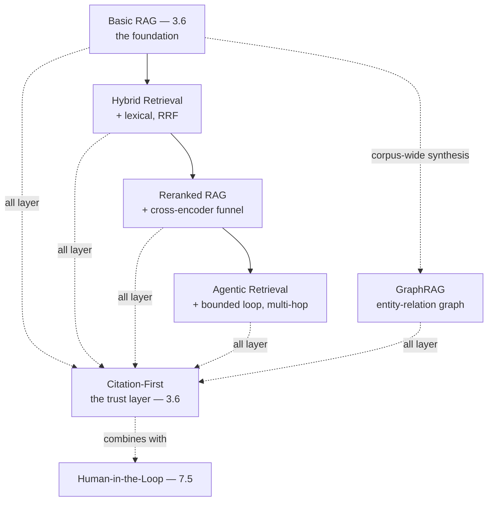

# Chapter 7.2 — RAG Patterns

| | |
|---|---|
| **Part** | 7 — Enterprise AI Architecture Patterns |
| **Maturity level** | 4 — Architect |
| **Difficulty** | Advanced |
| **Estimated study time** | 3 hours (reading 90 min, exercise 90 min) |
| **Prerequisites** | [3.6 RAG Fundamentals](../part-3-core-building-blocks-of-genai/chapter-06-rag-fundamentals.md); [4.1](../part-4-enterprise-genai-systems/chapter-01-production-rag.md); [4.2](../part-4-enterprise-genai-systems/chapter-02-advanced-retrieval.md) |

## Learning Objectives

After this chapter you will be able to:

1. Apply the RAG pattern family in pattern-language form: basic RAG, hybrid retrieval, reranked RAG, agentic retrieval, GraphRAG, and citation-first.
2. Select the RAG pattern matched to the retrieval problem, using each pattern's context, forces, and consequences.
3. Combine RAG patterns into retrieval architectures, understanding how they layer.
4. Recognize the RAG patterns in the case studies, the reference core's known uses.

## Introduction

This chapter catalogs the RAG pattern family — the retrieval-augmented-generation patterns that Parts 3–4 built (3.5's retrieval, 3.6's RAG, 4.1's production RAG, 4.2's advanced retrieval), presented in pattern-language form (7.1). The patterns range from the basic (basic RAG — 3.6) to the advanced (agentic retrieval — 4.2, GraphRAG — 4.2), and this chapter is the reference for selecting and combining them.

The framing: **the RAG patterns are a layered family** — from basic RAG (the foundation — 3.6) through the enhancements (hybrid, reranked — 4.2) to the advanced patterns (agentic, GraphRAG — 4.2), layered by the retrieval problem's demands, and this chapter is the reference for matching the pattern to the problem.

## Business Motivation

The RAG patterns are the enterprise's knowledge-grounding toolkit — the patterns that make the enterprise's knowledge accessible via RAG (3.6's four business reasons: freshness, permissions, auditability, cost). Selecting the right RAG pattern matters: the basic RAG pattern (3.6) suffices for simple retrieval, but the advanced patterns (hybrid, reranked, agentic — 4.2) are needed for the harder retrieval problems (the identifier queries — hybrid, the precision — reranked, the multi-hop — agentic), and applying the wrong pattern (basic RAG where reranked was needed — the recall gap — 4.2) caps the retrieval quality (3.5's binding constraint). The business case is the retrieval-quality one: the right RAG pattern (matched to the problem) delivers the retrieval quality the RAG system depends on (3.5's binding constraint, 3.6's two-sided evaluation), and the RAG pattern family is the reference for selecting it — the toolkit that makes the enterprise's knowledge accessible at the quality the use case demands.

## Theory — The RAG Pattern Catalog

### Pattern: Basic RAG

- **Context** — a knowledge-grounding need where the corpus is retrievable by semantic similarity (3.6).
- **Problem** — the model needs current, private, or authoritative knowledge it doesn't have (2.6's knowledge → RAG).
- **Forces** — freshness vs. cost, retrieval quality vs. simplicity, grounding vs. the model's parametric knowledge (3.6).
- **Solution** — retrieve relevant chunks by semantic similarity, assemble into context, generate grounded with citations (3.6's loop).
- **Structure** — query → embed → retrieve top-k → assemble → generate → cite (3.6).
- **Consequences** — fresh, citable, permissioned, cost-effective knowledge (3.6's four reasons); the retrieval quality caps the system (3.5).
- **Known uses** — P05 (internal knowledge search), CS05 (hospital protocols), most enterprise knowledge assistants.
- **Related** — Hybrid Retrieval (the enhancement), Citation-First (the grounding), the anti-corruption layer (6.4).

### Pattern: Hybrid Retrieval

- **Context** — a RAG system whose query stream includes both semantic and exact-match queries (4.2, 2.4).
- **Problem** — semantic search misses the identifier/exact-match queries (the codes, names, jargon — 2.4/4.2).
- **Forces** — semantic recall vs. exact-match recall, the incomparable scores (4.2's RRF).
- **Solution** — run lexical (BM25) and semantic search, merge with reciprocal rank fusion (4.2).
- **Structure** — query → lexical + semantic → RRF merge → top-k (4.2).
- **Consequences** — better recall across query classes (the identifier class recovered — 4.2); the two indexes to maintain.
- **Known uses** — CS39 (developer copilot — code identifiers), Vantora's support assistant (4.2's 0.41→0.93 identifier recall).
- **Related** — Basic RAG (the foundation), Reranked RAG (the next layer).

### Pattern: Reranked RAG

- **Context** — a RAG system needing higher precision than first-stage retrieval provides (4.2).
- **Problem** — first-stage retrieval (bi-encoder) is blind to fine-grained query-document interaction (4.2).
- **Forces** — precision vs. latency (the cross-encoder cost), the funnel shape (4.2).
- **Solution** — retrieve generously (top 30–100), rerank with a cross-encoder, keep the top 3–8 (4.2's funnel).
- **Structure** — first-stage retrieve → cross-encoder rerank → top-k to context (4.2).
- **Consequences** — higher precision, fewer better chunks (focused attention — 2.5); the latency and the versioned reranker (4.2/3.10).
- **Known uses** — CS23 (contract review — precision-critical), CS25 (legal research).
- **Related** — Hybrid Retrieval (the first stage), Model Tiering (7.8, the reranker as a tier).

### Pattern: Agentic Retrieval

- **Context** — a retrieval problem where one round can't suffice (the answer requires following references — 4.2, 3.8).
- **Problem** — the multi-hop question whose answer spans documents requiring iterative retrieval (4.2).
- **Forces** — retrieval depth vs. cost/latency (the bounded loop — 3.8), the task-class escalation (4.2).
- **Solution** — a bounded agent loop (3.8) that retrieves, reads, reformulates, retrieves again, within budgets (4.2/3.8's governors).
- **Structure** — the bounded agent loop (3.8) with retrieval as the tool (4.2).
- **Consequences** — multi-hop retrieval (the harder questions answered); the agent cost and complexity (3.8's governors — route the hard 5%).
- **Known uses** — Halvard & Roth's due-diligence cross-reference investigation (3.8/4.5), CS40 (legacy code modernization).
- **Related** — Bounded Agent Loop (7.4), the routing pattern (7.3 — route the hard queries).

### Pattern: GraphRAG (Knowledge-Structure Retrieval)

- **Context** — corpus-wide synthesis questions similarity search can't answer (4.2 — "what themes recur across all X").
- **Problem** — the aggregation/synthesis question that requires relationships, not similarity (4.2).
- **Forces** — the synthesis capability vs. the heavy ingestion cost (the entity-relation extraction — 4.2).
- **Solution** — extract entities and relations at ingestion, traverse the graph at query time (4.2).
- **Structure** — ingestion: entity-relation extraction → knowledge graph; query: graph traversal + generation (4.2).
- **Consequences** — corpus-wide synthesis (the questions similarity can't); the heavy ingestion cost (adopt against the named question class — 4.2).
- **Known uses** — CS41 (incident postmortem synthesis), CS17 (quality incident root-cause across silos).
- **Related** — Basic RAG (the similarity complement), the feedback-to-dataset pattern (7.7).

### Pattern: Citation-First

- **Context** — a RAG system where the answer's trustworthiness depends on verifiable sources (3.6, 4.14).
- **Problem** — the ungrounded or unverifiable answer that destroys trust (3.6's grounded-but-wrong, 3.1's hallucination).
- **Forces** — the grounding vs. the model's fluency, the citation validity (3.6).
- **Solution** — the epistemic contract (answer from context, cite the provenance), citation validation (3.6's citation-first, the programmatic check).
- **Structure** — the grounded prompt + the citation validation (3.6's seam).
- **Consequences** — verifiable, trustworthy answers (3.6's auditability — 4.14); the refusal-on-no-context (3.6's designed refusal).
- **Known uses** — CS25 (legal research — citation integrity), CS02 (patient triage — safety-critical grounding), all regulated RAG.
- **Related** — Basic RAG (the foundation), Human-in-the-Loop (7.5, the review of the cited answer).

## Architecture Perspective

Readings. **The RAG patterns layer from basic to advanced** — basic RAG (the foundation — 3.6) enhanced by hybrid (the query-class coverage — 4.2), reranked (the precision — 4.2), and agentic (the multi-hop — 4.2), with GraphRAG as the corpus-wide-synthesis alternative (4.2) — the patterns layered by the retrieval problem's demands, matched to the problem (the improvement loop — 4.2's taxonomy). **Citation-first is the trust layer across all** — the citation-first pattern (3.6) layers on any RAG pattern (the trust layer — the grounding and citation validation — 3.6), essential for the trustworthy RAG (4.14's auditability). **And the patterns combine** — a production RAG architecture combines the patterns (hybrid + reranked + citation-first + human-in-the-loop — the combination — 7.1), matched to the problem and the trust needs — the RAG pattern family as the layered toolkit for the retrieval architecture.

## Real-world Example

**Halvard & Roth** (the recurring law firm — 3.5, 4.1, 4.2) built its contract-analysis RAG by combining the RAG patterns, and the combination is the pattern family applied. The base was basic RAG (3.6, the matter corpus), enhanced to hybrid retrieval (4.2, the legal identifiers — clause numbers, case citations — the identifier-query class — 4.2) and reranked RAG (4.2, the precision-critical legal retrieval — the cross-encoder funnel — 4.2), with citation-first (3.6, the citation integrity the legal use case demands — the verifiable sources — 4.14) layered as the trust layer, and agentic retrieval (4.2/3.8) for the multi-hop cross-reference investigations (the indemnity-cap-references-schedule-references-side-letter — 3.8's Halvard & Roth investigation). The pattern combination was the architecture: hybrid (the query-class coverage) + reranked (the precision) + citation-first (the trust) + agentic-retrieval-for-the-hard-5% (the multi-hop) + human-in-the-loop (7.5, the associate review) — the RAG architecture as a combination of the RAG patterns, each matched to the retrieval problem (the improvement loop — 4.2's taxonomy driving the pattern selection). Yusuf's RAG-patterns note: *"Our contract-analysis RAG is a pattern combination: basic RAG (the corpus), hybrid (the legal identifiers), reranked (the precision), citation-first (the legal citation integrity), agentic retrieval (the multi-hop cross-references), human-in-the-loop (the associate review). Each pattern matched to a retrieval problem (the taxonomy — 4.2), layered from basic to advanced. The RAG pattern family is the toolkit — I select and combine the patterns matched to the problem, and the architecture is the combination. That's the reference core: the patterns compress the retrieval architecture into named, reusable, combinable form."*

## Hands-on Exercise

**Select and combine RAG patterns.** ~90 minutes. For a RAG system (real or a case study).

1. **Pattern selection (30 min).** For a RAG system's retrieval problems (use 4.2's miss taxonomy — identifier, vocabulary, multi-hop, synthesis), select the matched RAG pattern per problem (hybrid for identifiers, reranked for precision, agentic for multi-hop, GraphRAG for synthesis). Justify each with the pattern's context and forces.
2. **The pattern-language form (20 min).** For one selected pattern, write its full pattern-language form (Context, Problem, Forces, Solution, Structure, Consequences, Known uses, Related) for your specific system.
3. **The combination (25 min).** Design the RAG architecture as a pattern combination (the selected patterns layered, plus citation-first and human-in-the-loop). Show how the patterns combine (the design — 1.4/7.1, the forces balanced).
4. **The case-study mapping (15 min).** Map your pattern combination to a case study's RAG (identify the shared patterns), showing the pattern language's known-uses connection.

**Acceptance criteria:**
- [ ] RAG patterns selected matched to the retrieval problems (4.2's taxonomy), with context and forces
- [ ] One pattern in the full pattern-language form for the specific system
- [ ] The RAG architecture as a pattern combination (layered, designed — 7.1)
- [ ] The pattern combination mapped to a case study's RAG

## Enterprise Considerations

The RAG patterns are the enterprise's knowledge-grounding reference. **They're the retrieval-architecture reference** (6.1/7.1): the RAG pattern family is the enterprise's reference for retrieval architecture (the patterns the retrieval systems combine — 4.1's shared retrieval service, 7.9's platform), maintained as part of the pattern catalog (7.1, the reference core). **The pattern selection connects to the evaluation** (4.2/4.7): the pattern selection is driven by the retrieval evaluation (the miss taxonomy — 4.2, the golden set — 3.5/4.7), so the RAG patterns connect to the evaluation (the pattern matched to the measured problem — 4.2's improvement loop). **The advanced patterns have cost implications** (4.11): the advanced RAG patterns (reranked, agentic, GraphRAG) have cost implications (the reranker cost, the agent cost, the graph ingestion — 4.2/4.11), so the pattern selection is a cost-quality trade (4.11, the pattern's forces), governed (6.9/6.10). **And the patterns combine into the shared retrieval service** (4.1/7.9): the RAG patterns combine into the enterprise's shared retrieval service (4.1, the platform — 7.9), so the pattern family is the reference for the platform's retrieval architecture (the patterns the shared service offers).

## Trade-offs

| Decision | Option A | Option B | Choose A when… | Choose B when… |
|----------|----------|----------|----------------|----------------|
| Retrieval enhancement | Hybrid + reranked | Basic RAG | The query stream has identifier/precision demands (4.2) | Simple semantic retrieval suffices (measured — 4.2) |
| Multi-hop | Agentic retrieval | One-shot retrieval | The multi-hop/reference-following class exists (4.2) | The class doesn't exist (don't build the loop speculatively) |
| Synthesis | GraphRAG | Basic RAG | Corpus-wide synthesis questions (the named class — 4.2) | Similarity retrieval suffices (the heavy graph ingestion not warranted) |
| Trust | Citation-first (always for regulated) | Ungrounded | Trustworthiness matters (4.14, regulated) | Never ungrounded for enterprise knowledge — citation-first as the default |

## Common Mistakes

1. **Basic RAG where advanced was needed** — applying basic RAG to a problem needing hybrid/reranked/agentic (the recall/precision gap — 4.2); match the pattern to the problem (4.2's taxonomy).
2. **The advanced pattern without the problem** — applying reranked/agentic/GraphRAG speculatively (the technique-collecting — 4.2); the pattern matched to the measured problem (4.2's improvement loop).
3. **Skipping citation-first** — the RAG without the trust layer (the ungrounded/unverifiable answer — 3.6's grounded-but-wrong); citation-first as the default (the trust layer).
4. **Comparing scores across patterns** — merging hybrid's incomparable scores wrongly (4.2's RRF); rank-based fusion (4.2).
5. **The un-combined patterns** — applying the patterns without combining them into a coherent architecture (the un-designed combination — 7.1); the combination is a design (the forces balanced).
6. **Ignoring the pattern's forces** — applying a pattern without its forces (the reranked without the latency cost — 4.2); the pattern's forces (the trade-offs — 1.4).
7. **The pattern combination ignoring cost** — the advanced-pattern combination without the cost-quality trade (4.11); the pattern's cost implications (the forces).

## Best Practices

1. **Match the RAG pattern to the retrieval problem** — the miss taxonomy (4.2) drives the pattern selection (hybrid for identifiers, reranked for precision, agentic for multi-hop, GraphRAG for synthesis).
2. **Layer the patterns from basic to advanced** — basic RAG (the foundation) enhanced by the patterns matched to the demands (4.2's improvement loop).
3. **Apply citation-first as the default trust layer** — the grounding and citation validation (3.6) for trustworthy RAG (4.14, regulated).
4. **Combine the patterns deliberately** — the RAG architecture as a pattern combination (7.1, the forces balanced — 1.4).
5. **Connect the pattern selection to the evaluation** — the pattern matched to the measured problem (4.2's taxonomy, 3.5/4.7's golden set).
6. **Weigh the advanced patterns' cost** — the reranker, agent, graph-ingestion cost (4.11, the pattern's forces), governed (6.9/6.10).
7. **Use the RAG patterns as the retrieval-architecture reference** — the pattern family as the enterprise's retrieval reference (7.1, the shared retrieval service — 4.1/7.9).

## Architecture Checklist

For applying the RAG patterns:

- [ ] The RAG pattern matched to the retrieval problem (4.2's miss taxonomy)
- [ ] Basic RAG enhanced by the patterns matched to the demands (hybrid, reranked, agentic, GraphRAG)
- [ ] Citation-first applied as the trust layer (3.6, for regulated/trustworthy RAG)
- [ ] The RAG architecture designed as a pattern combination (7.1, the forces balanced)
- [ ] The pattern selection connected to the evaluation (4.2/4.7)
- [ ] The advanced patterns' cost weighed (4.11, the forces); governed (6.9/6.10)
- [ ] The patterns combined into the shared retrieval service where applicable (4.1/7.9)

## Interview Questions

1. *"Walk me through the RAG patterns and when you'd use each."* — Strong answers give the pattern family (basic RAG — the foundation, hybrid — the identifiers, reranked — the precision, agentic — the multi-hop, GraphRAG — the synthesis, citation-first — the trust), each with its context and forces, and the matching to the retrieval problem (4.2's taxonomy).
2. *"How do you combine RAG patterns into an architecture?"* — Strong answers give the layered combination (basic → hybrid → reranked → agentic, with citation-first and human-in-the-loop — 7.1's pattern combination), designed deliberately (the forces balanced — 1.4), matched to the retrieval problems (Halvard & Roth's contract-analysis combination).
3. *"When would you use GraphRAG vs. basic RAG?"* — Strong answers give the context distinction (GraphRAG for corpus-wide synthesis questions that require relationships not similarity — the named class — 4.2, basic RAG for similarity retrieval), and the forces (the graph's synthesis capability vs. the heavy entity-relation ingestion cost — adopt against the named question class).
4. *"How do you decide which RAG enhancement to add?"* — Strong answers give the improvement loop (4.2): the miss taxonomy (identifier, vocabulary, multi-hop, synthesis) drives the pattern selection (hybrid, reranked, agentic, GraphRAG matched to the class), measured (the golden set — 3.5/4.7), not technique-collecting (the pattern matched to the problem).

## Further Reading

- 3.6 RAG Fundamentals, 4.1 Production RAG, 4.2 Advanced Retrieval — the chapters this pattern family formalizes; the source of the patterns.
- The RAG research literature (the RAG paper — Lewis et al., the GraphRAG and HyDE papers — re-linked from 4.2) — the patterns' research lineage.
- The [RAG design checklist](../../checklists/rag-design-checklist.md) — the checklist the patterns implement.
- The [case studies](../../case-studies/README.md) — the RAG patterns' known uses (the RAG-heavy case studies).

## Summary

- The **RAG pattern family** is a layered toolkit — basic RAG (3.6, the foundation), hybrid retrieval (4.2, the query-class coverage), reranked RAG (4.2, the precision), agentic retrieval (4.2, the multi-hop), GraphRAG (4.2, the corpus-wide synthesis), and citation-first (3.6, the trust layer) — matched to the retrieval problem (4.2's taxonomy).
- The patterns **layer from basic to advanced** — basic RAG enhanced by the patterns matched to the retrieval demands, with citation-first as the trust layer across all (essential for regulated/trustworthy RAG — 4.14).
- The patterns **combine into the retrieval architecture** — a production RAG is a pattern combination (hybrid + reranked + citation-first + human-in-the-loop — 7.1), designed deliberately (the forces balanced — 1.4), matched to the problem (Halvard & Roth's contract-analysis combination).
- The pattern selection is **driven by the evaluation** (4.2's improvement loop, 3.5/4.7's golden set) — the pattern matched to the measured problem, not technique-collecting.
- The RAG patterns are the **enterprise's knowledge-grounding reference** (7.1, the shared retrieval service — 4.1/7.9). The fixed-control-flow patterns are next: **workflow patterns** (7.3).

---

**Previous:** [Chapter 7.1 — A Pattern Language for GenAI](chapter-01-pattern-language.md) · **Next:** [Chapter 7.3 — Workflow Patterns](chapter-03-workflow-patterns.md) · **Related:** [3.6 RAG Fundamentals](../part-3-core-building-blocks-of-genai/chapter-06-rag-fundamentals.md), [4.2 Advanced Retrieval](../part-4-enterprise-genai-systems/chapter-02-advanced-retrieval.md), [7.7 Knowledge & Data Patterns](chapter-07-knowledge-data-patterns.md)
