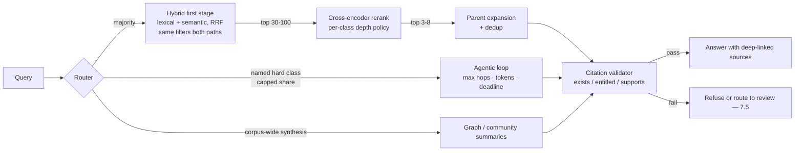

# Chapter 7.2 — RAG Patterns

| | |
|---|---|
| **Part** | 7 — Enterprise AI Architecture Patterns |
| **Maturity level** | 4 — Architect |
| **Difficulty** | Advanced |
| **Estimated study time** | 2 hours (reading 40 min, exercise 80 min) |
| **Prerequisites** | [3.6 RAG Fundamentals](../part-3-core-building-blocks-of-genai/chapter-06-rag-fundamentals.md); [4.1](../part-4-enterprise-genai-systems/chapter-01-production-rag.md); [4.2](../part-4-enterprise-genai-systems/chapter-02-advanced-retrieval.md) |

## Learning Objectives

After this chapter you will be able to:

1. Apply the RAG pattern family in pattern-language form: Basic RAG, Hybrid Retrieval, Parent-Child Retrieval, Reranked RAG, Agentic Retrieval, GraphRAG, and Citation-First.
2. Select a retrieval pattern from a *named failure class* rather than from technique fashion.
3. Price each pattern honestly — its latency tail, its per-query or per-corpus cost, and the operational surface it adds.
4. Compose the patterns into an architecture, and say for each when you would *not* use it.

## Introduction

The RAG patterns are usually taught as a ladder: start basic, climb to advanced. That framing produces architectures that collect techniques. The useful framing is diagnostic — **each pattern answers one named retrieval failure, and installed against any other failure it buys cost without quality.** A cross-encoder cannot rescue a candidate set that never contained the answer; a graph cannot help a question that three lines of SQL over metadata already answer.

So the chapter is organized around failure classes first ([4.2](../part-4-enterprise-genai-systems/chapter-02-advanced-retrieval.md)'s miss taxonomy) and patterns second. Two sit outside that grid: Citation-First, a default on every enterprise RAG whatever the failure class, and Agentic Retrieval, which in 2026 practice is a routed escalation with a spending ceiling — not the architecture's backbone.

## Business Motivation

Retrieval quality is the ceiling on everything downstream: no prompt, no model upgrade, and no evaluation harness recovers a passage that was never retrieved. Pattern selection is therefore a quality lever, and — because each pattern has a different *cost shape* — a money lever in both directions.

Confusing the cost shapes is the expensive mistake. Basic RAG and Hybrid Retrieval cost at ingestion and storage. Reranked RAG costs per candidate scored, so depth is a recurring line item scaling with query volume. GraphRAG costs a model pass over *every document*, so its bill scales with corpus size and re-extraction cadence rather than usage — a capital-shaped commitment a pilot's traffic never reveals. Agentic Retrieval costs per hop, and a loop that chooses its own length has no natural ceiling.

The counterpart to overspending is the silent quality gap: a corpus full of error codes served by semantic search alone returns plausible wrong chunks — a failure users report as "the assistant is vague" and dashboards report as nothing at all. The curriculum's own fictional Vantora Systems ([4.2](../part-4-enterprise-genai-systems/chapter-02-advanced-retrieval.md)) is the worked instance: recall on the identifier slice sat at 0.41 while the overall number looked survivable.

## Theory — The RAG Pattern Catalog

Selection logic first. Run the golden set, read the misses, bucket them, then read down this table:

| Named failure class | What it looks like in the miss set | Pattern |
|---|---|---|
| Exact identifiers missed | Error codes, SKUs, clause numbers, surnames return topically similar but wrong chunks | **Hybrid Retrieval** |
| Right passage, wrong order | High recall@50, poor precision@5 — the answer is in the candidates, below the cut | **Reranked RAG** |
| Fragmented context | The chunk is correct but unusable: an orphan clause, step 4 of 9, a row without its header | **Parent-Child Retrieval** |
| Corpus-wide synthesis | "What themes recur across all X" — no single passage is the answer | **GraphRAG** |
| Unknown evidence shape | The evidence chain isn't knowable until you start reading | **Agentic Retrieval** |
| Correct but unverifiable | The answer is right and the reader has no cheap way to confirm it | **Citation-First** |
| None of the above | Plain semantic questions answered by one or two passages | **Basic RAG** is enough |

### Pattern: Basic RAG

- **Context** — a bounded corpus whose questions are answerable from one or two passages ([3.6](../part-3-core-building-blocks-of-genai/chapter-06-rag-fundamentals.md)).
- **Problem** — the model needs current, private, or authoritative knowledge, and fine-tuning is the wrong instrument for facts that change faster than training cycles.
- **Forces** — recall vs. context budget (large k dilutes attention and inflates tokens, small k drops answers); grounding vs. parametric fluency, since the model fills gaps from memory unless forbidden.
- **Solution** — parse → chunk → embed → index with permission and version metadata; at query time filter by entitlement, retrieve top-k, generate under an explicit grounding instruction.
- **Structure** — one schema shared by the ingestion path (chunk store, vector index, ACL metadata) and the query path, with retrieval and answer quality gated separately.
- **Consequences** — the cheapest grounding available: one index, one generation call per answer, embedding cost paid per corpus change rather than per query. Its costs are structural, not per-request — recall@k caps the whole system, and an embedding-model swap re-embeds the entire corpus, a bill that belongs in the model decision.
- **When not to use** — identifier-heavy streams, corpus-wide synthesis, or permissions finer-grained than the chunk store can express.
- **Known uses** — Lewis et al. (2020)'s retrieval-augmented generation formulation; standard practice in enterprise document assistants and product-documentation Q&A. Curriculum instance (fictional): [CS05](../../case-studies/cs05-hospital-knowledge-hub.md).
- **Related** — Citation-First (the layer above); every other pattern here amends this one.

### Pattern: Hybrid Retrieval

- **Context** — a query stream mixing paraphrased intent with exact strings: codes, part numbers, clause references, rare jargon, proper names.
- **Problem** — dense embeddings have no useful neighborhood for a rare token, so an identifier query returns documents *about* the topic instead of the record. The failure is silent: top-k comes back full, fluent, and wrong.
- **Forces** — lexical exact-match recall vs. semantic paraphrase recall, which no single index wins at once; BM25 scores and cosine similarities are incomparable, so score-level blending is fragile across corpora.
- **Solution** — one chunk store, two index projections from the same pipeline, merged by **rank** with reciprocal rank fusion, which needs no score calibration. Entitlement filters must apply identically on both paths — a filter on one path only is a permission leak wearing a retrieval bug's clothes.
- **Structure** — query → {lexical, semantic} in parallel, both filtered → RRF merge → top-k, with per-class golden-set slices measuring each path.
- **Consequences** — recovers the identifier class, usually the largest single miss bucket, at the lowest price in the catalog; costs a second index to keep in sync, per-language analyzers in multilingual corpora, a p99 set by the *slower* path, and the loss of score thresholds, since cutoffs are now made by rank.
- **When not to use** — when the taxonomy shows no exact-match class (measure it; assume it exists until proven otherwise), or when the corpus is small enough that top-k is most of it.
- **Known uses** — BM25 is decades of information-retrieval literature; rank fusion is Cormack, Clarke & Buettcher (SIGIR 2009); hybrid keyword-plus-vector retrieval with RRF ships as a documented built-in mode in mainstream search engines and vector databases. Curriculum instance (fictional): Vantora's identifier recall, 0.41 → 0.93.
- **Related** — Basic RAG (the substrate); Reranked RAG (the next stage, over a better candidate set).

### Pattern: Parent-Child Retrieval

- **Context** — documents whose meaning spans more than one matching unit: numbered procedures, contracts whose definitions sit paragraphs above the operative clause, tables whose headers are far from their rows.
- **Problem** — one chunk size is asked to do two incompatible jobs: small chunks match precisely and arrive without the context that makes them answerable, large chunks carry context and dilute the embedding until it matches nothing well.
- **Forces** — matching precision vs. answer completeness; context budget and token cost, since parents are multiples of children and padding the window carries its own attention cost ([2.5](../part-2-artificial-intelligence/chapter-05-transformer-architecture.md)).
- **Solution** — decouple the matching unit from the context unit: index children for retrieval, then at assembly substitute the parent section, expand a sentence window, or prepend a generated context header. Deduplicate parents when several children hit the same one.
- **Structure** — ingestion writes child → parent mappings beside each vector; the query path matches children, maps to parents, dedupes, truncates to budget by parent rank.
- **Consequences** — fixes truncated-procedure and orphan-clause answers without touching the retriever or the model, which makes it high-leverage late in a build; raises tokens per answer by construction, partly cancelling what a reranker saves, and without dedup one long parent crowds out every other source.
- **When not to use** — corpora of short independent records (FAQ entries, resolved tickets) where the child already is the answer, and hard token or latency budgets.
- **Known uses** — parent-document, auto-merging, and sentence-window retrievers ship as standard components in mainstream RAG frameworks; augmenting each chunk with document-level context at ingestion is a published, widely replicated technique. Curriculum instance (fictional): the numbered procedures of [CS15](../../case-studies/cs15-maintenance-manual-assistant.md).
- **Related** — Basic RAG (whose chunk-size trade-off this dissolves rather than splits); Reranked RAG (rerank children, expand afterward).

### Pattern: Reranked RAG

- **Context** — a funnel whose golden set shows the answer arriving in the top 50 but not the top 5.
- **Problem** — bi-encoders score query and document independently, so embedding proximity measures topicality, not whether this passage answers *this* question.
- **Forces** — precision vs. latency and money, since a cross-encoder is one inference per candidate and cost rises linearly with depth; and one more versioned model in the stack, with its own bake-off, pinning, and migration duties.
- **Solution** — retrieve generously (30–100 hybrid candidates), score pairs with a cross-encoder, keep the top 3–8. Gate on precision@k and MRR uplift over the *fused first stage* on your own golden set; make depth and enablement per-query-class policies, not one global setting.
- **Structure** — hybrid first stage → cross-encoder over N candidates → top-k → optional parent expansion → context; stage metrics are recall@N before, precision@k after.
- **Consequences** — fewer, better chunks, which often improves generation *and* cuts generation tokens, so it partly self-funds; adds tens to a couple of hundred milliseconds at p95 depending on model and depth, and hosted rerank endpoints bill per document scored, which makes candidate depth a budget decision rather than a tuning knob.
- **When not to use** — before hybrid, since reranking a poor candidate set only reorders wrong answers; when the measured post-hybrid gap is small; on typeahead paths that cannot absorb a second stage.
- **Known uses** — cross-encoder reranking is a well-established IR technique, with the BERT passage re-ranking line (Nogueira & Cho, 2019) and the later MS MARCO ranking literature as its public record; commercial rerank endpoints expose it as a hosted service. Curriculum instance (fictional): [CS23](../../case-studies/cs23-contract-review-platform.md)'s precision-critical review.
- **Related** — Hybrid Retrieval (the first stage it depends on); Two-Stage Retrieve-then-Rank ([7.11](chapter-11-predictive-scoring-patterns.md) — the same shape over catalogs).

### Pattern: Agentic Retrieval

- **Context** — questions whose evidence chain is not knowable from the question: "does the indemnity cap in §7 survive the side letter?", or comparisons where one retrieved fact determines what to look for next.
- **Problem** — one-shot retrieval assumes a query names its own evidence; multi-hop questions violate that assumption, and no first-stage tuning repairs it.
- **Forces** — depth vs. an unbounded cost and latency tail, because the loop decides its own length; quality vs. predictability, since the same question can cost several times more on a different day; debuggability, because a failure is now a trajectory rather than a top-k list.
- **Solution** — treat it as a **routed escalation with a ceiling, never a default path**. A router sends the named hard class into a bounded loop with maximum hops, tool calls, tokens, and wall-clock deadline. On budget exhaustion it returns the best grounded partial answer *and states what it could not resolve* — never a confident guess on the last hop.
- **Structure** — query → router → {one-shot funnel for the majority | bounded loop for the escalated slice} → citation validation → answer, with per-route cost dashboards and logged trajectories; the ceiling is a config value with a named owner.
- **Consequences** — answers a class nothing else here answers, at a multiple of one-shot cost per query and a latency measured in seconds, which is user-visible and needs a progress affordance. Total spend is route share × ceiling, so the router's precision is a *budget control* as much as a quality control — an uncapped loop is an open invoice.
- **When not to use** — as the default path; when the taxonomy shows no multi-hop class (don't build the loop speculatively); on interactive sub-second paths.
- **Known uses** — interleaved retrieve-and-reason is published research (reasoning-and-acting tool loops, and self-reflective or interleaved retrieval methods such as Self-RAG and IRCoT); "deep research" modes in consumer assistants run multi-round retrieval behind an explicit longer-wait affordance. Curriculum instance (fictional): Halvard & Roth's cross-reference investigation ([3.8](../part-3-core-building-blocks-of-genai/chapter-08-agents-concepts.md)).
- **Related** — the bounded agent loop and its governors ([7.4](chapter-04-agentic-patterns.md)); the routing patterns of [7.3](chapter-03-workflow-patterns.md).

### Pattern: GraphRAG (Knowledge-Structure Retrieval)

- **Context** — questions about the corpus rather than in it: recurring themes across a quarter's complaints, entities appearing in incidents on two lines, relationship chains across silos.
- **Problem** — top-k similarity returns the k most similar passages, and a corpus-wide question has no single similar passage. This is a structural limit, not a tuning gap.
- **Forces** — synthesis capability vs. a heavy ingestion pass repeated on every schema change; graph quality vs. extraction error, where a mis-linked entity yields a wrong answer carrying a confident provenance trail.
- **Solution** — extract entities and relations at ingestion, build the graph, cluster it into communities and pre-summarize them; at query time select the relevant subgraph or summaries and generate over those. Keep similarity retrieval alongside — the graph answers a different question class, it does not replace the index.
- **Structure** — ingestion: parse → entity/relation extraction → graph plus community summaries, each edge carrying its source reference; query: classify → traverse → generate → cite back to sources.
- **Consequences** — unlocks an otherwise unanswerable class; the dominant cost is the extraction pass, which scales with corpus size and re-extraction cadence rather than query volume, so a low-traffic pilot will not expose it. Entity resolution ("Acme Ltd" vs. "ACME Limited") becomes a permanent data-quality workstream, and edge-to-source provenance must be maintained or the synthesis is uncitable.
- **When not to use** — when no corpus-wide synthesis class exists; when corpus churn is high relative to extraction cost; and — the check most teams skip — when the aggregate is computable from structured metadata, which is orders of magnitude cheaper.
- **Known uses** — Microsoft Research's GraphRAG, a published method with an open-source implementation, for query-focused summarization over a corpus; knowledge-graph-backed retrieval is long established in domains with curated ontologies such as biomedical literature. Curriculum instance (fictional): [CS41](../../case-studies/cs41-incident-postmortem-assistant.md)'s postmortem synthesis.
- **Related** — Basic RAG (the similarity complement it runs beside); the knowledge and freshness patterns of [7.7](chapter-07-knowledge-data-patterns.md).

### Pattern: Citation-First

- **Context** — any answer a human will act on, escalate, or be audited for. In enterprise RAG that is all of them.
- **Problem** — fluent ungrounded text is indistinguishable from grounded text at reading speed, which makes a fabricated or mismatched citation worse than none: it manufactures trust it has not earned.
- **Forces** — grounding discipline vs. answer coverage, since a strict contract refuses more often; citation granularity vs. interface noise, where span-level citations are checkable and document-level ones are effectively unfalsifiable.
- **Solution** — three parts, all required: an epistemic contract in the prompt (answer only from the provided context; if it doesn't answer, say so); structured output binding each claim to a chunk identifier; and a validator checking that the cited ids were actually retrieved, that the span supports the claim, and that the reader is entitled to the source. Validation failure downgrades to refusal or human review — never to dropping the citation and keeping the sentence.
- **Structure** — retrieve → grounded prompt → structured answer plus ids → validator (exists ∧ entitled ∧ supports) → deep-linked spans → log answer, sources, and verdict for audit.
- **Consequences** — makes answers auditable and gives reviewers a fast verification path, usually the largest human-cost saving in review-heavy workflows; costs a verification pass per answer, a refusal rate the product owner must accept in writing, and more front-end and permissions work than teams expect, since deep-linking into source spans across repositories is often larger than the retrieval work itself.
- **When not to use** — there is no case for skipping it on enterprise knowledge; the only honest relaxation is coarser granularity on low-stakes internal search, recorded as a decision with its reason.
- **Known uses** — inline, clickable source attribution is standard in consumer search assistants and enterprise document assistants; measuring whether generated statements are attributable to identified sources is an active published research area. Curriculum instance (fictional): [CS25](../../case-studies/cs25-legal-research-assistant.md)'s citation integrity.
- **Related** — Human-in-the-Loop ([7.5](chapter-05-human-in-the-loop-patterns.md) — the reviewer whose job citations make cheap); every other pattern here, all of which it wraps.

## Architecture Perspective

Three readings. **The main line is a funnel and every stage owns a metric** — recall@N first stage, precision@k after rerank, context completeness after expansion; a stack without stage-level metrics can only be guessed at. **The escalations are branches with budgets, not stages**, each with a ceiling whose owner is named. **The validator is the only merge point**, which keeps the trust guarantee constant across routes that otherwise share nothing.

## Real-world Example

**Halvard & Roth** (the curriculum's recurring fictional law firm — [4.1](../part-4-enterprise-genai-systems/chapter-01-production-rag.md), [4.2](../part-4-enterprise-genai-systems/chapter-02-advanced-retrieval.md)) reached its contract-analysis architecture one failure class at a time, and the order is the instructive part.

The first build was Basic RAG over the matter corpus, and its miss set had two dominant buckets. Clause and case-citation lookups failed outright — the identifier class, which Hybrid Retrieval addressed. Retrieved clauses were also often *correct and unusable*: an operative paragraph whose defined terms lived three paragraphs above it, so associates could not tell whether the answer applied. That is fragmented context, and Parent-Child Retrieval fixed it without touching the retriever.

Only then did reranking earn its place, because only then was the residual gap an ordering problem rather than a candidate problem — and the firm accepted its latency on the research path while declining it in the in-editor suggestion path. Citation-First was never optional: an uncited assertion about an indemnity cap is unusable, and the validator's entitlement check doubles as matter-level confidentiality enforcement. Agentic Retrieval entered last and narrowest — reference-chain investigations, routed by a classifier, with a hop ceiling and a per-matter budget, while everything outside that class still runs the one-shot funnel.

## Hands-on Exercise

**Diagnose, then select.** ~80 minutes. Use a RAG system you have built ([P05](../../projects/p05-internal-knowledge-search/README.md), [P06](../../projects/p06-production-rag-service/README.md)) or a RAG-heavy case study.

1. **Taxonomize (25 min).** Bucket at least 25 golden-set misses into exactly one class each: identifier, ordering, fragmented context, corpus-wide synthesis, unknown evidence shape, verifiability. Quantify the buckets — empty ones matter as much as the largest.
2. **Select and price (25 min).** For your top two classes, name the pattern and write its cost line: what it adds per query, per corpus change, and per release. One of the two must include an explicit "and here is what I would *not* install, because that class is under 5%."
3. **Cap the escalation (15 min).** Assume you will route a hard class to Agentic Retrieval. Write the ceiling as numbers — max hops, max tokens, deadline, maximum share of traffic — and name the owner paged when the route exceeds its budget.
4. **Compose (15 min).** Diagram the target architecture with every stage, every branch, and the single citation-validation merge point; mark which stages exist today and which are proposals.

**Acceptance criteria:**
- [ ] At least 25 misses bucketed into single classes, with percentages
- [ ] Two patterns selected, each with a cost line naming per-query, per-corpus, and per-release costs
- [ ] One pattern explicitly declined, with the measured class share that justifies declining it
- [ ] Agentic ceiling written as numbers (hops, tokens, deadline, traffic share) with a named owner
- [ ] Diagram shows stage metrics and one citation-validation merge point

## Enterprise Considerations

Once retrieval is a shared service ([4.1](../part-4-enterprise-genai-systems/chapter-01-production-rag.md), [7.9](chapter-09-platform-multitenancy-patterns.md)), pattern configuration becomes platform policy. **Filter parity is the security item**: with two index projections an entitlement filter has two places to be wrong, so it is applied once, before fusion, on both paths. **Rerank depth and agentic ceilings are governed values** — a depth change by one team lands on every consuming application's bill. **Multilingual funnels multiply the surface**: BM25 needs per-language analyzers, embedding and reranker quality vary by language, and per-language golden-set slices are the only honest gate. **Graph extraction needs a re-extraction plan before launch**, because a schema change means reprocessing the whole corpus. And **click-and-query feedback used to tune retrieval is personal-data processing** ([4.14](../part-4-enterprise-genai-systems/chapter-14-privacy-compliance-governance.md)): legal basis and retention come before the flywheel spins.

## Trade-offs

| Decision | Option A | Option B | Choose A when… | Choose B when… |
|----------|----------|----------|----------------|----------------|
| First stage | Hybrid (RRF fusion) | Semantic only | Default — exact-match classes exist in almost every real stream | The taxonomy measurably shows no identifier class |
| Context unit | Parent-child expansion | Flat chunks | Meaning spans the matching unit (procedures, contracts, tables) | Short independent records; tight token budgets |
| Precision stage | Cross-encoder rerank | Fused first stage only | Measured ordering gap at your k, and latency absorbs it | Post-hybrid gap is small, or the path is latency-critical |
| Hard questions | Routed agentic loop with a ceiling | One-shot funnel for all | A multi-hop class is named and sized, and a cost owner exists | The class is unnamed, or the loop would be uncapped |
| Synthesis | GraphRAG | Aggregation over structured metadata | The relationships exist only in unstructured text | The aggregate is computable from fields you already have |

## Common Mistakes

1. **Installing patterns without a taxonomy** — techniques adopted from conference talks rather than from the miss set. Only a named class justifies a pattern's cost.
2. **Score thresholds after rank fusion** — RRF discards score magnitude by design, so a cutoff inherited from the semantic-only era silently drops good results. Cut by rank.
3. **Filters on one hybrid path only** — the lexical path forgotten during an ACL change. That is not a quality bug, it is a disclosure incident.
4. **Reranking a bad candidate set** — paying an inference per candidate to reorder documents that never contained the answer. Recall first, precision second.
5. **An agentic loop with no ceiling and no owner** — a cost profile that surfaces in the monthly bill and a latency profile that surfaces to users.
6. **GraphRAG for a question SQL answers** — a per-document extraction pass bought to compute an aggregate already sitting in structured metadata.
7. **Citations rendered but never validated** — chunk ids echoed into the UI with no check that they were retrieved, support the claim, or may be seen by this reader.

## Best Practices

1. **Diagnose before you install** — bucket the misses, size them, then select; report the classes you found *and* the ones you didn't.
2. **Hybrid is the default first stage** — the cheapest quality upgrade available, and the prerequisite that makes reranking worth buying.
3. **Decouple the matching unit from the context unit** — index children, deliver parents, dedupe on assembly.
4. **Make every escalation a capped route** — traffic share, ceiling, dashboard, named owner.
5. **Validate citations programmatically** — existence, entitlement, support; failures become refusals or review items, never silent edits.
6. **Instrument each stage separately** — recall@N, precision@k, context completeness, citation support.
7. **Record each pattern's cost shape** in the decision record, because the shape is what surprises the budget later.

## Architecture Checklist

For applying the RAG patterns:

- [ ] Miss taxonomy quantified before any pattern is selected
- [ ] Each installed pattern traced to a named failure class and its measured share
- [ ] Hybrid retrieval with rank-based fusion; entitlement filters proven on both paths
- [ ] Context unit decided explicitly (flat vs. parent expansion), with dedup on assembly
- [ ] Reranker pinned and gated on uplift over the fused first stage — not a leaderboard
- [ ] Agentic retrieval routed, capped (hops, tokens, deadline, traffic share), and owned
- [ ] GraphRAG justified against a named synthesis class, with a re-extraction plan and entity-resolution owner
- [ ] Citation validation (exists ∧ entitled ∧ supports) on every route, with refusal behavior defined
- [ ] Stage-level metrics in place; the design can say which stage a regression came from

## Interview Questions

1. *"A user says the assistant can't find error code E-4471, which is definitely in the docs. Diagnose it."* — Strong answers name the identifier class, explain why dense retrieval fails on rare tokens, propose hybrid with rank-based fusion, and insist the fix be measured on a query-class slice before it ships.
2. *"When would you add a reranker, and when would you refuse to?"* — Strong answers separate recall problems from ordering problems (high recall@50 with poor precision@5 is the signal), price the cross-encoder per candidate, place it after hybrid, and refuse on latency-critical paths or a small measured gap.
3. *"Your team wants agentic retrieval as the default. Argue the other side."* — Strong answers cover the unbounded cost and latency tail, unpredictability across identical queries, and trajectory-shaped debugging, then propose the routed alternative with concrete ceilings and a named cost owner.
4. *"When is GraphRAG right, and what does it cost?"* — Strong answers identify corpus-wide synthesis as structurally unreachable by top-k, then price the per-document extraction pass, the re-extraction burden on schema change, and entity resolution as an ongoing workstream — after checking whether structured metadata already answers it.

## Further Reading

- [3.6 RAG Fundamentals](../part-3-core-building-blocks-of-genai/chapter-06-rag-fundamentals.md), [4.1 Production RAG](../part-4-enterprise-genai-systems/chapter-01-production-rag.md), [4.2 Advanced Retrieval](../part-4-enterprise-genai-systems/chapter-02-advanced-retrieval.md) — the chapters this family formalizes.
- Lewis et al. (2020), "Retrieval-Augmented Generation for Knowledge-Intensive NLP Tasks" — the formulation behind Basic RAG.
- Cormack, Clarke & Buettcher (2009), "Reciprocal Rank Fusion Outperforms Condorcet and Individual Rank Learning Methods" — the merge step in Hybrid Retrieval.
- Nogueira & Cho (2019), "Passage Re-ranking with BERT" — the cross-encoder reranking line.
- Edge et al. (2024), "From Local to Global: A Graph RAG Approach to Query-Focused Summarization" — Microsoft Research's GraphRAG and its open-source implementation.
- The [RAG design checklist](../../checklists/rag-design-checklist.md) — the review form these patterns back; the [glossary](../../GLOSSARY.md) for chunking, RAG, and retrieval terms.

## Summary

- The RAG patterns are **answers to named failure classes**, not rungs on a ladder: identifiers → Hybrid Retrieval, ordering → Reranked RAG, fragmented context → Parent-Child Retrieval, corpus-wide synthesis → GraphRAG, unknown evidence shape → Agentic Retrieval, verifiability → Citation-First, everything else → Basic RAG.
- **Cost shapes differ by pattern** — per query (rerank), per hop (agentic), per corpus change (embedding, graph extraction) — and confusing them is how retrieval budgets get surprised.
- **Agentic retrieval is a routed escalation with a ceiling**, sized by traffic share and owned by a named person; as a default path it is an open invoice.
- **Citation-First is the one non-optional pattern**, and it is only real when a validator checks existence, entitlement, and support, with refusal as a designed output.
- Composition happens in **diagnosis order**, one failure class at a time, with stage-level metrics that say where a regression came from. The fixed-control-flow patterns are next: **workflow patterns** (7.3).

---

**Previous:** [Chapter 7.1 — A Pattern Language for GenAI](chapter-01-pattern-language.md) · **Next:** [Chapter 7.3 — Workflow Patterns](chapter-03-workflow-patterns.md) · **Related:** [3.6 RAG Fundamentals](../part-3-core-building-blocks-of-genai/chapter-06-rag-fundamentals.md), [4.2 Advanced Retrieval](../part-4-enterprise-genai-systems/chapter-02-advanced-retrieval.md), [7.7 Knowledge & Data Patterns](chapter-07-knowledge-data-patterns.md)
