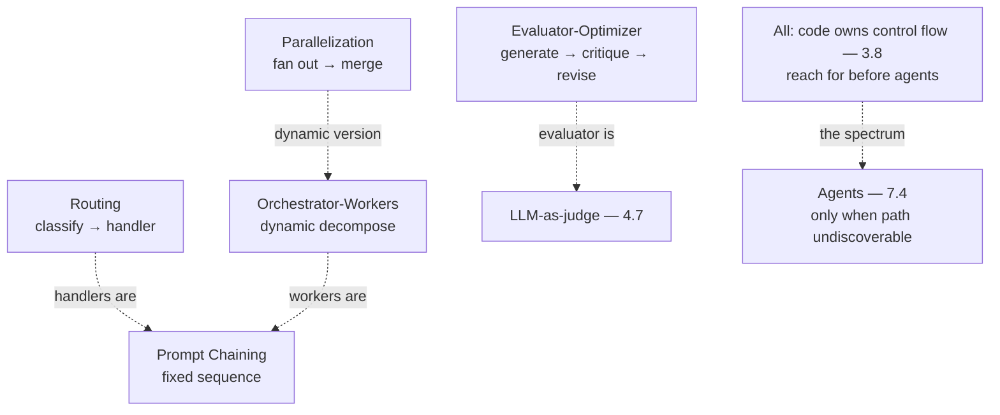

# Chapter 7.3 — Workflow Patterns

| | |
|---|---|
| **Part** | 7 — Enterprise AI Architecture Patterns |
| **Maturity level** | 4 — Architect |
| **Difficulty** | Advanced |
| **Estimated study time** | 3 hours (reading 90 min, exercise 90 min) |
| **Prerequisites** | [3.8 Agents: Concepts & Control Flow](../part-3-core-building-blocks-of-genai/chapter-08-agents-concepts.md); [4.6](../part-4-enterprise-genai-systems/chapter-06-orchestration-workflows.md) |

## Learning Objectives

After this chapter you will be able to:

1. Apply the workflow pattern family in pattern-language form: prompt chaining, routing, parallelization, orchestrator-workers, and evaluator-optimizer.
2. Select the workflow pattern matched to the task structure, using each pattern's context, forces, and consequences.
3. Compose workflow patterns into control-flow architectures, the fixed-control-flow alternative to agents (3.8).
4. Recognize the workflow patterns in the case studies, and prefer them to agents where the control flow is fixed (3.8's spectrum).

## Introduction

This chapter catalogs the workflow pattern family — the fixed-control-flow patterns (3.8's workflows, where the code owns the control flow) that 3.8 introduced and 4.6 orchestrated, in pattern-language form (7.1). These are the patterns to reach for *before* agents (3.8's start-with-the-simplest-control-flow), and this chapter is the reference for the workflow patterns that solve most enterprise GenAI problems without the agent's complexity.

The framing: **workflow patterns are the fixed-control-flow toolkit — reach for them before agents** — the patterns (chaining, routing, parallelization, orchestrator-workers, evaluator-optimizer) where the code owns the control flow (3.8), which solve most problems more simply, cheaply, and debuggably than agents (3.8's spectrum, the 90/10 shape), and this chapter is the reference for selecting and composing them.

## Business Motivation

The workflow patterns are the enterprise's most-used GenAI control-flow toolkit — the patterns that solve most enterprise GenAI problems (3.8's finding: most "agent" requirements are workflows). Selecting the workflow pattern (over the agent) matters: the workflow patterns are simpler, cheaper, and more debuggable than agents (3.8's spectrum — the code owns the control flow, the deterministic flow, the per-step evaluation — 3.8), so applying the workflow pattern where it fits (versus the agent-for-everything anti-pattern — 3.8/7.10) delivers the solution more reliably and economically. The business case is the simplicity-and-reliability one: the workflow patterns solve most enterprise GenAI problems (3.8's 90% — the fixed-control-flow tasks) more simply, cheaply, and reliably than agents (3.8's spectrum), and the workflow pattern family is the reference for the control-flow architecture — the toolkit that solves the majority of enterprise GenAI problems without the agent's cost and complexity (the reach-for-workflows-first discipline — 3.8).

## Theory — The Workflow Pattern Catalog

### Pattern: Prompt Chaining

- **Context** — a task that decomposes into a fixed sequence of steps (3.8).
- **Problem** — a complex task done poorly as one prompt (3.8's narrow-ask — one prompt doing five jobs does all five worse).
- **Forces** — decomposition (per-step quality, evaluability) vs. latency (the sequential steps — 3.8).
- **Solution** — a fixed sequence of steps, each step's typed output (3.4) feeding the next (3.8's chaining).
- **Structure** — step 1 → typed output → step 2 → ... → result (3.8, the typed joints — 3.4).
- **Consequences** — per-step quality and evaluability (3.8's component evals — 2.7); the latency (the sequential steps).
- **Known uses** — CS03 (meeting minutes: transcript → summary → action items), most extraction-then-generate pipelines.
- **Related** — Routing (the branching), the structured-output pattern (3.4, the typed joints).

### Pattern: Routing

- **Context** — inputs that cluster into kinds needing different treatment (3.8, 4.6).
- **Problem** — one handler for heterogeneous inputs handles each kind poorly (3.8).
- **Forces** — the routing accuracy vs. the routing cost (the classifier step — 3.8).
- **Solution** — a classifier step (cheap model, temperature 0 — 3.2) directs to specialized handlers (3.8/4.6).
- **Structure** — input → classify → route to handler A/B/C → result (3.8).
- **Consequences** — the right treatment per input kind (Bellhaven's tiered extraction — 1.4); the routing accuracy (the classifier's precision — 2.7).
- **Known uses** — Bellhaven's submission routing (1.4/2.1), CS09 (support triage by language/intent), model tiering (7.8).
- **Related** — Model Tiering (7.8, the cost-driven routing), Prompt Chaining (the handlers).

### Pattern: Parallelization

- **Context** — independent subtasks that can run concurrently, or a task benefiting from multiple runs (3.8, 2.7).
- **Problem** — the sequential processing of independent parts (the latency), or the variance of a single run (2.7).
- **Forces** — the latency/confidence benefit vs. the cost (the parallel calls — 3.8).
- **Solution** — fan out independent subtasks concurrently (sectioning), or run the same task multiple times for vote/merge (3.8, 2.7's variance).
- **Structure** — input → fan out → parallel subtasks → merge → result (3.8).
- **Consequences** — the latency reduction (independent parts) or the confidence (the vote — 2.7); the cost (the parallel calls).
- **Known uses** — CS24 (eDiscovery: parallel document classification), multi-document analysis (4.5's per-document fan-out).
- **Related** — Orchestrator-Workers (the dynamic parallelization), the evaluator-optimizer (the vote).

### Pattern: Orchestrator-Workers

- **Context** — a task whose subtasks are determined dynamically (not fixed in advance — 3.8, 4.5).
- **Problem** — the task requiring dynamic decomposition that a fixed chain can't handle (4.5).
- **Forces** — the dynamic decomposition (the flexibility) vs. the orchestrator's decomposition quality (4.5 — the orchestrator is the highest-leverage, highest-risk role).
- **Solution** — a model (or code) plans the subtasks dynamically, workers execute, code owns the dispatch and merge (4.5's orchestrator-workers, the bridge pattern — 3.8).
- **Structure** — orchestrator (decompose) → workers (execute, scoped briefs — 4.5) → merge (4.5).
- **Consequences** — dynamic decomposition without a free agent loop (3.8); the decomposition quality (prefer deterministic where the structure is known — 4.5).
- **Known uses** — Halvard & Roth's data-room review (4.5), CS16 (supplier document intelligence).
- **Related** — Parallelization (the static version), the multi-agent patterns (7.4, the agentic version).

### Pattern: Evaluator-Optimizer

- **Context** — a task where critique is reliably easier than generation (3.8, 2.7).
- **Problem** — the single-pass output that could be improved by critique-and-revise (3.8).
- **Forces** — the quality improvement vs. the cost (the extra critique-revise rounds — 3.8), the bounded loop (3.8's fixed exit).
- **Solution** — generate, critique against criteria, regenerate — a bounded loop with a fixed exit (score threshold or max rounds — 3.8, 2.7's judge inward).
- **Structure** — generate → evaluate → (regenerate | done) — the bounded loop (3.8).
- **Consequences** — the quality improvement (the critique-revise); the cost (the extra rounds — bounded).
- **Known uses** — Halvard & Roth's red-flag triage (3.8), CS48 (FP&A narrative with faithfulness critique).
- **Related** — the LLM-as-judge (4.7, the evaluator), the reflection pattern (7.4, the agentic version).

## Architecture Perspective

Readings. **The workflow patterns are the fixed-control-flow toolkit** — chaining (the fixed sequence), routing (the branching), parallelization (the concurrency), orchestrator-workers (the dynamic decomposition), evaluator-optimizer (the critique-revise) — all with the code owning the control flow (3.8), the patterns to reach for before agents (3.8's spectrum, the 90/10 shape). **The patterns compose** — a workflow architecture composes the patterns (a router in front of an orchestrator whose workers are chains, with an evaluator gate — 3.8's composition), the patterns building the control-flow architecture (7.1's combination). **And the workflow-vs-agent boundary is the spectrum** (3.8) — the workflow patterns (the fixed control flow) vs. the agents (the model-directed control flow — 7.4), with the workflow patterns preferred where the control flow is fixed (3.8's spectrum, the reach-for-workflows-first — the production shape is 90% workflow, 10% agent).

## Real-world Example

**Halvard & Roth** (the recurring law firm — 3.8, 4.5) built its due-diligence system as a workflow-pattern composition (3.8's 90/10 shape), and the composition is the workflow pattern family applied. The system was 90% workflow (3.8's finding): the clause extraction was routing (4.6 — route by document type) + prompt chaining (extract → validate → aggregate) + parallelization (4.5 — the per-document fan-out); the red-flag triage was evaluator-optimizer (3.8 — generate the flags, critique against the playbook, revise); and the synthesis was orchestrator-workers (4.5 — the dynamic decomposition). The agent (7.4) was the 10% (the multi-hop cross-reference investigation — 3.8/4.5). The workflow-pattern composition was the architecture: routing + chaining + parallelization + evaluator-optimizer (the 90% workflow) + a bounded agent for the hard 10% — the control-flow architecture as a composition of workflow patterns (3.8's composition), preferring the workflow patterns to agents where the control flow was fixed (3.8's spectrum — the persona-agents rejected, the workflow patterns preferred — 4.5). Yusuf's workflow-patterns note (echoing 4.5's 90/10): *"Our due-diligence system is 90% workflow patterns: routing (by document type), chaining (extract → validate → aggregate), parallelization (per-document fan-out), evaluator-optimizer (the red-flag critique-revise), orchestrator-workers (the synthesis). The agent is the 10% — the multi-hop investigation the path of which we couldn't write down. The workflow patterns are the toolkit I reach for first (3.8's spectrum) — simpler, cheaper, debuggable than agents. Most of the system is a composition of workflow patterns; the agent is the residue. That's the reach-for-workflows-first discipline — the patterns compose into the control-flow architecture, and the agent is only where the path is undiscoverable."*

## Hands-on Exercise

**Compose workflow patterns.** ~90 minutes. For a GenAI task (real or a case study).

1. **Pattern selection (30 min).** For a multi-step GenAI task, decompose it and select the workflow patterns (chaining for the fixed sequence, routing for the branching, parallelization for the concurrency, orchestrator-workers for the dynamic decomposition, evaluator-optimizer for the critique-revise). Justify each with the pattern's context.
2. **The pattern-language form (20 min).** For one selected pattern, write its full pattern-language form for your task.
3. **The composition (25 min).** Compose the workflow patterns into the control-flow architecture (the patterns composed — 3.8's composition, 7.1). Show the workflow-vs-agent boundary (which parts are workflow, which — if any — need an agent — 3.8's spectrum).
4. **The reach-for-workflows-first check (15 min).** For any part you'd consider an agent, verify it genuinely needs one (3.8's autonomy grid — the path undiscoverable), or use a workflow pattern instead.

**Acceptance criteria:**
- [ ] Workflow patterns selected matched to the task structure, with context
- [ ] One pattern in the full pattern-language form
- [ ] The control-flow architecture as a workflow-pattern composition (3.8's composition), with the workflow-vs-agent boundary
- [ ] The reach-for-workflows-first check applied (agents only where the path is undiscoverable — 3.8)

## Enterprise Considerations

The workflow patterns are the enterprise's most-used control-flow reference. **They're the default control-flow reference** (3.8/7.1): the workflow patterns are the enterprise's default for GenAI control flow (3.8's reach-for-workflows-first — most enterprise GenAI problems are workflows), the reference for the control-flow architecture (7.1). **They connect to the orchestration** (4.6): the workflow patterns run on the orchestration layer (4.6 — the durable execution, the queues, the human steps — the workflow patterns orchestrated), so the workflow patterns connect to the orchestration (4.6's machinery). **They're simpler to govern** (6.9): the workflow patterns (the fixed control flow, the per-step evaluation) are simpler to govern than agents (the deterministic flow, the evaluability — 3.8), so the governance (6.9) prefers the workflow patterns where they fit (the simpler-to-govern control flow). **And the agent-for-everything anti-pattern** (7.10) is the workflow patterns' counterpoint: the anti-pattern (reaching for agents where a workflow pattern fits — 3.8/7.10) is what the workflow patterns' reach-for-workflows-first prevents (the workflow patterns as the simpler alternative to the agent-for-everything anti-pattern).

## Trade-offs

| Decision | Option A | Option B | Choose A when… | Choose B when… |
|----------|----------|----------|----------------|----------------|
| Control flow | Workflow patterns (code owns) | Agents (model owns — 7.4) | Default — the path is fixed/discoverable (3.8's spectrum) | The path is genuinely undiscoverable in advance (3.8's autonomy grid) |
| Decomposition | Prompt chaining (fixed) | Orchestrator-workers (dynamic) | The steps are fixed in advance | The subtasks are determined dynamically (4.5) |
| Decomposition author | Deterministic (code) | Model (orchestrator) | The task structure is known (4.5 — code decomposes known structures better) | Genuinely novel structures (4.5) |
| Quality improvement | Evaluator-optimizer (bounded) | Single pass | Critique is reliably easier than generation (3.8), quality matters | Simple tasks where the single pass suffices |

## Common Mistakes

1. **Agents where a workflow pattern fits** — the agent-for-everything anti-pattern (3.8/7.10 — reaching for agents where a workflow pattern is simpler); reach for workflows first (3.8's spectrum).
2. **One prompt for a multi-step task** — the un-decomposed task (3.8's narrow-ask — one prompt doing five jobs); prompt chaining (the decomposition).
3. **One handler for heterogeneous inputs** — the un-routed heterogeneous inputs (3.8); routing (the classify-and-route).
4. **Model decomposition of known structures** — the orchestrator deriving a known plan (4.5 — the data-room index is the plan); deterministic decomposition of known structures (4.5).
5. **The unbounded evaluator-optimizer** — the critique-revise loop without a fixed exit (3.8's bounded loop); the bounded loop (the score threshold or max rounds).
6. **The un-composed patterns** — the workflow patterns applied without composing them (the un-designed control-flow architecture — 7.1); the composition (the patterns composed — 3.8).
7. **Ignoring the per-step evaluation** — the workflow patterns without the per-step evals (3.8's component evals — 2.7); the per-step evaluation (the workflow patterns' evaluability advantage).

## Best Practices

1. **Reach for workflow patterns before agents** — the fixed-control-flow patterns (3.8's spectrum — most enterprise GenAI problems are workflows), agents only where the path is undiscoverable (3.8's autonomy grid).
2. **Decompose with prompt chaining** — the fixed sequence with typed joints (3.4/3.8), per-step quality and evaluability (2.7).
3. **Route heterogeneous inputs** — the classify-and-route (3.8/4.6), the right treatment per input kind.
4. **Prefer deterministic decomposition** — code decomposes known structures better than the orchestrator (4.5); model decomposition for genuinely novel structures.
5. **Bound the evaluator-optimizer** — the critique-revise with a fixed exit (3.8's bounded loop).
6. **Compose the patterns deliberately** — the control-flow architecture as a workflow-pattern composition (3.8's composition, 7.1's design).
7. **Evaluate per step** — the workflow patterns' evaluability advantage (3.8's component evals — 2.7), the per-step gates.

## Architecture Checklist

For applying the workflow patterns:

- [ ] The control flow uses workflow patterns where the path is fixed/discoverable (3.8's spectrum); agents only where undiscoverable
- [ ] Multi-step tasks decomposed with prompt chaining (typed joints — 3.4)
- [ ] Heterogeneous inputs routed (classify-and-route — 3.8/4.6)
- [ ] Decomposition deterministic where the structure is known (4.5); model-driven for novel structures
- [ ] Evaluator-optimizer bounded (fixed exit — 3.8)
- [ ] The patterns composed into the control-flow architecture (7.1's design)
- [ ] Per-step evaluation (the workflow patterns' evaluability — 3.8's component evals — 2.7)

## Interview Questions

1. *"Walk me through the workflow patterns and when you'd use each."* — Strong answers give the family (prompt chaining — the fixed sequence, routing — the branching, parallelization — the concurrency, orchestrator-workers — the dynamic decomposition, evaluator-optimizer — the critique-revise), each with its context, and the reach-for-workflows-first discipline (3.8's spectrum — most problems are workflows).
2. *"How do you decide between a workflow and an agent?"* — Strong answers give 3.8's spectrum and autonomy grid: workflow patterns (code owns the control flow) where the path is fixed/discoverable (most enterprise problems — the 90%), agents (model owns the control flow) only where the path is genuinely undiscoverable in advance (the 10%) — the reach-for-workflows-first.
3. *"How do you compose workflow patterns into an architecture?"* — Strong answers give the composition (a router in front of an orchestrator whose workers are chains, with an evaluator gate — 3.8's composition, 7.1's design), the patterns composed deliberately (the forces balanced), Halvard & Roth's 90%-workflow due-diligence.
4. *"When is orchestrator-workers better than prompt chaining?"* — Strong answers give the context distinction (orchestrator-workers for dynamic decomposition where the subtasks are determined at runtime — 4.5, prompt chaining for the fixed sequence known in advance), and the deterministic-decomposition preference (code decomposes known structures better — 4.5).

## Further Reading

- 3.8 Agents: Concepts & Control Flow (the workflow-vs-agent spectrum, the patterns) and 4.6 Orchestration (the durable execution) — the chapters this pattern family formalizes.
- Anthropic, *Building Effective Agents* (re-linked from 3.8) — the workflow patterns' source; the chaining, routing, parallelization, orchestrator-workers, evaluator-optimizer patterns.
- The [agent design checklist](../../checklists/agent-design-checklist.md) — the workflow-vs-agent decision the patterns inform.
- The [case studies](../../case-studies/README.md) — the workflow patterns' known uses.

## Summary

- The **workflow pattern family** is the fixed-control-flow toolkit — prompt chaining (the fixed sequence), routing (the branching), parallelization (the concurrency), orchestrator-workers (the dynamic decomposition), evaluator-optimizer (the critique-revise) — all with the code owning the control flow (3.8).
- **Reach for workflow patterns before agents** (3.8's spectrum, the 90/10 shape) — most enterprise GenAI problems are workflows, solved more simply, cheaply, and debuggably than agents; agents only where the path is undiscoverable (3.8's autonomy grid).
- The patterns **compose into the control-flow architecture** — a router in front of an orchestrator whose workers are chains, with an evaluator gate (3.8's composition, 7.1's design) — Halvard & Roth's 90%-workflow due-diligence.
- **Deterministic decomposition** is preferred where the structure is known (code decomposes known structures better than the orchestrator — 4.5), and the **evaluator-optimizer is bounded** (a fixed exit — 3.8).
- The workflow patterns are the enterprise's **default control-flow reference** (3.8's reach-for-workflows-first), the counterpoint to the agent-for-everything anti-pattern (7.10), simpler to govern (6.9). The model-directed-control-flow patterns are next: **agentic patterns** (7.4).

---

**Previous:** [Chapter 7.2 — RAG Patterns](chapter-02-rag-patterns.md) · **Next:** [Chapter 7.4 — Agentic Patterns](chapter-04-agentic-patterns.md) · **Related:** [3.8 Agents: Concepts & Control Flow](../part-3-core-building-blocks-of-genai/chapter-08-agents-concepts.md), [4.6 Orchestration & Workflow Design](../part-4-enterprise-genai-systems/chapter-06-orchestration-workflows.md), [7.4 Agentic Patterns](chapter-04-agentic-patterns.md)
