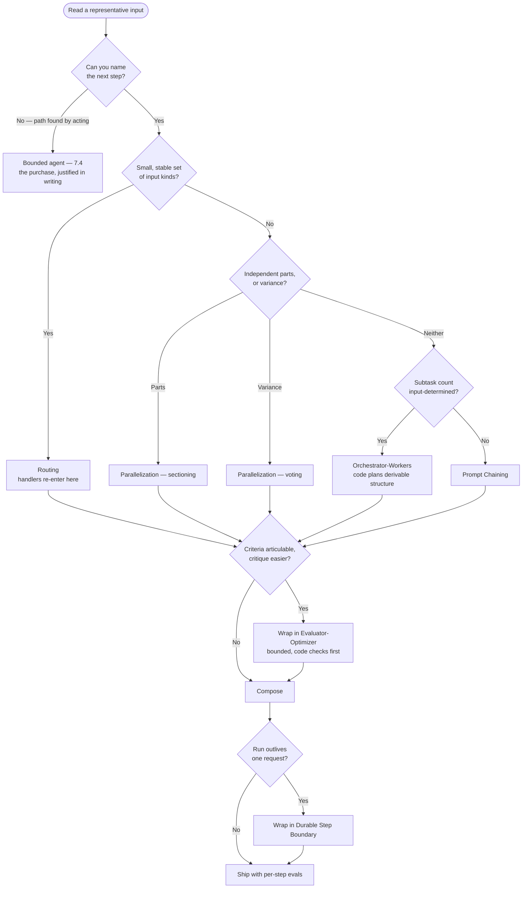

# Chapter 7.3 — Workflow Patterns

| | |
|---|---|
| **Part** | 7 — Enterprise AI Architecture Patterns |
| **Maturity level** | 4 — Architect |
| **Difficulty** | Advanced |
| **Estimated study time** | 2 hours (reading 40 min, exercise 75 min) |
| **Prerequisites** | [3.8 Agents: Concepts & Control Flow](../part-3-core-building-blocks-of-genai/chapter-08-agents-concepts.md); [4.6](../part-4-enterprise-genai-systems/chapter-06-orchestration-workflows.md) |

## Learning Objectives

After this chapter you will be able to:

1. Apply the workflow pattern family in pattern-language form: prompt chaining, routing, parallelization, orchestrator-workers, evaluator-optimizer, and the durable step boundary that makes all five production-grade.
2. Price each pattern's consequences — latency, token spend, new failure classes, maintenance surface — not only its benefits.
3. Walk a decision path from task shape to pattern, and name the input variability that would justify buying model-directed control flow instead.
4. Specify a workflow's operational layer: idempotency, retries matched to LLM failure modes, checkpointing, partial-failure handling, per-step observability.

## Introduction

This chapter is the pattern-language reference ([7.1](chapter-01-pattern-language.md)) for the control-flow toolkit where *your code* decides what happens next — the workflow end of the autonomy spectrum ([3.8](../part-3-core-building-blocks-of-genai/chapter-08-agents-concepts.md)), running on [4.6](../part-4-enterprise-genai-systems/chapter-06-orchestration-workflows.md)'s durable substrate.

State the organizing argument once, because the rest of the curriculum leans on it. **Fixed control flow in code is the default, and every increment of model-directed nondeterminism must be bought — the only currency accepted is genuine variability in the task's inputs.** The test is mechanical: after reading a representative input, can you name the next step? If yes, code names it — not the model, not a planner, not "a lightweight agent for flexibility." A branch the model chooses at runtime is one you cannot enumerate at design time, so it is one you cannot test, cannot cost-bound, and cannot localize a failure to. That is the price. Genuine input variability — subtask count and shape differ per input, or the path is discovered by acting — is what pays it. Requirements you haven't finished writing are not variability; they are a specification you owe ([Glossary](../../GLOSSARY.md): *workflow* vs. *agent*).

## Business Motivation

Four numbers make the case in a design review. **Testability:** a five-step chain has five places to attach an eval set and one execution order, while a five-tool free loop has a trajectory space nobody enumerates — evaluation degrades to end-to-end suites reporting *that* it failed, never *where* ([4.7](../part-4-enterprise-genai-systems/chapter-07-evaluation-systems.md)). **Cost predictability:** a workflow's bill is a known multiple of the input (N steps, K samples, W workers); an agent's is bounded only by its iteration budget, so you provision and often pay the ceiling rather than the mean ([4.11](../part-4-enterprise-genai-systems/chapter-11-cost-engineering.md)). **Time to diagnosis:** fixed control flow plus per-step traces turns "it's slow" and "it's wrong" into a query against a step name; the alternative is trajectory replay. **Change safety:** editing one handler behind a router regresses one input kind; editing the system prompt of an agent that owns its own routing regresses everything, silently.

The honest case *for* buying nondeterminism is narrow and real: work whose decomposition depends on what the input turns out to contain, and investigations whose next question depends on the last answer. Buy it there — and nowhere else, which is [7.10](chapter-10-anti-patterns.md)'s agent-for-everything stated as a positive.

## Theory — The Workflow Pattern Catalog

### Pattern: Prompt Chaining

- **Context** — steps known and ordered at design time: extract, normalize, judge, draft.
- **Problem** — one prompt doing four jobs does all four worse, and leaves nowhere to attach a check or an eval.
- **Forces** — per-step accuracy vs. *additive* latency (tails sum, so a chain fine at p50 misses its SLO at p95); granularity vs. context loss at each typed joint; and error compounding — 95% per step across five steps runs clean 77% of the time.
- **Solution** — a fixed sequence joined by typed payloads ([3.4](../part-3-core-building-blocks-of-genai/chapter-04-structured-outputs.md)); deterministic code between model steps wherever code can do the work; a programmatic gate after any step whose failure is cheap to detect and expensive to propagate.
- **Structure** — step → payload → gate → step → result; one eval set per step plus an end-to-end suite.
- **Consequences** — buys per-step quality and localization. Costs N calls and N serial round trips, so latency is the real bill; costs N−1 schema contracts to version; and forces per-step bars derived backwards from the target, which makes chains past five model steps a design smell.
- **Known uses** — the first workflow documented in Anthropic's public *Building Effective Agents* engineering write-up, gate included; extract → validate → normalize → load pipelines are standard enterprise practice, predating LLMs as ETL. Curriculum's own fictional instance: [P03](../../projects/p03-meeting-intelligence-pipeline/README.md).
- **Related** — Routing (its handlers are chains); Durable Step Boundary; structured outputs.

### Pattern: Routing

- **Context** — heterogeneous inputs clustering into a small, stable, enumerable set of kinds, each needing different instructions or models.
- **Problem** — one handler carrying every kind's instructions serves each worse than a specialist would, and edits for one kind silently regress another.
- **Forces** — routing accuracy vs. handler specialization, which pull against each other since specialization makes each misroute cost more; classifier cost vs. what it unlocks — ahead of price-tiered handlers it pays for itself, ahead of uniformly priced ones it is added latency on every request; and a closed label set, which makes routing testable, vs. inputs that fit no label.
- **Solution** — exact rules first (file type, source system, language, tier), since a rule right every time beats a classifier right 97% of the time; then a cheap temperature-0 classifier over a closed label set including `unknown`; low confidence goes to the general handler or a human; the confusion matrix is a maintained eval artifact.
- **Structure** — input → rules → classifier → handler A/B/C/general; per-route volume, confidence distribution, and handler-reported out-of-scope rate monitored.
- **Consequences** — buys per-kind quality and independently editable prompts. Costs an extra call on every request's critical path; costs permanent taxonomy maintenance, since the label set drifts and each change re-labels the eval set; and the confident misroute is *silent* unless handlers report out-of-scope inputs.
- **Known uses** — routing is a core workflow in Anthropic's *Building Effective Agents*; intent classification ahead of specialized handlers is decades-old contact-centre and IVR practice; cost-driven model routing is widespread industry practice, catalogued here as Model Tiering ([7.8](chapter-08-cost-performance-patterns.md)). Curriculum instance: [CS09](../../case-studies/cs09-retail-bank-support-assistant.md).
- **Related** — Model Tiering; Confidence Routing ([7.5](chapter-05-human-in-the-loop-patterns.md)); Prompt Chaining.

### Pattern: Parallelization

- **Context** — two situations, one shape. **Sectioning:** independent subtasks over disjoint parts of an input. **Voting:** the same task run K times to cut single-sample variance.
- **Problem** — sequential processing makes latency scale with input size when parts don't need each other; and one sample of a high-variance judgment hides its own uncertainty.
- **Forces** — latency vs. token spend and rate limits, since fan-out converts a latency problem into a concurrency problem that lands on your quota as a retry storm; genuine vs. assumed independence, because sections quietly needing each other's context merge cleanly and read inconsistently; and voting's confidence vs. correlated error, since K samples of one model share its blind spots.
- **Solution** — sectioning: partition, fan out under a semaphore sized to rate-limit headroom rather than to the input, merge in code where the merge is mechanical. Voting: choose aggregation from the objective — union when screening for recall, majority when deciding an answer — and log inter-run disagreement as a drift signal.
- **Structure** — partition → bounded fan-out → per-part results carrying status → merge; gaps declared, never dropped.
- **Consequences** — buys latency near the slowest section, or measurable confidence. Costs spend linear in sections or K, so a 20-way fan-out is a 20× bill wearing a latency costume; makes your p99 the slowest shard's p99; and voting's gain flattens after a few samples while cost keeps climbing.
- **Known uses** — sectioning and voting are documented as parallelization's two variants in Anthropic's *Building Effective Agents*; map-reduce summarization of long documents is standard practice, shipped as a named chain type in mainstream LLM frameworks; self-consistency is published and widely replicated (Wang et al., 2022). Curriculum instance: [CS24](../../case-studies/cs24-ediscovery-triage.md)'s per-document fan-out.
- **Related** — Orchestrator-Workers (input-determined width); Evaluator-Optimizer; Batch Lanes ([7.8](chapter-08-cost-performance-patterns.md)).

### Pattern: Orchestrator-Workers

- **Context** — a task whose subtask *count and shape* depend on the input, but become determinable once the input has been read.
- **Problem** — a fixed chain cannot express "however many subtasks this input needs"; hard-coding the maximum wastes calls, hard-coding the minimum truncates.
- **Forces** — flexibility vs. decomposition quality, asymmetric because an omitted subtask is unrecoverable downstream and no worker's excellence replaces a missing worker; model-authored vs. code-authored plans, since derivable structure — an index, a schema, a clause list — is planned better and cheaper by code ([4.5](../part-4-enterprise-genai-systems/chapter-05-multi-agent-systems.md)); isolation vs. shared context; and fan-out width, a cost multiplier disguised as a tuning parameter.
- **Solution** — treat the plan as data: typed scoped briefs carrying objective, boundary, output schema, and budget. Code authors the plan wherever structure is derivable, a model only where it is not; code owns dispatch, the hard width cap, partial-failure policy, and merge; the plan is logged and evaluated as its own artifact.
- **Structure** — input → plan (typed briefs, width-capped) → isolated workers → typed results with status → synthesis; spawn-graph attribution on every artifact.
- **Consequences** — buys input-determined breadth without conceding the loop. Costs a planning call plus a worker count the *input* chose, which makes the cap load-bearing; adds two failure classes a chain lacks — the missing subtask, and wrong synthesis over correct findings; and leaves a wrong claim untraceable without brief-to-finding attribution.
- **Known uses** — orchestrator-workers is documented in Anthropic's *Building Effective Agents*, and Anthropic's public write-up on its multi-agent research system records what production needs: scoped self-contained briefs, summarize-before-merge. Dynamically-keyed map-reduce is ordinary data engineering. Curriculum instance: [4.5](../part-4-enterprise-genai-systems/chapter-05-multi-agent-systems.md)'s data-room review, where the index *is* the plan.
- **Related** — Parallelization (prefer it whenever the width is fixed); the bounded agent loop ([7.4](chapter-04-agentic-patterns.md)); Durable Step Boundary.

### Pattern: Evaluator-Optimizer

- **Context** — tasks with articulable criteria where critique is reliably easier than generation: a playbook, a source of truth, or a defect visible on inspection.
- **Problem** — a single pass that a competent reviewer would improve in one round, at a volume and latency where no reviewer is available.
- **Forces** — quality gain vs. round cost, two calls per round with gain decaying sharply after the first; evaluator independence vs. correlation, the force that decides whether this works at all, since a model critiquing itself reliably catches format and completeness violations and unreliably catches its own factual errors; improvement vs. termination, because a loop running until the judge is satisfied optimizes the judge; and rubric precision, since a vague rubric oscillates.
- **Solution** — generate, evaluate against explicit written criteria into a typed verdict (pass, or specific defects), regenerate with the defects as input; hard exit at two or three rounds. Prefer *programmatic* evaluators wherever the criterion is checkable in code — schema validity, figures matching the source table, citations resolving — and gate entry on a cheap first-pass check so good outputs skip the loop.
- **Structure** — generate → programmatic checks → model critique → pass ∨ defects → regenerate → bounded exit; round-count distribution monitored.
- **Consequences** — buys real quality on criteria-shaped work. Costs two to three times the calls and latency on every request that enters unconditionally, which is the argument for the entry gate; yields a pass verdict evidencing *criteria satisfaction*, not correctness; and can fail to converge, burning maximum rounds on every request.
- **Known uses** — evaluator-optimizer is documented in Anthropic's *Building Effective Agents*; iterative refinement with self-generated feedback is published and replicated (Self-Refine, Madaan et al., 2023), with the caveat that gains concentrate early; validate-and-re-ask loops around structured output are standard practice in production LLM libraries. Curriculum instance: [CS48](../../case-studies/cs48-fpa-narrative-reporting.md), where the evaluator is arithmetic.
- **Related** — LLM-as-judge ([4.7](../part-4-enterprise-genai-systems/chapter-07-evaluation-systems.md)); Reflection ([7.4](chapter-04-agentic-patterns.md), the unbounded agentic cousin); Approval Gate ([7.5](chapter-05-human-in-the-loop-patterns.md)).

### Pattern: Durable Step Boundary

Added here as the operational pattern that makes the other five production-grade; it composes with all of them rather than competing.

- **Context** — any workflow whose run outlives a single request: multi-minute chains, fan-outs over thousands of items, anything with a human step.
- **Problem** — in-memory state dies with the process, so a deploy or brownout destroys work already paid for; and naive retry re-executes completed model calls, paying twice and possibly returning a *different* answer downstream steps already consumed.
- **Forces** — durability machinery vs. simplicity, since a table plus a worker loop often suffices while a durable-execution engine buys guarantees and charges a determinism discipline teams underestimate; at-least-once delivery, what queues provide, vs. exactly-once effects, what business steps require; retry aggression vs. cost, because blind backoff over a policy refusal is ten bills for one non-answer; and trace granularity vs. storage and data exposure.
- **Solution** — every step boundary is a transactional checkpoint of a typed payload; completed model outputs are recorded once and *reused* on resume, never re-rolled; side effects carry idempotency keys; retries match the failure class — transport and rate-limit errors back off with jitter, validation failures re-ask on a separate budget, refusals route to a fallback or human queue, budget exhaustion is a typed partial exit; partial failure merges what succeeded and declares gaps.
- **Structure** — step → typed output → checkpoint → next step; resume from the last checkpoint; every step emits step name, prompt and model version, latency, tokens, verdict, retry class ([4.10](../part-4-enterprise-genai-systems/chapter-10-observability.md)).
- **Consequences** — buys resumability, honest cost accounting, and one-query localization. Costs a checkpoint store you must classify, retention-govern, and reach with deletion requests; costs the determinism discipline under a replay engine, whose violation makes a workflow diverge from its own history; and costs real storage for per-step traces.
- **Known uses** — durable-execution engines (Temporal, AWS Step Functions) are the standard enterprise answer for long-running, human-in-the-loop orchestration; idempotency keys on side-effecting API calls are long-established practice, publicly documented by payment APIs; at-least-once delivery with consumer-side deduplication is the documented contract of mainstream managed queue services. Curriculum instance: [4.6](../part-4-enterprise-genai-systems/chapter-06-orchestration-workflows.md)'s Kestrel claims rebuild.
- **Related** — all five patterns above; Checkpoint-and-Resume ([7.4](chapter-04-agentic-patterns.md)); the orchestration substrate itself.

## Architecture Perspective

Three readings. **The agent box is deliberately hard to reach** — the first question is answerable for most enterprise tasks, and the right branch demands proof that the *input*, not the specification, is what you cannot enumerate. **The patterns compose by nesting, not sequencing** — a router whose handlers are chains, one of which fans out, with an evaluator-optimizer around the output-bearing step and a durable boundary around everything. **And the operational layer is where the workflow argument becomes true** — a chain without checkpoints, per-step traces, matched retries, and declared partial results is not more debuggable than an agent, only cheaper.

## Real-world Example

**Halvard & Roth** (the curriculum's recurring fictional law firm — [CS23](../../case-studies/cs23-contract-review-platform.md), [CS24](../../case-studies/cs24-ediscovery-triage.md)) built due diligence as a composition of these patterns, and the reasoning at each boundary is the point. Intake routes on deterministic rules first, because file type and matter metadata are exact; only unmatched documents reach a classifier whose `unknown` bucket lands in a paralegal queue. Clause extraction is a chain — extract to schema, validate programmatically, resolve party references in code, aggregate — and two of those four steps are not model calls, a reduction made after the first version paid a model to perform a lookup. Per-document work fans out under a concurrency cap sized to rate-limit headroom; when a provider degraded mid-run, the partial-failure policy merged completed documents and listed the gaps rather than failing the review, and durable checkpoints meant the retry re-ran twelve documents rather than the data room. Red-flag triage is evaluator-optimizer bound to the firm's written playbook, capped at two rounds and entered only when a cheap completeness check fails; synthesis is orchestrator-workers where the data-room index authors the plan, because the index already *is* the decomposition.

The agentic residue is small and named: multi-hop cross-reference investigation, where the next document depends on what the last one said — bounded and traced accordingly ([7.4](chapter-04-agentic-patterns.md)). Yusuf's design note records the discipline: *"Every step where we let the model choose the next step, we had to write down what it bought us. Most of the time we couldn't, and that step became code."*

## Hands-on Exercise

**Compose workflow patterns and price them.** ~75 minutes. Use a real task or a case study.

1. **Walk the decision path (20 min).** Take one representative input and walk the Architecture Perspective path, recording your answer and its evidence at each question. Output: a pattern composition, plus the one place (if any) you reached the agent box, with the input variability that justified it named.
2. **Price one pattern (20 min).** For the pattern carrying the most traffic, compute calls per request, serial round trips, expected end-to-end accuracy from your per-step assumptions (multiply them), and the cost multiple over a single-call baseline. State which number would kill the design if it doubled.
3. **Full pattern form (15 min).** Write one selected pattern in complete pattern-language form for your task, Forces naming competing pressures in *your* system and Consequences stating what it costs.
4. **Specify the operational layer (20 min).** Write the checkpoint boundaries; which steps are side-effecting and how they are keyed; the retry policy per failure class (transport / validation / refusal / exhaustion); the partial-failure policy for any fan-out; and the per-step telemetry fields.

**Acceptance criteria:**
- [ ] Decision-path walk recorded with an answer and its evidence at each question
- [ ] Agent usage absent, or justified by named input variability rather than requirement uncertainty
- [ ] Four numbers computed for the highest-traffic pattern, with the breaking one identified
- [ ] One pattern in full pattern-language form, Forces naming real competing pressures
- [ ] Operational layer specified: checkpoints, idempotency keys, four retry classes, partial-failure policy, telemetry fields

## Enterprise Considerations

Workflows are cheaper to govern for a specific reason: fixed control flow is *auditable as a design artifact*. A reviewer reads the step list, the gates, and the eval sets and knows what the system will do — the evidence a review board wants ([6.9](../part-6-enterprise-architecture/chapter-09-architecture-governance.md)), and what an agent supplies only behaviourally, after the fact. Three realities shape delivery. The workflow layer usually **embeds in existing process machinery** rather than replacing it, so the architecture must name which engine is system of record for which state — two engines both believing they own a case is a scheduled reconciliation incident. **Per-step observability is a data-classification event:** traces hold the payloads the steps processed, so the trace store inherits the source data's classification, retention schedule, and deletion obligations. And **step boundaries are where cost attribution becomes possible** — chargeback, per-tenant unit economics, and "which step got expensive after the prompt change" are answered from per-step token records or not at all.

## Trade-offs

| Decision | Option A | Option B | Choose A when… | Choose B when… |
|----------|----------|----------|----------------|----------------|
| Control flow | Workflow patterns (code owns) | Bounded agent ([7.4](chapter-04-agentic-patterns.md)) | Default — you can name the next step after reading an input | The path is discovered by acting, and the input variability proving it is named |
| Step implementation | Model call | Deterministic code | The step needs judgment or ambiguity tolerance | The step is a lookup, parse, calculation, or format |
| Plan authorship | Code derives the plan | Model derives the plan | The structure exists (index, schema, checklist) — the common case | Genuinely novel structures, with decomposition evals to prove it |
| Evaluator | Programmatic check | Model critique | The criterion is checkable in code — always prefer this | The criterion is qualitative; accept correlated blind spots, bound the rounds |
| Durability | Durable-execution engine | Queue plus state table | Long runs, human steps, audit weight; the team can absorb the determinism discipline | Short flows, existing queue expertise, maximum control |

## Common Mistakes

1. **Buying nondeterminism with requirement uncertainty** — "we'll use an agent in case requirements change" converts a specification problem into a testing, cost, and debugging problem at once.
2. **Setting per-step targets from the end-to-end target** — five steps at 95% is 77% end to end; derive the bar backwards, then add gates or remove model steps when the arithmetic won't close.
3. **Modelling steps that are code** — paying tokens, latency, and variance for a lookup, a sum, or a date format.
4. **Routing without an `unknown` label** — a classifier forced to choose produces confident misroutes, silent unless handlers report out-of-scope inputs.
5. **Fan-out sized to the input** — concurrency set by document count rather than rate-limit headroom, turning a latency optimization into a retry storm.
6. **Silent partial failure** — a merge that drops failed sections without declaring them; the gap list belongs in the result schema.
7. **Self-critique treated as verification** — a pass verdict evidences criteria satisfaction, not correctness; the evaluator shares the generator's blind spots.
8. **Re-rolling completed model steps on resume, and one retry policy for every failure** — paying twice for a different answer downstream already consumed, and retrying a policy refusal ten times.

## Best Practices

1. **Let code name the next step until an input proves it cannot** — and write down what each model-directed branch buys, when you add it.
2. **Un-model every step you can** — deterministic transforms between model steps are the cheapest quality and latency win available.
3. **Rules before classifiers; programmatic checks before model evaluators** — exactness is free where it exists.
4. **Gate the expensive loops** — enter evaluator-optimizer only when a cheap check fails, so good outputs skip the multiplier.
5. **Cap fan-out width; size concurrency to rate-limit headroom** — width is a cost dial, not a tuning parameter.
6. **Declare partial results** — merged output carries a gap list; the alternative is a confident lie about completeness.
7. **Checkpoint typed payloads, record model outputs once, key every side effect, match retries to failure class** — and watch round counts and disagreement rates, where the non-converging loop and the slow shard announce themselves first.

## Architecture Checklist

For applying the workflow patterns:

- [ ] Each model-directed branch justified in writing by named input variability; the rest is code
- [ ] Per-step accuracy targets derived backwards from the end-to-end target; compounding computed
- [ ] Lookups, parses, and calculations implemented as code, not prompts
- [ ] Routers use exact rules first, a closed label set with `unknown`, and a maintained confusion matrix
- [ ] Fan-out concurrency capped to rate-limit headroom; width hard-capped where input-determined
- [ ] Partial-failure policy declared in the output schema for every fan-out and merge
- [ ] Evaluator-optimizer bounded and entry-gated, programmatic checks before model critique
- [ ] Orchestrator plans authored by code wherever structure is derivable; the plan logged and evaluated
- [ ] Checkpoints at every step boundary; model outputs reused on resume; side effects keyed
- [ ] Retry policy per failure class (transport / validation / refusal / exhaustion), with jitter and budgets
- [ ] Per-step telemetry emitted and the trace store classified; per-step eval sets plus one end-to-end suite

## Interview Questions

1. *"How do you decide between a workflow and an agent?"* — Strong answers give the purchase test: after reading a representative input, can you name the next step? If yes, code names it. They price the purchase (testability, cost predictability, diagnosis time, change safety) and insist the justification be *input* variability.
2. *"Your five-step chain scores 95% on every step's eval and users call it unreliable."* — Strong answers reach compounding immediately (0.95⁵ ≈ 0.77), then give remedies: fewer model steps, programmatic gates, per-step targets derived from the end-to-end goal — and note the missing end-to-end suite if this was a surprise.
3. *"Walk me through making a fan-out production-grade."* — Strong answers cover concurrency sized to rate-limit headroom, per-shard status in the result schema, declared gaps, checkpointing so a retry re-runs shards rather than the job, the tail owned by the slowest shard, and retry-storm damping.
4. *"When does evaluator-optimizer not work?"* — Strong answers name the correlation problem (a model critiquing itself catches format failures far more reliably than factual ones), non-convergent rubrics, the cost multiple on requests already fine, and the preference for programmatic evaluators.

## Further Reading

- Anthropic, *Building Effective Agents* (anthropic.com/engineering) — the public write-up the five core patterns follow, including the between-step gate and the sectioning/voting distinction.
- Anthropic's engineering write-up on its multi-agent research system — the production disciplines orchestrator-workers needs: scoped briefs, summarize-before-merge, partial-failure handling.
- Temporal's durable-execution documentation and the AWS Step Functions service documentation — two mainstream articulations of durable orchestration; read the determinism constraints even if you build on queues.
- Wang et al., *Self-Consistency Improves Chain of Thought Reasoning* (2022) and Madaan et al., *Self-Refine* (2023) — the published bases for the voting and critique-revise variants.
- [3.8](../part-3-core-building-blocks-of-genai/chapter-08-agents-concepts.md) and [4.6](../part-4-enterprise-genai-systems/chapter-06-orchestration-workflows.md) — the chapters this family formalizes; the [agent design checklist](../../checklists/agent-design-checklist.md) is the review form.

## Summary

- **Fixed control flow in code is the default.** Every increment of model-directed nondeterminism is a purchase, and only genuine input variability is legal tender — requirement uncertainty is a specification you owe.
- The family is six patterns: **Prompt Chaining** (additive latency, multiplicative error), **Routing** (closed label set, silent-misroute risk, a call on every request), **Parallelization** (sectioning and voting, linear cost, tail owned by the slowest shard), **Orchestrator-Workers** (input-determined width, hard-capped, code planning derivable structure), **Evaluator-Optimizer** (bounded, entry-gated, programmatic checks first), and **Durable Step Boundary** (checkpoints, idempotency, matched retries, declared partial failure, per-step traces).
- Each pattern's consequences are **priced in latency, tokens, failure classes, and maintenance surface** — the benefit alone never justifies a pattern.
- The **operational layer is what makes the workflow argument true**: without per-step evals and traces, matched retries, and declared partial results, a chain is merely a cheaper opacity.
- The decision path runs from task shape to pattern and makes the agent box **hard to reach on purpose**. The patterns for when you legitimately reach it are next: **agentic patterns** ([7.4](chapter-04-agentic-patterns.md)).

---

**Previous:** [Chapter 7.2 — RAG Patterns](chapter-02-rag-patterns.md) · **Next:** [Chapter 7.4 — Agentic Patterns](chapter-04-agentic-patterns.md) · **Related:** [3.8 Agents: Concepts & Control Flow](../part-3-core-building-blocks-of-genai/chapter-08-agents-concepts.md), [4.6 Orchestration & Workflow Design](../part-4-enterprise-genai-systems/chapter-06-orchestration-workflows.md), [7.4 Agentic Patterns](chapter-04-agentic-patterns.md)
