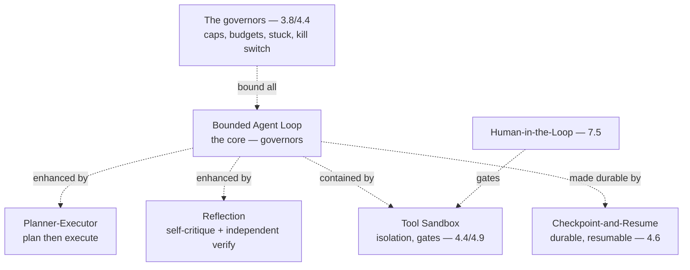

# Chapter 7.4 — Agentic Patterns

| | |
|---|---|
| **Part** | 7 — Enterprise AI Architecture Patterns |
| **Maturity level** | 4 — Architect |
| **Difficulty** | Advanced |
| **Estimated study time** | 3 hours (reading 90 min, exercise 90 min) |
| **Prerequisites** | [3.8 Agents](../part-3-core-building-blocks-of-genai/chapter-08-agents-concepts.md); [4.4](../part-4-enterprise-genai-systems/chapter-04-agent-architectures-production.md); [4.5](../part-4-enterprise-genai-systems/chapter-05-multi-agent-systems.md) |

## Learning Objectives

After this chapter you will be able to:

1. Apply the agentic pattern family in pattern-language form: bounded agent loop, planner-executor, reflection, tool sandbox, and checkpoint-and-resume.
2. Select the agentic pattern matched to the agent problem, using each pattern's context, forces, and consequences.
3. Compose agentic patterns into agent architectures, within the governors (3.8/4.4).
4. Recognize the agentic patterns in the case studies, applied only where the path is undiscoverable (3.8's spectrum).

## Introduction

This chapter catalogs the agentic pattern family — the model-directed-control-flow patterns (3.8's agents, where the model owns the control flow) that 3.8 introduced, 4.4 productionized, and 4.5 scaled to multi-agent, in pattern-language form (7.1). These patterns are for the 10% where the path is genuinely undiscoverable (3.8's spectrum, after the workflow patterns of 7.3 have covered the 90%), and this chapter is the reference for the bounded, governed agent patterns.

The framing: **agentic patterns are the model-directed-control-flow toolkit — for the undiscoverable-path residue, bounded and governed** — the patterns (bounded loop, planner-executor, reflection, tool sandbox, checkpoint-and-resume) where the model owns the control flow (3.8), applied only where the path is undiscoverable (3.8's spectrum, the 10%), always bounded (3.8's governors) and governed (4.4's production envelope), and this chapter is the reference.

## Business Motivation

The agentic patterns are the enterprise's toolkit for the genuinely-agentic problems — the tasks the workflow patterns (7.3) can't handle (the undiscoverable path — 3.8's autonomy grid). These are the high-value, high-variance problems (3.8's economics — the tasks no workflow could encode, automated at all, is high value; the compounding cost and error — 3.8's variance), so the agentic patterns matter where they apply (the genuinely-agentic residue) and the governors matter always (the bounded, governed patterns preventing the runaway — 3.8/4.4). The business case is the bounded-agentic-value one: the agentic patterns unlock the genuinely-agentic value (the undiscoverable-path tasks — 3.8's economics), bounded and governed (the governors preventing the runaway — 3.8/4.4's envelope), and the agentic pattern family is the reference for the bounded agent architecture — the toolkit for the agentic residue, applied with the discipline (bounded, governed) the agent's variance demands.

## Theory — The Agentic Pattern Catalog

### Pattern: Bounded Agent Loop

- **Context** — a task where the path is genuinely undiscoverable in advance (3.8's autonomy grid — verification cheap, errors recoverable).
- **Problem** — the task the model must direct its own control flow to solve (3.8).
- **Forces** — the autonomy (the flexibility) vs. the bounds (the cost, the runaway — 3.8's governors).
- **Solution** — the goal + machine-checkable success criteria + the four governors (iteration cap, cost budget, stuck detector, kill switch — 3.8), typed exits (3.8).
- **Structure** — goal → loop (elect → observe → iterate) → typed exit, within the governors (3.8).
- **Consequences** — the undiscoverable-path task solved; the cost/variance (bounded by the governors — 3.8).
- **Known uses** — Corvid's customs-exception agent (4.4), Halvard & Roth's cross-reference investigation (3.8/4.5).
- **Related** — Tool Sandbox (the isolation), Checkpoint-and-Resume (the durability), the verification (3.8's independent verification).

### Pattern: Planner-Executor

- **Context** — a complex task benefiting from an explicit plan before execution (3.8/4.5).
- **Problem** — the task where planning and execution are better separated (the plan then execute).
- **Forces** — the plan quality (the highest-leverage — 4.5's orchestrator) vs. the plan's rigidity (the plan may need revision).
- **Solution** — a planner produces the plan, an executor executes it (with re-planning where needed — 3.8/4.5's orchestrator-workers, agentic version).
- **Structure** — planner (plan) → executor (execute, re-plan if needed) (3.8/4.5).
- **Consequences** — the explicit plan (the decomposition — 4.5); the plan quality is decisive (4.5's orchestrator — prefer deterministic where the structure is known).
- **Known uses** — the multi-agent orchestrator-workers (4.5), CS40 (legacy modernization planning).
- **Related** — Orchestrator-Workers (7.3, the workflow version), the multi-agent patterns (4.5).

### Pattern: Reflection

- **Context** — an agent task where self-critique improves the output (3.8's evaluator-optimizer, agentic version).
- **Problem** — the agent's output that could be improved by self-review (3.8).
- **Forces** — the quality improvement vs. the cost/sycophancy (the self-review — 2.6's sycophancy, the agent grading itself — 3.8's hallucinated success).
- **Solution** — the agent reflects on its output/trajectory, critiques, revises (3.8, bounded), with independent verification (3.8 — not self-grading alone).
- **Structure** — act → reflect/critique → revise (bounded), with independent verification (3.8).
- **Consequences** — the quality improvement; the sycophancy risk (the self-review's bias — 2.6, independent verification — 3.8).
- **Known uses** — the evaluator-optimizer's agentic version (3.8), research agents' self-check (4.5).
- **Related** — Evaluator-Optimizer (7.3, the workflow version), the LLM-as-judge (4.7, the independent verifier).

### Pattern: Tool Sandbox

- **Context** — an agent with tools that need isolation (the consequential tools, the untrusted content — 3.7/4.4/4.9).
- **Problem** — the agent's tools that could do harm (the blast radius — 4.9, the injection — 4.9).
- **Forces** — the tool capability vs. the blast-radius containment (4.9's least-privilege).
- **Solution** — the sandboxed execution (4.4 — the isolated environment, the egress allowlist, the per-task credentials — 3.7/4.4/4.9), the consequence gates (3.7).
- **Structure** — the agent → sandbox (isolated, egress-controlled, scoped credentials) → tools (gated — 3.7) (4.4).
- **Consequences** — the blast-radius containment (4.9); the sandbox complexity (4.4's envelope).
- **Known uses** — Corvid's customs agent (4.4 — the quarantine + gates), all consequential-action agents (4.4/4.9).
- **Related** — the safety patterns (7.6, the quarantine), the consequence gates (3.7), the human-in-the-loop (7.5, the approval).

### Pattern: Checkpoint-and-Resume

- **Context** — a long-running agent task that must survive failures and pauses (3.8/4.6).
- **Problem** — the long task that fails or pauses (for approval) mid-way and must resume (4.6).
- **Forces** — the durability (the resumption) vs. the checkpoint complexity (4.6's durable state).
- **Solution** — the durable task-state checkpoints (3.8/4.6 — the state persisted, the task resumable), the typed exits feeding the resumption (4.6).
- **Structure** — the agent loop with durable checkpoints (3.8/4.6), resumable from the last checkpoint.
- **Consequences** — the durability (the resumption, the pause-for-approval — 7.5); the checkpoint complexity (4.6).
- **Known uses** — the durable agent orchestration (4.6, P19), the long-running investigations (4.5).
- **Related** — the durable workflow patterns (4.6), the human-in-the-loop (7.5, the pause-for-approval).

## Architecture Perspective

Readings. **The bounded agent loop is the core, always governed** — the bounded loop (3.8 — the goal, the machine-checkable success, the four governors, the typed exits) is the agentic core, always bounded (3.8's governors) and governed (4.4's production envelope), enhanced by the planner-executor (the explicit plan) and reflection (the self-critique with independent verification — 3.8's hallucinated-success guard), contained by the tool sandbox (4.4/4.9's isolation and gates), made durable by checkpoint-and-resume (4.6). **The agentic patterns are for the undiscoverable-path residue** — applied only where the workflow patterns (7.3) can't (the undiscoverable path — 3.8's spectrum, the 10%), always with the governors (the bounded, governed agent — 3.8/4.4). **And the agentic patterns combine with the human-in-the-loop and safety patterns** — the tool sandbox with the consequence gates (3.7) and the human-in-the-loop approval (7.5), the reflection with the independent verification (3.8) — the agentic patterns combined with the human-oversight (7.5) and safety (7.6) patterns for the bounded, governed, safe agent (the combination — 7.1).

## Real-world Example

**Corvid Logistics** (the recurring customs agent — 4.4) built its customs-exception agent as an agentic-pattern composition, and the composition is the agentic pattern family applied with the governors. The core was the bounded agent loop (3.8/4.4 — the exception-investigation task, the undiscoverable path — 3.8's autonomy grid, the four governors — 3.8). The tool sandbox (4.4/4.9) contained it (the sandboxed execution, the egress allowlist, the per-task credentials — 3.7/4.4, the quarantine for the untrusted documents — 4.9/7.6). The human-in-the-loop (7.5) gated the consequential action (the customs-filing approval — 3.7's consequence gate, 7.5's approval). The checkpoint-and-resume (4.6) made it durable (the long investigation resumable, the pause-for-approval — 4.6/7.5). And the independent verification (3.8) guarded against hallucinated success (the verification checking the agent's claims against the tool log — 3.8, catching the "no inconsistency found" on the unretrieved side letter — 3.8's Halvard & Roth-style, Corvid's customs edition). The agentic-pattern composition was the architecture: bounded loop (the core) + tool sandbox (the containment) + human-in-the-loop (the approval) + checkpoint-and-resume (the durability) + independent verification (the honesty) — the agent architecture as a composition of agentic patterns (7.1's combination), all within the governors (3.8/4.4), applied only where the path was undiscoverable (3.8's spectrum — the 10%, the exception investigation, not the 90% workflow). Priit's agentic-patterns note (echoing 4.4): *"Our customs agent is an agentic-pattern composition: the bounded loop (the core, the governors), the tool sandbox (the containment, the quarantine — 4.9), the human-in-the-loop (the filing approval), the checkpoint-and-resume (the durable investigation), the independent verification (the honesty — 3.8's hallucinated-success guard). All bounded and governed (3.8/4.4). And it's the 10% — the exception investigation the path of which we couldn't write down; the 90% is workflow patterns (7.3). The agentic patterns are for the undiscoverable-path residue, applied with the discipline the agent's variance demands: bounded, governed, sandboxed, verified, human-gated."*

## Hands-on Exercise

**Compose agentic patterns.** ~90 minutes. For an agent task (real or a case study) — verify it genuinely needs an agent (3.8's autonomy grid) first.

1. **The autonomy-grid check (15 min).** Verify the task genuinely needs an agent (3.8's autonomy grid — the path undiscoverable, verification cheap, errors recoverable). If it doesn't, use a workflow pattern (7.3) instead.
2. **Pattern selection (30 min).** For the genuinely-agentic task, select the agentic patterns (bounded loop — the core, planner-executor — if planning helps, reflection — if self-critique helps, tool sandbox — for the containment, checkpoint-and-resume — for the durability). Justify each.
3. **The pattern-language form (20 min).** For one selected pattern, write its full pattern-language form.
4. **The composition with governors (25 min).** Compose the agentic patterns into the agent architecture, within the governors (3.8/4.4 — the caps, budgets, stuck detector, kill switch), with the human-in-the-loop (7.5) and independent verification (3.8). Show the bounded, governed composition.

**Acceptance criteria:**
- [ ] The autonomy-grid check applied (the task genuinely needs an agent — 3.8; else a workflow pattern)
- [ ] Agentic patterns selected matched to the agent problem, with context
- [ ] One pattern in the full pattern-language form
- [ ] The agent architecture as an agentic-pattern composition, within the governors (3.8/4.4), with human-in-the-loop (7.5) and verification (3.8)

## Enterprise Considerations

The agentic patterns are the enterprise's bounded-agent reference, applied with governance. **They're the bounded-agent reference** (3.8/4.4/7.1): the agentic pattern family is the enterprise's reference for the bounded, governed agent (3.8's governors, 4.4's production envelope), applied only where the path is undiscoverable (3.8's spectrum). **They require the production envelope** (4.4): the agentic patterns require the production envelope (4.4 — the fleet observability, the budget hierarchies, the approval queues, the trajectory review — the governed agent fleet), so the agentic patterns connect to the production-agent machinery (4.4). **They're governance-heavy** (6.9/2.8/4.14): the agent's autonomy makes the agentic patterns governance-heavy (the risk classification — 2.8, the accountability — 4.4, the human oversight — 7.5/2.8), so the governance (6.9) governs the agentic patterns closely (the autonomy-budget policy — 4.4, the review). **And the agent-for-everything and unbounded-autonomy anti-patterns** (7.10) are the agentic patterns' counterpoints: the anti-patterns (reaching for agents where a workflow fits — 3.8/7.10, the unbounded agent — 3.8/7.10) are what the agentic patterns' discipline (the autonomy-grid check, the governors) prevents.

## Trade-offs

| Decision | Option A | Option B | Choose A when… | Choose B when… |
|----------|----------|----------|----------------|----------------|
| Agent vs. workflow | Agentic patterns (7.4) | Workflow patterns (7.3) | The path is genuinely undiscoverable (3.8's autonomy grid) | The path is fixed/discoverable — the 90% (3.8's spectrum) |
| Planning | Planner-executor (explicit plan) | Bounded loop (implicit) | Complex tasks benefiting from an explicit plan | Simpler tasks where the loop suffices |
| Self-improvement | Reflection + independent verification | No reflection | Self-critique improves the output, verification guards it | Simple tasks, or where the sycophancy risk outweighs (2.6) |
| Verification | Independent (against side effects — 3.8) | Self-grading | Always — the hallucinated-success guard (3.8) | Never self-grading alone; the agent grading itself is unreliable (3.8) |

## Common Mistakes

1. **Agents where a workflow fits** — the agent-for-everything anti-pattern (3.8/7.10); the autonomy-grid check (3.8) first, workflow patterns (7.3) for the fixed path.
2. **The unbounded agent** — the agent without the governors (3.8/7.10's unbounded autonomy); always the four governors (3.8 — caps, budgets, stuck detector, kill switch).
3. **Self-grading instead of independent verification** — the agent grading its own success (3.8's hallucinated success); independent verification (against the side effects — 3.8).
4. **The un-sandboxed consequential agent** — the agent with consequential tools without the sandbox and gates (4.4/4.9); the tool sandbox (4.4) and consequence gates (3.7).
5. **The reflection sycophancy** — the self-critique biased by sycophancy (2.6 — the agent agreeing with itself); the independent verification (3.8).
6. **The non-durable long agent** — the long-running agent without checkpoints (4.6); checkpoint-and-resume (4.6).
7. **Model planning of known structures** — the planner deriving a known plan (4.5); deterministic planning of known structures (4.5).

## Best Practices

1. **Apply the autonomy-grid check first** — the agentic patterns only where the path is genuinely undiscoverable (3.8's spectrum); workflow patterns (7.3) for the fixed path.
2. **Always bound with the governors** — the four governors (3.8 — caps, budgets, stuck detector, kill switch) on every bounded loop.
3. **Verify independently** — the independent verification (against the side effects — 3.8), the hallucinated-success guard; never self-grading alone.
4. **Sandbox and gate the consequential agent** — the tool sandbox (4.4/4.9) and consequence gates (3.7), with the human-in-the-loop approval (7.5).
5. **Checkpoint the long agent** — checkpoint-and-resume (4.6) for durability and the pause-for-approval (7.5).
6. **Prefer deterministic planning** — deterministic planning of known structures (4.5); model planning for novel structures.
7. **Run the production envelope** — the fleet observability, budgets, approval queues (4.4) for the governed agent fleet.

## Architecture Checklist

For applying the agentic patterns:

- [ ] The autonomy-grid check applied (the task genuinely needs an agent — 3.8); workflow patterns (7.3) for the fixed path
- [ ] The bounded agent loop with the four governors (3.8 — caps, budgets, stuck detector, kill switch)
- [ ] Independent verification (against side effects — 3.8), not self-grading
- [ ] The tool sandbox (4.4/4.9) and consequence gates (3.7) for consequential agents, with human-in-the-loop (7.5)
- [ ] Reflection (if used) with independent verification (the sycophancy guard — 2.6/3.8)
- [ ] Checkpoint-and-resume (4.6) for long-running agents
- [ ] The production envelope (4.4 — fleet observability, budgets, approval queues); governed (6.9/2.8/4.14)

## Interview Questions

1. *"Walk me through the agentic patterns and when you'd use each."* — Strong answers give the family (bounded agent loop — the core, planner-executor — the explicit plan, reflection — the self-critique, tool sandbox — the containment, checkpoint-and-resume — the durability), each with its context, and the spectrum discipline (agentic patterns only where the path is undiscoverable — 3.8, the 10%).
2. *"How do you keep an agent bounded and safe?"* — Strong answers give the governors (3.8 — caps, budgets, stuck detector, kill switch), the tool sandbox (4.4/4.9 — isolation, gates, per-task credentials), the independent verification (3.8 — the hallucinated-success guard), and the human-in-the-loop (7.5 — the consequential-action approval) — the bounded, governed, sandboxed, verified agent.
3. *"How do you compose agentic patterns into an agent architecture?"* — Strong answers give the composition (the bounded loop as the core, enhanced by planner-executor and reflection, contained by the tool sandbox, made durable by checkpoint-and-resume, verified independently, human-gated — 7.1's combination), all within the governors (Corvid's customs agent).
4. *"Why is independent verification essential for agents?"* — Strong answers give the hallucinated-success failure (3.8 — the agent claiming success without doing the work), the self-grading unreliability (the agent grading itself — the sycophancy — 2.6), and the independent verification (checking the agent's claims against the side effects/tool log — 3.8) as the honesty guard.

## Further Reading

- 3.8 Agents (the bounded loop, the governors), 4.4 Agent Architectures (the production envelope), 4.5 Multi-Agent Systems (the orchestrator-workers) — the chapters this pattern family formalizes.
- Anthropic, *Building Effective Agents* (re-linked from 3.8/4.4) — the agentic patterns' source.
- The [agent design checklist](../../checklists/agent-design-checklist.md) — the checklist the agentic patterns implement.
- 7.3 Workflow Patterns (the fixed-control-flow alternative) and 7.5 Human-in-the-Loop Patterns (the oversight) — the related pattern families.

## Summary

- The **agentic pattern family** is the model-directed-control-flow toolkit — bounded agent loop (the core, governed), planner-executor (the explicit plan), reflection (the self-critique with independent verification), tool sandbox (the containment — 4.4/4.9), checkpoint-and-resume (the durability — 4.6) — for the undiscoverable-path residue (3.8's spectrum, the 10%).
- The **bounded loop is always governed** — the four governors (3.8 — caps, budgets, stuck detector, kill switch) and the production envelope (4.4), applied only where the path is undiscoverable (3.8's autonomy grid).
- **Independent verification is essential** — the hallucinated-success guard (3.8 — checking the agent's claims against the side effects), never self-grading alone (the sycophancy — 2.6).
- The agentic patterns **combine with the human-in-the-loop (7.5) and safety (7.6) patterns** — the tool sandbox with the consequence gates (3.7) and the human approval (7.5), the reflection with the independent verification (3.8) — Corvid's bounded, governed, sandboxed, verified, human-gated customs agent.
- The agentic patterns are the enterprise's **bounded-agent reference**, governance-heavy (6.9/2.8/4.14), the counterpoint to the agent-for-everything and unbounded-autonomy anti-patterns (7.10). The human-oversight patterns are next: **human-in-the-loop patterns** (7.5).

---

**Previous:** [Chapter 7.3 — Workflow Patterns](chapter-03-workflow-patterns.md) · **Next:** [Chapter 7.5 — Human-in-the-Loop Patterns](chapter-05-human-in-the-loop-patterns.md) · **Related:** [3.8 Agents](../part-3-core-building-blocks-of-genai/chapter-08-agents-concepts.md), [4.4 Agent Architectures](../part-4-enterprise-genai-systems/chapter-04-agent-architectures-production.md), [7.5 Human-in-the-Loop Patterns](chapter-05-human-in-the-loop-patterns.md)
