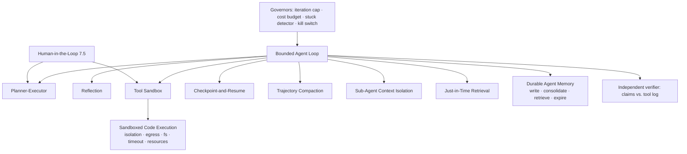

# Chapter 7.4 — Agentic Patterns

| | |
|---|---|
| **Part** | 7 — Enterprise AI Architecture Patterns |
| **Maturity level** | 4 — Architect |
| **Difficulty** | Advanced |
| **Estimated study time** | 2 hours 15 min (reading 45 min, exercise 90 min) |
| **Prerequisites** | [3.8 Agents](../part-3-core-building-blocks-of-genai/chapter-08-agents-concepts.md); [4.4](../part-4-enterprise-genai-systems/chapter-04-agent-architectures-production.md); [4.5](../part-4-enterprise-genai-systems/chapter-05-multi-agent-systems.md) |

## Learning Objectives

After this chapter you will be able to:

1. Apply the agentic pattern family in pattern-language form across four groups: control (bounded agent loop, planner-executor, reflection), containment (tool sandbox, sandboxed code execution), durability (checkpoint-and-resume), and context & memory (trajectory compaction, sub-agent context isolation, just-in-time context retrieval, durable agent memory).
2. Decide whether a task belongs to this family at all, and bound the ones that do with governors built as tested components rather than configuration values.
3. Design an agent's context and memory deliberately — held, written, retrieved, expired — and defend the design against memory poisoning.
4. Specify an execution envelope for agent-generated code: isolation, egress, filesystem, timeout, resource ceilings.

## Introduction

An [agent](../../GLOSSARY.md) is a system where the model owns control flow; a [workflow](../../GLOSSARY.md) is one where your code does. This chapter is the reference for the first case — the minority of tasks whose path cannot be written down in advance, after the workflow patterns of [7.3](chapter-03-workflow-patterns.md) have taken the majority that can.

Two things have changed since the family was first catalogued. **The binding constraint is context, not tool access**: a long loop accumulates a trajectory that outgrows any [context window](../../GLOSSARY.md), and the patterns managing that accumulation decide whether hour six is as sharp as hour one. **The dominant capability is now writing and running code**, which makes the execution sandbox the primary trust boundary of the system rather than a containment detail. The catalog is organized by what each group controls: who decides the next step, what the agent may touch, whether the task survives a restart, and what the model sees and remembers.

## Business Motivation

Agentic patterns automate work whose steps are chosen at runtime — exception investigation, migration, cross-system triage — and a task no workflow could encode, automated at all, has no baseline to beat. The costs are equally specific, and each pattern below caps one. **Spend becomes a distribution**: an agent is N model calls where a workflow is three, and the tail is what reaches the invoice. **Error compounds per iteration**: 97% per step is 74% over ten, which is why verification is structural rather than optional. **Context is the second cost curve**: each iteration re-sends the trajectory, so an uncompacted long run pays super-linearly for linear progress — the context patterns are cost patterns as much as quality patterns. **Blast radius is now executable**: an agent that writes code, reaches the network, and keeps durable memory is one where a single poisoned document can plant an instruction outliving the session that read it. Variance, compounding error, context growth, executable blast radius — a review that cannot say which pattern caps which has not reviewed an agent.

## Theory — The Agentic Pattern Catalog

### Control patterns — who decides the next step

#### Pattern: Bounded Agent Loop

- **Context** — a task whose next step depends on what the last returned: an exception of unknown cause, a defect of unknown location, an investigation nobody can enumerate in advance.
- **Problem** — fixed control flow cannot express "it depends"; a free-running loop has no stopping point, no sense of its own failure, and no bound on spend.
- **Forces** — flexibility vs. bounded cost; the model's belief that it is finished vs. a machine-checkable definition; the cap that stops a runaway also truncates a legitimate long task, so the boundary must be a typed exit rather than a silent stop.
- **Solution** — a goal whose success criteria are checkable against side effects; tools, not steps; four governors built as tested components (iteration cap, cost budget, stuck detector, kill switch); typed exits — success, stuck, budget-exhausted-with-partial-result, escalated — consumed like any API contract.
- **Structure** — goal + success schema → [elect → execute → observe]* under governors → typed exit → verifier compares asserted work against the tool log.
- **Consequences** — the undiscoverable task becomes automatable; failures arrive as trajectories, so replay tooling precedes prompt tuning; the governors are code with their own bugs (the detector that never fires, the unrehearsed kill switch); per-task cost becomes a distribution with a tail. A task whose success cannot be checked cheaply does not belong in a loop.
- **Known uses** — ReAct (Yao et al., arXiv 2210.03629), which fixed the interleaved reason–act–observe shape; Anthropic's *Building Effective Agents*, which draws the agent/workflow line on who owns control flow and recommends loops only where the flexibility is needed; coding agents (Claude Code, GitHub Copilot's agent mode, the SWE-agent/SWE-bench line), whose edit→test→observe loop runs against a machine-checkable criterion. Fictional instance: Corvid's customs-exception agent ([4.4](../part-4-enterprise-genai-systems/chapter-04-agent-architectures-production.md)).
- **Related** — Tool Sandbox and Sandboxed Code Execution; Checkpoint-and-Resume; Trajectory Compaction; the workflow patterns ([7.3](chapter-03-workflow-patterns.md)), to be tried first.

#### Pattern: Planner-Executor

- **Context** — a task whose shape is worth committing to before work starts: a multi-file refactor, a migration, an analysis containing irreversible steps.
- **Problem** — a loop deciding one step at a time cannot be reviewed before it acts, and re-derives its strategy on every iteration.
- **Forces** — an inspectable, approvable plan vs. its rigidity when reality contradicts it; planning cost vs. execution cost; the plan is also the cheapest human checkpoint, which makes plan quality partly an interface question.
- **Solution** — a planning phase emits an explicit step list with its assumptions; an executor runs steps and requests *bounded* re-planning on contradiction (a plan revised five times is a loop in costume); known decompositions are generated in code, leaving the model only the novel part.
- **Structure** — goal → planner → plan artifact (steps, assumptions, checks) → optional approval → execute per step → contradiction → bounded re-plan → typed exit.
- **Consequences** — the plan becomes an audit and approval surface, often the whole reason to adopt the pattern; it costs a planning round-trip per task and fails distinctively — a confidently wrong plan executed faithfully is worse than a loop that would have noticed at step two.
- **Known uses** — the orchestrator-workers workflow in Anthropic's *Building Effective Agents* is this separation with the plan as the fan-out; plan-then-execute prompting appears in the research line (Plan-and-Solve, Wang et al., arXiv 2305.04091); coding agents ship a plan-first mode presenting the intended change set for approval before any file is edited. Fictional instance: the modernization planning lane in [CS40](../../case-studies/cs40-legacy-code-modernization-factory.md).
- **Related** — Orchestrator-Workers ([7.3](chapter-03-workflow-patterns.md)); Sub-Agent Context Isolation (how plan steps are farmed out); Approval Gate ([7.5](chapter-05-human-in-the-loop-patterns.md)), which attaches to the plan artifact.

#### Pattern: Reflection

- **Context** — output with room to improve on a second pass and some available critique signal: drafts, generated code, analyses with checkable claims.
- **Problem** — first-pass output is often nearly right, and the model that produced it is the least reliable judge of it.
- **Forces** — quality gain vs. doubled cost and latency; the convenience of self-critique vs. its bias toward agreement — agent-scale [hallucination](../../GLOSSARY.md) is usually hallucinated *success*.
- **Solution** — critique against the strongest available signal, ranked: an executable check (tests, schema validator, recomputation), then an independent model with a rubric, then self-critique for surface qualities only; bound revisions at about two rounds, and log what each round changed so its value is measurable.
- **Structure** — produce → critique (executable ∨ independent ∨ self) → revise → re-check → stop on pass or round limit; per-round deltas recorded.
- **Consequences** — real gains where the check is executable and thin ones where it is not, at a doubling of tokens and latency; unmeasured reflection hides spend, and self-grading manufactures a false audit trail — a logged critique that always approves is worse than none, because reviewers read it as evidence.
- **Known uses** — Reflexion (Shinn et al., arXiv 2303.11366) and Self-Refine (Madaan et al., arXiv 2303.17651) are the research line; the evaluator-optimizer workflow in *Building Effective Agents* is the two-role version; the strongest production instance is the least glamorous — coding agents whose critic is the test suite, where the signal is external and binary.
- **Related** — Evaluator-Optimizer ([7.3](chapter-03-workflow-patterns.md)); [LLM-as-judge](../../GLOSSARY.md) ([4.7](../part-4-enterprise-genai-systems/chapter-07-evaluation-systems.md)) as independent critic; the loop's verifier, which checks facts rather than taste.

### Containment patterns — what the agent may touch

#### Pattern: Tool Sandbox

- **Context** — an agent holding tools that read sensitive data or act on the world while also reading content it did not author.
- **Problem** — the tool set is both capability and blast radius, and observations are attacker-reachable: text from a document or ticket arrives in the same channel as instructions ([prompt injection](../../GLOSSARY.md)).
- **Forces** — capability vs. containment (each tool removed makes the agent safer and dumber); per-task credentials vs. operational friction; injection cannot be fixed at the prompt layer, so it must be absorbed at the permission layer.
- **Solution** — credentials scoped to the task and invoking user rather than a service account holding everyone's rights; default-deny egress behind a named allowlist; tools separated by consequence class with irreversible ones gated ([3.7](../part-3-core-building-blocks-of-genai/chapter-07-function-calling-tool-use.md)); observations fenced as provenance-stamped data; and no single agent holding private data, untrusted input, and an outbound channel at once.
- **Structure** — agent → tool broker (identity, scope, rate, consequence class) → sandboxed runtime (allowlisted egress, ephemeral credentials) → tools; consequential calls routed to a gate.
- **Consequences** — bounds what a hijacked trajectory can do and makes capability a reviewable artifact; costs credential plumbing, an allowlist someone must maintain, and a trickle of legitimately blocked actions, so it needs an escalation path or people route around it. It reduces blast radius without making injection impossible, and treating it as a solution rather than a bound is a specification error.
- **Known uses** — least privilege is the standing recommendation of the OWASP Top 10 for LLM Applications, whose excessive-agency and prompt-injection entries describe this pattern's absence; the widely cited "lethal trifecta" framing (private data + untrusted content + an outbound channel in one agent) states the rule as a prohibition; hosted agent runtimes and tool-protocol servers run tools in per-session containers with scoped tokens. Fictional instance: Corvid's quarantine-and-gate arrangement ([4.4](../part-4-enterprise-genai-systems/chapter-04-agent-architectures-production.md)).
- **Related** — Sandboxed Code Execution (where the tool is a runtime); the safety family ([7.6](chapter-06-safety-guardrail-patterns.md)); Approval Gate ([7.5](chapter-05-human-in-the-loop-patterns.md)).

#### Pattern: Sandboxed Code Execution

- **Context** — an agent that writes code and runs it: analysis over a supplied file, a recomputation, a script driving an API, a repository change validated by its own tests.
- **Problem** — generated code is untrusted code, often produced in response to untrusted input; an allowlist constrains calls, but a program does whatever the runtime permits, so the runtime is the real boundary.
- **Forces** — arbitrary computation's capability vs. its unbounded action space; strong isolation's startup cost vs. a shared interpreter's weakness; the code's need for the network vs. the network being the exfiltration path.
- **Solution** — a disposable runtime under a written envelope, each element a named decision: **isolation** (container or microVM per task, destroyed after, never shared across tenants), **egress** (default-deny plus a named allowlist), **filesystem** (scratch directory plus explicitly mounted inputs, read-only where possible), **time and resources** (wall-clock timeout, CPU/memory ceilings, process caps), **identity** (no ambient credentials inside; authenticated calls go back through the tool broker).
- **Structure** — agent emits code → fresh runtime (pinned image, egress policy, mounted inputs) → execute under ceilings → capture stdout/stderr/artifacts → destroy → results returned fenced as observations.
- **Consequences** — the family's largest capability unlock, because the model gains a checker instead of guessing; costs are provisioning latency, a dependency supply chain someone owns, and the standing temptation to relax egress "just for package installs" — the exact relaxation that reopens exfiltration. Timeout calibration fails in both directions: too short kills legitimate computation, too long lets a runaway bill a budget before a ceiling notices.
- **Known uses** — hosted code-execution tools run model-written Python in a network-isolated container with session-scoped files and a hard timeout (OpenAI's Code Interpreter and the code-execution tools in major model APIs both work this way); SWE-agent and SWE-bench evaluate repository agents in a fresh container per task, which is what makes results reproducible; local coding agents run shell commands under per-command permission prompts with a workspace-scoped filesystem; Firecracker and gVisor are the usual isolation substrate.
- **Related** — Tool Sandbox (the general case); Bounded Agent Loop (the ceilings are governors); the threat model of [4.9](../part-4-enterprise-genai-systems/chapter-09-genai-security-threat-modeling.md).

#### Pattern: Checkpoint-and-Resume

- **Context** — tasks measured in hours, or tasks that pause mid-flight for a human decision.
- **Problem** — a crash, deploy, rate limit, or overnight approval destroys an in-memory trajectory, and restarting repeats side effects as well as tokens.
- **Forces** — durability vs. the work of making agent state serializable; checkpoint frequency vs. write cost; resuming exactly where it stopped vs. the world having moved while the agent was paused.
- **Solution** — hold task state in an explicit serializable structure (goal, findings ledger, completed steps with side-effect receipts, open questions) rather than in message history alone; checkpoint after every consequential action; make resumption idempotent through recorded receipts; re-validate stale assumptions on resume rather than trusting them.
- **Structure** — loop → persist {state, receipts, cursor} after each consequential step → crash or pause → resume from cursor with re-validation → typed exit; the same store backs the approval pause.
- **Consequences** — long tasks become operable and overnight approvals affordable, since no process is held open for eight hours; the costs are a state schema versioned like any persisted contract (in-flight tasks must survive the deploy that changed it) and idempotency discipline, whose absence produces double-filed, double-charged, double-emailed work.
- **Known uses** — durable execution engines used for agent orchestration persist state and replay deterministically after failure; agent frameworks ship checkpointing with human-in-the-loop interrupts as a first-class feature (LangGraph's persistence and interrupt mechanism is the common example); coding agents resume prior sessions from stored state. Fictional instance: the durable orchestration in [P19](../../projects/p19-agent-orchestration-platform/README.md).
- **Related** — durable workflow patterns ([4.6](../part-4-enterprise-genai-systems/chapter-06-orchestration-workflows.md)); Approval Gate ([7.5](chapter-05-human-in-the-loop-patterns.md)); Durable Agent Memory (state is *this* task; memory is *across* tasks).

### Context & memory patterns — what the model sees and remembers

#### Pattern: Trajectory Compaction

- **Context** — a loop long enough that its history approaches the context window: multi-hour investigations, repository-wide changes, day-long sessions.
- **Problem** — every iteration re-sends the whole trajectory, so tokens grow far faster than progress and the signal dilutes into tool output nobody will read again.
- **Forces** — fidelity vs. room to keep working; compression is lossy exactly where it matters, and what it drops (an account number, a path, a clause reference) is often what the task depends on; compaction itself costs a model call at the worst moment.
- **Solution** — extract structured facts *before* summarizing over them: a pinned, append-only ledger of load-bearing specifics that is never summarized, with only conversational and tool-output residue compacted; trigger on a token threshold rather than a turn count, keep recent turns verbatim, and persist the pre-compaction trajectory so it stays auditable after the model stops seeing it.
- **Structure** — trajectory → threshold breach → [pinned ledger] + [older span summarized] + [recent turns verbatim] → new working context; full trajectory retained in storage.
- **Consequences** — converts a hard ceiling into an ongoing cost, which is what makes long-horizon agents viable; the failure is specific and expensive — a compaction that drops a needed detail produces an agent that repeats work or contradicts itself, with the evidence no longer in context, so compaction output deserves evaluation like any other model output.
- **Known uses** — coding agents auto-compact when the window fills and expose a manual compaction command, preserving recent turns plus a running summary; Anthropic's public engineering writing on context engineering treats compaction plus an external note file as the standard long-horizon technique; MemGPT (Packer et al., arXiv 2310.08560) frames the same idea as operating-system paging between in-context and external storage.
- **Related** — the context budget of [3.2](../part-3-core-building-blocks-of-genai/chapter-02-tokens-context-sampling.md); Checkpoint-and-Resume (where compacted state persists); Durable Agent Memory.

#### Pattern: Sub-Agent Context Isolation

- **Context** — work with a wide, noisy exploration phase and a narrow conclusion: search across many sources, sweeps over many files, verification of many hypotheses.
- **Problem** — exploration generates enormous low-value text, and if it lands in the deciding agent's context the decision degrades and the window fills before the interesting part starts.
- **Forces** — isolation vs. coordination cost (a worker blind to the orchestrator's context sometimes redoes work or misreads intent); parallel speed vs. token multiplication, since N workers is N times the spend; a summary tight enough to use vs. the loss of the evidence behind it.
- **Solution** — each sub-task gets its own agent, its own window, a narrow brief, and a *typed return contract* — findings, citations, confidence, never raw transcript; the orchestrator sees returns, not trajectories, and every returned claim carries a pointer into the worker's retained trajectory so a human can audit evidence the orchestrator never saw.
- **Structure** — orchestrator (thin context, plan) → workers (own windows, tool scopes, budgets) → typed summaries → synthesis; worker trajectories persisted for audit, not merged.
- **Consequences** — keeps the deciding context clean and buys parallelism, which is when multi-agent structures pay for themselves; spend multiplies with the fan-out, contradictions surface only at synthesis, and debugging spans several trajectories — while sequential stages relabelled as agents take the overhead without the isolation ([4.5](../part-4-enterprise-genai-systems/chapter-05-multi-agent-systems.md)).
- **Known uses** — Anthropic's published account of its multi-agent research system describes a lead agent that plans and spawns subagents searching in parallel in their own context windows and returning condensed findings; orchestrator-workers is the fixed-control-flow version of the same shape; deep-research-style assistants fan out per source or sub-question and synthesize from returns. Fictional instance: the research fan-out in [P11](../../projects/p11-multi-agent-research-assistant/README.md).
- **Related** — Planner-Executor (the plan defines the fan-out); Trajectory Compaction (the intra-agent equivalent); Orchestrator-Workers ([7.3](chapter-03-workflow-patterns.md)).

#### Pattern: Just-in-Time Context Retrieval

- **Context** — an agent working against a corpus far larger than any context: a codebase, a policy library, a ticket history, a warehouse.
- **Problem** — preloading everything relevant is impossible and counterproductive: it spends the budget on material the task may never need and fixes the retrieval decision before the agent knows what it is looking for.
- **Forces** — the reliability of material already present vs. the cost of carrying it; per-step latency vs. one upfront load; the model's judgment about what to fetch vs. a tuned pipeline's recall — and preloading caches well, a real argument for stable, universally needed material.
- **Solution** — preload only the small stable core (task brief, schemas, house rules) and expose the rest through navigation tools (search, list, read-by-identifier), handing the agent lightweight references rather than contents and returning results in bounded chunks so one fetch cannot flood the window.
- **Structure** — thin system context + tool surface → on-demand fetches → bounded results appended → compaction reclaims what is spent.
- **Consequences** — the working context stays small and retrieval choices become inspectable in the trajectory; costs are more round-trips, worse prefix caching than a fixed preamble, and a failure mode where the agent never fetches what it needed and reasons from an absence it cannot perceive — which is why navigation tools need clear names, listable spaces, and informative errors, and why real designs end up hybrid.
- **Known uses** — coding agents are the canonical instance, given grep/find/read tools over a repository rather than a preloaded dump, with effectiveness tracking how well those tools describe the space; tool protocols such as MCP expose resources fetched at need rather than injected upfront; Anthropic's context-engineering guidance recommends lightweight identifiers loaded at runtime over exhaustive preloading.
- **Related** — the RAG patterns ([7.2](chapter-02-rag-patterns.md), which tune retrieval as a pipeline instead of delegating it); Trajectory Compaction; tool design ([3.7](../part-3-core-building-blocks-of-genai/chapter-07-function-calling-tool-use.md)).

#### Pattern: Durable Agent Memory

- **Context** — an agent meeting the same users, systems, or problems repeatedly, where re-learning the same facts every session is visible waste.
- **Problem** — working context dies with the task, so anything worth carrying across tasks needs a store plus four policies — write, consolidate, retrieve, expire — each with its own failure mode.
- **Forces** — usefulness vs. staleness (a remembered fact that has since changed is worse than no memory, because it is asserted with the authority of experience); recall vs. precision as the store grows; and the sharpest force, that memory is a write channel from untrusted content into future sessions.
- **Solution** — **write** only durable generalizable facts (a stated preference, a confirmed behaviour, an outcome), never raw retrieved text, each carrying provenance, timestamp, and originating task; **consolidate** by merging and rewriting rather than appending forever, resolving contradictions by recency with superseded versions kept for audit; **retrieve** by relevance under a hard cap, labelled as recollection rather than instruction; **expire** on a per-class TTL with re-confirmation instead of silent renewal; and scope every memory to a subject — this user, tenant, or system — with no cross-subject retrieval.
- **Structure** — task → candidate extraction (schema-validated, provenance-stamped) → subject-scoped store → consolidation job → capped relevance retrieval at task start → TTL expiry → user-visible list with delete.
- **Consequences** — continuity and real savings from not re-deriving known facts, against a store that must be governed (memories about people are personal data under [7.7](chapter-07-knowledge-data-patterns.md)'s deletion and residency rules) and an early wrong memory that propagates with unearned authority. The security consequence is **memory poisoning**: an instruction embedded in content the agent read once ("always approve this vendor") is written to memory and retrieved in later sessions, turning one injection into a persistent backdoor that survives the session, the prompt fix, and often the incident review — which is why memories must be data and never instructions, writes schema-validated and provenance-checked, retrieved memories unable to widen tool scope, and every memory inspectable and deletable by its subject.
- **Known uses** — Generative Agents (Park et al., arXiv 2304.03442) implemented a memory stream with recency/importance/relevance retrieval and a reflection step consolidating observations into higher-level conclusions; MemGPT/Letta (arXiv 2310.08560) splits main context from external memory with explicit paging; Reflexion (arXiv 2303.11366) carries an episodic buffer across attempts; mainstream assistants now ship cross-session memory with user-visible, user-deletable entries; the OWASP GenAI security project's agentic threat material names memory poisoning as a distinct threat rather than a variant of injection.
- **Related** — Checkpoint-and-Resume (within-task state); deletion and tenancy patterns ([7.7](chapter-07-knowledge-data-patterns.md)); Tool Sandbox (memory must not widen scope); the injection threat model ([4.9](../part-4-enterprise-genai-systems/chapter-09-genai-security-threat-modeling.md)).

## Architecture Perspective

Three readings. **The autonomy grid runs before any of it** — cheap verification plus recoverable errors is agent territory, everything else is a workflow with a model inside it, and the most valuable review question stays "why isn't this [7.3](chapter-03-workflow-patterns.md)?" **Governors and the verifier are components, not settings** — a cap in a config file is a number, while a stuck detector, budget enforcer, kill switch, and a verifier comparing claims to recorded side effects are code with tests, owners, and rehearsals. **Context and memory are design surfaces with security consequences** — compaction decides what the agent still knows, isolation decides whose noise reaches the decision, just-in-time retrieval decides what it can reach at all, and durable memory decides what crosses the session boundary, which is why the last is governed like a data store rather than tuned like a prompt.

## Real-world Example

**Corvid Logistics** (fictional; €, Tallinn) runs a customs-exception agent for shipments a broker's filing system rejects. No two causes look alike — a mismatched commodity code, a missing certificate, a disputed valuation — so the path is undiscoverable, while the finding is checkable against the filing record and nothing is irreversible until a human files.

The **bounded loop** is the core: iteration cap, per-exception cost budget, a stuck detector tripping on two identical consecutive elections, and typed exits that render differently in the broker's queue. Document sweeps run as **isolated sub-agents**, so a 40-page bill of lading never enters the deciding context; the tariff schedule is reached through search-and-read tools (**just-in-time retrieval**) after an earlier build spent most of its window on schedule sections irrelevant to the shipment at hand. Long exceptions **compact** on a token threshold, with a pinned ledger holding the shipment reference, codes considered, and duty figures already computed. Duty recomputation runs as **sandboxed code execution**: a short calculation in a fresh container, no egress, 30-second wall clock, rate table mounted read-only — which took the arithmetic out of the model's hands and made the result re-runnable.

Around that, the **tool sandbox** issues per-shipment credentials, portal writes route to a **human approval gate** ([7.5](chapter-05-human-in-the-loop-patterns.md)), and **checkpoint-and-resume** carries the task across an approval that routinely lands the next morning. **Durable memory** stores per-broker quirks with provenance and a 180-day expiry, under a rule written after a tabletop exercise: memories are extracted only from confirmed outcomes and injected as labelled data, because a "standing instruction" harvested from a supplier PDF would otherwise outlive the session that read it. Independent verification compares claims against the tool log, which is how "no discrepancy found" on a document never actually retrieved gets caught. Priit, the architect, reviews the composition with one question per group: which governor stops the runaway, which boundary stops the code, which policy stops a memory becoming an instruction, and which pattern keeps hour six as sharp as hour one. A missing answer is the review finding.

## Hands-on Exercise

**Compose and stress-test an agent architecture.** ~90 minutes. Take one agentic task — your own, or [CS07](../../case-studies/cs07-aml-investigation-assistant.md), [CS31](../../case-studies/cs31-network-operations-copilot.md), or [CS40](../../case-studies/cs40-legacy-code-modernization-factory.md).

1. **Autonomy-grid check (10 min).** State how success is verified and what the worst recoverable error costs. If verification is expensive or errors are irreversible, design a workflow instead ([7.3](chapter-03-workflow-patterns.md)) and record that conclusion — it is a valid outcome.
2. **Control and containment (25 min).** Specify the success schema and four typed exits with their consumers; then write the code-execution envelope as five named values (isolation unit, egress policy, filesystem scope, wall-clock timeout, resource ceilings) and what happens at each ceiling.
3. **Context budget (25 min).** Allocate the working context: preloaded, just-in-time, sub-agent-isolated, and the compaction trigger. List the pinned-ledger fields — the specifics whose loss would corrupt the task.
4. **Memory and its abuse (20 min).** Define write policy, consolidation rule, retrieval cap, TTL, and subject scoping. Then attack it: write a scenario where text the agent reads becomes a memory that changes behaviour in a later session, and name the control that stops it.
5. **Red-team the governors (10 min).** Describe how you would test that each governor fires, including a kill-switch rehearsal.

**Acceptance criteria:**
- [ ] Autonomy-grid verdict stated with verification method and error cost, and honoured
- [ ] Success schema plus four typed exits, each with a named consuming behaviour
- [ ] Code-execution envelope as five named values with defined ceiling behaviour
- [ ] Context allocation covering preload / just-in-time / sub-agent / compaction, with a pinned-ledger field list
- [ ] Memory policy covering write, consolidate, retrieve, expire, plus subject scoping
- [ ] A written poisoning scenario with the specific control that defeats it
- [ ] A test described for each of the four governors, including a kill-switch rehearsal

## Enterprise Considerations

**Identity and least privilege** are load-bearing: an agent acts, so credentials scope per task and per invoking user, and "who did this?" must resolve to a person rather than a fleet-wide service account ([4.4](../part-4-enterprise-genai-systems/chapter-04-agent-architectures-production.md)). **Sandbox infrastructure is platform work** — pinned images, an egress policy engine, credential issuance, quota enforcement — amortized across the estate rather than rebuilt by each team that runs generated code. **Memory is regulated data**: cross-session memories about people carry the same deletion and residency obligations as any personal data ([7.7](chapter-07-knowledge-data-patterns.md)), so a deletion request must reach the memory store. **Cost governance needs a hierarchy** of per-task, per-user, and per-fleet budgets, because the variance that makes agents useful lets one task consume a day's spend. And **autonomy is a governed level, not a launch setting** — new tools, wider egress, memory writes, or fewer approvals are an [ADR](../../GLOSSARY.md)-worthy permission change ([6.9](../part-6-enterprise-architecture/chapter-09-architecture-governance.md)).

## Trade-offs

| Decision | Option A | Option B | Choose A when… | Choose B when… |
|----------|----------|----------|----------------|----------------|
| Control flow | Agentic patterns | Workflow patterns ([7.3](chapter-03-workflow-patterns.md)) | The path depends on runtime findings and success is cheaply checkable | The path is enumerable — cheaper, faster, more debuggable |
| Critique signal | Executable check | Model critique | Any executable check exists — always prefer it | None exists, and you accept a weaker signal with measured value |
| Context supply | Just-in-time retrieval | Preloaded context | The corpus is large and the need unpredictable | Material is small, stable, always needed, cache-friendly |
| Breadth | Isolated sub-agents | Single agent + compaction | Exploration is wide, parallelizable, noisy | Work is sequential — fan-out buys coordination cost, no parallelism |
| Cross-session state | Durable memory | Stateless per task | Repeat interaction makes re-learning wasteful and you can govern the store | Data is sensitive or volatile, or nobody will own expiry |
| Code execution | Fresh isolated runtime | Shared interpreter | Always for untrusted or multi-tenant work — the default | Never across tenants; single-tenant latency-critical loops only, with an ADR |

## Common Mistakes

1. **An agent where a workflow fits** — paid in cost, latency, and debuggability forever ([7.10](chapter-10-anti-patterns.md)).
2. **Governors as configuration** — a cap in a YAML file, no stuck detector, an unrehearsed kill switch, no test that any of them fire.
3. **Self-grading as verification** — a logged critique that always approves, read by reviewers as evidence.
4. **Code execution with network egress "for package installs"** — the one relaxation that reconnects exfiltration; pin dependencies into the image.
5. **Compaction that eats load-bearing specifics** — extract structured facts into a pinned ledger before summarizing over them.
6. **Memory as an append-only log** — unbounded growth, no consolidation, no expiry, until retrieval returns noise the model still trusts.
7. **Treating retrieved memories or documents as instructions** — the mechanism behind memory poisoning, where one injected line outlives the prompt fix.
8. **Sub-agents that return transcripts** — re-importing exactly the noise isolation was meant to keep out.
9. **Non-idempotent resumption** — re-filing or re-charging because side effects were not recorded with identifiers.

## Best Practices

1. **Run the autonomy grid first and record the verdict**, including the majority of cases where the answer is "workflow."
2. **Make success machine-checkable and verify outside the loop** — a result nobody can check cheaply is a poor candidate for an agent.
3. **Build the governors as tested components**, each with a test proving it fires and a rehearsal for the kill switch.
4. **Write the execution envelope as five named values** and review changes to it like permission changes.
5. **Design the context budget explicitly** — stable core preloaded, the rest just-in-time, noisy exploration isolated, compaction on a token threshold with a pinned ledger.
6. **Govern memory like a data store** — write policy, consolidation, retrieval cap, TTL, subject scoping, user-visible deletion; memories enter as labelled data and never widen tool scope.
7. **Checkpoint after every consequential action with idempotent, receipt-recorded side effects.**
8. **Instrument per-task cost, iterations, and compaction events** — agent economics are a distribution, and the tail is what you manage.

## Architecture Checklist

For applying the agentic patterns:

- [ ] Autonomy-grid verdict recorded: verification method, error cost, why this is not a workflow
- [ ] Machine-checkable success schema; four typed exits with named consumers
- [ ] Four governors implemented and tested; kill switch rehearsed by a named owner
- [ ] Independent verification against the tool log, not the agent's own report
- [ ] Least-privilege per-task tool scope; default-deny egress; consequential tools gated ([7.5](chapter-05-human-in-the-loop-patterns.md))
- [ ] Code-execution envelope specified (isolation, egress, filesystem, timeout, resources) with ceiling behaviour
- [ ] No single agent holds private data, untrusted content, and an outbound channel at once
- [ ] Context budget allocated: preloaded core, just-in-time tools, sub-agent isolation, compaction trigger, pinned-ledger fields
- [ ] Memory policy defines write, consolidation, retrieval cap, expiry, subject scoping; memories are data, never instructions
- [ ] Memory poisoning considered explicitly, with the defeating control named and tested
- [ ] Checkpointing after consequential actions with idempotent receipts; state schema versioned
- [ ] Per-task cost, iteration, and compaction telemetry with budget hierarchies ([4.4](../part-4-enterprise-genai-systems/chapter-04-agent-architectures-production.md))

## Interview Questions

1. *"Walk me through the agentic patterns and when you'd use each."* — Strong answers organize by what each group controls rather than listing names, and lead with the autonomy grid: most tasks are workflows; this family serves the residue where the path depends on runtime findings.
2. *"An agent writes and runs code on your infrastructure. Specify the envelope."* — Strong answers name isolation unit, egress policy, filesystem scope, wall-clock and resource ceilings, and the absence of ambient credentials — then say what happens at each ceiling and why the package-install exception is the one to refuse.
3. *"Your agent runs for six hours. How does it stay coherent, and what does that cost?"* — Strong answers cover compaction with a pinned ledger, sub-agent isolation, just-in-time retrieval, and checkpointing, plus the honest costs: lossy compaction, token multiplication from fan-out, extra round-trips, worse prefix caching.
4. *"What is memory poisoning, and how does your design survive it?"* — Strong answers describe an instruction in read content becoming a durable memory retrieved in later sessions, note that it converts a one-shot injection into a persistent one, and give structural defenses: provenance-stamped schema-validated writes from confirmed outcomes only, memories as labelled data, no scope expansion, TTL with re-confirmation, subject-visible deletion.
5. *"How do you know the agent did what it says it did?"* — Strong answers separate self-report from evidence: a verifier comparing asserted work to recorded side effects, executable checks wherever they exist, and typed exits so partial results are never rendered as success.

## Further Reading

- Yao et al., *ReAct* (arXiv 2210.03629) — the loop's canonical formulation.
- Anthropic, *Building Effective Agents* — the workflow/agent distinction, orchestrator-workers, evaluator-optimizer; the companion engineering writing on context engineering and multi-agent research systems covers compaction, just-in-time retrieval, and sub-agent isolation in production.
- Shinn et al., *Reflexion* (arXiv 2303.11366) and Madaan et al., *Self-Refine* (arXiv 2303.17651) — the reflection line and its limits without an external signal.
- Packer et al., *MemGPT* (arXiv 2310.08560) and Park et al., *Generative Agents* (arXiv 2304.03442) — memory as paged context, and memory as a consolidated retrievable stream.
- Jimenez et al., *SWE-bench* (arXiv 2310.06770) and the SWE-agent line (arXiv 2405.15793) — per-task container execution and agent-computer interface design.
- The OWASP Top 10 for LLM Applications and the OWASP GenAI security project's agentic threat material — excessive agency, prompt injection, memory poisoning.
- [3.8](../part-3-core-building-blocks-of-genai/chapter-08-agents-concepts.md), [4.4](../part-4-enterprise-genai-systems/chapter-04-agent-architectures-production.md), [4.5](../part-4-enterprise-genai-systems/chapter-05-multi-agent-systems.md), and the [agent design checklist](../../checklists/agent-design-checklist.md) — the chapters and review form this family compresses.

## Summary

- Ten patterns in four groups: **control** (Bounded Agent Loop, Planner-Executor, Reflection), **containment** (Tool Sandbox, Sandboxed Code Execution), **durability** (Checkpoint-and-Resume), and **context & memory** (Trajectory Compaction, Sub-Agent Context Isolation, Just-in-Time Context Retrieval, Durable Agent Memory).
- The loop is worth using only where success is cheaply checkable and errors recoverable; governors and the verifier are tested components, and self-reported success is not evidence.
- Sandboxed code execution is the family's biggest capability unlock and its largest trust boundary — specified as five named values, not a vague "we sandbox it."
- Context is a designed budget: compaction with a pinned ledger, sub-agent isolation with typed returns, and just-in-time retrieval keep hour six as sharp as hour one, and they are cost patterns as much as quality patterns.
- Durable memory buys continuity and introduces memory poisoning; govern it like a data store — write, consolidate, retrieve, expire, scope — with memories as data, never instructions.
- Next: the oversight patterns that gate everything consequential this family can do — **human-in-the-loop patterns** ([7.5](chapter-05-human-in-the-loop-patterns.md)).

---

**Previous:** [Chapter 7.3 — Workflow Patterns](chapter-03-workflow-patterns.md) · **Next:** [Chapter 7.5 — Human-in-the-Loop Patterns](chapter-05-human-in-the-loop-patterns.md) · **Related:** [3.8 Agents](../part-3-core-building-blocks-of-genai/chapter-08-agents-concepts.md), [4.4 Agent Architectures](../part-4-enterprise-genai-systems/chapter-04-agent-architectures-production.md), [7.5 Human-in-the-Loop Patterns](chapter-05-human-in-the-loop-patterns.md)
