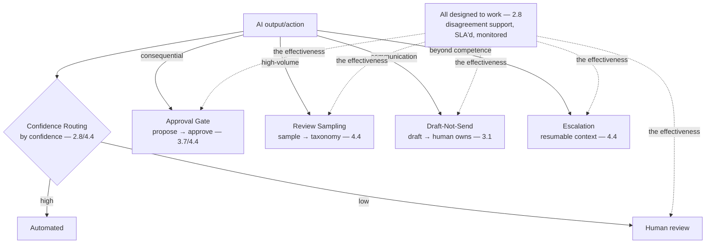

# Chapter 7.5 — Human-in-the-Loop Patterns

| | |
|---|---|
| **Part** | 7 — Enterprise AI Architecture Patterns |
| **Maturity level** | 4 — Architect |
| **Difficulty** | Advanced |
| **Estimated study time** | 3 hours (reading 90 min, exercise 90 min) |
| **Prerequisites** | [3.1 LLM Capabilities & Limits](../part-3-core-building-blocks-of-genai/chapter-01-llm-capabilities-limits.md); [4.4](../part-4-enterprise-genai-systems/chapter-04-agent-architectures-production.md); [2.8](../part-2-artificial-intelligence/chapter-08-responsible-ai.md) |

## Learning Objectives

After this chapter you will be able to:

1. Apply the human-in-the-loop pattern family in pattern-language form: approval gate, review sampling, escalation, confidence-based routing, and draft-not-send.
2. Select the HITL pattern matched to the oversight need, using each pattern's context, forces, and consequences.
3. Design human oversight that works, avoiding the rubber-stamp (2.8/4.4) and the bottleneck.
4. Recognize the HITL patterns in the case studies, the oversight that makes probabilistic systems deployable.

## Introduction

This chapter catalogs the human-in-the-loop pattern family — the human-oversight patterns that Parts 3–4 built (3.1's capability limits demanding oversight, 4.4's approval queues, 2.8's oversight-that-works), in pattern-language form (7.1). These are the patterns that make probabilistic systems (3.1) deployable by keeping humans in the loop where the stakes demand it, and this chapter is the reference for the oversight patterns — designed to work (2.8's oversight-effectiveness), not rubber-stamp.

The framing: **human-in-the-loop patterns keep humans in the loop where the stakes demand, designed to work** — the patterns (approval gate, review sampling, escalation, confidence routing, draft-not-send) that place human oversight where the capability limits (3.1) and stakes (the consequential — 3.7, the regulated — 2.8) demand it, designed to be effective (2.8's disagreement support, not rubber-stamp) and not a bottleneck (4.4's SLA'd queues), and this chapter is the reference.

## Business Motivation

The human-in-the-loop patterns are what make probabilistic systems deployable in the high-stakes enterprise — the oversight that lets the enterprise deploy GenAI where the stakes demand human accountability (the consequential actions — 3.7, the regulated decisions — 2.8/4.14). Without effective HITL: the probabilistic system's errors (3.1) reach the consequential outcome un-caught (the hallucinated value acted on — 3.4, the wrong decision — 2.8), or the oversight is theater (the rubber-stamp — 2.8/4.4, the human approving at 97% without reviewing — the oversight that doesn't oversee). With effective HITL: the human catches the errors where the stakes demand (the approval gate on the consequential — 3.7, the review of the regulated — 2.8), designed to work (the disagreement support — 2.8, not rubber-stamp) and not a bottleneck (the SLA'd queues — 4.4). The business case is the deployability-and-accountability one: the effective HITL patterns make the probabilistic system deployable in the high-stakes enterprise (the human accountability where the stakes demand — 2.8/4.14's oversight obligations), designed to work (2.8's effectiveness) and not obstruct (4.4's SLA), and the HITL pattern family is the reference for the oversight that makes GenAI deployable where it matters most.

## Theory — The Human-in-the-Loop Pattern Catalog

### Pattern: Approval Gate

- **Context** — a consequential action the AI proposes but a human must approve (3.7's consequence gates, 4.4's approval queues).
- **Problem** — the consequential action that shouldn't execute on the AI's judgment alone (3.7 — the irreversible, the high-stakes).
- **Forces** — the automation (the speed) vs. the accountability (the human approval — 2.8), the queue latency (4.4).
- **Solution** — the AI proposes, the human approves before execution (3.7/4.4), with context-rich queue items (4.4 — what, why, cost-of-error), SLA'd (4.4), rubber-stamp-monitored (2.8/4.4 — seeded probes).
- **Structure** — AI proposes → approval queue (context-rich, SLA'd) → human approves → execute (4.4).
- **Consequences** — the human accountability on the consequential (2.8); the queue latency and the rubber-stamp risk (4.4 — SLA and monitoring).
- **Known uses** — Corvid's customs-filing approval (4.4), Vantora's password-reset gate (3.7), CS06 (RM copilot suitability approval).
- **Related** — Confidence Routing (the gate condition), the consequence gates (3.7), the tool sandbox (7.4).

### Pattern: Review Sampling

- **Context** — a high-volume output where full review is a bottleneck but no review is a risk (4.4/2.8).
- **Problem** — the volume that makes full review theater (the rubber-stamp — 2.8) but no review risky (4.4).
- **Forces** — the coverage vs. the cost (the sampling — 4.4), the risk (the un-sampled error).
- **Solution** — sample the outputs for human review (4.4's sampling policy — the disagreements, the outliers, the random baseline, the new-deploy windows), feeding the failure taxonomy (4.4).
- **Structure** — outputs → sampling policy → human review → failure taxonomy (4.4).
- **Consequences** — the coverage where it matters (the sampled) at the affordable cost; the un-sampled risk (accepted, monitored — 4.4).
- **Known uses** — the agent-fleet trajectory sampling (4.4), CS11 (product catalog enrichment quality sampling).
- **Related** — Approval Gate (the full-review alternative for the consequential), the eval sampling (4.7).

### Pattern: Escalation

- **Context** — a case the AI can't handle or shouldn't (the low-confidence, the out-of-scope, the high-stakes — 3.1/3.8).
- **Problem** — the case beyond the AI's competence that needs a human (3.1's capability limits, 3.6's refusal).
- **Forces** — the escalation (the human handling) vs. the context loss (4.4 — the escalation-as-log-dumping anti-pattern).
- **Solution** — the AI escalates with resumable context (4.4 — the trajectory summary, the blocking question, the state), the human resolves and the task resumes (4.4/4.6).
- **Structure** — AI (can't handle) → escalate (resumable context — 4.4) → human resolves → resume (4.6).
- **Consequences** — the human handling of the beyond-competence cases; the escalation quality (the resumable context, not log-dumping — 4.4).
- **Known uses** — Meridian's pharmacy-line escalation (3.6), CS02 (patient triage escalation to nurses), all designed-refusal systems (3.6).
- **Related** — Confidence Routing (the escalation trigger), the designed refusal (3.6), the checkpoint-and-resume (7.4).

### Pattern: Confidence-Based Routing

- **Context** — outputs of varying confidence where the low-confidence needs human review (3.1/2.8).
- **Problem** — the uniform treatment of varying-confidence outputs (the low-confidence treated as the high-confidence — the error reaches the outcome).
- **Forces** — the confidence signal quality vs. the routing (the low-confidence to human, the high-confidence automated).
- **Solution** — route by confidence (the high-confidence automated, the low-confidence to human review/approval — 2.8's confidence-based oversight, 4.4's evidence-based auto-approval).
- **Structure** — output + confidence → route (high → automate, low → human) (2.8/4.4).
- **Consequences** — the human review where the confidence is low (the risk-proportionate oversight); the confidence-signal quality (the calibration — 2.7).
- **Known uses** — Bellhaven's low-confidence extraction to underwriter review (3.4/4.4), Corvid's evidence-based auto-approval (4.4).
- **Related** — Approval Gate (the low-confidence route), Escalation (the low-confidence escalation), the calibration (2.7).

### Pattern: Draft-Not-Send

- **Context** — a communication or action the AI drafts but a human owns before it goes out (3.1's drafting, Kestrel's correspondence).
- **Problem** — the AI's output going out un-owned (the un-reviewed communication, the un-owned action — 3.1's consequential).
- **Forces** — the drafting value (the editing-cheaper-than-authoring — 3.1) vs. the human ownership (the final artifact owned by a human).
- **Solution** — the AI drafts, a human reviews/edits/owns before it goes out (3.1's draft-not-send, Kestrel's adjuster review).
- **Structure** — AI drafts → human reviews/edits/owns → send (3.1).
- **Consequences** — the drafting value (the editing-cheaper — 3.1) with the human ownership; the review effort (the human owns the final).
- **Known uses** — Kestrel's correspondence drafting (1.6/2.6), CS46 (HR case-management drafting), most customer-communication AI.
- **Related** — Approval Gate (the send-approval), Human review of the drafted output.

## Architecture Perspective

Readings. **The HITL patterns place oversight by the stakes and confidence** — the approval gate (the consequential — 3.7), the review sampling (the high-volume — 4.4), the escalation (the beyond-competence — 3.1), the confidence routing (the low-confidence — 2.8), the draft-not-send (the communication — 3.1) — each placing the human where the stakes and confidence demand (the risk-proportionate oversight — 2.8). **All designed to work, not rubber-stamp** — the effectiveness (2.8's disagreement support — the human sees what they need to disagree, the SLA'd queues — 4.4 avoiding the bottleneck, the rubber-stamp monitoring — 2.8/4.4's seeded probes, the auto-approval for the earned classes — 4.4) — the oversight designed to be effective (2.8's oversight-effectiveness), not the theater (the rubber-stamp — 2.8/4.4). **And the patterns combine** — a system combines the HITL patterns (the confidence routing gating to the approval gate for the low-confidence consequential, the draft-not-send with the approval gate — 7.1's combination), the oversight architecture as a combination of HITL patterns (matched to the stakes and confidence).

## Real-world Example

**Kestrel Assurance** (the recurring correspondence system — 1.6, 2.6) built its oversight as a HITL-pattern composition, and the composition is the human-in-the-loop pattern family applied with the effectiveness discipline. The draft-not-send pattern (3.1) was the core (the correspondence drafted, the adjuster reviews/edits/owns before sending — Kestrel's adjuster review — 1.6). The confidence routing (2.8/4.4) layered on (the low-confidence drafts to closer review, the high-confidence to lighter — the risk-proportionate). The approval gate (3.7/4.4) gated the consequential (the liability-line-flagged drafts to mandatory review — 4.8's guardrail-to-approval). The escalation (4.4) handled the beyond-competence (the complex claims the AI couldn't draft well escalated to senior adjusters with resumable context — 4.4). And the effectiveness discipline was central (2.8): the oversight was designed to work (the adjusters saw the draft, the flags, the source — the disagreement support — 2.8; the queues SLA'd — 4.4; the rubber-stamp monitored — 2.8/4.4's seeded probes — the deliberately-flawed draft catching the sail-throughs). The HITL-pattern composition was the oversight architecture: draft-not-send (the core) + confidence routing (the risk-proportionate) + approval gate (the consequential) + escalation (the beyond-competence) — all designed to work (2.8's effectiveness), not rubber-stamp — the oversight that made Kestrel's probabilistic correspondence system deployable (the human accountability where the regulatory stakes demanded — 2.8/4.14). Marta's HITL-patterns note: *"Our correspondence oversight is a HITL-pattern composition: draft-not-send (the adjuster owns the letter), confidence routing (the low-confidence to closer review), approval gate (the liability-flagged to mandatory review), escalation (the complex to senior adjusters). All designed to work — the disagreement support (2.8 — the adjuster sees the draft, flags, source), the SLA'd queues (4.4 — not a bottleneck), the rubber-stamp monitoring (the seeded probes catching the sail-throughs). The HITL patterns are what made the probabilistic system deployable — the human accountability where the stakes demanded, designed to be effective, not theater. That's the oversight that makes GenAI deployable where it matters: place the human by the stakes, and design the oversight to actually oversee."*

## Hands-on Exercise

**Compose human-in-the-loop patterns.** ~90 minutes. For a GenAI system with oversight needs (real or a case study).

1. **Oversight-need analysis (25 min).** For a GenAI system, analyze the oversight needs by stakes and confidence: what's consequential (needs an approval gate), high-volume (needs review sampling), beyond-competence (needs escalation), varying-confidence (needs confidence routing), communication (needs draft-not-send). Map the needs to the patterns.
2. **The pattern-language form (20 min).** For one selected pattern, write its full pattern-language form.
3. **The effectiveness design (30 min).** For the oversight, design the effectiveness (2.8): the disagreement support (what the human sees to disagree), the SLA (the queue not a bottleneck — 4.4), the rubber-stamp monitoring (the seeded probes — 2.8/4.4), the auto-approval for the earned classes (4.4). Show how it avoids the rubber-stamp and the bottleneck.
4. **The composition (15 min).** Compose the HITL patterns into the oversight architecture (matched to the stakes and confidence), all designed to work.

**Acceptance criteria:**
- [ ] Oversight needs mapped to the HITL patterns (by stakes and confidence)
- [ ] One pattern in the full pattern-language form
- [ ] The effectiveness designed (disagreement support, SLA, rubber-stamp monitoring, auto-approval — 2.8/4.4)
- [ ] The oversight architecture as a HITL-pattern composition, designed to work

## Enterprise Considerations

The human-in-the-loop patterns are the enterprise's oversight reference, connecting to the responsible-AI and compliance obligations. **They're the oversight reference** (2.8/4.14/7.1): the HITL pattern family is the enterprise's reference for the human oversight (2.8's oversight-that-works, 4.14's oversight obligations), the patterns that make the probabilistic systems deployable in the high-stakes enterprise. **They meet the responsible-AI and compliance oversight obligations** (2.8/4.14): the HITL patterns are how the enterprise meets the human-oversight obligations (2.8's high-risk-tier oversight, 4.14's compliance oversight), so the HITL patterns are compliance-and-responsible-AI controls (the oversight the regulations require — 2.8/4.14). **The effectiveness is a governance concern** (2.8/6.9): the oversight-effectiveness (2.8 — the rubber-stamp monitoring, the disagreement support) is governed (6.9 — the regulators test the oversight effectiveness — 2.8), so the HITL patterns' effectiveness is a governance concern (the effective oversight, not theater). **And the supervision cost is a business-case line** (4.4/6.10): the HITL patterns' human cost (the review queues, the approval — 4.4's supervision cost) is a business-case line (6.10's organizational TCO — the supervision as real headcount — 4.4), so the HITL patterns connect to the business case (the supervision cost priced — 6.10).

## Trade-offs

| Decision | Option A | Option B | Choose A when… | Choose B when… |
|----------|----------|----------|----------------|----------------|
| Oversight for the consequential | Approval gate (full review) | Confidence routing (sampled) | The action is high-stakes/irreversible (3.7) | The volume makes full review theater and the confidence signal is good (4.4) |
| High-volume oversight | Review sampling | Full review | The volume makes full review a bottleneck (4.4) | Low volume, high stakes — full review affordable |
| Oversight effectiveness | Designed to work (disagreement support, monitoring) | Rubber-stamp (nominal human) | Always — the effective oversight (2.8) | Never rubber-stamp; the theater fails the obligations (2.8/4.14) |
| Auto-approval | Evidence-based for earned classes (4.4) | Human approval for all | The class has earned it (the sustained zero-edit — 4.4) | Early life, new classes, regulated — human approval (4.4) |

## Common Mistakes

1. **The rubber-stamp** — the nominal human oversight (the 97%-approval-in-5-seconds — 2.8/4.4), the theater; the effective oversight (2.8 — the disagreement support, the rubber-stamp monitoring).
2. **The bottleneck** — the oversight queue that backs up (the un-SLA'd approval — 4.4), the velocity killer; the SLA'd queues (4.4), the auto-approval for the earned classes (4.4).
3. **Escalation-as-log-dumping** — the escalation handing the human raw context (4.4); the resumable context (the trajectory summary, the blocking question — 4.4).
4. **Uniform treatment of varying confidence** — the low-confidence treated as the high-confidence (the error reaches the outcome); the confidence routing (2.8/4.4).
5. **No oversight on the consequential** — the consequential action on the AI's judgment alone (3.7); the approval gate (3.7/4.4).
6. **The un-owned communication** — the AI's communication going out un-owned (3.1); the draft-not-send (3.1 — the human owns the final).
7. **Ignoring the supervision cost** — the HITL patterns' human cost un-priced (4.4/6.10); the supervision cost in the business case (6.10's organizational TCO).

## Best Practices

1. **Place the oversight by the stakes and confidence** — the approval gate (the consequential — 3.7), the review sampling (the high-volume — 4.4), the escalation (the beyond-competence — 3.1), the confidence routing (the low-confidence — 2.8), the draft-not-send (the communication — 3.1).
2. **Design the oversight to work** — the disagreement support (2.8 — what the human sees to disagree), the SLA (4.4 — not a bottleneck), the rubber-stamp monitoring (2.8/4.4 — seeded probes), the auto-approval for the earned classes (4.4).
3. **Make escalation resumable** — the resumable context (4.4 — the trajectory summary, the state), not log-dumping.
4. **Route by confidence** — the low-confidence to human, the high-confidence automated (2.8/4.4), with the calibrated confidence signal (2.7).
5. **Own the communication with draft-not-send** — the human owns the final artifact (3.1), the drafting value (the editing-cheaper — 3.1).
6. **Monitor the oversight effectiveness** — the rubber-stamp monitoring (2.8/4.4 — the seeded probes, the approval rates), the governance concern (6.9).
7. **Price the supervision cost** — the HITL human cost in the business case (4.4/6.10's organizational TCO).

## Architecture Checklist

For applying the human-in-the-loop patterns:

- [ ] The oversight placed by the stakes and confidence (approval gate — consequential, review sampling — high-volume, escalation — beyond-competence, confidence routing — low-confidence, draft-not-send — communication)
- [ ] The oversight designed to work (disagreement support — 2.8, SLA'd queues — 4.4, rubber-stamp monitoring — 2.8/4.4, auto-approval for earned classes — 4.4)
- [ ] Escalation resumable (the context, not log-dumping — 4.4)
- [ ] Confidence routing with a calibrated signal (2.7)
- [ ] The oversight-effectiveness monitored (the rubber-stamp monitoring — governance — 6.9)
- [ ] The supervision cost priced (the business case — 4.4/6.10)
- [ ] The HITL patterns meet the responsible-AI and compliance oversight obligations (2.8/4.14)

## Interview Questions

1. *"Walk me through the human-in-the-loop patterns and when you'd use each."* — Strong answers give the family (approval gate — the consequential, review sampling — the high-volume, escalation — the beyond-competence, confidence routing — the low-confidence, draft-not-send — the communication), each placing the human by the stakes and confidence (the risk-proportionate oversight — 2.8).
2. *"How do you design human oversight that works, not rubber-stamps?"* — Strong answers give the effectiveness (2.8 — the disagreement support, the human sees what they need to disagree; the SLA'd queues — 4.4, not a bottleneck; the rubber-stamp monitoring — 2.8/4.4, the seeded probes; the auto-approval for the earned classes — 4.4), the oversight designed to actually oversee (Kestrel's effectiveness).
3. *"How do you keep human oversight from becoming a bottleneck?"* — Strong answers give the SLA'd queues (4.4), the review sampling (4.4 — sample the high-volume, not full review), the confidence routing (2.8/4.4 — only the low-confidence to human), and the auto-approval for the earned classes (4.4 — the sustained zero-edit classes) — the oversight scaled without the bottleneck.
4. *"How do you compose HITL patterns into an oversight architecture?"* — Strong answers give the composition (draft-not-send + confidence routing + approval gate + escalation — matched to the stakes and confidence — 7.1's combination), all designed to work (2.8's effectiveness), Kestrel's correspondence oversight.

## Further Reading

- 2.8 Responsible AI (the oversight-that-works, the disagreement support), 4.4 Agent Architectures (the approval queues, the rubber-stamp monitoring) — the chapters this pattern family formalizes.
- The human-computer-interaction and human-AI-teaming literature (the automation-bias and decision-support research) — the oversight-effectiveness basis (2.8's disagreement support).
- 3.1 LLM Capabilities & Limits (the capability limits demanding oversight) and 3.6 RAG Fundamentals (the designed refusal) — the source of the oversight need.
- The [case studies](../../case-studies/README.md) — the HITL patterns' known uses (the high-stakes case studies).

## Summary

- The **human-in-the-loop pattern family** places human oversight by the stakes and confidence — approval gate (the consequential — 3.7), review sampling (the high-volume — 4.4), escalation (the beyond-competence — 3.1), confidence routing (the low-confidence — 2.8), draft-not-send (the communication — 3.1) — the oversight that makes probabilistic systems (3.1) deployable.
- **All designed to work, not rubber-stamp** — the effectiveness (2.8's disagreement support, the SLA'd queues — 4.4, the rubber-stamp monitoring — 2.8/4.4's seeded probes, the auto-approval for the earned classes — 4.4) — the oversight designed to actually oversee (2.8's oversight-effectiveness).
- The patterns **combine into the oversight architecture** — the confidence routing gating to the approval gate, the draft-not-send with the approval gate (7.1's combination) — matched to the stakes and confidence (Kestrel's correspondence oversight).
- The HITL patterns **meet the responsible-AI and compliance oversight obligations** (2.8/4.14) — the oversight the regulations require, the effectiveness a governance concern (6.9), the supervision cost a business-case line (6.10).
- The HITL patterns are the enterprise's **oversight reference** — the patterns that make GenAI deployable where the stakes demand human accountability, designed to be effective. The safety patterns that constrain the AI's outputs and actions are next: **safety & guardrail patterns** (7.6).

---

**Previous:** [Chapter 7.4 — Agentic Patterns](chapter-04-agentic-patterns.md) · **Next:** [Chapter 7.6 — Safety & Guardrail Patterns](chapter-06-safety-guardrail-patterns.md) · **Related:** [2.8 Responsible AI](../part-2-artificial-intelligence/chapter-08-responsible-ai.md), [4.4 Agent Architectures](../part-4-enterprise-genai-systems/chapter-04-agent-architectures-production.md), [4.8 Guardrails & Content Safety](../part-4-enterprise-genai-systems/chapter-08-guardrails-content-safety.md)
