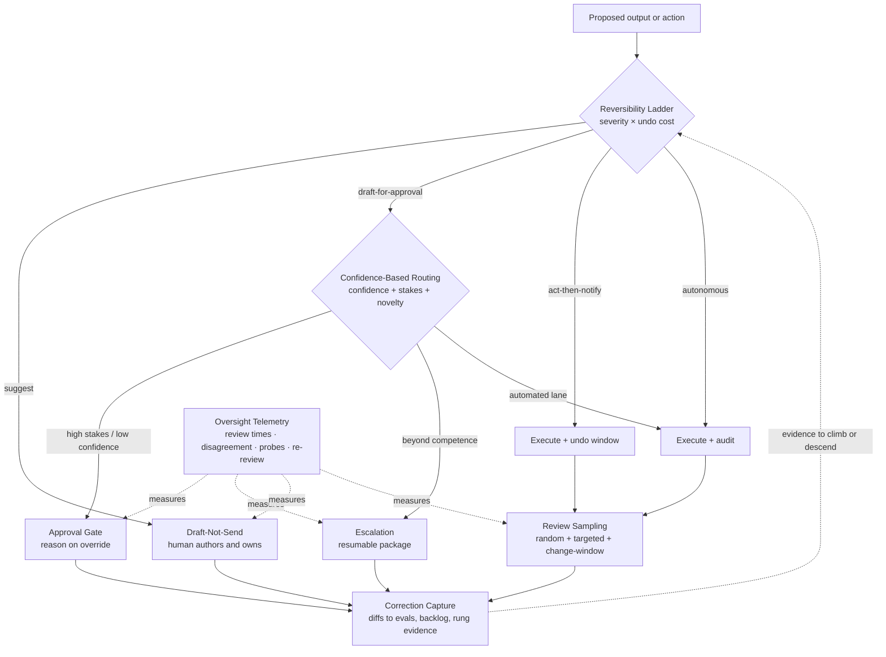

# Chapter 7.5 — Human-in-the-Loop Patterns

| | |
|---|---|
| **Part** | 7 — Enterprise AI Architecture Patterns |
| **Maturity level** | 4 — Architect |
| **Difficulty** | Advanced |
| **Estimated study time** | ~1 hour 40 min (reading ~40 min, exercise ~60 min) |
| **Prerequisites** | [3.1 LLM Capabilities & Limits](../part-3-core-building-blocks-of-genai/chapter-01-llm-capabilities-limits.md); [4.4](../part-4-enterprise-genai-systems/chapter-04-agent-architectures-production.md); [2.8](../part-2-artificial-intelligence/chapter-08-responsible-ai.md) |

## Learning Objectives

After this chapter you will be able to:

1. Apply the human-in-the-loop pattern family in pattern-language form: Reversibility Ladder, Approval Gate, Draft-Not-Send, Escalation, Confidence-Based Routing, Review Sampling, Oversight Telemetry, and Correction Capture.
2. Choose an action's autonomy rung from two independent inputs — consequence severity and undo cost — not from how confident the model appears.
3. Detect rubber-stamping with evidence (review-time distributions, disagreement trends, seeded probes, sampled re-review) and design against it.
4. Size the human tier as an architectural constraint: escalation rate × review time is a headcount number that belongs in the business case.
5. Convert human corrections into labeled evaluation data rather than audit-log exhaust.

## Introduction

Every other component in an AI architecture fails by breaking. The human tier fails by *agreeing*. A reviewer who approves everything leaves the same records as one who reads everything, costs more than the automation they supervise, and supplies confidence the organization has not earned — worse than no gate, because an ungated system is at least known to be ungated.

That asymmetry organizes the family. **Placement patterns** decide where the human sits — Approval Gate, Draft-Not-Send, Escalation, Confidence-Based Routing, Review Sampling — and most designs get placement roughly right. **Integrity patterns** decide whether the human is actually looking — Oversight Telemetry, Correction Capture — and their absence is the standard review finding. Upstream of both sits the Reversibility Ladder, answering what placement assumes settled: how much autonomy has this action earned?

Two facts about people constrain the rest. Attention is finite and depletes across a shift. And vigilance decays fastest where automation performs best — the long run of correct outputs that makes a system valuable is the run that teaches its reviewer to stop reading.

## Business Motivation

The human tier is usually the most expensive component in a GenAI system and the only one that cannot be scaled by editing a config value. Its cost is arithmetic owed to the business case before the design review. A workflow handling 10,000 items a day that escalates 30% at 8 minutes each consumes 400 review-hours daily; against a realistic 5–6 hours of sustained review per person-day, that is roughly 70 reviewers. This is not an operations detail discovered in month four — it is frequently the dominant [TCO](../../GLOSSARY.md) line ([6.10](../part-6-enterprise-architecture/chapter-10-tco-business-case.md)), and halving review time through queue design is worth more than any model upgrade on the table.

The second cost is unbudgeted: false assurance. When Corvid's declaration-approval queue reached 96% approval, it was still fully staffed and fully paid — it had simply stopped catching anything ([4.4](../part-4-enterprise-genai-systems/chapter-04-agent-architectures-production.md)). The organization was buying the cost of oversight and the risk of none, at once. Regulators test the same seam: high-risk-tier obligations ask whether oversight is *effective*, not whether a human appears in the flow diagram ([2.8](../part-2-artificial-intelligence/chapter-08-responsible-ai.md), [4.14](../part-4-enterprise-genai-systems/chapter-14-privacy-compliance-governance.md)). A gate that cannot evidence its own effectiveness is a liability wearing a control's uniform.

## Theory — The Human-in-the-Loop Pattern Catalog

### Choosing the rung

#### Pattern: Reversibility Ladder

- **Context** — a capability about to receive autonomy, where "human in the loop or not" is being argued as a binary.
- **Problem** — the binary is wrong both ways: reviewing trivially reversible actions burns attention needed elsewhere; automating irreversible ones is a wager on a probabilistic system.
- **Forces** — consequence severity vs. undo cost, which are independent (a wrong deletion is severe *because* undo is impossible; a wrong draft sentence is cheap because the writer deletes it); velocity vs. accountability; and the organizational pull toward the highest rung the demo appeared to support.
- **Solution** — place each action class on four explicit rungs and justify the choice. **Suggest**: output appears, human takes or ignores it. **Draft-for-approval**: nothing happens until a human commits. **Act-then-notify**: it executes, the human is told, a real undo window exists. **Autonomous**: executes silently, audited afterward. Climbing requires a measured error rate for that class plus an owner who accepts the residual risk; descending is always available and is not a failure.
- **Structure** — action class → severity × undo-cost assessment → rung → the placement pattern implementing it.
- **Consequences** — attention concentrates where it changes outcomes, because cheap-to-undo actions stop consuming it. Costs: per-class design work, and an uncomfortable conversation about who signs for each rung. Act-then-notify is the commonly botched rung — honest only if the undo path is implemented and tested, not merely described.
- **Known uses** — mail clients offering a short "undo send" window instead of a pre-send confirmation; editors that auto-format on save while dependency-update bots open a pull request rather than pushing to the default branch; spam filters that quarantine rather than delete.
- **Related** — every placement pattern below; consequence classes ([3.7](../part-3-core-building-blocks-of-genai/chapter-07-function-calling-tool-use.md)); the tool sandbox (7.4).

### Placement patterns — where the human sits

#### Pattern: Approval Gate

- **Context** — an action on the draft-for-approval rung: a payment released, a filing submitted, a record written to a system of authority.
- **Problem** — the action must not execute on the model's judgment alone, and the approval must be a decision rather than a reflex.
- **Forces** — throughput vs. scrutiny; queue latency vs. batching (reviewers are faster per item in a batch and worse per item late in a long one); and the decisive one, effort asymmetry — approving is a click, rejecting is an argument, so the default drifts toward approval unless the design fights it.
- **Solution** — the model proposes, a human commits. The queue item carries the proposed action, its evidence, the model's uncertainty, and the cost of being wrong. Rejection costs what approval costs, and overrides in either direction record a short reason. Classes with sustained error-free history earn value-capped auto-approval, leaving the queue its judgment-requiring residue ([4.4](../part-4-enterprise-genai-systems/chapter-04-agent-architectures-production.md)).
- **Structure** — propose → queue (evidence, uncertainty, blast radius, SLA) → approve / reject-with-reason → execute → outcome logged against the decision.
- **Consequences** — accountability lands on a named person and the audit trail is genuine. The costs are blunt: reviewer capacity becomes a hard throughput ceiling, queue latency is added to every gated action, and this is the family's most rubber-stampable pattern precisely because approval is the low-effort path. A gate without Oversight Telemetry is unfalsifiable.
- **Known uses** — pharmacist verification of prescriber orders before dispensing; branch protection requiring a reviewer's approval before merge; step-up authentication holding a flagged card transaction until the cardholder confirms. *Worked instance (fictional):* Corvid's declaration-submission gate ([4.4](../part-4-enterprise-genai-systems/chapter-04-agent-architectures-production.md)).
- **Related** — Confidence-Based Routing (chooses which items arrive); Reversibility Ladder (decides whether a gate is the right rung); Oversight Telemetry (the only proof it works).

#### Pattern: Draft-Not-Send

- **Context** — the suggest rung applied to authored artifacts: correspondence, reports, clinical notes, code, translations.
- **Problem** — generated text is fluent enough to be adopted without being read, and once it goes out under a person's name the organization owns it.
- **Forces** — drafting economics (editing is cheaper than authoring — [3.1](../part-3-core-building-blocks-of-genai/chapter-01-llm-capabilities-limits.md)) vs. anchoring: a plausible draft narrows what the human considers, so the assistant's errors become the human's more often than an independent-review model predicts. Fluency also masks uncertainty — the draft reads equally confident where it is guessing.
- **Solution** — make the human the author, not the approver: the artifact opens in an editable surface, editing is the normal path rather than a rejection, and nothing leaves without a deliberate send. Uncertain spans are marked and generated claims carry sources, so the human can check instead of trust. Where the artifact enters a record of consequence, sign-off is explicit and attributed.
- **Structure** — generate → editable surface (uncertainty marked, sources attached) → human edits and owns → send → edit deltas retained.
- **Consequences** — throughput rises without transferring authorship to the model, and the edit stream is the family's richest feedback signal. Cost: review time never reaches zero and should not — a drafting tool whose users have stopped editing is an unmonitored autonomous system with a person's name on the output. Anchoring means the pattern cuts effort more reliably than it cuts error.
- **Known uses** — inline sentence completion in mail clients (Gmail's Smart Compose) and inline code suggestion in IDEs (GitHub Copilot), where a suggestion is offered and the human accepts, edits, or ignores it; ambient clinical documentation tools requiring clinician review and attestation before a note enters the record; machine-translation post-editing as a defined production tier. *Worked instance (fictional):* Kestrel's adjuster correspondence ([1.6](../part-1-professional-foundation/chapter-06-requirements-stakeholders.md)).
- **Related** — Approval Gate (when a second person is needed, not just an author); Correction Capture (consumes the edit deltas); Confidence-Based Routing (sets how closely a draft is read).

#### Pattern: Escalation

- **Context** — a case the system cannot handle or should not attempt: outside its knowledge, outside its authority, or serious enough that a person must own it.
- **Problem** — the handoff discards everything already established, so the human restarts from zero while the user repeats themselves — and a costly, humiliating escalation path teaches everyone to avoid escalating.
- **Forces** — escalation rate vs. human capacity, the throughput equation in its rawest form; handoff completeness vs. handoff length — dumping a raw trajectory is as unhelpful as sending nothing, and the reviewer pays the difference in reading time.
- **Solution** — escalate with a resumable package: what the user wants, what was established, the specific blocking question, and the state needed to continue. The receiving human resolves and the work resumes rather than restarts. Refusal is designed as a routed action — "I can't answer that; here is who can, one tap" — so escalation is a service rather than a dead end ([3.6](../part-3-core-building-blocks-of-genai/chapter-06-rag-fundamentals.md)).
- **Structure** — detect (low confidence ∨ out of scope ∨ policy ∨ user request) → package context → route to the right skill tier → resolve → resume, resolution recorded.
- **Consequences** — hard cases reach competent people quickly, and the escalation stream is a free backlog of what the system cannot yet do. The underestimated costs: escalation rate directly sets specialist headcount; escalations arrive in the bursts that already stress the human tier; a rate drifting upward after a model change is a silent staffing problem. Escalation targets are usually the scarcest people in the organization.
- **Known uses** — contact-centre warm transfer, where the assistant's transcript and case context travel with the customer to a live agent; nurse triage lines receiving routed patient questions; tiered technical support with a documented handoff record. *Worked instance (fictional):* Meridian's clinical pharmacology routing ([3.6](../part-3-core-building-blocks-of-genai/chapter-06-rag-fundamentals.md)).
- **Related** — Confidence-Based Routing (the usual trigger); checkpoint-and-resume (7.4); designed refusal ([3.6](../part-3-core-building-blocks-of-genai/chapter-06-rag-fundamentals.md)).

#### Pattern: Confidence-Based Routing

- **Context** — high-volume output where quality varies item to item and reviewer attention must be allocated rather than spread.
- **Problem** — uniform treatment spends scarce attention on items that did not need it while giving hard ones no more scrutiny than easy ones.
- **Forces** — signal reliability vs. the consequence of trusting it, and this is the pattern's honest weakness: self-reported model confidence is often poorly [calibrated](../../GLOSSARY.md), and confidently wrong outputs are exactly what routing sends down the automated lane. Stakes and novelty are independent axes, and frequently better predictors of where review pays.
- **Solution** — route on a composite of confidence, stakes, and novelty. High-confidence, low-stakes, familiar items automate; anything high-stakes is reviewed regardless of confidence; anything novel — new document type, new segment, the weeks after a model or prompt change — is reviewed regardless of confidence. Prefer verifiable signals (retrieval score, schema validation, a cross-check against a system of record) over the model's self-estimate, and recalibrate thresholds against measured error rates on every change ([2.7](../part-2-artificial-intelligence/chapter-07-evaluating-ml-systems.md)).
- **Structure** — output + signals → route (automate / light review / full review / gate) → outcome logged with the routing decision → periodic calibration check, including a sampled audit of the automated lane.
- **Consequences** — review capacity concentrates where it changes outcomes, the single largest lever on the throughput equation. Costs: the fast lane is seen by no human, so its error rate must be sampled or it is unknown; thresholds decay silently as inputs shift; and a miscalibrated signal turns an oversight design into a filter that reliably hides its own mistakes.
- **Known uses** — document capture and payment processing, where fields below a recognition-confidence threshold route to human keying while the rest post automatically; spam filtering routing by score to inbox, quarantine, or block; content moderation where classifiers auto-action clear cases and queue borderline ones for human reviewers. *Worked instance (fictional):* Bellhaven's low-confidence extractions to underwriter review ([3.4](../part-3-core-building-blocks-of-genai/chapter-04-structured-outputs.md)).
- **Related** — Review Sampling (measures the automated lane); Escalation and Approval Gate (the review destinations); [calibration](../../GLOSSARY.md) ([2.7](../part-2-artificial-intelligence/chapter-07-evaluating-ml-systems.md)).

#### Pattern: Review Sampling

- **Context** — volume at which full review is arithmetically impossible, and the real choice is between honest partial coverage and pretended total coverage.
- **Problem** — no review means customers find the errors; nominal full review at volume means seconds per item, which is not review.
- **Forces** — statistical coverage vs. cost; random sampling (defensible, estimates the true rate) vs. targeted sampling (finds more defects, estimates nothing). Both are needed, and mixing them without labels corrupts both purposes.
- **Solution** — a written policy with named strata: a **random** slice sized to bound the error estimate, a **targeted** slice (low-confidence, high-value, unusual, complained-about), and a **change-window** slice after every model, prompt, or corpus change. Findings land in a shared failure taxonomy rather than individual tickets, so patterns become visible ([4.7](../part-4-enterprise-genai-systems/chapter-07-evaluation-systems.md)). Residual risk on the unsampled majority is stated and accepted by a named owner.
- **Structure** — population → strata (random / targeted / change-window) → reviewer queue → findings → taxonomy → fixes and [eval](../../GLOSSARY.md) cases.
- **Consequences** — a defensible error-rate estimate for a fixed, plannable review budget, plus a steady supply of real failure examples. Costs: sampling reviewers see mostly correct output, the strongest driver of automation bias there is, so this pattern needs seeded probes more than any other; and the honest answer to "did we catch every error?" becomes "no — here is our measured rate", which some sponsors need preparing for.
- **Known uses** — technology-assisted review in e-discovery, where a human-reviewed validation sample is the accepted evidence that a classifier's cutoff is defensible; contact-centre quality monitoring scoring a sampled percentage of interactions; acceptance sampling in manufacturing quality control, the discipline this pattern borrows from. *Worked instance (fictional):* Averline's catalog-enrichment sampling ([CS11](../../case-studies/cs11-product-catalog-enrichment.md)).
- **Related** — Confidence-Based Routing (defines the strata); Oversight Telemetry (watches the samplers); the Exploration Slice ([7.11](chapter-11-predictive-scoring-patterns.md) — the classical-lane sibling).

### Integrity patterns — what keeps the human tier real

#### Pattern: Oversight Telemetry

- **Context** — any deployed oversight mechanism whose effectiveness is currently asserted rather than measured.
- **Problem** — automation bias is not a character flaw but the predictable result of asking a person to check a system that is usually right. Rubber-stamping therefore emerges over time in mechanisms that worked at launch, and it emerges invisibly: a stamping reviewer and a diligent one leave identical approval records.
- **Forces** — measuring reviewers vs. trusting them (these metrics are performance-adjacent employee data with real consultation and privacy implications — [1.6](../part-1-professional-foundation/chapter-06-requirements-stakeholders.md), [4.14](../part-4-enterprise-genai-systems/chapter-14-privacy-compliance-governance.md)); and a diagnostic ambiguity — a falling disagreement rate means an improving model *or* a decaying reviewer, and the two demand opposite responses.
- **Solution** — instrument the oversight, not just the model. Track **review-time distributions** (the left tail is the signal: decisions faster than the item can be read), **disagreement rate per reviewer and per class** as a trend, **seeded probes** — deliberately flawed items injected at a low rate, whose catch rate directly measures the mechanism — and **sampled re-review**, a second reviewer independently judging approved items. Design against the bias too: surface uncertainty instead of a bare conclusion, show the evidence needed to disagree, require a stated reason on override. Treat findings as design defects — better queue UX or a raised auto-approval threshold, never continued theatre.
- **Structure** — oversight events → telemetry (time, verdict, edits, reasons) + probe injection + re-review sample → effectiveness dashboard with thresholds → scheduled review of the *mechanism*.
- **Consequences** — the gate becomes falsifiable and its effectiveness becomes evidence an auditor can be shown. Costs: probes consume reviewer time on work that was never real, re-review multiplies cost on the sampled slice, and the metrics need a governance agreement — published as system-quality measurement, not individual surveillance, or reviewers will resist and game them. Expect the first honest measurement to be uncomfortable.
- **Known uses** — the human-factors research tradition on automation bias, which established that unsupported monitors of reliable automation miss errors at high rates; hospital programmes measuring alarm response and alarm-fatigue indicators; disengagement reporting required of automated-vehicle testing, which measures the human supervisor rather than the system. *Worked instance (fictional):* Corvid's seeded probes catching two sail-throughs ([4.4](../part-4-enterprise-genai-systems/chapter-04-agent-architectures-production.md)).
- **Related** — every placement pattern (each needs this); oversight effectiveness ([2.8](../part-2-artificial-intelligence/chapter-08-responsible-ai.md)); governance reporting ([6.9](../part-6-enterprise-architecture/chapter-09-architecture-governance.md)).

#### Pattern: Correction Capture

- **Context** — an oversight mechanism already producing thousands of human judgements a month: approvals, rejections, edits, escalation resolutions.
- **Problem** — those judgements are the most expensive labels the organization will ever buy, and by default they land in an audit log nobody reads — so the system repeats a mistake indefinitely while people are paid to catch it each time.
- **Forces** — capture richness vs. reviewer burden (every field is time multiplied by volume, and mandatory free-text justification degrades into "ok" within weeks); label quality vs. quantity — reviewers are not infallible annotators, and their corrections carry the same automation bias the telemetry watches for.
- **Solution** — capture the *diff*, not just the verdict: what changed, plus a reason from a short structured taxonomy with optional free text. Route corrections to three destinations — the [evaluation](../../GLOSSARY.md) set as regression cases, the prompt and retrieval backlog as fixes, and rung evidence showing whether a class has earned more autonomy. Close the loop visibly: reviewers who see their corrections change behaviour keep correcting carefully; those who see nothing happen stop bothering.
- **Structure** — human decision → diff + structured reason → triage → eval cases ∥ backlog items ∥ rung evidence → effect reported back to reviewers.
- **Consequences** — oversight cost partly converts into a durable asset, and rung promotions become evidence-based rather than optimistic. Costs: capture friction is charged to the scarcest resource in the system, triage must be staffed by someone with authority to act, and the correction set is biased toward what reviewers happen to notice — it complements a golden set, never replaces one.
- **Known uses** — suggestion acceptance and edit rates as the primary quality telemetry of code-completion assistants; post-editing distance in machine translation, used to price work and target engine improvement; moderation appeal reversals fed back as corrected labels.
- **Related** — Draft-Not-Send (richest correction source); Review Sampling (feeds the taxonomy); Reversibility Ladder (corrections are the evidence for climbing); eval architecture ([4.7](../part-4-enterprise-genai-systems/chapter-07-evaluation-systems.md)).

## Architecture Perspective

Three readings. **The ladder is upstream of placement** — most oversight arguments in design reviews are unstated disagreements about the rung; settle severity and undo cost first and the placement pattern follows. **Every path that bypasses a human ends at Review Sampling** — the automated lane is not the un-reviewed lane but the statistically reviewed one, and a fast lane without sampling has an unmeasured error rate by construction. **The loop closes or the design decays** — corrections feed evidence back to the ladder, which is how a system earns autonomy; without that arrow the rung never changes, review cost never falls, and the business case erodes as volume grows against fixed reviewer capacity.

## Real-world Example

**Kestrel Assurance** (the workplace-injury insurer of [1.6](../part-1-professional-foundation/chapter-06-requirements-stakeholders.md); fictional) built claims-correspondence drafting, and the instructive part is the year *after* launch. Placement was sound: Draft-Not-Send at the core (adjusters edit and send, owning the letter), Confidence-Based Routing setting review depth, an Approval Gate on liability-flagged drafts, Escalation to senior adjusters on complex claims. Placement was also not enough.

Month five brought the finding. Median review time on routed drafts had fallen from just over four minutes to under one, and edit rates had fallen with it — the team's first reading was that the model had improved, which was partly true and entirely convenient. Seeded probes settled it: a weekly injected draft carrying a materially wrong benefit period that any reading adjuster would catch. The first quarter's catch rate was under half. The response was three design changes, none of them a memo about diligence. The queue was rebuilt to show uncertainty and evidence rather than clean prose — the source policy clause beside every quoted figure, uncertain spans marked, and the independently computed benefit period displayed next to the drafted one. Rejection became one click, matching approval, with a four-code reason taxonomy. And the correction diffs, previously written to a table nobody read, were triaged weekly: the top reason code proved to be a single retrieval error affecting one policy family, fixed in a fortnight, which had been costing adjusters hundreds of small edits a month.

The capacity number moved too, which is what leadership cared about. Routing was re-cut on stakes and novelty rather than confidence alone, moving a large low-stakes class into light review and freeing the attention that made the remaining reviews genuine — review times on the gated class roughly doubled, which is what a working gate looks like. Reviewer headcount in the business case was revised upward once, honestly, then held flat as volume grew.

## Hands-on Exercise

**Design and stress-test a human-in-the-loop tier.** ~60 minutes. Use a system you know or a case study with real oversight needs.

1. **Rung assignment (10 min).** List 5–8 distinct action classes. Score consequence severity and undo cost separately for each, assign a rung, and name the evidence that would justify climbing one.
2. **Placement and capacity (20 min).** Choose the placement pattern implementing each rung. Then compute the tier: volume × review rate × minutes per review for each reviewed class, totalled and converted to reviewers at 5–6 sustained review hours per person-day. Write headcount and annual cost as a line item.
3. **Rubber-stamp design review (20 min).** Take the highest-volume reviewed class and specify: the seeded-probe design (what a probe looks like, injection rate, who owns the catch rate), two telemetry thresholds that would trip an investigation, and three concrete changes to what the reviewer sees — uncertainty, evidence, and a reason taxonomy of at most five codes.
4. **Close the loop (10 min).** Specify where corrections go: which become regression [eval](../../GLOSSARY.md) cases, which become backlog items, and what evidence would move one class up a rung within six months.

**Acceptance criteria:**
- [ ] Every action class has a rung, with severity and undo cost scored separately
- [ ] Reviewer headcount and annual cost computed from stated volume and review-time assumptions
- [ ] Seeded-probe design specified, including injection rate and the owner of the catch rate
- [ ] Two named telemetry thresholds that would trigger investigation
- [ ] Reviewer-facing changes name the uncertainty and evidence shown, plus a reason taxonomy of ≤5 codes
- [ ] Correction routing specified to evals, backlog, and rung evidence

## Enterprise Considerations

Three enterprise realities reshape these patterns. **Oversight metrics are employee data** — per-reviewer approval rates and decision times are performance-adjacent, and where works councils or equivalent bodies exist they are consultable before deployment, not after ([1.6](../part-1-professional-foundation/chapter-06-requirements-stakeholders.md), [4.14](../part-4-enterprise-genai-systems/chapter-14-privacy-compliance-governance.md)); governed as system-quality measurement with defined access the programme survives, framed as individual scorecards reviewers optimize the metric instead of the outcome. **Effectiveness is the audit question** — high-risk-tier regimes ask what oversight *achieved*, and the answerable form is probe catch rates, re-review agreement, and override reasons ([2.8](../part-2-artificial-intelligence/chapter-08-responsible-ai.md), [6.9](../part-6-enterprise-architecture/chapter-09-architecture-governance.md)). **The tier is an operational commitment, not a launch cost** — reviewer capacity needs a rota, holiday and attrition cover, a training pipeline for a domain-skilled role, and a surge plan, because escalation bursts correlate with the incidents already straining the organization. When review volume outgrows capacity there are two honest forks: raise the rung on classes with the evidence, or reduce input volume. Silently shrinking review time per item is the third, and it is how oversight becomes theatre without anyone deciding to make it so.

## Trade-offs

| Decision | Option A | Option B | Choose A when… | Choose B when… |
|----------|----------|----------|----------------|----------------|
| Autonomy rung | Draft-for-approval (gate) | Act-then-notify (undo window) | Severe consequence, or undo is expensive/impossible | Undo is cheap and tested, and gate latency would break the use case |
| Coverage at volume | Review Sampling with stated residual risk | Nominal full review | Volume forces per-item review under a minute | Volume is genuinely reviewable at the time the work needs |
| Routing signal | Model confidence | Stakes + novelty, confidence as one input | The signal is calibrated against measured error rates | Confidence is uncalibrated, or the costly errors are the confident ones |
| Rubber-stamp response | Fix the design (queue UX, uncertainty display, raise the rung) | Exhort reviewers to be diligent | Always — automation bias is structural, not attitudinal | Never; exhortation has no measurable half-life |
| Capacity shortfall | Raise the rung on evidenced classes, or cut input volume | Reduce review time per item | The evidence exists, or the volume is genuinely optional | Never deliberately — this is where theatre begins |

## Common Mistakes

1. **Rubber-stamping treated as a people problem** — it is the predictable output of asking humans to check reliable automation; the fixes are design fixes (uncertainty surfaced, evidence shown, reasons required, rung raised where earned), never reminders.
2. **The unmeasured gate** — no probes, no re-review, no review-time distribution; effectiveness is asserted, and asserted controls fail audits and incidents together.
3. **Falling disagreement read as success** — it means an improving model *or* a decaying reviewer, and only probes or sampled re-review distinguish them ([2.8](../part-2-artificial-intelligence/chapter-08-responsible-ai.md)).
4. **Unstaffed escalation** — a 30% escalation rate designed without the headcount to absorb it; the queue backs up, SLAs break, and the pressure resolves itself as approvals.
5. **Routing on uncalibrated confidence alone** — the automated lane fills with confidently wrong outputs and is never sampled, so the true error rate is unknown ([2.7](../part-2-artificial-intelligence/chapter-07-evaluating-ml-systems.md)).
6. **Escalation as log-dumping** — the raw trajectory pasted into a ticket; the receiving human pays in reading time, and the cost teaches the organization not to escalate.
7. **Corrections written and never read** — the most expensive labels in the system decaying in an audit table while the same defect is caught by hand every week.
8. **Supervision cost missing from the business case** — an "automated" workflow whose queue consumes 70 people is a 70-person workflow; sometimes an excellent trade, but only when priced ([6.10](../part-6-enterprise-architecture/chapter-10-tco-business-case.md)).
9. **Act-then-notify with a theoretical undo** — the rung is honest only if the undo path is implemented and tested.

## Best Practices

1. **Assign the rung before the pattern** — severity and undo cost scored separately per action class; placement then follows.
2. **Size the tier in the design review** — escalation rate × review time → hours → reviewers → annual cost, stated with assumptions and revisited when volumes move.
3. **Instrument the oversight, not only the model** — review-time distributions, disagreement trends by reviewer and class, seeded probes with an owned catch rate, sampled re-review.
4. **Show uncertainty and evidence, not conclusions** — the reviewer needs what they would need in order to disagree: sources, the contrary indicator, the independently computed value beside the generated one.
5. **Make rejection as cheap as approval** — one click, a short reason taxonomy, no social cost; asymmetric effort is the mechanical cause of drift toward approval.
6. **Sample every automated lane** — random for the estimate, targeted for the defects, change-window after every model, prompt, or corpus change, with residual risk accepted by a named owner.
7. **Route corrections where they change behaviour** — regression [evals](../../GLOSSARY.md), a triaged backlog, rung evidence — and report the effect back to the reviewers who produced them.
8. **Earn autonomy with evidence, and descend without shame** — climb on measured error rates for that class; drop the moment the evidence reverses.

## Architecture Checklist

For applying the human-in-the-loop patterns:

- [ ] Each action class has a rung, severity and undo cost scored separately, promotion evidence named
- [ ] Act-then-notify rungs have an implemented, tested undo path
- [ ] Reviewer capacity computed (rate × time → headcount) and carried as a [TCO](../../GLOSSARY.md) line ([6.10](../part-6-enterprise-architecture/chapter-10-tco-business-case.md))
- [ ] Queue items show uncertainty and evidence, not conclusions alone; rejection costs what approval costs
- [ ] Overrides record a reason from a short taxonomy, in both directions
- [ ] Seeded probes running, with an injection rate and a named owner of the catch rate
- [ ] Review-time and disagreement telemetry monitored against thresholds that trigger investigation
- [ ] Sampled re-review in place for the highest-volume reviewed class
- [ ] Every automated lane has a sampling policy and a named acceptor of residual risk
- [ ] Routing thresholds re-validated on model, prompt, or corpus change
- [ ] Escalations carry resumable context; escalation volume staffed, including surge
- [ ] Corrections routed to evals, backlog, and rung evidence, with the effect reported back
- [ ] Reviewer metrics governed as system-quality data, with any required consultation completed

## Interview Questions

1. *"Your approval queue runs at 98% approval with 5-second median decisions. Assess."* — Strong answers call it theatre and keep going: diagnose with seeded probes and sampled re-review to separate "model improved" from "reviewer stopped reading", then prescribe design fixes (uncertainty and evidence in the queue, symmetric reject cost, reason capture) and the honest fork of raising the rung on evidenced classes. Weak answers propose reviewer training.
2. *"How much does human oversight cost in your design?"* — Strong answers produce arithmetic unprompted — volume × review rate × minutes, converted to reviewers at realistic sustained review hours — and treat it as a first-class business-case line with a stated plan for when volume doubles.
3. *"How do you decide how much autonomy an action gets?"* — Strong answers separate consequence severity from undo cost, walk the four rungs, and name the evidence and accountable owner required to climb one. Bonus for an action they *lowered* a rung on after seeing data.
4. *"Your routing sends 70% of items straight through. How do you know that lane is safe?"* — Strong answers question the signal's calibration, note that confidently wrong outputs are exactly what such routing hides, and require random sampling of the automated lane as the only way its error rate becomes knowable.
5. *"Where do the human corrections go?"* — Strong answers name three destinations (regression evals, fix backlog, rung evidence), the low-friction capture design, and the feedback to reviewers that keeps correction quality high.

## Further Reading

- [2.8 Responsible AI](../part-2-artificial-intelligence/chapter-08-responsible-ai.md) — oversight as a component with metrics on the humans; the disagreement-support discipline the integrity patterns implement.
- [4.4 Agent Architectures in Production](../part-4-enterprise-genai-systems/chapter-04-agent-architectures-production.md) — approval queues as an engineered product: context-rich items, SLAs, seeded probes, evidence-based auto-approval, supervision cost.
- The human-factors literature on automation bias and complacency — Parasuraman & Riley on use, misuse, disuse and abuse of automation; Skitka and colleagues on automation-induced omission and commission errors. The empirical basis for the claims here about why undesigned review fails.
- [7.11 Predictive & Scoring Patterns](chapter-11-predictive-scoring-patterns.md) — the Exploration Slice, the classical-lane sibling of Review Sampling.
- [6.10 TCO & Business Case](../part-6-enterprise-architecture/chapter-10-tco-business-case.md) — where reviewer headcount belongs, and what an omitted line does to a case.
- The [GLOSSARY](../../GLOSSARY.md) — calibration, evals, and TCO as used here.

## Summary

- The family splits into **placement patterns** (Approval Gate, Draft-Not-Send, Escalation, Confidence-Based Routing, Review Sampling — where the human sits) and **integrity patterns** (Oversight Telemetry, Correction Capture — whether the human is looking), with the **Reversibility Ladder** upstream of both, setting the rung from consequence severity and undo cost.
- **Rubber-stamping is the central failure mode**, structural rather than attitudinal: reliable automation reliably erodes vigilance. Detect it with review-time distributions, disagreement trends, seeded probes, and sampled re-review; design against it by surfacing uncertainty, showing evidence, and requiring a reason on override.
- **Reviewer capacity is an architectural constraint** — escalation rate × review time is a headcount number and a business-case line. A design that escalates 30% at 8 minutes each is a hiring plan.
- **Selective review beats uniform review**, but confidence signals are themselves unreliable: route on stakes and novelty as well as confidence, and sample every automated lane, because an unsampled fast lane has an unmeasured error rate.
- **Corrections are the most expensive labels the organization buys** — capture the diff and a short reason, route them to evals, backlog, and rung evidence, and show reviewers the effect.
- Next: the patterns that constrain what the AI can output and do in the first place — **safety & guardrail patterns** (7.6).

---

**Previous:** [Chapter 7.4 — Agentic Patterns](chapter-04-agentic-patterns.md) · **Next:** [Chapter 7.6 — Safety & Guardrail Patterns](chapter-06-safety-guardrail-patterns.md) · **Related:** [2.8 Responsible AI](../part-2-artificial-intelligence/chapter-08-responsible-ai.md), [4.4 Agent Architectures](../part-4-enterprise-genai-systems/chapter-04-agent-architectures-production.md), [4.8 Guardrails & Content Safety](../part-4-enterprise-genai-systems/chapter-08-guardrails-content-safety.md)
