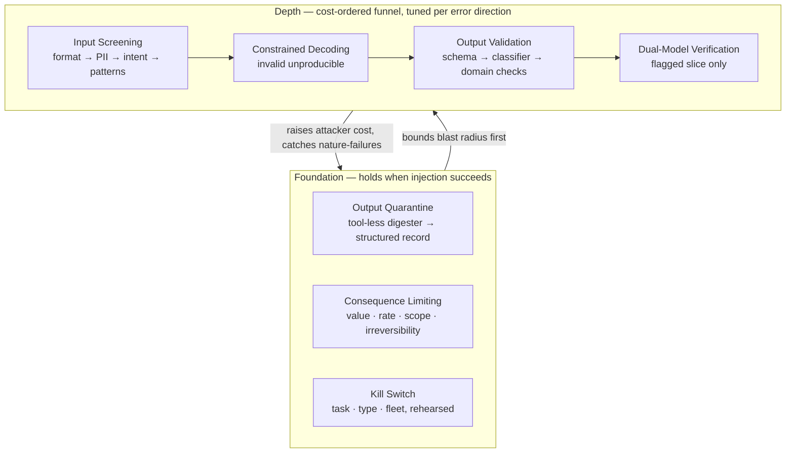

# Chapter 7.6 — Safety & Guardrail Patterns

| | |
|---|---|
| **Part** | 7 — Enterprise AI Architecture Patterns |
| **Maturity level** | 4 — Architect |
| **Difficulty** | Advanced |
| **Estimated study time** | 2 hours 10 min (reading 40 min, exercise 90 min) |
| **Prerequisites** | [4.8 Guardrails & Content Safety](../part-4-enterprise-genai-systems/chapter-08-guardrails-content-safety.md); [4.9](../part-4-enterprise-genai-systems/chapter-09-genai-security-threat-modeling.md) |

## Learning Objectives

After this chapter you will be able to:

1. Apply the safety & guardrail pattern family in pattern-language form: Layered Filters, Input Screening, Output Validation, Dual-Model Verification, Constrained Decoding, Output Quarantine, Consequence Limiting, and Kill Switch.
2. Distinguish patterns that work against *nature* (a model being wrong) from those that work against an *adversary* (a person iterating against you) — and stop spending the first kind on the second problem.
3. Order a guardrail stack by cost, map each control to the named threat it answers, and state every control's false-positive cost as a business number.
4. Say, for each pattern, when *not* to use it.

## Introduction

[Guardrails](../../GLOSSARY.md) act on every request, online, inside the latency budget, with no human in the moment. That is their power and the whole of their limit, and 4.9 states the limit in a sentence worth memorising: **"probabilistically resists a motivated adversary" is not a security boundary.** Delimiters, instruction-hierarchy training, and injection classifiers raise the attacker's cost; none close the gap, and you learn they failed between the demonstrations that make the news.

The extension that makes the doctrine usable rather than merely sobering: **the guardrail patterns divide by what they defend against.** Against *nature* — a hallucinated refund policy, a completion drifting into regulated advice, a PII field pasted into a prompt by a helpful employee — nothing iterates against your filter, the failure distribution is stationary, and a calibrated classifier really is a control. That is most guardrail work by volume, and it works. Against an *adversary* the same classifier is a rate-reducer, and the only controls that hold are those that keep working *after* the injection succeeds: quarantine, least privilege, limits, and the ability to stop.

Hence the order of construction: bound what a compromised component can reach, *then* layer filters for the nature-failures, the unsophisticated attacker, and the evidence trail. A guardrail stack bolted onto a system with a god-credential and ungated actions is not defence-in-depth. It is one layer of depth over nothing.

## Business Motivation

Both error directions cost money, and most teams price only one. Under-blocking is visible: a model's failure is a quality statistic, but the company's assistant saying it to a customer is a screenshot, a filing, sometimes a binding commitment. Over-blocking gets discovered by escalation instead of by dashboard — Bellhaven's advice-line check spent month two blocking 7% of legitimate traffic before the contact-centre director escalated; the fix reached 1.4% with recall intact, but the intervening weeks bled exactly the adoption the assistant existed to build. **Every guardrail's false-positive rate is a business metric with an owner**, not safety's acceptable price.

The economics favour layering over maximalism: a funnelled stack costs milliseconds and fractions of a cent per request because expensive judgment runs only on the risky slice, while one LLM checker on every request buys latency proportional to traffic for a marginal recall gain. There is also a schedule argument architects underuse — systems designed for injection resilience clear security review in days, while systems that treated it as a filter problem stall for months in findings ([4.9](../part-4-enterprise-genai-systems/chapter-09-genai-security-threat-modeling.md)).

## Theory — The Safety & Guardrail Pattern Catalog

### Pattern: Layered Filters

- **Context** — a system with a written policy specification, running on an architecture whose blast radius is already bounded. What remains is deciding which check runs where.
- **Problem** — you can imagine more checks than one request can afford; run them all everywhere and you buy latency and false positives you cannot pay for.
- **Forces** — coverage vs. per-request latency; deterministic checks are free, auditable, and update in minutes but have no paraphrase coverage, while model-based checks survive paraphrase, cost 100 ms and real money, and are themselves gameable; and the two error directions land on different desks — over-blocking on the product owner, under-blocking on legal.
- **Solution** — order tiers by cost, not intuition: blocklists screen everything at ~zero marginal cost, small classifiers screen what patterns pass in single-digit milliseconds, LLM checkers run only on the classifier-flagged slice (~3% in 4.8's stack). Each tier is a versioned instrument with a golden set and a calibration owner; severity maps to a response-ladder rung — log, redact, regenerate-with-feedback, designed refusal, block-and-escalate — so "a violation" is not a synonym for "a wall".
- **Structure** — input screening → in-generation constraints → output validation → action gating, with the cost-ordered funnel running *inside* screening and validation; per-check dashboards on trigger, block, and over-block rate; sampled review of *passed* traffic as the recall audit.
- **Consequences** — most of the expensive checker's judgment at a fraction of its cost, and a false-positive story tunable at a single tier (Bellhaven loosened the classifier and let the checker discriminate: 7% → 1.4%). Costs: six-to-eight instruments drifting independently, a hop budget on every request, and a tier whose trigger rate quietly collapses looks exactly like one that works. *Not this pattern when* traffic is small enough that the plumbing costs more than running the good checker on everything.
- **Known uses** — provider moderation and content-safety endpoints as the always-on category tier; open safety classifiers such as Meta's Llama Guard family as the paraphrase-robust middle tier; open-source PII detectors (Microsoft Presidio) as the deterministic redaction layer; NVIDIA NeMo Guardrails as an off-the-shelf funnel runtime. Worked instance (fictional): Bellhaven's blocklist → classifier → checker stack.
- **Related** — every other pattern here occupies a tier in this funnel; Confidence-Based Routing ([7.5](chapter-05-human-in-the-loop-patterns.md)); the shared guardrail platform ([7.9](chapter-09-platform-multitenancy-patterns.md)).

### Pattern: Input Screening

- **Context** — the request, before the model sees it.
- **Problem** — three unrelated jobs get collapsed into one filter: keeping regulated data out of the prompt, keeping out-of-scope requests from a model that will cheerfully answer them, and raising the cost of casual jailbreaks.
- **Forces** — those jobs have opposite false-positive tolerances: a false positive on attack-pattern screening costs a re-prompt, so tune it aggressively; a false positive on topic routing blocks a paying customer, so keep it precision-honest. Against an adversary the ceiling is low by construction — 4.9 ranks screening a *detection* control, "defense in depth, not the boundary."
- **Solution** — split the layer by job and tune each independently: deterministic size and format checks first because they are free; PII and secret detection with redact-or-block per policy; intent classification routed to a *designed* refusal that explains the boundary and offers the adjacent legitimate path; attack-pattern screening tuned for recall and understood as noise-filtering — present for the copies of a published jailbreak recipe, never trusted for the variants. Text rendered inside images is the surface most stacks forget.
- **Structure** — request → size/format → PII and secret detection → intent classification → attack-pattern screening → prompt assembly, each stage with its own threshold, dashboard, and over-block rate.
- **Consequences** — removes whole failure classes before a generation is paid for, and is the cheapest place to enforce scope. Costs: the latency sits ahead of the first token, where users feel it most; over-blocking here is the most visible failure in the system, because the user is refused before anything useful has happened and has no partial answer to salvage; and a passing screen creates a dangerous felt sense that the content is now trusted. *Not this pattern when* untrusted content is the whole job — a summariser of hostile forums cannot screen its way to safety and needs Output Quarantine.
- **Known uses** — jailbreak and indirect-injection detectors shipped as managed services (Azure AI Content Safety's prompt-shield-class checks) and as open models (Meta's Prompt Guard); Presidio-class redaction ahead of prompt assembly. Worked instance (fictional): Bellhaven's pattern check absorbing a 40× overnight spike from a published recipe while bypass samples showed the real variants passing.
- **Related** — Layered Filters (the tier it occupies); Output Quarantine; Escalation ([7.5](chapter-05-human-in-the-loop-patterns.md)).

### Pattern: Output Validation

- **Context** — a completion that exists and has not yet been rendered or acted on.
- **Problem** — the last point at which the system can keep a promise it made about its own behaviour; everything downstream is a screenshot.
- **Forces** — recall on catastrophic classes vs. precision on ordinary traffic; latency vs. streaming UX, since checking content that is already rendering is genuinely hard; and regeneration vs. refusal — regenerate-with-feedback hides the violation from the user at the risk of laundering it into a politer version of itself.
- **Solution** — checks over the completion in cost order: schema and format ([3.4](../part-3-core-building-blocks-of-genai/chapter-04-structured-outputs.md)), policy classifiers, the domain checks nobody sells because they encode your policy, claim-level checks where stakes warrant (citation validation, numeric consistency), and an outbound PII and secret scan. Map severity to ladder rungs. For streaming: validate-then-stream for short outputs, incremental checking with a retraction UX for long ones, or keep the risky classes out of streaming.
- **Structure** — completion → deterministic checks → classifiers → flagged slice → checker → ladder rung → render or act; every decision stamped with the check versions that made it, which is what makes guard incidents diagnosable and guard evidence auditable.
- **Consequences** — the layer that most directly turns a model failure into a non-event, and the one that generates the oversight evidence regulated deployments owe. Costs: it sits at the end of the latency budget, where the user is already waiting; over-blocking here is expensive because the generation is already paid for; and regenerate-with-feedback spends a second call and must be forbidden on hard lines, where a re-draft is laundering. *Not this pattern when* the constraint is purely structural — Constrained Decoding makes the invalid unproducible rather than merely detected.
- **Known uses** — provider moderation endpoints applied to completions as well as prompts; open validator libraries (Guardrails AI) composing format, policy, and PII checks; citation-validation checks in grounded-answer systems (Citation-First, [7.2](chapter-02-rag-patterns.md)). Worked instance (fictional): Bellhaven's binding-language classifier catching phrasings a court could read as coverage commitments.
- **Related** — Constrained Decoding (the structural layer beneath it); Dual-Model Verification (the tier it escalates to); Layered Filters.

### Pattern: Dual-Model Verification

- **Context** — a flagged output whose acceptability is a judgment call no rule expresses.
- **Problem** — checking that requires reading the output the way a person would, at a volume no person can read.
- **Forces** — nuance vs. 100 ms and real per-call cost; a verifier is a model, so it inherits judge biases (position, verbosity, self-preference — [4.7](../part-4-enterprise-genai-systems/chapter-07-evaluation-systems.md)) and is itself gameable; an in-family verifier shares the generator's blind spots, a cross-family verifier buys independence and a second vendor relationship.
- **Solution** — run it only on the slice a cheaper tier flagged; give it an explicit rubric, temperature zero, and a different model family wherever the check concerns the generator's own failure modes; hold it to full instrument discipline — golden set, precision/recall profile, versioned prompt, named calibration owner. Its verdict feeds a ladder rung; on the radioactive classes it escalates to a human rather than deciding alone.
- **Structure** — generator → cheap tiers → flagged slice → verifier (rubric, cross-family, temp 0) → ladder rung, with the verifier's disagreement rate tracked as its own health metric.
- **Consequences** — the only affordable way to enforce policy that genuinely lives in judgment, and the tier that lets the cheap tiers be loosened without losing the line. Costs: doubled cost and latency on the flagged slice; a second artefact that drifts on every model upgrade; and against an adversary it is a model guarding a model, with the same probabilistic ceiling as any detection control. An unmeasured verifier is, in 4.8's phrase, vibes with latency. *Not this pattern when* the check is expressible programmatically, or when the flagged slice has grown to most of your traffic — that is a miscalibrated cheap tier, not a mandate to verify everything.
- **Known uses** — safety classifiers run against a different generator family (Llama Guard as an output check over a non-Llama generator); published work on policy-derived safeguard classifiers that reports jailbreak recall *and* over-refusal rate together, which is the measurement discipline this pattern needs; LLM-as-judge harnesses moved from offline evaluation into the request path.
- **Related** — Output Validation (the funnel it terminates); Reflection ([7.4](chapter-04-agentic-patterns.md) — self-critique, weaker because it shares the generator's blind spots); [LLM-as-judge](../../GLOSSARY.md).

### Pattern: Constrained Decoding

- **Context** — an output whose structure is a contract: a JSON payload a downstream system parses, a tool call, an enum-valued classification, an extraction schema.
- **Problem** — validation can only detect an invalid output after it has been generated and paid for, and the retry loop that follows is latency, cost, and a tail that never quite closes.
- **Forces** — the guarantee (invalid output becomes unproducible) vs. control over the constraint language: managed APIs enforce JSON-schema-class constraints server-side ([3.4](../part-3-core-building-blocks-of-genai/chapter-04-structured-outputs.md)'s strict structured-output modes), so the guarantee no longer requires self-hosting; *arbitrary* grammars beyond what the provider exposes still require self-hosted serving control ([5.3](../part-5-cloud-infrastructure-platform/chapter-03-model-serving.md)). Second force: a hard structural constraint pushes content quality around — a model obliged to fill a field will fill it.
- **Solution** — mask non-conforming tokens at each decoding step so only conforming output is producible: the provider's strict structured-output mode where the schema class suffices, a self-hosted grammar-constrained decoder where it does not. Keep a semantic validator behind it regardless — a grammar guarantees shape, never truth.
- **Structure** — schema or grammar → token-level mask during generation → conforming output → semantic validation (values, ranges, cross-field consistency) → consumer.
- **Consequences** — eliminates an entire failure class and drives structural retries to zero, a latency and cost win as much as a safety one. Costs: over-constrained schemas relocate the hallucination from the shape to the values, which is exactly why semantic validation stays; custom grammars bind you to serving control and its operational burden; and a schema is now an interface with the change management that implies. *Not this pattern when* the constraint is semantic or policy-shaped — "no advice", "no binding language", "cite only retrieved sources". No grammar expresses those; that is Output Validation's work.
- **Known uses** — provider strict structured-output and JSON-schema modes, enforced server-side at decode time, plus the tool-call schemas in every major function-calling API; open constrained-decoding libraries for self-hosted serving where the grammar exceeds JSON Schema (Outlines; llama.cpp's GBNF grammars).
- **Related** — structured outputs ([3.4](../part-3-core-building-blocks-of-genai/chapter-04-structured-outputs.md)); Output Validation (the semantic layer behind the structural one); Output Quarantine (whose digester contract is exactly this).

### Pattern: Output Quarantine

- **Context** — untrusted content — an external document, a scraped page, an inbound email, a tool result — that must be processed richly by a system that also holds tools, credentials, or another user's data.
- **Problem** — the model cannot reliably distinguish instructions from data, so any text it reads may successfully instruct it; a filter over that text probabilistically resists a motivated adversary, which means it is not a boundary.
- **Forces** — rich processing (the model must actually read the content) vs. containment (the reader must be able to do nothing); architectural simplicity vs. two models, two contexts, and a contract between them; extraction fidelity vs. schema tightness — a narrow schema contains more and loses more.
- **Solution** — split the reader from the actor. An unprivileged digester — no tools, no credentials, no other user's data in context — reads the untrusted text and emits only structured, validated data against a fixed schema, with Constrained Decoding as its natural enforcement. The privileged model plans and acts on that record and never sees the raw text. [Prompt injection](../../GLOSSARY.md) in the source can now corrupt *fields* — a quality problem, answered by validation and by carrying each claim's provenance to whoever approves it — but it reaches no tool and no authority, because there are none in the context that read it.
- **Structure** — untrusted source → digester (tool-less, credential-less, schema-constrained) → validation → structured record with per-field provenance → privileged planner and actor → gated effects.
- **Consequences** — the one content-level control here that still holds when the injection succeeds, which is why 4.9 ranks it architectural rather than detective. Costs: two models, two prompt contracts, and a schema that has become a hard interface; anything the schema does not carry is lost, so schema design is now a product decision — and the tempting free-text `notes` field re-opens the channel you just closed, this pattern's most common defeat; plus the latency and cost of a second pass. *Not this pattern when* the content is genuinely trusted *and* the context genuinely holds no tools, credentials, or cross-tenant data — verify both claims, and re-verify whenever the tool envelope grows.
- **Known uses** — the dual-LLM / quarantine pattern as described publicly by Simon Willison (simonwillison.net), both the origin of the split and the clearest published argument for why detection cannot substitute for it; subsequent research on injection defences by construction, which formalises the same separation and adds data-flow constraints on what the extracted values may reach. Worked instance (fictional): Corvid's customs-exception agent.
- **Related** — Tool Sandbox ([7.4](chapter-04-agentic-patterns.md)); Constrained Decoding; the anti-corruption layer ([6.4](../part-6-enterprise-architecture/chapter-04-enterprise-integration.md)); Consequence Limiting.

### Pattern: Consequence Limiting

- **Context** — a system that acts: tool calls, spend, messages to third parties, records written, filings submitted.
- **Problem** — every control that decides *whether* an action is permitted says nothing about *how much*; a system correct per action can still be catastrophic per hour.
- **Forces** — autonomy and throughput vs. a bounded worst case; per-request limits vs. aggregate limits, because a population of individually-in-budget tasks is still an outage; limits tight enough to bound an incident vs. loose enough that the legitimate quarter-end surge does not trip them.
- **Solution** — bound consequence along every axis that composes: value caps per action class; rate and volume caps per user, agent type, tenant, and fleet; an irreversibility cap, where a class of action is unavailable without human approval regardless of model confidence; spend budgets enforced at the gateway, so denial-of-wallet is a limit breach rather than an invoice; and short-lived credentials scoped to a single unit of work, minted at approval and expiring on use, so the credential is itself a limit. Every limit needs a defined breach behaviour — queue, degrade, gate, or break — and a named owner who is paged.
- **Structure** — action request → consequence-class lookup → per-scope counters (user / type / tenant / fleet) → within limit? act : breach path → attributed log for cost and forensics.
- **Consequences** — converts an unbounded incident into a line item: Corvid's malformed-feed night sent forty agents looping and cost one incident review and €140 of tokens, because per-task budgets and a type-level breaker already existed. Costs: limits are friction with their own false-positive bill — a cap tuned for the incident blocks the legitimate surge, and a team that trips limits weekly learns to raise them reflexively; counters are shared state in the request path, with the availability question that implies; per-scope attribution is real engineering, not a dashboard setting. *Not this pattern when* the action is genuinely reversible, unmetered, and internal — though the honest version of that sentence is usually "we have not enumerated the consequence classes yet."
- **Known uses** — provider API rate limits and organisation-level spend caps, this pattern applied to you from outside; the circuit breaker (Nygard, *Release It!*) as its reliability-engineering ancestor; per-transaction and per-period limits in payment systems as its pre-AI form.
- **Related** — Budget Enforcement ([7.8](chapter-08-cost-performance-patterns.md)); Approval Gate ([7.5](chapter-05-human-in-the-loop-patterns.md)); Tool Sandbox ([7.4](chapter-04-agentic-patterns.md)); Kill Switch.

### Pattern: Kill Switch

- **Context** — any AI system running unattended, and every agent fleet.
- **Problem** — every other control here was designed against a failure someone anticipated; this one exists for the failure nobody did.
- **Forces** — granularity vs. the blast radius of the remedy, since pausing a fleet to fix one agent type is an outage you chose; and stopping fast vs. stopping cleanly, since a hard stop that discards in-flight state destroys the evidence the postmortem needs — a genuine trade, and it reverses under active exfiltration, where losing the trajectory beats letting the loop finish.
- **Solution** — three granularities, all rehearsed: per-task stop, per-agent-type disable (the bad-deploy response, and the one actually used in anger), and fleet pause. Each preserves task state at a checkpoint so work resumes and the trajectory can be reconstructed. The control is reachable by the on-call engineer without a deploy, its use is logged as an operator action, and it is drilled on a schedule — an untested kill switch is a design document.
- **Structure** — running system → checkpointed state → stop control (task | type | fleet) → paused work with preserved trajectories → logged operator action → resume or roll back.
- **Consequences** — bounds the *duration* of any incident, including the ones your [threat model](../../GLOSSARY.md) missed, which is the only control here with that property. Costs: checkpointing is real engineering and the drill costs a maintenance window; per-type granularity exists only if agent types are separable in the runtime, an architecture decision made long before the incident; and a switch nobody has pulled is not known to work. *Not this pattern when* the system neither acts nor runs unattended — a single-turn read-only assistant needs an ordinary feature flag, not this machinery.
- **Known uses** — feature-flag and progressive-delivery platforms used as the disable path in ordinary operations engineering; the EU AI Act's human-oversight provisions, which require that people overseeing a high-risk system can interrupt or stop it. Worked instance (fictional): Corvid's per-type disable.
- **Related** — Checkpoint-and-Resume ([7.4](chapter-04-agentic-patterns.md)); the circuit breaker ([5.9](../part-5-cloud-infrastructure-platform/chapter-09-reliability-engineering.md)); Consequence Limiting; Bounded Agent Loop ([7.4](chapter-04-agentic-patterns.md)).

## Architecture Perspective

**Which control answers which named threat.** *Indirect injection* — Output Quarantine, then Consequence Limiting; screening is depth only. *Direct injection and jailbreak* — Input Screening plus Output Validation, bounded by the fact that the user is attacking their own authority. *Data exfiltration through the authorised channel* — outbound PII and secret scanning plus egress limits. *Unauthorised action and privilege escalation* — Consequence Limiting and the approval gate, not any filter. *Denial of wallet* — spend caps at the gateway and the fleet breaker. *Brand and regulatory exposure* — Output Validation with domain checks and the response ladder. *Everything unanticipated* — the Kill Switch.

**Why order matters.** Two orderings are load-bearing and they are not the same. The *cost* ordering — free checks before cheap before expensive — is what makes coverage affordable; invert it and you pay checker latency on traffic a blocklist would have settled. The *reliability* ordering — architectural controls before detective ones — is what makes the defence honest; invert it and you have probabilistic filters guarding a context that holds a god-credential. Layered Filters encodes the first; the diagram's foundation row is the second.

## Real-world Example

**Bellhaven Insurance's** customer-facing policy assistant is the nature-failure case built properly. The policy specification came before code: legal, compliance, and the contact-centre director sorted 120 borderline transcripts into severity tiers, and the two classes that mattered were the ones no vendor sells — *binding-language risk*, phrasings a court could read as a coverage commitment, and *the advice line*, where explaining a policy becomes advising a claim strategy. Both got the full funnel: a radioactive-phrase blocklist under a trained classifier, with an LLM checker on the flagged slice. The operating history is the family arguing with itself. The advice-line check's recall-tuned threshold blocked 7% of traffic and was caught by escalation, not dashboard; loosening the classifier and letting the checker discriminate reached 1.4% with bypass sampling confirming recall. A published jailbreak recipe produced a 40× trigger spike overnight — the pattern tier caught the copies, the bypass samples showed the variants passing, the classifier update shipped that week. A model upgrade tripled binding-language triggers, absorbed invisibly by the regenerate-with-feedback rung while the calibration review ran.

**Corvid Logistics'** customs-exception agent is the adversarial case, and the interesting decision is the one the security review *rejected*: screening carrier documents for injection was proposed as the primary control and turned down, because a motivated smuggler iterating against a filter wins that race. Architecture answered instead. Document and broker-email digestion moved to a tool-less, credential-less model emitting validated structured extraction; external filings became hard human approvals regardless of confidence, with the approval UI showing each claim's provenance so the approver sees that a "pre-cleared" assertion comes from the carrier's own unverified PDF; filing credentials were scoped per shipment and authority, minted at approval, expiring on use. Limits and the switch proved themselves separately when a malformed carrier feed sent forty agents looping one night: the type-level disable and per-task caps closed it at one incident review and €140 of tokens. The residual-risk register names what remains — a compromised approver, a digester extraction error — with owners.

## Hands-on Exercise

**Compose a guardrail stack for a system that acts.** ~90 minutes. Take a GenAI system with both a content policy and a tool envelope.

1. **Threat-to-control map (20 min).** List the untrusted-input surfaces; for each, trace what a successful injection reaches. Map every named threat to the pattern that answers it, marking each mapping *architectural* or *detective*. Any threat whose only mitigation is detective is a residual risk — record it with an owner.
2. **The funnel, cost-ordered (25 min).** Specify the tiers for input screening and output validation: what runs free, what runs in milliseconds, what runs on the flagged slice. State the expected flagged-slice percentage and the latency each tier adds. Assign every severity class a response-ladder rung.
3. **The false-positive budget (20 min).** For each check, state a target over-block rate, how it is measured, and who owns the number when it is exceeded. Name the check most likely to over-block and the tier you would loosen first.
4. **Quarantine and limits (25 min).** Design the digester's output schema — and justify every free-text field, or delete it. Then specify consequence classes, caps per scope, breach behaviour for each, and kill-switch granularities with their rehearsal cadence.

**Acceptance criteria:**
- [ ] Every named threat mapped to a pattern, tagged architectural or detective, with detective-only threats recorded as residual risk with an owner
- [ ] Funnel tiers ordered by cost, with a stated flagged-slice percentage and per-tier latency
- [ ] Every severity class mapped to a response-ladder rung — not all to "block"
- [ ] A numeric over-block target and a named owner for each check
- [ ] Digester schema written with every free-text field justified or removed
- [ ] Consequence caps specified per scope with breach behaviour; kill-switch granularities and rehearsal cadence named

## Enterprise Considerations

Guard configuration is a compliance control, not a config file: in regulated deployments the policy specification, its severity tiers, and every check version are evidence, which is why decisions carry the versions that made them ([4.14](../part-4-enterprise-genai-systems/chapter-14-privacy-compliance-governance.md), [6.9](../part-6-enterprise-architecture/chapter-09-architecture-governance.md)). The spec needs a standing owner and a review cadence with legal at the table. Provider safety layers stack *outside* yours and change on the provider's schedule — treat them as an outer layer you do not control, and never outsource your domain lines to a general-purpose safety tier. Multilingual estates multiply everything: per-language precision and recall per check, blocklists per language, coverage stated honestly per market. The structural patterns integrate with enterprise security rather than sitting beside it — quarantine is a trust-boundary decision, consequence limits are authorisation, and short-lived scoped credentials are the IAM programme ([6.5](../part-6-enterprise-architecture/chapter-05-security-architecture-zero-trust.md), [6.6](../part-6-enterprise-architecture/chapter-06-iam-for-ai.md)). Funnel plumbing, shared classifiers, and dashboards consolidate into one platform serving many policies ([7.9](chapter-09-platform-multitenancy-patterns.md)): the engineering is generic, the policy is yours.

## Trade-offs

| Decision | Option A | Option B | Choose A when… | Choose B when… |
|----------|----------|----------|----------------|----------------|
| Untrusted content near tools | Output quarantine (unprivileged digester) | Process in the privileged context with filters | The content is attacker-influenceable and the context has tools or authority — the default | The content is genuinely trusted *and* the context holds nothing worth reaching (rare; verify both) |
| Output enforcement | Constrained decoding (unproducible) | Post-validation | The structural guarantee matters — provider strict-schema mode covers it, or self-host for custom grammars ([3.4](../part-3-core-building-blocks-of-genai/chapter-04-structured-outputs.md)/[5.3](../part-5-cloud-infrastructure-platform/chapter-03-model-serving.md)) | The constraint exceeds what schema-class enforcement expresses — semantic or policy rules |
| Expensive checking | Dual-model verification on the flagged slice | Single-tier LLM checking on everything | Default — the funnel buys most of the judgment at a fraction of the cost | Traffic is small enough that funnel plumbing outweighs per-call cost |
| Violation response | Regenerate with feedback | Designed refusal | Mid-severity classes where a re-draft genuinely fixes it and the user never needs a wall | Hard lines and radioactive classes, where regeneration launders the violation |
| Bounding action | Consequence limits (caps, scopes, breakers) | Approval gate on every action | Volume makes per-action review impossible; limits bound the worst case | The action is irreversible and externally consequential — approve regardless of confidence |

## Common Mistakes

1. **Detection as the security boundary** — betting on an injection classifier while the context holds tools and credentials; the adversary iterates and you find out between demonstrations.
2. **Guardrails over an unbounded architecture** — a filter stack on a system with a god-credential and ungated actions is one layer of depth over nothing. Fix reachability, then layer.
3. **Recall-maximising without measuring over-blocks** — Bellhaven's 7% found by escalation instead of dashboard. Over-blocking is a product failure with an owner, not safety's price.
4. **Unmonitored guards** — a check that silently stopped catching looks exactly like one that works; bypass sampling on passed traffic is the only way to know.
5. **The gameable verifier** — a model checking a model, in-family, unrubricked, unmeasured. Cross-family, rubric, golden set, calibration owner — or it is vibes with latency.
6. **The free-text field in the quarantine schema** — `notes: string` re-opens the instruction channel the digester was built to close.
7. **The unrehearsed kill switch** — designed, documented, never pulled, and discovered at 3 a.m. to require a deploy.

## Best Practices

1. **Bound blast radius before layering filters** — quarantine, least privilege, gating, and limits are the boundary; screening and validation are depth on top.
2. **Order the funnel by cost** — free checks on everything, cheap classifiers on what passes, expensive judgment on the flagged slice only.
3. **Give every check a numeric over-block target and an owner** — and loosen the cheap tier before weakening the judgment tier.
4. **Run a response ladder, not a binary block** — log, redact, regenerate-with-feedback, designed refusal, block-and-escalate, matched to severity.
5. **Constrain decoding where structure is a contract, validate where the rule is semantic** — keeping semantic validation behind the grammar, because shape is not truth.
6. **Treat the digester's schema as a security interface** — narrow it deliberately, justify every free-text field, re-review when the tool envelope grows.
7. **Rehearse the stop** — per-task, per-type, per-fleet, state-preserving, reachable without a deploy.

## Architecture Checklist

For applying the safety & guardrail patterns:

- [ ] Untrusted-input surfaces enumerated, each traced to what a successful injection reaches
- [ ] Untrusted content near tools quarantined: tool-less digester → validated record → privileged actor that never reads raw text
- [ ] Filters layered as a cost-ordered funnel, with the response ladder mapped to severity tiers
- [ ] Constrained decoding where structure is a contract; semantic validation retained behind it
- [ ] Dual-model verification on the flagged slice only, cross-family, with rubric and golden set
- [ ] Over-block rate targeted, measured, and owned for every check; bypass sampling running on passed traffic
- [ ] Consequence limits per action class and per scope (user / type / tenant / fleet), with defined breach behaviour
- [ ] Rehearsed, state-preserving kill switch at task, type, and fleet granularity
- [ ] Every threat whose only mitigation is detective recorded as accepted residual risk with an owner
- [ ] Guard decisions stamped with check versions; policy spec versioned, owned, reviewed with legal

## Interview Questions

1. *"Walk me through the safety and guardrail patterns and when you'd use each."* — Strong answers split the family by what it defends against: architectural controls that hold when injection succeeds (quarantine, consequence limits, kill switch) and the detective funnel layered on top (input screening, constrained decoding, output validation, dual-model verification), each with its false-positive cost and its "not this pattern when".
2. *"What's the strongest way to handle untrusted content near tools?"* — Strong answers give the quarantine split — unprivileged, tool-less, credential-less digester emitting schema-validated data to a privileged actor that never sees raw text — and state the residual: injection can corrupt *fields*, handled by validation and provenance, but reaches no authority. Senior marks for naming the free-text field as the usual defeat.
3. *"Why isn't detection the security boundary?"* — Strong answers explain the missing control/data channel, quote the standard ("probabilistically resists a motivated adversary" is not a boundary), then make the distinction that matters: detection is a real control against non-adversarial failure and a rate-reducer against an adversary, so it belongs in the stack but never as the boundary.
4. *"Your safety filter blocks 7% of traffic and users are abandoning."* — Strong answers treat it as instrument tuning: sample the blocks, measure false positives per tier, loosen the cheap tier and let the judgment tier discriminate, confirm recall via bypass sampling — and say plainly that over-blocking is a first-class failure with an owner.

## Further Reading

- [4.8 Guardrails & Content Safety](../part-4-enterprise-genai-systems/chapter-08-guardrails-content-safety.md) and [4.9 GenAI Security & Threat Modeling](../part-4-enterprise-genai-systems/chapter-09-genai-security-threat-modeling.md) — the chapters this family formalises: the funnel, the ladder, the defence hierarchy.
- Simon Willison's prompt-injection writing (simonwillison.net) — the dual-LLM/quarantine pattern's popularisation and the clearest argument for why detection cannot be the boundary.
- OWASP Top 10 for LLM Applications (owasp.org) — read LLM01 (prompt injection) and the insecure-output and excessive-agency entries against this chapter's controls.
- Markov et al., *A Holistic Approach to Undesired Content Detection* (arxiv.org/abs/2208.03274) — classifier-tier discipline from a production moderation system: category design and threshold engineering.
- Documentation for open safety classifiers (Llama Guard) and constrained-decoding libraries (Outlines; llama.cpp GBNF grammars) — the concrete implementations behind two of these patterns.
- The [security checklist](../../checklists/security-checklist.md) — the review form these patterns implement.

## Summary

- The family divides by adversary: **architectural controls** (Output Quarantine, Consequence Limiting, Kill Switch) hold when injection succeeds; **detective controls** (Input Screening, Constrained Decoding, Output Validation, Dual-Model Verification) are real controls against non-adversarial failure and rate-reducers against a motivated one.
- A filter is not a security boundary — but it is not worthless either, and knowing which of those statements applies to a given threat is the judgment this chapter trains.
- **Layered Filters** encodes the cost ordering (free → cheap → expensive on the flagged slice); the foundation row encodes the reliability ordering (architecture before detection). Both are load-bearing and they are different.
- Every guardrail carries a false-positive bill: over-blocking is a product failure with a numeric target and a named owner.
- Constrained decoding's guarantee is available from managed APIs for schema-class constraints; only arbitrary grammars require self-hosted serving control — and behind either, semantic validation stays, because shape is not truth.

---

**Previous:** [Chapter 7.5 — Human-in-the-Loop Patterns](chapter-05-human-in-the-loop-patterns.md) · **Next:** [Chapter 7.7 — Knowledge & Data Patterns](chapter-07-knowledge-data-patterns.md) · **Related:** [4.8 Guardrails & Content Safety](../part-4-enterprise-genai-systems/chapter-08-guardrails-content-safety.md), [4.9 GenAI Security & Threat Modeling](../part-4-enterprise-genai-systems/chapter-09-genai-security-threat-modeling.md), [6.5 Security Architecture & Zero Trust](../part-6-enterprise-architecture/chapter-05-security-architecture-zero-trust.md)
