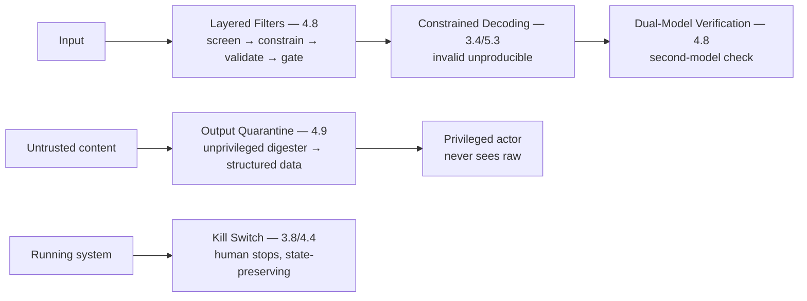

# Chapter 7.6 — Safety & Guardrail Patterns

| | |
|---|---|
| **Part** | 7 — Enterprise AI Architecture Patterns |
| **Maturity level** | 4 — Architect |
| **Difficulty** | Advanced |
| **Estimated study time** | 3 hours (reading 90 min, exercise 90 min) |
| **Prerequisites** | [4.8 Guardrails & Content Safety](../part-4-enterprise-genai-systems/chapter-08-guardrails-content-safety.md); [4.9](../part-4-enterprise-genai-systems/chapter-09-genai-security-threat-modeling.md) |

## Learning Objectives

After this chapter you will be able to:

1. Apply the safety & guardrail pattern family in pattern-language form: layered filters, dual-model verification, constrained decoding, output quarantine, and kill switch.
2. Select the safety pattern matched to the safety need, using each pattern's context, forces, and consequences.
3. Compose safety patterns into the guardrail architecture (4.8) and the security architecture (4.9).
4. Recognize the safety patterns in the case studies, the controls that make GenAI safe.

## Introduction

This chapter catalogs the safety & guardrail pattern family — the safety patterns that Part 4 built (4.8's guardrails, 4.9's security), in pattern-language form (7.1). These patterns constrain the AI's outputs and actions to keep the system's behavior inside its policy (4.8) and secure against adversaries (4.9), and this chapter is the reference for the safety patterns — the runtime controls (4.8) and the security controls (4.9), presented as patterns.

The framing: **safety & guardrail patterns constrain the AI's outputs and actions to keep the system safe** — the patterns (layered filters, dual-model verification, constrained decoding, output quarantine, kill switch) that enforce the policy (4.8) and the security (4.9) at runtime, and this chapter is the reference for the safety controls, presented as patterns.

## Business Motivation

The safety & guardrail patterns are what keep GenAI's failures from becoming the company's incidents (4.8's difference-between-failure-and-incident) and the adversary's exploits from becoming breaches (4.9). Without them: the AI's policy-violating outputs reach the user (the brand/legal/regulatory exposure — 4.8), and the adversary's injection reaches the consequential (the blast radius — 4.9). With them: the guardrails constrain the outputs (4.8's layered enforcement) and the security patterns contain the adversary (4.9's blast-radius architecture). The business case is the incident-prevention one: the safety patterns prevent the incidents (4.8's brand/legal/regulatory exposure, 4.9's breaches), the runtime controls (4.8) and security controls (4.9) that make GenAI safe to deploy — and the safety pattern family is the reference for the controls, presented as patterns, that keep GenAI's failures and the adversary's exploits from becoming the company's incidents.

## Theory — The Safety & Guardrail Pattern Catalog

### Pattern: Layered Filters

- **Context** — a system needing runtime policy enforcement on inputs and outputs (4.8).
- **Problem** — the policy-violating input or output that must be caught (4.8 — the toxicity, PII, the domain lines).
- **Forces** — the coverage vs. the cost/latency (the funnel — 4.8), the over-block vs. the under-block (4.8's both error directions).
- **Solution** — the layered guardrails (4.8 — input screening, in-generation constraints, output validation, action gating), the funnel (rules → classifiers → LLM checkers — 4.8), the response ladder (4.8).
- **Structure** — input → screen → generate (constrained) → validate → gate (4.8's four layers, the funnel).
- **Consequences** — the policy enforced (4.8); the over-block risk (the false-positive tax — 4.8) and the latency (the funnel).
- **Known uses** — Bellhaven's customer-assistant guardrails (4.8), all customer-facing GenAI (4.8).
- **Related** — Dual-Model Verification (the output check), the human-in-the-loop (7.5, the response ladder's review).

### Pattern: Dual-Model Verification

- **Context** — an output whose correctness/safety a second model can check (4.8's LLM checkers, 4.9's dual-LLM).
- **Problem** — the output that needs verification beyond the generating model (4.8/4.9).
- **Forces** — the verification quality vs. the cost (the second model — 4.8), the gameable-verifier (4.9 — a model checking a model).
- **Solution** — a second model verifies the output (4.8's LLM checkers on the flagged slice, 4.9's verification), with the bias controls (2.7's judge biases, cross-family — 4.7).
- **Structure** — generate → second-model verify (on the flagged slice) → pass/fail (4.8).
- **Consequences** — the nuanced verification (4.8); the cost and the gameable-verifier (4.9 — the model checking a model).
- **Known uses** — Bellhaven's advice-line LLM checker (4.8), the faithfulness verification (4.7).
- **Related** — Layered Filters (the funnel the verifier sits in), the LLM-as-judge (4.7).

### Pattern: Constrained Decoding

- **Context** — an output that must conform to a structure/grammar (3.4's structured outputs).
- **Problem** — the invalid output that must be made unproducible (3.4 — the strongest constraint).
- **Forces** — the guarantee (the invalid unproducible) vs. control over the constraint language: managed APIs enforce JSON-schema-class constraints server-side (3.4's strict structured-output modes); *arbitrary* grammars beyond what the provider exposes still require self-hosted serving control (5.3).
- **Solution** — mask the invalid tokens at generation (3.4's constrained decoding), so only conforming output is producible — via the provider's strict structured-output mode where the schema class suffices, via self-hosted grammar constraints (5.3) where it doesn't.
- **Structure** — generation with token masking (only grammar-conforming — 3.4/5.3).
- **Consequences** — the structural guarantee (the invalid unproducible — 3.4); the possible content-quality shift (3.4); custom grammars bind you to serving control (5.3).
- **Known uses** — provider strict-schema modes for JSON outputs (3.4), self-hosted grammar-constrained extraction (3.4/5.3).
- **Related** — the structured-output pattern (3.4), the provider structured-output modes (3.4's rung 2).

### Pattern: Output Quarantine

- **Context** — untrusted content the model must process near tools/authority (4.9's quarantine).
- **Problem** — the injection in the untrusted content reaching the tools/authority (4.9's indirect injection).
- **Forces** — the rich processing (the model reads the untrusted content) vs. the blast-radius containment (4.9).
- **Solution** — an unprivileged model (no tools, no credentials) processes the untrusted content into validated structured data, a privileged model (with tools) never sees the raw untrusted text (4.9's dual-LLM/quarantine).
- **Structure** — untrusted content → unprivileged digester → validated structured data → privileged actor (4.9).
- **Consequences** — the injection contained (it corrupts the data — a quality problem, handled by validation — but reaches no tools/authority — 4.9); the architecture complexity (the two models).
- **Known uses** — Corvid's customs-document quarantine (4.9/7.4), all untrusted-content-near-tools systems (4.9).
- **Related** — the tool sandbox (7.4), the security patterns (4.9's blast-radius), the anti-corruption layer (6.4).

### Pattern: Kill Switch

- **Context** — a running AI system (especially an agent) that a human must be able to stop (3.8/4.4).
- **Problem** — the runaway or misbehaving system that must be stoppable (3.8/4.4 — the runaway agent).
- **Forces** — the automation vs. the human control (the ability to stop).
- **Solution** — the human can stop the system immediately (3.8/4.4 — the per-task, per-type, per-fleet kill switches — 4.4), preserving the state for inspection (4.4).
- **Structure** — the running system with the kill switches (task/type/fleet — 4.4), state-preserving.
- **Consequences** — the human control (the ability to stop the runaway — 4.4); the kill-switch must be rehearsed (4.4 — the untested switch).
- **Known uses** — Corvid's per-type disable (4.4 — the 3am tail), all agent fleets (3.8/4.4).
- **Related** — the governors (3.8/4.4), the agentic patterns (7.4), the circuit breaker (5.9).

## Architecture Perspective

Readings. **The safety patterns constrain at multiple points** — the layered filters (the input/output policy — 4.8), the constrained decoding (the structural guarantee — 3.4), the dual-model verification (the output check — 4.8), the output quarantine (the untrusted-content containment — 4.9), the kill switch (the human stop — 4.4) — constraining the AI's outputs and actions at multiple points (the defense-in-depth — 4.8/4.9). **The quarantine is the strongest structural safety answer for untrusted content** (4.9) — the unprivileged-digester/privileged-actor split (4.9) contains the injection structurally (it reaches no tools/authority — 4.9's blast-radius), the strongest answer for the untrusted-content-near-tools problem (4.9), combining with the tool sandbox (7.4) and the anti-corruption layer (6.4). **And the safety patterns combine into the guardrail and security architectures** — the layered filters + dual-model verification (the guardrail architecture — 4.8), the output quarantine + kill switch (the security architecture — 4.9) — the safety patterns as the components of the guardrail (4.8) and security (4.9) architectures (7.1's combination).

## Real-world Example

**Bellhaven Insurance** (the recurring customer assistant — 4.8) and **Corvid Logistics** (the recurring customs agent — 4.9) together illustrate the safety pattern family. Bellhaven's customer-assistant guardrails were a safety-pattern composition (4.8): the layered filters (4.8 — the input screening, the output validation funnel — rules → classifiers → LLM checkers), the dual-model verification (4.8 — the advice-line LLM checker on the flagged slice), the response ladder (4.8 — log → regenerate → refuse → escalate), all designed to work (4.8's both-error-directions — the over-block managed, the bypass sampled). Corvid's customs agent's security was a safety-pattern composition (4.9): the output quarantine (4.9 — the unprivileged document-digester producing validated structured data, the privileged filing-actor never seeing the raw untrusted documents — the injection contained), the tool sandbox (7.4/4.4 — the isolation, the gates), the kill switch (4.4 — the per-type disable for the 3am tail). The safety-pattern compositions were the guardrail (Bellhaven — 4.8) and security (Corvid — 4.9) architectures: Bellhaven's layered filters + dual-model verification + response ladder (the guardrail architecture — 4.8), Corvid's output quarantine + tool sandbox + kill switch (the security architecture — 4.9) — the safety patterns as the components of the guardrail and security architectures (7.1's combination). The safety-patterns note (combining Bellhaven's 4.8 and Corvid's 4.9): *"The safety patterns are the components of the guardrail and security architectures. Bellhaven's customer-assistant guardrails: layered filters (the funnel), dual-model verification (the advice-line checker), the response ladder — the guardrail architecture (4.8). Corvid's customs-agent security: output quarantine (the unprivileged digester, the injection contained — 4.9), tool sandbox (the isolation), kill switch (the stop) — the security architecture (4.9). The quarantine is the strongest structural answer for untrusted content (4.9) — the unprivileged digester never lets the injection reach the tools. The safety patterns constrain the AI's outputs and actions at multiple points — the defense-in-depth that keeps GenAI's failures and the adversary's exploits from becoming incidents."*

## Hands-on Exercise

**Compose safety patterns.** ~90 minutes. For a GenAI system with safety/security needs (real or a case study).

1. **Safety-need analysis (25 min).** For a GenAI system, analyze the safety needs: the policy enforcement (needs layered filters), the output verification (needs dual-model verification), the structural guarantee (needs constrained decoding), the untrusted content near tools (needs output quarantine), the running system (needs a kill switch). Map the needs to the patterns.
2. **The pattern-language form (20 min).** For one selected pattern (e.g., output quarantine), write its full pattern-language form.
3. **The composition (30 min).** Compose the safety patterns into the guardrail architecture (4.8 — the layered filters + verification) and/or the security architecture (4.9 — the quarantine + sandbox + kill switch). Show the defense-in-depth (the multiple constraint points).
4. **The quarantine design (15 min).** For an untrusted-content-near-tools case, design the output quarantine (4.9 — the unprivileged digester, the validated structured data, the privileged actor never seeing the raw). Show how it contains the injection.

**Acceptance criteria:**
- [ ] Safety needs mapped to the safety patterns (policy, verification, structural, untrusted-content, running-system)
- [ ] One pattern in the full pattern-language form
- [ ] The safety patterns composed into the guardrail/security architecture (defense-in-depth)
- [ ] The output quarantine designed for the untrusted-content-near-tools case (the injection contained — 4.9)

## Enterprise Considerations

The safety & guardrail patterns are the enterprise's safety-and-security reference. **They're the safety-and-security reference** (4.8/4.9/7.1): the safety pattern family is the enterprise's reference for the guardrail (4.8) and security (4.9) architectures, the patterns that make GenAI safe and secure. **They're governed and compliance-relevant** (6.9/4.14): the safety patterns (the guardrails — 4.8, the security — 4.9) are governed (6.9) and compliance-relevant (4.14 — the safety controls as compliance evidence), so the safety patterns are governance-and-compliance controls. **The quarantine and security patterns integrate with the security architecture** (6.5): the security safety patterns (the output quarantine, the kill switch, the tool sandbox — 4.9/6.5) integrate with the enterprise security architecture (6.5's zero-trust), so the safety patterns connect to the security architecture (6.5). **And the guardrail patterns are platform capabilities** (7.9): the guardrail patterns (the layered filters, the dual-model verification — 4.8) are platform capabilities (7.9 — the shared guardrail service, the gateway's guardrail integration — 5.4), so the safety patterns are part of the platform (7.9).

## Trade-offs

| Decision | Option A | Option B | Choose A when… | Choose B when… |
|----------|----------|----------|----------------|----------------|
| Untrusted content near tools | Output quarantine (unprivileged digester) | Process in the privileged context with filters | The content is attacker-influenceable and the context has tools/authority (4.9) | The content is genuinely trusted (rare — verify — 4.9) |
| Output enforcement | Constrained decoding (unproducible) | Post-validation (4.8) | The structural guarantee matters — provider strict-schema mode covers it, or self-host for custom grammars (3.4/5.3) | The constraint exceeds what schema-class enforcement expresses (semantic/policy rules) — post-validation (4.8) |
| Output check | Dual-model verification (on the flagged slice) | No verification | The output needs nuanced checking (4.8's flagged slice) | The programmatic checks suffice (3.4) |
| Kill switch | Always (rehearsed, state-preserving) | No kill switch | Always for running systems, especially agents (3.8/4.4) | Never no-kill-switch; the un-stoppable runaway (4.4) |

## Common Mistakes

1. **Untrusted content near tools without quarantine** — the untrusted content processed in the privileged context (4.9's injection risk); the output quarantine (4.9 — the unprivileged digester).
2. **Detection as the security boundary** — relying on the layered filters (detection) as the security boundary (4.9 — the arms race); the architectural controls (the quarantine, the blast-radius — 4.9) as the boundary, detection as depth (4.8/4.9).
3. **No kill switch** — the running system without the human stop (4.4's runaway); the kill switch (3.8/4.4, rehearsed).
4. **The un-monitored guardrails** — the guardrails without the bypass monitoring (4.8 — the recall assumed); the bypass sampling (4.8).
5. **The gameable verifier** — the dual-model verification without the bias controls (4.7's judge biases — a model checking a model, 4.9's gameable); the bias controls (cross-family — 4.7).
6. **Over-blocking without measurement** — the layered filters recall-maximized without the over-block measurement (4.8's false-positive tax); the both-error-directions (4.8 — the over-block rate).
7. **The un-composed safety patterns** — the safety patterns applied without composing them into defense-in-depth (4.8/4.9); the composition (the multiple constraint points).

## Best Practices

1. **Quarantine untrusted content near tools** — the unprivileged-digester/privileged-actor split (4.9), the strongest structural answer for the untrusted-content-near-tools problem.
2. **Layer the filters as a funnel** — rules → classifiers → LLM checkers (4.8), the funnel economics, with the response ladder (4.8).
3. **Constrain decoding where the structure matters** — the invalid unproducible (3.4/5.3), the strongest output guarantee (where self-hosting permits).
4. **Verify with a second model on the flagged slice** — the dual-model verification (4.8) with the bias controls (4.7).
5. **Always have a rehearsed kill switch** — the human stop (3.8/4.4), state-preserving, rehearsed.
6. **Use architectural controls as the security boundary** — the quarantine, the blast-radius (4.9), detection as depth (4.8/4.9).
7. **Compose the safety patterns into defense-in-depth** — the guardrail architecture (4.8) and the security architecture (4.9), the multiple constraint points.

## Architecture Checklist

For applying the safety & guardrail patterns:

- [ ] Untrusted content near tools quarantined (the unprivileged digester → validated data → privileged actor — 4.9)
- [ ] Layered filters as a funnel (rules → classifiers → LLM checkers — 4.8) with the response ladder
- [ ] Constrained decoding where the structure matters and self-hosting permits (3.4/5.3)
- [ ] Dual-model verification on the flagged slice with bias controls (4.8/4.7)
- [ ] A rehearsed, state-preserving kill switch (3.8/4.4)
- [ ] Architectural controls as the security boundary (the quarantine, the blast-radius — 4.9), detection as depth
- [ ] The safety patterns composed into defense-in-depth (the guardrail — 4.8 and security — 4.9 architectures); governed (6.9/4.14)

## Interview Questions

1. *"Walk me through the safety and guardrail patterns and when you'd use each."* — Strong answers give the family (layered filters — the policy enforcement, dual-model verification — the output check, constrained decoding — the structural guarantee, output quarantine — the untrusted-content containment, kill switch — the human stop), each with its context, composed into the guardrail (4.8) and security (4.9) architectures.
2. *"What's the strongest way to handle untrusted content near tools?"* — Strong answers give the output quarantine (4.9 — the unprivileged model, no tools/credentials, processes the untrusted content into validated structured data; the privileged model with tools never sees the raw untrusted text), so the injection is contained (it corrupts the data — handled by validation — but reaches no tools/authority — 4.9's blast-radius), the strongest structural answer.
3. *"Why isn't detection the security boundary?"* — Strong answers give 4.9's lesson (detection is an arms race the adversary iterates against — 4.9), and the architectural controls as the boundary (the quarantine, the blast-radius containment, the least-privilege — 4.9) that work even when the injection succeeds, detection as defense-in-depth (4.8/4.9).
4. *"How do you compose safety patterns into a defense?"* — Strong answers give the defense-in-depth (the layered filters + dual-model verification for the guardrail architecture — 4.8, the output quarantine + tool sandbox + kill switch for the security architecture — 4.9), the multiple constraint points (Bellhaven's guardrails, Corvid's security), architectural controls as the boundary.

## Further Reading

- 4.8 Guardrails & Content Safety (the layered filters, the funnel, the response ladder) and 4.9 GenAI Security (the quarantine, the blast-radius) — the chapters this pattern family formalizes.
- Simon Willison's prompt-injection writing (re-linked from 4.9) — the quarantine/dual-LLM pattern's popularization.
- The [security checklist](../../checklists/security-checklist.md) — the checklist the security patterns implement.
- 7.4 Agentic Patterns (the tool sandbox) and 6.5 Security Architecture (the enterprise security) — the related patterns.

## Summary

- The **safety & guardrail pattern family** constrains the AI's outputs and actions — layered filters (the policy enforcement — 4.8), dual-model verification (the output check — 4.8), constrained decoding (the structural guarantee — 3.4), output quarantine (the untrusted-content containment — 4.9), kill switch (the human stop — 4.4) — at multiple points (defense-in-depth).
- **The output quarantine is the strongest structural answer for untrusted content** (4.9) — the unprivileged-digester/privileged-actor split contains the injection (it reaches no tools/authority — 4.9's blast-radius), for the untrusted-content-near-tools problem.
- **Architectural controls are the security boundary** (4.9) — the quarantine, the blast-radius containment (4.9's blast-radius-over-detection), detection (the layered filters) as depth, not the boundary.
- The patterns **compose into the guardrail (4.8) and security (4.9) architectures** — Bellhaven's layered filters + dual-model verification + response ladder (the guardrail), Corvid's output quarantine + tool sandbox + kill switch (the security) — the defense-in-depth (7.1's combination).
- The safety patterns are the enterprise's **safety-and-security reference** — governed (6.9) and compliance-relevant (4.14), integrated with the security architecture (6.5), platform capabilities (7.9). The knowledge & data patterns are next: **knowledge & data patterns** (7.7).

---

**Previous:** [Chapter 7.5 — Human-in-the-Loop Patterns](chapter-05-human-in-the-loop-patterns.md) · **Next:** [Chapter 7.7 — Knowledge & Data Patterns](chapter-07-knowledge-data-patterns.md) · **Related:** [4.8 Guardrails & Content Safety](../part-4-enterprise-genai-systems/chapter-08-guardrails-content-safety.md), [4.9 GenAI Security & Threat Modeling](../part-4-enterprise-genai-systems/chapter-09-genai-security-threat-modeling.md), [6.5 Security Architecture & Zero Trust](../part-6-enterprise-architecture/chapter-05-security-architecture-zero-trust.md)
