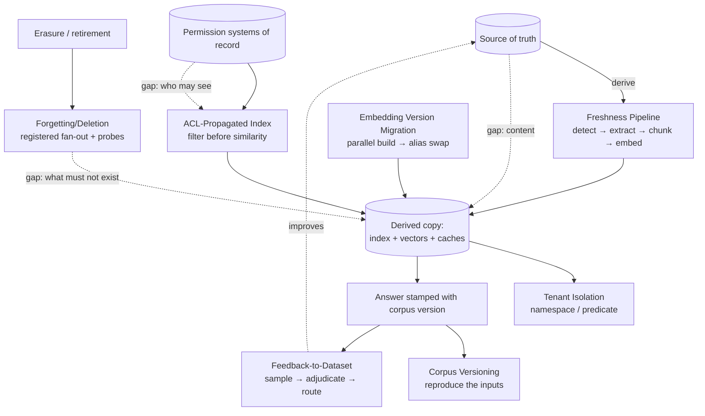

# Chapter 7.7 — Knowledge & Data Patterns

| | |
|---|---|
| **Part** | 7 — Enterprise AI Architecture Patterns |
| **Maturity level** | 4 — Architect |
| **Difficulty** | Advanced |
| **Estimated study time** | 2 hours (reading 40 min, exercise 80 min) |
| **Prerequisites** | [4.1 Production RAG](../part-4-enterprise-genai-systems/chapter-01-production-rag.md); [4.3](../part-4-enterprise-genai-systems/chapter-03-document-ingestion.md); [5.5](../part-5-cloud-infrastructure-platform/chapter-05-data-architecture.md) |

## Learning Objectives

After this chapter you will be able to:

1. Apply the knowledge & data pattern family in pattern-language form: Freshness Pipeline, ACL-Propagated Index, Tenant Isolation, Forgetting/Deletion, Embedding Version Migration, Corpus Versioning, and Feedback-to-Dataset.
2. Set a freshness tier per corpus from decision impact, and price incremental maintenance against full re-derivation.
3. Design permission and deletion propagation with stated windows, named owners, and adversarial probes.
4. Compose the family into an architecture whose answers stay reproducible months later.

## Introduction

An index is not the knowledge. It is a *derived copy*, produced by an extraction, chunking, and embedding pipeline that ran at some point in the past. Every pattern here manages the gap between the copy and its source — which is why three concerns that usually live in three governance folders are one problem in three costumes. **Freshness** is a gap in content, **permissions** a gap in who may see it, **deletion** a gap in what should no longer exist anywhere. All three are specified identically — propagation window, monitor, owner, probe — and all three fail identically: the copy answers confidently on behalf of a source that has since changed, revoked, or erased.

That reading produces the family's two less obvious members. The *deriving function* is part of the copy's state, so changing the chunker or the embedding model invalidates every vector at once — making Embedding Version Migration a budgeted event, not an upgrade ticket. And reproducing a months-old answer requires knowing *which* copy produced it: Corpus Versioning.

## Business Motivation

**Permission gaps are breach events, not quality bugs.** Returning a document to someone whose access was revoked forty minutes ago is a disclosure, and remediation runs through legal and notification duties rather than a backlog ticket ([4.1](../part-4-enterprise-genai-systems/chapter-01-production-rag.md)).

**Deletion gaps come with statutory clocks.** GDPR Article 17 erasure must be answered without undue delay and within one month; CCPA/CPRA deletion runs on 45 days. Those clocks cover the whole derived estate — chunks, vectors, caches, traces, evaluation sets — and the propagation machinery cannot be built inside the response window, which makes this the one pattern here that is genuinely un-retrofittable at speed.

**Re-derivation is a recurring bill with a wide dynamic range.** Embedding a large corpus costs real money once; embedding it repeatedly because nobody set a tier costs it monthly. The waste runs both ways — hourly pipelines over an archive nobody decides from, weekly crawls over the pricing corpus that changes a quoted number.

**And without a feedback loop, quality is fixed at launch and decays from there** ([1.2](../part-1-professional-foundation/chapter-02-systems-thinking-design-thinking.md)).

## Theory — The Knowledge & Data Pattern Catalog

### Pattern: Freshness Pipeline

- **Context** — a corpus that changes after it is indexed: policies, prices, protocols, product data.
- **Problem** — the index answers from the version it last saw, producing *grounded-but-wrong*: fluent, correctly cited, drawn from a superseded document.
- **Forces** — pipeline cost and source load pull toward infrequent updates; decision impact pulls toward continuous ones; and a source emitting no change events cannot be polled into freshness it lacks.
- **Solution** — detect change per source class (change feeds, poll-and-diff, checksum crawls), then re-extract, re-chunk, re-embed, and upsert only what changed ([4.3](../part-4-enterprise-genai-systems/chapter-03-document-ingestion.md)). Assign each corpus a **freshness tier from the impact of a stale answer**, not from how often the source changes, and state the lag SLA per source, downgrades included.
- **Structure** — change → detect → extract → [chunk](../../GLOSSARY.md) → embed → upsert; indexed-version lag alerted per source, no exceptions.
- **Consequences** — incremental cost tracks change volume, but tombstones and fragmentation accumulate, making compaction a standing job. Honest tiering yields *stated* inconsistency across corpora — a contract, not a defect. The worst failure is a silently dead connector, invisible from the answer side.
- **Known uses** — change-data-capture feeds driving downstream index maintenance is ordinary data-engineering practice, and crawlers have scheduled recrawl frequency against observed change rate since the earliest crawl-scheduling work. Curriculum instance (fictional): Halvard & Roth's move to DMS change feeds, event-less sources left on crawls at a lower stated SLA ([4.1](../part-4-enterprise-genai-systems/chapter-01-production-rag.md)).
- **Related** — Embedding Version Migration (the full-rebuild sibling); Forgetting/Deletion (a delete is a change with legal teeth).

### Pattern: ACL-Propagated Index

- **Context** — a corpus whose documents carry per-document permissions from systems of record: DMS ACLs, directory groups, matter walls, jurisdiction scopes.
- **Problem** — similarity search has no concept of authorization. Filtering after retrieval still leaks through result counts, snippets, and citation titles; not filtering is a disclosure.
- **Forces** — correctness pulls toward checking the source of record every query; latency and source load pull toward caching permissions in the index. Between them sits the **staleness window** — the interval in which a revoked user still retrieves — whose size is a risk decision, not an engineering default.
- **Solution** — carry ACL labels as index metadata and **filter before similarity**. Resolve effective access in one service ([6.6](../part-6-enterprise-architecture/chapter-06-iam-for-ai.md)), cache it with a TTL, and invalidate on the high-consequence revocation events the source already emits. Make "no access" indistinguishable from "no results", counts and autocomplete included.
- **Structure** — identity → permission resolver (cache + event invalidation) → index query with ACL predicate → similarity over the permitted subset; adversarial probes on a schedule.
- **Consequences** — the ACL set becomes a *second corpus* with its own ingestion and lag, so permission staleness joins freshness lag as an owned metric. Filtering first narrows the candidate pool, so recall for restricted users degrades silently unless measured separately. And one resolver bug is estate-wide, which is why enforcement belongs in one place rather than forty.
- **Known uses** — enterprise search products have shipped document-level security trimming for two decades in two standard bindings: *early binding* (ACLs copied into the index at crawl time — fast, stale) and *late binding* (checked against the source at query time — correct, slow); connector frameworks require per-document ACLs for exactly this reason. Curriculum instance (fictional): Halvard & Roth's matter walls, where partner removal triggers immediate invalidation while routine group changes keep a longer TTL ([4.1](../part-4-enterprise-genai-systems/chapter-01-production-rag.md)).
- **Related** — Tenant Isolation (the same problem at customer granularity); Forgetting/Deletion (revocation and erasure share the propagation path).

### Pattern: Tenant Isolation

- **Context** — one knowledge platform serving multiple customers, business units, or jurisdictions whose data must not mix.
- **Problem** — a shared index puts cross-tenant disclosure one predicate away, and the blast radius of that predicate is every tenant at once.
- **Forces** — cost and operability favor pooling (one index, one warm cache, one dashboard set); consequence and contract favor separation. Migration between rungs is a one-way door: climbing the ladder later means re-ingesting and re-embedding everything.
- **Solution** — choose a rung by the consequence of a leak, not the tenant count: shared index with a tenant predicate for internal, uniform-sensitivity corpora, and only with the predicate enforced at the index API *and* validated post-retrieval; per-tenant namespaces as the external default; dedicated infrastructure and keys for regulated or sovereign customers ([5.11](../part-5-cloud-infrastructure-platform/chapter-11-multicloud-hybrid-sovereignty.md)).
- **Structure** — tenant-scoped identity → routing to namespace/index → retrieval → per-tenant metering; isolation asserted by automated cross-tenant probes in CI, not by code review.
- **Consequences** — separation contains blast radius and simplifies deletion and residency, at the price of per-namespace fixed cost, noisy-neighbor management, and a re-derivation bill that multiplies by tenant count on every embedding-model change. Pooling inverts each trade and concentrates the risk in a single predicate — survivable internally, rarely defensible in a customer contract.
- **Known uses** — the silo/pool/bridge vocabulary of SaaS multi-tenancy names this ladder directly; [vector databases](../../GLOSSARY.md) expose the middle rung as namespaces, partitions, or per-tenant collections, and regulated customers routinely contract for the top rung with customer-managed keys. Curriculum instance (fictional): Halvard & Roth's client-facing deal rooms on per-client namespaces while the internal product stays pooled ([4.1](../part-4-enterprise-genai-systems/chapter-01-production-rag.md)).
- **Related** — ACL-Propagated Index (within-tenant permissions); vector tenancy primitives ([5.6](../part-5-cloud-infrastructure-platform/chapter-06-vector-search-infrastructure.md)).

### Pattern: Forgetting/Deletion

- **Context** — any corpus containing personal data, or any document estate with retention schedules and retirement.
- **Problem** — deleting from the source leaves the derived copies answering, and the request arrives with a statutory clock. The sprawl is wider than teams track: chunks, [embeddings](../../GLOSSARY.md), lexical index, semantic and response caches, traces, evaluation and fine-tuning datasets, workflow checkpoints, backups — plus derived artifacts such as summaries, themselves personal data about the same person.
- **Forces** — completeness pulls toward reaching every copy; audit and evidentiary duties pull toward retaining some, and the two are reconciled per data class with legal rather than by engineering preference.
- **Solution** — treat deletion as a first-class pipeline event flowing through the same stages as a create ([4.3](../part-4-enterprise-genai-systems/chapter-03-document-ingestion.md)), fanning out to a *registered* list of derived stores, each with an owner and a completion window. Verify with automated probes that query for the deleted content — caches included — and expect nothing. Require any new derived store to register before it may be written to.
- **Structure** — request → identity resolution → fan-out (index, vectors, caches, traces, datasets, checkpoints) → per-store acknowledgement → probe → evidence record; backups on put-beyond-use plus erase-on-restore.
- **Consequences** — compliant erasure with evidence, bought with permanent operational surface: every new store touching corpus content adds a fan-out target, and an unregistered one is a silent violation. Vector deletes are frequently *logical* — Lucene-family indexes tombstone and reclaim only at segment merge, and graph-based ANN structures likewise mark rather than remove — so the window must account for compaction and the probe must test reachability, not the delete call's return code.
- **Known uses** — GDPR Article 17 and CCPA/CPRA deletion rights are what make this mandatory rather than tidy; supervisory guidance generally accepts backups being put beyond use and erased on the next restore cycle, and tombstone-plus-compaction semantics are documented behavior in mainstream search and vector indexes. Curriculum instance (fictional): Meridian's PHI erasure path with scheduled probes across index, cache, and trace store ([4.14](../part-4-enterprise-genai-systems/chapter-14-privacy-compliance-governance.md)).
- **Related** — Corpus Versioning (snapshots must not preserve erased content); observability retention ([4.10](../part-4-enterprise-genai-systems/chapter-10-observability.md)).

### Pattern: Embedding Version Migration

- **Context** — an index whose vectors came from one embedding model, which will eventually be deprecated or superseded; likewise a chunking-strategy change.
- **Problem** — vectors from two models occupy incomparable spaces, often at different dimensionality. There is no incremental path: a mixed index returns nonsense similarity, and declining is not an option because deprecation timelines expire.
- **Forces** — quality gains and deprecation deadlines pull toward migrating; the cost of re-deriving the whole corpus, double storage during overlap, and regression risk pull toward waiting — which someone else's calendar bounds, making this a scheduling problem, not a preference.
- **Solution** — run it as a planned release: build a parallel index with the new model, compare both against the same golden sets and query log at the same operating point ([4.7](../part-4-enterprise-genai-systems/chapter-07-evaluation-systems.md)), then publish by alias swap with the old index retained for rollback. Provision re-embedding capacity deliberately so the migration does not starve the freshness lane, and invalidate everything keyed to the old vector space — cached neighbors, semantic-cache entries, precomputed clusters.
- **Structure** — model selected → throttled parallel embed → dual index → golden-set comparison → alias swap → rollback window → dependent caches invalidated.
- **Consequences** — a periodic capital-scale event: full corpus embedding cost, roughly double index storage during overlap, and a comparison that occasionally says *don't*; multi-tenant estates multiply the bill by namespace count. The same machinery serves every re-derivation — chunking, extractor, metadata schema — so estates that never build it freeze on a deprecated model instead.
- **Known uses** — embedding providers version their models and retire older versions on published deprecation timelines, and cross-model vector incomparability is why re-embedding the entire corpus is the standard migration path; parallel build plus alias swap is the conventional way to publish a re-derived index atomically. Curriculum instance (fictional): the vector-store choice treated as a lock-in decision precisely because migration means re-embedding ([5.6](../part-5-cloud-infrastructure-platform/chapter-06-vector-search-infrastructure.md)).
- **Related** — Freshness Pipeline (shares the ingestion stages); Corpus Versioning (each swap mints a version); drift-triggered retraining as the classical sibling (7.11).

### Pattern: Corpus Versioning

- **Context** — retrieval-grounded answers that will be questioned later: regulated advice, claims decisions, published guidance, anything under litigation hold.
- **Problem** — "why did the system say that in March?" is unanswerable once corpus, chunker, and embedding model have all moved. Re-running the query today gives a different answer and proves nothing.
- **Forces** — reproducibility pulls toward retaining snapshots; erasure duties and storage cost pull against retaining anything, and the two collide head-on, because a snapshot preserving erased content is itself a violation.
- **Solution** — stamp every response with the identifiers that determined it: corpus snapshot or index build ID, chunking configuration version, embedding model version, retrieved chunk IDs. Retain *identifiers and content hashes* durably and the content only as long as policy permits, so an investigation can always reconstruct which chunks answered and can reconstruct their text where retention allows; where content was erased, the record resolves to a tombstone rather than a gap.
- **Structure** — index build → version ID → responses stamped (snapshot, chunk config, model, chunk IDs) → version register retained per policy → reconstruction tool resolving an answer to its inputs.
- **Consequences** — answers become auditable and incidents diagnosable: months later you can still separate a stale-corpus failure from a bad-retrieval failure, two findings with different fixes. The costs are metadata volume on every response, a register someone maintains, and an erasure-boundary policy legal signs. Retaining full snapshots per version is where this turns both expensive and quietly non-compliant.
- **Known uses** — snapshot-based table formats and dataset-versioning tools exist because derived outputs need to name the input they ran against; e-discovery and litigation-hold practice imposes the equivalent duty on document systems, and model documentation regimes ask the same of training data ([6.11](../part-6-enterprise-architecture/chapter-11-model-risk-management.md)). Curriculum instance (fictional): CS37's public-records processing, where the released version and its redactions must both be reconstructable ([CS37](../../case-studies/cs37-public-records-request-processing.md)).
- **Related** — Forgetting/Deletion (the tension this pattern resolves); lineage in the data architecture ([5.5](../part-5-cloud-infrastructure-platform/chapter-05-data-architecture.md)).

### Pattern: Feedback-to-Dataset

- **Context** — a deployed system whose users see its outputs and can tell when they are wrong.
- **Problem** — that signal evaporates. A thumbs-down carrying no retrieved context, no corpus version, and no adjudication is an unactionable mood, and the same failures recur because nothing converts them into tests or corpus fixes.
- **Forces** — volume pulls toward capturing everything; diagnosis needs enough context per item to be actionable; privacy and lawful-basis constraints limit what may be retained or reused; and reviewer time is the true bottleneck, so sampling beats collecting.
- **Solution** — capture feedback joined to the trace: query, retrieved chunk IDs, corpus version, model version, response. Sample rather than adjudicate everything, oversampling segments that matter. Route each adjudicated failure to its true home — a corpus fix, a chunking fix, a golden-set case, or a prompt change ([4.7](../part-4-enterprise-genai-systems/chapter-07-evaluation-systems.md)) — and govern reuse by privacy notice and retention policy from day one.
- **Structure** — interaction → feedback capture (joined to trace + corpus version) → sampling → adjudication queue → routed fix → regression suite → redeploy.
- **Consequences** — the estate compounds instead of decaying, and evaluation stops being a launch artifact. The costs are standing reviewer time, a labeling operation with its own quality problem, and a permanent governance obligation over feedback data. The subtlest cost is selection bias: volunteered feedback over-represents the annoyed and under-represents the silently misled, so a randomly sampled review slice belongs alongside it (7.11).
- **Known uses** — response-level feedback capture is near-universal in production assistants, and adjudication-and-routing pipelines are standard practice in data-labeling operations; purpose limitation and lawful basis for reusing production interactions are ordinary privacy-review questions. Curriculum instance (fictional): Bellhaven's extraction feedback feeding golden sets and corpus curation ([5.5](../part-5-cloud-infrastructure-platform/chapter-05-data-architecture.md)).
- **Related** — the evaluation patterns ([4.7](../part-4-enterprise-genai-systems/chapter-07-evaluation-systems.md)); Corpus Versioning (makes feedback diagnosable); data governance ([6.7](../part-6-enterprise-architecture/chapter-07-data-governance-knowledge.md)).

## Architecture Perspective

**Every pattern is a gap manager**, each specified the same way — window, monitor, owner, probe. A design stating its freshness lag but not its permission-staleness window has specified one third of the same discipline.

**Freshness tiers follow decision impact, not source churn:**

| Tier | Target lag | Assign when | Typical mechanism |
|---|---|---|---|
| Critical | Minutes | A stale answer changes a priced, clinical, safety, or legally binding decision | Change feed, event-driven upsert, lag alerting |
| Standard | Hours to a day | A stale answer misinforms but a human or downstream control catches it | Scheduled incremental, poll-and-diff |
| Archival | Days to weeks | Staleness changes wording, not the decision | Batch crawl, checksum diff, stated low SLA |

Volatility sets the *cost* of a tier; impact sets the *tier*. High-churn, low-impact corpora are the classic budget sink; low-churn, high-impact corpora are the classic incident. Incremental maintenance scales with change, full re-derivation with corpus size — and only changes to the deriving function should trigger the latter.

## Real-world Example

**Meridian Health Partners** and **Bellhaven Insurance** — the curriculum's recurring fictional healthcare and insurance estates — compose the family differently because their gaps carry different consequences.

Meridian tiers aggressively: sedation and dosing protocols sit critical, on change feeds with lag alerting, while training material sits archival at a stated multi-day SLA. Permissions are early-bound with invalidation on role change, and the existence-leak contract is probed adversarially, because a clinician learning that a colleague's note *exists* is itself a disclosure. Erasure runs the registered fan-out across index, vectors, semantic cache, and trace store, with a completion window sized for compaction rather than for the delete call returning. Corpus versioning came last and is valued most: when a protocol answer is challenged, the stamped snapshot and chunk IDs separate "the corpus was stale" from "retrieval picked the wrong chunk".

Bellhaven adds the two patterns Meridian does not need. Multi-market operation puts tenancy at per-market namespaces, so the first embedding-model deprecation arrived as a re-derivation bill multiplied by market count — planned across two quarters, throttled so the freshness lane kept its SLA, and gated on a golden-set comparison that nearly rejected the new model for one market's document mix.

## Hands-on Exercise

**Compose knowledge & data patterns for a knowledge estate.** ~80 minutes. Use a case study you have not studied closely, or a real corpus you know.

1. **Tier the corpora (20 min).** List every corpus the system retrieves from and assign each a freshness tier using the impact rule, justified by the decision a stale answer would change. Flag any corpus whose cadence disagrees with its tier — in either direction.
2. **Specify the three windows (20 min).** Write the propagation window, monitor, owner, and probe for freshness lag, permission staleness, and deletion completion.
3. **Price the re-derivation (20 min).** Estimate a full re-embed: corpus size, overlap storage, throttling plan, tenant multiplier. State the next trigger and the evidence gating the alias swap.
4. **Resolve the versioning/erasure collision (20 min).** Design the corpus-version record so a six-month-old answer can be reconstructed while erased content stays erased.

**Acceptance criteria:**
- [ ] Every corpus has a freshness tier with an impact-based justification; cadence mismatches flagged
- [ ] Three propagation windows stated, each with named monitor, owner, and probe
- [ ] Full re-embed priced, with throttling plan and a stated gate for the alias swap
- [ ] Deletion fan-out lists every derived store, caches and traces included, with completion windows
- [ ] Corpus-version record specified field by field, with post-erasure behavior explicit
- [ ] An adversarial permission probe written that distinguishes "no access" from "no results"

## Enterprise Considerations

**The derived-store register is the governance artifact this family needs.** Deletion, residency, and classification all fan out to the same list, and it is only trustworthy if adding a derived store *requires* registering it — a platform control, not a policy document ([6.7](../part-6-enterprise-architecture/chapter-07-data-governance-knowledge.md)). Estates that skip it discover their fifth cache during an audit.

**Permission resolution is an integration program, not a component.** Effective access is usually the intersection of directory groups, application ACLs, legal holds, and hand-maintained walls, each on a different clock and owned by a different team ([6.6](../part-6-enterprise-architecture/chapter-06-iam-for-ai.md)) — so it belongs at the front of the plan, where calendar time is dominated by other teams' availability.

**Re-derivation belongs in the platform budget as a line item**, because deprecations arrive on the provider's schedule; a platform without a funded re-derivation lane either freezes on a deprecated model or raids its freshness capacity.

**And the ownership questions are what reviews should ask.** Who is paged when a source's lag breaches? Who signs the permission-staleness window? Who owns the deletion register? Who adjudicates feedback, and for how many hours a week?

## Trade-offs

| Decision | Option A | Option B | Choose A when… | Choose B when… |
|----------|----------|----------|----------------|----------------|
| Index maintenance | Incremental upsert | Full rebuild + alias swap | Content changed — cost scales with change volume | The deriving function changed (chunker, embedding model, schema) |
| Freshness mechanism | Event-driven | Scheduled crawl | The source emits reliable change events and the tier is critical | No change feed — then state the downgraded SLA per source |
| Permission binding | Early binding | Late binding | Latency matters and a bounded staleness window is acceptable | Revocation must be instant and the source can absorb per-query load |
| Tenancy | Per-tenant namespaces | Shared index + predicate | External or regulated tenants; a leak fails the consequence test | Internal, uniform sensitivity — with defense-in-depth on the predicate |
| Version retention | Identifiers + hashes | Full corpus snapshots | The default — reproducible and erasure-compatible | Only where a legal hold requires preserved content |

## Common Mistakes

1. **Tiering freshness by source churn** — hourly pipelines over an archive nobody decides from, weekly crawls over the pricing corpus. Impact sets the tier; volatility only sets its cost.
2. **Post-similarity ACL filtering** — counts, facets, and citation titles leak what the bodies withheld.
3. **A permission-staleness window nobody chose** — a TTL picked for latency becomes the firm's revocation policy by accident.
4. **"Deleted from the source" as deletion** — orphaned chunks, vectors, and cached responses keep answering; the delete call's return code proves nothing against a tombstone-and-compact index.
5. **Treating an embedding-model change as an upgrade** — it invalidates every vector, has no incremental path, and lands on the provider's clock.
6. **Unversioned answers** — six months on, nobody can separate a stale corpus from a bad retrieval, so the fix lands in the wrong layer.
7. **Full corpus snapshots for reproducibility** — expensive, and they re-create the data you were obliged to erase.
8. **Feedback without context or sampling** — a thumbs-down with no chunk IDs is unactionable, and adjudicating everything exhausts the reviewers the loop depends on.

## Best Practices

1. **State a window, monitor, owner, and probe for each of the three gaps** — freshness, permissions, deletion. Only the clock differs.
2. **Alert on freshness lag for every source, no exceptions** — the "stable" source is the one that dies quietly.
3. **Enforce permissions in one resolver, filter before similarity, probe adversarially.**
4. **Register every derived store before it may be written to.**
5. **Build parallel-index-and-alias-swap once** — it serves embedding migrations, chunking changes, and extractor upgrades alike.
6. **Stamp every answer with corpus version, chunk config, model version, and chunk IDs.**
7. **Choose the tenancy rung by consequence, knowing it is a one-way door.**
8. **Sample feedback, adjudicate it, and route each failure to its true layer.**

## Architecture Checklist

For applying the knowledge & data patterns:

- [ ] Freshness tier per corpus justified by decision impact; lag SLA stated per source and alerted without exception
- [ ] Incremental vs. full re-derivation policy written, with compaction scheduled for the incremental path
- [ ] ACL labels in the index, filtered before similarity; resolution centralized; staleness window signed by security
- [ ] Existence-leak contract tested adversarially across results, counts, facets, and autocomplete
- [ ] Tenancy rung chosen by consequence test; cross-tenant isolation probed in CI
- [ ] Deletion register lists every derived store — index, vectors, caches, traces, datasets, checkpoints, backups — each with owner, window, and probe
- [ ] Embedding-migration plan exists: parallel build, golden-set gate, alias swap, rollback window, cache invalidation, funded capacity
- [ ] Responses stamped with corpus snapshot, chunk config, model version, chunk IDs; reconstruction path tested
- [ ] Feedback captured joined to trace and corpus version, sampled, adjudicated, routed; privacy basis documented

## Interview Questions

1. *"How do you decide how fresh a corpus needs to be?"* — Strong answers tier by decision impact rather than source volatility, state a lag SLA per source including honest downgrades where no change feed exists, and treat lag as an alerted metric rather than something users report.
2. *"Implement right-to-be-forgotten in a RAG system."* — Strong answers name the full derived estate (chunks, vectors, lexical index, caches, traces, evaluation and fine-tuning sets, checkpoints, backups), insist on a registered fan-out with per-store owners and windows, verify by probe rather than return code, raise tombstone-and-compaction semantics, and give the backup policy as put-beyond-use plus erase-on-restore.
3. *"Your embedding provider deprecates the model your index is built on. Walk me through the next ninety days."* — Strong answers recognize there is no incremental path, plan a throttled parallel build so freshness doesn't starve, gate the swap on golden-set and query-log comparison, keep the old index for rollback, invalidate dependent caches, and price the tenant multiplier.
4. *"Six months later, a regulator asks why the assistant gave a particular answer."* — Strong answers require responses stamped with corpus snapshot, chunk configuration, embedding-model version, and retrieved chunk IDs, and resolve the erasure collision by retaining identifiers and hashes rather than content.

## Further Reading

- [4.1 Production RAG](../part-4-enterprise-genai-systems/chapter-01-production-rag.md) and [4.3 Document Ingestion](../part-4-enterprise-genai-systems/chapter-03-document-ingestion.md) — the index lifecycle, permission architecture, and pipeline machinery this family compresses.
- [4.14 Privacy, Compliance & Governance](../part-4-enterprise-genai-systems/chapter-14-privacy-compliance-governance.md) and [6.7 Data Governance & Knowledge Management](../part-6-enterprise-architecture/chapter-07-data-governance-knowledge.md) — the obligations behind deletion, retention, and the derived-store register.
- [5.6 Vector Search Infrastructure](../part-5-cloud-infrastructure-platform/chapter-06-vector-search-infrastructure.md) — index internals, deletion semantics, and why the store choice is a migration decision.
- The [RAG design checklist](../../checklists/rag-design-checklist.md) — the review form these patterns back.
- Your vector store's and embedding provider's documentation on deletion semantics, compaction, and deprecation timelines — the two facts most reviews get wrong.

## Summary

- An index is a **derived copy** of the source, and this family manages the gap: freshness is the content gap, ACL propagation the permission gap, deletion the existence gap — three costumes, one specification (window, monitor, owner, probe).
- **Freshness tiers follow decision impact**, not source churn; volatility only sets a tier's cost. Incremental maintenance is priced by change volume, full re-derivation by corpus size.
- **Embedding Version Migration** is a budgeted event, not an upgrade: vectors across models are incomparable, there is no incremental path, and the deprecation clock sets the date.
- **Forgetting/Deletion** fans out to a registered list of derived stores and is verified by probe, because vector deletes are often logical until compaction.
- **Corpus Versioning** stamps snapshot, chunk config, model version, and chunk IDs — retaining identifiers rather than content, which keeps reproducibility compatible with erasure.
- **Tenant Isolation** is chosen by consequence and is a one-way door; **Feedback-to-Dataset** is what makes the estate compound rather than freeze at launch quality.

---

**Previous:** [Chapter 7.6 — Safety & Guardrail Patterns](chapter-06-safety-guardrail-patterns.md) · **Next:** [Chapter 7.8 — Cost & Performance Patterns](chapter-08-cost-performance-patterns.md) · **Related:** [4.1 Production RAG](../part-4-enterprise-genai-systems/chapter-01-production-rag.md), [5.5 Data Architecture](../part-5-cloud-infrastructure-platform/chapter-05-data-architecture.md), [6.7 Data Governance & Knowledge Management](../part-6-enterprise-architecture/chapter-07-data-governance-knowledge.md)
