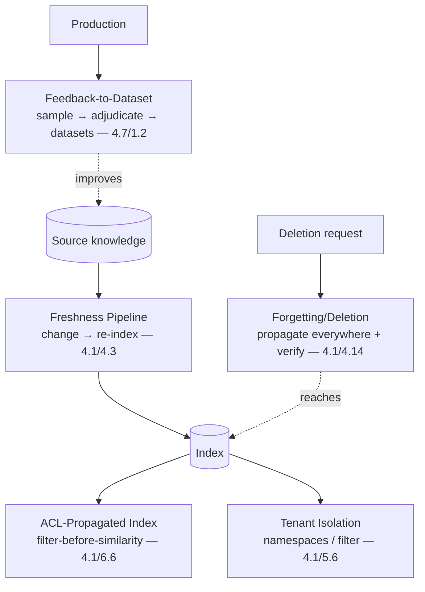

# Chapter 7.7 — Knowledge & Data Patterns

| | |
|---|---|
| **Part** | 7 — Enterprise AI Architecture Patterns |
| **Maturity level** | 4 — Architect |
| **Difficulty** | Advanced |
| **Estimated study time** | 3 hours (reading 90 min, exercise 90 min) |
| **Prerequisites** | [4.1 Production RAG](../part-4-enterprise-genai-systems/chapter-01-production-rag.md); [4.3](../part-4-enterprise-genai-systems/chapter-03-document-ingestion.md); [5.5](../part-5-cloud-infrastructure-platform/chapter-05-data-architecture.md) |

## Learning Objectives

After this chapter you will be able to:

1. Apply the knowledge & data pattern family in pattern-language form: freshness pipeline, ACL-propagated index, tenant isolation, forgetting/deletion, and feedback-to-dataset.
2. Select the data pattern matched to the data need, using each pattern's context, forces, and consequences.
3. Compose data patterns into the knowledge and data architecture (4.1/4.3/5.5).
4. Recognize the data patterns in the case studies, the patterns that make the knowledge estate trustworthy.

## Introduction

This chapter catalogs the knowledge & data pattern family — the data patterns that Parts 4–6 built (4.1's production RAG, 4.3's ingestion, 5.5's data architecture, 6.7's data governance), in pattern-language form (7.1). These patterns manage the knowledge and data the GenAI systems consume and produce — the freshness, the permissions, the tenancy, the deletion, the feedback — and this chapter is the reference for the data patterns that make the knowledge estate trustworthy (6.7).

The framing: **knowledge & data patterns manage the knowledge and data lifecycle for trustworthiness** — the patterns (freshness pipeline, ACL-propagated index, tenant isolation, forgetting/deletion, feedback-to-dataset) that keep the knowledge fresh (4.1), permissioned (4.1), isolated (4.1), deletable (4.1/4.14), and compounding (1.2/5.5), and this chapter is the reference.

## Business Motivation

The knowledge & data patterns are what make the enterprise's knowledge estate trustworthy and compliant — the patterns that keep the RAG's knowledge fresh (4.1's grounded-but-wrong prevented), permissioned (4.1's confidentiality), deletable (4.14's right-to-be-forgotten), and compounding (1.2's flywheel). Without them: the knowledge is stale (the grounded-but-wrong — 4.1), leaked (the permission failure — 4.1), un-isolated (the cross-tenant leak — 4.1), un-deletable (the compliance failure — 4.14), and decaying (the no-flywheel — 1.2). With them: the knowledge is fresh, permissioned, isolated, deletable, and compounding — the trustworthy, compliant, improving knowledge estate. The business case is the trustworthiness-and-compliance one: the knowledge & data patterns make the knowledge estate trustworthy (fresh, permissioned — 4.1) and compliant (deletable, isolated — 4.14) and compounding (the flywheel — 1.2/5.5), and the data pattern family is the reference for the knowledge and data architecture — the patterns that make the enterprise's knowledge estate the trustworthy, compliant, improving asset it must be.

## Theory — The Knowledge & Data Pattern Catalog

### Pattern: Freshness Pipeline

- **Context** — a knowledge base that changes and must stay current (4.1's freshness).
- **Problem** — the stale knowledge that produces grounded-but-wrong answers (4.1).
- **Forces** — the freshness (the currency) vs. the pipeline cost (4.1/4.3 — the re-indexing), the freshness SLA (4.1).
- **Solution** — the change-detection-to-re-index pipeline (4.3's ingestion, 4.1's freshness SLA), event-driven or scheduled per source (4.1/4.3), with the freshness-lag monitoring (4.1).
- **Structure** — source change → detect → re-chunk/re-embed → index (4.3), the freshness SLA (4.1).
- **Consequences** — the current knowledge (the freshness); the pipeline cost and the staleness risk (the SLA and monitoring — 4.1).
- **Known uses** — Meridian's protocol freshness (4.1 — the sedation-protocol incident), all changing-corpus RAG (4.1).
- **Related** — the ingestion patterns (4.3), the RAG patterns (7.2), the freshness-in-citations (3.6).

### Pattern: ACL-Propagated Index

- **Context** — a knowledge base with document-level permissions (4.1's ACL-aware retrieval).
- **Problem** — the permission failure that leaks knowledge across users (4.1's confidentiality).
- **Forces** — the permission enforcement vs. the latency (4.1 — the filter-before-similarity, the staleness window).
- **Solution** — the ACL labels in the index metadata, filtered before similarity, resolved from the systems of record (4.1's filter-before-similarity, the identity propagation — 6.6).
- **Structure** — index with ACL metadata → filter-before-similarity (the user's permissions — 6.6) → retrieve (4.1).
- **Consequences** — the permissioned retrieval (the user sees only what they may — 4.1); the staleness window (4.1's TTL/invalidation) and the systems-of-record integration (the long pole — 6.6).
- **Known uses** — Halvard & Roth's matter walls (4.1/6.6), CS43 (HR policy — jurisdiction ACLs), all permissioned RAG.
- **Related** — the identity propagation (6.6), Tenant Isolation (the multi-tenant version), the security architecture (6.5).

### Pattern: Tenant Isolation

- **Context** — a multi-tenant knowledge base (4.1's tenancy).
- **Problem** — the cross-tenant leak (4.1 — one tenant seeing another's data).
- **Forces** — the isolation strength vs. the cost (4.1's isolation ladder — namespaces vs. shared-with-filter).
- **Solution** — the tenant isolation (4.1's ladder — per-tenant namespaces/indexes for the strong isolation, shared-with-filter with defense-in-depth for the internal — 4.1/5.6), matched to the consequence (4.1 — external tenants get namespaces).
- **Structure** — per-tenant namespaces/indexes (5.6's tenancy primitives) or shared-with-filter (defense-in-depth — 4.1).
- **Consequences** — the tenant isolation (no cross-tenant leak); the isolation cost (the namespaces) vs. the filter risk (the shared-with-filter — 4.1).
- **Known uses** — Halvard & Roth's client-facing deal-room (4.1 — per-client namespaces), all multi-tenant GenAI (4.1/7.9).
- **Related** — ACL-Propagated Index (the permission version), the platform patterns (7.9), the vector tenancy (5.6).

### Pattern: Forgetting/Deletion

- **Context** — a knowledge base with right-to-be-forgotten and retention obligations (4.14's deletion).
- **Problem** — the un-deletable data (4.14 — the right-to-be-forgotten that doesn't reach the index, the retention violation).
- **Forces** — the deletion completeness vs. the sprawl (4.14 — the data across the source, index, chunks, vectors, caches, traces).
- **Solution** — the deletion-propagation pipeline (4.1/4.14 — the deletion flowing through the source, index, chunks, vectors, caches, traces), verified by probes (4.1's deletion probes).
- **Structure** — deletion request → propagate (source → index → chunks → vectors → caches → traces) → verify (probes — 4.1).
- **Consequences** — the compliant deletion (the right-to-be-forgotten met — 4.14); the sprawl (the deletion reaching everywhere — 4.14, the un-retrofittable).
- **Known uses** — Meridian's PHI deletion (4.14), CS37 (public records redaction), all personal-data RAG (4.14).
- **Related** — the compliance patterns (4.14), the freshness pipeline (the deletion as a change), the lineage (5.5).

### Pattern: Feedback-to-Dataset

- **Context** — a system whose production feedback can improve it (1.2's flywheel, 4.7's supply chain).
- **Problem** — the system that decays without the feedback loop (1.2's erosion, the no-flywheel).
- **Forces** — the compounding (the flywheel) vs. the feedback-data governance (4.14 — the feedback as personal data).
- **Solution** — the feedback-to-dataset pipeline (4.7's supply chain — the production feedback sampled, adjudicated, fed to the golden sets and training — 1.2's flywheel), with the privacy-by-design (4.14).
- **Structure** — production feedback → sample → adjudicate → golden sets/training (4.7), the flywheel (1.2).
- **Consequences** — the compounding system (the flywheel — 1.2); the feedback-data governance (the privacy — 4.14).
- **Known uses** — Bellhaven's extraction feedback (5.5), the eval flywheel (4.7), all improving GenAI (1.2/5.5).
- **Related** — the evaluation patterns (4.7), the data architecture (5.5), the data governance (6.7).

## Architecture Perspective

Readings. **The data patterns manage the knowledge lifecycle** — the freshness pipeline (the currency — 4.1), the ACL-propagated index (the permissions — 4.1/6.6), the tenant isolation (the tenancy — 4.1/5.6), the forgetting/deletion (the compliance — 4.14), the feedback-to-dataset (the compounding — 1.2) — managing the knowledge's currency, permissions, tenancy, deletion, and improvement (the full lifecycle — 4.1/4.3/5.5). **The patterns make the knowledge estate trustworthy and compliant** — the freshness (the grounded-but-wrong prevented — 4.1), the ACL and tenancy (the confidentiality — 4.1), the deletion (the right-to-be-forgotten — 4.14), the feedback (the compounding — 1.2) — the trustworthy (fresh, permissioned), compliant (deletable, isolated), improving (the flywheel) knowledge estate (6.7's trustworthiness). **And the patterns combine into the knowledge and data architecture** — the freshness + ACL + tenancy + deletion + feedback (the knowledge architecture — 4.1/4.3/5.5), the data patterns as the components of the knowledge and data architecture (7.1's combination), governed (6.7).

## Real-world Example

**Meridian Health Partners** (the recurring clinician assistant — 4.1, 4.14) and **Bellhaven Insurance** (the recurring data estate — 5.5) together illustrate the data pattern family. Meridian's clinical knowledge estate was a data-pattern composition: the freshness pipeline (4.1 — the protocol freshness, the sedation-protocol incident's fix — the change-detection-to-re-index with the freshness SLA and lag monitoring), the ACL-propagated index (4.1/6.6 — the PHI ACLs, the filter-before-similarity, the identity propagation), the forgetting/deletion (4.14 — the PHI right-to-be-forgotten, the deletion propagating through the source, index, chunks, vectors, caches, traces, verified by probes — 4.1). Bellhaven's data estate added the feedback-to-dataset (5.5/4.7 — the extraction feedback sampled, adjudicated, fed to the golden sets and training — the flywheel — 1.2) and the tenant isolation (4.1 — the multi-market isolation). The data-pattern compositions were the knowledge and data architectures: Meridian's freshness + ACL + deletion (the clinical knowledge architecture — 4.1/4.14), Bellhaven's freshness + ACL + tenancy + deletion + feedback (the data estate architecture — 5.5) — the data patterns as the components of the knowledge and data architectures (7.1's combination), governed (6.7). The data-patterns note (combining Meridian's 4.1/4.14 and Bellhaven's 5.5): *"The data patterns manage the knowledge lifecycle for trustworthiness. Meridian's clinical knowledge: freshness pipeline (the protocol currency — the sedation-protocol fix), ACL-propagated index (the PHI permissions), forgetting/deletion (the PHI right-to-be-forgotten — 4.14). Bellhaven's data estate: add tenant isolation (the multi-market) and feedback-to-dataset (the extraction flywheel — 1.2). The data patterns make the knowledge estate trustworthy (fresh, permissioned — 4.1), compliant (deletable, isolated — 4.14), and compounding (the flywheel — 1.2). They're the components of the knowledge and data architecture, governed (6.7) — the patterns that make the enterprise's knowledge the trustworthy, compliant, improving asset it must be."*

## Hands-on Exercise

**Compose knowledge & data patterns.** ~90 minutes. For a GenAI knowledge estate (real or a case study).

1. **Data-need analysis (25 min).** For a GenAI knowledge estate, analyze the data needs: the freshness (needs a freshness pipeline), the permissions (needs an ACL-propagated index), the tenancy (needs tenant isolation), the deletion (needs forgetting/deletion), the improvement (needs feedback-to-dataset). Map the needs to the patterns.
2. **The pattern-language form (20 min).** For one selected pattern (e.g., forgetting/deletion), write its full pattern-language form.
3. **The composition (30 min).** Compose the data patterns into the knowledge and data architecture (4.1/4.3/5.5). Show how the patterns manage the full knowledge lifecycle (freshness, permissions, tenancy, deletion, feedback).
4. **The deletion design (15 min).** For a right-to-be-forgotten case, design the forgetting/deletion (4.14 — the propagation through the source, index, chunks, vectors, caches, traces, verified by probes — 4.1). Show the sprawl reached.

**Acceptance criteria:**
- [ ] Data needs mapped to the data patterns (freshness, ACL, tenancy, deletion, feedback)
- [ ] One pattern in the full pattern-language form
- [ ] The data patterns composed into the knowledge and data architecture (the full lifecycle)
- [ ] The forgetting/deletion designed for the right-to-be-forgotten case (the sprawl reached, verified — 4.1/4.14)

## Enterprise Considerations

The knowledge & data patterns are the enterprise's knowledge-estate reference, connecting to the data governance and compliance. **They're the knowledge-estate reference** (4.1/5.5/6.7/7.1): the data pattern family is the enterprise's reference for the knowledge and data architecture (4.1's production RAG, 5.5's data architecture), the patterns that make the knowledge estate trustworthy (6.7). **They connect to the data governance** (6.7): the data patterns (the freshness — the corpus quality, the ACL — the permissions, the deletion — the compliance) are governed by the data governance function (6.7 — the ownership, the quality, the lineage), so the data patterns connect to the data governance (6.7). **They're compliance-relevant** (4.14): the data patterns (the deletion — the right-to-be-forgotten, the ACL/tenancy — the data protection — 4.14) are compliance controls (4.14 — the deletion, the permissions as compliance evidence), so the data patterns are compliance controls. **And the feedback-to-dataset is the flywheel** (1.2/5.5): the feedback-to-dataset pattern (the flywheel — 1.2, the compounding — 5.5) is the enterprise's system-improvement mechanism (the flywheel that makes the systems compound — 1.2/5.5), governed with privacy-by-design (4.14).

## Trade-offs

| Decision | Option A | Option B | Choose A when… | Choose B when… |
|----------|----------|----------|----------------|----------------|
| Freshness | Event-driven pipeline | Scheduled | Sources emit change events, tight SLA (4.1) | No change events — scheduled with the downgraded SLA (4.1) |
| Tenancy | Per-tenant namespaces | Shared-with-filter | External tenants, strong isolation (4.1) | Internal, uniform sensitivity — with defense-in-depth (4.1) |
| Deletion | Full propagation + probes | Source-only | Always for personal data — the right-to-be-forgotten (4.14) | Never source-only; the orphaned data is the compliance failure (4.14) |
| Feedback | Feedback-to-dataset (flywheel) | No feedback loop | Always — the compounding (1.2), with privacy-by-design (4.14) | Never no-flywheel; the decaying system (1.2) |

## Common Mistakes

1. **No freshness pipeline** — the stale knowledge (4.1's grounded-but-wrong); the freshness pipeline (4.1/4.3, the SLA and monitoring).
2. **Post-similarity ACL filtering** — the ACL filtered after similarity (4.1's leak); the filter-before-similarity (4.1).
3. **Shared-with-filter for external tenants** — the weak isolation for external tenants (4.1's cross-tenant risk); the per-tenant namespaces (4.1).
4. **Source-only deletion** — the deletion not propagating to the index/chunks/vectors/caches/traces (4.14's orphaned data); the full propagation with probes (4.1/4.14).
5. **No feedback loop** — the system decaying without the flywheel (1.2); the feedback-to-dataset (4.7/1.2).
6. **The feedback without privacy-by-design** — the feedback data (personal data) used without the privacy (4.14); the privacy-by-design (4.14).
7. **The un-composed data patterns** — the data patterns applied without composing them into the knowledge architecture (4.1/5.5); the composition (the full lifecycle).

## Best Practices

1. **Build the freshness pipeline with an SLA** — the change-detection-to-re-index (4.3), the freshness SLA and lag monitoring (4.1), the grounded-but-wrong prevented.
2. **Propagate ACLs to the index, filter before similarity** — the ACL metadata, the filter-before-similarity (4.1), the identity propagation (6.6).
3. **Isolate tenants by the consequence** — the per-tenant namespaces for external tenants (4.1), the shared-with-filter with defense-in-depth for internal (4.1).
4. **Propagate deletion everywhere, verified** — the deletion through the source/index/chunks/vectors/caches/traces (4.14), verified by probes (4.1).
5. **Build the feedback-to-dataset flywheel** — the production feedback to the golden sets and training (4.7/1.2), with privacy-by-design (4.14).
6. **Compose the data patterns into the knowledge architecture** — the freshness + ACL + tenancy + deletion + feedback (the full lifecycle — 4.1/5.5).
7. **Govern the data patterns** — the data governance (6.7), the compliance (4.14).

## Architecture Checklist

For applying the knowledge & data patterns:

- [ ] The freshness pipeline with an SLA and lag monitoring (4.1/4.3)
- [ ] The ACL-propagated index, filter-before-similarity, identity propagation (4.1/6.6)
- [ ] The tenant isolation matched to the consequence (namespaces for external — 4.1)
- [ ] The forgetting/deletion propagating everywhere, verified by probes (4.1/4.14)
- [ ] The feedback-to-dataset flywheel with privacy-by-design (4.7/1.2/4.14)
- [ ] The data patterns composed into the knowledge and data architecture (the full lifecycle — 4.1/5.5)
- [ ] The data patterns governed (data governance — 6.7, compliance — 4.14)

## Interview Questions

1. *"Walk me through the knowledge and data patterns and when you'd use each."* — Strong answers give the family (freshness pipeline — the currency, ACL-propagated index — the permissions, tenant isolation — the tenancy, forgetting/deletion — the compliance, feedback-to-dataset — the compounding), each managing a part of the knowledge lifecycle (4.1/4.3/5.5).
2. *"How do you implement right-to-be-forgotten in a RAG system?"* — Strong answers give the forgetting/deletion pattern (4.14 — the deletion propagating through the source, index, chunks, vectors, caches, traces, verified by probes — 4.1), recognizing the sprawl (the data spreads further than teams track — 4.14) and the un-retrofittable-ness (design the deletion in — 4.14).
3. *"How do you keep a RAG system's knowledge fresh?"* — Strong answers give the freshness pipeline (4.1/4.3 — the change-detection-to-re-index, event-driven or scheduled per source, the freshness SLA and lag monitoring), the grounded-but-wrong prevention (Meridian's sedation-protocol fix — 4.1).
4. *"What makes a GenAI system compound rather than decay?"* — Strong answers give the feedback-to-dataset pattern (the flywheel — 1.2, the production feedback sampled, adjudicated, fed to the golden sets and training — 4.7/5.5), the compounding loop (usage → feedback → better system → more usage — 1.2), with privacy-by-design (4.14).

## Further Reading

- 4.1 Production RAG (the freshness, ACL, tenancy, deletion), 4.3 Document Ingestion (the pipeline), 5.5 Data Architecture (the flywheel), 6.7 Data Governance (the governance) — the chapters this pattern family formalizes.
- The [RAG design checklist](../../checklists/rag-design-checklist.md) — the checklist the data patterns implement.
- 1.2 Systems Thinking (the flywheel) and 4.14 Privacy, Compliance & Governance (the deletion, the data protection) — the source of the compounding and compliance patterns.
- The [case studies](../../case-studies/README.md) — the data patterns' known uses.

## Summary

- The **knowledge & data pattern family** manages the knowledge lifecycle — freshness pipeline (the currency — 4.1), ACL-propagated index (the permissions — 4.1/6.6), tenant isolation (the tenancy — 4.1/5.6), forgetting/deletion (the compliance — 4.14), feedback-to-dataset (the compounding — 1.2) — for trustworthiness.
- The patterns make the knowledge estate **trustworthy** (fresh, permissioned — 4.1), **compliant** (deletable, isolated — 4.14), and **compounding** (the flywheel — 1.2) — the trustworthy, compliant, improving knowledge estate (6.7).
- **Forgetting/deletion propagates everywhere** (the source, index, chunks, vectors, caches, traces — 4.14), verified by probes (4.1) — the right-to-be-forgotten met, recognizing the sprawl (un-retrofittable — 4.14).
- **Feedback-to-dataset is the flywheel** (1.2/5.5) — the production feedback to the golden sets and training, the compounding that makes systems improve rather than decay, with privacy-by-design (4.14).
- The data patterns **compose into the knowledge and data architecture** (4.1/5.5), governed (data governance — 6.7, compliance — 4.14) — the enterprise's knowledge-estate reference. The cost & performance patterns are next: **cost & performance patterns** (7.8).

---

**Previous:** [Chapter 7.6 — Safety & Guardrail Patterns](chapter-06-safety-guardrail-patterns.md) · **Next:** [Chapter 7.8 — Cost & Performance Patterns](chapter-08-cost-performance-patterns.md) · **Related:** [4.1 Production RAG](../part-4-enterprise-genai-systems/chapter-01-production-rag.md), [5.5 Data Architecture](../part-5-cloud-infrastructure-platform/chapter-05-data-architecture.md), [6.7 Data Governance & Knowledge Management](../part-6-enterprise-architecture/chapter-07-data-governance-knowledge.md)
