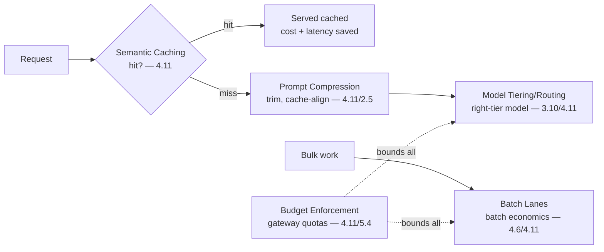

# Chapter 7.8 — Cost & Performance Patterns

| | |
|---|---|
| **Part** | 7 — Enterprise AI Architecture Patterns |
| **Maturity level** | 4 — Architect |
| **Difficulty** | Advanced |
| **Estimated study time** | 3 hours (reading 90 min, exercise 90 min) |
| **Prerequisites** | [4.11 Cost Engineering](../part-4-enterprise-genai-systems/chapter-11-cost-engineering.md); [4.12](../part-4-enterprise-genai-systems/chapter-12-latency-performance.md) |

## Learning Objectives

After this chapter you will be able to:

1. Apply the cost & performance pattern family in pattern-language form: model tiering/routing, semantic caching, prompt compression, batch lanes, and budget enforcement.
2. Select the cost/performance pattern matched to the efficiency need, using each pattern's context, forces, and consequences.
3. Compose cost/performance patterns into the efficiency architecture (4.11/4.12).
4. Recognize the cost/performance patterns in the case studies, the patterns that make GenAI economical and fast.

## Introduction

This chapter catalogs the cost & performance pattern family — the efficiency patterns that Part 4 built (4.11's cost engineering, 4.12's latency), in pattern-language form (7.1). These patterns make GenAI economical (4.11) and fast (4.12) — the cost levers and the latency levers, presented as patterns — and this chapter is the reference for the efficiency patterns.

The framing: **cost & performance patterns make GenAI economical and fast** — the patterns (model tiering/routing, semantic caching, prompt compression, batch lanes, budget enforcement) that reduce the cost (4.11's levers) and the latency (4.12's levers), often the same pattern serving both (caching, tiering — 4.11/4.12), and this chapter is the reference.

## Business Motivation

The cost & performance patterns are what make GenAI economically viable and adoptable — the patterns that reduce the cost (4.11 — the margin, the viability) and the latency (4.12 — the adoption). Without them: the cost is un-engineered (the monotonically-rising unit cost — 4.11, the viability threatened) and the latency is un-engineered (the abandonment — 4.12). With them: the cost is engineered (the levers — 4.11, the 30-80% reductions) and the latency is engineered (the levers — 4.12, the perceived-latency). The business case is the viability-and-adoption one: the cost patterns make GenAI economically viable (4.11 — the margin, the buildable-boundary moved), and the performance patterns make it adoptable (4.12 — the fast, non-abandoned system), and the cost/performance pattern family is the reference for the efficiency architecture — the patterns that make GenAI economical and fast, the viability and adoption the business case depends on.

## Theory — The Cost & Performance Pattern Catalog

### Pattern: Model Tiering/Routing

- **Context** — a workload with tasks of varying difficulty (4.11/3.10).
- **Problem** — the frontier-model-for-everything (4.11's overselection — the cost) or the cheap-model-for-everything (4.11's underselection — the quality).
- **Forces** — the cost (the cheaper model) vs. the quality (the capable model), per task class (3.10's portfolio).
- **Solution** — route each task class to the cheapest model that passes its suite (4.11/3.10 — the portfolio routing, the within-request tiering, the reasoning-budget routing — 3.2), eval-gated (3.10).
- **Structure** — task → route by class → the right-tier model (3.10/4.11).
- **Consequences** — the cost reduction (the 5-20× tier deltas at parity — 4.11); the eval work (each routing a bake-off — 3.10).
- **Known uses** — Corvid's tiered extraction (1.4/2.1), Vantora's 60%-frontier-traffic-down-a-tier (4.11), Kestrel's fine-tuned compact model (2.6).
- **Related** — Semantic Caching (the complementary cost lever), the model selection (3.10), the routing workflow pattern (7.3).

### Pattern: Semantic Caching

- **Context** — a workload with repetitive/similar requests (4.11).
- **Problem** — the repeated inference for identical/near-identical requests (4.11 — the cost, the latency).
- **Forces** — the cache hit rate (the savings) vs. the staleness (4.11 — the stale cached answer).
- **Solution** — cache the responses for identical/near-identical requests (4.11's semantic caching), served from the cache (the cost and latency saved), with TTLs and invalidation (4.11 — the staleness control).
- **Structure** — request → cache lookup (semantic) → hit (serve cached) / miss (generate, cache) (4.11).
- **Consequences** — the cost and latency reduction (the cache hits — 4.11/4.12, and the provider-rate-limit relief — 5.8); the staleness (the TTL — 4.11).
- **Known uses** — the FAQ-shaped traffic (4.11), the repetitive-query systems (4.11).
- **Related** — the prompt caching (4.11/2.5 — the prefix cache), Model Tiering (the complementary lever), the scalability (5.8).

### Pattern: Prompt Compression

- **Context** — a system with token-heavy prompts (4.11/3.2).
- **Problem** — the token-heavy prompt (4.11's dead weight, 2.5's prefill cost).
- **Forces** — the prompt content (the instructions/context) vs. the token cost (4.11/4.12 — the prefill).
- **Solution** — the prompt/context discipline (4.11's lever — trim the eval-unjustified, threshold the retrieval, compact the history — 3.2, the prompt caching for the stable — 2.5), eval-gated (4.11).
- **Structure** — the prompt trimmed to the eval-justified, cache-aligned (4.11/2.5/3.2).
- **Consequences** — the cost and latency reduction (the fewer input tokens — 4.11/4.12, often the quality improved — focused attention — 2.5); the eval-gating (4.11 — the trim is dead weight).
- **Known uses** — Vantora's prompt-pile trim (2.5/4.11), the token-budget discipline (3.2).
- **Related** — the token budget (3.2), the prompt caching (2.5), Model Tiering (the complementary lever).

### Pattern: Batch Lanes

- **Context** — a workload with latency-tolerant bulk work (4.6/4.11).
- **Problem** — the bulk work paying the interactive price (4.11 — the batch not using the batch economics).
- **Forces** — the throughput (the bulk) vs. the latency (the batch is latency-tolerant — 4.6's lanes).
- **Solution** — the batch lane (4.6/4.11 — the latency-tolerant bulk work on the batch-pricing API, off-peak, separate from the interactive lane — 4.6's lanes).
- **Structure** — the workload → lane (interactive / batch) → the batch on the batch economics (4.6/4.11).
- **Consequences** — the batch cost reduction (the batch pricing — 4.11); the latency (the batch is latency-tolerant — 4.6).
- **Known uses** — Corvid's batch extraction (5.2), the ingestion campaigns (4.3), the eval runs (4.7).
- **Related** — the orchestration lanes (4.6), the scalability (5.8), the compute (5.2's spot/batch).

### Pattern: Budget Enforcement

- **Context** — a workload whose cost must be bounded (4.11/4.4).
- **Problem** — the unbounded cost (4.11 — the runaway, the drift, the advisory-budget-that-drifts).
- **Forces** — the flexibility vs. the bound (the enforced budget).
- **Solution** — the gateway-enforced budgets and quotas (4.11/5.4 — per feature/tenant/user, rolling to the fleet breakers — 4.4), with the cost-anomaly alerts (4.11).
- **Structure** — the request → the gateway budget check (4.11/5.4) → enforce (reject/degrade over-budget), the hierarchy (4.4).
- **Consequences** — the bounded cost (the enforced budget — 4.11); the enforcement (the reject/degrade — 4.11).
- **Known uses** — the agent-fleet budget hierarchies (4.4), the gateway quotas (5.4), Vantora's per-tenant quotas (4.11).
- **Related** — the gateway (5.4/7.9), the agent governors (3.8/4.4), the cost governance (4.11).

## Architecture Perspective

Readings. **The cost/performance patterns are the efficiency levers** — the model tiering (the right-tier model — 4.11), the semantic caching (the cache hits — 4.11), the prompt compression (the fewer tokens — 4.11), the batch lanes (the batch economics — 4.11), the budget enforcement (the bounded cost — 4.11) — the cost levers (4.11) and the latency levers (4.12, often the same pattern — caching, tiering, compression serving both — 4.11/4.12). **Many patterns serve both cost and latency** — the semantic caching (the cost and latency — 4.11/4.12), the prompt compression (the cost and the prefill latency — 4.11/4.12/2.5), the model tiering (the cost and the smaller-model latency — 4.11/4.12) — the patterns serving both efficiency dimensions (4.11/4.12). **And the patterns compose into the efficiency architecture** — the caching + compression + tiering + batch lanes + budget enforcement (the efficiency architecture — 4.11/4.12), applied in the lever hierarchy (4.11 — caching first, then compression, then tiering), the cost/performance patterns as the components of the efficiency architecture (7.1's combination), at the gateway (5.4/7.9).

## Real-world Example

**Vantora Systems** (the recurring platform — 4.11) built its efficiency as a cost/performance-pattern composition, and the composition is the pattern family applied in the lever hierarchy (4.11). The composition followed 4.11's hierarchy: the semantic caching (4.11 — the prompt caching's 34% input-cost cut, the cache-aligned prompts — 2.5), the prompt compression (4.11 — the prompt-pile trim, the 4K→1.2K examples — 2.5's Vantora), the model tiering/routing (4.11/3.10 — the 60%-frontier-traffic-down-a-tier at parity, the 34% model-spend cut), the batch lanes (4.6/4.11 — the eval runs and ingestion on the batch economics), and the budget enforcement (4.11/5.4 — the gateway per-tenant quotas, the fleet breakers — 4.4). The cost/performance-pattern composition was the efficiency architecture: caching + compression + tiering + batch lanes + budget enforcement (the efficiency architecture — 4.11/4.12), applied in the lever hierarchy (caching first, the biggest and cheapest — 4.11), at the gateway (5.4/7.9) — the 58% estate cost reduction (4.11). And the patterns served both cost and latency: the caching (the cost and the latency — 4.11/4.12), the compression (the cost and the prefill latency — 4.11/4.12), the tiering (the cost and the smaller-model latency — 4.11/4.12). Adaeze's cost/performance-patterns note (echoing 4.11): *"Our efficiency is a cost/performance-pattern composition, applied in the lever hierarchy (4.11): semantic caching (the biggest, cheapest — 34% input cut), prompt compression (the prompt-pile trim), model tiering (60% frontier traffic down a tier at parity), batch lanes (the eval and ingestion economics), budget enforcement (the gateway quotas). The patterns serve both cost and latency — the caching, compression, tiering all cut both. Composed into the efficiency architecture at the gateway — the 58% cost reduction. The cost/performance patterns are the efficiency levers, applied in the hierarchy, composed at the gateway — the patterns that make GenAI economical and fast."*

## Hands-on Exercise

**Compose cost/performance patterns.** ~90 minutes. For a GenAI system with efficiency needs (real or a case study).

1. **Efficiency-need analysis (25 min).** For a GenAI system, analyze the efficiency needs by the lever hierarchy (4.11): the caching (repetitive requests), the compression (token-heavy prompts), the tiering (varying-difficulty tasks), the batch lanes (bulk work), the budget enforcement (unbounded cost). Map the needs to the patterns.
2. **The pattern-language form (20 min).** For one selected pattern, write its full pattern-language form.
3. **The composition in the lever hierarchy (30 min).** Compose the cost/performance patterns into the efficiency architecture, applied in the lever hierarchy (4.11 — caching first, then compression, then tiering, then batch, then enforcement). Show the cost and latency each pattern serves (4.11/4.12).
4. **The eval-gating (15 min).** For one cost lever (e.g., tiering or compression), show the eval-gating (4.11 — the cost cut quality-confirmed, not a defect with a discount).

**Acceptance criteria:**
- [ ] Efficiency needs mapped to the patterns in the lever hierarchy (4.11)
- [ ] One pattern in the full pattern-language form
- [ ] The efficiency architecture as a pattern composition in the lever hierarchy, with the cost and latency each serves
- [ ] The eval-gating shown for one cost lever (4.11 — quality-confirmed)

## Enterprise Considerations

The cost/performance patterns are the enterprise's efficiency reference, at the gateway. **They're the efficiency reference** (4.11/4.12/7.1): the cost/performance pattern family is the enterprise's reference for the efficiency architecture (4.11's cost, 4.12's latency), the patterns that make GenAI economical and fast. **They're gateway capabilities** (5.4/7.9): the cost/performance patterns (the caching, the tiering, the budget enforcement — 4.11/5.4) are gateway capabilities (5.4 — the gateway's caching, routing, quotas — 7.9), so the cost/performance patterns are platform/gateway capabilities (7.9). **They connect to the cost governance and FinOps** (4.11/6.10): the cost patterns (the tiering, the caching, the budget enforcement — 4.11) are the cost-governance levers (4.11's FinOps, 6.10's TCO), so the cost/performance patterns connect to the cost governance (4.11/6.10). **And the eval-gating is essential** (4.11/4.7): the cost patterns are eval-gated (4.11 — the cost cut quality-confirmed, not a defect with a discount), so the cost/performance patterns connect to the evaluation (4.7 — the eval gate on the cost lever).

## Trade-offs

| Decision | Option A | Option B | Choose A when… | Choose B when… |
|----------|----------|----------|----------------|----------------|
| Lever order | Caching → compression → tiering → batch → enforcement (4.11) | Model-swap first | Always — the hierarchy (cheapest, biggest first — 4.11) | Never model-swap-first; the eval-heavy lever is third (4.11) |
| Semantic caching | Cache near-identical requests | No response caching | Repetitive traffic, staleness-tolerant (4.11) | Time-sensitive/varied — the staleness risk (4.11) |
| Cost cut | Eval-gated | Un-gated | Always — the quality-confirmed cut (4.11) | Never un-gated; the defect with a discount (4.11) |
| Budget | Enforced (gateway) | Advisory | Always — the enforced budget holds (4.11) | Never advisory; the drift (4.11) |

## Common Mistakes

1. **Model-swap first** — the eval-heavy tiering before the cheap caching/compression (4.11's hierarchy); the lever hierarchy (caching first — 4.11).
2. **Un-gated cost cuts** — the cost cut without the eval gate (4.11 — the defect with a discount); the eval-gating (4.11/4.7).
3. **Cache-hostile prompts** — the volatile content in the stable prefix (2.5 — the cache zeroed); the cache-aligned prompts (2.5/4.11).
4. **Total-cost dashboards** — the un-attributed cost (4.11); the per-dimension attribution (4.10/4.11).
5. **Advisory budgets** — the un-enforced budget (4.11's drift); the gateway-enforced budget (4.11/5.4).
6. **The interactive tail unprotected** — the batch on the interactive lane (4.6/5.8); the batch lanes (4.6).
7. **Ignoring the both-dimensions** — the pattern's cost served, the latency ignored (or vice versa); the patterns serve both (4.11/4.12).

## Best Practices

1. **Apply the lever hierarchy** — caching → compression → tiering → batch → enforcement (4.11 — cheapest, biggest first).
2. **Eval-gate every cost cut** — the quality-confirmed cut (4.11/4.7), not a defect with a discount.
3. **Cache-align prompts** — the stable-first ordering (2.5), the free cost-and-latency lever (4.11/4.12).
4. **Tier by task class, eval-gated** — the right-tier model (3.10/4.11), each routing a bake-off (3.10).
5. **Batch the latency-tolerant** — the batch lanes on the batch economics (4.6/4.11).
6. **Enforce budgets at the gateway** — the per feature/tenant/user quotas (4.11/5.4), the fleet breakers (4.4).
7. **Compose at the gateway** — the efficiency architecture at the gateway (5.4/7.9), the patterns serving both cost and latency (4.11/4.12).

## Architecture Checklist

For applying the cost & performance patterns:

- [ ] The lever hierarchy applied (caching → compression → tiering → batch → enforcement — 4.11)
- [ ] Semantic and prompt caching (cache-aligned prompts — 2.5), the cost and latency lever
- [ ] Prompt compression (the eval-justified trim — 4.11), eval-gated
- [ ] Model tiering/routing by task class (3.10/4.11), eval-gated (each routing a bake-off)
- [ ] Batch lanes for the latency-tolerant bulk work (4.6/4.11)
- [ ] Budget enforcement at the gateway (4.11/5.4), the fleet breakers (4.4)
- [ ] The patterns composed at the gateway (5.4/7.9), serving both cost and latency; eval-gated (4.7)

## Interview Questions

1. *"Walk me through the cost and performance patterns and the order you'd apply them."* — Strong answers give the family (model tiering, semantic caching, prompt compression, batch lanes, budget enforcement) and the lever hierarchy (4.11 — caching first, cheapest and biggest, then compression, then tiering, then batch, then enforcement), noting many serve both cost and latency (4.11/4.12).
2. *"How do you reduce GenAI costs without hurting quality?"* — Strong answers give the eval-gating (4.11 — every cost lever quality-confirmed, not a defect with a discount), the lever hierarchy (caching → compression → tiering, each eval-gated — 4.11/4.7), and the diagnosis-first (4.11 — the driver identified before the lever).
3. *"Which patterns serve both cost and latency?"* — Strong answers name the semantic caching (the cache hits — cost and latency — 4.11/4.12), the prompt compression (the fewer tokens — cost and the prefill latency — 4.11/4.12/2.5), the model tiering (the cheaper and the smaller-model latency — 4.11/4.12) — the patterns serving both efficiency dimensions.
4. *"How do you bound GenAI cost?"* — Strong answers give the budget enforcement pattern (4.11/5.4 — the gateway-enforced budgets and quotas per feature/tenant/user, rolling to the fleet breakers — 4.4, the cost-anomaly alerts — 4.11), the enforced (not advisory) budget that holds.

## Further Reading

- 4.11 Cost Engineering (the lever hierarchy) and 4.12 Latency & Performance (the latency levers) — the chapters this pattern family formalizes.
- 3.10 Model Selection (the tiering/routing) and 2.5 The Transformer (the caching/prefill) — the source of the patterns.
- The [architecture review checklist](../../checklists/architecture-review-checklist.md) — the cost section the patterns implement.
- The [case studies](../../case-studies/README.md) — the cost/performance patterns' known uses.

## Summary

- The **cost & performance pattern family** makes GenAI economical and fast — model tiering/routing (the right-tier — 4.11), semantic caching (the cache hits — 4.11), prompt compression (the fewer tokens — 4.11), batch lanes (the batch economics — 4.11), budget enforcement (the bounded cost — 4.11).
- **Many patterns serve both cost and latency** — the caching, compression, and tiering cut both (4.11/4.12) — the efficiency levers for both dimensions.
- The patterns are applied in the **lever hierarchy** (4.11 — caching first, cheapest and biggest, then compression, then tiering, then batch, then enforcement), **eval-gated** (4.11/4.7 — the cost cut quality-confirmed, not a defect with a discount).
- The patterns **compose into the efficiency architecture at the gateway** (5.4/7.9) — the caching + compression + tiering + batch lanes + budget enforcement (Vantora's 58% cost reduction — 4.11).
- The cost/performance patterns are the enterprise's **efficiency reference** — gateway capabilities (7.9), connected to the cost governance and FinOps (4.11/6.10). The platform & multi-tenancy patterns that host all of this are next: **platform & multi-tenancy patterns** (7.9).

---

**Previous:** [Chapter 7.7 — Knowledge & Data Patterns](chapter-07-knowledge-data-patterns.md) · **Next:** [Chapter 7.9 — Platform & Multi-tenancy Patterns](chapter-09-platform-multitenancy-patterns.md) · **Related:** [4.11 Cost Engineering](../part-4-enterprise-genai-systems/chapter-11-cost-engineering.md), [4.12 Latency & Performance](../part-4-enterprise-genai-systems/chapter-12-latency-performance.md), [7.9 Platform & Multi-tenancy Patterns](chapter-09-platform-multitenancy-patterns.md)
