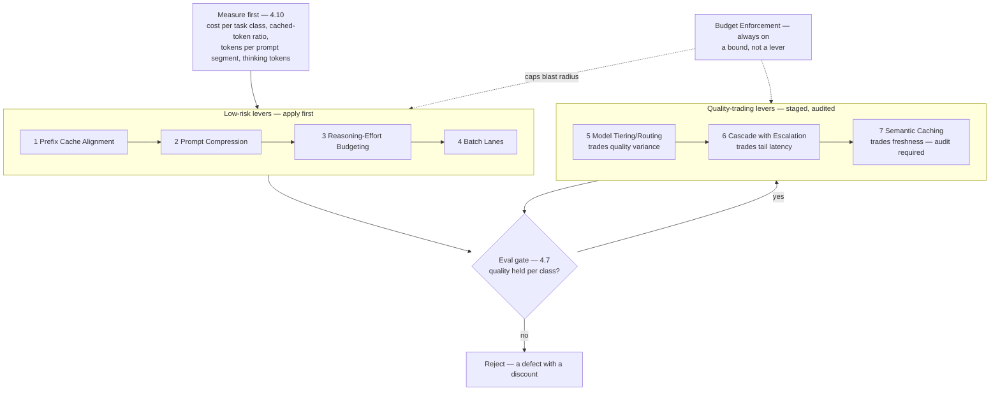

# Chapter 7.8 — Cost & Performance Patterns

| | |
|---|---|
| **Part** | 7 — Enterprise AI Architecture Patterns |
| **Maturity level** | 4 — Architect |
| **Difficulty** | Advanced |
| **Estimated study time** | 2 hours (reading 40 min, exercise 75 min) |
| **Prerequisites** | [4.11 Cost Engineering](../part-4-enterprise-genai-systems/chapter-11-cost-engineering.md); [4.12](../part-4-enterprise-genai-systems/chapter-12-latency-performance.md) |

## Learning Objectives

After this chapter you will be able to:

1. Apply the cost & performance pattern family in pattern-language form: Model Tiering/Routing, Cascade with Escalation, Prefix Cache Alignment, Semantic Caching, Prompt Compression, Reasoning-Effort Budgeting, Batch Lanes, and Budget Enforcement.
2. State what each pattern trades away — latency, freshness, quality variance, interactivity, operational surface — and price that trade before applying it.
3. Name each pattern's measurement precondition and its paired success metrics (hit rate *and* false-hit rate; escalation rate *and* quality on the escalated slice).
4. Sequence the levers by risk rather than by headline saving, and defend the order in a design review.

## Introduction

Every pattern here buys money or milliseconds by spending something else. Cascades trade latency on escalated requests, caches trade freshness, tiering trades quality variance, batching trades interactivity, compaction trades context you may later need. So the chapter's spine is not the catalog but the two disciplines around it: **optimize only what you have measured, and gate every lever on evals**.

The failure this prevents is specific. A team ships a saving, the spend graph falls, and three weeks later support tickets reveal that a similarity threshold has been returning last quarter's policy answer to this quarter's question. Nothing alerted, because cost dashboards do not measure correctness. A cost pattern applied without an eval gate is a quality regression waiting to be discovered by users — the most expensive detector you can build.

## Business Motivation

Unit cost decides which features exist: a workflow whose honest per-request economics do not close never ships, so these patterns move the boundary of the buildable, and the [TCO](../../GLOSSARY.md) case for a platform team is usually written in them ([6.10](../part-6-enterprise-architecture/chapter-10-tco-business-case.md)).

The downside is concrete and less often modelled, because each pattern has a *failure price*. A false cache hit costs a wrong answer delivered confidently, plus the trust that answer was carrying. A cascade whose escalation rate drifts upward pays both models on most requests — worse economics than the frontier model alone, at worse tail latency. A tier downgrade that fails on one minority task class costs rework, human correction, and a quality reputation earned over a year. Every one of these is invisible on a spend graph and visible only in evals, audits, and paired metrics — which is why each pattern below carries a measurement precondition. And unbounded spend across a shared gateway ends in the CFO's blunt instrument: a freeze that taxes every team for one team's leak.

## Theory — The Cost & Performance Pattern Catalog

Each pattern carries one element beyond the standard form: **Measurement** — what you instrument *before* applying it, and the signal that says it is working. A pattern without its measurement is not applicable; it is a guess with a plausible shape.

### Pattern: Model Tiering/Routing

- **Context** — a workload whose task classes differ in difficulty: classification, extraction, and routing sitting beside open-ended drafting, all served today by one model chosen for the hardest of them.
- **Problem** — one model for everything is priced for the hardest task and billed on every request; one cheap model for everything fails the hard tail invisibly.
- **Forces** — the per-class quality floor pulls up while per-class unit cost pulls down; proving a downgrade safe costs eval work that competes with the spend it saves; routing tables go stale every time a provider ships a model.
- **Solution** — define task classes, build a suite per class, bake off candidates per class, and route deterministically by class label — never by the model's own claim about difficulty. Unclassified traffic defaults to the expensive tier: fail expensive, not wrong. Record the chosen cost-quality point with its evidence ([1.4](../part-1-professional-foundation/chapter-04-tradeoff-analysis.md)).
- **Structure** — request → class label (rule or small classifier) → tier → response; per-class cost and quality panels read side by side.
- **Measurement** — precondition: spend attributed per task class ([4.10](../part-4-enterprise-genai-systems/chapter-10-observability.md)) and a suite per class. Working: traffic shifts down-tier while per-class eval scores hold and **cost per successful task** falls. Failing: cost per *call* falls while retries and human edits rise — the saving moved downstream rather than existing.
- **Consequences** — the largest headline saving in the catalog and the most eval work per unit saved. It buys deliberate quality variance: two classes meet two models, and the weaker one sets your reputation on its class. A misrouted class raises no error; it produces slightly worse answers indefinitely. The routing table needs an owner and a re-run trigger on model releases.
- **Known uses** — every major provider ships a small/mid/large family behind one API, making a tier change a parameter rather than a migration; open-source gateways and routers (LiteLLM, OpenRouter) make per-class routing and fallback declarative; the published RouteLLM project trains a router to send only the queries that need it to the strong model. Worked instance (fictional): Vantora's 60% of frontier traffic moved down a tier at measured parity (4.11).
- **Related** — Cascade with Escalation (the dynamic sibling); Reasoning-Effort Budgeting (the second axis); champion–challenger ([7.11](chapter-11-predictive-scoring-patterns.md)) is this pattern's promotion discipline.

### Pattern: Cascade with Escalation

- **Context** — a class where most instances are easy but difficulty cannot be predicted before the attempt: support answers, extraction over messy scans, small code fixes.
- **Problem** — static tiering needs a difficulty predictor at request time; you rarely have one, but you can judge an *answer* cheaply once it exists.
- **Forces** — blended cost pulls toward attempting cheap first; tail latency pulls back, because an escalated request pays both calls end to end. A calibrated accept/escalate signal is expensive; an uncalibrated one trades false accepts (a cheap wrong answer shipped) against false escalates (the saving evaporates).
- **Solution** — attempt on the cheap tier; a bounded check — schema validity, verifier rubric, self-consistency, or a calibrated confidence threshold — decides accept or escalate *once*, logging both attempts with the score. Depth stays at two; three-stage cascades multiply tail latency faster than they save.
- **Structure** — request → cheap tier → check → accept │ escalate → strong tier → respond.
- **Measurement** — precondition: a checker whose accept decisions you have validated against human labels on a sample. Signals: escalation rate, quality on the escalated slice, **and quality on the accepted slice** — the false-accept audit is the one teams skip and the only one that catches silent degradation; plus p95 latency including the escalated tail, and blended cost per *resolved* request.
- **Consequences** — cost tracks actual difficulty rather than assumed difficulty, but escalated requests pay roughly both calls in money and latency, so the arithmetic turns negative at a surprisingly modest escalation rate — and that rate drifts as traffic changes. The checker becomes a component with its own evals and owner.
- **Known uses** — the published FrugalGPT work (Chen, Zaharia, Zou, 2023) documents cheap-first cascades with a scored accept/escalate decision; RouteLLM ships the strong/weak decision as open source; verify-then-escalate is standard where a grounded cheap answer is checked before reaching a customer. Worked instance (fictional): Corvid's customs-extraction ladder (1.4).
- **Related** — Model Tiering/Routing (choose it where class predicts difficulty); dual-model verification ([7.6](chapter-06-safety-guardrail-patterns.md)) — the checker is never the drafter.

### Pattern: Prefix Cache Alignment

- **Context** — repeated calls sharing a long stable head: system prompt, tool definitions, a few-shot block, or one document read many times.
- **Problem** — the stable head is re-processed and re-billed on every call, and prompt assembly that interleaves volatile content — a timestamp, a user ID, a retrieved chunk — into that head destroys reuse entirely.
- **Forces** — authoring convenience (the user's name reads better at the top) against byte-stability; cache lifetime against traffic arrival rate, since a prefix that expires between calls never repays its write.
- **Solution** — order every prompt stable-first, volatile-last; freeze the head's bytes; place the cache boundary below the largest stable block; make prompt assembly deterministic and *test that property* the way you test a schema.
- **Structure** — `[system + tools + examples: cached]` → `[retrieved evidence]` → `[user turn]`, with cached-token ratio measured per feature.
- **Measurement** — precondition: telemetry separating cached from uncached input [tokens](../../GLOSSARY.md). Working: cached-input ratio rising, time-to-first-token falling on cached paths. This is the one pattern whose success needs no quality metric — a hit returns the same computation, not a similar one.
- **Consequences** — cost and prefill latency fall together, with no staleness and no quality risk: the cheapest and safest lever there is. Its weakness is fragility rather than danger — one interpolated timestamp above the boundary silently zeroes the ratio, and low-traffic features can pay cache-write overhead for hits that never arrive.
- **Known uses** — the major providers all bill repeated prefix tokens at a reduced rate, through explicit cache breakpoints or automatic prefix matching, subject to a short idle lifetime; self-hosted engines (vLLM, SGLang) reuse KV-cache prefixes across requests for the same effect on your own hardware. Worked instance (fictional): Vantora's estate cache ratio moving from 12% to 71% on restructuring alone (4.11).
- **Related** — Prompt Compression (trims what caching cannot reuse); Semantic Caching (the other cache — opposite risk profile, routinely confused with this one in review).

### Pattern: Semantic Caching

- **Context** — a query distribution repetitive in *meaning* but not in bytes: policy Q&A, FAQ-shaped support traffic, product questions asked fifty ways.
- **Problem** — near-duplicate questions each pay a full generation, and exact-match caching almost never hits on natural language.
- **Forces** — one knob moves two metrics the same direction: loosening the similarity threshold raises hit rate *and* false-hit rate. Reuse fights freshness, and shared reuse fights isolation — two users with different permissions must never share an answer ([7.7](chapter-07-knowledge-data-patterns.md)).
- **Solution** — embed the normalized query, look up the nearest neighbour above a threshold, serve on hit. Derive the threshold by replaying real query logs and labelling the near-misses — never from intuition, never from the library default. Cache keys carry tenant and permission set; TTLs are set per volatility class; corpus publication invalidates.
- **Structure** — request → embed → lookup ≥ threshold → hit (serve, log) │ miss (generate, store); a standing sample of hits is re-generated and compared.
- **Measurement** — precondition: a labelled replay set of real queries, including pairs a human calls "the same question" and pairs a human calls "dangerously similar". Signals: **hit rate and false-hit rate together**, the second from the standing re-generation audit; plus the age distribution of answers actually served.
- **Consequences** — the largest per-hit saving in the catalog, since the whole call disappears — and the only pattern that can serve a *wrong* answer with full confidence, invisibly to every cost dashboard. It does not apply to personalized, account-specific, or time-sensitive answers, and a permission-blind cache key is a data leak rather than an optimization. The audit is a permanent operating cost, not a launch task.
- **Known uses** — GPTCache implements embedding-similarity response caching as an open-source library; semantic-cache helpers ship in mainstream vector tooling; gateway and proxy layers (LiteLLM, Portkey) expose exact and similarity-based response caching as configuration. Worked instance (fictional): Vantora's policy-FAQ cache, re-thresholded after a default proved too loose.
- **Related** — Prefix Cache Alignment; the freshness pipeline (7.7), whose publish events invalidate this cache.

### Pattern: Prompt Compression

- **Context** — prompts that have accreted: rules layered on rules, unauditioned examples, fixed-k retrieval, unbounded history — until input tokens dominate the bill.
- **Problem** — every token is billed on every call and re-processed in prefill; past a point, accreted context also degrades attention on the part that matters.
- **Forces** — the instinct that more context is safer against measured quality; retrieval recall (fixed-k) against token cost (score-thresholded k); history fidelity against compaction loss; a summarizer's compute against the tokens it saves.
- **Solution** — three moves in order. **Delete**: audition each rule and example against the suite; what does not earn its tokens goes. **Threshold**: score-gate retrieval instead of fixed-k. **Compact**: summarize old turns behind a rolling window, keeping the last N verbatim and pinned facts structured. Never compress evidence spans a citation must point at ([7.2](chapter-02-rag-patterns.md)).
- **Structure** — prompt = `[stable head, cached]` + `[thresholded evidence]` + `[compacted history]` + `[turn]`, each segment budgeted.
- **Measurement** — precondition: token counts broken out *per prompt segment*, not per request. Signals: tokens per segment falling, eval score held, TTFT down. Compaction's failure signal is behavioural — clarifying questions or users repeating themselves mean the summarizer dropped something load-bearing.
- **Consequences** — usually the rare lever that improves cost, latency, and quality together. But compaction is lossy and its loss is silent; the summarizer is a new call with a new failure mode; and over-trimming appears not as an error but as a model asking for what it was already told.
- **Known uses** — LLMLingua (Microsoft Research) compresses prompts using a small model; summarizing conversation memory ships in mainstream orchestration frameworks; coding agents compact history automatically as they approach the context window. Worked instance (fictional): Vantora's 4K few-shot block pruned to 1.2K on eval evidence (4.11).
- **Related** — Prefix Cache Alignment (compress *below* the cache boundary, or you break both levers); Batch Lanes.

### Pattern: Reasoning-Effort Budgeting

- **Context** — task classes served by a reasoning model, where the model chooses how long to deliberate and thinking tokens are billed as output ([2.6](../part-2-artificial-intelligence/chapter-06-training-finetuning-alignment.md)).
- **Problem** — deliberation is priced like generation and varies per request, so a reasoning model pointed at extraction or routing buys thought nobody needed, at output rates, with a duration that varies run to run.
- **Forces** — accuracy on genuinely hard classes against cost and latency variance on easy ones; providers commonly summarize or withhold the chain, so you cannot audit what you paid for; effort controls are provider-specific and shift across model versions.
- **Solution** — route effort as a per-class parameter, not a global default: minimal or disabled for extraction, classification, and routing; generous only where the bake-off shows it pays. Cap maximum output, and re-run the comparison at every model upgrade, because defaults move.
- **Structure** — class → one routing record of (tier, effort budget, max output).
- **Measurement** — precondition: telemetry separating thinking tokens from answer tokens per class. Signals: accuracy per class at each effort setting, p50/p95 thinking tokens, latency variance as an SLO of its own. Failing: thinking tokens growing on a class whose accuracy is flat.
- **Consequences** — frequently the fastest large saving on a reasoning-heavy estate, because the change is a parameter rather than an architecture. It makes latency variance a first-class problem — the model, not you, decides the request's duration — and hidden chains can never serve as audit evidence, so behavioural evals remain the only ground truth (2.6).
- **Known uses** — the major providers expose per-request effort or thinking-budget controls alongside their reasoning models and bill thinking tokens at output rates; their guidance consistently recommends matching effort to task difficulty rather than defaulting high.
- **Related** — Model Tiering/Routing (this is its second axis); Cascade with Escalation (escalate to *more thought*, not only to a bigger model).

### Pattern: Batch Lanes

- **Context** — work with nobody waiting: nightly re-embedding, corpus enrichment, backfills, eval runs, periodic reporting.
- **Problem** — latency-tolerant volume runs on the interactive path, paying interactive prices, consuming the same rate limits, and eating the interactive tail's headroom exactly when a large job lands.
- **Forces** — turnaround time against unit price; deadline against queue depth; the operational simplicity of one path against the economics of two.
- **Solution** — declare a lane per workload against its true deadline. Anything that can wait hours submits asynchronously; batch takes separate credentials and quota so it cannot starve interactive; job units are idempotent, retried per item, with an explicit partial-results contract ([4.6](../part-4-enterprise-genai-systems/chapter-06-orchestration-workflows.md)).
- **Structure** — job → batch lane (async submit → poll or callback) → results store; interactive lane isolated by quota and priority.
- **Measurement** — precondition: classify each workload's real deadline by asking who waits and until when; the answer is usually "nobody, and never". Signals: share of tokens in the batch lane, completion inside the promised window, and the one that decides whether the lane works — **interactive p99 unchanged while a large batch runs**.
- **Consequences** — a discount on work that never needed to be fast, plus rate-limit relief for the interactive lane. In exchange you inherit a job system — submission, polling, partial failure, results retention — and an SLA measured in hours. Debugging changes character: a batched workload cannot be poked at interactively, so its failures arrive in bulk, hours later.
- **Known uses** — the major providers offer asynchronous batch endpoints priced below their synchronous equivalents for work returned within a stated turnaround window; self-hosted stacks (vLLM, TGI) raise throughput per GPU through continuous batching; preemptible and spot compute suits offline jobs ([5.2](../part-5-cloud-infrastructure-platform/chapter-02-compute-for-ai.md)).
- **Related** — orchestration lanes (4.6); Batch Scoring (7.11 — the classical cousin).

### Pattern: Budget Enforcement

- **Context** — many teams, tenants, and features sharing one gateway, plus agent loops with no natural stopping point.
- **Problem** — advisory budgets drift and runaways are discovered on the invoice; one tenant or one looping agent can consume a quota everyone depends on.
- **Forces** — hard bounds against legitimate bursts; rejecting against degrading (no answer versus a cheaper answer); central enforcement against team autonomy.
- **Solution** — enforce at the gateway: spend and token quotas per key, tenant, and feature, rolling up to a fleet breaker ([4.4](../part-4-enterprise-genai-systems/chapter-04-agent-architectures-production.md)). Each feature declares its over-budget behaviour in writing — reject with a clear error, degrade to a cheaper tier, or divert to the batch lane. Anomaly alerts watch unit cost, cached ratio, and model mix; showback puts each team's bill on its own dashboard.
- **Structure** — request → gateway (identify tenant/feature → check budget → allow │ degrade │ reject) → model; spend events → attribution store → alerts and showback.
- **Measurement** — precondition: every call labelled with tenant, feature, and version (4.10). Signals: budget utilization per tenant, rejection and degradation rates — a rise means an attack, a bug, or a wrong budget, and all three want a human — and time-to-detect a cost anomaly.
- **Consequences** — spend becomes bounded and attributable, and a runaway meets a wall instead of an invoice. Enforcement is a user-visible failure mode needing product design, not just a threshold; budgets set once and never revisited throttle legitimate growth. Note what this pattern does *not* do: it never reduces unit cost. It caps blast radius.
- **Known uses** — gateway and proxy products expose per-key virtual budgets and rate limits (LiteLLM's virtual keys are the common open-source implementation); providers offer account-level spend limits and usage tiers; cloud budget and alerting services cover the infrastructure half. Worked instance (fictional): Vantora's per-tenant gateway quotas (4.11).
- **Related** — the gateway ([7.9](chapter-09-platform-multitenancy-patterns.md)); agent governors (4.4).

### The sequencing rule

4.11's hierarchy puts caching first; this chapter splits that lever, because the two caches sit at opposite ends of the risk scale and must never be pulled together. Order by **risk, not headline saving**: (1) **Prefix Cache Alignment** — mechanical, quality-neutral, verifiable in a day; (2) **Prompt Compression** — eval-gated, usually improves quality too; (3) **Reasoning-Effort Budgeting** — a parameter change, often the largest safe win on reasoning-heavy estates; (4) **Batch Lanes** — no interactive risk once lane isolation is proven; (5) **Model Tiering/Routing** — biggest number, most eval work, permanent quality variance; (6) **Cascade with Escalation** — only where class fails to predict difficulty; (7) **Semantic Caching** — last, on staleness-tolerant classes only, with the false-hit audit funded before launch. **Budget Enforcement** sits outside the sequence: always on from day one, bounding what the other seven cannot.

## Architecture Perspective

Two readings. **The eval gate sits inside the loop, not at the end** — every lever returns through it, and a lever that fails is rejected rather than shipped with a caveat. **Six of the eight patterns physically live in the gateway** (routing, both caches, effort defaults, lane selection, budgets), which is what makes cost engineering largely platform engineering: the alternative is fifty teams implementing caching separately, each with its own false-hit rate and none with an audit.

## Real-world Example

**Vantora Systems** (fictional, US SaaS — 4.11) ran its efficiency programme in the order above, and the order is why it worked. It opened with three weeks of *not optimizing*: extending the gateway's cost plane to break out cached versus uncached input tokens, tokens per prompt segment, and spend per task class. That instrumentation made every later claim checkable.

**Prefix Cache Alignment** came first — request IDs and a formatted timestamp sat above the few-shot block, holding the estate's cache ratio at 12%; restructuring stable-first raised it to 71%, cut input cost 34% in a week, and moved TTFT, with zero eval movement. **Prompt Compression** followed: a 4K example block auditioned down to 1.2K, mostly near-duplicates, and history compaction shipped only after the clarifying-question rate held flat for two weeks. **Reasoning-Effort Budgeting** was the surprise — the classification path had inherited a reasoning model at a generous default; minimal effort on that class removed a quarter of its output tokens with no accuracy change. **Batch Lanes** moved eval runs and re-embedding off the interactive path, accepted on interactive p99 during a full corpus re-embed rather than on the invoice. **Model Tiering/Routing** came fifth, taking six weeks of bake-offs to move 60% of frontier traffic down a tier at parity — the headline 34% off model spend, earned last.

**Semantic Caching** was the one that bit. Launched on the policy-FAQ class at the library's default threshold, it hit 41% and looked excellent for eleven days, until an audit sample showed two distinct questions about refund windows collapsing onto one cached answer. The threshold was re-derived from a labelled replay of six weeks of real queries; hit rate settled at 23%, and the standing re-generation audit became a permanent line item. Adaeze's note to the platform team: *"The cache wasn't wrong because the threshold was wrong. It was wrong because we shipped a lever whose failure mode nothing on our dashboards could see."* Estate total: 58% cost reduction, no measured quality loss, one near-miss that changed the launch checklist.

## Hands-on Exercise

**Sequence and price the levers on a real system.** ~75 minutes. Use any Part 3/4 build of your own, or a case study with cost characteristics.

1. **Instrument before deciding (20 min).** Produce four numbers: cost per task class, cached-input ratio, tokens per prompt segment, and — if a reasoning model is in play — thinking tokens per class. Where a number is unavailable, write what you would add to get it; that gap is the finding.
2. **Apply lever 1 (15 min).** Restructure one prompt stable-first and re-measure. Report the cached-ratio and TTFT deltas.
3. **Price a risky lever (20 min).** Choose semantic caching or a cascade. Write its measurement plan *before* any design: both paired metrics, the audit's sample size and cadence, its owner, and the threshold at which you would switch the lever off.
4. **Write the sequencing memo (20 min).** Order every applicable lever by risk, one sentence each on what it trades away, and name the lever you are deliberately *not* pulling.

**Acceptance criteria:**
- [ ] Four measurement numbers reported, or the instrumentation gap named for each missing one
- [ ] Prefix alignment applied, with before/after cached ratio and TTFT delta
- [ ] The risky lever's plan names both paired metrics, audit cadence, owner, and a kill threshold
- [ ] The memo orders levers by risk (not headline saving) and states each trade-away
- [ ] At least one lever explicitly declined, with the reason

## Enterprise Considerations

These are platform capabilities, not per-team code: routing, both caches, effort defaults, lanes, and budgets belong at the gateway (7.9), where the false-hit audit runs once for everyone and per-tenant attribution already exists. Cache design is also a data-protection question — a key that ignores tenant or permission set is an isolation failure that happens to save money, and an auditor will find it before a monitor does (7.7). Commitment economics shift the arithmetic: under provisioned throughput, unused capacity is already paid for, so the levers optimize against a different baseline, and FinOps and architecture model it jointly (4.11). Every lever needs an owner and a review cadence — routing tables go stale on model releases, thresholds drift with traffic, budgets set at launch throttle growth two quarters later. An optimization nobody owns decays into a quality risk nobody is watching.

## Trade-offs

| Decision | Option A | Option B | Choose A when… | Choose B when… |
|----------|----------|----------|----------------|----------------|
| Lever order | By risk (prefix cache → compression → effort → lanes → tiering → cascade → semantic cache) | By headline saving (tiering or semantic cache first) | Always — the safe levers land in days and fund the eval-heavy ones | Never; the biggest number is the most eval-expensive and riskiest to ship early |
| Difficulty handling | Model Tiering/Routing (static, by class) | Cascade with Escalation (dynamic, by result) | Task class reliably predicts difficulty; tail latency is tight | Difficulty is unpredictable per request and a validated cheap checker exists |
| Repetition handling | Prefix Cache Alignment | Semantic Caching | Always first — no staleness, no quality risk, no audit cost | Meaning genuinely repeats, answers tolerate staleness, and the false-hit audit is funded |
| Reasoning spend | Effort routed per class | One global effort default | Classes differ in difficulty — nearly always | Only one task class exists and its bake-off justified the setting |
| Over-budget behaviour | Degrade (cheaper tier or batch lane) | Reject with a clear error | The degraded answer is still useful and the drop is disclosed | A wrong-tier answer would mislead; clean failure is the honest outcome |

## Common Mistakes

1. **Optimizing before measuring** — a lever chosen from a diagram rather than from cost-per-class and cached-ratio numbers; the usual result is effort spent on the second-largest driver.
2. **Shipping a cost lever without an eval gate** — the saving is celebrated, the regression is found by users weeks later, and the rollback costs more than the lever saved.
3. **Watching hit rate without false-hit rate** — semantic caching's signature failure, with the cost graph looking perfect throughout.
4. **Cascades that escalate too often** — past a modest rate you pay both models on most requests at worse tail latency than the frontier model alone; measure blended cost per resolved request.
5. **Volatile content above the cache boundary** — one interpolated timestamp zeroes the cheapest lever in the catalog; make assembly determinism a test.
6. **Compaction without a behavioural signal** — a summarizer that silently drops a constraint surfaces as clarifying questions, never as an error.
7. **Reasoning defaults left untouched** — a deliberating model on a classification path, billed at output rates for thought nobody reads (2.6).
8. **Advisory budgets and permission-blind cache keys** — the first guarantees drift, the second is an isolation breach dressed as an optimization.

## Best Practices

1. **Instrument in four dimensions first** — cost per task class, cached-token ratio, tokens per prompt segment, thinking tokens per class.
2. **Order levers by risk** — mechanical and quality-neutral first; the ones trading freshness or quality variance last, and never two at once.
3. **Pair every metric** — hit rate with false-hit rate, escalation rate with quality on both slices, cost per call with cost per successful task.
4. **Fund the audit before the launch** — for any lever that can return a confidently wrong answer, the standing sample is part of the design.
5. **Change one lever at a time** — two at once makes a regression unattributable and a rollback a guess.
6. **State the trade in the decision record** — what this pattern costs in latency, freshness, variance, or interactivity, in the same paragraph as the saving (1.4).
7. **Give every lever an owner and a cadence** — routing tables, thresholds, and budgets each decay on their own schedule.

## Architecture Checklist

For applying the cost & performance patterns:

- [ ] Cost decomposed per task class, with cached-token ratio and per-segment token counts, before any lever is chosen
- [ ] Prompts stable-first with a tested determinism property; cache ratio alerted on drops
- [ ] Prompt trims and compaction eval-gated, with a behavioural signal watching for lost context
- [ ] Reasoning effort routed per class; thinking tokens broken out and p95 monitored
- [ ] Batch lanes isolated by quota and acceptance-tested on interactive p99 during a large job
- [ ] Tiering decisions bake-off-justified per class, with an owner and a re-run trigger on model releases
- [ ] Cascade checkers validated against human labels; the accepted slice audited, not just the escalated one
- [ ] Semantic cache threshold derived from labelled log replay; false-hit audit staffed and scheduled; keys partitioned by tenant and permission set
- [ ] Budgets enforced at the gateway per key/tenant/feature, with a written over-budget behaviour and fleet breakers
- [ ] Every applied lever names what it trades away, in the decision record

## Interview Questions

1. *"Your inference bill needs to come down 40%. What do you do first?"* — Strong answers refuse to name a lever first: instrument cost per task class, cached-token ratio, and per-segment tokens, then pull prefix alignment and compression while the tiering bake-offs run. Weak answers open with "switch to a cheaper model".
2. *"How would you know your semantic cache is hurting you?"* — Strong answers name the paired metric immediately (hit rate is meaningless without false-hit rate), describe the standing re-generation audit and its cadence, and note that the failure is invisible on cost dashboards by construction; senior answers add permission-partitioned keys and per-volatility TTLs.
3. *"When is a cascade worse than just using the expensive model?"* — Strong answers do the arithmetic: escalated requests pay both calls in money and latency, so above a modest escalation rate the cascade loses on cost and always loses on tail latency. They name checker miscalibration as the drift mechanism and false accepts as the quality risk.
4. *"Your reasoning-model bill tripled with flat traffic. Diagnose it."* — Strong answers separate thinking tokens from answer tokens per class, look for a class that inherited a generous effort default or a model upgrade that moved it, and fix it by routing effort per class rather than swapping models (2.6).

## Further Reading

- [4.11 Cost Engineering](../part-4-enterprise-genai-systems/chapter-11-cost-engineering.md) and [4.12 Latency & Performance](../part-4-enterprise-genai-systems/chapter-12-latency-performance.md) — the lever mechanics this family formalizes; 4.10 is the telemetry substrate all eight patterns assume.
- Your providers' pricing, prompt-caching, batch-API, and reasoning-effort documentation — the only trustworthy source for current rates, cache lifetimes, and turnaround windows. Date-stamp what you use and re-read quarterly; every number in this area perishes.
- Chen, Zaharia, Zou, *FrugalGPT* (2023) and the RouteLLM project — the published treatments of cascades and learned routing, readable at method level.
- GPTCache and LLMLingua — open-source reference implementations of semantic caching and prompt compression, worth reading for their documented failure modes as much as their code.
- The [architecture review checklist](../../checklists/architecture-review-checklist.md) — its cost section is this chapter's gate at design time.

## Summary

- **Every pattern here trades something away**: cascades trade tail latency, caches trade freshness, tiering trades quality variance, batching trades interactivity, compaction trades context. The trade belongs in the decision record beside the saving.
- **Measure before optimizing, in four dimensions** — cost per task class, cached-token ratio, tokens per prompt segment, thinking tokens per class. A pattern's measurement precondition is what makes it applicable at all.
- **Pair the metrics**: hit rate with false-hit rate, escalation rate with quality on the escalated *and* accepted slices, cost per call with cost per successful task. Single metrics are how silent regressions ship.
- **Sequence by risk, not headline saving** — prefix alignment, compression, effort budgets, batch lanes, then tiering, cascade, and semantic caching last, with budget enforcement always on as a bound rather than a lever.
- A cost lever without an eval gate is a defect with a discount, and its detector of last resort is a customer. The platform patterns hosting all eight levers — gateway, quotas, tenant isolation — are next (7.9).

---

**Previous:** [Chapter 7.7 — Knowledge & Data Patterns](chapter-07-knowledge-data-patterns.md) · **Next:** [Chapter 7.9 — Platform & Multi-tenancy Patterns](chapter-09-platform-multitenancy-patterns.md) · **Related:** [4.11 Cost Engineering](../part-4-enterprise-genai-systems/chapter-11-cost-engineering.md), [4.12 Latency & Performance](../part-4-enterprise-genai-systems/chapter-12-latency-performance.md), [7.9 Platform & Multi-tenancy Patterns](chapter-09-platform-multitenancy-patterns.md)
