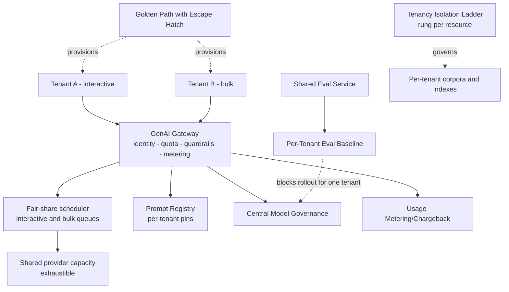

# Chapter 7.9 — Platform & Multi-tenancy Patterns

| | |
|---|---|
| **Part** | 7 — Enterprise AI Architecture Patterns |
| **Maturity level** | 4 — Architect |
| **Difficulty** | Advanced |
| **Estimated study time** | 2 hours (reading 40 min, exercise 75 min) |
| **Prerequisites** | [5.4 API & Integration Layer](../part-5-cloud-infrastructure-platform/chapter-04-api-integration-layer.md); [5.10](../part-5-cloud-infrastructure-platform/chapter-10-iac-platform-engineering.md) |

## Learning Objectives

After this chapter you will be able to:

1. State the break-even condition for an internal AI platform, and recognize when building one is premature.
2. Place each resource on the tenancy isolation ladder using a citable requirement rather than a preference.
3. Apply the family in pattern-language form: Tenancy Isolation Ladder, Per-Tenant Quota & Fair-Share, Usage Metering/Chargeback, Per-Tenant Eval Baseline, GenAI Gateway, Prompt Registry, Shared Eval Service, Central Model Governance, Golden Path with Escape Hatch.
4. Specify what the platform owes tenants for the autonomy they give up: an SLA, a deprecation window, migration support, and a way off the path.

## Introduction

A platform is an economic claim before it is an architecture, and the claim is falsifiable: **the Nth team must be cheaper than the first.** If building on the platform costs a team what building alone would cost, plus the tax of learning its conventions and working around the one thing it doesn't support, the platform is a cost centre with a diagram.

The family splits along that claim. **Tenancy patterns** govern what one tenant can do to another — take its data, its throughput, its budget, or its quality. **Platform product patterns** govern what the platform sells and what it owes back. The AI-specific hazards sit in the first group, because classic SaaS multi-tenancy guidance was written for CRUD systems: it has good answers for databases and none for a shared retrieval corpus, an exhaustible provider quota, or quality that differs per tenant because the documents differ.

## Business Motivation

The break-even deserves arithmetic, not assertion. A platform costs *build + perpetual operation + the support tax of every tenant's edge case*; it returns *duplicated work avoided × tenants*. With two consumers it almost always loses: you have spent roughly what two teams would have spent and added a team that must exist forever. The sign flips around the third to fifth consumer — earlier when the shared capability is genuinely hard (provider failover, a calibrated judge fleet, tenant-scoped authorization), later when it is a wrapper each team could write in a sprint.

**Two teams with divergent needs is the premature case.** An abstraction built over a sample of two generalizes from the two requirement sets you happen to have: it fits neither, both teams route around it, and the third inherits an interface shaped by an accident. *Team Topologies*' thinnest-viable-platform discipline is the answer — ship the least that works and let the third consumer show what is actually common.

The opposite error is slower and larger. Past a handful of systems, per-team infrastructure means per-team failover bugs, eval harnesses that disagree about what "good" means, and a governance question nobody can answer: which models are we using, on whose data, at what cost ([6.9](../part-6-enterprise-architecture/chapter-09-architecture-governance.md)). Multi-tenancy raises the stakes from tidiness to disclosure — a cross-tenant retrieval leak is an incident the victim cannot detect.

## Theory — The Platform & Multi-tenancy Pattern Catalog

### Tenancy patterns

#### Pattern: Tenancy Isolation Ladder

- **Context** — one capability serving workloads owned by different parties: business units, or external customers under separate contracts.
- **Problem** — how much of the stack do tenants share? Decided by taste, the answer is either unaffordable or undefendable.
- **Forces** — unit cost falls with sharing while blast radius rises with it; one shared stack is one patch and forty dedicated stacks are forty migrations; noisy-neighbour tolerance differs per tenant; and residency rules, isolation clauses, or customer-managed-key requirements can remove rungs before engineering has an opinion.
- **Solution** — three rungs, chosen *per resource*: shared everything (one deployment, one index, tenant identity as a filter); shared infrastructure with per-tenant data isolation (one serving fleet, per-tenant indexes, namespaces, or keys); dedicated per-tenant resources. Justify each rung with a citable requirement — a regulator's rule, a contract clause, a measured incident.
- **Structure** — identity set at the edge from the authenticated principal, never a client-supplied field → per-resource rung → filtered or dedicated path; a CI test asserting a cross-tenant read *fails*.
- **Consequences** — climbing buys a defensible isolation story and regulated-account sellability, and buys version skew, N upgrades, and N incident surfaces that a small platform team cannot carry past a few dozen tenants. Rung 1 sits one authorization bug from disclosure, so it needs defense in depth rather than one filter. Climbing later is a data migration: record the rung in an [ADR](../../GLOSSARY.md) with its revisit trigger.
- **Known uses** — the silo/pool/bridge models in mainstream SaaS architecture guidance, and the deployment-stamp or cell approach in cloud resilience guidance, describe this ladder for non-AI SaaS; customer-managed keys are its commercial expression. [7.7](chapter-07-knowledge-data-patterns.md)'s Tenant Isolation is the same ladder on the retrieval corpus. Worked instance (fictional): Vantora shares its gateway, dedicates indexes, and gives EU-entity tenants their own stacks.
- **Related** — Tenant Isolation ([7.7](chapter-07-knowledge-data-patterns.md)); Per-Tenant Quota & Fair-Share; [6.5](../part-6-enterprise-architecture/chapter-05-security-architecture-zero-trust.md).

#### Pattern: Per-Tenant Quota & Fair-Share

- **Context** — many tenants drawing on one capacity pool: a provider account with account-level limits, reserved throughput, or a self-hosted fleet.
- **Problem** — model capacity is a *shared, exhaustible* resource. One tenant's backfill consumes the account's token-per-minute allowance, and every other tenant is throttled for a fault it did not cause and cannot see.
- **Forces** — utilization (pooled capacity is only cheap when full) against protection (headroom held for an idle tenant is wasted); burst tolerance against sustained fairness; and provider quotas enforced at the account level, above any per-tenant accounting you invent.
- **Solution** — two independent limits at the gateway: a per-tenant rate limit sized to the tenant's plan, and a fair-share scheduler allocating *spare* capacity by weight so an idle tenant's share stays usable but reclaimable. Split interactive and bulk traffic into separate priority queues. Reject with an explicit throttling response and retry hint rather than by timing out. A tenant that cannot tolerate contention buys dedicated capacity — rung 3 applied to throughput.
- **Structure** — request → tenant identity → per-tenant token bucket → priority queue (interactive ∥ bulk) → shared pool → provider; overflow → throttling response; per-tenant saturation and queue-wait metrics.
- **Consequences** — starvation stops and utilization falls, because protection costs headroom. Bulk tenants get real queueing and must be told so in the SLA rather than discovering it. The platform inherits capacity planning it cannot delegate, since no tenant can see the pool — and the priority weights are a commercial decision living in a scheduler config, so someone outside engineering must set them.
- **Known uses** — quota and rate-limit enforcement at an API gateway is standard practice, and commercial LLM APIs enforce request- and token-rate limits at the account or organization level with a throttling status clients must back off on. Fair queuing for shared control planes is established: the Kubernetes API server's priority-and-fairness machinery exists so one noisy client cannot exhaust a shared server.
- **Related** — GenAI Gateway (the enforcement point); Usage Metering/Chargeback (same instrumentation, different purpose); [7.8](chapter-08-cost-performance-patterns.md).

#### Pattern: Usage Metering/Chargeback

- **Context** — a shared platform whose provider bill arrives as one line item and whose tenants consume very differently.
- **Problem** — unattributed shared cost is a commons: nobody sees the marginal cost of a longer prompt, a larger retrieval context, or a retry loop, so nobody optimizes and the platform absorbs the growth.
- **Forces** — accountability against metering fidelity, since token counts are exact but shared infrastructure, cache hits, and platform overhead are allocations rather than measurements; incentive strength against adoption, since a chargeback landing before attribution is trusted drives teams off the platform.
- **Solution** — meter per tenant per call at the gateway: model, input and output tokens, cache hit or miss, retries, resolved unit price. Publish per-tenant dashboards first (showback) and convert to chargeback only after tenants have checked their own numbers for a full cycle. Allocate platform overhead by a rule that is published and boring — flat, or pro-rata on usage — because a clever formula becomes the argument.
- **Structure** — gateway meters each call → records tagged with tenant, application, environment → cost model applies unit prices → per-tenant dashboard → recharge; a reconciliation job against the provider invoice.
- **Consequences** — teams that pay optimize, and the first month of showback usually finds an expensive prompt nobody owned. The platform inherits a billing system with its own correctness burden, and drift between metered and invoiced cost is an argument it loses by default. Chargeback also distorts: tenants cut evaluation runs and logging to shrink their bill, so exclude platform-mandated overhead from the recharge.
- **Known uses** — showback and chargeback are standard FinOps practice built on cloud cost-allocation tagging, and model spend presents the same account-level allocation problem with the same tag-then-reconcile answer. Worked instance (fictional): Vantora's showback exposed two hold-out teams' un-amortized cost, which is what moved them onto the platform.
- **Related** — cost engineering ([4.11](../part-4-enterprise-genai-systems/chapter-11-cost-engineering.md)); Per-Tenant Quota & Fair-Share; observability ([4.10](../part-4-enterprise-genai-systems/chapter-10-observability.md)).

#### Pattern: Per-Tenant Eval Baseline

- **Context** — one shared capability whose output quality depends on each tenant's corpus, terminology, and question distribution.
- **Problem** — a platform-wide quality number averages incomparable populations. It can rise while one tenant's experience collapses, and a change that helps most tenants can quietly break one.
- **Forces** — a shared bar (comparable, cheap, one dashboard) against per-tenant truth (only the tenant's own golden set reflects its users); tenant effort, since golden sets are work tenants resist and the platform cannot write on their behalf; and cost, since evaluating every tenant on every change multiplies eval spend by tenant count.
- **Solution** — split machinery from content: the platform owns runners, judges, calibration, and gates, each tenant owns its golden set, rubric weights, and threshold. Every fleet-wide change — model swap, shared prompt revision, retrieval-default change — runs against every tenant baseline before rollout, and a regression blocks the rollout *for that tenant*, not for everyone. Onboarding includes producing a minimum baseline; a tenant without one gets best-effort quality in writing.
- **Structure** — platform [evaluation](../../GLOSSARY.md) service + per-tenant golden sets → pre-rollout run across all baselines → per-tenant pass/fail → staged rollout skipping regressed tenants → per-tenant quality trend.
- **Consequences** — fleet-wide changes become safe to ship and slower to ship, because the slowest baseline is now on the release path; eval cost scales with tenant count as a real line item; and tenants gain a veto they will occasionally use badly, so the override needs a named approver. The alternative — shipping to everyone on an average — makes every model upgrade a lottery.
- **Known uses** — the machinery/content split is the one every shared CI system makes: central runners and reporting, tests owned by the team. Per-segment rather than aggregate evaluation is standard model-validation practice wherever populations differ ([6.11](../part-6-enterprise-architecture/chapter-11-model-risk-management.md)).
- **Related** — Shared Eval Service (the machinery consumed); evaluation systems ([4.7](../part-4-enterprise-genai-systems/chapter-07-evaluation-systems.md)); Central Model Governance.

### Platform product patterns

#### Pattern: GenAI Gateway

- **Context** — multiple applications calling model providers, each otherwise owning its own credentials, routing, limits, and logging.
- **Problem** — cross-cutting concerns re-implemented per application at per-application maturity, with nowhere to answer an estate-level question or enforce an estate-level rule.
- **Forces** — one control point (enforceable policy, one integration, one place to change providers) against one dependency on every request path; central policy against per-application flexibility; and the political force that a bypassable gateway is the one applications bypass under deadline.
- **Solution** — a service applications call by *task class* rather than model name. It resolves the model ([3.10](../part-3-core-building-blocks-of-genai/chapter-10-model-selection-benchmarking.md)), establishes tenant identity, enforces quota, applies [guardrails](../../GLOSSARY.md) ([4.8](../part-4-enterprise-genai-systems/chapter-08-guardrails-content-safety.md)), serves the cache, emits the metering record, and fails over between providers ([5.9](../part-5-cloud-infrastructure-platform/chapter-09-reliability-engineering.md)). Provider credentials live only here, which is what makes it non-bypassable in practice rather than in policy.
- **Structure** — applications → gateway (identity → quota → routing → guardrails → cache → provider → metering) → providers; per-tenant and per-task-class telemetry.
- **Consequences** — one place to change models, enforce limits, and answer audits, at the price of a floor the whole estate inherits: the gateway's p99 adds to every application's p99 and its outage is a total outage, so it needs stricter reliability engineering than anything it serves. It also becomes a queue — every tenant's feature request arrives here — which dominates the platform team's workload when the escape hatch is missing.
- **Known uses** — gateway-mediated auth, quota, and observability is the standard API-management pattern applied to model traffic; credentials-only-at-the-gateway is how enterprises end shadow provider accounts. Worked instance (fictional): Vantora's gateway hosts its metering, model governance, and guardrails.
- **Related** — API & integration layer ([5.4](../part-5-cloud-infrastructure-platform/chapter-04-api-integration-layer.md)); Per-Tenant Quota & Fair-Share; [P13](../../projects/p13-genai-gateway/README.md).

#### Pattern: Prompt Registry

- **Context** — prompts behaving as production configuration: they change output, they break on model upgrades, and different tenants depend on different versions of the same one.
- **Problem** — a prompt edited in place has no version, diff, rollback, or answer to "what produced this output three weeks ago?" At tenant scale, one edit is a fleet-wide change with no staging.
- **Forces** — central governance (versioning, review, audit) against team and tenant ownership of content; a single current version (coherent) against per-tenant pinning (safe, and a combinatorial support surface); immutability against the urge to hotfix a prompt mid-incident.
- **Solution** — store prompts as immutable versioned artifacts carrying the model and parameters they were validated against; applications reference a version identifier, never inline text. Support per-tenant pinning and staged promotion so a version reaches one tenant, then a cohort, then the fleet, gated by Per-Tenant Eval Baseline. Rollback is re-pointing a pointer.
- **Structure** — authoring → eval gate → registry entry (version, model assumption, owner) → per-tenant pin or cohort rollout → runtime resolution by identifier; every response logged with the version that produced it.
- **Consequences** — rollback becomes seconds instead of archaeology, and the registry becomes a hard runtime dependency that must be cached locally or the availability floor drops again. Per-tenant pinning is the honest option and it accumulates: without a retirement schedule the platform supports a dozen prompt generations, and every model upgrade must be validated against all of them.
- **Known uses** — this is the schema-registry and model-registry construction applied to prompts — immutable versioned artifacts, referenced by identifier, with promotion stages — the shape mainstream data and ML platforms already use for message schemas and trained models.
- **Related** — prompt engineering ([3.3](../part-3-core-building-blocks-of-genai/chapter-03-prompt-engineering.md)); LLMOps ([5.7](../part-5-cloud-infrastructure-platform/chapter-07-llmops.md)); Central Model Governance.

#### Pattern: Shared Eval Service

- **Context** — several teams needing evaluation before they ship, each able to build a harness and none able to maintain a calibrated judge fleet.
- **Problem** — nine systems evaluated nine ways produce quality claims that cannot be compared, judges nobody has checked against human labels, and gates present in some pipelines and absent in others.
- **Forces** — the machinery genuinely amortizes (runners, judge hosting, calibration, dashboards, CI integration) while the content genuinely does not (golden sets and rubrics are domain work); and a central gate enforces a bar while making the platform team the reason a release is blocked.
- **Solution** — run evaluation as a service: hosted runners, a judge fleet with a documented calibration programme against human labels, standard report formats, and a CI integration that turns a threshold breach into a failed check on the team's own pipeline ([5.7](../part-5-cloud-infrastructure-platform/chapter-07-llmops.md)). Teams supply golden sets, rubrics, and thresholds; the platform publishes calibration results so consumers know how far to trust a score.
- **Structure** — team golden sets and rubrics → platform runners and judges → scored report → CI gate on the team's pipeline → dashboard; scheduled calibration against human-labelled samples.
- **Consequences** — quality claims become comparable across the estate, and the platform inherits judge drift: upgrading the judge model puts every historical score's comparability in question, so judge versions are pinned and re-baselined deliberately. Teams lose the freedom to invent their own metric — mostly a gain, occasionally a block on a legitimately unusual system, which is where the escape hatch applies.
- **Known uses** — the central-machinery/local-content split is standard shared-CI practice, and hosted experiment-tracking and evaluation services are a normal component of mature ML platforms. Worked instance (fictional): Vantora consolidated nine team harnesses into one service; [P10](../../projects/p10-evaluation-harness/README.md) builds the machinery at project scale.
- **Related** — evaluation systems ([4.7](../part-4-enterprise-genai-systems/chapter-07-evaluation-systems.md)); Per-Tenant Eval Baseline; observability ([4.10](../part-4-enterprise-genai-systems/chapter-10-observability.md)).

#### Pattern: Central Model Governance

- **Context** — a portfolio of models across providers, tiers, and hosting modes, consumed by teams with no visibility into each other's choices.
- **Problem** — ungoverned proliferation: models chosen by whoever integrated first, data-handling terms nobody reviewed, no inventory to answer a regulator, and no way to retire a model because nobody knows who depends on it.
- **Forces** — coherence and negotiating leverage against team autonomy and the real cases where an unusual model is right; consumer stability against a market where the best option changes every few months; approval rigour against the shadow accounts that appear when approval takes a quarter.
- **Solution** — maintain an approved portfolio keyed by task class, each entry carrying data-handling terms, hosting mode, cost, and eval evidence. Route by task class at the gateway so switching a model is a routing change rather than an application change. Publish the addition path — what evidence a team brings, how long it takes — because an unpublished path is a shadow-usage generator. Re-evaluate on defined triggers: provider deprecation, a new release, an incident, scheduled review.
- **Structure** — portfolio register → routing policy per task class → gateway resolution → usage telemetry back to the register (who is on which model) → deprecation workflow with per-tenant migration.
- **Consequences** — reversibility becomes real, since retiring a model is a routing change plus per-tenant eval runs rather than a rewrite, and the register is the artifact an auditor actually asks for. The cost is that the platform now owns model choice: a slow or opaque approval process converts lost autonomy into resentment and shadow usage. Governance that cannot say yes quickly does not produce compliance — it produces invisible non-compliance.
- **Known uses** — model inventories with documented approval and review triggers are standard in model risk management ([6.11](../part-6-enterprise-architecture/chapter-11-model-risk-management.md)); published deprecation policies with a fixed minimum support window are established platform-API practice, the Kubernetes API deprecation policy being the canonical public example of the contract's shape.
- **Related** — model selection ([3.10](../part-3-core-building-blocks-of-genai/chapter-10-model-selection-benchmarking.md)); architecture governance ([6.9](../part-6-enterprise-architecture/chapter-09-architecture-governance.md)); Prompt Registry.

#### Pattern: Golden Path with Escape Hatch

- **Context** — a platform seeking adoption without mandates, serving teams whose requirements are mostly but not entirely alike.
- **Problem** — mandates get routed around and unopinionated platforms get ignored; a path with no exit becomes a cage, and the first team with a legitimate exception either forks the platform or ships something ungoverned.
- **Forces** — opinionation (a path that decides for you is fast) against coverage (every decision made for you excludes a team); governance-by-default against the reality that the exception is sometimes correct; and the platform team's finite capacity, which the number of supported variations consumes directly.
- **Solution** — ship a template that provisions a working, compliant system with gateway integration, eval wiring, observability, guardrails, and cost tagging already connected, so a team *starts* governed rather than becoming governed later. Then define the exit: a documented way to opt out of a named layer while staying inside the non-negotiable ones — identity, metering, the gateway — with the deviation recorded in an ADR and reviewed on a schedule. In return the platform commits publicly to an availability and latency SLA, a deprecation window, and migration performed by the platform rather than announced to tenants.
- **Structure** — template repository or scaffolder → provisioned project with integrations pre-wired → team fills in corpus, prompts, evals → deviation register → published SLA and deprecation calendar.
- **Consequences** — adoption becomes voluntary and measurable, so the honest metric is golden-path adoption rate rather than mandate compliance. The escape hatch costs a support surface and buys the truth: every exception is a requirement the roadmap has not met, and a platform with zero exceptions usually has hidden ones. The reciprocal obligations are load-bearing — a platform that changes under its tenants without notice or migration help teaches them to vendor their own copy.
- **Known uses** — golden paths and templated service scaffolding are established internal-developer-platform practice, described in *Team Topologies* as platform-as-a-product and implemented in public tooling such as Backstage's software templates; published SLAs and deprecation windows are the standard reciprocal commitments of platform API contracts.
- **Related** — platform engineering ([5.10](../part-5-cloud-infrastructure-platform/chapter-10-iac-platform-engineering.md)); architecture governance ([6.9](../part-6-enterprise-architecture/chapter-09-architecture-governance.md)); [P16](../../projects/p16-multi-tenant-genai-platform/README.md).

## Architecture Perspective

Three readings. **The gateway is the only place identity, quota, and metering can be enforced together**, which makes it the keystone and makes its availability budget stricter than any application it serves. **Isolation is not one decision** — the ladder applies per resource, so one platform can share compute, dedicate indexes, and dedicate whole stacks for the tenants whose contracts demand it. **Quality is per tenant** — the baseline gate turns a fleet-wide upgrade from a lottery into a staged rollout, at the cost of putting the slowest tenant on the critical path.

## Real-world Example

**Vantora Systems** (fictional, recurring since [5.10](../part-5-cloud-infrastructure-platform/chapter-10-iac-platform-engineering.md)) reached its platform the usual way: eleven teams, six model integrations, no inventory. Tenancy was mixed by design — shared gateway, per-tenant indexes, dedicated stacks for the EU entity whose residency obligation removed the lower rungs.

Two lessons came from operating it rather than designing it. Throughput first: an overnight enrichment tenant exhausted the account's token allowance and the interactive assistants throttled for two hours, which is what bought the bulk queue and per-tenant limits. Then quality: an upgrade that improved ten tenants regressed the eleventh, whose corpus was dense regulatory text, and only that tenant's own baseline caught it. Adoption stayed voluntary — nine of eleven teams took the golden path because it beat starting alone, and the last two moved when showback exposed their unamortized cost. The platform's half of the bargain is written down: an availability SLA, a deprecation window, and platform-performed migration.

## Hands-on Exercise

**Design a two-tenant platform slice, then argue against building it.** ~75 minutes.

1. **Break-even (15 min).** For a platform serving two named teams, estimate build cost, annual operating cost, and per-team duplicated effort avoided. State the consumer count at which it breaks even and write the honest recommendation — including "not yet."
2. **Ladder placement (15 min).** For four resources — gateway, vector index, source-document storage, provider capacity — choose a rung and cite the requirement forcing it.
3. **The AI-specific three (25 min).** Specify (a) the retrieval isolation test proving a cross-tenant read fails, (b) the quota and fair-share policy including what a throttled bulk tenant experiences, (c) the eval-baseline gate for a model upgrade and who may override it.
4. **The bargain (20 min).** Write the platform's obligations — SLA targets, deprecation window, migration commitment — and the escape hatch: which layer a team may leave, which layers are non-negotiable, how deviations are recorded.

**Acceptance criteria:**
- [ ] Break-even consumer count stated with its inputs, and a recommendation that could be "not yet"
- [ ] Four resources placed on the ladder, each with a citable requirement or flagged as preference
- [ ] Cross-tenant retrieval test written as a pass/fail assertion
- [ ] Quota policy names per-tenant limits, fair-share weights, and the throttled tenant's experience
- [ ] Eval gate names its blocking condition and its override approver
- [ ] Platform obligations written as numbers and windows, not adjectives
- [ ] Escape hatch names the opt-out layer and the non-negotiable layers

## Enterprise Considerations

Multi-tenancy is a security and compliance boundary before it is an efficiency technique. A cross-tenant retrieval leak is a data-protection incident the victim cannot detect ([4.14](../part-4-enterprise-genai-systems/chapter-14-privacy-compliance-governance.md)), so isolation claims belong in the threat model ([4.9](../part-4-enterprise-genai-systems/chapter-09-genai-security-threat-modeling.md)) and the [security checklist](../../checklists/security-checklist.md), and deletion obligations must reach embeddings and caches, not only source stores. Residency requirements frequently decide the rung before cost analysis starts ([5.11](../part-5-cloud-infrastructure-platform/chapter-11-multicloud-hybrid-sovereignty.md)).

Organizationally the platform needs a standing team with a product manager, not a rotation: these patterns create perpetual obligations — capacity planning tenants cannot do, migrations they did not ask for, an approval path that must answer fast. A team measured on shipped features will under-invest in migration support, which is the obligation that decides whether tenants trust it. Measure golden-path adoption and time-to-first-compliant-deployment, not mandate compliance, which hidden deviations satisfy.

## Trade-offs

| Decision | Option A | Option B | Choose A when… | Choose B when… |
|----------|----------|----------|----------------|----------------|
| Build the platform | Build now | Wait for the third consumer | Three-plus consumers with overlapping needs, or a genuinely hard capability | Two consumers, divergent needs — you would generalize from n=2 |
| Data isolation | Shared with tenant filter | Per-tenant index or stack | Internal tenants, uniform sensitivity, defense in depth in place | External tenants, or a contract or regulator naming isolation |
| Capacity | Pooled with fair-share | Dedicated per-tenant capacity | Bursty, uncorrelated demand | A latency commitment that cannot survive a neighbour's spike |
| Cost accountability | Showback | Chargeback | Attribution is new and unverified | Attribution reconciles to the invoice and tenants have checked it |
| Quality gating | One platform-wide eval | Per-tenant baselines | Tenants share a corpus and question distribution | Corpora differ — the average will hide the regression |
| Path enforcement | Golden path with escape hatch | Mandated path | Adoption matters more than uniformity | Only for identity, metering, and the gateway |

## Common Mistakes

1. **Building the platform for two teams** — an abstraction generalized from a sample of two, fitting neither and constraining the third.
2. **Choosing the isolation rung by preference** — no requirement cited, no ADR, for a decision the size of a data migration.
3. **Treating provider capacity as elastic** — no per-tenant limits and no queue separation, so the first bulk workload throttles every interactive tenant.
4. **Tenant identity taken from the request body** — a client-supplied tenant field is an authorization bypass.
5. **One eval score for a multi-tenant system** — the average rises while a tenant's corpus regresses, and the tenant finds out first.
6. **A prompt change as a fleet-wide edit** — no pinning and no staged rollout, so one revision is an incident across every tenant at once.
7. **Governance that cannot say yes** — an unpublished, slow approval path produces shadow provider accounts, not compliance.
8. **Taking autonomy and giving nothing back** — no SLA, no deprecation window, no migration help; tenants vendor their own copy and the amortization argument dies.

## Best Practices

1. **State the break-even before building** — including "not yet" when that is what the arithmetic supports.
2. **Choose the rung per resource with a citable requirement** — recorded in an ADR with its revisit trigger.
3. **Make tenant identity structural** — set at the edge, carried through every hop, asserted by a test that a cross-tenant read fails.
4. **Give every tenant a rate limit and every queue a priority** — pooled capacity is safe only when one spike cannot consume another tenant's share.
5. **Showback before chargeback** — excluding platform-mandated overhead, so tenants are not billed for logging and evaluation you require.
6. **Gate fleet rollouts on per-tenant baselines** — staged, skip-on-regression, with a named override approver.
7. **Version prompts as immutable artifacts with per-tenant pins** — plus a retirement schedule, or the pins become an untestable matrix.
8. **Publish the platform's obligations and measure adoption** — SLA, deprecation window, migration commitment, escape hatch.

## Architecture Checklist

For applying the platform & multi-tenancy patterns:

- [ ] Break-even stated: consumers, costs, and the point where the Nth team is cheaper than the first
- [ ] Isolation rung chosen per resource, each justified by a regulation, contract, or measured incident
- [ ] Tenant identity established at the edge; a cross-tenant read fails in an automated test
- [ ] Per-tenant rate limits and fair-share scheduling; interactive and bulk separated; throttling documented in the SLA
- [ ] Per-tenant metering reconciled against the provider invoice; showback live before chargeback
- [ ] Per-tenant eval baselines gate every fleet-wide model, prompt, or retrieval-default change
- [ ] Prompts versioned and pinnable per tenant, with a published retirement schedule
- [ ] Model portfolio registered with data-handling terms, task-class routing, and a published approval turnaround
- [ ] Golden path provisions gateway, eval, observability, guardrails, and cost tagging by default
- [ ] Escape hatch defined: opt-out layer, non-negotiable layers, deviation register
- [ ] Platform obligations published: availability and latency SLA, deprecation window, migration commitment

## Interview Questions

1. *"When should an enterprise NOT build an internal AI platform?"* — Strong answers give the break-even reasoning (build plus perpetual operation against duplicated effort avoided), name two teams with divergent needs as the premature case, and cite the thinnest-viable-platform discipline.
2. *"Walk me through tenant isolation for a RAG platform."* — Strong answers give the ladder, apply it per resource rather than globally, and drive the rung from a regulatory or contractual requirement; senior answers add that a retrieval leak is undetectable by the victim, that embeddings and caches are in scope for deletion, and that climbing later is a data migration.
3. *"One tenant's batch job is throttling everyone. What did you get wrong?"* — Strong answers name provider quota as a shared exhaustible resource enforced above your own accounting, then give per-tenant limits, separate interactive and bulk queues, fair-share allocation of spare capacity, and explicit throttling responses.
4. *"How do you know a model upgrade is safe across forty tenants?"* — Strong answers reject the platform-wide average and give per-tenant golden sets on shared machinery, staged rollout with skip-on-regression, prompt pinning, and an override with a named approver.
5. *"What does the platform team owe its tenants?"* — Strong answers give the reciprocal bargain: an availability and latency SLA, a stated deprecation window, migration the platform performs rather than announces, and a documented escape hatch.

## Further Reading

- [5.4 API & Integration Layer](../part-5-cloud-infrastructure-platform/chapter-04-api-integration-layer.md), [5.10 IaC & Platform Engineering](../part-5-cloud-infrastructure-platform/chapter-10-iac-platform-engineering.md), [4.7 Evaluation Systems](../part-4-enterprise-genai-systems/chapter-07-evaluation-systems.md), [4.11 Cost Engineering](../part-4-enterprise-genai-systems/chapter-11-cost-engineering.md) — the chapters this family formalizes.
- Skelton & Pais, *Team Topologies* — platform-as-a-product and the thinnest viable platform.
- Internal-developer-platform practice: golden paths and templated scaffolding (Backstage's software templates being the widely used open implementation).
- Mainstream cloud SaaS-tenancy guidance — silo/pool/bridge isolation models, deployment stamps and cells.
- FinOps practice on showback versus chargeback and cost-allocation tagging.
- [7.7 Knowledge & Data Patterns](chapter-07-knowledge-data-patterns.md), [7.8 Cost & Performance Patterns](chapter-08-cost-performance-patterns.md), [6.9 Architecture Governance](../part-6-enterprise-architecture/chapter-09-architecture-governance.md).
- [P16 Multi-tenant GenAI Platform](../../projects/p16-multi-tenant-genai-platform/README.md) and [CS39](../../case-studies/cs39-internal-developer-copilot-platform.md).

## Summary

- A platform is an economic claim: **the Nth team must be cheaper than the first.** Break-even usually falls at the third to fifth consumer; with two consumers and divergent needs, building is premature and the abstraction will fit neither.
- **Tenancy patterns** govern what one tenant can do to another. The Tenancy Isolation Ladder — shared everything, shared infrastructure with per-tenant data isolation, dedicated per-tenant resources — is climbed per resource by regulatory or contractual requirement and noisy-neighbour tolerance, never by preference.
- Classic SaaS guidance misses the AI-specific hazards: per-tenant corpora where a retrieval leak is invisible to the victim, provider quota as a **shared exhaustible** resource that Per-Tenant Quota & Fair-Share rations, Usage Metering/Chargeback for costs that vary by corpus, Per-Tenant Eval Baseline because quality is corpus-dependent, and per-tenant prompt pinning so one edit is not a fleet-wide incident.
- **Platform product patterns** — GenAI Gateway as the control point, Prompt Registry, Shared Eval Service, Central Model Governance, Golden Path with Escape Hatch — trade capability for autonomy, and the trade holds only if the platform pays its side: an SLA, a deprecation window, migration support, and a documented way off the path.
- The patterns to avoid come next: **anti-patterns** ([7.10](chapter-10-anti-patterns.md)).

---

**Previous:** [Chapter 7.8 — Cost & Performance Patterns](chapter-08-cost-performance-patterns.md) · **Next:** [Chapter 7.10 — Anti-patterns](chapter-10-anti-patterns.md) · **Related:** [5.4 API & Integration Layer](../part-5-cloud-infrastructure-platform/chapter-04-api-integration-layer.md), [5.10 IaC & Platform Engineering](../part-5-cloud-infrastructure-platform/chapter-10-iac-platform-engineering.md), [7.10 Anti-patterns](chapter-10-anti-patterns.md)
